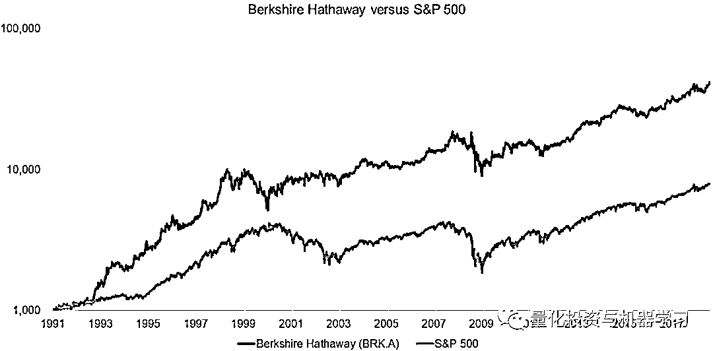
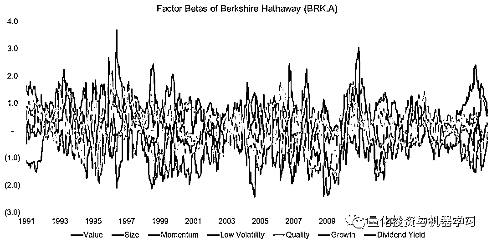
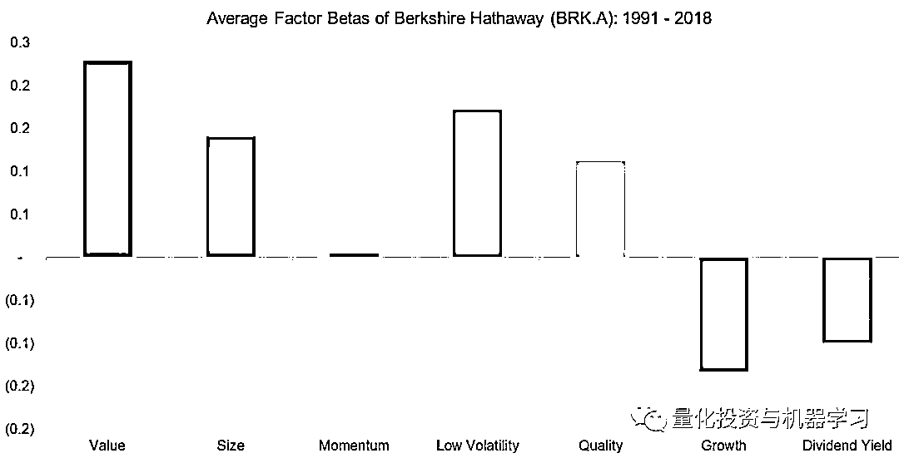
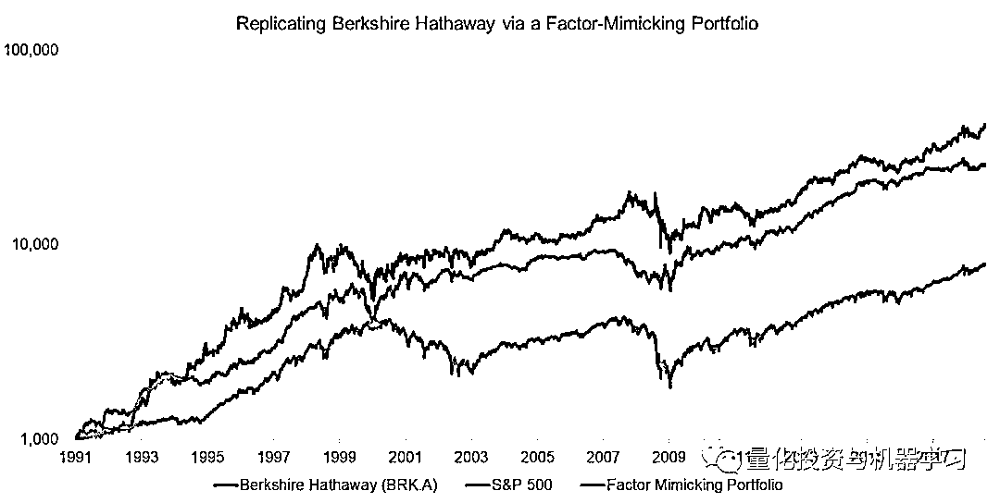
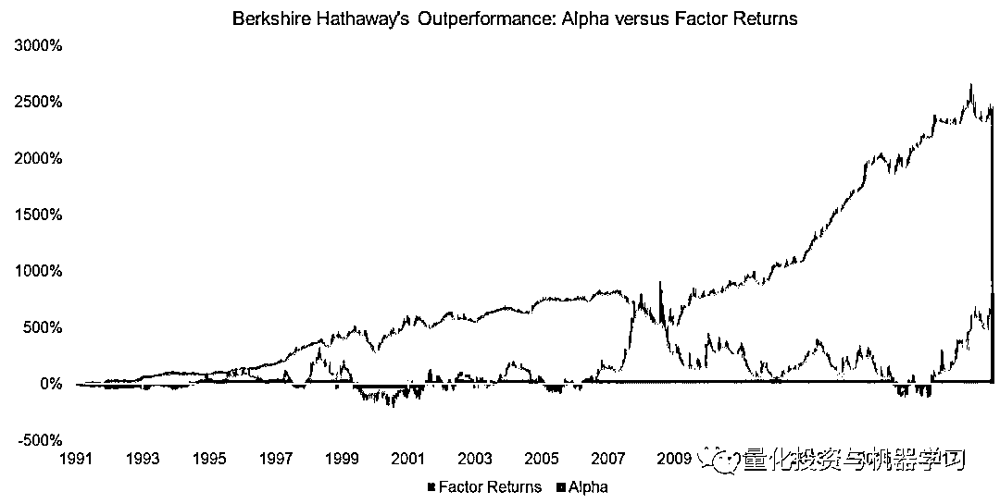

# 巴菲特是因子投资者吗?

> 原文：[`mp.weixin.qq.com/s?__biz=MzAxNTc0Mjg0Mg==&mid=2653291838&idx=1&sn=047e9f0154eb6f866e9b97dd75d02f97&chksm=802dc72bb75a4e3dadb59b3fa718444026815cba34017b675b5dc2c933e8390b19b2beb44d44&scene=27#wechat_redirect`](http://mp.weixin.qq.com/s?__biz=MzAxNTc0Mjg0Mg==&mid=2653291838&idx=1&sn=047e9f0154eb6f866e9b97dd75d02f97&chksm=802dc72bb75a4e3dadb59b3fa718444026815cba34017b675b5dc2c933e8390b19b2beb44d44&scene=27#wechat_redirect)

**标星★公众号     **爱你们♥

作者：Nicolas Rabener

**近期原创文章：**

## ♥ [基于无监督学习的期权定价异常检测（代码+数据）](https://mp.weixin.qq.com/s?__biz=MzAxNTc0Mjg0Mg==&mid=2653290562&idx=1&sn=dee61b832e1aa2c062a96bb27621c29d&chksm=802dc257b75a4b41b5623ade23a7de86333bfd3b4299fb69922558b0cbafe4c930b5ef503d89&token=1298662931&lang=zh_CN&scene=21#wechat_redirect)

## ♥ [5 种机器学习算法在预测股价的应用（代码+数据）](https://mp.weixin.qq.com/s?__biz=MzAxNTc0Mjg0Mg==&mid=2653290588&idx=1&sn=1d0409ad212ea8627e5d5cedf61953ac&chksm=802dc249b75a4b5fa245433320a4cc9da1a2cceb22df6fb1a28e5b94ff038319ae4e7ec6941f&token=1298662931&lang=zh_CN&scene=21#wechat_redirect)

## ♥ [深入研读：利用 Twitter 情绪去预测股市](https://mp.weixin.qq.com/s?__biz=MzAxNTc0Mjg0Mg==&mid=2653290402&idx=1&sn=efda9ea106991f4f7ccabcae9d809e00&chksm=802e3db7b759b4a173dc8f2ab5c298ab3146bfd7dd5aca75929c74ecc999a53b195c16f19c71&token=1330520237&lang=zh_CN&scene=21#wechat_redirect)

## ♥ [Two Sigma 用新闻来预测股价走势，带你吊打 Kaggle](https://mp.weixin.qq.com/s?__biz=MzAxNTc0Mjg0Mg==&mid=2653290456&idx=1&sn=b8d2d8febc599742e43ea48e3c249323&chksm=802e3dcdb759b4db9279c689202101b6b154fb118a1c1be12b52e522e1a1d7944858dbd6637e&token=1330520237&lang=zh_CN&scene=21#wechat_redirect)

## ♥ [利用深度学习最新前沿预测股价走势](https://mp.weixin.qq.com/s?__biz=MzAxNTc0Mjg0Mg==&mid=2653290080&idx=1&sn=06c50cefe78a7b24c64c4fdb9739c7f3&chksm=802e3c75b759b563c01495d16a638a56ac7305fc324ee4917fd76c648f670b7f7276826bdaa8&token=770078636&lang=zh_CN&scene=21#wechat_redirect)

## ♥ [一位数据科学 PhD 眼中的算法交易](https://mp.weixin.qq.com/s?__biz=MzAxNTc0Mjg0Mg==&mid=2653290118&idx=1&sn=a261307470cf2f3e458ab4e7dc309179&chksm=802e3c93b759b585e079d3a797f512dfd0427ac02942339f4f1454bd368ba47be21cb52cf969&token=770078636&lang=zh_CN&scene=21#wechat_redirect)

## ♥ [基于 RNN 和 LSTM 的股市预测方法](https://mp.weixin.qq.com/s?__biz=MzAxNTc0Mjg0Mg==&mid=2653290481&idx=1&sn=f7360ea8554cc4f86fcc71315176b093&chksm=802e3de4b759b4f2235a0aeabb6e76b3e101ff09b9a2aa6fa67e6e824fc4274f68f4ae51af95&token=1865137106&lang=zh_CN&scene=21#wechat_redirect)

## ♥ [人工智能『AI』应用算法交易，7 个必踩的坑！](https://mp.weixin.qq.com/s?__biz=MzAxNTc0Mjg0Mg==&mid=2653289974&idx=1&sn=88f87cb64999d9406d7c618350aac35d&chksm=802e3fe3b759b6f5eca6e777364270cbaa0bf35e9a1535255be9751c3a77642676993a861132&token=770078636&lang=zh_CN&scene=21#wechat_redirect)

## ♥ [神经网络在算法交易上的应用系列（一）](https://mp.weixin.qq.com/s?__biz=MzAxNTc0Mjg0Mg==&mid=2653289962&idx=1&sn=5f5aa65ec00ce176501c85c7c106187d&chksm=802e3fffb759b6e9f2d4518f9d3755a68329c8753745333ef9d70ffd04bd088fd7b076318358&token=770078636&lang=zh_CN&scene=21#wechat_redirect)

## ♥ [预测股市 | 如何避免 p-Hacking，为什么你要看涨？](https://mp.weixin.qq.com/s?__biz=MzAxNTc0Mjg0Mg==&mid=2653289820&idx=1&sn=d3fee74ba1daab837433e4ef6b0ab4d9&chksm=802e3f49b759b65f422d20515942d5813aead73231da7d78e9f235bdb42386cf656079e69b8b&token=770078636&lang=zh_CN&scene=21#wechat_redirect)

## ♥ [如何鉴别那些用深度学习预测股价的花哨模型？](https://mp.weixin.qq.com/s?__biz=MzAxNTc0Mjg0Mg==&mid=2653290132&idx=1&sn=cbf1e2a4526e6e9305a6110c17063f46&chksm=802e3c81b759b597d3dd94b8008e150c90087567904a29c0c4b58d7be220a9ece2008956d5db&token=1266110554&lang=zh_CN&scene=21#wechat_redirect)

## ♥ [优化强化学习 Q-learning 算法进行股市](https://mp.weixin.qq.com/s?__biz=MzAxNTc0Mjg0Mg==&mid=2653290286&idx=1&sn=882d39a18018733b93c8c8eac385b515&chksm=802e3d3bb759b42d1fc849f96bf02ae87edf2eab01b0beecd9340112c7fb06b95cb2246d2429&token=1330520237&lang=zh_CN&scene=21#wechat_redirect)

### 从一个因子的角度来看，是什么推动了伯克希尔哈撒韦公司的优异表现呢？ 

**伯克希尔哈撒韦公司与标普 500**

巴菲特自 1964 年以来一直控制着伯克希尔哈撒韦公司，但他在过去 30 年左右的业绩记录为我们提供了一个足够强大的样本，足以得出一些有关他成功原因的结论。自 1991 年以来，他相对于标普 500 指数的表现尤为突出，为 BRK.A 的股东创造了巨大价值。尽管由于隐含的杠杆作用而具有较高的波动性。

例如，在 2000 年的科技泡沫期间，尽管有一些时期表现不佳，但事实证明，这些表现往往是基于明智的投资决策，这些决策后来转化为更高的回报。

**伯克希尔哈撒韦公司的因子暴露分析**

接下来，我们通过回归分析测量对普通股权因子的 beta 值，对伯克希尔哈撒韦公司进行因子暴露分析。 因子β是时变的，这无助于回答巴菲特的成功是否是因子押注这个问题。

然而，通过对过去 30 年的贝塔系数进行平均，一个清晰的画面出现了：BRK.A 对**价****值、规模、低波动性**和**质量**因子暴露为正，对**成长**和**股息收益率**的因子暴露为负。

当然，这反映出巴菲特**对廉价高质量公司的偏爱，而不是高增长的科技公司**。尽管最近对苹果和其他科技股进行了投资，但这些新增股票更类似于可口可乐等现有蓝筹股，而不是像 Netflix 这样的纯增长型公司。

**复制伯克希尔哈撒韦公司**

由于对伯克希尔哈撒韦公司的因子暴露有了更好的了解，我们可以应用这些数据点来复制具有因子模拟组合的 BRK.A。我们按月计算因子暴露，然后根据 BRK.A 在下个月的风险暴露分配给多空因子投资组合。

这种模仿因子的投资组合与伯克希尔哈撒韦的走势相当接近，因此相对于标普 500 指数也取得了类似的优异表现。当然，这个投资组合是基于历史数据，反映在 BRK.A 的股票价格中并且本质上是滞后的，但伯克希尔哈撒韦的投资组合不会太频繁地改变。

**阿尔法与因子回报**

为什么要通过各种因子来复制伯克希尔哈撒韦的业绩，而不是仅仅通过购买股票来获得巴菲特的专业知识？模仿因子的投资组合通常用于获取不可获取的东西。1996 年以前，大多数散户投资者都买不起伯克希尔哈撒韦公司的股票，当时该公司的股票售价超过每股 3 万美元。巴菲特通过发行面值较低的 B 级股解决了这个问题。

考虑到伯克希尔哈撒韦公司对普通股权因子的重大影响，该因子模拟投资组合有助于投资者区分阿尔法和因子回报。**分析表明，相对于标普 500 指数而言，大部分表现优于因子暴露，随着时间的推移，几乎不会产生阿尔法。**

伯克希尔哈撒韦的粉丝可能会对缺乏阿尔法感到惊讶。但我们也可以说，基于巴菲特创造的财富，他可能是有史以来最好的因子投资者。尽管巴菲特不太可能用这些术语来描述他的投资风格，**但他在选择因子、构建多因子投资组合以及随着时间的推移调整因子组合方面展现了前所未有的技巧。**

**更多想法**

近年来，每年有超过 1000 亿美元投资于以因子为重点的产品。但是，选择因子并将它们组合成多因子投资组合是一项具有挑战性的工作。

因此，伯克希尔哈撒韦公司可能是多因子产品的替代品。毕竟，该公司得到了一位基金经理的支持，这位基金经理有着数十年娴熟管理因子暴露的经验。与聪明的贝塔交易基金（ETF）相比，这一管理费颇具竞争力，而巴菲特在该公司的持股确保了他的利益与投资者的利益保持一致。

*—End—*

量化投资与机器学习微信公众号，是业内垂直于**Quant**、**MFE**、**CST**等专业的主流自媒体。公众号拥有来自**公募、私募、券商、银行、海外**等众多圈内**10W+**关注者。每日发布行业前沿研究成果和最新资讯。

