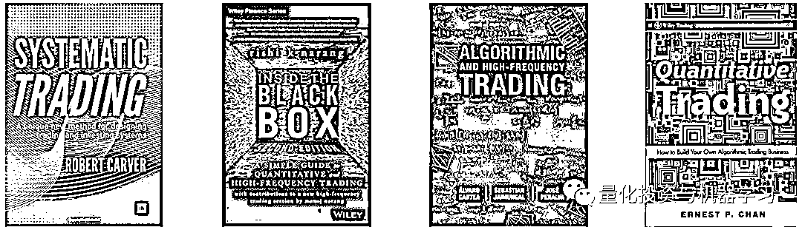
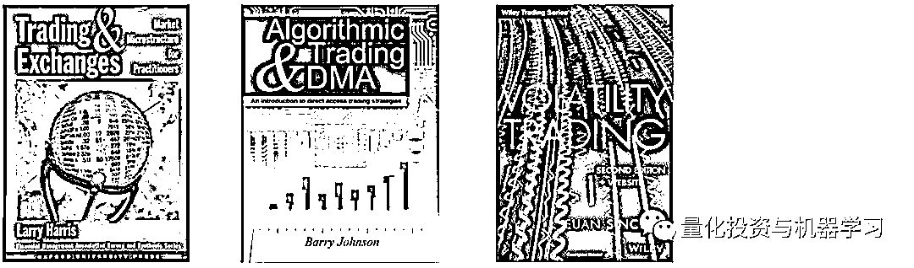
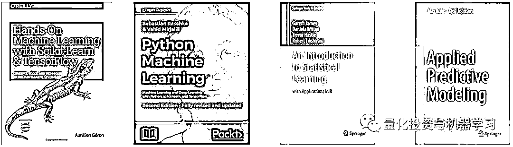
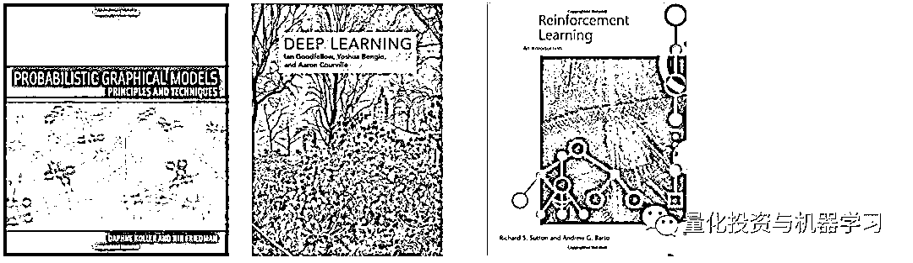
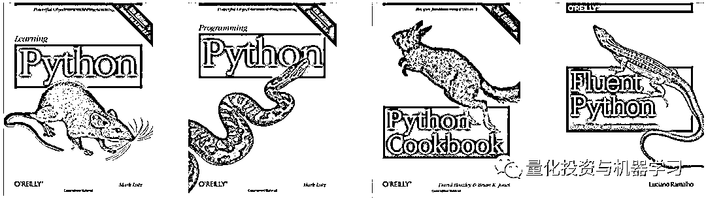
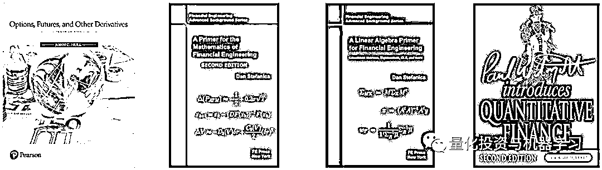
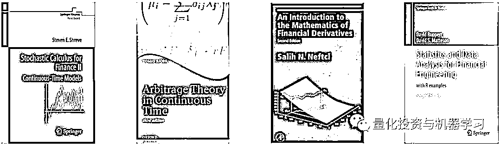
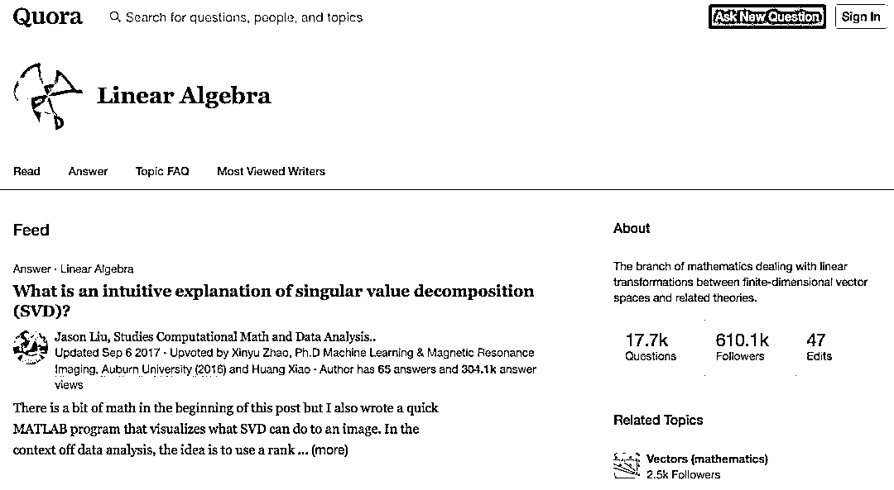
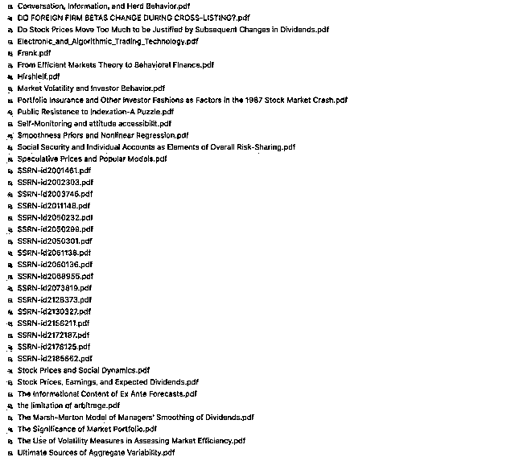

# 新一代量化带货王诞生！Oh My God！

> 原文：[`mp.weixin.qq.com/s?__biz=MzAxNTc0Mjg0Mg==&mid=2653291789&idx=1&sn=e31778d1b9372bc7aa6e57b82a69ec6e&chksm=802dc718b75a4e0ea4c022e70ea53f51c48d102ebf7e54993261619c36f24f3f9a5b63437e9e&scene=27#wechat_redirect`](http://mp.weixin.qq.com/s?__biz=MzAxNTc0Mjg0Mg==&mid=2653291789&idx=1&sn=e31778d1b9372bc7aa6e57b82a69ec6e&chksm=802dc718b75a4e0ea4c022e70ea53f51c48d102ebf7e54993261619c36f24f3f9a5b63437e9e&scene=27#wechat_redirect)

**标星★公众号     **爱你们♥

**近期原创文章：**

## ♥ [基于无监督学习的期权定价异常检测（代码+数据）](https://mp.weixin.qq.com/s?__biz=MzAxNTc0Mjg0Mg==&mid=2653290562&idx=1&sn=dee61b832e1aa2c062a96bb27621c29d&chksm=802dc257b75a4b41b5623ade23a7de86333bfd3b4299fb69922558b0cbafe4c930b5ef503d89&token=1298662931&lang=zh_CN&scene=21#wechat_redirect)

## ♥ [5 种机器学习算法在预测股价的应用（代码+数据）](https://mp.weixin.qq.com/s?__biz=MzAxNTc0Mjg0Mg==&mid=2653290588&idx=1&sn=1d0409ad212ea8627e5d5cedf61953ac&chksm=802dc249b75a4b5fa245433320a4cc9da1a2cceb22df6fb1a28e5b94ff038319ae4e7ec6941f&token=1298662931&lang=zh_CN&scene=21#wechat_redirect)

## ♥ [深入研读：利用 Twitter 情绪去预测股市](https://mp.weixin.qq.com/s?__biz=MzAxNTc0Mjg0Mg==&mid=2653290402&idx=1&sn=efda9ea106991f4f7ccabcae9d809e00&chksm=802e3db7b759b4a173dc8f2ab5c298ab3146bfd7dd5aca75929c74ecc999a53b195c16f19c71&token=1330520237&lang=zh_CN&scene=21#wechat_redirect)

## ♥ [Two Sigma 用新闻来预测股价走势，带你吊打 Kaggle](https://mp.weixin.qq.com/s?__biz=MzAxNTc0Mjg0Mg==&mid=2653290456&idx=1&sn=b8d2d8febc599742e43ea48e3c249323&chksm=802e3dcdb759b4db9279c689202101b6b154fb118a1c1be12b52e522e1a1d7944858dbd6637e&token=1330520237&lang=zh_CN&scene=21#wechat_redirect)

## ♥ [利用深度学习最新前沿预测股价走势](https://mp.weixin.qq.com/s?__biz=MzAxNTc0Mjg0Mg==&mid=2653290080&idx=1&sn=06c50cefe78a7b24c64c4fdb9739c7f3&chksm=802e3c75b759b563c01495d16a638a56ac7305fc324ee4917fd76c648f670b7f7276826bdaa8&token=770078636&lang=zh_CN&scene=21#wechat_redirect)

## ♥ [一位数据科学 PhD 眼中的算法交易](https://mp.weixin.qq.com/s?__biz=MzAxNTc0Mjg0Mg==&mid=2653290118&idx=1&sn=a261307470cf2f3e458ab4e7dc309179&chksm=802e3c93b759b585e079d3a797f512dfd0427ac02942339f4f1454bd368ba47be21cb52cf969&token=770078636&lang=zh_CN&scene=21#wechat_redirect)

## ♥ [基于 RNN 和 LSTM 的股市预测方法](https://mp.weixin.qq.com/s?__biz=MzAxNTc0Mjg0Mg==&mid=2653290481&idx=1&sn=f7360ea8554cc4f86fcc71315176b093&chksm=802e3de4b759b4f2235a0aeabb6e76b3e101ff09b9a2aa6fa67e6e824fc4274f68f4ae51af95&token=1865137106&lang=zh_CN&scene=21#wechat_redirect)

## ♥ [人工智能『AI』应用算法交易，7 个必踩的坑！](https://mp.weixin.qq.com/s?__biz=MzAxNTc0Mjg0Mg==&mid=2653289974&idx=1&sn=88f87cb64999d9406d7c618350aac35d&chksm=802e3fe3b759b6f5eca6e777364270cbaa0bf35e9a1535255be9751c3a77642676993a861132&token=770078636&lang=zh_CN&scene=21#wechat_redirect)

## ♥ [神经网络在算法交易上的应用系列（一）](https://mp.weixin.qq.com/s?__biz=MzAxNTc0Mjg0Mg==&mid=2653289962&idx=1&sn=5f5aa65ec00ce176501c85c7c106187d&chksm=802e3fffb759b6e9f2d4518f9d3755a68329c8753745333ef9d70ffd04bd088fd7b076318358&token=770078636&lang=zh_CN&scene=21#wechat_redirect)

## ♥ [预测股市 | 如何避免 p-Hacking，为什么你要看涨？](https://mp.weixin.qq.com/s?__biz=MzAxNTc0Mjg0Mg==&mid=2653289820&idx=1&sn=d3fee74ba1daab837433e4ef6b0ab4d9&chksm=802e3f49b759b65f422d20515942d5813aead73231da7d78e9f235bdb42386cf656079e69b8b&token=770078636&lang=zh_CN&scene=21#wechat_redirect)

## ♥ [如何鉴别那些用深度学习预测股价的花哨模型？](https://mp.weixin.qq.com/s?__biz=MzAxNTc0Mjg0Mg==&mid=2653290132&idx=1&sn=cbf1e2a4526e6e9305a6110c17063f46&chksm=802e3c81b759b597d3dd94b8008e150c90087567904a29c0c4b58d7be220a9ece2008956d5db&token=1266110554&lang=zh_CN&scene=21#wechat_redirect)

## ♥ [优化强化学习 Q-learning 算法进行股市](https://mp.weixin.qq.com/s?__biz=MzAxNTc0Mjg0Mg==&mid=2653290286&idx=1&sn=882d39a18018733b93c8c8eac385b515&chksm=802e3d3bb759b42d1fc849f96bf02ae87edf2eab01b0beecd9340112c7fb06b95cb2246d2429&token=1330520237&lang=zh_CN&scene=21#wechat_redirect)

## 近日在网上流传一段小学生模仿李佳琪买文具的视频。真的是忒搞笑。

## 精髓是完完全全学到了，建议李佳琦收徒！

一定看看下面的视频

**↓↓↓**

[`v.qq.com/iframe/preview.html?width=500&height=375&auto=0&vid=t0864x8qy15`](https://v.qq.com/iframe/preview.html?width=500&height=375&auto=0&vid=t0864x8qy15)

为了应景，我们的标题也~~~

大家意会就好，不可言传

**言归正传**

定量金融是一门技术含量高、涉及面广的学科。它涵盖金融市场、时间序列分析、风险管理、金融工程、统计学和机器学习。

下面的书籍从每个学科领域的基础开始，逐步增加难度。你不必全部读完，但你应该深入研究部分内容。由**QuantStart**整理！

**定量金融阅读书单**

**帮助你成为一个更好的定量分析师！**

**交易系统**

**机器学习&深度学习**

**Python**

**金融工程**

**公众号往期书单 1**

书单如下，整整 400M+

**后台回复：20181201**

**Jason Brownlee 系列**

**后台回复：5 月超级干货**

**线性代数系列**

一些**高层次**的学习网页：

*   **线性代数**

https://en.wikipedia.org/wiki/Linear_algebra

*   **矩阵（数学）**

https://en.wikipedia.org/wiki/Matrix_(mathematics)

*   **矩阵分解**

https://en.wikipedia.org/wiki/Matrix_decomposition

*   **线性代数主题列表**

https://en.wikipedia.org/wiki/List_of_linear_algebra_topics

*   **Introduction to Linear Algebra, Fifth Edition, Gilbert Strang, 2016.**

*   **Linear Algebra Done Right, Third Edition, 2015.**

*   **No Bullshit Guide To Linear Algebra, Ivan Savov, 2017.**

*   **Matrix Computations, Gene Golub and Charles Van Loan, 2012.**

*   **Numerical Linear Algebra with Applications: Using MATLAB.**

*   **Numerical Linear Algebra with Applications Using MATLAB.**

*   **Applied Multivariate Statistical Analysis, Richard Johnson and Dean Wichern, 2012.**

*   **Lin****ear Algebraand Its Applications David C. Lay, 2016.**

*   **ADVANCED LINEAR ALGEBRA NICHOLAS LOEHR, Virginia Polytechnic Institute and State University Blacksburg, USA, 2014.**

*   **Elementary Linear Algebra, 8e, Ron Larson, 2017.**

*   还有更多优秀的免费在线图书。 在维基百科上查看线性代数页面的末尾，可以看到更多的书籍列表。

https://en.wikipedia.org/wiki/Linear_algebra#Further_reading

**大学课程**

现在许多大学课程提供 PDF 版本的讲义幻灯片，笔记和阅读材料。 有些甚至提供预先录制的视频讲座，这是非常宝贵的。

美国顶尖学校推荐的一些课程包括：

*   **MIT 的线性代数——Gilbert Strang**

https://ocw.mit.edu/courses/mathematics/18-06-linear-algebra-spring-2010/index.htm

*   **The Matrix in Computer Science at Brown by Philip Klein**

http://cs.brown.edu/courses/cs053/current/index.htm

*   **Computational Linear Algebra for Coders at University of San Francisco by Rachel Thomas.**

https://github.com/fastai/numerical-linear-algebra/

**在线课程**

*   **Linear Algebra on Khan Academy**

https://www.khanacademy.org/math/linear-algebra

*   **Linear Algebra: Foundations to Frontiers on edX**

https://www.edx.org/course/laff-linear-algebra-foundations-to-frontiers

**问答平台**

考虑到当前有大量的问答平台，有很多地方可以在线提出有关线性代数的问题。

以下是推荐的最热门的平台，供大家参考学习：

*   **Linear Algebra tag on the Mathematics Stack Exchange**

https://math.stackexchange.com/?tags=linear-algebra

*   **Linear Algebra tag on Cross Validated**

https://stats.stackexchange.com/questions/tagged/linear-algebra

*   **Linear Algebra tag on Stack Overflow**

https://stackoverflow.com/questions/tagged/linear-algebra

*   **Linear Algebra on Quora**

https://www.quora.com/topic/Linear-Algebra

*   **Math Subreddit**

https://www.reddit.com/r/math/

**NumPy 资源**

在 Python 中实现线性代数时，您可能需要 NumPy 的帮助。

*   **NumPy Reference**

https://docs.scipy.org/doc/numpy/reference/

*   **NumPy Array Creation Routines**

https://docs.scipy.org/doc/numpy/reference/routines.array-creation.html

*   **NumPy Array Manipulation Routines**

https://docs.scipy.org/doc/numpy/reference/routines.array-manipulation.html

*   **NumPy Linear Algebra**

https://docs.scipy.org/doc/numpy/reference/routines.linalg.html

*   **SciPy Linear Algebra**

https://docs.scipy.org/doc/scipy/reference/linalg.html

**后台回复：线性代数**

**12 月系列**

**

**后台回复：12 月系列 1**

**R 语言系列**

后台回复：R 语言

**行为经济学专题**

**后台回复：行为经济学**

**贝叶斯系列**

还有好多好多，你们自己点开看吧···

**2017 年**

01. [2016 年全年所有券商金融工程研究报告（共 600 篇）- 第 1 部分](http://mp.weixin.qq.com/s?__biz=MzAxNTc0Mjg0Mg==&mid=2653284668&idx=1&sn=1d099b61ac8a378f39ef99203cfb85af&chksm=802e2b29b759a23f1ce824e84ab55601f8da41ace7877cac3fe97900f1a7147c97a732481841&scene=21#wechat_redirect)

02. [2016 年全年所有券商金融工程研究报告（共 600 篇）- 第 2、3、4 部分](http://mp.weixin.qq.com/s?__biz=MzAxNTc0Mjg0Mg==&mid=2653284678&idx=1&sn=0c29d884ada86f565b5849057fe5cdb6&chksm=802e2b53b759a245db87fe77c211e8f987464d0d188305808b412fb2d36cbc9f4bb707fedde9&scene=21#wechat_redirect)

03. [2016 年全年所有券商金融工程研究报告（共 600 篇）- 第 5、6、7、8、9 部分](http://mp.weixin.qq.com/s?__biz=MzAxNTc0Mjg0Mg==&mid=2653284702&idx=1&sn=c150e541adb6f852459b085a086bf97f&chksm=802e2b4bb759a25de30c981d25e8db6c90e409e0c8ec5303ad0b3fa673abfc01fd4832842c16&scene=21#wechat_redirect)

04. [满满都是干货哦！（附 Matlab 等程序及经典文献 85 篇）](http://mp.weixin.qq.com/s?__biz=MzAxNTc0Mjg0Mg==&mid=2653284807&idx=2&sn=974a470be9d074738ddc076a80aef561&chksm=802e2bd2b759a2c441aef580c25c14dbda749fd9f0a6f764e97ef0011672b1f3b520e225803c&scene=21#wechat_redirect)

[05.【精编干货】史上最全神经网络结构图画图工具介绍，没有之一！](https://mp.weixin.qq.com/s?__biz=MzAxNTc0Mjg0Mg==&mid=2653284913&idx=1&sn=9673d5d7a8f0a6fb06f03c93ef137096&chksm=802e2824b759a132598fdfb12421145e0fc80e20bd1470515cc45337be5610a3e2d74bebaeb3&scene=21#wechat_redirect)

[06. 最新国外机器学习书籍推荐，可直接以获取电子版哦！](https://mp.weixin.qq.com/s?__biz=MzAxNTc0Mjg0Mg==&mid=2653284979&idx=1&sn=ab5c74f1ab19496297398b4c1ff42a15&chksm=802e2866b759a170cbfa4039aa2aa9ca17a9757efee4c2202eccede256ed7ca2f7004eaafee3&scene=21#wechat_redirect)

[07. 国外优秀量化投资书籍推荐（可直接获取电子版，杜绝转发、分享等行为！）](https://mp.weixin.qq.com/s?__biz=MzAxNTc0Mjg0Mg==&mid=2653285014&idx=1&sn=7b008dd3b3c6362e2c8176e87934fc43&chksm=802e2883b759a195d086130716f83b01f88ed702b3db0dfc3bb0a30a0c3aae141ec823fcc5b6&scene=21#wechat_redirect)

08.网上盛传的深度学习 PPT 资料链接: http://pan.baidu.com/s/1eRLk1d4 密码: di64 链接: http://pan.baidu.com/s/1miG4ItM 密码: 61uc

[09. 读书日丨畅游 ML 和量化界（干货哦）](https://mp.weixin.qq.com/s?__biz=MzAxNTc0Mjg0Mg==&mid=2653285137&idx=1&sn=d5c92766a78f302f85a07428b805c555&chksm=802e2904b759a012b0d0e7e59f996f063c0b12b5ef1b4d16d60c9d620f6922a889a50842e537&scene=21#wechat_redirect)

[10. 以色列神秘 AI 研究力量：深度学习的四大失败（视频+论文+ppt 下载）](https://mp.weixin.qq.com/s?__biz=MzAxNTc0Mjg0Mg==&mid=2653285299&idx=1&sn=cef320cbac5c9155868a12c3e374613e&chksm=802e29a6b759a0b0527fac1276cdce6646484fe101d525e0373b58ab925074456faadc81b323&scene=21#wechat_redirect)

[11. 5 月干货第一波来袭（一本书+一套深度学习课程）](https://mp.weixin.qq.com/s?__biz=MzAxNTc0Mjg0Mg==&mid=2653285320&idx=1&sn=f2c5938355ef8f7d462b402b46bbb85b&chksm=802e29ddb759a0cb2f23c963e35b53c3cea69dd4f893a5e0903786a0984c22ddc8306b881bda&scene=21#wechat_redirect)

[12. 高频交易（18 篇论文）+（15 本书籍）+（9 篇研报）+（1 个程序）我们精选的！](https://mp.weixin.qq.com/s?__biz=MzAxNTc0Mjg0Mg==&mid=2653285360&idx=1&sn=e90f550136b74dc8490a9d48886cdd71&chksm=802e29e5b759a0f3288d7c0434e46e2c7f116f21d056401de19df7b4aefda80434d6e509919c&scene=21#wechat_redirect)

[13. 文本挖掘在量化投资中的应用之（28 篇最全券商研报）+（2 个策略程序）](https://mp.weixin.qq.com/s?__biz=MzAxNTc0Mjg0Mg==&mid=2653285408&idx=1&sn=a21c1ba55f954cf8875a45b736977645&chksm=802e2e35b759a72314dda71191036327642ebf168e1bb161ec37f6f56a563c73cc73d72fefda&scene=21#wechat_redirect)

[14. 5 月书籍第四波（2 本深度学习+1 本机器学习）](https://mp.weixin.qq.com/s?__biz=MzAxNTc0Mjg0Mg==&mid=2653285450&idx=1&sn=e14e611a642827c83658c53f63c64981&chksm=802e2e5fb759a749a4729442adcc8dd73d085527e582c154e03e254ad92e6afb80ab4cf71428&scene=21#wechat_redirect)

[15. 【年度干货】2017 上半年所有券商金融工程研究报告（一）](https://mp.weixin.qq.com/s?__biz=MzAxNTc0Mjg0Mg==&mid=2653286032&idx=1&sn=f931e3de55ba425049553d524173b57e&chksm=802e2c85b759a5935002ab01161a92be5ba6c7a5ba64ad12d8be55490fa328973835008ab2dc&scene=21#wechat_redirect)

[16. 【年度干货】2017 上半年所有券商金融工程研究报告（完结）](https://mp.weixin.qq.com/s?__biz=MzAxNTc0Mjg0Mg==&mid=2653286039&idx=2&sn=b6fda2baaff0af634531e3d2928755e0&chksm=802e2c82b759a59496553894c6e3a90e8a47622a228276d61c6c84a3b593b8a81e989926fb5c&scene=21#wechat_redirect)

[17. 【每月系列】2017 年 7 月全部券商金工研报汇总](https://mp.weixin.qq.com/s?__biz=MzAxNTc0Mjg0Mg==&mid=2653286133&idx=1&sn=c8ef7e2df827698971c71c270ec08a65&chksm=802e2ce0b759a5f63de0fb7f635e8959c4f25a5c761d165a0a2312d08e48e48e408dde572642&scene=21#wechat_redirect)

[18. 【每月系列】2017 年 8 月全部券商金融工程研报汇总](https://mp.weixin.qq.com/s?__biz=MzAxNTc0Mjg0Mg==&mid=2653286262&idx=1&sn=8fe879fc4a5189cf027b7496da82681f&chksm=802e2d63b759a47535c7a0dfe279672f10821edcdeb49c6f099a7388feef39e8faeb2aaf30e3&scene=21#wechat_redirect)

[19. 【干货】贝叶斯系列书籍汇总——老样子，无偿分享！](https://mp.weixin.qq.com/s?__biz=MzAxNTc0Mjg0Mg==&mid=2653286349&idx=1&sn=7c5ad32458f812e0b8bcd70a352f4245&chksm=802e2dd8b759a4ceb60bbd7f36d7abb06526dbc6bbd6193cbd1ad2db23104a83a7bcf3c17804&scene=21#wechat_redirect)

[20. 【每月系列】2017 年 9 月全部券商金融工程研报汇总](https://mp.weixin.qq.com/s?__biz=MzAxNTc0Mjg0Mg==&mid=2653286383&idx=1&sn=7c6b9f54ee5727ede261042510daa401&chksm=802e2dfab759a4ec6a3eb346d6e27fceae852aefae361bd93320ba4ffab7a2859899b28ace19&scene=21#wechat_redirect)

[21. 【精选干货】有关行为经济学的（10 多本书籍）+（130 多篇论文）致敬诺贝尔经济学奖！](https://mp.weixin.qq.com/s?__biz=MzAxNTc0Mjg0Mg==&mid=2653286392&idx=1&sn=f3dd6c7926a797f6111701146d78b529&chksm=802e2dedb759a4fb8fd7806f820f874223246a8cf040e394b98a7333857be8ab39a88870cd66&scene=21#wechat_redirect)

[22. 【分享】机器学习和投资组合优化](https://mp.weixin.qq.com/s?__biz=MzAxNTc0Mjg0Mg==&mid=2653286401&idx=2&sn=f6212fb88b9a7096cb85e237f9ebc2fe&chksm=802e3214b759bb0208d3f7b4c98af2b42a9c5e0b4d428621f70842b522dc56330f39cc67cd8a&scene=21#wechat_redirect)

[23. 【干货】Quantitative Finance 杂志关于量化交易领域排名前十的文章（文末有第二期免费赠书活动）](https://mp.weixin.qq.com/s?__biz=MzAxNTc0Mjg0Mg==&mid=2653286500&idx=1&sn=106e28d25e413c816193005ef64c479d&chksm=802e3271b759bb67f5088e176153a51dc945abb373d7eabc5c089adb2ecdd207138bfb667631&scene=21#wechat_redirect)

[24. 【每月系列】2017 年 10 月全部券商金融工程研报汇总](https://mp.weixin.qq.com/s?__biz=MzAxNTc0Mjg0Mg==&mid=2653286510&idx=1&sn=b64aab20dc1ba2e56776aa34090d361d&chksm=802e327bb759bb6d558caf6a2aaf4e86bfaf31a3558573f58c7f5f24d1526756ec0ac1d3a820&scene=21#wechat_redirect)

[25. 【精选】AI 正当时——机器学习、深度学习必备书单！](https://mp.weixin.qq.com/s?__biz=MzAxNTc0Mjg0Mg==&mid=2653286545&idx=1&sn=f91bb0fddb28c49305349850ba99cb55&chksm=802e3284b759bb9256db53ceac2fba56ea1fc91cbfd9009e91ecc38e814fa171712a97ac6617&scene=21#wechat_redirect)

[26. 【精选干货】区块链相关资料汇总](https://mp.weixin.qq.com/s?__biz=MzAxNTc0Mjg0Mg==&mid=2653286579&idx=2&sn=9165141fe04ad64deb8dd203633ac766&chksm=802e32a6b759bbb0a17cfc22c051e997d86ee23fde840d73e67dc5f3c6291c2edc855ccc0ed9&scene=21#wechat_redirect)

[27. 【代码+论文】最全 LSTM 在量化交易中的应用汇总](https://mp.weixin.qq.com/s?__biz=MzAxNTc0Mjg0Mg==&mid=2653286702&idx=1&sn=e4416e23c8b5ab7955a258e1077153e3&chksm=802e333bb759ba2dea0b46da08d0d7b6268090033d6af98b2f72b14909e2935c1e7fbe4bec69&scene=21#wechat_redirect)

[28. 2017 年“第 15 届新财富最佳分析师”金融工程前五获奖名单](https://mp.weixin.qq.com/s?__biz=MzAxNTc0Mjg0Mg==&mid=2653286725&idx=1&sn=7a8a3c2ab0fae018e1fc0e1ddc89c943&chksm=802e3350b759ba46b17543e7024f027bc5d08259b0cd722d781b92b98ee743d5e9c1ddcce4f3&scene=21#wechat_redirect)

-----------------------------------------------

**2016 年**

01. [这么好的干货你们都没发现，可惜啊！](http://mp.weixin.qq.com/s?__biz=MzAxNTc0Mjg0Mg==&mid=2653284248&idx=1&sn=64a9a7f0211eabcfcf1b794ee1e3b6b3&chksm=802e258db759ac9b3fc58e6dfedaddaa6fc829f141f4453e0d8fe4de85cee77f17da18bb0b63&scene=21#wechat_redirect)

02. [【海通证券】 研报大放送（百篇）](http://mp.weixin.qq.com/s?__biz=MzAxNTc0Mjg0Mg==&mid=2653284202&idx=1&sn=f94bdefe70ddcb538ca463ba1c5e5205&chksm=802e257fb759ac69899d8544937600c22637697591fce25d1ed1b72414d975eeeba7cc58c9d8&scene=21#wechat_redirect)

03. [【广发证券】 研报大放送（最全）](http://mp.weixin.qq.com/s?__biz=MzAxNTc0Mjg0Mg==&mid=2653284199&idx=1&sn=4ec9cac078f8057744349c9c953decb2&chksm=802e2572b759ac6438362451289132ab4bb631da5b41e9f2b2545eb5efe50e0d14d6bd3d3015&scene=21#wechat_redirect)

04. [【国泰君安】 研报大放送（精华）](http://mp.weixin.qq.com/s?__biz=MzAxNTc0Mjg0Mg==&mid=2653284196&idx=1&sn=85245caf9148fb965df1c56c963984ba&chksm=802e2571b759ac6772582aea40781bddd6f148f144edc9b8b08606749f3c2c012b907441d59d&scene=21#wechat_redirect)

05. [银行货币、财务管理、金融、投资组合管理](http://mp.weixin.qq.com/s?__biz=MzAxNTc0Mjg0Mg==&mid=2653283840&idx=1&sn=8c54136226549c78ac40a21c56dcb4c9&chksm=802e2415b759ad03b710af655fd45d2c16ae76028bb7c00b62a71a04a2618e2775eec8a395c9&scene=21#wechat_redirect)

06. [各大券商研究报告！](http://mp.weixin.qq.com/s?__biz=MzAxNTc0Mjg0Mg==&mid=2653283773&idx=1&sn=d4604682da0c5563be9da16717d11bf9&scene=21#wechat_redirect)

07\.  [Machine Learning with Python](http://mp.weixin.qq.com/s?__biz=MzAxNTc0Mjg0Mg==&mid=2653283760&idx=1&sn=f4ce3621e3f49425e2fe2acc042e8316&scene=21#wechat_redirect)

08\.  [Market Making 论文分享](http://mp.weixin.qq.com/s?__biz=MzAxNTc0Mjg0Mg==&mid=2653283381&idx=1&sn=48ec361d5b5a0e86e7749ff100a1f335&scene=21#wechat_redirect)

09. [各大券商研报免费分享](http://mp.weixin.qq.com/s?__biz=MzAxNTc0Mjg0Mg==&mid=2653283257&idx=2&sn=49c78925e7f3535b9cad95bf91574519&scene=21#wechat_redirect)

10. [跟踪聪明钱：从分钟行情数据到选股因子](http://mp.weixin.qq.com/s?__biz=MzAxNTc0Mjg0Mg==&mid=2653283181&idx=1&sn=d49547d3ae954126cce54fa3e0ab07ec&scene=21#wechat_redirect)

11. [2016 年最新机器学习书籍电子版](http://mp.weixin.qq.com/s?__biz=MzAxNTc0Mjg0Mg==&mid=2653283159&idx=1&sn=2b5ff2017cabafc48fd3497ae5efa58c&scene=21#wechat_redirect)

12. [国外近期深度学习与机器学习书籍电子版](http://mp.weixin.qq.com/s?__biz=MzAxNTc0Mjg0Mg==&mid=2653283143&idx=1&sn=2316c1a067239aa007196cc8cb2e6c5b&scene=21#wechat_redirect)

13. [关于文本挖掘的资料](http://mp.weixin.qq.com/s?__biz=MzAxNTc0Mjg0Mg==&mid=2653283053&idx=1&sn=1d17fbc17545e561be0664af78304a67&scene=21#wechat_redirect)

14. [机器学习资料整理](http://mp.weixin.qq.com/s?__biz=MzAxNTc0Mjg0Mg==&mid=2653282920&idx=1&sn=6faa96116c590c75d92569351f987e52&scene=21#wechat_redirect)

15. [互联网金融之量化投资深度文本挖掘](http://mp.weixin.qq.com/s?__biz=MzAxNTc0Mjg0Mg==&mid=2653282879&idx=1&sn=12a91c4b8317662fbae470541ebe4683&scene=21#wechat_redirect)

16. [Python 数据结构与算法设计总结篇](http://mp.weixin.qq.com/s?__biz=MzAxNTc0Mjg0Mg==&mid=2653282752&idx=1&sn=5db4c3e27508abc083a7a5f388ddb6ed&scene=21#wechat_redirect)

17. [扎实资料干货分享](http://mp.weixin.qq.com/s?__biz=MzAxNTc0Mjg0Mg==&mid=2653282744&idx=2&sn=c9e9fbf1fd0cd4efa8bf08b9c5f16d8a&scene=21#wechat_redirect)

18. [Quant 需要哪些 Python 知识](http://mp.weixin.qq.com/s?__biz=MzAxNTc0Mjg0Mg==&mid=405488375&idx=2&sn=bb7bd9d7eadea8ad68f1f404bbb0753a&scene=21#wechat_redirect)

19. [量化投资国内外很棒的论坛网站](http://mp.weixin.qq.com/s?__biz=MzAxNTc0Mjg0Mg==&mid=404455727&idx=2&sn=11acb86a872c0b4871ac094136903f3d&scene=21#wechat_redirect)

20. [券商精选研报](http://mp.weixin.qq.com/s?__biz=MzAxNTc0Mjg0Mg==&mid=403960472&idx=1&sn=2ceb55f6699913f371a80c32bb90d88b&scene=21#wechat_redirect)

21. [中国人民大学统计数据挖掘中心专题报告](http://mp.weixin.qq.com/s?__biz=MzAxNTc0Mjg0Mg==&mid=403111936&idx=1&sn=a7c3bacbec312ed928229c258720a01b&scene=21#wechat_redirect)

22. [境外程序化交易发展及监管](http://mp.weixin.qq.com/s?__biz=MzAxNTc0Mjg0Mg==&mid=403111936&idx=3&sn=3455ac2d157d544ce5e8e83ac7dac06e&scene=21#wechat_redirect)

23. [金融数学藏书](http://mp.weixin.qq.com/s?__biz=MzAxNTc0Mjg0Mg==&mid=403111936&idx=4&sn=97822bfa300f3d856d6c9acd8dc24914&scene=21#wechat_redirect)

24. [中国人民大学统计数据挖掘中心专题报告资料](http://mp.weixin.qq.com/s?__biz=MzAxNTc0Mjg0Mg==&mid=403090451&idx=1&sn=b4fe66fd5fc4a6a60f6e7affd9aad5ac&scene=21#wechat_redirect)

25. [中国量化产品现状及未来趋势](http://mp.weixin.qq.com/s?__biz=MzAxNTc0Mjg0Mg==&mid=403090451&idx=2&sn=a11520decea295b42ae55c606462a25b&scene=21#wechat_redirect)

26. [一个人如何从平庸到优秀，再到卓越？](http://mp.weixin.qq.com/s?__biz=MzAxNTc0Mjg0Mg==&mid=403090451&idx=3&sn=c0b2ed8f0443574b8057f6169661cf30&scene=21#wechat_redirect)

27. [Matlab 的内存问题讨论](http://mp.weixin.qq.com/s?__biz=MzAxNTc0Mjg0Mg==&mid=402818387&idx=1&sn=91d699ca797ddb9de064aae2cd92c327&scene=21#wechat_redirect)

28. [牛逼的生活，既可以浪迹天涯也可以朝九晚五](http://mp.weixin.qq.com/s?__biz=MzAxNTc0Mjg0Mg==&mid=402818387&idx=2&sn=90b1a2f95aea5f34e40d4993d759b37f&scene=21#wechat_redirect)

29. [广发证券 2016 年度 A 股策略报告](http://mp.weixin.qq.com/s?__biz=MzAxNTc0Mjg0Mg==&mid=402718883&idx=1&sn=c03205ab570afd8741220f252e0dd90a&scene=21#wechat_redirect)

30. [最新华尔街牛人必读书籍排行后 12 本](http://mp.weixin.qq.com/s?__biz=MzAxNTc0Mjg0Mg==&mid=401959558&idx=2&sn=0561027d6fe8eeaf8a3fef1869b942db&scene=21#wechat_redirect)

31. [银行货币、财务管理、金融、投资组合管理](http://mp.weixin.qq.com/s?__biz=MzAxNTc0Mjg0Mg==&mid=401959558&idx=3&sn=36783a1e1334165ccd3dddd212e88bed&scene=21#wechat_redirect)

32. [我们为什么要做金融，出路在哪里？](http://mp.weixin.qq.com/s?__biz=MzAxNTc0Mjg0Mg==&mid=401959558&idx=4&sn=32392a96b08e6d7f1b9d77192a407774&scene=21#wechat_redirect)

33. [最新华尔街牛人必读书籍排行](http://mp.weixin.qq.com/s?__biz=MzAxNTc0Mjg0Mg==&mid=401910135&idx=1&sn=43d5eb7549281bb9231a3be831302139&scene=21#wechat_redirect)

34. [广发证券金融工程报告第一篇](http://mp.weixin.qq.com/s?__biz=MzAxNTc0Mjg0Mg==&mid=400989792&idx=1&sn=106bfe9965dc7dc5097ae69a85136373&scene=21#wechat_redirect)

35. [量化投资以 Matlab 为语言写的国外好教材](http://mp.weixin.qq.com/s?__biz=MzAxNTc0Mjg0Mg==&mid=401173274&idx=2&sn=67f4bff8c2f6f5892ab6bb6e8c8b9daf&scene=21#wechat_redirect)

36. [北美 18 名校的数据挖掘及机器学习课程汇总](http://mp.weixin.qq.com/s?__biz=MzAxNTc0Mjg0Mg==&mid=401173274&idx=1&sn=2042394ef59aed7a10ca316d75d1c39f&scene=21#wechat_redirect)

37. [深度学习算法掘金 ALPHA 因子](http://mp.weixin.qq.com/s?__biz=MzAxNTc0Mjg0Mg==&mid=401294678&idx=4&sn=1f5c1630b9ecac854016408167cac9c0&scene=21#wechat_redirect)

38. [Algorithmic trading winning strategies and their rationale](http://mp.weixin.qq.com/s?__biz=MzAxNTc0Mjg0Mg==&mid=401294678&idx=3&sn=a4b18379bcf4eab062969464b9a689d1&scene=21#wechat_redirect)

*—End—*

量化投资与机器学习微信公众号，是业内垂直于**Quant**、**MFE**、**CST**等专业的主流自媒体。公众号拥有来自**公募、私募、券商、银行、海外**等众多圈内**10W+**关注者。每日发布行业前沿研究成果和最新资讯。

