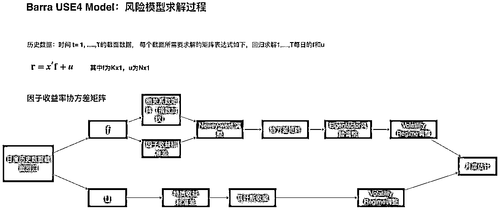
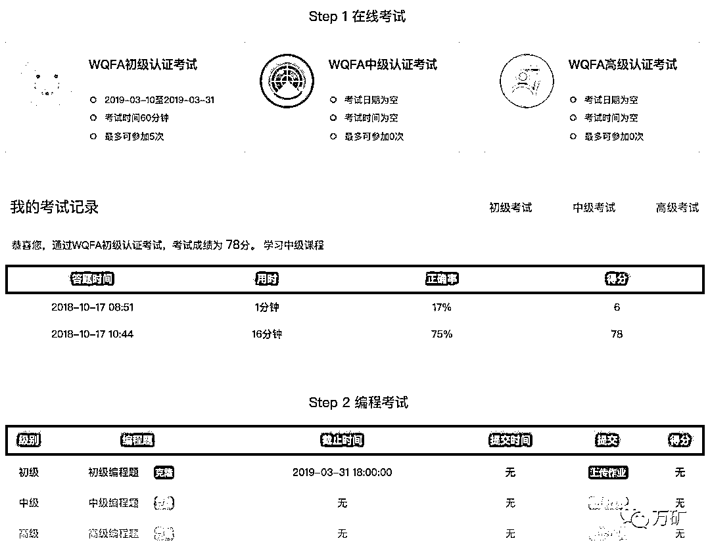

# 别花钱了！别花钱了！别花钱了！

> 原文：[`mp.weixin.qq.com/s?__biz=MzAxNTc0Mjg0Mg==&mid=2653291766&idx=1&sn=f222ef2b01a96bf176a34ce4fede83f3&chksm=802dc6e3b75a4ff56aba7a494b2065072e0bdeadfebfc14859d7d74ba30845226cf23a7f96a2&scene=27#wechat_redirect`](http://mp.weixin.qq.com/s?__biz=MzAxNTc0Mjg0Mg==&mid=2653291766&idx=1&sn=f222ef2b01a96bf176a34ce4fede83f3&chksm=802dc6e3b75a4ff56aba7a494b2065072e0bdeadfebfc14859d7d74ba30845226cf23a7f96a2&scene=27#wechat_redirect)

**标星★公众号     **爱你们♥

**近期原创文章：**

## ♥ [基于无监督学习的期权定价异常检测（代码+数据）](https://mp.weixin.qq.com/s?__biz=MzAxNTc0Mjg0Mg==&mid=2653290562&idx=1&sn=dee61b832e1aa2c062a96bb27621c29d&chksm=802dc257b75a4b41b5623ade23a7de86333bfd3b4299fb69922558b0cbafe4c930b5ef503d89&token=1298662931&lang=zh_CN&scene=21#wechat_redirect)

## ♥ [5 种机器学习算法在预测股价的应用（代码+数据）](https://mp.weixin.qq.com/s?__biz=MzAxNTc0Mjg0Mg==&mid=2653290588&idx=1&sn=1d0409ad212ea8627e5d5cedf61953ac&chksm=802dc249b75a4b5fa245433320a4cc9da1a2cceb22df6fb1a28e5b94ff038319ae4e7ec6941f&token=1298662931&lang=zh_CN&scene=21#wechat_redirect)

## ♥ [深入研读：利用 Twitter 情绪去预测股市](https://mp.weixin.qq.com/s?__biz=MzAxNTc0Mjg0Mg==&mid=2653290402&idx=1&sn=efda9ea106991f4f7ccabcae9d809e00&chksm=802e3db7b759b4a173dc8f2ab5c298ab3146bfd7dd5aca75929c74ecc999a53b195c16f19c71&token=1330520237&lang=zh_CN&scene=21#wechat_redirect)

## ♥ [Two Sigma 用新闻来预测股价走势，带你吊打 Kaggle](https://mp.weixin.qq.com/s?__biz=MzAxNTc0Mjg0Mg==&mid=2653290456&idx=1&sn=b8d2d8febc599742e43ea48e3c249323&chksm=802e3dcdb759b4db9279c689202101b6b154fb118a1c1be12b52e522e1a1d7944858dbd6637e&token=1330520237&lang=zh_CN&scene=21#wechat_redirect)

## ♥ [利用深度学习最新前沿预测股价走势](https://mp.weixin.qq.com/s?__biz=MzAxNTc0Mjg0Mg==&mid=2653290080&idx=1&sn=06c50cefe78a7b24c64c4fdb9739c7f3&chksm=802e3c75b759b563c01495d16a638a56ac7305fc324ee4917fd76c648f670b7f7276826bdaa8&token=770078636&lang=zh_CN&scene=21#wechat_redirect)

## ♥ [一位数据科学 PhD 眼中的算法交易](https://mp.weixin.qq.com/s?__biz=MzAxNTc0Mjg0Mg==&mid=2653290118&idx=1&sn=a261307470cf2f3e458ab4e7dc309179&chksm=802e3c93b759b585e079d3a797f512dfd0427ac02942339f4f1454bd368ba47be21cb52cf969&token=770078636&lang=zh_CN&scene=21#wechat_redirect)

## ♥ [基于 RNN 和 LSTM 的股市预测方法](https://mp.weixin.qq.com/s?__biz=MzAxNTc0Mjg0Mg==&mid=2653290481&idx=1&sn=f7360ea8554cc4f86fcc71315176b093&chksm=802e3de4b759b4f2235a0aeabb6e76b3e101ff09b9a2aa6fa67e6e824fc4274f68f4ae51af95&token=1865137106&lang=zh_CN&scene=21#wechat_redirect)

## ♥ [人工智能『AI』应用算法交易，7 个必踩的坑！](https://mp.weixin.qq.com/s?__biz=MzAxNTc0Mjg0Mg==&mid=2653289974&idx=1&sn=88f87cb64999d9406d7c618350aac35d&chksm=802e3fe3b759b6f5eca6e777364270cbaa0bf35e9a1535255be9751c3a77642676993a861132&token=770078636&lang=zh_CN&scene=21#wechat_redirect)

## ♥ [神经网络在算法交易上的应用系列（一）](https://mp.weixin.qq.com/s?__biz=MzAxNTc0Mjg0Mg==&mid=2653289962&idx=1&sn=5f5aa65ec00ce176501c85c7c106187d&chksm=802e3fffb759b6e9f2d4518f9d3755a68329c8753745333ef9d70ffd04bd088fd7b076318358&token=770078636&lang=zh_CN&scene=21#wechat_redirect)

## ♥ [预测股市 | 如何避免 p-Hacking，为什么你要看涨？](https://mp.weixin.qq.com/s?__biz=MzAxNTc0Mjg0Mg==&mid=2653289820&idx=1&sn=d3fee74ba1daab837433e4ef6b0ab4d9&chksm=802e3f49b759b65f422d20515942d5813aead73231da7d78e9f235bdb42386cf656079e69b8b&token=770078636&lang=zh_CN&scene=21#wechat_redirect)

## ♥ [如何鉴别那些用深度学习预测股价的花哨模型？](https://mp.weixin.qq.com/s?__biz=MzAxNTc0Mjg0Mg==&mid=2653290132&idx=1&sn=cbf1e2a4526e6e9305a6110c17063f46&chksm=802e3c81b759b597d3dd94b8008e150c90087567904a29c0c4b58d7be220a9ece2008956d5db&token=1266110554&lang=zh_CN&scene=21#wechat_redirect)

## ♥ [优化强化学习 Q-learning 算法进行股市](https://mp.weixin.qq.com/s?__biz=MzAxNTc0Mjg0Mg==&mid=2653290286&idx=1&sn=882d39a18018733b93c8c8eac385b515&chksm=802e3d3bb759b42d1fc849f96bf02ae87edf2eab01b0beecd9340112c7fb06b95cb2246d2429&token=1330520237&lang=zh_CN&scene=21#wechat_redirect)

先贴一张图：

  

Barra USE4 Model 

上图是我们**手推 ****Barra USE4 Model** 风险模型求解过程的一部分内容。国内基本一半的量化机构都在和因子挖掘和多因子体系打交道。从 0 到 1 掌握多因子体系不可能一蹴而就，需要在数据处理，模型理论等方面下功夫。

这个问题我们暂不论述，可能是一套教科书式的讲解。让我们先来点你们迫切需要的，然后再回归到开始的问题。

提起  ，可能你会想到这样的画面：  

写论文查数据、阅读财经新闻、查看大盘行情等等。

除了这些。Wind 在大多数人心目中，脱口而出的就是：

数 据

Data

因子挖掘、因子分析就需要有强大的数据支持。

如果你**没有**  终端。

如果你想**使用海量**  金融数据。

**有办法嘛？**

**有**

让  来满足你！

因子分析&研究其中很重要的一个环节就是数据的储备。**你要有足够多的数据，才能挖掘各种各样因子，才能发现属于你的 Alpha！**

**收费吗？**

**完全免费**

划重点

 是  **唯一一个面向互联网的量化平台**，内嵌 Python API 数据接口，与终端完全切合！

你们在  终端里看到的代码生成器（**CG**）长这样：

** **长这样：

虽然长得不一样，但是他们的**功能使用**、**数据输出**、**代码生成**都是**一模一样！**

具体使用：

从选择证券代码、指标选择、日期设置、参数设置，到生成一段数据 API 代码，共 5 个步骤。最后只需复制粘贴生成代码到 Notebook 单元格中即可。

划重点

 提供了强大的金融数据支持，涵盖：

全市场投资品种全覆盖

全市场投资品种全覆盖

**挖因子够不够？**

**不够还有**

划重点

  

我们还为大家提供了现成的部分因子量化研究和投资所需因子的数据库——量化因子库。包含**20+大类，400+个因子**，提供 A 股市场上市以来的所有因子数据。

**优势 1 ****Point in Time**

**提供每个时点发布的报表数据，避免在回测中引用未来数据！****利用万矿平台进行测量搭建与回测，提高回测结果的准确性。**

****优势 2 ****多维衍生****

**提供**多维度衍生计算报表及指标**，无论是你想根据 MRQ（最新一季）财务报表或是根据 TTM（滚动 12 个月）。**

****优势 3 ** **更新及时****

**因子库的相关数据在**交易日当天全部更新完毕**。**

****优势 4 ** **回测分析****

**从**上市至今数据均保留**，**20+余年**可回测。**

****优势 5 ** **信息准确****

****配备专业的数据团队进行因子库设计、开以及后期维护工作，**人工校验与 IT 智能相结合**，确保因子库信息准确。****

****要用一个词来形容  数据的话：****

********海 量********

******一点都不夸张******

******与国内其他量化平台， **在数据方面占有绝对的优势！********

******有了数据，做因子分析和多因子策略还得有工具， **因子分析利器：********

********WindAlpha********

******因子分析工具******

******划重点******

************

******多因子研究过程中，因子数据的获取、分析及筛选是很重要但也是很繁琐的过程，因子分析一般分为以下几个步骤：IC 分析、收益率分析、换手率分析及板块分析。万矿推出的因子分析工具 WindAlpha，结合万矿的量化因子库，可以很方便的进行因子分析及筛选。WindAlpha**支持从因子数据的获取处理到单因子分析，再到多因子组合选股**。同时具备**完整的风险因子模型**：从**因子构造、到风险建模、到产生组合、到业绩回顾**，让你进行一站式因子测试和研究。******

********▍可视化展示案例********

******单因子检验中的分组平均收益直方图、分组净值、多空净值、IC 时序图、换手率。 多因子复合的过程中：因子间的相关系数、复合因子选股表现等。******

************

**************** 

******板块分析******

********左手海量数据********

********右手给力工具********

******接下来******

********手把手教你********

******千呼万唤始出来，全网最用♥的因子分析课程：******

********WQFA********

******计划******

********收费吗？********

******不要 4998******

******不要 388******

******不要 199******

********完全免费********

******划重点******

************** 

********WQFA**英文全称 WindQuant Quantitative Finance Analyst（万矿量化金融分析师）。由**万矿**联合**众多金融机构**以及**高校**，共同开展的一项专业量化人才培养计划。****** 

******目前已开课 26 节，累计**12 万+**收看量，课程学员来自**高校、公募、私募、券商**等众多金融机构。******

****** 作为中国领先的金融数据和分析工具服务商：******

********有责任、有义务、有情怀********

********** 为**所有****机构用户**、**互联网用户**提供免费的课程与培训。我们为大家准备的每一门课程都是联合  各部门**精英科研力量**，力求：******

********专业、专业、专业********

******多因子分析课程目前总共 6 个课时。每节课 1 小时左右：******

********视频 + Notebook********

********▍初级课程（2 节）********

******因子理解 **→** 多因子选股体系搭建**→**单因子选股具体流程 **→ **因子分析 **→**多因子组合分析 **→** AlphaModel **→ **多因子选股分析实战******

********▍中级课程（2 节）********

******因子暴露与因子收益 **→** 基本面因子模型 **→**经济因子模型 **→** Fama-Fench 三因子模型**→** 收益模型与风险模型 **→** Barra 风险模型 **→** 组合风险管理应用******

******部分课程预览******

************

************

************

************

************

******还有你们在最开始看到的手推 Barra 模型教案：******

************

********▍课外导师课程（2 节）********

****** 还邀请了各大机构的资深量化大咖，为大家带来更深层次的学习。******

************************

********课程一：高质量动量策略********

******导师：石川******

******个人公众号： **[川总写](https://mp.weixin.qq.com/s?__biz=MzIyMDEwNDk1Mg==&mid=2650877825&idx=1&sn=485602b08ac9ccc7c2bafbad5decda91&scene=21#wechat_redirect)量化******** 

******知乎专栏：*https:**//zhuanlan.zhihu.com/mitcshi*******

******授课目标******

******1、在实证金融的资本资产定价研究中，动量因子是主流因子之一。在全世界各个国家的股票、期货、外汇等市场中都能找到它的身影。******

******2、本课程从动量因子的历史出发介绍了动量因子在选股上的应用，并说明动量因子背后的成因是错误定价而非未知风险，并以此出发提出了升级版的动量策略，获得了更好的风险收益比。******

******课程大纲******

******1、动量策略历史概述****** 

******2、基础版动量策略******

******3、升级版动量策略      ******

******4、基础版策略与升级版策略对比分析******

******5、动量策略并不适合所有人******

******6、总结******

******7、参考******

******部分课程内容******

************

********课程二：因****子择时——****分类预测模型********

********导师：周萧潇********

********光大金工公众号：[ **EBQuant**](https://mp.weixin.qq.com/s?__biz=MzU1MDAwNDY4OA==&mid=2247489577&idx=1&sn=01f8d3f8fed191a42d00d553d43f2881&scene=21#wechat_redirect)********

********课程大纲********

********1、光大多因子测试框架********

********2、“Alpha1.0”组合构建方式********

********3、SVM 因子择时“Alpha2.0”********

********部分课程内容********

****************

****************

**********这还没完**********

********不光是学习，WQFA 还设立了认证考试，每一级都会颁发证书。********

********划重点********

**************** 

********给大家讲几个真实的案例：********

********1、某高校量化专业的授课老师，组织学生统一学习万矿，并要求通过 WQFA 认证考试，**进行学业测试**。********

********2、某券商要求所有销售**必须通过 WQFA 认证考试**，学习量化知识与 Python 编程。********

********···********

********证书申请页面********

****************

********证书（初级）样例********

****************

*********每张证书都经 Wind 授权认证，编号可在官网查询********

**********重申一次**********

********上面介绍的：**数据、工具、课程**********

**********完全免费**********

********我们希望把********

**********最精准海量的数据**********

**********最专业权威的课程**********

********奉献给全网用户********

********这是 作为中国领先金融数据务商的********

**********责任、义务**********

********差点忘记说了******** 

********所有课程在********

**********www.windquant.com 【学院】**页面********

********全网用户可登录网页版********

***********www.windquant.com***********

> > **********Wind****数据免费使用** ********

********万矿内嵌 Wind Python API 数据接口。为全网用户提供全市场**股票、债券、基金、商品、指数、外汇、期权**等 7 个品种的历史**日线、Tick、分****钟**和**实时行情**数据，以及**中国市场所有品种**的专题统计报表和**中国及****海外股票板块数据、宏观数据**等。********

****************

*********—End—********* 

********量化投资与机器学习微信公众号，是业内垂直于**Quant**、**MFE**、**CST**等专业的主流自媒体。公众号拥有来自**公募、私募、券商、银行、海外**等众多圈内**10W+**关注者。每日发布行业前沿研究成果和最新资讯。********

****************