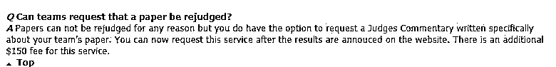

# 美国大学生数学建模竞赛：没有绝对的公平！

> 原文：[`mp.weixin.qq.com/s?__biz=MzAxNTc0Mjg0Mg==&mid=2653291751&idx=1&sn=c5810652aa3ca9c271d51917af9e6445&chksm=802dc6f2b75a4fe443f80519998a8575c42b744e5d1028cd507c59acee4518d1add57a441cb7&scene=27#wechat_redirect`](http://mp.weixin.qq.com/s?__biz=MzAxNTc0Mjg0Mg==&mid=2653291751&idx=1&sn=c5810652aa3ca9c271d51917af9e6445&chksm=802dc6f2b75a4fe443f80519998a8575c42b744e5d1028cd507c59acee4518d1add57a441cb7&scene=27#wechat_redirect)

**标星★公众号     **爱你们♥

文章作者：超级数学建模

**近期原创文章：**

## ♥ [基于无监督学习的期权定价异常检测（代码+数据）](https://mp.weixin.qq.com/s?__biz=MzAxNTc0Mjg0Mg==&mid=2653290562&idx=1&sn=dee61b832e1aa2c062a96bb27621c29d&chksm=802dc257b75a4b41b5623ade23a7de86333bfd3b4299fb69922558b0cbafe4c930b5ef503d89&token=1298662931&lang=zh_CN&scene=21#wechat_redirect)

## ♥ [5 种机器学习算法在预测股价的应用（代码+数据）](https://mp.weixin.qq.com/s?__biz=MzAxNTc0Mjg0Mg==&mid=2653290588&idx=1&sn=1d0409ad212ea8627e5d5cedf61953ac&chksm=802dc249b75a4b5fa245433320a4cc9da1a2cceb22df6fb1a28e5b94ff038319ae4e7ec6941f&token=1298662931&lang=zh_CN&scene=21#wechat_redirect)

## ♥ [深入研读：利用 Twitter 情绪去预测股市](https://mp.weixin.qq.com/s?__biz=MzAxNTc0Mjg0Mg==&mid=2653290402&idx=1&sn=efda9ea106991f4f7ccabcae9d809e00&chksm=802e3db7b759b4a173dc8f2ab5c298ab3146bfd7dd5aca75929c74ecc999a53b195c16f19c71&token=1330520237&lang=zh_CN&scene=21#wechat_redirect)

## ♥ [Two Sigma 用新闻来预测股价走势，带你吊打 Kaggle](https://mp.weixin.qq.com/s?__biz=MzAxNTc0Mjg0Mg==&mid=2653290456&idx=1&sn=b8d2d8febc599742e43ea48e3c249323&chksm=802e3dcdb759b4db9279c689202101b6b154fb118a1c1be12b52e522e1a1d7944858dbd6637e&token=1330520237&lang=zh_CN&scene=21#wechat_redirect)

## ♥ [利用深度学习最新前沿预测股价走势](https://mp.weixin.qq.com/s?__biz=MzAxNTc0Mjg0Mg==&mid=2653290080&idx=1&sn=06c50cefe78a7b24c64c4fdb9739c7f3&chksm=802e3c75b759b563c01495d16a638a56ac7305fc324ee4917fd76c648f670b7f7276826bdaa8&token=770078636&lang=zh_CN&scene=21#wechat_redirect)

## ♥ [一位数据科学 PhD 眼中的算法交易](https://mp.weixin.qq.com/s?__biz=MzAxNTc0Mjg0Mg==&mid=2653290118&idx=1&sn=a261307470cf2f3e458ab4e7dc309179&chksm=802e3c93b759b585e079d3a797f512dfd0427ac02942339f4f1454bd368ba47be21cb52cf969&token=770078636&lang=zh_CN&scene=21#wechat_redirect)

## ♥ [基于 RNN 和 LSTM 的股市预测方法](https://mp.weixin.qq.com/s?__biz=MzAxNTc0Mjg0Mg==&mid=2653290481&idx=1&sn=f7360ea8554cc4f86fcc71315176b093&chksm=802e3de4b759b4f2235a0aeabb6e76b3e101ff09b9a2aa6fa67e6e824fc4274f68f4ae51af95&token=1865137106&lang=zh_CN&scene=21#wechat_redirect)

## ♥ [人工智能『AI』应用算法交易，7 个必踩的坑！](https://mp.weixin.qq.com/s?__biz=MzAxNTc0Mjg0Mg==&mid=2653289974&idx=1&sn=88f87cb64999d9406d7c618350aac35d&chksm=802e3fe3b759b6f5eca6e777364270cbaa0bf35e9a1535255be9751c3a77642676993a861132&token=770078636&lang=zh_CN&scene=21#wechat_redirect)

## ♥ [神经网络在算法交易上的应用系列（一）](https://mp.weixin.qq.com/s?__biz=MzAxNTc0Mjg0Mg==&mid=2653289962&idx=1&sn=5f5aa65ec00ce176501c85c7c106187d&chksm=802e3fffb759b6e9f2d4518f9d3755a68329c8753745333ef9d70ffd04bd088fd7b076318358&token=770078636&lang=zh_CN&scene=21#wechat_redirect)

## ♥ [预测股市 | 如何避免 p-Hacking，为什么你要看涨？](https://mp.weixin.qq.com/s?__biz=MzAxNTc0Mjg0Mg==&mid=2653289820&idx=1&sn=d3fee74ba1daab837433e4ef6b0ab4d9&chksm=802e3f49b759b65f422d20515942d5813aead73231da7d78e9f235bdb42386cf656079e69b8b&token=770078636&lang=zh_CN&scene=21#wechat_redirect)

## ♥ [如何鉴别那些用深度学习预测股价的花哨模型？](https://mp.weixin.qq.com/s?__biz=MzAxNTc0Mjg0Mg==&mid=2653290132&idx=1&sn=cbf1e2a4526e6e9305a6110c17063f46&chksm=802e3c81b759b597d3dd94b8008e150c90087567904a29c0c4b58d7be220a9ece2008956d5db&token=1266110554&lang=zh_CN&scene=21#wechat_redirect)

## ♥ [优化强化学习 Q-learning 算法进行股市](https://mp.weixin.qq.com/s?__biz=MzAxNTc0Mjg0Mg==&mid=2653290286&idx=1&sn=882d39a18018733b93c8c8eac385b515&chksm=802e3d3bb759b42d1fc849f96bf02ae87edf2eab01b0beecd9340112c7fb06b95cb2246d2429&token=1330520237&lang=zh_CN&scene=21#wechat_redirect)

**当我们参加竞赛时**

**到底参加的是什么？**

**正文**

美国大学生数学建模竞赛（MCM/ICM）是由美国数学及其应用联合会主办，是唯一的国际性数学建模竞赛。赛题内容涉及经济、管理、环境、资源、生态、医学、安全、等众多领域。

竞赛要求三人（本科生）为一组，在四天时间内，就指定的问题完成一篇应用型论文，可以说是现今各类数学建模竞赛的鼻祖

近日，美赛成绩公布的 5 天之后，中国工业与应用数学学会却发表了这样一则通告：

首先，简单介绍下什么是中国工业与应用数学学会。

中国工业与应用数学学会是全国大学生数学建模竞赛（简称国赛）的**主办方和指导单位。**

那么，为什么国赛官方会极力否认它们之间的关系呢？相信今年参加过美赛的同学已经猜到了：**2019 年美赛 DW 事件**。  

****什么是 DW 事件?****

简单来说，DW 就是主办方认为参赛队伍存在作弊行为。

现在来看看今年的 DW 的比例：

从上图可以看到，今年美赛 DW 的比率（7.73%）比 O（0.14%）、F（0.17%）、M（7.03%）的获奖比率加起来还高。除了比率极高外，成绩为 DW 的全是中国参赛选手。

据统计，今年美赛共有 25376 支队伍参加，其中中国队伍有 24904 支，占总参赛队伍的 98%（不包括在美留学生）。按一支队伍 3 个人算，成绩为 DW 的中国选手共有 5883 名。

有人会问：中国学生的素质真的这么低吗？

**其实这个说法并不正确。**  

**许多学生表示自己在比赛时没有用网络求助他人或者抄袭任何人的方案。**自己在 4 天内和队友一起通宵熬夜写出一篇原创的论文，最后却被莫名其妙地取消了资格，十分的不甘心，于是向美赛主办方提出了申诉，但主办方的态度却令人心寒：

美赛主办方回复 

简单来讲就是，美赛主办方不会继续采取什么措施，选手明年可以继续缴费参赛，不受影响。如果选手还想继续申诉，进行论文重审，那么只能再给主办方 150 刀，主办方才会查清。

主办方对论文重审回复

作为一个国际性的大赛，如此不尊重中国队员的申诉，避重就轻，不正面回复的官方态度，完全不能说服参赛选手。

这样令人心寒的表态也让参赛者感受到了主办方**“有错不改，你奈我何”**的高傲与无礼的态度。

**一个有点变味的比赛**

数学建模，是一个通过建立数学模型，解决实际应用问题的方法，是很多应用学科的核心内容。

因此，为了提高中国学生的**数学应用能力，用知识解决实际问题的能力**，中国高校的老师们在国内开始自发的推广、宣传、组织学生参加国赛和美赛。

美赛官网

起初，美国数学建模大赛整个比赛的组织、含金量，做得也比较到位，得到了很多高校的认可，也承认该奖项能够按照国际级奖项给学生们的综合测评进行加分。

某高校综合评测加分细则

除了加分外，美赛还有一个和其他重要的数学竞赛不同的地方，该比赛着重于研究、创意、团队合作以及沟通，这刚好也很符合，我们现在对人才对孩子的培养方针。

但是，换言之，该比赛是没有标准答案，只要你的数学模型言之有理，符合实际情况，有实际借鉴意义即可。

维基百科

加分加的多、高校都认可、评判标准有点模糊，这就让该比赛在国内就有些变味了。越来越多的人，希望能够浑水摸鱼拿个大奖，而跑去参加比赛。

面对激增的参赛选手，参差不齐的蹩脚英语比赛论文，美赛组织方的处理方法就是邀请中国国内的老师、专家、教授去审中国的比赛论文，这开始就让美赛变得有点奇怪了。

每年中国高校交昂贵的参赛费用，但是美赛在中国的**推广、组织、宣传、审稿阅卷，全是中国人完成的，美赛组织方只提供了一个报名渠道**。让该比赛赤裸裸的变成了一个印钞机。

> 2019 年，有近 25000 支参赛队伍，每支队伍 100 美元的报名费，按汇率 6.7 算，所有高校的报名费就要 1675 万的人民币。

而且现在连售后也不搞了，有些学生莫名被扣上请外援的帽子，心有不甘，想要得到更好的答复，还要再交 150 美元。

除了 DW 事件，面对中国学生的质疑，美赛主办方没有给出好的答复外，美赛之前也发生过不少的问题。

** 美赛的一些问题**

**1、主办方违背一个中国原则**

2018 年美赛主办方给每个参赛者发送了一份调查问卷，然而问卷中却出现了“中中华民国”和“中国人民共和国”两个中国：  

主办方调查问卷 

这次事件，也被共青团点名批评：

# **2、参赛队伍的支付信用卡被大量盗刷**

# 美赛主办方一直坚称从不记录参赛队伍的支付账号信息，直到 2018 年赛后出现大量 visa 卡被盗刷遭到曝光。

# 有的参赛选手在美赛报名网站漏洞中也发现了选手的数据库账户，其中包括选手的住址，电话，用于账单付款的信用卡信息等。  

# 在主办方造成了中国参赛队的财产损失的情况下，并没有进行道歉或赔偿，只发出了一些无实质内容的声明：

**写在最后**

其实，大部分高校都是十分鼓励学生参与一些高水平的赛事，尤其是理工科专业。

美赛作为数学建模领域唯一个国际性的大奖，它的加分程度高于国赛，获奖难度不高于国赛综测加分！

这一现象导致许多高校的学生更加偏向于美赛，中国参赛人数也是快速增长，19 年国人参加比例达到了恐怖的 98%。

**所谓权利越大责任就越大**，作为本该含金量最高的美赛应该认清自己的地位，建立一套更加公平的体系，降低评分的主观性，从而吸引更多学生的参加，而不是用模糊不清的公告让学生莫名躺枪，这种不严谨的学术风气会持续地损害建设中国的下一代，让参赛学生对学术失去信心。

**不管是美赛还是国赛，它们的初心都不是为了让学生加分、保送，最重要的还是通过竞赛提升学生的硬实力，更好的为国家输出高端人才。**

*—End—*

量化投资与机器学习微信公众号，是业内垂直于**Quant**、**MFE**、**CST**等专业的主流自媒体。公众号拥有来自**公募、私募、券商、银行、海外**等众多圈内**10W+**关注者。每日发布行业前沿研究成果和最新资讯。

