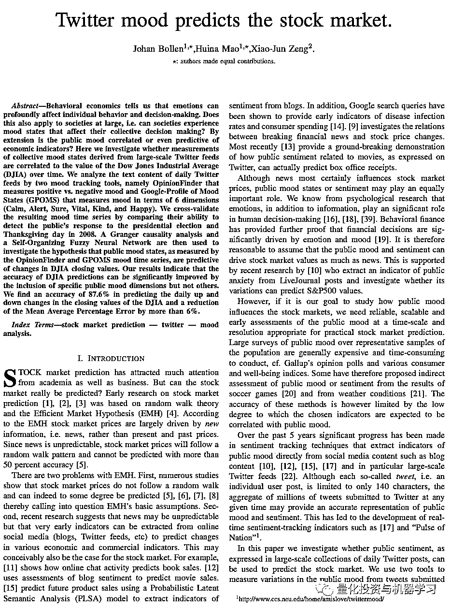
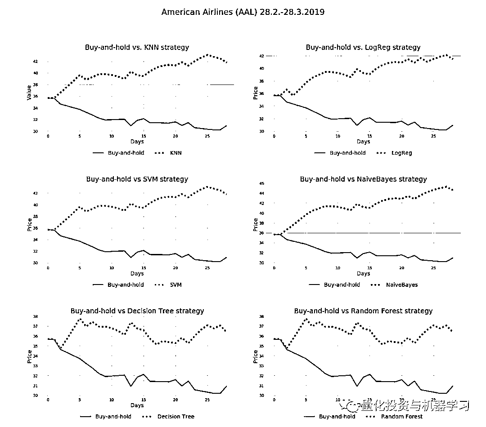
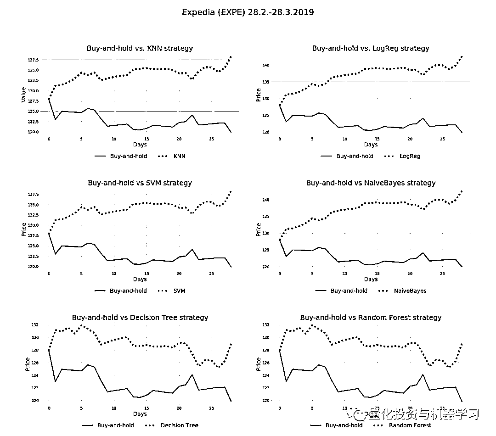

# 最新 NLP 研究 | Twitter 上的情绪如何预测股价走势（附代码）

> 原文：[`mp.weixin.qq.com/s?__biz=MzAxNTc0Mjg0Mg==&mid=2653291745&idx=1&sn=860c56fb01d0a6277476b06a0db68148&chksm=802dc6f4b75a4fe2e7e202bd278daa413b949e947dac5cfbcb82e9d25ca48e7f0443a899f1cf&scene=27#wechat_redirect`](http://mp.weixin.qq.com/s?__biz=MzAxNTc0Mjg0Mg==&mid=2653291745&idx=1&sn=860c56fb01d0a6277476b06a0db68148&chksm=802dc6f4b75a4fe2e7e202bd278daa413b949e947dac5cfbcb82e9d25ca48e7f0443a899f1cf&scene=27#wechat_redirect)

**标星★公众号     **爱你们♥

本期作者：Jan Nordin

本期编译：Allen | 公众号编辑部成员

**近期原创文章：**

## ♥ [基于无监督学习的期权定价异常检测（代码+数据）](https://mp.weixin.qq.com/s?__biz=MzAxNTc0Mjg0Mg==&mid=2653290562&idx=1&sn=dee61b832e1aa2c062a96bb27621c29d&chksm=802dc257b75a4b41b5623ade23a7de86333bfd3b4299fb69922558b0cbafe4c930b5ef503d89&token=1298662931&lang=zh_CN&scene=21#wechat_redirect)

## ♥ [5 种机器学习算法在预测股价的应用（代码+数据）](https://mp.weixin.qq.com/s?__biz=MzAxNTc0Mjg0Mg==&mid=2653290588&idx=1&sn=1d0409ad212ea8627e5d5cedf61953ac&chksm=802dc249b75a4b5fa245433320a4cc9da1a2cceb22df6fb1a28e5b94ff038319ae4e7ec6941f&token=1298662931&lang=zh_CN&scene=21#wechat_redirect)

## ♥ [深入研读：利用 Twitter 情绪去预测股市](https://mp.weixin.qq.com/s?__biz=MzAxNTc0Mjg0Mg==&mid=2653290402&idx=1&sn=efda9ea106991f4f7ccabcae9d809e00&chksm=802e3db7b759b4a173dc8f2ab5c298ab3146bfd7dd5aca75929c74ecc999a53b195c16f19c71&token=1330520237&lang=zh_CN&scene=21#wechat_redirect)

## ♥ [Two Sigma 用新闻来预测股价走势，带你吊打 Kaggle](https://mp.weixin.qq.com/s?__biz=MzAxNTc0Mjg0Mg==&mid=2653290456&idx=1&sn=b8d2d8febc599742e43ea48e3c249323&chksm=802e3dcdb759b4db9279c689202101b6b154fb118a1c1be12b52e522e1a1d7944858dbd6637e&token=1330520237&lang=zh_CN&scene=21#wechat_redirect)

## ♥ [利用深度学习最新前沿预测股价走势](https://mp.weixin.qq.com/s?__biz=MzAxNTc0Mjg0Mg==&mid=2653290080&idx=1&sn=06c50cefe78a7b24c64c4fdb9739c7f3&chksm=802e3c75b759b563c01495d16a638a56ac7305fc324ee4917fd76c648f670b7f7276826bdaa8&token=770078636&lang=zh_CN&scene=21#wechat_redirect)

## ♥ [一位数据科学 PhD 眼中的算法交易](https://mp.weixin.qq.com/s?__biz=MzAxNTc0Mjg0Mg==&mid=2653290118&idx=1&sn=a261307470cf2f3e458ab4e7dc309179&chksm=802e3c93b759b585e079d3a797f512dfd0427ac02942339f4f1454bd368ba47be21cb52cf969&token=770078636&lang=zh_CN&scene=21#wechat_redirect)

## ♥ [基于 RNN 和 LSTM 的股市预测方法](https://mp.weixin.qq.com/s?__biz=MzAxNTc0Mjg0Mg==&mid=2653290481&idx=1&sn=f7360ea8554cc4f86fcc71315176b093&chksm=802e3de4b759b4f2235a0aeabb6e76b3e101ff09b9a2aa6fa67e6e824fc4274f68f4ae51af95&token=1865137106&lang=zh_CN&scene=21#wechat_redirect)

## ♥ [人工智能『AI』应用算法交易，7 个必踩的坑！](https://mp.weixin.qq.com/s?__biz=MzAxNTc0Mjg0Mg==&mid=2653289974&idx=1&sn=88f87cb64999d9406d7c618350aac35d&chksm=802e3fe3b759b6f5eca6e777364270cbaa0bf35e9a1535255be9751c3a77642676993a861132&token=770078636&lang=zh_CN&scene=21#wechat_redirect)

## ♥ [神经网络在算法交易上的应用系列（一）](https://mp.weixin.qq.com/s?__biz=MzAxNTc0Mjg0Mg==&mid=2653289962&idx=1&sn=5f5aa65ec00ce176501c85c7c106187d&chksm=802e3fffb759b6e9f2d4518f9d3755a68329c8753745333ef9d70ffd04bd088fd7b076318358&token=770078636&lang=zh_CN&scene=21#wechat_redirect)

## ♥ [预测股市 | 如何避免 p-Hacking，为什么你要看涨？](https://mp.weixin.qq.com/s?__biz=MzAxNTc0Mjg0Mg==&mid=2653289820&idx=1&sn=d3fee74ba1daab837433e4ef6b0ab4d9&chksm=802e3f49b759b65f422d20515942d5813aead73231da7d78e9f235bdb42386cf656079e69b8b&token=770078636&lang=zh_CN&scene=21#wechat_redirect)

## ♥ [如何鉴别那些用深度学习预测股价的花哨模型？](https://mp.weixin.qq.com/s?__biz=MzAxNTc0Mjg0Mg==&mid=2653290132&idx=1&sn=cbf1e2a4526e6e9305a6110c17063f46&chksm=802e3c81b759b597d3dd94b8008e150c90087567904a29c0c4b58d7be220a9ece2008956d5db&token=1266110554&lang=zh_CN&scene=21#wechat_redirect)

## ♥ [优化强化学习 Q-learning 算法进行股市](https://mp.weixin.qq.com/s?__biz=MzAxNTc0Mjg0Mg==&mid=2653290286&idx=1&sn=882d39a18018733b93c8c8eac385b515&chksm=802e3d3bb759b42d1fc849f96bf02ae87edf2eab01b0beecd9340112c7fb06b95cb2246d2429&token=1330520237&lang=zh_CN&scene=21#wechat_redirect)

**前言**

经常有人说，没有代码的策略都是耍流氓！

当然这只是个玩笑。公众号力求有关量化策略的文章都配代码，这样。可以让大家亲自动手去学习研究。

我们以最快速度的把最新研究成果分享给大家。**很感谢三年来大家对我们的支持、鼓励、好的建议！**

结果不重要，重要的是过程！

***Show me u code，come on！***

**获取全部代码、数据集。见文末**

**NLP for Quant 往期系列**

[NLP for Quant Ⅰ](https://mp.weixin.qq.com/s?__biz=MzAxNTc0Mjg0Mg==&mid=2653291217&idx=1&sn=8e69338bbfe3521892597f0dd9d79a3d&chksm=802dc0c4b75a49d2a4863c827e2ee2cf9331029a078096b4dd3b3f7a96a2eedae8c35df90162&token=45399226&lang=zh_CN&scene=21#wechat_redirect)

[NLP for Quant Ⅱ](https://mp.weixin.qq.com/s?__biz=MzAxNTc0Mjg0Mg==&mid=2653291623&idx=1&sn=b39a820e3a170f9b88d886219a3dbd9d&chksm=802dc672b75a4f642aa88fd9a61aa639d19a569198b63e4088660b0e457c0d84a3dd59746a87&token=45399226&lang=zh_CN&scene=21#wechat_redirect)

[NLP for Quant Ⅲ](https://mp.weixin.qq.com/s?__biz=MzAxNTc0Mjg0Mg==&mid=2653291703&idx=2&sn=a9952361e07021e45e0cf713d6021222&chksm=802dc6a2b75a4fb4f96f3134483b411fecb532fc2920c0671cffb4f8ab0e157bc669f076f006&token=45399226&lang=zh_CN&scene=21#wechat_redirect)

**正文**

贪婪和恐惧是股市的两大驱动力。事实证明，社交媒体信息中的积极和消极情绪，比如 Twitter，可用于预测股票价格的日常变动或走势。

尽管新闻肯定会影响股市价格，但公众情绪状态也可能发挥同样重要的作用。**我们从心理学研究中得知，情感和信息一样，在人类的决策过程中扮演着重要的角色。****行为金融学进一步证明，金融决策在很大程度上是由情绪驱动的。**因此我们有理由假设，公众情绪能够像新闻一样推动股市的价格。

这里有一些研究可供大家参考：

*论文地址：**https://arxiv.org/pdf/1010.3003.pdf*

*论文地址：*

*https://link.springer.com/article/10.1057/s41265-016-0034-2*

*论文地址：http://blueanalysis.com/iulianserban/Files/twitter_report.pdf*

*论文地址：**http://cs229.stanford.edu/proj2011/GoelMittal-StockMarketPredictionUsingTwitterSentimentAnalysis.pdf*

本文整个分析过程都是基于**Python 编写**。

普及一个知识：

1、Twitter（推特）：是国外的一个社交网络及微博客服务的网站。

2、Tweet：是用户发到 Twitter 上的信息，为了接收或者发送 Tweets 首先要注册一个免费的 Twitter 帐号。

3、微博（MicroBlog）：是一个基于用户关系的信息分享、传播以及获取平台，用户可以通过 WEB、WAP 以及各种客户端组件个人社区，以 140 字左右的文字更新信息，并实现即时分享。

**假设**

今天的 Tweet 带有正面或负面情绪，并包含一个或几个 cashtags 可以影响股票明天的走势。如果今天负面情绪占主导地位，那么明天的股票价格预计会下跌，反之则会上涨。Twitter 账户的粉丝数量也是一个主要因素。一个账户的关注者越多，推文的影响力就越大，他们的情绪对股价的影响也越大。

**cashtags 是什么?**

Twitter 的一项功能允许用户点击股票代码，看看“Twitterverse”在说些什么，，比如$GOOG、$AAPL 或$FB。该系统的工作方式 Twitter 众所周知的#hashtags 相同。Cashtags 要求“$”后面跟着股票代码。

**公众号补充：**

一个通用标准$符号被纳入了 twitter 的官方标记（cashtag），Twitter 宣布这是包含了股票跟踪链接，用户点击股票信息便会显示到搜索页面上。

国内的雪球早已将$标记融入自己的微博服务中，且这些投资社区对$标记利用得更好。点击$标记后可显示出对应公司/股票的实时股价等交易信息及其他投资者对于这支股票的讨论。

**数据集**

从 2016 年 3 月 28 日到 2016 年 6 月 15 日，79 天内收集了大约 100 万条推文，其中提到了纳斯达克 100 指数成分股公司的 cashtags。这些数据由 followthehashtag.com 提供，这是一个 Twitter 搜索分析和商业智能工具。

https://www.followthehashtag.com/datasets/nasdaq-100-companies-free-twitter-dataset/

这里有两个带有 cashtags 的负面和正面推文的例子，分别代表苹果、谷歌和其他少数公司。

在数据中的 100 只原始股票中，不得不因为各种数据特定的原因而减了 15 只，比如日期上的不一致，或者仅仅是因为关于 cashtags 的推文太少，也就是说，甚至连每天的推文都没有。排除在外的人包括 Apple，Tesla 和 Yahoo。

最终分析中包含推文最多的 cashtags 是（前 12 名）：

在这 79 天的时间里，100 只股票 cashtags 的平均推文数为 6446 条，即每只股票/cashtags 每天有 81 条推文。

**衡量 tweets 上的情绪**

为了提取每条 tweets 的情绪，我们使用了**VADER**，这是一个现成的 Python 机器学习库，用于自然语言处理，特别适合阅读 tweets 的情绪。

*地址：**https://github.com/cjhutto/vaderSentiment*

VADER 更注重大写字母的识别，还能识别俚语、感叹号和最常见的表情符号。情绪得分从极负（-1）到极正（+1），中性为 0。比如：

**为 tweet 数据创建每日平均值**

**在将每条推文与其情绪相结合后，将其乘以该帐户的关注者数量。这样，在最终的模型中，更多“有影响力”账户的推文情绪将得到了更多的权重。在此之后，这些推文（平均每条 cashtags 有 6500 条）被压缩到 75 行，其中包括每条情绪的每日平均值，然后将其与相关股票的每日价格变化进行比较。**

**收集股票数据**

使用 Python 的 pandas-datareader 库，从 Yahoo Finance 下载股票的每日数据。在股票数据中添加每日百分比变化列，并对周末缺失的数据进行插值之后，现在可以合并这两个数据集，即推文的情绪和股票的每日变化。

一个具有“Pct_change_stock”和“compound_multiply”两个特征的新 dataframe，以及一个添加标签数据列“Buy/Sell”，现在已经准备好在训练中使用。

**第一部分流程图分析**

股票数据（左箭头）Twitter 数据（右箭头）

**机器学习分类器**

由于这是一个二元分类任务，即结果要么是“买入”，要么是“卖出”，因此我们使用了 6 种这样的算法：

*   **KNN**

*   **Logistic 回归**

*   **支持向量机（SVM）**

*   **朴素贝叶斯**

*   **决策树**

*   **随机森林**

**训练/测试数据分割**

在 74 天可用的数据中，每只股票 59 天（80%）的数据用于训练，15 天（20%）的数据用于测试每种算法的准确性。

**交叉验证**

由于数据量有限，仅使用 20％的数据（15 天）和 80％的训练数据（59 天）进行测试可能不够有代表性。为了避免训练/测试分割不完全随机的可能性，对数据进行交叉验证，这样得到每个算法精度更具代表性的结果。训练数据进一步分成 10 个子集，每个子集都与其他 9 个子集进行测试。

**第二部流程图分析**

**结果**

将 85 只股票分别通过 6 个二元分类器和 10 倍交叉验证后，结果如下。**平均每个分类器的准确率都在 50%以上**。**这意味着，推特上的情绪具有预测力，至少比抛硬币强。****抛硬币的平均准确率为 50%，所以准确率超过 50%在一定程度上证明了模型获得“非凡”收益的能力。****更重要的是，对于许多股票，模型的准确性/预测能力在 65-75%之间！**

每个 cashtag 分类器的准确率（前 5 名）：

在下面的图表中，红线表示 50%的准确度限制。

以下是所有分类器的平均准确率：

接下来，我们将简单买入持有策略的盈亏与使用模型实现的盈亏进行了比较。令我们惊讶的是，在为期四周的模拟交易中，大多数模型的利润都远超我们的预期！

**下载 tweets**

我们选择了纳斯达克的 8 只股票进行模拟，三月模拟交易的推文总数接近 7200，平均大约 800 每条股票的推文。

tweet 数据是通过使用其 Developer API“抓取”Twitter 而收集的。我们在 2016 年 3 月下载了所有包含 cashtags $AAL、$ADP、$CERN、$EXPE、$FISV、$TMUS、$TXN 和$WDC 的 tweets。

**下载和准备其余的数据**

前面我们详细解释了后续步骤的过程，下面简要的做一个回顾：

1、推文通过情绪分析算法运行，每个推文都有一个情绪；积极的，中性的或消极的。

2、每条推文都乘以该账户的关注者数量。这样，在最终的模型中，更“有影响力”账户的推文情绪就会得到更多的权重。

3、Tweet 数据被压缩到 28 行，包含每一个情绪的日平均，并与同期相关股票的日价格变化进行比较。

4、股票数据下载并添加“每日变化百分比”列中。

5、Tweet 和股票数据相结合，并添加一个标签列，即“买进或卖出”。这就是模型试图预测的内容。换句话说，基于今日推特情绪的预测值，预测一只股票应该在明天买进还是卖出?

然后通过比较买入持有策略与六种不同模型来使用这些数据集，每个每日预期的每日股票价格变动是使用模型预测的。

**进行模拟交易 2019 年 3 月**

对 8 只股票分别采用买入并持有策略，与其他 6 种基于二分类算法策略进行比较。

每个模型都使用 2016 年的原始推文进行训练。然后给出了每日建议：明天开盘时买入或卖出，收盘时卖出或买入。

看下图的策略结果：

**总结**

总体而言，**基于情感的 twitter 策略在近 60%的模拟案例中击败了买入并持有策略。**

除去两个表现最差的模型，决策树和随机森林，结果得到了进一步的改进。在三分之二的案例中，“买入并持有”不理想。

**如果只遵循表现最好的模型 Logistic 回归，那么在 4 只股票中每 3 只股票就会盈利！**

**进一步完善模型思路**

1、模型只有 75 天的数据用于训练和测试。如果情绪真的具有预测能力，那么从**更长的、甚至更近的时期添加更多数据，可能会显著改善结果**。

2、**为了使每周仅 5 天的股票数据与每周 7 天的 twitter 数据相吻合，需要对周末调整后的收盘价进行插值**。虽然考虑了特征工程，但周末创建的股票价格是人为的，可能会扭曲结果。**考虑到推文对周一股市走势的影响，或许周五到周日的推文应该以某种方式组合在一起。**

3、可以考虑将推特情绪的结果与其他技术结合使用，**比如 LSTM 神经网络进行时间序列分析，总是提前一天做出预测**。

4、尝试使用其他一些现成的模型，比如**TextBlob**，而不是 VADER 来提取 tweet 情绪。或者更好的方法是，通过建立一个神经网络来训练你的情绪分类器，然后用你自己的数据来训练它，比如这里的数据；1.6mio 将每一行标记为 0=负，2=中性，4=正。

5、**时间对最终结果的影响有多大？**在模拟中，最终的 P/L 取决于周期的长度。在某些情况下，交易期越长，利润就会变成亏损，反之亦然。

6、**模拟中没有考虑交易成本**。至少在最终利润相当微薄的情况下，交易成本可以将利润变成亏损。

7、**能否在特定业务领域的特定股票中发现模式？**在这项分析中，美国航空和 Expedia 这两家旅游公司的股票收益最高。这仅仅是个巧合，还是某些企业的股票走势更容易引发推特情绪？

原文：https://medium.com/@jang.noodin/

**推荐阅读**

[01、经过多年交易之后你应该学到的东西（深度分享）](https://mp.weixin.qq.com/s?__biz=MzAxNTc0Mjg0Mg==&mid=2653289074&idx=1&sn=e859d363eef9249236244466a1af41b6&chksm=802e3867b759b1717f77e07a51ee5671e8115130c66562577280ba1243cba08218add04f1f00&token=449379994&lang=zh_CN&scene=21#wechat_redirect)

[02、监督学习标签在股市中的应用（代码+书籍）](https://mp.weixin.qq.com/s?__biz=MzAxNTc0Mjg0Mg==&mid=2653289050&idx=1&sn=60043a5c95b877dd329a5fd150ddacc4&chksm=802e384fb759b1598e500087374772059aa21b31ae104b3dca04331cf4b63a233c5e04c1945a&token=449379994&lang=zh_CN&scene=21#wechat_redirect)

[03、全球投行顶尖机器学习团队全面分析](https://mp.weixin.qq.com/s?__biz=MzAxNTc0Mjg0Mg==&mid=2653289018&idx=1&sn=8c411f676c2c0d92b0dd218f041bee4b&chksm=802e382fb759b139ffebf633ac14cdd0f21938e4613fe632d5d9231dab3d2aca95a11628378a&token=449379994&lang=zh_CN&scene=21#wechat_redirect)

[04、使用 Tensorflow 预测股票市场变动](https://mp.weixin.qq.com/s?__biz=MzAxNTc0Mjg0Mg==&mid=2653289014&idx=1&sn=3762d405e332c599a21b48a7dc4df587&chksm=802e3823b759b135928d55044c2729aea9690f86752b680eb973d1a376dc53cfa18287d0060b&token=449379994&lang=zh_CN&scene=21#wechat_redirect)

[05、使用 LSTM 预测股票市场基于 Tensorflow](https://mp.weixin.qq.com/s?__biz=MzAxNTc0Mjg0Mg==&mid=2653289238&idx=1&sn=3144f5792f84455dd53c27a78e8a316c&chksm=802e3903b759b015da88acde4fcbc8547ab3e6acbb5a0897404bbefe1d8a414265d5d5766ee4&token=2020206794&lang=zh_CN&scene=21#wechat_redirect)

[06、美丽的回测——教你定量计算过拟合概率](https://mp.weixin.qq.com/s?__biz=MzAxNTc0Mjg0Mg==&mid=2653289314&idx=1&sn=87c5a12b23a875966db7be50d11f09cd&chksm=802e3977b759b061675d1988168c1fec06c602e8583fbcc9b76f87008e0c10b702acc85467a0&token=1972390229&lang=zh_CN&scene=21#wechat_redirect)

[07、利用动态深度学习预测金融时间序列基于 Python](https://mp.weixin.qq.com/s?__biz=MzAxNTc0Mjg0Mg==&mid=2653289347&idx=1&sn=bf5d7899bc4a854d4ba9046fdc6fe0d6&chksm=802e3996b759b080287213840987bb0a0c02e4e1d4d7aae23f10a225a92ef6dd922d8006123d&token=290397496&lang=zh_CN&scene=21#wechat_redirect)

[08、Facebook 开源神器 Prophet 预测时间序列基于 Python](https://mp.weixin.qq.com/s?__biz=MzAxNTc0Mjg0Mg==&mid=2653289394&idx=1&sn=24a836136d730aa268605628e683d629&chksm=802e39a7b759b0b1dcf7aaa560699130a907716b71fc9c45ff0e5d236c5ae8ef80ebdb09dbb6&token=290397496&lang=zh_CN&scene=21#wechat_redirect)

[09、Facebook 开源神器 Prophet 预测股市行情基于 Python](https://mp.weixin.qq.com/s?__biz=MzAxNTc0Mjg0Mg==&mid=2653289437&idx=1&sn=f0dca7da8e69e7ba736992cb3d034ce7&chksm=802e39c8b759b0de5bce401c580623d0729ecca69d13926479d36e19aff8c9c9e8a20265afff&token=290397496&lang=zh_CN&scene=21#wechat_redirect)

[10、2018 第三季度最受欢迎的券商金工研报前 50（附下载）](https://mp.weixin.qq.com/s?__biz=MzAxNTc0Mjg0Mg==&mid=2653289358&idx=1&sn=db6e8ab85b08f6e67790ec0e401e586e&chksm=802e399bb759b08d6eec855f9901ea856d0da68c7425cba62791b8948da6ad761a3d88543dad&token=290397496&lang=zh_CN&scene=21#wechat_redirect)

[11、实战交易策略的精髓（公众号深度呈现）](https://mp.weixin.qq.com/s?__biz=MzAxNTc0Mjg0Mg==&mid=2653289447&idx=1&sn=f2948715bf82569a6556d518e56c1f9e&chksm=802e39f2b759b0e4502d1aaac562b87789573b55c76b3c85897d8c9d88dbf9a0b7ee34d86a4e&token=290397496&lang=zh_CN&scene=21#wechat_redirect)

[12、Markowitz 有效边界和投资组合优化基于 Python](https://mp.weixin.qq.com/s?__biz=MzAxNTc0Mjg0Mg==&mid=2653289478&idx=1&sn=f8e01a641be021993d8ef2d84e94a299&chksm=802e3e13b759b7055cf27a280c672371008a5564c97c658eee89ce8481396a28d254836ff9af&token=290397496&lang=zh_CN&scene=21#wechat_redirect)

[13、使用 LSTM 模型预测股价基于 Keras](https://mp.weixin.qq.com/s?__biz=MzAxNTc0Mjg0Mg==&mid=2653289495&idx=1&sn=c4eeaa2e9f9c10995be9ea0c56d29ba7&chksm=802e3e02b759b7148227675c23c403fb9a543b733e3d27fa237b53840e030bf387a473d83e3c&token=1260956004&lang=zh_CN&scene=21#wechat_redirect)

[14、量化金融导论 1：资产收益的程式化介绍基于 Python](https://mp.weixin.qq.com/s?__biz=MzAxNTc0Mjg0Mg==&mid=2653289507&idx=1&sn=f0ca71aa07531bbbdbd33213f0bab89f&chksm=802e3e36b759b720138b3b17a4dd0e198e054b9de29a038fdd50805f824effa55831111ad026&token=1936245282&lang=zh_CN&scene=21#wechat_redirect)

[15、预测股市崩盘基于统计机器学习与神经网络（Python+文档）](https://mp.weixin.qq.com/s?__biz=MzAxNTc0Mjg0Mg==&mid=2653289533&idx=1&sn=4ef964834e84a9995111bb057b0fc5dd&chksm=802e3e28b759b73e0618eb1262c53aa0601fbf5805525a7c7ff40dc3db62c7704496611bdbf1&token=1950551577&lang=zh_CN&scene=21#wechat_redirect)

[16、实现最优投资组合有效前沿基于 Python（附代码）](https://mp.weixin.qq.com/s?__biz=MzAxNTc0Mjg0Mg==&mid=2653289609&idx=1&sn=c7f0b3e47025862d10bb53b6ab88bcda&chksm=802e3e9cb759b78abf6b8b049c59bf18ccfb2ead7580d1f557d36de2292f59dcbd94dcd41910&token=2085008037&lang=zh_CN&scene=21#wechat_redirect)

[17、精心为大家整理了一些超级棒的机器学习资料（附链接）](https://mp.weixin.qq.com/s?__biz=MzAxNTc0Mjg0Mg==&mid=2653289615&idx=1&sn=1cdc89afb997d0c580bf0cef296d946c&chksm=802e3e9ab759b78ce9f0cd152a680d4a413d6c8dcb02a7a296f4091993a7e4137e7520394575&token=2085008037&lang=zh_CN&scene=21#wechat_redirect)

[18、海量 Wind 数据，与全网用户零距离邂逅！](https://mp.weixin.qq.com/s?__biz=MzAxNTc0Mjg0Mg==&mid=2653289623&idx=1&sn=28a3600fd7a72d7be00b066ca0f98244&chksm=802e3e82b759b7943f43a4f6ef4a91e4153fa6b8210de9590235fa8ee66eb9811ce177054dbc&token=1389401983&lang=zh_CN&scene=21#wechat_redirect)

[19、机器学习、深度学习、量化金融、Python 等最新书籍汇总下载](https://mp.weixin.qq.com/s?__biz=MzAxNTc0Mjg0Mg==&mid=2653289640&idx=1&sn=34e94fcbe99052b8e7381ecc48a36dc0&chksm=802e3ebdb759b7ab897cd329a680715b6f8294e63550ddf0c57b9e1320b2b7d1408c6fdca0c7&token=1389401983&lang=zh_CN&scene=21#wechat_redirect)

[20、各大卖方 2019 年 A 股策略报告，都是有故事的人！](https://mp.weixin.qq.com/s?__biz=MzAxNTc0Mjg0Mg==&mid=2653289725&idx=1&sn=4b65cd1fb8331438e4c0b3d0eae6b51f&chksm=802e3ee8b759b7fe1b94e84d54cc23b0ab05853d5cd227812574b350e9fc2cce9e5f1bc6cb7a&token=1389401983&lang=zh_CN&scene=21#wechat_redirect)

**如何获取代码**

在**后台**输入（严格大小写）

***NLP for Quant Ⅳ***

*—End—*

量化投资与机器学习微信公众号，是业内垂直于**Quant**、**MFE**、**CST**等专业的主流自媒体。公众号拥有来自**公募、私募、券商、银行、海外**等众多圈内**10W+**关注者。每日发布行业前沿研究成果和最新资讯。

