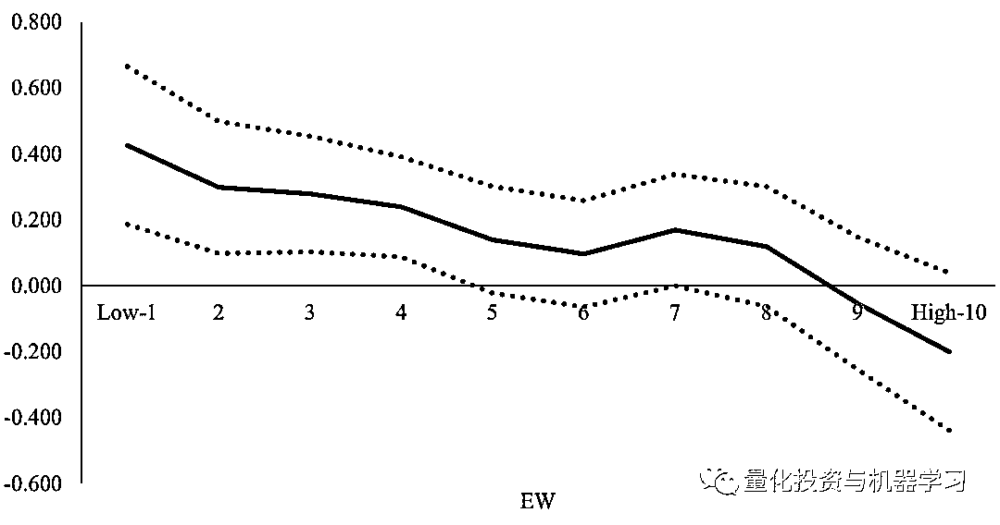
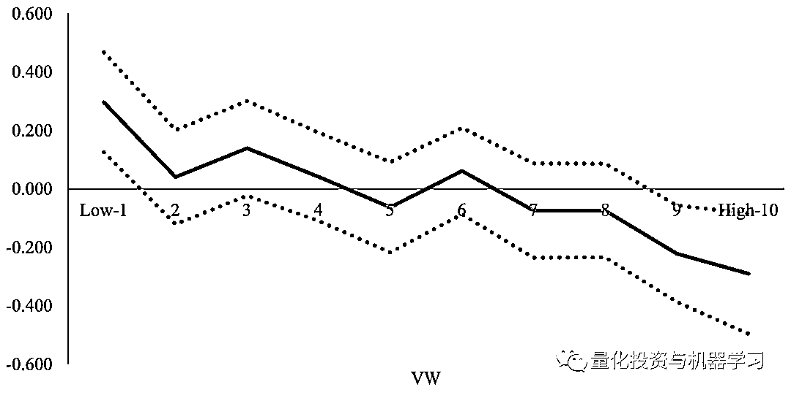

# 【因子后花园】一个显著的新因子：现金循环周期（CCC）

> 原文：[`mp.weixin.qq.com/s?__biz=MzAxNTc0Mjg0Mg==&mid=2653291695&idx=1&sn=fe262c28cb0ff4ec1c67da562d174147&chksm=802dc6bab75a4fac6d1ad4d4b3509f581c5eedfb30fac21462a235cd994e2f88cd9e9a6633d9&scene=27#wechat_redirect`](http://mp.weixin.qq.com/s?__biz=MzAxNTc0Mjg0Mg==&mid=2653291695&idx=1&sn=fe262c28cb0ff4ec1c67da562d174147&chksm=802dc6bab75a4fac6d1ad4d4b3509f581c5eedfb30fac21462a235cd994e2f88cd9e9a6633d9&scene=27#wechat_redirect)

**标星★公众号     **爱你们♥

**近期原创文章：**

## ♥ [基于无监督学习的期权定价异常检测（代码+数据）](https://mp.weixin.qq.com/s?__biz=MzAxNTc0Mjg0Mg==&mid=2653290562&idx=1&sn=dee61b832e1aa2c062a96bb27621c29d&chksm=802dc257b75a4b41b5623ade23a7de86333bfd3b4299fb69922558b0cbafe4c930b5ef503d89&token=1298662931&lang=zh_CN&scene=21#wechat_redirect)

## ♥ [5 种机器学习算法在预测股价的应用（代码+数据）](https://mp.weixin.qq.com/s?__biz=MzAxNTc0Mjg0Mg==&mid=2653290588&idx=1&sn=1d0409ad212ea8627e5d5cedf61953ac&chksm=802dc249b75a4b5fa245433320a4cc9da1a2cceb22df6fb1a28e5b94ff038319ae4e7ec6941f&token=1298662931&lang=zh_CN&scene=21#wechat_redirect)

## ♥ [深入研读：利用 Twitter 情绪去预测股市](https://mp.weixin.qq.com/s?__biz=MzAxNTc0Mjg0Mg==&mid=2653290402&idx=1&sn=efda9ea106991f4f7ccabcae9d809e00&chksm=802e3db7b759b4a173dc8f2ab5c298ab3146bfd7dd5aca75929c74ecc999a53b195c16f19c71&token=1330520237&lang=zh_CN&scene=21#wechat_redirect)

## ♥ [Two Sigma 用新闻来预测股价走势，带你吊打 Kaggle](https://mp.weixin.qq.com/s?__biz=MzAxNTc0Mjg0Mg==&mid=2653290456&idx=1&sn=b8d2d8febc599742e43ea48e3c249323&chksm=802e3dcdb759b4db9279c689202101b6b154fb118a1c1be12b52e522e1a1d7944858dbd6637e&token=1330520237&lang=zh_CN&scene=21#wechat_redirect)

## ♥ [利用深度学习最新前沿预测股价走势](https://mp.weixin.qq.com/s?__biz=MzAxNTc0Mjg0Mg==&mid=2653290080&idx=1&sn=06c50cefe78a7b24c64c4fdb9739c7f3&chksm=802e3c75b759b563c01495d16a638a56ac7305fc324ee4917fd76c648f670b7f7276826bdaa8&token=770078636&lang=zh_CN&scene=21#wechat_redirect)

## ♥ [一位数据科学 PhD 眼中的算法交易](https://mp.weixin.qq.com/s?__biz=MzAxNTc0Mjg0Mg==&mid=2653290118&idx=1&sn=a261307470cf2f3e458ab4e7dc309179&chksm=802e3c93b759b585e079d3a797f512dfd0427ac02942339f4f1454bd368ba47be21cb52cf969&token=770078636&lang=zh_CN&scene=21#wechat_redirect)

## ♥ [基于 RNN 和 LSTM 的股市预测方法](https://mp.weixin.qq.com/s?__biz=MzAxNTc0Mjg0Mg==&mid=2653290481&idx=1&sn=f7360ea8554cc4f86fcc71315176b093&chksm=802e3de4b759b4f2235a0aeabb6e76b3e101ff09b9a2aa6fa67e6e824fc4274f68f4ae51af95&token=1865137106&lang=zh_CN&scene=21#wechat_redirect)

## ♥ [人工智能『AI』应用算法交易，7 个必踩的坑！](https://mp.weixin.qq.com/s?__biz=MzAxNTc0Mjg0Mg==&mid=2653289974&idx=1&sn=88f87cb64999d9406d7c618350aac35d&chksm=802e3fe3b759b6f5eca6e777364270cbaa0bf35e9a1535255be9751c3a77642676993a861132&token=770078636&lang=zh_CN&scene=21#wechat_redirect)

## ♥ [神经网络在算法交易上的应用系列（一）](https://mp.weixin.qq.com/s?__biz=MzAxNTc0Mjg0Mg==&mid=2653289962&idx=1&sn=5f5aa65ec00ce176501c85c7c106187d&chksm=802e3fffb759b6e9f2d4518f9d3755a68329c8753745333ef9d70ffd04bd088fd7b076318358&token=770078636&lang=zh_CN&scene=21#wechat_redirect)

## ♥ [预测股市 | 如何避免 p-Hacking，为什么你要看涨？](https://mp.weixin.qq.com/s?__biz=MzAxNTc0Mjg0Mg==&mid=2653289820&idx=1&sn=d3fee74ba1daab837433e4ef6b0ab4d9&chksm=802e3f49b759b65f422d20515942d5813aead73231da7d78e9f235bdb42386cf656079e69b8b&token=770078636&lang=zh_CN&scene=21#wechat_redirect)

## ♥ [如何鉴别那些用深度学习预测股价的花哨模型？](https://mp.weixin.qq.com/s?__biz=MzAxNTc0Mjg0Mg==&mid=2653290132&idx=1&sn=cbf1e2a4526e6e9305a6110c17063f46&chksm=802e3c81b759b597d3dd94b8008e150c90087567904a29c0c4b58d7be220a9ece2008956d5db&token=1266110554&lang=zh_CN&scene=21#wechat_redirect)

## ♥ [优化强化学习 Q-learning 算法进行股市](https://mp.weixin.qq.com/s?__biz=MzAxNTc0Mjg0Mg==&mid=2653290286&idx=1&sn=882d39a18018733b93c8c8eac385b515&chksm=802e3d3bb759b42d1fc849f96bf02ae87edf2eab01b0beecd9340112c7fb06b95cb2246d2429&token=1330520237&lang=zh_CN&scene=21#wechat_redirect)

从本期开始，我们将开启 2019 年的：

**因子后花园系列**

我们将对量化因子进行一个全方位的介绍与挖掘。并且结合众多机构人士一起，把这个专题**做好、做精！**  

也欢迎在因子研究这块相关研究人士与我们一起完成这个具有成就感的专题！

本期我们将从 Baolian Wang 的论文发觉一个新的因子。具体分析如下：

**研究的问题是什么?**

近期 Campbell R. Harvey 和他的同事 Yan Liu 在他们最近的论文中说：

*The rate of factor production in the academic research is out of control. We document over 400 factors published in top journals. Surely, many of them are false.*

在学术研究中，因子的产生已经失去了控制。我们整理了在顶级期刊上发表的 400 多个因子。其中许多是无效的。

他们还强调，大量的金融研究论文无法在他们的实验环境中复制。

当一篇新的因子论文在顶级的期刊上发表时，我们就会一头扎进去，一探究竟。本文探讨了现金循环周期（CCC）的使用，即将存货和应收账款的周转时间减去支付企业应付款的时间。简而言之，花现金和收现金之间的时间跨度是多少？

作者试图解决以下问题：

*   现金循环周期（CCC）能预测收益吗?

*   CCC 为何能获得异常收益?

**学术见解**

1、是的。预测能力很强。超额收益对许多资产定价模型都是稳健的，适用于不同的子周期，适用于所有规模的五分位数。

2、错误定价。基于风险的模型不能解释超额保费，提供杠杆作用的金融中介机构与超额回报之间也没有关系。最后一种解释：错误定价，占了上风。投资者似乎受到系统性预期错误的困扰，套利成本较高的股票预期回报率更高。

**为什么这有关系？**

现金循环周期在企业内部经常被用来评估企业的管理效率和了解企业的外部融资需求。然而，作为一种资产定价工具，该指标迄今尚未得到研究。

这一发现的最大问题在于，它相对容易实现，而且大部分超额回报与定错误定价有关。有人可能会认为“now that the cat is out of the bag” ，投资者可能会将 CCC 纳入他们的模型，并利用异常套利。当然，这是假设套利成本是较高的，我们从本文的一些初步结果得知，套利成本是非负的。我们还希望在国际市场上进行一些额外的测试，看看结果是否可靠。

**论文最重要的图**

**CCC 十分位数的表现**

每个月，我们根据行业调整后的 CCC 将所有股票分类为十组，并记录每个十分位数在等权重（EW）和价值加权（VW）基础上的平均回报。利用平均回报的时间序列，我们计算了十分位数的 Fama-French 五因子 Alpha。纵轴是月度 Alpha，单位是百分比；横轴表示十分位组合，，从左侧的十分位数 1（低 CCC）到右侧的十分位数 10（高 CCC）。

**摘要**

## The cash conversion cycle (CCC) refers to the time span between the outlay of cash for purchases to the receipt of cash from sales. It is a widely used metric to gauge the effectiveness of a firm’s management and intrinsic need for external financing. This paper shows that a zero-investment portfolio that buys stocks in the lowest CCC decile and shorts stocks in the highest CCC decile earns 5 to 7% alphas per year. The CCC effect is prevalent across industries and remains even for large capitalization stocks. The CCC effect is distinct from the known return predictors. The returns of high-CCC stocks are more sensitive to the health of the financial intermediaries than low-CCC stocks. This suggests that the CCC-based strategy cannot be explained by the financial intermediary leverage risk.

▎Baolian Wang

▎JFE, forthcoming

▎The Cash Conversion Cycle Spread

**论文下载**

在**后台**输入

**因子后花园 1**

*—End—*

量化投资与机器学习微信公众号，是业内垂直于**Quant**、**MFE**、**CST**等专业的主流自媒体。公众号拥有来自**公募、私募、券商、银行、海外**等众多圈内**10W+**关注者。每日发布行业前沿研究成果和最新资讯。

