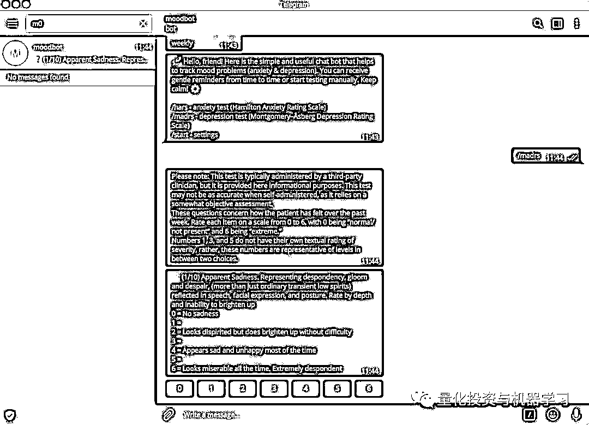

# 好资源，须分享 | 2019 年 36 个超棒的 Python 开源项目

> 原文：[`mp.weixin.qq.com/s?__biz=MzAxNTc0Mjg0Mg==&mid=2653291688&idx=1&sn=d41ea40232844eb0bd5d74a9b9eccb66&chksm=802dc6bdb75a4fab7eb8b08b06e517d6c1a5f52bc0848c7928b70b94a899e0bfe85794112e6e&scene=27#wechat_redirect`](http://mp.weixin.qq.com/s?__biz=MzAxNTc0Mjg0Mg==&mid=2653291688&idx=1&sn=d41ea40232844eb0bd5d74a9b9eccb66&chksm=802dc6bdb75a4fab7eb8b08b06e517d6c1a5f52bc0848c7928b70b94a899e0bfe85794112e6e&scene=27#wechat_redirect)

**标星★公众号     **爱你们♥

**近期原创文章：**

## ♥ [基于无监督学习的期权定价异常检测（代码+数据）](https://mp.weixin.qq.com/s?__biz=MzAxNTc0Mjg0Mg==&mid=2653290562&idx=1&sn=dee61b832e1aa2c062a96bb27621c29d&chksm=802dc257b75a4b41b5623ade23a7de86333bfd3b4299fb69922558b0cbafe4c930b5ef503d89&token=1298662931&lang=zh_CN&scene=21#wechat_redirect)

## ♥ [5 种机器学习算法在预测股价的应用（代码+数据）](https://mp.weixin.qq.com/s?__biz=MzAxNTc0Mjg0Mg==&mid=2653290588&idx=1&sn=1d0409ad212ea8627e5d5cedf61953ac&chksm=802dc249b75a4b5fa245433320a4cc9da1a2cceb22df6fb1a28e5b94ff038319ae4e7ec6941f&token=1298662931&lang=zh_CN&scene=21#wechat_redirect)

## ♥ [深入研读：利用 Twitter 情绪去预测股市](https://mp.weixin.qq.com/s?__biz=MzAxNTc0Mjg0Mg==&mid=2653290402&idx=1&sn=efda9ea106991f4f7ccabcae9d809e00&chksm=802e3db7b759b4a173dc8f2ab5c298ab3146bfd7dd5aca75929c74ecc999a53b195c16f19c71&token=1330520237&lang=zh_CN&scene=21#wechat_redirect)

## ♥ [Two Sigma 用新闻来预测股价走势，带你吊打 Kaggle](https://mp.weixin.qq.com/s?__biz=MzAxNTc0Mjg0Mg==&mid=2653290456&idx=1&sn=b8d2d8febc599742e43ea48e3c249323&chksm=802e3dcdb759b4db9279c689202101b6b154fb118a1c1be12b52e522e1a1d7944858dbd6637e&token=1330520237&lang=zh_CN&scene=21#wechat_redirect)

## ♥ [利用深度学习最新前沿预测股价走势](https://mp.weixin.qq.com/s?__biz=MzAxNTc0Mjg0Mg==&mid=2653290080&idx=1&sn=06c50cefe78a7b24c64c4fdb9739c7f3&chksm=802e3c75b759b563c01495d16a638a56ac7305fc324ee4917fd76c648f670b7f7276826bdaa8&token=770078636&lang=zh_CN&scene=21#wechat_redirect)

## ♥ [一位数据科学 PhD 眼中的算法交易](https://mp.weixin.qq.com/s?__biz=MzAxNTc0Mjg0Mg==&mid=2653290118&idx=1&sn=a261307470cf2f3e458ab4e7dc309179&chksm=802e3c93b759b585e079d3a797f512dfd0427ac02942339f4f1454bd368ba47be21cb52cf969&token=770078636&lang=zh_CN&scene=21#wechat_redirect)

## ♥ [基于 RNN 和 LSTM 的股市预测方法](https://mp.weixin.qq.com/s?__biz=MzAxNTc0Mjg0Mg==&mid=2653290481&idx=1&sn=f7360ea8554cc4f86fcc71315176b093&chksm=802e3de4b759b4f2235a0aeabb6e76b3e101ff09b9a2aa6fa67e6e824fc4274f68f4ae51af95&token=1865137106&lang=zh_CN&scene=21#wechat_redirect)

## ♥ [人工智能『AI』应用算法交易，7 个必踩的坑！](https://mp.weixin.qq.com/s?__biz=MzAxNTc0Mjg0Mg==&mid=2653289974&idx=1&sn=88f87cb64999d9406d7c618350aac35d&chksm=802e3fe3b759b6f5eca6e777364270cbaa0bf35e9a1535255be9751c3a77642676993a861132&token=770078636&lang=zh_CN&scene=21#wechat_redirect)

## ♥ [神经网络在算法交易上的应用系列（一）](https://mp.weixin.qq.com/s?__biz=MzAxNTc0Mjg0Mg==&mid=2653289962&idx=1&sn=5f5aa65ec00ce176501c85c7c106187d&chksm=802e3fffb759b6e9f2d4518f9d3755a68329c8753745333ef9d70ffd04bd088fd7b076318358&token=770078636&lang=zh_CN&scene=21#wechat_redirect)

## ♥ [预测股市 | 如何避免 p-Hacking，为什么你要看涨？](https://mp.weixin.qq.com/s?__biz=MzAxNTc0Mjg0Mg==&mid=2653289820&idx=1&sn=d3fee74ba1daab837433e4ef6b0ab4d9&chksm=802e3f49b759b65f422d20515942d5813aead73231da7d78e9f235bdb42386cf656079e69b8b&token=770078636&lang=zh_CN&scene=21#wechat_redirect)

## ♥ [如何鉴别那些用深度学习预测股价的花哨模型？](https://mp.weixin.qq.com/s?__biz=MzAxNTc0Mjg0Mg==&mid=2653290132&idx=1&sn=cbf1e2a4526e6e9305a6110c17063f46&chksm=802e3c81b759b597d3dd94b8008e150c90087567904a29c0c4b58d7be220a9ece2008956d5db&token=1266110554&lang=zh_CN&scene=21#wechat_redirect)

## ♥ [优化强化学习 Q-learning 算法进行股市](https://mp.weixin.qq.com/s?__biz=MzAxNTc0Mjg0Mg==&mid=2653290286&idx=1&sn=882d39a18018733b93c8c8eac385b515&chksm=802e3d3bb759b42d1fc849f96bf02ae87edf2eab01b0beecd9340112c7fb06b95cb2246d2429&token=1330520237&lang=zh_CN&scene=21#wechat_redirect)

在过去的一年里，我们比较了近 5000 个开源 Python 项目，并选出了前 36 个。

**Github 的平均**** ★**** 数是 1667。**

当你在构建一个应用程序时，这些开源项目是很有用的。

**第一名**

**6639** **★**

Manim 是一个解释性数学视频的动画引擎。它用于通过编程创建精确的动画。

▍https://github.com/3b1b/manim?utm_source=mybridge&utm_medium=blog&utm_campaign=read_more%20data-href=

**第二名**

**6046**** ★**

XSStrike 是一个跨站点脚本检测套件，配备了四个手写解析器、一个智能负载生成器、一个强大的模糊引擎和一个非常快的爬行器。

▍https://github.com/s0md3v/XSStrike?utm_source=mybridge&utm_medium=blog&utm_campaign=read_more

**第三名**

**5173**** ★**

# 如何在抖音上找到漂亮小姐姐——抖音机器人

本着高效、直接地找到漂亮小姐姐的核心思想，作者用 Python + ADB 做了一个 Python 抖音机器人 Douyin-Bot。

▍https://github.com/wangshub/Douyin-Bot?utm_source=mybridge&utm_medium=blog&utm_campaign=read_more

**第四名**

**4614**** ★**

# 机器人算法的 Python 代码。

▍https://github.com/AtsushiSakai/PythonRobotics?utm_source=mybridge&utm_medium=blog&utm_campaign=read_more

**第五名**

**4438**** ★**

# 快速爬虫，提取 url，电子邮件，文件，网站帐户等等。

▍https://github.com/s0md3v/Photon?utm_source=mybridge&utm_medium=blog&utm_campaign=read_more

**第六名**

**3951**** ★**

Python 脚本数以百计的谷歌图像下载到本地硬盘！

▍https://github.com/hardikvasa/google-images-download?utm_source=mybridge&utm_medium=blog&utm_campaign=read_more

**第七名**

**3504**** ★**

学会跟踪世界，避免被跟踪。

▍https://github.com/jofpin/trape?utm_source=mybridge&utm_medium=blog&utm_campaign=read_more

**第八名**

**3045**** ★**

xonsh 是一种基于 Python、跨平台的、统一的 shell 语言和命令提示符。该语言是 Python 3.4+的一个超集，带有附加的 shell 原语。xonsh（发音为 conch））适用于专家和新手的日常使用。

▍https://github.com/xonsh/xonsh?utm_source=mybridge&utm_medium=blog&utm_campaign=read_more

**第九名**

**2498**** ★**

Rebound 是一个命令行工具，当你获得编译器错误时，它会立即获取堆栈溢出结果。只需使用反弹命令来执行文件。

▍https://github.com/shobrook/rebound?utm_source=mybridge&utm_medium=blog&utm_campaign=read_more

**第十名**

**2424**** ★**

GIF -for-cli：接收 GIF、短视频等，并将其转换为动画。

▍https://github.com/google/gif-for-cli?utm_source=mybridge&utm_medium=blog&utm_campaign=read_more

**第十一名**

**2384**** ★**

Snips NLU 是一个 Python 库，它允许解析用自然语言编写的句子并提取结构化信息。

▍https://github.com/snipsco/snips-nlu?utm_source=mybridge&utm_medium=blog&utm_campaign=read_more

**第十二名**

**1943**** ★**

Social Mapper 是一个开源的智能工具，它使用面部识别来大规模关联不同网站的社交媒体资料。它采用一种自动化的方法，在流行的社交媒体网站上搜索目标的名字和图片，从而准确地检测和分类一个人的存在，并将结果输出到报告中，供操作员快速查看。

▍https://github.com/Greenwolf/social_mapper?utm_source=mybridge&utm_medium=blog&utm_campaign=read_more

**第十三名**

**1831**** ★**

Camelot 是一个 Python 库，任何人都可以轻松地从 PDF 文件中提取表！

▍https://github.com/socialcopsdev/camelot?utm_source=mybridge&utm_medium=blog&utm_campaign=read_more

**第十四名**

**1785**** ★**

The best CLI client for Slack, because everything is terrible!

▍https://github.com/haskellcamargo/sclack?utm_source=mybridge&utm_medium=blog&utm_campaign=read_more

**第十五名**

**1611**** ★**

Cartoonify：Python app 将照片变成卡通片。

▍https://github.com/danmacnish/cartoonify?utm_source=mybridge&utm_medium=blog&utm_campaign=read_more

**第十六名**

**1266**** ★**

Twitter-scraper：在没有身份验证的情况下抓取 Twitter 前端 API。内置 Python。

▍https://github.com/kennethreitz/twitter-scraper?utm_source=mybridge&utm_medium=blog&utm_campaign=read_more

**第十七名**

**1162**** ★**

这是一个非常简单、不安全且不完整的区块链实现，用于 Python 生成的加密货币。该项目的目标是使一个工作的区块链货币，保持它尽可能简单。

▍https://github.com/cosme12/SimpleCoin?utm_source=mybridge&utm_medium=blog&utm_campaign=read_more

**第十八名**

**616**** ★**

电子书阅读器。

▍https://github.com/BasioMeusPuga/Lector?utm_source=mybridge&utm_medium=blog&utm_campaign=read_more

**第十九名**

**593**** ★**

通过用 Python 编写自己的简单、轻量级、无魔力的静态站点生成器，完全控制静态站点/博客的生成。重新发明轮子，伙计们！

▍https://github.com/sunainapai/makesite?utm_source=mybridge&utm_medium=blog&utm_campaign=read_more

**第二十名**

**523**** ★**

Dbxfs：Dropbox 的用户空间文件系统。

▍https://github.com/rianhunter/dbxfs?utm_source=mybridge&utm_medium=blog&utm_campaign=read_more 

**第二十一名**

**518**** ★**

BabySploit：使用 Python 编写的 pentest 工具包。

▍https://github.com/M4cs/BabySploit?utm_source=mybridge&utm_medium=blog&utm_campaign=read_more

**第二十二名**

**414**** ★**

使用 Python 的强大功能将图像转换为 ASCII。

▍https://github.com/RameshAditya/asciify?utm_source=mybridge&utm_medium=blog&utm_campaign=read_more

**第二十三名**

**405**** ★**

自动爬虫：谷歌，Naver 多进程图像 web 爬虫(Selenium)。

▍https://github.com/YoongiKim/AutoCrawler?utm_source=mybridge&utm_medium=blog&utm_campaign=read_more

**第二十四名**

**344**** ★**

用 Python 从谷歌表中读取数据，向其写入数据，并修改其格式。

▍https://github.com/Squarespace/datasheets?utm_source=mybridge&utm_medium=blog&utm_campaign=read_more 

**第二十五名**

**326**** ★**

Pyray：一个完全用 python 编写的 3d 渲染库。

▍https://github.com/ryu577/pyray?utm_source=mybridge&utm_medium=blog&utm_campaign=read_more

**第二十六名**

**297**** ★**

NonoCAPTCHA：使用音频自动解决 ReCAPTCHA v2 的异步 Python 库。

▍https://github.com/mikeyy/nonoCAPTCHA?utm_source=mybridge&utm_medium=blog&utm_campaign=read_more

**第二十七名**

**263**** ★**

Ubelt：Python 实用程序带。

▍https://github.com/Erotemic/ubelt?utm_source=mybridge&utm_medium=blog&utm_campaign=read_more

**第二十八名**

**220 ★**

PyCAIR：根据内容感知图像大小。

▍https://github.com/avidLearnerInProgress/pyCAIR?utm_source=mybridge&utm_medium=blog&utm_campaign=read_more

**第二十九名**

**181**** ★**

SoundCloud -dl：以 128kbps 的速度下载 SoundCloud 音乐，附带专辑图片和标签。

▍https://github.com/sdushantha/soundcloud-dl?utm_source=mybridge&utm_medium=blog&utm_campaign=read_more  

**第三十名**

**171 ★**

Pixelhouse：一个用 python 制作漂亮动画的极简主义绘画库。

▍https://github.com/thoppe/pixelhouse?utm_source=mybridge&utm_medium=blog&utm_campaign=read_more

**第三十一名**

**170**** ★**

用 Python 清理 Twitter 上不活跃的帐户和机器人。

▍https://github.com/cuducos/twitter-cleanup?utm_source=mybridge&utm_medium=blog&utm_campaign=read_more

**第三十二名**

**150**** ★**

Spotify-playlist-generator：一个预定的 Python 脚本，用于删除新歌的标题。

▍https://github.com/mileshenrichs/spotify-playlist-generator?utm_source=mybridge&utm_medium=blog&utm_campaign=read_more

**第三十三名**

**147**** ★**

来自 doki doki 文学社的 YURI 访问网络摄像头，并直接凝视着玩家的灵魂。希望你能喜欢！

▍https://github.com/Aditya-Khadilkar/Face-tracking-with-Anime-characters?utm_source=mybridge&utm_medium=blog&utm_campaign=read_more  

**第三十四名**

**124 ★**

Videodownloader：一个简单的 python 脚本，允许你下载 youtube 视频。

▍https://github.com/mraza007/videodownloader?utm_source=mybridge&utm_medium=blog&utm_campaign=read_more

**第三十五名**

**117**** ★**

Render-py：一个用 Python 编写的软件 3D 渲染器。

▍https://github.com/tvytlx/render-py?utm_source=mybridge&utm_medium=blog&utm_campaign=read_more

**第三十六名**

**81 ★**

M00dbot：Telegram bot，用于焦虑和抑郁的自我测试。

▍https://github.com/dizballanze/m00dbot?utm_source=mybridge&utm_medium=blog&utm_campaign=read_more

*—End—*

量化投资与机器学习微信公众号，是业内垂直于**Quant**、**MFE**、**CST**等专业的主流自媒体。公众号拥有来自**公募、私募、券商、银行、海外**等众多圈内**10W+**关注者。每日发布行业前沿研究成果和最新资讯。

