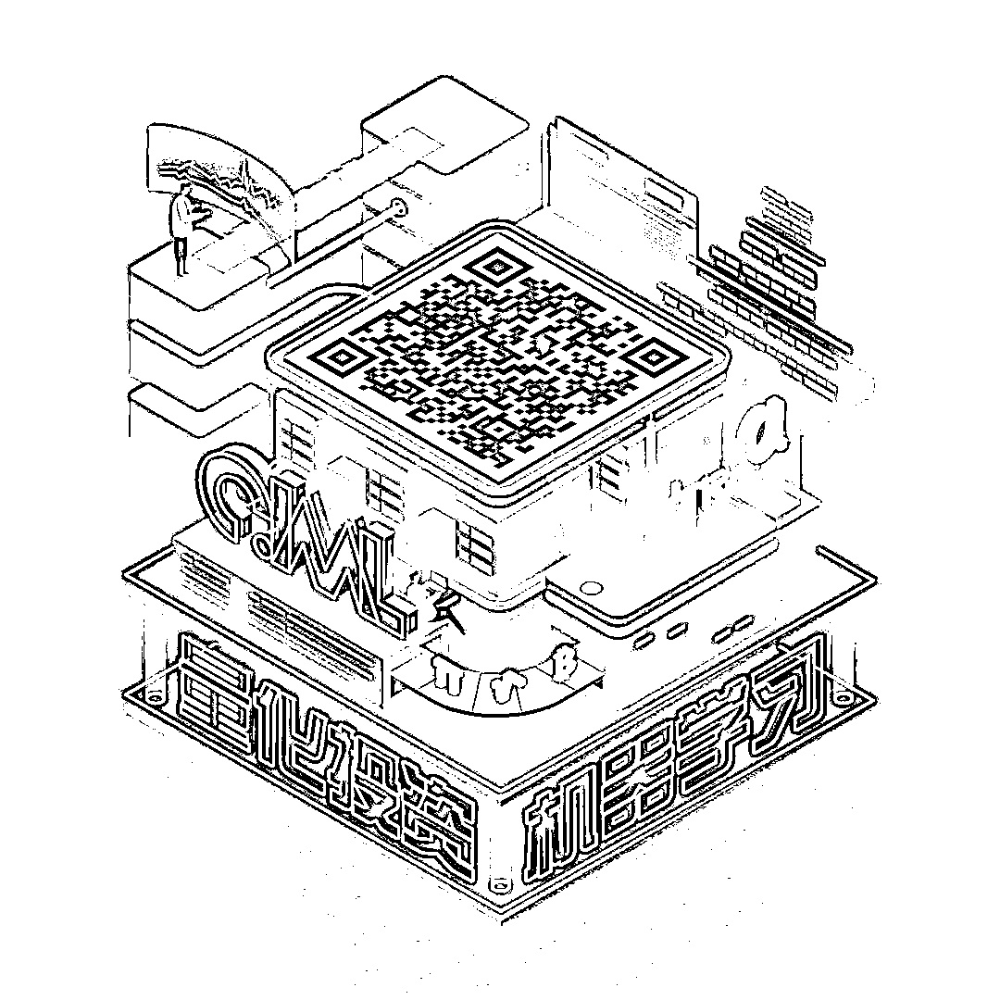

# NLP for Quant Ⅱ：使用 NLP 预测股市趋势（附代码）

> 原文：[`mp.weixin.qq.com/s?__biz=MzAxNTc0Mjg0Mg==&mid=2653291623&idx=1&sn=b39a820e3a170f9b88d886219a3dbd9d&chksm=802dc672b75a4f642aa88fd9a61aa639d19a569198b63e4088660b0e457c0d84a3dd59746a87&scene=27#wechat_redirect`](http://mp.weixin.qq.com/s?__biz=MzAxNTc0Mjg0Mg==&mid=2653291623&idx=1&sn=b39a820e3a170f9b88d886219a3dbd9d&chksm=802dc672b75a4f642aa88fd9a61aa639d19a569198b63e4088660b0e457c0d84a3dd59746a87&scene=27#wechat_redirect)

**标星★公众号     **爱你们♥

▎作者：SATHVIKRAJU

▎编译：公众号翻译部

**近期原创文章：**

## ♥ [基于无监督学习的期权定价异常检测（代码+数据）](https://mp.weixin.qq.com/s?__biz=MzAxNTc0Mjg0Mg==&mid=2653290562&idx=1&sn=dee61b832e1aa2c062a96bb27621c29d&chksm=802dc257b75a4b41b5623ade23a7de86333bfd3b4299fb69922558b0cbafe4c930b5ef503d89&token=1298662931&lang=zh_CN&scene=21#wechat_redirect)

## ♥ [5 种机器学习算法在预测股价的应用（代码+数据）](https://mp.weixin.qq.com/s?__biz=MzAxNTc0Mjg0Mg==&mid=2653290588&idx=1&sn=1d0409ad212ea8627e5d5cedf61953ac&chksm=802dc249b75a4b5fa245433320a4cc9da1a2cceb22df6fb1a28e5b94ff038319ae4e7ec6941f&token=1298662931&lang=zh_CN&scene=21#wechat_redirect)

## ♥ [深入研读：利用 Twitter 情绪去预测股市](https://mp.weixin.qq.com/s?__biz=MzAxNTc0Mjg0Mg==&mid=2653290402&idx=1&sn=efda9ea106991f4f7ccabcae9d809e00&chksm=802e3db7b759b4a173dc8f2ab5c298ab3146bfd7dd5aca75929c74ecc999a53b195c16f19c71&token=1330520237&lang=zh_CN&scene=21#wechat_redirect)

## ♥ [Two Sigma 用新闻来预测股价走势，带你吊打 Kaggle](https://mp.weixin.qq.com/s?__biz=MzAxNTc0Mjg0Mg==&mid=2653290456&idx=1&sn=b8d2d8febc599742e43ea48e3c249323&chksm=802e3dcdb759b4db9279c689202101b6b154fb118a1c1be12b52e522e1a1d7944858dbd6637e&token=1330520237&lang=zh_CN&scene=21#wechat_redirect)

## ♥ [利用深度学习最新前沿预测股价走势](https://mp.weixin.qq.com/s?__biz=MzAxNTc0Mjg0Mg==&mid=2653290080&idx=1&sn=06c50cefe78a7b24c64c4fdb9739c7f3&chksm=802e3c75b759b563c01495d16a638a56ac7305fc324ee4917fd76c648f670b7f7276826bdaa8&token=770078636&lang=zh_CN&scene=21#wechat_redirect)

## ♥ [一位数据科学 PhD 眼中的算法交易](https://mp.weixin.qq.com/s?__biz=MzAxNTc0Mjg0Mg==&mid=2653290118&idx=1&sn=a261307470cf2f3e458ab4e7dc309179&chksm=802e3c93b759b585e079d3a797f512dfd0427ac02942339f4f1454bd368ba47be21cb52cf969&token=770078636&lang=zh_CN&scene=21#wechat_redirect)

## ♥ [基于 RNN 和 LSTM 的股市预测方法](https://mp.weixin.qq.com/s?__biz=MzAxNTc0Mjg0Mg==&mid=2653290481&idx=1&sn=f7360ea8554cc4f86fcc71315176b093&chksm=802e3de4b759b4f2235a0aeabb6e76b3e101ff09b9a2aa6fa67e6e824fc4274f68f4ae51af95&token=1865137106&lang=zh_CN&scene=21#wechat_redirect)

## ♥ [人工智能『AI』应用算法交易，7 个必踩的坑！](https://mp.weixin.qq.com/s?__biz=MzAxNTc0Mjg0Mg==&mid=2653289974&idx=1&sn=88f87cb64999d9406d7c618350aac35d&chksm=802e3fe3b759b6f5eca6e777364270cbaa0bf35e9a1535255be9751c3a77642676993a861132&token=770078636&lang=zh_CN&scene=21#wechat_redirect)

## ♥ [神经网络在算法交易上的应用系列（一）](https://mp.weixin.qq.com/s?__biz=MzAxNTc0Mjg0Mg==&mid=2653289962&idx=1&sn=5f5aa65ec00ce176501c85c7c106187d&chksm=802e3fffb759b6e9f2d4518f9d3755a68329c8753745333ef9d70ffd04bd088fd7b076318358&token=770078636&lang=zh_CN&scene=21#wechat_redirect)

## ♥ [预测股市 | 如何避免 p-Hacking，为什么你要看涨？](https://mp.weixin.qq.com/s?__biz=MzAxNTc0Mjg0Mg==&mid=2653289820&idx=1&sn=d3fee74ba1daab837433e4ef6b0ab4d9&chksm=802e3f49b759b65f422d20515942d5813aead73231da7d78e9f235bdb42386cf656079e69b8b&token=770078636&lang=zh_CN&scene=21#wechat_redirect)

## ♥ [如何鉴别那些用深度学习预测股价的花哨模型？](https://mp.weixin.qq.com/s?__biz=MzAxNTc0Mjg0Mg==&mid=2653290132&idx=1&sn=cbf1e2a4526e6e9305a6110c17063f46&chksm=802e3c81b759b597d3dd94b8008e150c90087567904a29c0c4b58d7be220a9ece2008956d5db&token=1266110554&lang=zh_CN&scene=21#wechat_redirect)

## ♥ [优化强化学习 Q-learning 算法进行股市](https://mp.weixin.qq.com/s?__biz=MzAxNTc0Mjg0Mg==&mid=2653290286&idx=1&sn=882d39a18018733b93c8c8eac385b515&chksm=802e3d3bb759b42d1fc849f96bf02ae87edf2eab01b0beecd9340112c7fb06b95cb2246d2429&token=1330520237&lang=zh_CN&scene=21#wechat_redirect)

**前言**

我们使用机器学习来评估过去与股票市场和相应时期的全球事件相关的数据，以便对股票趋势进行预测。我们建立了一个模型，**能够根据盈利预测买卖股票，而不需要任何人为干预**。该模型采用自然语言处理（NLP）技术，**根据时事、文章等信息做出智能决策**。我们的目标是提高股票趋势预测的准确性。

**介绍**

自然语言处理是计算机用来理解和操作自然语言的一种技术。自然语言指的是所有人类衍生的语言。自然语言处理（简称 NLP）用于分析文本，让机器从输入中获得意义。这种人机交互使我们能够想出许多不同的应用程序来把人和机器融为一体。例如，在谷歌上，如果我们使用谷歌翻译，那就是 NLP，语音识别也是。在本文中，我们使用一些已经建立的 NLP 技术来评估过去与股票市场和相应时期的全球事件相关的数据，以便对股票趋势做出预测。

首先，我们需要理解什么是情感分析。情感分析是计算机用来理解自然语言并推断信息是积极的、中性的还是消极的一种分析方法。在本文中，情感分析是指新闻标题：如增持或减持股票等等。通过这样做，让我们最终得到了数据的“情感”状态。我们使用由 Aaron7sun 提供的数据集。我们还扩展了额外的数据。这些额外数据是从卫报的 Restful 新闻 API 中收集的，从 2000 年到 2008 年期间。我们选取了这段时间内每天最受欢迎的 25 条新闻标题。此外，我们还提取了 2000 年至 2008 年期间雅虎财经网站的道琼斯指数来比较数据的影响。这个数据集中提供了两个数据通道：具有 Reddit World News Channel 的历史新闻标题的新闻数据。单个日期仅考虑前 25 个标题。道琼斯工业平均指数在相应时间范围内的股票数据用于标记数据。股票数据来自雅虎财经。

注意：每个数据的标题用作导致股票价格上涨（标记为 1）或下降（标记为 0）的解释性数据。我们将一个日期的前 25 个标题排列为提取数据集的一行。因为我们的目标是预测一个特定公司的股票的趋势，导致第二天的股票价格下降或保持不变贴上“0”，导致价格上升标记“1”。我们将两组数据进行比较，然后将它们合并在一起，得到更准确的预测。

对于原始数据，在处理数据以适应我们的分析并将数据转换为更容易处理的向量之前，我们无法进行更多的工作。为此，我们使用**Word2Vec**。这是一组用于创建单词嵌入的相关模型。词嵌入是 NLP 语言建模和特征学习技术的集合，其中词汇表中的词或短语映射到实数向量。这些向量构成了训练集和测试集。我们用一组简单的规则来进行英语标记化。这些原始数据是使用 python 操作的。我们首先将数据分解为单词列表，但是这些列表充斥着 HTML 标记和标点符号。我们清理了数据，并删除了所有 HTML 标记和标点符号。然后，我们继续删除停止词。停止词是那些与数据的含义或情感无关的词，如“the”、“is”和“and”等。我们还将所有字母转换为小写字母，使数据集更加均匀。

**剩下的部分大家自行在获取的文件中阅读。**

**获取代码、文档查看文末。**

参考文献：

F. Xu and V. Keelj, "Collective Sentiment Mining of Microblogs in 24-Hour Stock Price Movement Prediction," 2014 IEEE 16th Conference on Business Informatics, Geneva, 2014, pp. 60-67\. doi: 10.1109/CBI.2014.37

L. Bing, K. C. C. Chan and C. Ou, "Public Sentiment Analysis in Twitter Data for Prediction of a Company's Stock Price Movements," 2014 IEEE 11th International Conference on e-Business Engineering, Guangzhou, 2014, pp. 232-239\. doi: 10.1109/ICEBE.2014.47

D. Rao, F. Deng, Z. Jiang and G. Zhao, "Qualitative Stock Market Predicting with Common Knowledge Based Nature Language Processing: A Unified View and Procedure," 2015 7th International Conference on Intelligent Human-Machine Systems and Cybernetics, Hangzhou, 2015, pp. 381-384\. doi: 10.1109/IHMSC.2015.114

Z. Jiang, P. Chen and X. Pan, "Announcement Based Stock Prediction," 2016 International Symposium on Computer, Consumer and Control (IS3C), Xi'an, 2016, pp. 428-431\. doi: 10.1109/IS3C.2016.114

W. Bouachir, A. Torabi, G. A. Bilodeau and P. Blais, "A bag of words approach for semantic segmentation of monitored scenes," 2016 International Symposium on Signal, Image, Video and Communications (ISIVC), Tunis, 2016, pp. 88-93\. doi: 10.1109/ISIVC.2016.7893967

D. Sehgal and A. K. Agarwal, "Sentiment analysis of big data applications using Twitter Data with the help of HADOOP framework," 2016 International Conference System Modeling & Advancement in Research Trends (SMART), Moradabad, 2016, pp. 251-255\. doi: 10.1109/SYSMART.2016.7894530

R. Zhao; K. Mao, "Fuzzy Bag-of-Words Model for Document Representation," in IEEE Transactions on Fuzzy Systems , vol.PP, no.99, pp.1-1 doi: 10.1109/TFUZZ.2017.2690222

V. U. Thompson, C. Panchev and M. Oakes, "Performance evaluation of similarity measures on similar and dissimilar text retrieval," 2015 7th International Joint Conference on Knowledge Discovery, Knowledge Engineering and Knowledge Management (IC3K), Lisbon, 2015, pp. 577-584

C. Sreejith, M. Indu and P. C. R. Raj, "N-gram based algorithm for distinguishing between Hindi and Sanskrit texts," 2013 Fourth International Conference on Computing, Communications and Networking Technologies (ICCCNT), Tiruchengode, 2013, pp. 1-4\. doi: 10.1109/ICCCNT.2013.6726777

M. Kaya, G. Fidan and I. H. Toroslu, "Sentiment Analysis of Turkish Political News," 2012 IEEE/WIC/ACM International Conferences on Web Intelligence and Intelligent Agent Technology, Macau, 2012, pp. 174-180\. doi: 10.1109/WI-IAT.2012.115

**代码下载**

在**后台**输入

**20190419**

*—End—*

量化投资与机器学习微信公众号，是业内垂直于**Quant**、**MFE**、**CST**等专业的主流自媒体。公众号拥有来自**公募、私募、券商、银行、海外**等众多圈内**10W+**关注者。每日发布行业前沿研究成果和最新资讯。

