# 因子投资：价值和动量是否已死？

> 原文：[`mp.weixin.qq.com/s?__biz=MzAxNTc0Mjg0Mg==&mid=2653291616&idx=1&sn=1d7ab594f8d8e1f97279131d82a330c3&chksm=802dc675b75a4f63f3ad6af233308697fe68e61add2aa99a0baf70fe7f4a7759b3e1db2794d3&scene=27#wechat_redirect`](http://mp.weixin.qq.com/s?__biz=MzAxNTc0Mjg0Mg==&mid=2653291616&idx=1&sn=1d7ab594f8d8e1f97279131d82a330c3&chksm=802dc675b75a4f63f3ad6af233308697fe68e61add2aa99a0baf70fe7f4a7759b3e1db2794d3&scene=27#wechat_redirect)

**标星★公众号**，第一时间获取最新研究

**近期原创文章：**

## ♥ [基于无监督学习的期权定价异常检测（代码+数据）](https://mp.weixin.qq.com/s?__biz=MzAxNTc0Mjg0Mg==&mid=2653290562&idx=1&sn=dee61b832e1aa2c062a96bb27621c29d&chksm=802dc257b75a4b41b5623ade23a7de86333bfd3b4299fb69922558b0cbafe4c930b5ef503d89&token=1298662931&lang=zh_CN&scene=21#wechat_redirect)

## ♥ [5 种机器学习算法在预测股价的应用（代码+数据）](https://mp.weixin.qq.com/s?__biz=MzAxNTc0Mjg0Mg==&mid=2653290588&idx=1&sn=1d0409ad212ea8627e5d5cedf61953ac&chksm=802dc249b75a4b5fa245433320a4cc9da1a2cceb22df6fb1a28e5b94ff038319ae4e7ec6941f&token=1298662931&lang=zh_CN&scene=21#wechat_redirect)

## ♥ [深入研读：利用 Twitter 情绪去预测股市](https://mp.weixin.qq.com/s?__biz=MzAxNTc0Mjg0Mg==&mid=2653290402&idx=1&sn=efda9ea106991f4f7ccabcae9d809e00&chksm=802e3db7b759b4a173dc8f2ab5c298ab3146bfd7dd5aca75929c74ecc999a53b195c16f19c71&token=1330520237&lang=zh_CN&scene=21#wechat_redirect)

## ♥ [Two Sigma 用新闻来预测股价走势，带你吊打 Kaggle](https://mp.weixin.qq.com/s?__biz=MzAxNTc0Mjg0Mg==&mid=2653290456&idx=1&sn=b8d2d8febc599742e43ea48e3c249323&chksm=802e3dcdb759b4db9279c689202101b6b154fb118a1c1be12b52e522e1a1d7944858dbd6637e&token=1330520237&lang=zh_CN&scene=21#wechat_redirect)

## ♥ [利用深度学习最新前沿预测股价走势](https://mp.weixin.qq.com/s?__biz=MzAxNTc0Mjg0Mg==&mid=2653290080&idx=1&sn=06c50cefe78a7b24c64c4fdb9739c7f3&chksm=802e3c75b759b563c01495d16a638a56ac7305fc324ee4917fd76c648f670b7f7276826bdaa8&token=770078636&lang=zh_CN&scene=21#wechat_redirect)

## ♥ [一位数据科学 PhD 眼中的算法交易](https://mp.weixin.qq.com/s?__biz=MzAxNTc0Mjg0Mg==&mid=2653290118&idx=1&sn=a261307470cf2f3e458ab4e7dc309179&chksm=802e3c93b759b585e079d3a797f512dfd0427ac02942339f4f1454bd368ba47be21cb52cf969&token=770078636&lang=zh_CN&scene=21#wechat_redirect)

## ♥ [基于 RNN 和 LSTM 的股市预测方法](https://mp.weixin.qq.com/s?__biz=MzAxNTc0Mjg0Mg==&mid=2653290481&idx=1&sn=f7360ea8554cc4f86fcc71315176b093&chksm=802e3de4b759b4f2235a0aeabb6e76b3e101ff09b9a2aa6fa67e6e824fc4274f68f4ae51af95&token=1865137106&lang=zh_CN&scene=21#wechat_redirect)

## ♥ [人工智能『AI』应用算法交易，7 个必踩的坑！](https://mp.weixin.qq.com/s?__biz=MzAxNTc0Mjg0Mg==&mid=2653289974&idx=1&sn=88f87cb64999d9406d7c618350aac35d&chksm=802e3fe3b759b6f5eca6e777364270cbaa0bf35e9a1535255be9751c3a77642676993a861132&token=770078636&lang=zh_CN&scene=21#wechat_redirect)

## ♥ [神经网络在算法交易上的应用系列（一）](https://mp.weixin.qq.com/s?__biz=MzAxNTc0Mjg0Mg==&mid=2653289962&idx=1&sn=5f5aa65ec00ce176501c85c7c106187d&chksm=802e3fffb759b6e9f2d4518f9d3755a68329c8753745333ef9d70ffd04bd088fd7b076318358&token=770078636&lang=zh_CN&scene=21#wechat_redirect)

## ♥ [预测股市 | 如何避免 p-Hacking，为什么你要看涨？](https://mp.weixin.qq.com/s?__biz=MzAxNTc0Mjg0Mg==&mid=2653289820&idx=1&sn=d3fee74ba1daab837433e4ef6b0ab4d9&chksm=802e3f49b759b65f422d20515942d5813aead73231da7d78e9f235bdb42386cf656079e69b8b&token=770078636&lang=zh_CN&scene=21#wechat_redirect)

## ♥ [如何鉴别那些用深度学习预测股价的花哨模型？](https://mp.weixin.qq.com/s?__biz=MzAxNTc0Mjg0Mg==&mid=2653290132&idx=1&sn=cbf1e2a4526e6e9305a6110c17063f46&chksm=802e3c81b759b597d3dd94b8008e150c90087567904a29c0c4b58d7be220a9ece2008956d5db&token=1266110554&lang=zh_CN&scene=21#wechat_redirect)

## ♥ [优化强化学习 Q-learning 算法进行股市](https://mp.weixin.qq.com/s?__biz=MzAxNTc0Mjg0Mg==&mid=2653290286&idx=1&sn=882d39a18018733b93c8c8eac385b515&chksm=802e3d3bb759b42d1fc849f96bf02ae87edf2eab01b0beecd9340112c7fb06b95cb2246d2429&token=1330520237&lang=zh_CN&scene=21#wechat_redirect)

作者：Wes Gray

编译：Nevermore

从历史上来看，至少通过标普 500 指数衡量的“股市”一直有着史诗般的表现——特别是与其它几乎所有大类资产对比时更能印证这一点。无论你是按地理位置（例如美国，发达国家，新兴市场），风格（例如价值，动量）或类型（例如股票，债券，商品）来看其他大类资产，一件事是非常明显的：标普 500 指数是当之无愧的王。

下面是“Ivy5”的图表，这是一种查看大类资产表现的简单方法。这里的 5 年总收益指的是从 2013 年 10 月 1 日到 2018 年 9 月 30 日。

*   美国股票  = SP500 = SP500 总回报指数

*   国际股票  = EAFE = MSCI EAFE 总回报指数

*   房地产= REIT = FTSE NAREIT 所有股权 REITS 总回报指数

*   大宗商品  = GSCI = 高盛商品指数（GSCI）指数

*   债券  = 10 年 = 美林证券 7 - 10 年期政府债券指数

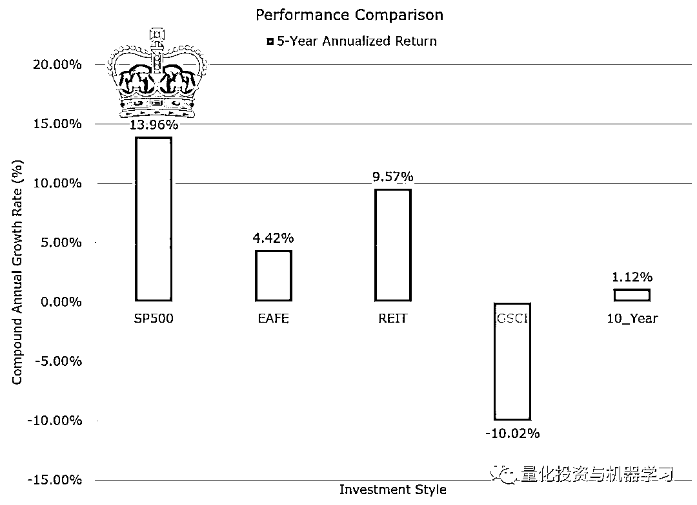

这些结果是假设性的结果，并不构成预测未来回报的指标，也不代表任何投资者实际获得的回报。指数是不受管理的，不反映管理或交易费用，也不能直接投资于指数。有关构建这些结果的其他信息可根据要求提供。

分散化投资是“失败者的游戏”，全仓买入标普 500 指数将是您最好的选择。

标普 500 指数展现出令人难以置信的近期表现，特别是相对应那些所谓的“主动”投资策略，这一现象已经引起许多市场评论员提出一些片面的论断：

*   **因子已经死了**

*   **价值已经死了**

*   **动量已经死了**

*   **XYZ 死了......**

所有这些论断关注的焦点在于，标普 500 指数（又称美国大盘股）在过去 5 年中基本上击败了全球上的任何一种投资风格和大类资产。

虽然这些陈述表面上是正确的，但其含义是具有误导性的。

在这篇文章中，通过分析过去 5 年公共因子策略的评价指标，我们将确定以下四个事实：

1、标普 500 指数给了大盘 beta 的暴露。

2、持有大盘股票是过去五年的发展方向

   含义：相对于等权重的投资组合和非大市值的投资组合，市值加权的投资组合看起来很好。

3、动量并未死亡。

   含义：没有迹象表明动量应当被遗弃。

4、价值（例如，高账面市值比）在大盘股中看来已经死亡，但在小股票仍存在获利希望

   含义：在大盘股中暴漏价值敞口的投资者可能需要考虑改进一下。

**标普 500 指数实际上是一种因子投资：****大盘/高市值 Beta**

图其中突出显示标普 500 指数（通过 SPY 持仓计算）和整个美国股票市场（通过 Vanguard VTI 持仓计算）在市值风险上的暴露。X 轴和 Y 轴反映了市值。每只 ETF 的持有量在市值上均按百分比排名，并绘制如下（100％= AAPL，AMZN，MSFT 类型的股票）

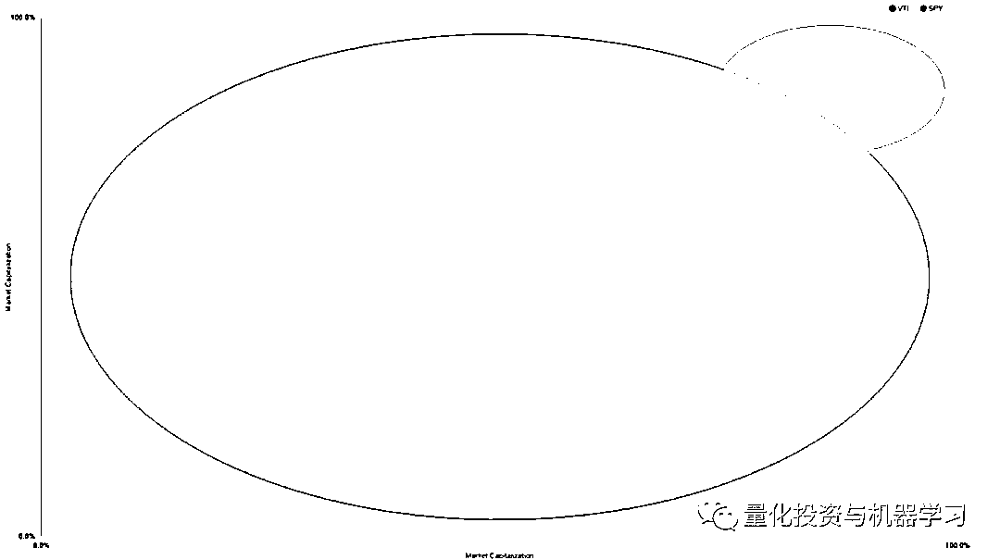

我们认为这一形象证实了我们的第一个论断：标普 500 指数显然集中暴露在大盘股。

**大盘市值的表现（过去五年）**

如果我们认为标普 500 指数是一个大市值因子上的基金，那么标普 500 指数近期的相对表现就不足为奇了。为了说明这一点，让我们看看过去 5 年来越来越多的“小盘股”投资组合的业绩指标，标准普尔 500 指数的风险敞口最低，而“Small Decile”投资组合的风险敞口最大：

*   SP500 = SP500 总回报指数

*   SP500 EW = SP500 等权重总回报指数

*   R2K =罗素 2000 总回报指数

*   Small Decile =来自 Ken French 网站的下十分位市值（市值加权）

*   这里的回报都是总回报，包括配股分红

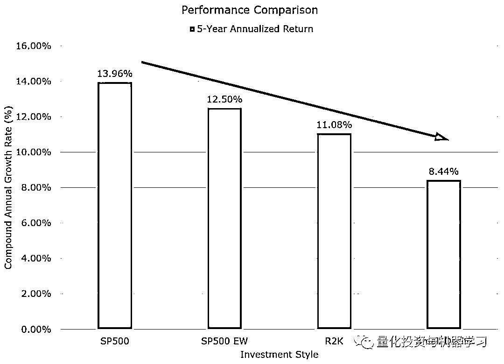

现在我们的第二个事实被证明：任何投注在非大市值股票上的策略都跑输标普 500 指数。（随着对大市值暴露的减小，回报率从 13.96％一直下跌至 8.44％）

这就来到最后两个问题。我们是否处于一个新的世界，在这个新的世界中，成长和大市值已经完全击败了动量和价值。

**市值规模与因子的相互作用**

Lu Zhang 和他的同事最近发表了一篇关于 replicating anomalies 的论文，强调了在检测各种α因子或异常时控制市值规模的重要性。关键的一点是，在大市值股票池之外，因子的表现往往不同（通常情况下要好得多）。尽管如此，在过去的五年中，美国的大市值 Beta 已经碾压了所有其它的因子。

我们现在不按市值规模分类（正如我们上面所做的那样），而是通过相对于标普 500 指数的大盘价值和大盘动量因子来分析。下图是来自 Ken French’s 网站的一些投资组合的历史收益，包括：大盘价值/大盘成长（代表价值）和大盘高动量/大盘低动量（代表动量）

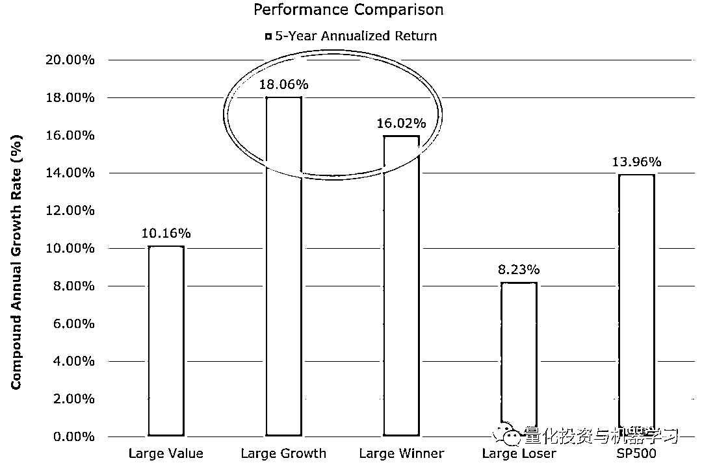

总结最近的结果：

*   大盘价值一直是一个悲惨的赌注（不管怎么样，大盘价值从来都不是一个好赌注！）（收益率上：大盘价值 10.16％ vs 大盘成长 18.06％，市场 13.96％）

*   大盘成长表现最好（18.06％！）

*   大盘动量也表现很不错（16.02％ vs 8.23％，市场 13.96％）

从因子的角度来看，大盘股里成长和动量因子一直是一个非常好的组合。市场评论员所说的大盘价值很糟糕这一观点确实属实（至少基于账市比的价值因子是这一的）。也许这并不太令人惊讶，因为在不同的市场和时间段进行评估时，大盘价值从未真正成为一个令人信服的因子。事实上，在考虑交易成本，税收和复杂性时，投资组合暴露在大盘价值因子上可能是一个“坏”的想法。以下是从股市成立以来各种因子的统计数据（1963 年开始，5 年和 10 年年化回报）：

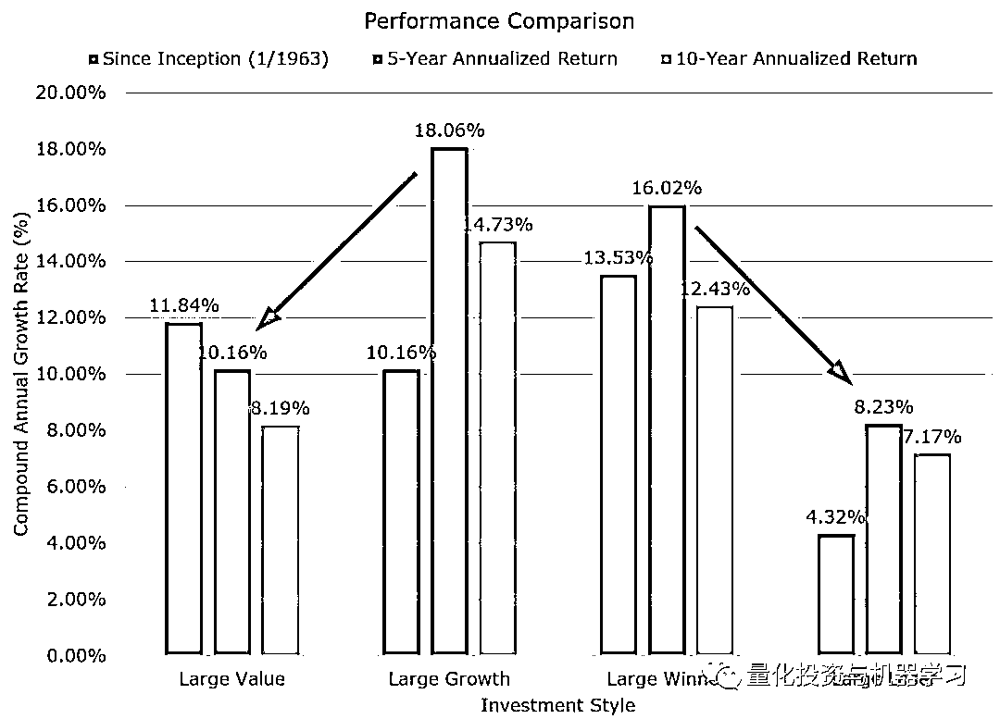

从长远来看（1963 年至今），大盘价值略微优于大盘成长，大盘高动量显著超过大盘低动量

**小市值因子表现怎么样？**

首先，我们提到的标普 500 指数从因子投资的角度来看，是一个大市值 Beta 基金（人们可能会认为它也有成长/动量风格的倾斜）。大市值击败其它竞争对手，如果你在大市值的基础上还有成长或动量的暴露，那你能获取到更加优异的回报。

但是，大市值之外还有什么呢？

以下是 Ken French 网站上关于小盘价值/小盘成长（“价值”）和小盘高动量/小盘地洞里（“动量”）投资组合近五年业绩的图表：

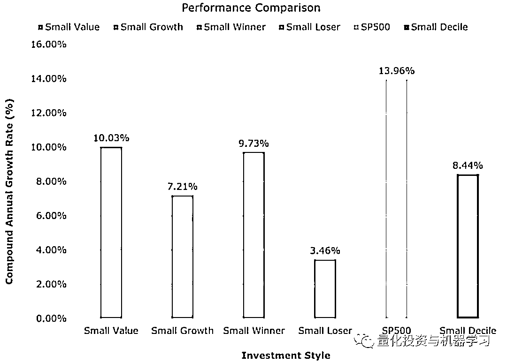

最近的小盘因子表现（例如，过去 5 年）与大盘结果略有不同，并表现出我们已经知道并在此博客上经常讨论的一些规律：

*   价值在小盘股中有效（10.03％对 7.21％）

*   动量在小盘股中有效（不考虑交易成本）（9.73％对 3.46％）

因此，在控制市值暴露后，“因子已死”的论点似乎并不十分引人注目。我们根据上述分析证明了我们的最后两个结论。

但是......还有一个值得强调的点——与标准普尔 500 指数相比，所有因子都已经死了！

如果将小盘价值和动量的过去 5 年（甚至 10 年）表现与标普 500 指数（进行比较，一个有趣的现象重新出现：因子表现很糟糕。

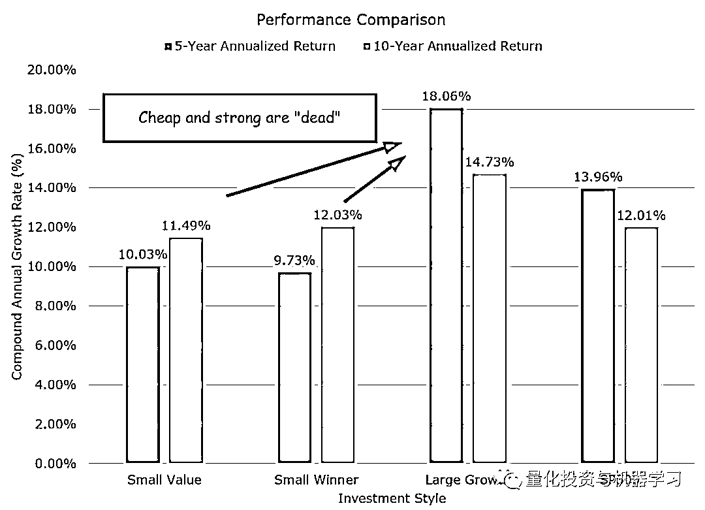

最后，如果我们看看 5 个不同市值大小下的价值和动量，在分析过去 5 年历史回报时我们会发现一些额外的规律

首先，按市值大小五等分划分的价值/成长投资组合图：

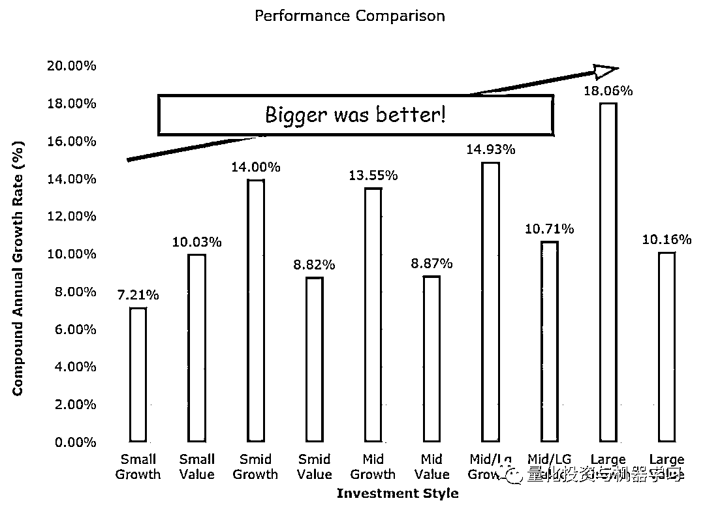

结论：大市值全面战胜小市值，价值全面受挫，除小盘外。

然后，按市值大小五等分划分的高动量/低动量投资组合图：

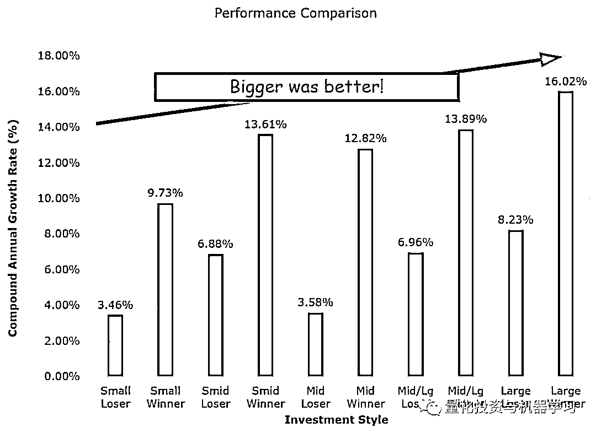

结论：大市值全面战胜小市值，动量在所有市值上都能发挥作用。

**结论**  

这篇文章的目的是让读者更加细致地了解常见的投资因子，以及他们相对于所谓的“市场”的表现，通常用标普 500 指数来表示。长话短说，相对于标普 500 指数而言，所有因子看起来表现的都很差。这是因为标普 500 指数暴露在大市值 Beta 上，这一暴露使得它在过去五年几乎战胜了所有其他大类资产类。

我们还发现，**动量并未失效**，并且在大盘股和小盘股中都表现出了希望。

另一方面，价值可能已经死亡，至少在大市值中。

以下是 Ken French 对 5×5 动量组合的详细解释，这是我们获得大盘高动量数据的地方（价值也类似）：

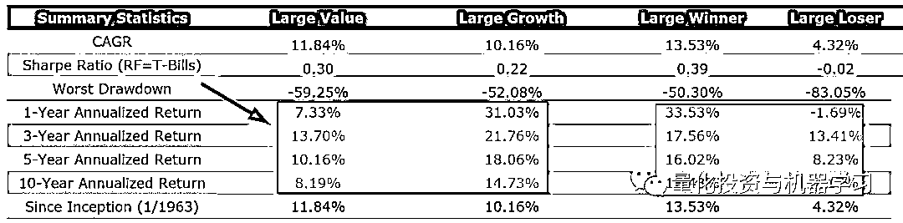

下面是 1963 年至 2018 年 9 月 30 日的历史表现图表，其中包括 Ken French 网站上的大盘价值和大型成长投资组合：

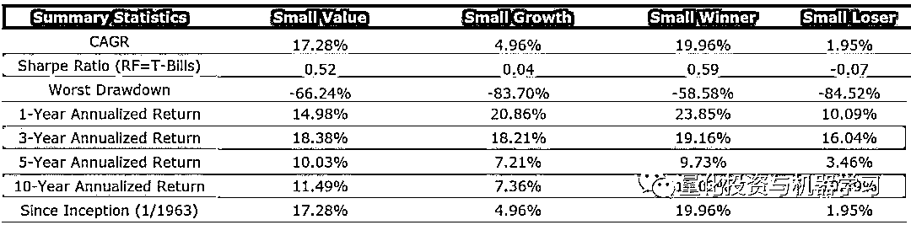

*—End—*

量化投资与机器学习微信公众号，是业内垂直于**Quant**、**MFE**、**CST**等专业的主流自媒体。公众号拥有来自**公募、私募、券商、银行、海外**等众多圈内**10W+**关注者。每日发布行业前沿研究成果和最新资讯。

