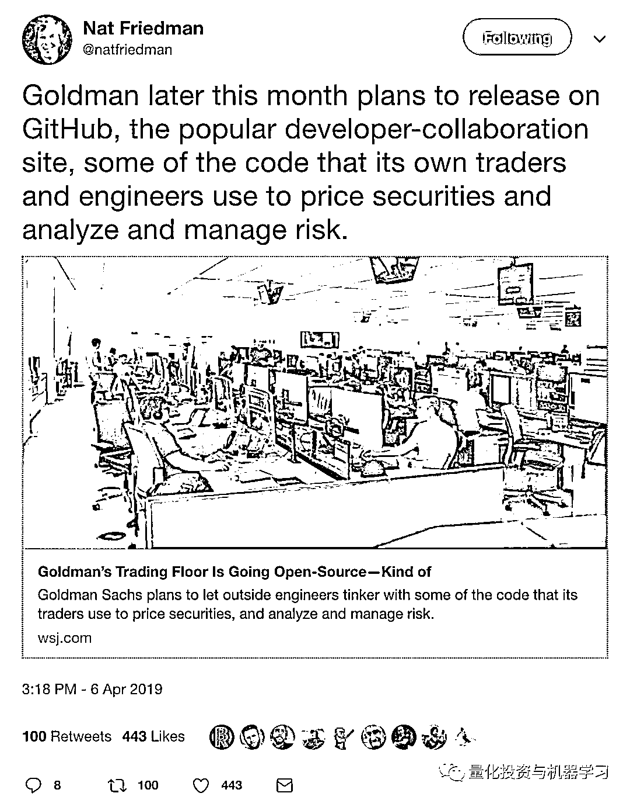
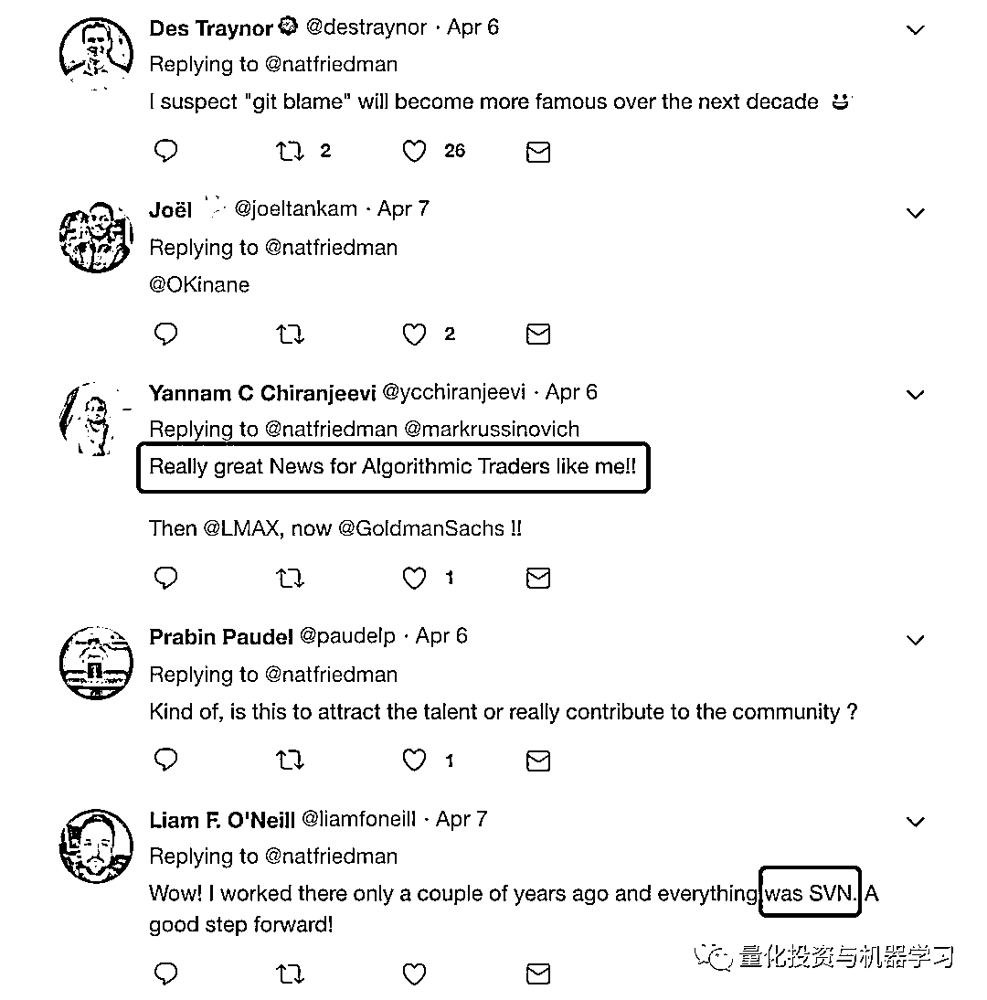
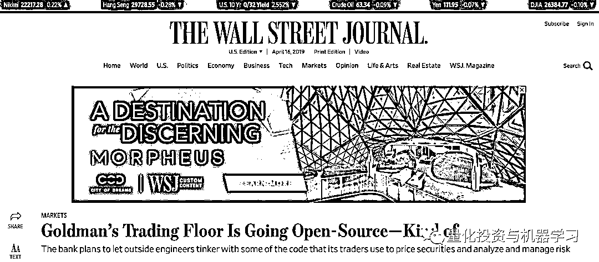
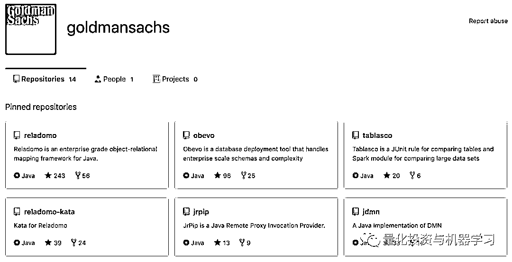
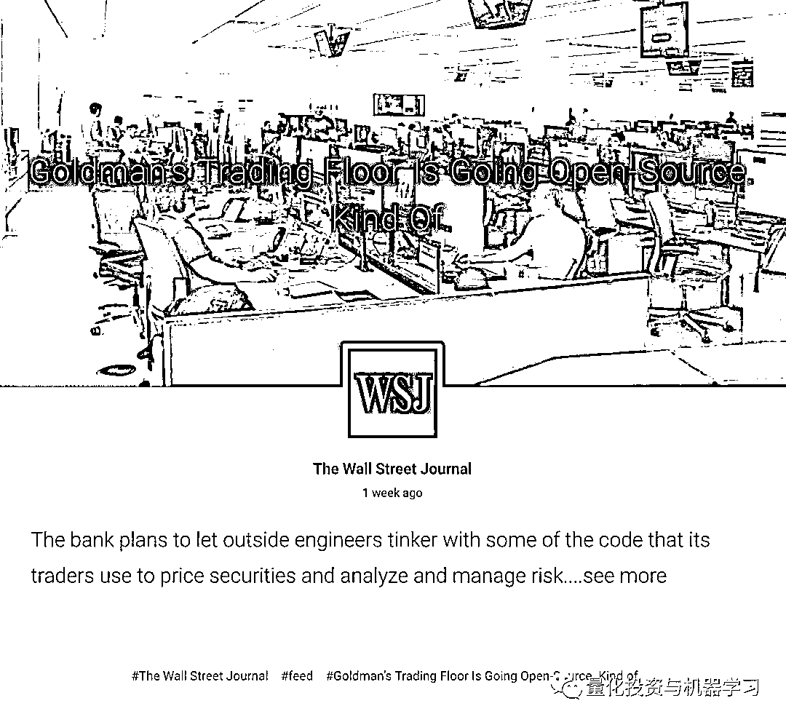

# 详细报道 | 关于高盛在 Github 开源背后的真相！

> 原文：[`mp.weixin.qq.com/s?__biz=MzAxNTc0Mjg0Mg==&mid=2653291594&idx=1&sn=7703403c5c537061994396e7e49e7ce5&chksm=802dc65fb75a4f49019cec951ac25d30ec7783738e9640ec108be95335597361c427258f5d5f&scene=27#wechat_redirect`](http://mp.weixin.qq.com/s?__biz=MzAxNTc0Mjg0Mg==&mid=2653291594&idx=1&sn=7703403c5c537061994396e7e49e7ce5&chksm=802dc65fb75a4f49019cec951ac25d30ec7783738e9640ec108be95335597361c427258f5d5f&scene=27#wechat_redirect)

**标星★公众号**，第一时间获取最新研究

**近期原创文章：**

## ♥ [基于无监督学习的期权定价异常检测（代码+数据）](https://mp.weixin.qq.com/s?__biz=MzAxNTc0Mjg0Mg==&mid=2653290562&idx=1&sn=dee61b832e1aa2c062a96bb27621c29d&chksm=802dc257b75a4b41b5623ade23a7de86333bfd3b4299fb69922558b0cbafe4c930b5ef503d89&token=1298662931&lang=zh_CN&scene=21#wechat_redirect)

## ♥ [5 种机器学习算法在预测股价的应用（代码+数据）](https://mp.weixin.qq.com/s?__biz=MzAxNTc0Mjg0Mg==&mid=2653290588&idx=1&sn=1d0409ad212ea8627e5d5cedf61953ac&chksm=802dc249b75a4b5fa245433320a4cc9da1a2cceb22df6fb1a28e5b94ff038319ae4e7ec6941f&token=1298662931&lang=zh_CN&scene=21#wechat_redirect)

## ♥ [深入研读：利用 Twitter 情绪去预测股市](https://mp.weixin.qq.com/s?__biz=MzAxNTc0Mjg0Mg==&mid=2653290402&idx=1&sn=efda9ea106991f4f7ccabcae9d809e00&chksm=802e3db7b759b4a173dc8f2ab5c298ab3146bfd7dd5aca75929c74ecc999a53b195c16f19c71&token=1330520237&lang=zh_CN&scene=21#wechat_redirect)

## ♥ [Two Sigma 用新闻来预测股价走势，带你吊打 Kaggle](https://mp.weixin.qq.com/s?__biz=MzAxNTc0Mjg0Mg==&mid=2653290456&idx=1&sn=b8d2d8febc599742e43ea48e3c249323&chksm=802e3dcdb759b4db9279c689202101b6b154fb118a1c1be12b52e522e1a1d7944858dbd6637e&token=1330520237&lang=zh_CN&scene=21#wechat_redirect)

## ♥ [利用深度学习最新前沿预测股价走势](https://mp.weixin.qq.com/s?__biz=MzAxNTc0Mjg0Mg==&mid=2653290080&idx=1&sn=06c50cefe78a7b24c64c4fdb9739c7f3&chksm=802e3c75b759b563c01495d16a638a56ac7305fc324ee4917fd76c648f670b7f7276826bdaa8&token=770078636&lang=zh_CN&scene=21#wechat_redirect)

## ♥ [一位数据科学 PhD 眼中的算法交易](https://mp.weixin.qq.com/s?__biz=MzAxNTc0Mjg0Mg==&mid=2653290118&idx=1&sn=a261307470cf2f3e458ab4e7dc309179&chksm=802e3c93b759b585e079d3a797f512dfd0427ac02942339f4f1454bd368ba47be21cb52cf969&token=770078636&lang=zh_CN&scene=21#wechat_redirect)

## ♥ [基于 RNN 和 LSTM 的股市预测方法](https://mp.weixin.qq.com/s?__biz=MzAxNTc0Mjg0Mg==&mid=2653290481&idx=1&sn=f7360ea8554cc4f86fcc71315176b093&chksm=802e3de4b759b4f2235a0aeabb6e76b3e101ff09b9a2aa6fa67e6e824fc4274f68f4ae51af95&token=1865137106&lang=zh_CN&scene=21#wechat_redirect)

## ♥ [人工智能『AI』应用算法交易，7 个必踩的坑！](https://mp.weixin.qq.com/s?__biz=MzAxNTc0Mjg0Mg==&mid=2653289974&idx=1&sn=88f87cb64999d9406d7c618350aac35d&chksm=802e3fe3b759b6f5eca6e777364270cbaa0bf35e9a1535255be9751c3a77642676993a861132&token=770078636&lang=zh_CN&scene=21#wechat_redirect)

## ♥ [神经网络在算法交易上的应用系列（一）](https://mp.weixin.qq.com/s?__biz=MzAxNTc0Mjg0Mg==&mid=2653289962&idx=1&sn=5f5aa65ec00ce176501c85c7c106187d&chksm=802e3fffb759b6e9f2d4518f9d3755a68329c8753745333ef9d70ffd04bd088fd7b076318358&token=770078636&lang=zh_CN&scene=21#wechat_redirect)

## ♥ [预测股市 | 如何避免 p-Hacking，为什么你要看涨？](https://mp.weixin.qq.com/s?__biz=MzAxNTc0Mjg0Mg==&mid=2653289820&idx=1&sn=d3fee74ba1daab837433e4ef6b0ab4d9&chksm=802e3f49b759b65f422d20515942d5813aead73231da7d78e9f235bdb42386cf656079e69b8b&token=770078636&lang=zh_CN&scene=21#wechat_redirect)

## ♥ [如何鉴别那些用深度学习预测股价的花哨模型？](https://mp.weixin.qq.com/s?__biz=MzAxNTc0Mjg0Mg==&mid=2653290132&idx=1&sn=cbf1e2a4526e6e9305a6110c17063f46&chksm=802e3c81b759b597d3dd94b8008e150c90087567904a29c0c4b58d7be220a9ece2008956d5db&token=1266110554&lang=zh_CN&scene=21#wechat_redirect)

## ♥ [优化强化学习 Q-learning 算法进行股市](https://mp.weixin.qq.com/s?__biz=MzAxNTc0Mjg0Mg==&mid=2653290286&idx=1&sn=882d39a18018733b93c8c8eac385b515&chksm=802e3d3bb759b42d1fc849f96bf02ae87edf2eab01b0beecd9340112c7fb06b95cb2246d2429&token=1330520237&lang=zh_CN&scene=21#wechat_redirect)

公众号独家整理报道

编辑：Allen 

**开源改变了****人们对**

**软件和硬件的思考方式！**

**前言**

本月初，GitHub CEO Nat Friedman 在 Twitter 上发布了一条消息：

**解读：**本月晚些时候，高盛计划在 GitHub 上发布一些代码，高盛自己的交易员和工程师将利用这些代码为证券定价、分析和做风险管理。

下面的评论区的读者也是也是一片好评：  

与此同时，《华尔街日报》也报道了这个消息：

高盛在 Github 上发布代码已经至少两年了，但《华尔街日报》表示，即将发布的代码有点**特别**：**它将允许用户直接与 SecDB 的新 web 应用进行 Marquee 交互，包括数据提取、定价引擎和其他功能**。除此之外，高盛每年还为其提供 10 万美元的年度资金，资助工程师开发使用其代码构建的应用。

如果一切按计划进行，每个拥有 GitHub 账户的人都可以修改公司的代码行。然而，由此产生的知识产权将完全由高盛拥有。

报告称：高盛将放弃部分商标保密措施，分享其一度受到严密保护的技术。

在此之前，高盛在 GitHub 上发布了几个开源项目：

**Reladomo**

高盛在 GitHub 和 Maven Central 上正式发布了最新的 Apache 2.0 授权 Java 框架 Reladomo。

三个开源项目——Jrpip、Obevo 和 Tablasco。

**JRPIP**

Jrpip 实现了远程接口方法调用，允许不同的 Java 进程彼此交互。该产品旨在通过提供有用的功能来提高开发人员的效率，例如在任何 servlet 容器中部署的能力、不需要 RemoteException 的接口实现和使用一次执行语义的自动重试。此外，Jrpip 使用高效的二进制协议进行流处理，减少了内存消耗和垃圾收集器问题。“我们希望开源社区发现 Jrpip 是一个有用的 Java 库”。技术部门的副总裁兼技术研究员 Mohammad 说。“使用 Jrpip，开发人员可以专注于他们的代码，而不必担心网络管道和 TCP 错误。”

**OBEVO**

Obevo 是一个数据库部署工具，帮助团队管理软件开发生命周期（SDLC）过程中的数据库更改。除了处理生产部署之外，Obevo 还通过定义一个干净的结构来维护 DB 对象代码来辅助开发阶段，并使用内存中数据库转换等特性来帮助测试阶段。值得注意的是，Obevo 是为企业规模和复杂性的系统设计的，可以在一个模式中管理数百个 DB 对象，同时仍然以一种简单的方式处理新模式。“我们觉得，我们有能力搭载一个大型的、长期使用的系统，实现一个干净的 SDLC 流程，这是开源领域的一个关键区别”。技术部副总裁 Shant 说“。”通过将其发布到开放源码社区，我们希望帮助其他人在他们自己的 DB 部署环境中进行部署，同时围绕该工具发展一个强大的社区。”

**TABLASCO**

Tablasco 是一个 JUnit 规则，它将表验证添加到单元测试中。对于生成大量数据的软件产品，此工具可以帮助创建全面且易于维护的自动化测试。用户只需将现有数据调整为 Tablasco 能够理解的表格式。“每次测试都会生成一个彩色编码的 HTML break 报告，帮助用户快速识别问题”。技术部门副总裁 Barry 说。此外，Tablasco 具有自动化基线管理功能，允许用户轻松地更新失败测试的基线文件。

高盛正寻求与谷歌和 Facebook 等硅谷科技公司走同样的道路。这些公司通过开放技术来源，显著改善了业务。

通过这一大胆的步骤，高盛希望为其技术获得新的用例，并赢得计算机驱动的量化交易员的青睐。

据报道，在 2008 年全球金融危机之前，高盛的自营交易引擎 SecDB 将该公司的交易员打造成了华尔街最聪明的专业人士，甚至被认为使高盛比竞争对手更好地缓冲了金融危机的影响。

然而，由于金融危机后对自营交易系统的全面禁令，高盛此后将 SecDB 变成了一个名为 Marquee 的网络应用程序，目前已吸引了约 1.3 万名用户，其中包括其员工和客户。

随着 Marquee 在 GitHub 上的上线，用户将能够直接与它的数据提要、定价引擎等进行交互。

值得注意的是，高盛的新举措可能预示着更伟大的事情即将到来，因为该公司最近一直对分散的区块链技术世界表现出兴趣。

2018 年 8 月，BTCManager 获悉，作为在传统金融行业部署区块链解决方案的更广泛计划的一部分，高盛参与了区块链创业公司 Axoni 的 B 轮融资。

看来顶尖投行也在 GitHub 上开源一些内容啦。很值得期待！

下面我们来具体看看高盛这一路的历程。

**Marquee**

**据报道，高盛正计划**发布 API**，使人们能够在 GitHub 上访问名为 **Marquee** 的平台。**

**Marquee 是一个**基于 web 的平台****，建立在风险和定价引擎 SecDB 之上**。高盛计划发布 API（应用程序编程接口），以便通过 web 与 Marquee 平台进行交互。**

**所谓 Marquee，是高盛近年来的重磅科技产品，其目的是为了将大宗股票交易电子化而创立的开源平台，允许接入多种投资应用。**

**Marquee 的大宗交易算法执行交易只须数秒，而人工交易则以分钟或小时计。**

**大宗交易涉及 1 万股或价值 20 万美元的股票，如果客户希望买入和卖出大宗股票，他们愿意多付费用来保证流动性和亲自操作。**

**这是华尔街银行进行自动大宗交易的又一最新尝试，对股票业务而言是一个亮点，因为目前绝大多数股票业务都是人工实现的，而非专业化的计算机程序。**

**高盛也曾在声明中表示，将致力于把 Marquee 平台打造成世界级的金融服务与风险管理平台，而赚钱与否是次要的关注点。**

****

**James Blackha，前高盛担任数字结构主管。他负责设计、规划、实施、交付和推出 Marquee。**

**他表示：“在最初阶段，Marquee 致力于让客户与银行进行电子互动。”**

**Marquee 还开放了高盛的各个部门，并把他们带到了一个平台上来。**

**James Blackha 表示：“Marquee 本质上是一个平台，允许高盛的不同业务以安全和一致的方式向客户开放”。**

**它还允许客户在不与高盛销售团队沟通的情况下自学并快速做出决定。这个应用程序的一个例子是 SIMON（结构化投资市场 Online）。这让客户能够了解结构性产品，并通过一个应用程序执行交易。在此之前，他们必须与高盛的结构性产品专家沟通，才能了解其交易内容。**

**这一举措意义重大，因为目前**只有高盛（Goldman Sachs）、摩根大通（J.P.Morgan）和摩根士丹利（Morgan Stanley）这三家顶级投行拥有 GitHub 账户**。瑞银（UBS）、瑞士信贷（Credit Suisse）、巴克莱（Barclays）、美国银行（Bank of America）和德意志银行（Deutsche）等投行要么没有 GitHub 账户，要么什么都没有。对于这样做的公司，除了摩根大通的法定人数外，所有项目本质上都是非财务性质的：它们只是软件工程工具和实用程序。因此，对于一家银行来说，发布代码直接链接到定价引擎等服务是迈向 21 世纪的重要一步。这也是他们在校招中可以称道的事情。**

****高盛此举真的有这么大的影响吗？**客户已经能够通过第三方系统（如 TradeWeb）或具有 API 的单一交易商平台与高盛这样的银行进行价格发现（Price Discovery）。SecDB 的报价请求（RFQ）通常会自动定价，但它们是隐藏在平台背后的黑盒子。我们认为，高盛将努力为量化研究人员和交易员提供工具和服务，让他们融入自己的工作流程，然后鼓励他们在此基础上进行交易。**

****知识点****

**价格发现（Price Discovery）是指买卖双方在给定的时间和地方对一种商品的质量和数量达成交易价格的过程。**

**它涉及市场结构、市场行为、市场信息、期货市场和风险管理。价格发现并不混同于一般意义上的价格决定（Price Determination）。”价格发现是期货市场的一个重要的经济功能，也是期货市场存在和发展的基础。**

****SecDB****

**众所周知，证券数据库是高盛的特殊优势。这个系统也被称为 SecDB，允许高盛定价交易并评估每日 280 万交易头寸的风险，是竞争优势的巨大来源，也是其他银行正在努力效仿的东西。**

**一位前高盛内部人士表示：“你必须知道，SecDB 是一个拥有大量天才创意令人惊叹的平台，但它只有 26 年或 27 年的历史。”。“在上世纪 90 年代和本世纪头十年，有很多技术选择对该行业非常有利，但现在情况不同了。例如，当时，你可能每天有几十万笔交易，但现在，在电子外汇交易中，你可能每天有 100 万笔交易。你如何将一个可以处理 10 万笔交易的系统扩展到数百万笔？”**

**了解 SecDB 需要了解高盛的历史。SecDB 高盛 1981 年收购的外汇和大宗商品经纪公司 J Aron 创立。直到 21 世纪初，J Aron 才被高盛完全吸收，得以继续开发自己的技术。 J Aron 在 1992 年左右开始使用 SecDB。也许是在 2006 年或 2007 年，整个公司才开始运营它。每次出现像 1998 年亚洲危机或 2002 年互联网泡沫破裂这样的危机时，J Aron 的 SecDB 系统都会进一步扩展。**

**从一开始，SecDB 就 J Aron 的“战略”团队及其技术人员的合作成果。目前负责高盛资产管理量化交易业务的 Armen Avanessians 负责该公司的策略。技术部门由 Mike Dubno、Glenn Gribble 和 Kevin Lundeen 管理。他们都是非常有才华的技术人员，但这是在 1991 年。今天的许多编程语言根本不存在。**

****Slang ****

**在没有 Python 的情况下，高盛的技术人员发明了他们自己的语言：**Slang** **

**人们意识到，像 C++这样的语言有利于提高执行速度，它运行得非常快,但它是一种复杂的语言，需要很长时间来开发。技术人员认为他们需要一种更容易使用的语言，一种可以在 Windows、Solaris 和 Unix 系统上运行的解释性语言。所以他们想出了 Slang。**

**如今，高盛仍然用 Slang 来编码 SecDB。根据各种估计，这个系统是建立在 1500 万到 4000 万行 Slang 代码之上的。Slang 曾对高盛有好处，但现在有了更好的东西：**Python**。**

**其他正在开发 SecDB 这样系统的银行现在都在使用 Python。使用 Python，你可以利用 TensorFlow 之类的东西。高盛做不到这一点，因为 Slang，它被困在了公司内部。使用 Slang，你不能从其他地方传播思想。最终，这将减缓高盛的创新步伐。**

**那么，为什么现在不把 Slang 移开呢？这并不容易：1500 多万行代码不可能在一夜之间被替换掉。这可能需要十年甚至更长时间。**

**高盛其他内部人士说：”公司意识到了这些问题，多年来一直在解决这些问题。高盛一位前合伙人表示，17 年前，当 SecDB 在股票领域推出时，可扩展性问题得到了解决。这是电子交易兴起的开始。所以我们解决了可扩展性的问题”。其他人表示，高盛已经拥有 "JSI" 或 Java Slang 集成一种使用 Java 代码访问 SecDB 的方法，并开发了 Python 包装器。**

**这种向 Java 的转变被认为与雇佣 Java 程序员相对容易有关。这也是 Slang 的另一个问题：除非你在高盛长大，否则你不会熟悉它。如果你在高盛从事 Slang 工作，你就会落后于 Python 等语言的所有创新。高盛一位技术内部人士承认：“这加大了横向招聘的难度”。这是高盛需要雇佣这么多 STEM 学生的一个很好的理由：它必须自下而上地培训 Slang 程序员。**

**学习 Slang 也不是那么繁重。一个好的程序员很容易学会俚语。你不用 Python 并不重要。SecDB 有它的局限性，但它已经维持了 25 年，所以它一定很好。**

**随着高盛以招牌形式向客户推出 SecDB，摩根大通等银行正在紧追高盛。摩根大通还聘请了微软的一位顶级人工智能专家来开发一个新的全球机器学习部门等等。**

**不过，让我们明确一下这一点。这不是秘诀。从历史上看，SecDB 和更新的 Marquee 并不是高盛历来成为交易大佬的唯一原因。**SecDB 是一个风险管理平台，它根据理论模型对衍生品合约进行有效定价的能力，但并不能产生 Alpha 值**，只有当交易部门的头寸、客户盈利能力和成本/佣金等额外数据被加入时，它才会变得有趣。显然，**这些数据不会通过这些 API 公开**。**

**如果你是客户，通过 Marquee API 访问 SecDB 可能会降低你的基础设施开销，并根据提供的服务减少投放市场的时间。**但这是有代价的：****高盛将知道你在做什么，而且可能会为更有用的功能收取高昂的费用。****

**最终，我们怀疑高盛会想要像亚马逊那样将其平台货币化。从长远来看，它在这个过程中获得的数据无疑将具有巨大的价值。**

**高盛工程师 Andy Phillips 表示：“我们希望成为量化投融资的一员，就像 Amazon 成为计算能力的一员一样“。亚马逊在成立之初就意识到，它可以出售额外的服务器容量；去年，亚马逊网络服务贡献了该公司四分之三的利润。**

**据报道，摩根大通在 Athena 平台的外部可用性方面并没有落后太多，但高盛 Github 的努力表明，它将更进一步。**

****推荐阅读****

**[01、经过多年交易之后你应该学到的东西（深度分享）](https://mp.weixin.qq.com/s?__biz=MzAxNTc0Mjg0Mg==&mid=2653289074&idx=1&sn=e859d363eef9249236244466a1af41b6&chksm=802e3867b759b1717f77e07a51ee5671e8115130c66562577280ba1243cba08218add04f1f00&token=449379994&lang=zh_CN&scene=21#wechat_redirect)** 

**[02、监督学习标签在股市中的应用（代码+书籍）](https://mp.weixin.qq.com/s?__biz=MzAxNTc0Mjg0Mg==&mid=2653289050&idx=1&sn=60043a5c95b877dd329a5fd150ddacc4&chksm=802e384fb759b1598e500087374772059aa21b31ae104b3dca04331cf4b63a233c5e04c1945a&token=449379994&lang=zh_CN&scene=21#wechat_redirect)**

**[03、全球投行顶尖机器学习团队全面分析](https://mp.weixin.qq.com/s?__biz=MzAxNTc0Mjg0Mg==&mid=2653289018&idx=1&sn=8c411f676c2c0d92b0dd218f041bee4b&chksm=802e382fb759b139ffebf633ac14cdd0f21938e4613fe632d5d9231dab3d2aca95a11628378a&token=449379994&lang=zh_CN&scene=21#wechat_redirect)** 

**[04、使用 Tensorflow 预测股票市场变动](https://mp.weixin.qq.com/s?__biz=MzAxNTc0Mjg0Mg==&mid=2653289014&idx=1&sn=3762d405e332c599a21b48a7dc4df587&chksm=802e3823b759b135928d55044c2729aea9690f86752b680eb973d1a376dc53cfa18287d0060b&token=449379994&lang=zh_CN&scene=21#wechat_redirect)**

**[05、使用 LSTM 预测股票市场基于 Tensorflow](https://mp.weixin.qq.com/s?__biz=MzAxNTc0Mjg0Mg==&mid=2653289238&idx=1&sn=3144f5792f84455dd53c27a78e8a316c&chksm=802e3903b759b015da88acde4fcbc8547ab3e6acbb5a0897404bbefe1d8a414265d5d5766ee4&token=2020206794&lang=zh_CN&scene=21#wechat_redirect)**

**[06、美丽的回测——教你定量计算过拟合概率](https://mp.weixin.qq.com/s?__biz=MzAxNTc0Mjg0Mg==&mid=2653289314&idx=1&sn=87c5a12b23a875966db7be50d11f09cd&chksm=802e3977b759b061675d1988168c1fec06c602e8583fbcc9b76f87008e0c10b702acc85467a0&token=1972390229&lang=zh_CN&scene=21#wechat_redirect)**

**[07、利用动态深度学习预测金融时间序列基于 Python](https://mp.weixin.qq.com/s?__biz=MzAxNTc0Mjg0Mg==&mid=2653289347&idx=1&sn=bf5d7899bc4a854d4ba9046fdc6fe0d6&chksm=802e3996b759b080287213840987bb0a0c02e4e1d4d7aae23f10a225a92ef6dd922d8006123d&token=290397496&lang=zh_CN&scene=21#wechat_redirect)**

**[08、Facebook 开源神器 Prophet 预测时间序列基于 Python](https://mp.weixin.qq.com/s?__biz=MzAxNTc0Mjg0Mg==&mid=2653289394&idx=1&sn=24a836136d730aa268605628e683d629&chksm=802e39a7b759b0b1dcf7aaa560699130a907716b71fc9c45ff0e5d236c5ae8ef80ebdb09dbb6&token=290397496&lang=zh_CN&scene=21#wechat_redirect)**

**[09、Facebook 开源神器 Prophet 预测股市行情基于 Python](https://mp.weixin.qq.com/s?__biz=MzAxNTc0Mjg0Mg==&mid=2653289437&idx=1&sn=f0dca7da8e69e7ba736992cb3d034ce7&chksm=802e39c8b759b0de5bce401c580623d0729ecca69d13926479d36e19aff8c9c9e8a20265afff&token=290397496&lang=zh_CN&scene=21#wechat_redirect)**

**[10、2018 第三季度最受欢迎的券商金工研报前 50（附下载）](https://mp.weixin.qq.com/s?__biz=MzAxNTc0Mjg0Mg==&mid=2653289358&idx=1&sn=db6e8ab85b08f6e67790ec0e401e586e&chksm=802e399bb759b08d6eec855f9901ea856d0da68c7425cba62791b8948da6ad761a3d88543dad&token=290397496&lang=zh_CN&scene=21#wechat_redirect)** 

**[11、实战交易策略的精髓（公众号深度呈现）](https://mp.weixin.qq.com/s?__biz=MzAxNTc0Mjg0Mg==&mid=2653289447&idx=1&sn=f2948715bf82569a6556d518e56c1f9e&chksm=802e39f2b759b0e4502d1aaac562b87789573b55c76b3c85897d8c9d88dbf9a0b7ee34d86a4e&token=290397496&lang=zh_CN&scene=21#wechat_redirect)**

**[12、Markowitz 有效边界和投资组合优化基于 Python](https://mp.weixin.qq.com/s?__biz=MzAxNTc0Mjg0Mg==&mid=2653289478&idx=1&sn=f8e01a641be021993d8ef2d84e94a299&chksm=802e3e13b759b7055cf27a280c672371008a5564c97c658eee89ce8481396a28d254836ff9af&token=290397496&lang=zh_CN&scene=21#wechat_redirect)**

**[13、使用 LSTM 模型预测股价基于 Keras](https://mp.weixin.qq.com/s?__biz=MzAxNTc0Mjg0Mg==&mid=2653289495&idx=1&sn=c4eeaa2e9f9c10995be9ea0c56d29ba7&chksm=802e3e02b759b7148227675c23c403fb9a543b733e3d27fa237b53840e030bf387a473d83e3c&token=1260956004&lang=zh_CN&scene=21#wechat_redirect)**

**[14、量化金融导论 1：资产收益的程式化介绍基于 Python](https://mp.weixin.qq.com/s?__biz=MzAxNTc0Mjg0Mg==&mid=2653289507&idx=1&sn=f0ca71aa07531bbbdbd33213f0bab89f&chksm=802e3e36b759b720138b3b17a4dd0e198e054b9de29a038fdd50805f824effa55831111ad026&token=1936245282&lang=zh_CN&scene=21#wechat_redirect)**

**[15、预测股市崩盘基于统计机器学习与神经网络（Python+文档）](https://mp.weixin.qq.com/s?__biz=MzAxNTc0Mjg0Mg==&mid=2653289533&idx=1&sn=4ef964834e84a9995111bb057b0fc5dd&chksm=802e3e28b759b73e0618eb1262c53aa0601fbf5805525a7c7ff40dc3db62c7704496611bdbf1&token=1950551577&lang=zh_CN&scene=21#wechat_redirect)**

**[16、实现最优投资组合有效前沿基于 Python（附代码）](https://mp.weixin.qq.com/s?__biz=MzAxNTc0Mjg0Mg==&mid=2653289609&idx=1&sn=c7f0b3e47025862d10bb53b6ab88bcda&chksm=802e3e9cb759b78abf6b8b049c59bf18ccfb2ead7580d1f557d36de2292f59dcbd94dcd41910&token=2085008037&lang=zh_CN&scene=21#wechat_redirect)**

**[17、精心为大家整理了一些超级棒的机器学习资料（附链接）](https://mp.weixin.qq.com/s?__biz=MzAxNTc0Mjg0Mg==&mid=2653289615&idx=1&sn=1cdc89afb997d0c580bf0cef296d946c&chksm=802e3e9ab759b78ce9f0cd152a680d4a413d6c8dcb02a7a296f4091993a7e4137e7520394575&token=2085008037&lang=zh_CN&scene=21#wechat_redirect)**

**[18、海量 Wind 数据，与全网用户零距离邂逅！](https://mp.weixin.qq.com/s?__biz=MzAxNTc0Mjg0Mg==&mid=2653289623&idx=1&sn=28a3600fd7a72d7be00b066ca0f98244&chksm=802e3e82b759b7943f43a4f6ef4a91e4153fa6b8210de9590235fa8ee66eb9811ce177054dbc&token=1389401983&lang=zh_CN&scene=21#wechat_redirect)**

**[19、机器学习、深度学习、量化金融、Python 等最新书籍汇总下载](https://mp.weixin.qq.com/s?__biz=MzAxNTc0Mjg0Mg==&mid=2653289640&idx=1&sn=34e94fcbe99052b8e7381ecc48a36dc0&chksm=802e3ebdb759b7ab897cd329a680715b6f8294e63550ddf0c57b9e1320b2b7d1408c6fdca0c7&token=1389401983&lang=zh_CN&scene=21#wechat_redirect)**

**[20、各大卖方 2019 年 A 股策略报告，都是有故事的人！](https://mp.weixin.qq.com/s?__biz=MzAxNTc0Mjg0Mg==&mid=2653289725&idx=1&sn=4b65cd1fb8331438e4c0b3d0eae6b51f&chksm=802e3ee8b759b7fe1b94e84d54cc23b0ab05853d5cd227812574b350e9fc2cce9e5f1bc6cb7a&token=1389401983&lang=zh_CN&scene=21#wechat_redirect)**

***—End—***

**量化投资与机器学习微信公众号，是业内垂直于**Quant**、**MFE**、**CST**等专业的主流自媒体。公众号拥有来自**公募、私募、券商、银行、海外**等众多圈内**10W+**关注者。每日发布行业前沿研究成果和最新资讯。**

****