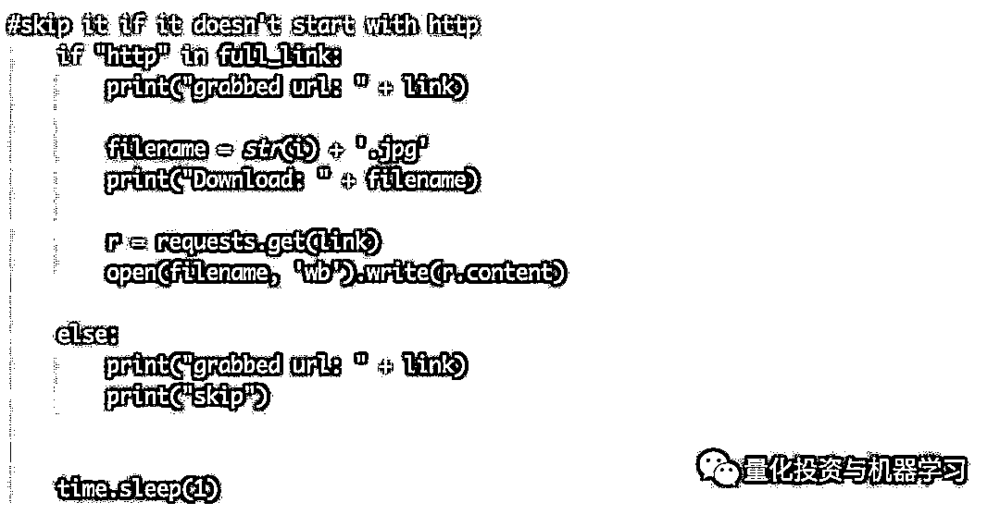

# 权力的游戏收官，我用 Python 致敬这场血雨腥风（附代码）

> 原文：[`mp.weixin.qq.com/s?__biz=MzAxNTc0Mjg0Mg==&mid=2653291579&idx=1&sn=a17048be443ed4ee3f1598b7ec935551&chksm=802dc62eb75a4f389e675afd15f1d02564bc000ad5d49efa449c2b734995f2abed6d1c18b6f7&scene=27#wechat_redirect`](http://mp.weixin.qq.com/s?__biz=MzAxNTc0Mjg0Mg==&mid=2653291579&idx=1&sn=a17048be443ed4ee3f1598b7ec935551&chksm=802dc62eb75a4f389e675afd15f1d02564bc000ad5d49efa449c2b734995f2abed6d1c18b6f7&scene=27#wechat_redirect)

**标星★公众号**，第一时间获取最新研究

作者：Rocky Kev

编译：公众号编辑部

**近期原创文章：**

## ♥ [基于无监督学习的期权定价异常检测（代码+数据）](https://mp.weixin.qq.com/s?__biz=MzAxNTc0Mjg0Mg==&mid=2653290562&idx=1&sn=dee61b832e1aa2c062a96bb27621c29d&chksm=802dc257b75a4b41b5623ade23a7de86333bfd3b4299fb69922558b0cbafe4c930b5ef503d89&token=1298662931&lang=zh_CN&scene=21#wechat_redirect)

## ♥ [5 种机器学习算法在预测股价的应用（代码+数据）](https://mp.weixin.qq.com/s?__biz=MzAxNTc0Mjg0Mg==&mid=2653290588&idx=1&sn=1d0409ad212ea8627e5d5cedf61953ac&chksm=802dc249b75a4b5fa245433320a4cc9da1a2cceb22df6fb1a28e5b94ff038319ae4e7ec6941f&token=1298662931&lang=zh_CN&scene=21#wechat_redirect)

## ♥ [深入研读：利用 Twitter 情绪去预测股市](https://mp.weixin.qq.com/s?__biz=MzAxNTc0Mjg0Mg==&mid=2653290402&idx=1&sn=efda9ea106991f4f7ccabcae9d809e00&chksm=802e3db7b759b4a173dc8f2ab5c298ab3146bfd7dd5aca75929c74ecc999a53b195c16f19c71&token=1330520237&lang=zh_CN&scene=21#wechat_redirect)

## ♥ [Two Sigma 用新闻来预测股价走势，带你吊打 Kaggle](https://mp.weixin.qq.com/s?__biz=MzAxNTc0Mjg0Mg==&mid=2653290456&idx=1&sn=b8d2d8febc599742e43ea48e3c249323&chksm=802e3dcdb759b4db9279c689202101b6b154fb118a1c1be12b52e522e1a1d7944858dbd6637e&token=1330520237&lang=zh_CN&scene=21#wechat_redirect)

## ♥ [利用深度学习最新前沿预测股价走势](https://mp.weixin.qq.com/s?__biz=MzAxNTc0Mjg0Mg==&mid=2653290080&idx=1&sn=06c50cefe78a7b24c64c4fdb9739c7f3&chksm=802e3c75b759b563c01495d16a638a56ac7305fc324ee4917fd76c648f670b7f7276826bdaa8&token=770078636&lang=zh_CN&scene=21#wechat_redirect)

## ♥ [一位数据科学 PhD 眼中的算法交易](https://mp.weixin.qq.com/s?__biz=MzAxNTc0Mjg0Mg==&mid=2653290118&idx=1&sn=a261307470cf2f3e458ab4e7dc309179&chksm=802e3c93b759b585e079d3a797f512dfd0427ac02942339f4f1454bd368ba47be21cb52cf969&token=770078636&lang=zh_CN&scene=21#wechat_redirect)

## ♥ [基于 RNN 和 LSTM 的股市预测方法](https://mp.weixin.qq.com/s?__biz=MzAxNTc0Mjg0Mg==&mid=2653290481&idx=1&sn=f7360ea8554cc4f86fcc71315176b093&chksm=802e3de4b759b4f2235a0aeabb6e76b3e101ff09b9a2aa6fa67e6e824fc4274f68f4ae51af95&token=1865137106&lang=zh_CN&scene=21#wechat_redirect)

## ♥ [人工智能『AI』应用算法交易，7 个必踩的坑！](https://mp.weixin.qq.com/s?__biz=MzAxNTc0Mjg0Mg==&mid=2653289974&idx=1&sn=88f87cb64999d9406d7c618350aac35d&chksm=802e3fe3b759b6f5eca6e777364270cbaa0bf35e9a1535255be9751c3a77642676993a861132&token=770078636&lang=zh_CN&scene=21#wechat_redirect)

## ♥ [神经网络在算法交易上的应用系列（一）](https://mp.weixin.qq.com/s?__biz=MzAxNTc0Mjg0Mg==&mid=2653289962&idx=1&sn=5f5aa65ec00ce176501c85c7c106187d&chksm=802e3fffb759b6e9f2d4518f9d3755a68329c8753745333ef9d70ffd04bd088fd7b076318358&token=770078636&lang=zh_CN&scene=21#wechat_redirect)

## ♥ [预测股市 | 如何避免 p-Hacking，为什么你要看涨？](https://mp.weixin.qq.com/s?__biz=MzAxNTc0Mjg0Mg==&mid=2653289820&idx=1&sn=d3fee74ba1daab837433e4ef6b0ab4d9&chksm=802e3f49b759b65f422d20515942d5813aead73231da7d78e9f235bdb42386cf656079e69b8b&token=770078636&lang=zh_CN&scene=21#wechat_redirect)

## ♥ [如何鉴别那些用深度学习预测股价的花哨模型？](https://mp.weixin.qq.com/s?__biz=MzAxNTc0Mjg0Mg==&mid=2653290132&idx=1&sn=cbf1e2a4526e6e9305a6110c17063f46&chksm=802e3c81b759b597d3dd94b8008e150c90087567904a29c0c4b58d7be220a9ece2008956d5db&token=1266110554&lang=zh_CN&scene=21#wechat_redirect)

## ♥ [优化强化学习 Q-learning 算法进行股市](https://mp.weixin.qq.com/s?__biz=MzAxNTc0Mjg0Mg==&mid=2653290286&idx=1&sn=882d39a18018733b93c8c8eac385b515&chksm=802e3d3bb759b42d1fc849f96bf02ae87edf2eab01b0beecd9340112c7fb06b95cb2246d2429&token=1330520237&lang=zh_CN&scene=21#wechat_redirect)

# **Game of Thrones**

在这篇文章中，我们将使用 Selenium 库实现 web 自动化，使用 BeautifulSoup 库实现 web 抓取，并使用 csv 模块生成报告。

所有的例子都会用到权力的游戏。

你不需要任何 Python 经验就可以做到这一点。我们将解释代码。

** Web 自动化**

使用 Python 可以做的最酷的事情之一是 web 自动化。

例如，你可以编写一个 Python 脚本：

*1、打开浏览器*

*2、自动访问特定网站*

*3、登录该站点*

*4、转到网站的另一部分*

*5、查找最新的博文*

*6、打开那篇博文*

*7、提交一条评论说：**“写得好！**666”*

*8、最后退出该网站*

这似乎并不难做到。这需要什么，20 秒？

如果你不得不一遍又一遍地这样做，你会发疯的。

例如，如果您的暂存网站仍在开发中，其中有 100 篇博客文章，并且你希望在每个页面上都发布一条评论来测试其功能，那么该怎么办？

**100 篇博客文章* 20 秒 = 大约 33 分钟**

如果有多个测试阶段，你不得不重复测试 6 次，结果会怎样？

web 自动化的其他用例包括：

*   可能希望在站点上自动创建帐户。

*   你可能希望从在线课程中从头到尾运行一个机器人。

*   你可能需要推送 100 个机器人，使用单个脚本在你的站点上提交表单。

**我们要做什么**

在这一部分中，我们将自动登录《权力的游戏》粉丝网站。

当你不得不浪费时间登录 westeros.org，/ r / freefolk subreddit，winteriscoming.net 以及所有其他粉丝网站时，你不讨厌吗？

**使用此模板，你可以自动登录各种网站！**

现在来看《权力的游戏》。

**代码**

你需要安装 Python 3、Selenium 和 Firefox web 驱动程序才能开始。

*https:**//rockykev.com/how-to-automate-form-submissions-logins/*

**分解代码**

首先，导入 Selenium 库来帮助完成繁重的工作。

再导入了时间库，因此在每个操作之后，它将等待 x 秒。添加等待允许页面加载。

**Selenium 是什么?**

Selenium 是用于 web 自动化的 Python 库。Selenium 开发了一个 API，因此第三方作者可以开发 web 驱动程序来与浏览器通信。这样，Selenium 团队可以专注于他们的代码库，而另一个团队可以专注于中间件。

例如:

Chromium 团队为 Selenium 开发了自己的 webdriver，称为 chromedriver。

Firefox 团队为 Selenium 开发了自己的 web 驱动程序 geckodriver。

Opera 团队为 Selenium 开发了自己的 web 驱动程序 operadriver。

在上面的代码中，要求 Selenium“将 Firefox 设置为首选浏览器”，“将此链接传递给 Firefox”，最后“关闭 Firefox”。 用 geckodriver 来做那件事。

**登录到网站**

为了便于阅读，我们编写了一个单独的函数来登录每个站点，以显示我们正在创建的模式。

如果我们把它进一步分解，每个函数都有以下元素。

我们告诉 Python：

**1、访问特定的页面**

    driver.get (“https://asoiaf.westeros.org/index.php?/login/”)  

**2.、寻找登录框**

    * 如果有，请清除文本

    * 提交我的变量

**3、寻找密码框**

    * 如有文本，请清除

    * 提交我的变量

**4、寻找提交按钮，然后单击它**

注意：每个网站都有不同的方法来找到用户名/密码和提交按钮。你需要做一些搜索。

**如何找到任何网站的登录框和密码框**

Selenium 库提供了许多方便的方法来查找网页上的元素。这里有一些我们喜欢用的：

*   find_element_by_id

*   find_element_by_name

*   find_element_by_xpath

*   find_element_by_class_name

有关整个列表，请访问 Selenium Python 文档以查找元素。

*https:**//selenium-python.readthedocs.io/locating-elements.html*

以 asoiaf.westeros.com 为例，当我们检查元素时，它们都有 IDs。

*https:**//asoiaf.westeros.org/index.php?**/login/*

**运行代码**

[`mp.weixin.qq.com/mp/readtemplate?t=pages/video_player_tmpl&action=mpvideo&auto=0&vid=wxv_767011213812400129`](https://mp.weixin.qq.com/mp/readtemplate?t=pages/video_player_tmpl&action=mpvideo&auto=0&vid=wxv_767011213812400129)

**网络抓取**

在这篇文章中，我们将探讨 web-scrapping。

整体的过程是：

1、我们会让 Python 访问一个网页。

2、然后我们将用 BeautifulSoup 解析该页面。

3、然后设置代码以获取特定的数据。

例如：你可能想获取所有 h1 标记，或所有链接，或页面上的所有图像。

Web 抓取的其他一些用例：

1、你可以抓取网页上的所有链接。

2、你可以在一个论坛里抓取所有帖子标题

3、你可以用它来抓取纳斯达克的每日市值，而无需访问该网站。

4、你可以使用它来下载没有“全部下载”的网站中的所有链接。

简而言之，web 抓取允许你通过 Python 自动抓取 web 内容。

总的来说，这是一个非常简单的过程。

**Web 抓取图像的挑战**

我的目标是将我 web 抓取的内容转化为抓取图像。

虽然 web 抓取链接、正文和标题非常简单，但是 web 抓取图像要复杂得多。

作为一个 web 开发人员，在一个页面上托管多个全尺寸的图像会降低整个页面的速度。相反，使用缩略图，然后只有在单击缩略图时才加载全尺寸图像。

例如：想象一下，如果我们的网页上有 20 个 1 兆字节的图像。登陆后，访客必须下载 20 兆字节的图像！更常见的方法是生成 20 个 10kb 的缩略图。现在，你的有效负载只有 200kb，或者大约是大小的 1/100 !

那么，这与 web 抓取图像和本文有什么关系呢?

这意味着编写一个通用的代码块对于每个网站都是非常困难的。网站采用各种不同的方法将缩略图转换成全尺寸图像，这使得创建“一码通”的模型成为一项挑战。

请注意，在其他站点上尝试该代码需要进行重大修改。

**Python 和权力的游戏**

本文的目标是收集我们最喜欢的演员的照片！这将允许我们做一些奇怪的事情，比如做一个迷恋演员的拼贴画，可以挂在我们的卧室里（像这样）。  

为了收集这些图像，我们将使用 Python 进行一些 web 抓取。我们将使用 BeautifulSoup 库访问一个 web 页面并从中获取所有图像标记。

*https:**//www.crummy.com/software/BeautifulSoup/*

注：在许多网站条款和条件，他们禁止任何网站抓取他们的数据。有些开发 API 允许您访问它们的数据。另外，要注意你正在占用他们的资源。因此，一次只处理一个请求，而不是并行地打开许多连接。

**代码**

**让 Python 访问该页面**

我们首先导入所需的库，然后将网页链接存储到一个变量中。

1、请求库用于处理各种 HTTP 请求。

2、时间库用于在每个请求之后放置 1 秒的等待。如果我们不包括它，整个循环将以尽可能快的速度启动，这对我们正在抓取的站点不是很友好。

3、BeautifulSoup 库用于简化对 DOM 树的探索。

**用 BeautifulSoup 解析该网页**

接下来，我们将 URL 推送到 BeautifulSoup 中。

**寻找内容**

最后，我们使用一个循环来获取内容。

它以一个 for 循环开始。BeautifulSoup 做了一些很酷的过滤，我们的代码要求 BeautifulSoup 找到所有的“img”标签，并将其存储在一个临时数组中。然后，len 函数询问数组的长度。

如果数组包含 51 个项目，代码将是这样的：

接下来，我们将返回到 soup 对象，并执行真正的过滤。

记住，我们在 for 循环中，所以[i]表示一个数字。

因此，我们告诉 BeautifulSoup 查找所有' img '标签，将其存储在一个临时数组中，并根据循环中的位置引用一个特定的索引号。

因此，我们没有像 allOfTheImages[10]那样直接调用数组，而是使用了 soup.findAll(' img ')[10]，然后将它传递给标记变量。

tag 变量中的数据如下：

这就是为什么下一步是退出“src”。

**下载内容**

这是有趣的部分！我们进入循环的最后一部分。

这里有一些奇怪的设计元素：

1、IF 语句实际上是为我们测试的其他站点所做的黑客攻击。有时候我们抓取的图像是根网站的一部分（比如 favicon 或社交媒体图标），并不是我们想要的。 所以使用 IF 语句允许我们忽略它。

2、我们还强制所有图片为.jpg。可以编写另一块 IF 语句来检查数据类型，然后添加正确的文件类型。但是这增加了大量代码。

3、我们还添加了所有的打印命令。如果你想抓取网页或特定内容的所有链接，你可以在这里停止！

我们还想指出的是 request .get(link)和 open(filename, 'wb').write(r.content)代码：

这是如何工作的？

1、请求获取链接。

*https:**//realpython.com/python-requests/*

2、Open 是一个默认的 python 函数，它打开或创建一个文件，使其具有写入和二进制模式访问（因为图像只有 1 和 0），并将链接的内容写入该文件。

*https:**//docs.python.org/3/library/functions.html#open*

Web Scraping 有很多有用的功能。

**这段代码对于大多数带有图像的站点来说不是开箱即用的，但是它可以作为在不同站点上获取图像的基础。**

**生成报告和数据**

收集数据很容易。解释数据很困难。这就是为什么对能够理解这些数据的数据科学家的需求激增的原因。数据科学家使用 R 和 Python 等语言来解释它。

在本文中，我们将使用 csv 模块，它将足以生成一个报告。如果我们要处理一个巨大的数据集，一个大约 50,000 行或更大的数据集，我们必须使用 Pandas 库。

我们要做的是下载 CSV，让 Python 解释数据，根据我们想要回答的问题发送查询，然后将答案打印出来。

**Python VS 基本电子表格函数**

你可能会想：

“我可以很容易地使用诸如*=SUM*或*=COUNT*之类的电子表格函数，或者手动过滤掉不需要的行，为什么还要使用 Python 呢?”

就像第 1 部分和第 2 部分中的所有其他自动化技巧一样，你肯定可以手动完成此操作。

但是想象一下，如果必须每天生成一个新的报告。

例如：我建立在线课程。我们想要一份关于每个学生进步的每日报告。今天有多少学生开始上课？这周有多少学生在活动？有多少学生上了第二单元？有多少学生提交了他们的模块 3 作业？有多少学生在移动设备上点击了完成按钮？

我们可以花 15 分钟整理数据，为团队生成一份报告。或者编写每天都要做的 Python 代码。

使用代码代替默认电子表格函数的其他用例：

1、你可能正在处理大量数据（大约 50,000 行和 20 列）

2、你需要多个过滤器片和分割得到您的答案

3、你需要对重复更改的数据集运行相同的查询

**制作《权力的游戏》的报道**

《权力的游戏》新闻网站 Winteriscoming.net 每年都会举办一年一度的“疯狂三月”。参观者将投票选出他们最喜欢的角色，获胜者将与另一个人竞争。经过 6 轮投票，最终宣布获胜者。

https://winteriscoming.net

因为 2019 年的投票还在进行中，所以我们把 2018 年的全部 6 轮数据都收集起来，并将它们编译成 CSV 文件。要查看在 winteriscoming.net 上的投票结果，请在这里查看：

*https:**//winteriscoming.net/2018/03/11/game-of-thrones-march-madness-round-1-vote-for-your-favorite-character/*

我们还添加了一些额外的背景数据（比如它们来自哪里），使报告更加有趣。

**提问问题**

为了生成一份报告，我们必须问一些问题。

根据定义：报告的主要职责是回答问题。

基于这个数据集，这里有一些问题。

1、赢得了人气投票？

2、谁基于平均值获胜？

3、谁是最受欢迎的非维斯特洛人?（非维斯特洛出生的角色)）

**代码**

为了让它更简单，我们编写了所有的代码，包括修改——在我最喜欢的在线 IDE, Repl.it

*https:**//repl.it/@RockyKev/Game-of-Thrones-Generate-Reports*

下面是我们编写代码的流程。

1、导入了 csv 模块。

2、导入了 csv 文件，并将其转换为名为 file_data 的列表类型。

*   Python 读取文件的方法是首先将数据传递给对象。

*   删除了标题，因为它会篡改数据。

*   然后将对象传递给阅读器，最后传递一个列表。

*   注意：我们是通过 python2 实现的。在 python3 中有一种更简洁的方法。

3、为了对所有的总数进行求和，将所有空白单元格设置为 0。

*   这是一个发现 Stack Overflow 解决方案比原来的版本更好的时刻。

*https:**//stackoverflow.com/questions/2862709/replacing-empty-csv-column-values-with-a-zero*

有了这个设置，我们现在可以循环遍历数据列表，并回答问题！

**问题 1：****谁赢得了普选？**

**电子表格方法**

最简单的方法是使用公式将每个单元格相加。以第 2 行为例，在空白列中，可以写出公式：

**=sum(E2:****J2)**

然后可以将该公式拖放到其他行。然后，按总数排序。

**Python 方法**

我们采取的步骤是：

1、数据集只是一个大列表。通过使用 for 循环，可以访问每一行。

2、在 for 循环中，我们添加了每个单元格。（模拟整个“=sum(E:J)”公式）

3、由于字典并不是完全可排序的，所以必须导入两个类来帮助我们根据它们的值从高到低对字典进行排序。

4、最后，通过了优胜者，并将优胜者的值作为文本。

为了帮助理解这个循环，我们画了一个图表。

总的来说，与电子表格方法相比，这个过程要长一些。但事情变得容易多了！

**问题 2：****基于平均值谁赢了？**

你可能已经注意到，排名靠前的人显然会得到更多的选票。

举个例子：如果 Jon Snow 在第一轮得到 500 分，在第二轮得到 1000 分，他已经打败了 Mountain，Mountain 只有 1000 分，从来没有越过。

所以下一个最好的方法就是把总数加起来，然后根据他们参加了多少轮比赛来划分。

**电子表格方法**

这很简单。 在 B 列中他们参与了多少轮。你可以将轮数除以总和。

**Python 方法** 

注意到变化了吗？我们只是增加了一行。

这就是答案！

**问题 3：****谁是非维斯特洛最受欢迎的人？**

对于前两个示例，使用默认的电子表格函数很容易计算出总数。对于这个问题，情况有点复杂。

**电子表格方法**

1、假设你已经有和了；

2、现在你必须根据他们是否为 Westeros / Other 来过滤它；

3、然后按和排序。

**Python 方法**

在问题 2 中，我们添加了一行代码来回答这个新问题。

在问题 3 中，我添加了 IF-ELSE 语句。如果他们是非维斯特洛人，那就算算他们的分数。否则，给他们 0 分。

**回顾**

虽然电子表格方法看起来不需要很多步骤，但它确实需要更多的点击。

Python 方法的设置花费的时间要长得多，但是每个额外的查询只需要修改几行代码即可。

想象一下，你有一个大约 50MB 的数据集。这么大文件可能需要几分钟才能加载到 Excel 中。

总的来说，随着数据集的扩展，处理时间会越来越长。这就是 Python 的强大之处。

**推荐阅读**

[01、经过多年交易之后你应该学到的东西（深度分享）](https://mp.weixin.qq.com/s?__biz=MzAxNTc0Mjg0Mg==&mid=2653289074&idx=1&sn=e859d363eef9249236244466a1af41b6&chksm=802e3867b759b1717f77e07a51ee5671e8115130c66562577280ba1243cba08218add04f1f00&token=449379994&lang=zh_CN&scene=21#wechat_redirect)

[02、监督学习标签在股市中的应用（代码+书籍）](https://mp.weixin.qq.com/s?__biz=MzAxNTc0Mjg0Mg==&mid=2653289050&idx=1&sn=60043a5c95b877dd329a5fd150ddacc4&chksm=802e384fb759b1598e500087374772059aa21b31ae104b3dca04331cf4b63a233c5e04c1945a&token=449379994&lang=zh_CN&scene=21#wechat_redirect)

[03、全球投行顶尖机器学习团队全面分析](https://mp.weixin.qq.com/s?__biz=MzAxNTc0Mjg0Mg==&mid=2653289018&idx=1&sn=8c411f676c2c0d92b0dd218f041bee4b&chksm=802e382fb759b139ffebf633ac14cdd0f21938e4613fe632d5d9231dab3d2aca95a11628378a&token=449379994&lang=zh_CN&scene=21#wechat_redirect)

[04、使用 Tensorflow 预测股票市场变动](https://mp.weixin.qq.com/s?__biz=MzAxNTc0Mjg0Mg==&mid=2653289014&idx=1&sn=3762d405e332c599a21b48a7dc4df587&chksm=802e3823b759b135928d55044c2729aea9690f86752b680eb973d1a376dc53cfa18287d0060b&token=449379994&lang=zh_CN&scene=21#wechat_redirect)

[05、使用 LSTM 预测股票市场基于 Tensorflow](https://mp.weixin.qq.com/s?__biz=MzAxNTc0Mjg0Mg==&mid=2653289238&idx=1&sn=3144f5792f84455dd53c27a78e8a316c&chksm=802e3903b759b015da88acde4fcbc8547ab3e6acbb5a0897404bbefe1d8a414265d5d5766ee4&token=2020206794&lang=zh_CN&scene=21#wechat_redirect)

[06、美丽的回测——教你定量计算过拟合概率](https://mp.weixin.qq.com/s?__biz=MzAxNTc0Mjg0Mg==&mid=2653289314&idx=1&sn=87c5a12b23a875966db7be50d11f09cd&chksm=802e3977b759b061675d1988168c1fec06c602e8583fbcc9b76f87008e0c10b702acc85467a0&token=1972390229&lang=zh_CN&scene=21#wechat_redirect)

[07、利用动态深度学习预测金融时间序列基于 Python](https://mp.weixin.qq.com/s?__biz=MzAxNTc0Mjg0Mg==&mid=2653289347&idx=1&sn=bf5d7899bc4a854d4ba9046fdc6fe0d6&chksm=802e3996b759b080287213840987bb0a0c02e4e1d4d7aae23f10a225a92ef6dd922d8006123d&token=290397496&lang=zh_CN&scene=21#wechat_redirect)

[08、Facebook 开源神器 Prophet 预测时间序列基于 Python](https://mp.weixin.qq.com/s?__biz=MzAxNTc0Mjg0Mg==&mid=2653289394&idx=1&sn=24a836136d730aa268605628e683d629&chksm=802e39a7b759b0b1dcf7aaa560699130a907716b71fc9c45ff0e5d236c5ae8ef80ebdb09dbb6&token=290397496&lang=zh_CN&scene=21#wechat_redirect)

[09、Facebook 开源神器 Prophet 预测股市行情基于 Python](https://mp.weixin.qq.com/s?__biz=MzAxNTc0Mjg0Mg==&mid=2653289437&idx=1&sn=f0dca7da8e69e7ba736992cb3d034ce7&chksm=802e39c8b759b0de5bce401c580623d0729ecca69d13926479d36e19aff8c9c9e8a20265afff&token=290397496&lang=zh_CN&scene=21#wechat_redirect)

[10、2018 第三季度最受欢迎的券商金工研报前 50（附下载）](https://mp.weixin.qq.com/s?__biz=MzAxNTc0Mjg0Mg==&mid=2653289358&idx=1&sn=db6e8ab85b08f6e67790ec0e401e586e&chksm=802e399bb759b08d6eec855f9901ea856d0da68c7425cba62791b8948da6ad761a3d88543dad&token=290397496&lang=zh_CN&scene=21#wechat_redirect)

[11、实战交易策略的精髓（公众号深度呈现）](https://mp.weixin.qq.com/s?__biz=MzAxNTc0Mjg0Mg==&mid=2653289447&idx=1&sn=f2948715bf82569a6556d518e56c1f9e&chksm=802e39f2b759b0e4502d1aaac562b87789573b55c76b3c85897d8c9d88dbf9a0b7ee34d86a4e&token=290397496&lang=zh_CN&scene=21#wechat_redirect)

[12、Markowitz 有效边界和投资组合优化基于 Python](https://mp.weixin.qq.com/s?__biz=MzAxNTc0Mjg0Mg==&mid=2653289478&idx=1&sn=f8e01a641be021993d8ef2d84e94a299&chksm=802e3e13b759b7055cf27a280c672371008a5564c97c658eee89ce8481396a28d254836ff9af&token=290397496&lang=zh_CN&scene=21#wechat_redirect)

[13、使用 LSTM 模型预测股价基于 Keras](https://mp.weixin.qq.com/s?__biz=MzAxNTc0Mjg0Mg==&mid=2653289495&idx=1&sn=c4eeaa2e9f9c10995be9ea0c56d29ba7&chksm=802e3e02b759b7148227675c23c403fb9a543b733e3d27fa237b53840e030bf387a473d83e3c&token=1260956004&lang=zh_CN&scene=21#wechat_redirect)

[14、量化金融导论 1：资产收益的程式化介绍基于 Python](https://mp.weixin.qq.com/s?__biz=MzAxNTc0Mjg0Mg==&mid=2653289507&idx=1&sn=f0ca71aa07531bbbdbd33213f0bab89f&chksm=802e3e36b759b720138b3b17a4dd0e198e054b9de29a038fdd50805f824effa55831111ad026&token=1936245282&lang=zh_CN&scene=21#wechat_redirect)

[15、预测股市崩盘基于统计机器学习与神经网络（Python+文档）](https://mp.weixin.qq.com/s?__biz=MzAxNTc0Mjg0Mg==&mid=2653289533&idx=1&sn=4ef964834e84a9995111bb057b0fc5dd&chksm=802e3e28b759b73e0618eb1262c53aa0601fbf5805525a7c7ff40dc3db62c7704496611bdbf1&token=1950551577&lang=zh_CN&scene=21#wechat_redirect)

[16、实现最优投资组合有效前沿基于 Python（附代码）](https://mp.weixin.qq.com/s?__biz=MzAxNTc0Mjg0Mg==&mid=2653289609&idx=1&sn=c7f0b3e47025862d10bb53b6ab88bcda&chksm=802e3e9cb759b78abf6b8b049c59bf18ccfb2ead7580d1f557d36de2292f59dcbd94dcd41910&token=2085008037&lang=zh_CN&scene=21#wechat_redirect)

[17、精心为大家整理了一些超级棒的机器学习资料（附链接）](https://mp.weixin.qq.com/s?__biz=MzAxNTc0Mjg0Mg==&mid=2653289615&idx=1&sn=1cdc89afb997d0c580bf0cef296d946c&chksm=802e3e9ab759b78ce9f0cd152a680d4a413d6c8dcb02a7a296f4091993a7e4137e7520394575&token=2085008037&lang=zh_CN&scene=21#wechat_redirect)

[18、海量 Wind 数据，与全网用户零距离邂逅！](https://mp.weixin.qq.com/s?__biz=MzAxNTc0Mjg0Mg==&mid=2653289623&idx=1&sn=28a3600fd7a72d7be00b066ca0f98244&chksm=802e3e82b759b7943f43a4f6ef4a91e4153fa6b8210de9590235fa8ee66eb9811ce177054dbc&token=1389401983&lang=zh_CN&scene=21#wechat_redirect)

[19、机器学习、深度学习、量化金融、Python 等最新书籍汇总下载](https://mp.weixin.qq.com/s?__biz=MzAxNTc0Mjg0Mg==&mid=2653289640&idx=1&sn=34e94fcbe99052b8e7381ecc48a36dc0&chksm=802e3ebdb759b7ab897cd329a680715b6f8294e63550ddf0c57b9e1320b2b7d1408c6fdca0c7&token=1389401983&lang=zh_CN&scene=21#wechat_redirect)

[20、各大卖方 2019 年 A 股策略报告，都是有故事的人！](https://mp.weixin.qq.com/s?__biz=MzAxNTc0Mjg0Mg==&mid=2653289725&idx=1&sn=4b65cd1fb8331438e4c0b3d0eae6b51f&chksm=802e3ee8b759b7fe1b94e84d54cc23b0ab05853d5cd227812574b350e9fc2cce9e5f1bc6cb7a&token=1389401983&lang=zh_CN&scene=21#wechat_redirect)

*—End—*

量化投资与机器学习微信公众号，是业内垂直于**Quant**、**MFE**、**CST**等专业的主流自媒体。公众号拥有来自**公募、私募、券商、银行、海外**等众多圈内**10W+**关注者。每日发布行业前沿研究成果和最新资讯。

