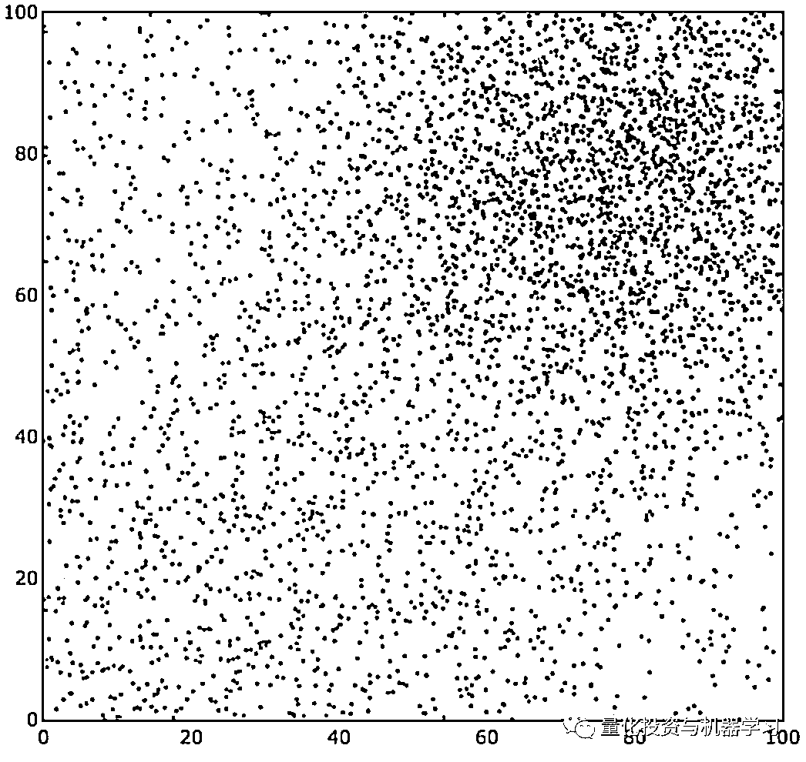

# 机器学习分类算法在因子投资中的应用

> 原文：[`mp.weixin.qq.com/s?__biz=MzAxNTc0Mjg0Mg==&mid=2653291499&idx=1&sn=f6d42eb910b9cec948bd5f32ee9c081a&chksm=802dc1feb75a48e8483c24ac3278242a4ecb997007df5a90d0a8418413329a6fa932c20923a3&scene=27#wechat_redirect`](http://mp.weixin.qq.com/s?__biz=MzAxNTc0Mjg0Mg==&mid=2653291499&idx=1&sn=f6d42eb910b9cec948bd5f32ee9c081a&chksm=802dc1feb75a48e8483c24ac3278242a4ecb997007df5a90d0a8418413329a6fa932c20923a3&scene=27#wechat_redirect)

**标星★公众号     **♥你们

▎编译：shan | 公众号翻译部

▎作者：Druce Vertes

**近期原创文章：**

## ♥ [基于无监督学习的期权定价异常检测（代码+数据）](https://mp.weixin.qq.com/s?__biz=MzAxNTc0Mjg0Mg==&mid=2653290562&idx=1&sn=dee61b832e1aa2c062a96bb27621c29d&chksm=802dc257b75a4b41b5623ade23a7de86333bfd3b4299fb69922558b0cbafe4c930b5ef503d89&token=1298662931&lang=zh_CN&scene=21#wechat_redirect)

## ♥ [5 种机器学习算法在预测股价的应用（代码+数据）](https://mp.weixin.qq.com/s?__biz=MzAxNTc0Mjg0Mg==&mid=2653290588&idx=1&sn=1d0409ad212ea8627e5d5cedf61953ac&chksm=802dc249b75a4b5fa245433320a4cc9da1a2cceb22df6fb1a28e5b94ff038319ae4e7ec6941f&token=1298662931&lang=zh_CN&scene=21#wechat_redirect)

## ♥ [深入研读：利用 Twitter 情绪去预测股市](https://mp.weixin.qq.com/s?__biz=MzAxNTc0Mjg0Mg==&mid=2653290402&idx=1&sn=efda9ea106991f4f7ccabcae9d809e00&chksm=802e3db7b759b4a173dc8f2ab5c298ab3146bfd7dd5aca75929c74ecc999a53b195c16f19c71&token=1330520237&lang=zh_CN&scene=21#wechat_redirect)

## ♥ [Two Sigma 用新闻来预测股价走势，带你吊打 Kaggle](https://mp.weixin.qq.com/s?__biz=MzAxNTc0Mjg0Mg==&mid=2653290456&idx=1&sn=b8d2d8febc599742e43ea48e3c249323&chksm=802e3dcdb759b4db9279c689202101b6b154fb118a1c1be12b52e522e1a1d7944858dbd6637e&token=1330520237&lang=zh_CN&scene=21#wechat_redirect)

## ♥ [利用深度学习最新前沿预测股价走势](https://mp.weixin.qq.com/s?__biz=MzAxNTc0Mjg0Mg==&mid=2653290080&idx=1&sn=06c50cefe78a7b24c64c4fdb9739c7f3&chksm=802e3c75b759b563c01495d16a638a56ac7305fc324ee4917fd76c648f670b7f7276826bdaa8&token=770078636&lang=zh_CN&scene=21#wechat_redirect)

## ♥ [一位数据科学 PhD 眼中的算法交易](https://mp.weixin.qq.com/s?__biz=MzAxNTc0Mjg0Mg==&mid=2653290118&idx=1&sn=a261307470cf2f3e458ab4e7dc309179&chksm=802e3c93b759b585e079d3a797f512dfd0427ac02942339f4f1454bd368ba47be21cb52cf969&token=770078636&lang=zh_CN&scene=21#wechat_redirect)

## ♥ [基于 RNN 和 LSTM 的股市预测方法](https://mp.weixin.qq.com/s?__biz=MzAxNTc0Mjg0Mg==&mid=2653290481&idx=1&sn=f7360ea8554cc4f86fcc71315176b093&chksm=802e3de4b759b4f2235a0aeabb6e76b3e101ff09b9a2aa6fa67e6e824fc4274f68f4ae51af95&token=1865137106&lang=zh_CN&scene=21#wechat_redirect)

## ♥ [人工智能『AI』应用算法交易，7 个必踩的坑！](https://mp.weixin.qq.com/s?__biz=MzAxNTc0Mjg0Mg==&mid=2653289974&idx=1&sn=88f87cb64999d9406d7c618350aac35d&chksm=802e3fe3b759b6f5eca6e777364270cbaa0bf35e9a1535255be9751c3a77642676993a861132&token=770078636&lang=zh_CN&scene=21#wechat_redirect)

## ♥ [神经网络在算法交易上的应用系列（一）](https://mp.weixin.qq.com/s?__biz=MzAxNTc0Mjg0Mg==&mid=2653289962&idx=1&sn=5f5aa65ec00ce176501c85c7c106187d&chksm=802e3fffb759b6e9f2d4518f9d3755a68329c8753745333ef9d70ffd04bd088fd7b076318358&token=770078636&lang=zh_CN&scene=21#wechat_redirect)

## ♥ [预测股市 | 如何避免 p-Hacking，为什么你要看涨？](https://mp.weixin.qq.com/s?__biz=MzAxNTc0Mjg0Mg==&mid=2653289820&idx=1&sn=d3fee74ba1daab837433e4ef6b0ab4d9&chksm=802e3f49b759b65f422d20515942d5813aead73231da7d78e9f235bdb42386cf656079e69b8b&token=770078636&lang=zh_CN&scene=21#wechat_redirect)

## ♥ [如何鉴别那些用深度学习预测股价的花哨模型？](https://mp.weixin.qq.com/s?__biz=MzAxNTc0Mjg0Mg==&mid=2653290132&idx=1&sn=cbf1e2a4526e6e9305a6110c17063f46&chksm=802e3c81b759b597d3dd94b8008e150c90087567904a29c0c4b58d7be220a9ece2008956d5db&token=1266110554&lang=zh_CN&scene=21#wechat_redirect)

## ♥ [优化强化学习 Q-learning 算法进行股市](https://mp.weixin.qq.com/s?__biz=MzAxNTc0Mjg0Mg==&mid=2653290286&idx=1&sn=882d39a18018733b93c8c8eac385b515&chksm=802e3d3bb759b42d1fc849f96bf02ae87edf2eab01b0beecd9340112c7fb06b95cb2246d2429&token=1330520237&lang=zh_CN&scene=21#wechat_redirect)

**第一部分：分类算法介绍**

**什么是分类算法？**

回归预测了连续的值，比如一个资产的收益，而分类算法预测了一个离散的值，比如，这个股票下一段时间的表现是否比现在要好？这就是个二分问题，需要一个是或者否的答案，另一个例子：如果将一只股票的业绩区间分成四份，那么这支股票的下个月业绩会落在那块，这就是个多项分类问题，会得到 4 个可能的结果。在这篇文章中，我们将给分类问题进行高屋建瓴的解析，并在组合上应用分类算法预测收益。分类算法本身是深度学习的一种，最开始是用于手写识别或者图像识别，分类算法是机器学习中的基础算法，在它的基础上可以做出很多有意思的东西。

代码链接：

*https://github.com/druce/Machine-learning-for-financial-market-prediction/blob/master/Classification%20Mad%20Science.ipynb*

**分类算法要素**

首先，我们在二维坐标上生成一些红色和蓝色的点，整个坐标系在 0-100 中间。

测试数据中：

2000 个红色点以坐标（25,25）为中心，标准差为 50，设置 label=0；

2000 个蓝色点以坐标（80,80）为中心，标准差为 20，设置 label=1。

我们希望寻找的一个函数，输入 x 和 y 就能得出是在红色区还是蓝色区，逻辑回归是一个简单且流行的分类算法。

我们展示一下如何应用逻辑回归。

1、首先我们设定 z(x,y)=ax+by+c

2、然后我们用 squashing 激活函数把正数映射到 1，负数映射到 0

3、然后我们使用损失函数去度量预测误差，这个误差项应该在预测正确的时候趋近为 0

4、最后我们算出参数 a,b,c 来最小化这个损失函数

如果我们能训练这个分类器，使其的误差趋近于 0，那么我们就能得到一个函数能够尽量的匹配预测值和观察值。

我们通过使用梯度下降方法来降低误差，先随机选择参数值 a，b 和 c，确定这些值的移动方向以使整个函数的误差缩小，然后更新 a，b 和 c 的值使最终的误差最小。

我们得到一个红点和蓝点的分类如下：

让我们仔细看看隐藏在背后的这四个步骤。

决策函数 Z(x,y): = ax + by + c 与 ax + by + c = 0 的欧式距离成正比，它代表了到分类边界的距离。

**Squashing 函数**：在逻辑回归里，squashing 函数式逻辑回归函数为  这种类型的函数称作激活函数，函数形状很像’S’，因此用 S(X)来表示，可以将负无穷到正无穷的数据映射到[0,1]区间之内，直观的解释是它将对数几率映射到了 0-1 之间。

损失函数：假设我们预测是蓝色点的概率为 0.8，那么如何判断预测的准确性，对于二分分类问题来说，我们想要尽量缩小误差。V = - log(p)y - log(1-p)(1-y) 在这个式子中，y 是我们的预测结果，p 是我们预测为篮点区域的概率。

一个好的方法来可视化 log loss 是用-log(correctness)，如果我们确定预测是 100%准确的，则 log(loss)=0，如果我们的预测是 100%错误的，则 log(loss)将得到正无穷。

我们继续分解这个问题，我们的预测结果是 0 或者 1，那么我们的预测的概率就在 0 和 1 之间。如果我们的预测值是 1（蓝色点），并且我们的预测准确率为 p(假设为 0.8)，那么 V=-log(0.8). V = - log(p)y - log(1-p)(1-y) 等式的第二项为 0 因为 1-y=0。当一个预测接近 1 时，log loss 趋近于 0，如果一个预测趋近于 0 时，log loss 则非常大。相反，如果预测值为 0（红色点区域），那么损失函数 V = -log(1-p)，第一项为 0 因为 y=0，如果我们的预测接近于 0，那么 log loss 为 0，如果预测趋近于 1，那么 log loss 则非常大。

在以上四步中，我们用以下方法来分解二分分类问题：

1、寻找到合适的参数 a,b,c

2、最小化损失函数 V(S(ax + by + c)) = J(a,b,c)…

3、训练所有的训练集

这些就是二分分类方法的要素：寻找一个函数和满足函数的参数（a,b 和 c），使其预测概率为 1，并且最小化损失函数，我们可以借助计算机来实现它。

**最后一点**

当预测概率超过一个概率阈值时，我们预测蓝色类。一般来说，我们不应该假设我们的决策边界必须在 50%概率线上。在实际问题中，我们应该考虑假阳性与假阴性的成本。当我们提高概率阈值时，我们减少了误报的数量，增加了误报的数量。ROC 曲线可以帮助我们可视化。我们想要选择一个决策边界阈值来最大化真实世界的性能，如果我们增加一个正预测的阈值，那么更少的假阳性的边际收益等于额外的假阴性的成本。

****分类算法****Overview****

那么在如此多的分类算法中，我们如何找到试用的分类算法呢？

那么应该明确的问题：

1、x 和 y 符合什么分布。

2、决策边界的图形是什么样子的？是线性还是非线性。

3、确定损失函数，并且如何最小化损失函数，常用的损失函数有 均方根误差（mean-squared-error），交叉熵损失（cross-entropy loss），折页损失（hinge loss）等。

4、如何在过拟合和提升预测效果之间权衡。

5、最后，看下这个算法如何训练数据，如何根据 x 找到确定的 y，这个算法的复杂度是多少，比如逻辑回归比较简单效率较高，而神经网络则需要较长的时间去训练数据，这个分类器是离散的还是连续的，连续的分类器试用任意的 x 和 y。而离散的分类器是一个略完备的模型。逻辑回归用于离散变量的分类，即它的输出 y 的取值范围是一个离散的集合，因此是离散型分类器。

上图中的前五个分类器都是线性的，这些分类器预测的结果相近，只在前提条件，适用的分布，损失函数和如何缩小过拟合有些许不同。

其他分类器有的有非线性的决策边界：如 Quadratic Discriminant Analysis, Multi-Layer Perceptron, Gaussian Naive Bayes, 和 Keras NN。剩下的分类器可能是分段线性的，如 KNN, Trees, Bagging, Boosting，比如 K 近邻(KNN)算法是找到最近的 k 个邻居来进行分类的，而 K 是在交叉验证中得到的。应用 Boosting 模型最近在 Kaggle 机器学习大赛中获得了很多奖，它主要用的是集成学习的思路，即对新的实例进行分类的时候，把多个单分类器的结果进行某种组合，来对最终的结果进行分类。

下面简单介绍下其他的分类算法：

**决策树算法：**决策树是一种简单但广泛使用的分类器，它通过训练数据构建决策树，对未知的数据进行分类。决策树的每个内部节点表示在一个属性上的测试，每个分枝代表该测试的一个输出，而每个树叶结点存放着一个类标号。

**Bagging 算法：**bootstrap aggregating 的缩写。让该学习算法训练多轮，每轮的训练集由从初始的训练集中随机取出的 n 个训练倒组成，初始训练例在某轮训练集中可以出现多次或根本不出现训练之后可得到一个预测函数序列 h．，… …h 最终的预测函数 H 对分类问题采用投票方式，对回归问题采用简单平均方法对新示例进行判别。

**决策森林：**随机森林指通过多颗决策树联合组成的预测模型，可以对样本或者特征取 bagging。

**Boosting 算法：**其中主要的是 AdaBoost（Adaptive Boosting）。初始化时对每一个训练例赋相等的权重 1／n，然后用该学算法对训练集训练 t 轮，每次训练后，对训练失败的训练例赋以较大的权重，也就是让学习算法在后续的学习中集中对比较难的训练铡进行学习，从而得到一个预测函数序列 h 一…h 其中 h 有一定的权重，预测效果好的预测函数权重较大，反之较小。最终的预测函数 H 对分类问题采用有权重的投票方式，对回归问题采用加权平均的方法对新示例进行判别。( 类似 Bagging 方法，但是训练是串行进行的，第 k 个分类器训练时关注对前 k-1 分类器中错分的文档，即不是随机取，而是加大取这些文档的概率)。

**集成算法：**在运行了很多分类算法之后，我们可以选择最终的分类器模型。在上面的例子中，我们使用 Voting Classifier 模型，相比逻辑回归来说获得了 85.9%的准确率和更好的 AUC。

我们现在有了足够多的工具来对数据进行分类，收集和清洗以得到一个好的数据集，找到一个合适的模型就能解决 80%的问题。

总结一下，在分类算法中，我们学到了

1、分类算法的基础

2、如何应用逻辑回归

3、不同分类算法的区别

4、如何组合分类算法以得到更好的结果

分类算法是机器学习算法的基础，很多机器学习问题的解决都始于分类算法，如语音识别、无人驾驶汽车等。在第二部分，我们将用分类算法建立一个价值投资和趋势投资的组合。

**第二部分：分类算法在投资的应用**

下面我们将分析下分类算法在投资中的应用，我们先简述一些基础概念：

**价值与动量**

价值投资策略核心是寻找高性价比的股票，通常我们使用 PB(price/bookvalue)来衡量一个股票的性价比。我们将股票按照 PB 分成 5 个区间，逐月记录这五组股票的收益，这些是从 1973 到 2017 的结果。

从结果中我们可以得到，价值投资确实能赚钱。

**趋势投资**

我们还可以用趋势策略，即挑选最近长势喜人的股票，这只股票可能最近有利好。利好可能包括：

 1、好的信息逐渐披露出来，比如公司前景喜人，开始可能只是内部人员了解，之后大众逐渐了解，利润增加，股票市场价格逐渐增长；

2、公司被低估，公司在招聘，市场，媒体上等各种表现超过大家预期，股价也会增长；

3、近期政策层利好等都会使股价近期提高；

趋势策略是市场形成的，那么如何用数据证明趋势策略有用，我们将股票按过去一年涨幅分成 5 个区间，走势图如下所示。

**价值策略和趋势策略相结合**

为了给我们之后的分类算法一个比较的标准，我们按价值策略和趋势策略中的表现分别为每一只股票打分，把股票集合按分数进行排序形成组合，表现如下图：

这样就给我们的模型一个比较的基准，这个组合的 sharp ratio 为 0.47，让我们看看用机器学习的方式是不是能得到更好的结果。

**分类算法是否有效**

首先，我们用个非常简单的分类方式，将股票按 value/momentum 的比值进行分类，对最好的那一类进行投资。对投资的组合每个月进行 rebalance。

另外一个稍微复杂的方法，用逻辑回归进行预测，看看那只股票会在最好的投资区间，然后对最好的那一类进行投资。预测银子选择(P/B)和趋势因子，我们选择 3 个月的收益来看整个结果，以防止某个月的收益有扰动。

但是我们看到结果并不好，这个结果和我们最开始的基准差不太多，那么到底是什么原因？我们怎么才能得到更好的结果。

我们可以看到在这个逻辑回归中，随时函数用的是 log loss 损失函数，但是 log loss 损失函数把所有损失看成相同的。比如如果在第五区间的预测结果落到了第一区间，其实它的 error 是远比落在第四区间要大的多的。

另外一个问题是，如果我们得到一只股票在五个区间的概率 0.30, 0.09, 0.11, 0.21, 0.29，第零区间和第四区间只有 1%的差距，那么我们是否能确定落在第一区间呢？那么如果我们每次都把股票分到概率最高的区间可能会导致预测不准。我们把预测的结果画图，发现大部分都是落在表现最不好的两个区间内的。

** 可以确定分类吗？**

0.30 x 0 + 0.09 x 1 + 0.11 x 2 + 0.21 x 3 + 0.29 x 4 = 2.1

为了使分类更有效，我将预测结果做了个加权平均，因此本来分给第零个区间的，被分给了第二个区间，用这个方式优化后，我们的结果为：

好消息是我们的结果连续性更好了，并且收益和 sharp ratio 都有提高；坏消息是我们最好的区间 sharp ratio 为 0.46，比最早做的逻辑回归还稍微差一点。

现实是残酷的，这可能是因为我们在最好的区间放了 20%的股票，之前的逻辑回归，我们选了更少的股票，优中选优从而得到了更好的结果。

**优化分类算法**

所以我们应该是选择对了方向，但是是否可以用更好的分类器来解决这个问题呢？

Gradient boosting models 是非常好的分类算法，我们可以尝试 XGBoost 分类算法来判别哪些股票会落入最好的投资区间。

结果如下：

**分类是否是个好选择？**

XGBoost 分类算法得到的结果非常好，下面说下这个方法的缺点：

1、用三个 1 月的 return 要比一个月的 return 结果更平滑，降低过拟合，但是可能丢失了部分信息；

2、用 log loss 作为评价函数，容易使差不多概率的分类出错，如最好的区间概率 0.3，最差区间概率 0.29 这种情况；

但是我们也有使用分类的理由：组合构建类似分类问题，选股票就是在做分类。但是我不建议直接应用分类算法，分类算法在预测收益和是否有 default 风险上很好用，在组合构建上也许有更好的方式。

**结论**

我们学到了什么：

1、单独的价值策略或者趋势策略结果不错；

2、单纯的使用分类算法并不能得到好的收益；

3、Gradient boosting 分类算法能显著的提高结果；

4、直接进行逻辑回归也许是个更好的解决方法。

*—End—*

量化投资与机器学习微信公众号，是业内垂直于**Quant**、**MFE**、**CST**等专业的主流自媒体。公众号拥有来自**公募、私募、券商、银行、海外**等众多圈内**10W+**关注者。每日发布行业前沿研究成果和最新资讯。

