# 六、周 | 从 0 到高盛分析师的行研和估值水平

> 原文：[`mp.weixin.qq.com/s?__biz=MzAxNTc0Mjg0Mg==&mid=2653291472&idx=1&sn=fdf6b4e0915df564fa235d554eec3e6e&chksm=802dc1c5b75a48d3bca1abe38e21cc658aee1c19f85980d5faf4296af21c2fbe257bfab4d3e7&scene=27#wechat_redirect`](http://mp.weixin.qq.com/s?__biz=MzAxNTc0Mjg0Mg==&mid=2653291472&idx=1&sn=fdf6b4e0915df564fa235d554eec3e6e&chksm=802dc1c5b75a48d3bca1abe38e21cc658aee1c19f85980d5faf4296af21c2fbe257bfab4d3e7&scene=27#wechat_redirect)

金融是一个业务庞杂的行业，行业知识琐碎而且交错纵横，即使是工作多年的从业者，在日常工作中，难免还是会遇到很多问题：

> 做一个项目的投资，一些关键的信息没有现成数据，要如何判断**财务预测**的合理性？

> 拿到一份企业 BP，几百页内容都要看吗？从业 10 年的老 PE 是怎么通过关键信息判断项目值不值得投资的？

> 做尽调访谈时经常遇到董事长和执行层员工提供的信息不一致的情况，应该怎么判断他们说的话的真实性？怎么套到最真实可靠的信息？

> 已经做了一段时间行研，想转型做投资时，发现自己缺乏把**财务、法律知识等融合**到一起的能力，不知道怎么从公司发展、财务指标、合规风险等方面考虑投资价值。

面对这些问题时，顶尖机构从业多年的人是怎么应对的？他们怎么保证别人都不会做时，自己比别人懂；别人会做时，自己做得更专业？

我们采访了 10 位来自**顶尖机构 VP 级别**的资深从业者，他们根据自身经历和带新人的经验总结，想在金融业走得更远，成为全能金融分析师，关键是“知己知彼”。除了要**懂行研、会估值**，也要知道同样是做尽调，IPO 阶段的尽调是怎么做的，并购业务里的尽调关注的又是什么。

但是，想要在短时间内做多个业务领域的工作，还能练习不同的工作技能，几乎不大可能。为了解决这个问题，职问和互联网财经媒体**华尔街见闻**联合推出

**「职问✖️华尔街见闻 金融分析师技能课」**

  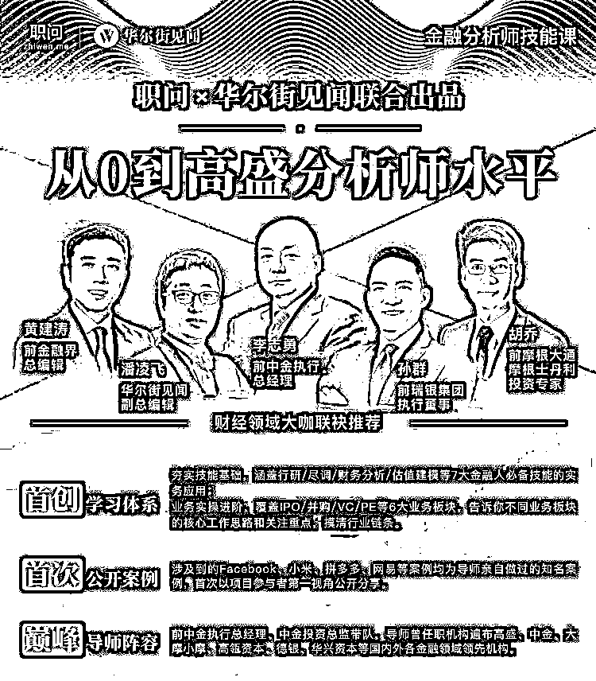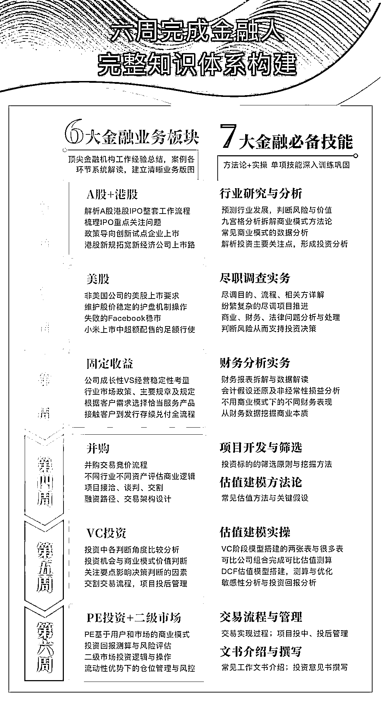

3 月 11 日开始更新，实际在 6-8 周完成全部课程更新

**1.**如果你还是金融小白：在行业大佬的指导下构建金融知识体系可以帮你打好金融技能基础，从进入这个行业开始，你就**拥有了顶尖机构从业者的眼界和视角**；

**2. **如果你已经掌握了一到两项金融分析技能，在完整的技能+业务体系中**查漏补缺**，可以为下一步的职业发展打好基础；

**3. **如果你正在寻求职业转型机会，行业大佬的业务经验将帮助你站得更高，**从顶尖机构的角度看到金融业的全貌**，找到适合自己的发展方向，并针对性提升竞争力。

**本门课程导师曾从业经历遍布高盛、中金、摩根大通、摩根士丹利、高瓴资本、德银、瑞银、IDG 资本、美林证券、华兴资本等**各个业务板块做得**最好的机构，**巅峰阵容**全网绝无仅有。**

课程获得了来自曾任职于**中金、摩根大通、摩根士丹利、瑞银、金融界**等机构的财经领域大咖的强烈推荐：

[`v.qq.com/iframe/preview.html?width=500&height=375&auto=0&vid=x0847qfkry5`](https://v.qq.com/iframe/preview.html?width=500&height=375&auto=0&vid=x0847qfkry5)

**课程容量**

本课程共有两大主版块，**30+小时录播课程，3 节共 2 小时直播答疑，另附大咖特约讲座 1 节。**

3 月 11 日开始更新，业务案例、必备技能每周双线更新 4-6 节，6 周-8 周完成更新。

学员购买后，所有内容都可永久回放。

**听课方式**

扫码报名后，立即可以开始录播课程的学习。从微信服务号「职问分院帽」-我的课程-课程首页-我的课程，找到本专栏，即可开始听课。

课程专栏中的**“*必读-购买后续操作指南”**会指示操作进行扫码验证入群，加入班级群后按照班主任提示进行即可。

*课程购买后 24 小时内可申请退款，24 小时后不予退款，购买前请谨慎考虑。

如对课程有任何疑问，请添加微信 zhiwenkelly 咨询。

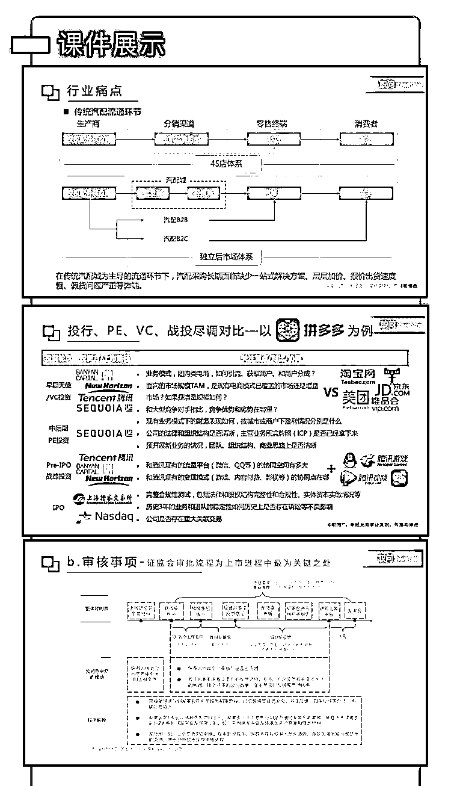

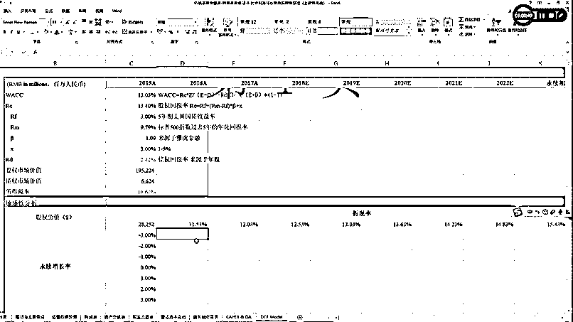

（网易 DCF 模型-敏感性分析）

  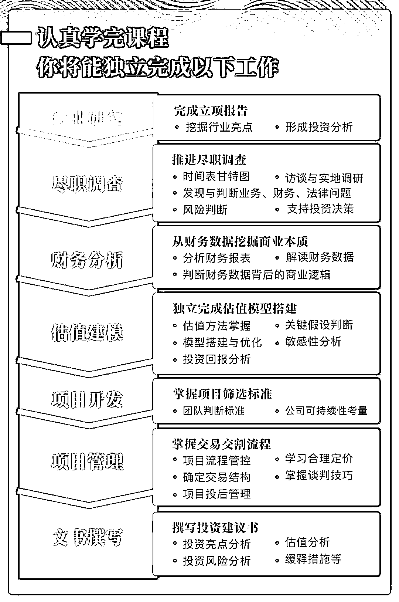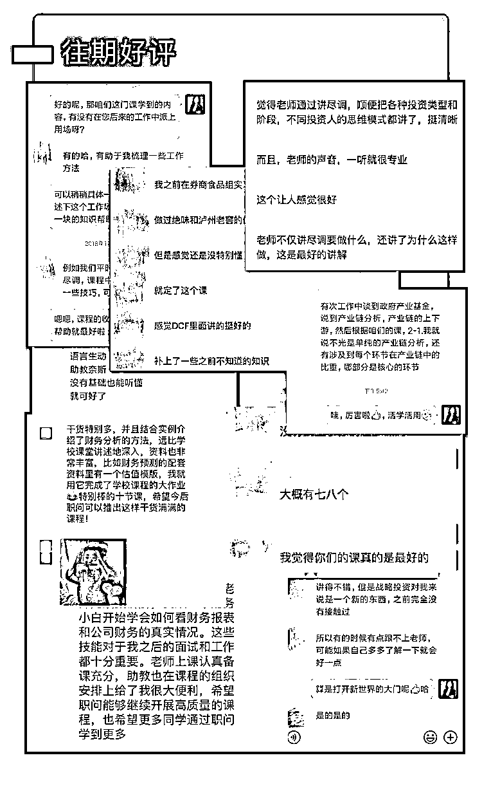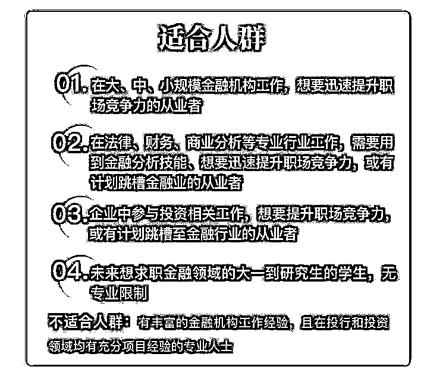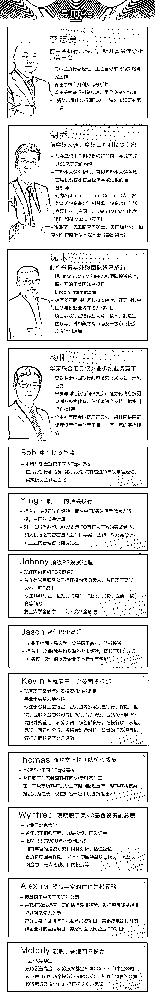
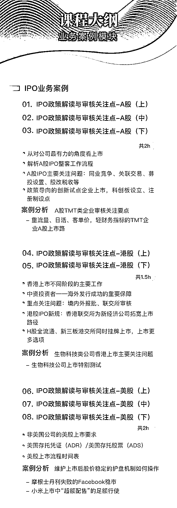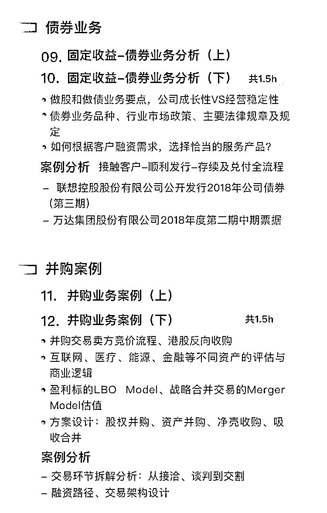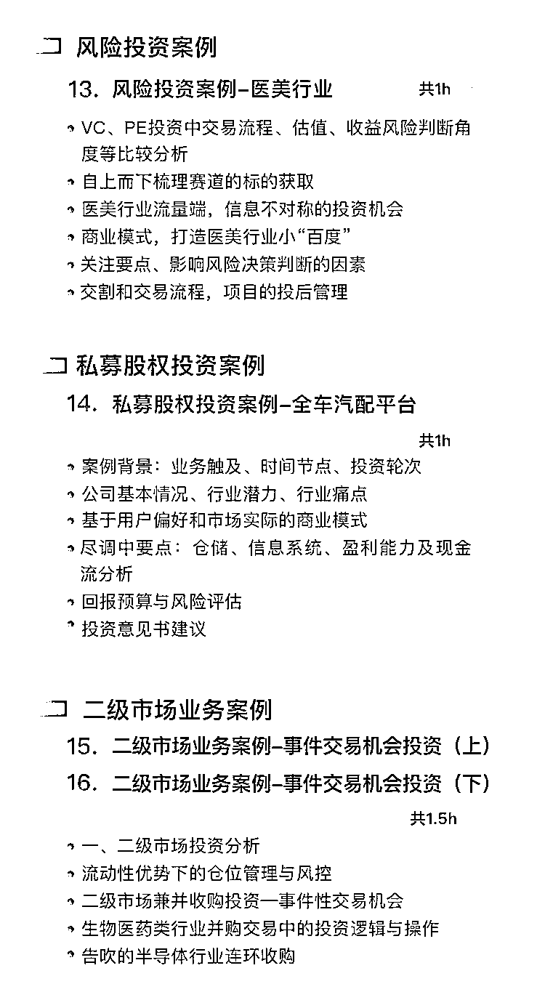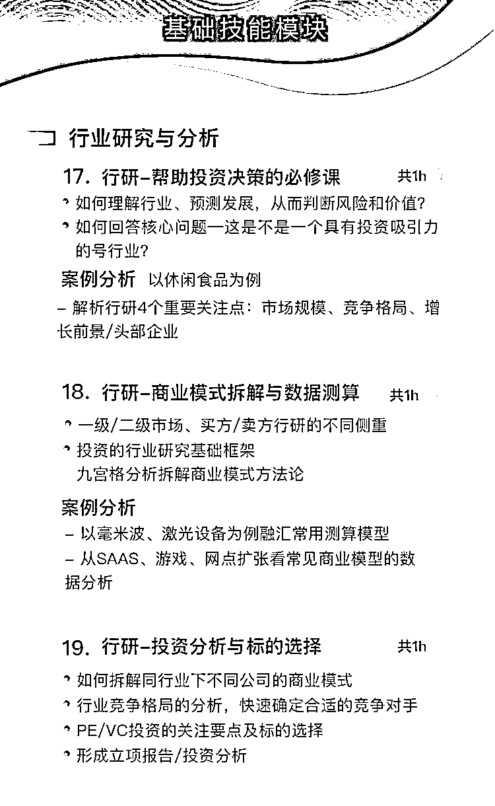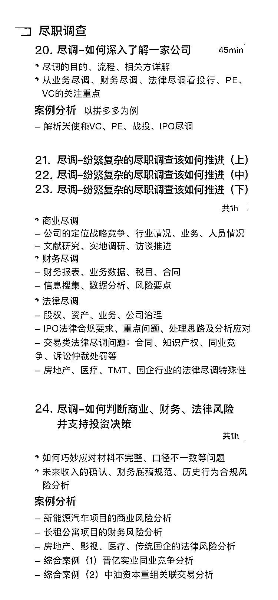
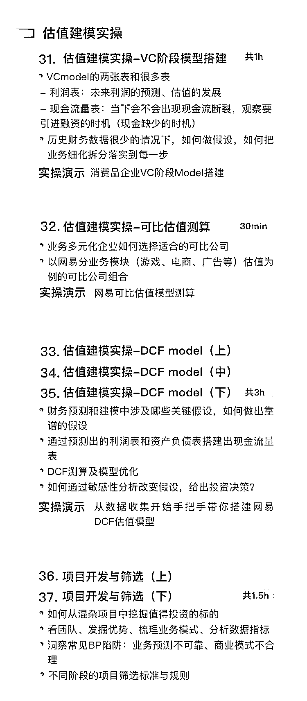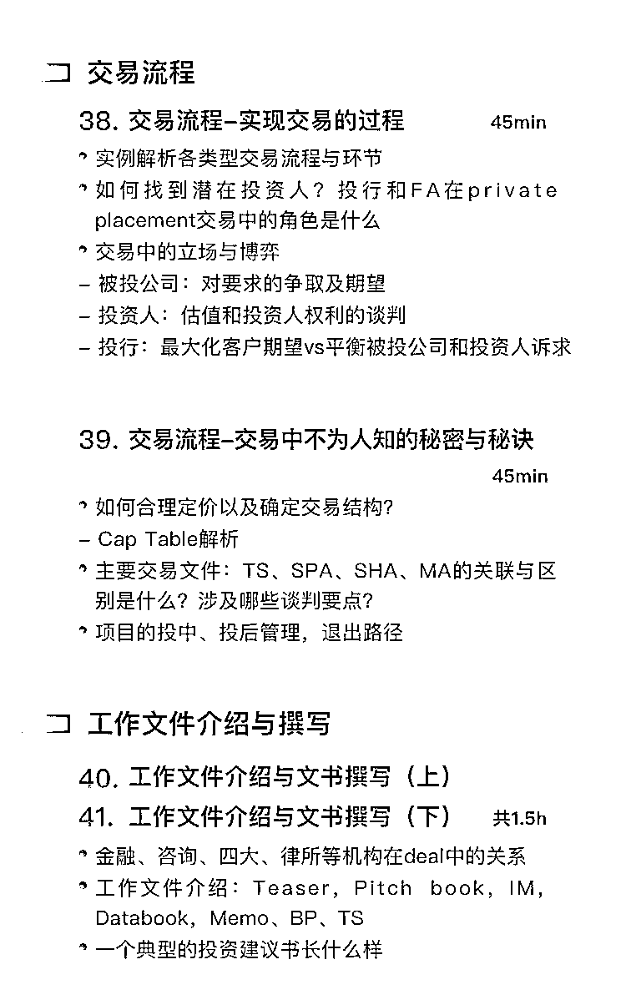

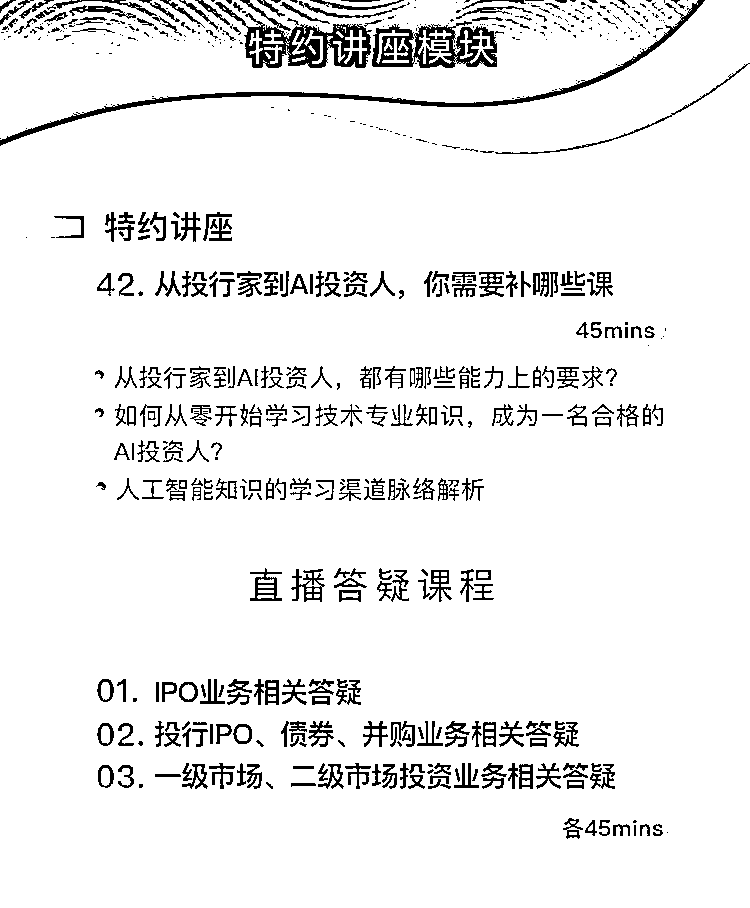

**课程容量** 

本课程共有两大主版块，**30+小时录播课程，3 节共 2 小时直播答疑，另附大咖特约讲座 1 节**。

3 月 11 日开始更新，业务案例、必备技能每周双线更新 4-6 节，6 周-8 周完成更新。

学员购买后，所有内容都可永久回放。

**听课方式**

扫码报名后，立即可以开始录播课程的学习。从微信服务号「职问分院帽」-我的课程-课程首页-我的课程，找到本专栏，即可开始听课。

课程专栏中的**“*必读-购买后续操作指南”**会指示操作进行扫码验证入群，加入班级群后按照班主任提示进行即可。

*课程购买后 24 小时内可申请退款，24 小时后不予退款，购买前请谨慎考虑。

如对课程有任何疑问，请添加微信 zhiwenkelly 咨询。

