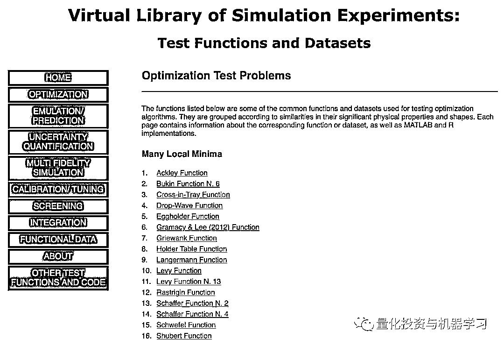

# 干货 | Python 优化技巧：bowl、plate 和 valley 函数（附代码）

> 原文：[`mp.weixin.qq.com/s?__biz=MzAxNTc0Mjg0Mg==&mid=2653291462&idx=1&sn=296ef65faafb78524b8fc8034e7767d8&chksm=802dc1d3b75a48c58243f709f22703164e5f547cabb0c54b86cadbc7ac9f3ed9ca4c3c81dcca&scene=27#wechat_redirect`](http://mp.weixin.qq.com/s?__biz=MzAxNTc0Mjg0Mg==&mid=2653291462&idx=1&sn=296ef65faafb78524b8fc8034e7767d8&chksm=802dc1d3b75a48c58243f709f22703164e5f547cabb0c54b86cadbc7ac9f3ed9ca4c3c81dcca&scene=27#wechat_redirect)

**标星★公众号     **♥你们

▎作者：Alexandr Honchar

**▎**编译：yana | 公众号翻译部

**近期原创文章：**

## ♥ [基于无监督学习的期权定价异常检测（代码+数据）](https://mp.weixin.qq.com/s?__biz=MzAxNTc0Mjg0Mg==&mid=2653290562&idx=1&sn=dee61b832e1aa2c062a96bb27621c29d&chksm=802dc257b75a4b41b5623ade23a7de86333bfd3b4299fb69922558b0cbafe4c930b5ef503d89&token=1298662931&lang=zh_CN&scene=21#wechat_redirect)

## ♥ [5 种机器学习算法在预测股价的应用（代码+数据）](https://mp.weixin.qq.com/s?__biz=MzAxNTc0Mjg0Mg==&mid=2653290588&idx=1&sn=1d0409ad212ea8627e5d5cedf61953ac&chksm=802dc249b75a4b5fa245433320a4cc9da1a2cceb22df6fb1a28e5b94ff038319ae4e7ec6941f&token=1298662931&lang=zh_CN&scene=21#wechat_redirect)

## ♥ [深入研读：利用 Twitter 情绪去预测股市](https://mp.weixin.qq.com/s?__biz=MzAxNTc0Mjg0Mg==&mid=2653290402&idx=1&sn=efda9ea106991f4f7ccabcae9d809e00&chksm=802e3db7b759b4a173dc8f2ab5c298ab3146bfd7dd5aca75929c74ecc999a53b195c16f19c71&token=1330520237&lang=zh_CN&scene=21#wechat_redirect)

## ♥ [Two Sigma 用新闻来预测股价走势，带你吊打 Kaggle](https://mp.weixin.qq.com/s?__biz=MzAxNTc0Mjg0Mg==&mid=2653290456&idx=1&sn=b8d2d8febc599742e43ea48e3c249323&chksm=802e3dcdb759b4db9279c689202101b6b154fb118a1c1be12b52e522e1a1d7944858dbd6637e&token=1330520237&lang=zh_CN&scene=21#wechat_redirect)

## ♥ [利用深度学习最新前沿预测股价走势](https://mp.weixin.qq.com/s?__biz=MzAxNTc0Mjg0Mg==&mid=2653290080&idx=1&sn=06c50cefe78a7b24c64c4fdb9739c7f3&chksm=802e3c75b759b563c01495d16a638a56ac7305fc324ee4917fd76c648f670b7f7276826bdaa8&token=770078636&lang=zh_CN&scene=21#wechat_redirect)

## ♥ [一位数据科学 PhD 眼中的算法交易](https://mp.weixin.qq.com/s?__biz=MzAxNTc0Mjg0Mg==&mid=2653290118&idx=1&sn=a261307470cf2f3e458ab4e7dc309179&chksm=802e3c93b759b585e079d3a797f512dfd0427ac02942339f4f1454bd368ba47be21cb52cf969&token=770078636&lang=zh_CN&scene=21#wechat_redirect)

## ♥ [基于 RNN 和 LSTM 的股市预测方法](https://mp.weixin.qq.com/s?__biz=MzAxNTc0Mjg0Mg==&mid=2653290481&idx=1&sn=f7360ea8554cc4f86fcc71315176b093&chksm=802e3de4b759b4f2235a0aeabb6e76b3e101ff09b9a2aa6fa67e6e824fc4274f68f4ae51af95&token=1865137106&lang=zh_CN&scene=21#wechat_redirect)

## ♥ [人工智能『AI』应用算法交易，7 个必踩的坑！](https://mp.weixin.qq.com/s?__biz=MzAxNTc0Mjg0Mg==&mid=2653289974&idx=1&sn=88f87cb64999d9406d7c618350aac35d&chksm=802e3fe3b759b6f5eca6e777364270cbaa0bf35e9a1535255be9751c3a77642676993a861132&token=770078636&lang=zh_CN&scene=21#wechat_redirect)

## ♥ [神经网络在算法交易上的应用系列（一）](https://mp.weixin.qq.com/s?__biz=MzAxNTc0Mjg0Mg==&mid=2653289962&idx=1&sn=5f5aa65ec00ce176501c85c7c106187d&chksm=802e3fffb759b6e9f2d4518f9d3755a68329c8753745333ef9d70ffd04bd088fd7b076318358&token=770078636&lang=zh_CN&scene=21#wechat_redirect)

## ♥ [预测股市 | 如何避免 p-Hacking，为什么你要看涨？](https://mp.weixin.qq.com/s?__biz=MzAxNTc0Mjg0Mg==&mid=2653289820&idx=1&sn=d3fee74ba1daab837433e4ef6b0ab4d9&chksm=802e3f49b759b65f422d20515942d5813aead73231da7d78e9f235bdb42386cf656079e69b8b&token=770078636&lang=zh_CN&scene=21#wechat_redirect)

## ♥ [如何鉴别那些用深度学习预测股价的花哨模型？](https://mp.weixin.qq.com/s?__biz=MzAxNTc0Mjg0Mg==&mid=2653290132&idx=1&sn=cbf1e2a4526e6e9305a6110c17063f46&chksm=802e3c81b759b597d3dd94b8008e150c90087567904a29c0c4b58d7be220a9ece2008956d5db&token=1266110554&lang=zh_CN&scene=21#wechat_redirect)

## ♥ [优化强化学习 Q-learning 算法进行股市](https://mp.weixin.qq.com/s?__biz=MzAxNTc0Mjg0Mg==&mid=2653290286&idx=1&sn=882d39a18018733b93c8c8eac385b515&chksm=802e3d3bb759b42d1fc849f96bf02ae87edf2eab01b0beecd9340112c7fb06b95cb2246d2429&token=1330520237&lang=zh_CN&scene=21#wechat_redirect)

**前言**

优化是机器学习研究人员最有趣的领域之一。本文将告诉大家一些关于如何解决机器学习优化问题的方法，以及其他。

我们从简单的函数优化开始，然后转移到更复杂的函数，它们有多个局部最小值或者很难在约束优化和几何优化问题中找到最小值。使用完全不同的优化方法：从基于渐变的方法开始，并使用进化算法和前沿深度学习的最新思想。当然，也会出现机器学习应用程序，但真正的目标是在数值优化中展示大范围的问题和算法，并了解最受欢迎的**AdamOptimizer() **真正发生的事情。

在本文中会有很多图片——对于零阶方法，Scipy 的一阶，Tensorflow 与一阶，二阶方法等。**查看源代码在文末。**

**优化方法**

首先，定义一组函数。从最简单的那些开始，这应该非常容易优化，并展示使用不同工具的一般套路。可以在这里找到完整的函数和公式列表：



*https://www.sfu.ca/~ssurjano/optimization.html*

我们只选择了其中的一些。

## **Bowl 函数**

Bohachevsky 函数和 Trid 函数

```py
def bohachevsky(x, y):
        return x**2 + 2*y**2 - 0.3*np.cos(3*3.14*x) -     0.4*np.cos(4*3.14*y) + 0.7
def trid(x, y):
        return (x-1)**2 + (y-1)**2 - x*y
```


**Plate 函数**

Booth，Matyas 和 Zakharov 函数

```py
def booth(x, y):
        return (x + 2*y - 7)**2 + (2*x + y - 5)**2
def matyas(x, y):
        return 0.26*(x**2 + y**2) - 0.48*x*y
def zakharov(x, y):
        return (x**2 + y**2) + (0.5*x + y)**2 + (0.5*x + y)**4
```


Booth (左)，Matyas (中) 和 Zakharov (右) 函数

## **Valley 函数**

Rozenbrock, Beale 和 Six Hump Camel 函数

```py
def rozenbrock(x, y):
        return (1-x)**2 + 100*(y - x**2)**2
def beale(x, y):
        return (1.5 - x + x*y)**2 + (2.25 - x + x*y**2)**2 + (2.65 - x + x*y**3)**2
def six_hump(x, y):
        return (4 - 2.1*x**2 + x**4/3)*x**2 + x*y + (-4 + 4*y**2)*y**2
```


**算法**

在本章节，我们将简要介绍 SciPy 和 Tensorcow 的基本优化算法。

## **没有梯度的优化**

通常我们的成本函数是有噪音的，或者是不可微的，所以在这种情况下，我们不能应用使用梯度方法。在本教程中，我们将比较不计算梯度的**Nelder-Mead**和**Powell**算法。第一种方法构建（n + 1）维单形并在其上找到最小值，并按序更新单形。Powell 方法对空间的每个基矢量进行一维搜索。使用 SciPy 实现它们：

```py
minimize(fun, x0, method='Nelder-Mead', tol=None,callback=make_minimize_cb)
```

**部分代码展示，原文获取全部代码**

**一阶算法**

可能从 Tensorflow 等机器学习框架中了解到这一系列算法。所有这些背后的想法是朝着反梯度的方向发展，这导致函数的最小化。但转向这个极小的细节差异很大。我们将从 Tensorflow 回顾以下内容：有动量（和没有动量）的梯度下降，Adam 和 RMSProp。我们将定义这样的 TF 函数：

```py
x = tf.Variable(8., trainable=True)
y = tf.Variable(8., trainable=True)
f = tf.add_n([
        tf.add(tf.square(x), tf.square(y)), 
        tf.square(tf.add(tf.multiply(0.5, x), y)), 
        tf.pow(tf.multiply(0.5, x), 4.)   
])
```

**部分代码展示，原文获取全部代码**


并按照以下方式优化：

```py
opt = tf.train.GradientDescentOptimizer(0.01)
grads_and_vars = opt.compute_gradients(f, [x, y])
clipped_grads_and_vars = [(tf.clip_by_value(g, xmin, xmax), v) for g, v in grads_and_vars]
train = opt.apply_gradients(clipped_grads_and_vars)
sess = tf.Session()
sess.run(tf.global_variables_initializer())
points_tf = []
for i in range(100):
        points_tf.append(sess.run([x, y]))
        sess.run(train)
```

我们将使用 SciPy 的共轭梯度，牛顿共轭梯度，截断式牛顿，有序最小二乘编程方法。可以在 Stephen Boyd 和 Lieven Vandenberghe 的免费在线书籍中阅读有关此类算法的更多信息。在下文中，有机器学习优化的另一个很酷的比较方式


## **二阶算法**

我们还将触及几种使用二阶导数的算法，以实现更快的收敛：**dog-leg 置信区域**，**十分精确的置信区间**。这些算法依次解决子优化任务，其中找到了搜索区域（通常是球体）。我们知道，这些算法需要 Hessian（或其近似值），因此我们将使用 numdifftools 库来计算它们并传递给 SciPy 优化器。

```py
from numdifftools import Jacobian, Hessian
def fun(x):
        return (x[0]**2 + x[1]**2) + (0.5*x[0] + x[1])**2 + (0.5*x[0] + x[1])**4
def fun_der(x):
        return Jacobian(lambda x: fun(x))(x).ravel()
def fun_hess(x):
        return Hessian(lambda x: fun(x))(x)
minimize(fun, x0, method='dogleg', jac=fun_der, hess=fun_hess)
```

灵感来自此处：


*https://stackoverflow.com/questions/41137092/jacobian-and-hessian-inputs-in-scipy-optimize-minimize*

**部分代码展示，原文获取全部代码**


**无梯度优化**

在这本章节，我们想先从视觉角度评估结果，先用肉眼看轨迹是非常重要的，毕竟公式会更清晰。


用 Nelder-Mead 和 Powell 优化 Bohachevsky，Matyas 和 Trid 函数

**用 Jacobian 优化**

可以看到 SciPy 和 Tensorflow 基于渐变的方法的比较。其中一些算法可能看起来太“慢”，但速度在很大程度上取决于超参数的选择，我们稍后会看一下它们。


Booth, Rosenbrok 和 Six Hump 函数在 SciPy

**用 Hessian 优化**

使用二阶导数几乎立即导致我们看到“好”的二次函数的最小值，但对其他函数并没那么简单。例如：对于 Bohachevsky 函数，它趋近最小值，但最小值没有真实存在。


Bohachevsky, Matyas 和 Trid 函数

**关于超参数的注释**

### **学习率**

首先，你可能已经注意到，像 Adam 和 RMSprop 这样流行的自适应算法甚至与 SGD 相比也很慢，但把它们设计成速度更快了吗？这是因为这些损失表面的学习率太小。必须分别针对每个问题调整此参数。在下面的图像中，可以看到如果将其增加到值 1 会发生什么。


提高 Adam 和 RMSProp 的学习率

### **初始点**

通常我们只是从随机点（或者像神经网络中的一些智能初始化器）开始搜索最小值，但一般来说它不是好的策略。在下面的示例中，可以看到，如果从错误的点开始，即使是二阶方法也可以发散。在纯优化问题中克服这个问题的一种方法是使用全局搜索算法来估计全局最小值的区域。


从错误的起点发散二阶方法

**机器学习笔记**

你想马上在 Tensorcow 中尝试一些 SciPy 算法来训练机器学习模型。因为 tf.contrib.opt 已经提供了这些服务，你甚至不需要构建自定义优化器。它允许使用相同的算法及其参数：

```py
vector = tf.Variable([7., 7.], 'vector')

# Make vector norm as small as possible.
loss = tf.reduce_sum(tf.square(vector))

optimizer = ScipyOptimizerInterface(loss, options={'maxiter': 100}, method='SLSQP')

with tf.Session() as session:
      optimizer.minimize(session)
```

**结论**

本文只是对优化领域的介绍，但只从这些结果我们就可以看出，它根本不容易。使用“酷酷的”二阶或自适应速率算法并不能保证收敛到最小值，而且，还要一些学习速率超参数和查找起始点。无论如何，关于所有这些算法是如何工作的，现在你有一些直觉。例如，可以确信使用二阶方法来实现二次类函数是不错的考虑，不会生涩地使用算法，算法不需要衍生工具也能很好地运行，并且必须成为优化库的一部分。 


我们还需要记住，这些功能不是真的很难！当我们遇到......有约束......和随机性的事情时，会发生什么？

**推荐阅读**

[01、经过多年交易之后你应该学到的东西（深度分享）](https://mp.weixin.qq.com/s?__biz=MzAxNTc0Mjg0Mg==&mid=2653289074&idx=1&sn=e859d363eef9249236244466a1af41b6&chksm=802e3867b759b1717f77e07a51ee5671e8115130c66562577280ba1243cba08218add04f1f00&token=449379994&lang=zh_CN&scene=21#wechat_redirect)

[02、监督学习标签在股市中的应用（代码+书籍）](https://mp.weixin.qq.com/s?__biz=MzAxNTc0Mjg0Mg==&mid=2653289050&idx=1&sn=60043a5c95b877dd329a5fd150ddacc4&chksm=802e384fb759b1598e500087374772059aa21b31ae104b3dca04331cf4b63a233c5e04c1945a&token=449379994&lang=zh_CN&scene=21#wechat_redirect)

[03、全球投行顶尖机器学习团队全面分析](https://mp.weixin.qq.com/s?__biz=MzAxNTc0Mjg0Mg==&mid=2653289018&idx=1&sn=8c411f676c2c0d92b0dd218f041bee4b&chksm=802e382fb759b139ffebf633ac14cdd0f21938e4613fe632d5d9231dab3d2aca95a11628378a&token=449379994&lang=zh_CN&scene=21#wechat_redirect)

[04、使用 Tensorflow 预测股票市场变动](https://mp.weixin.qq.com/s?__biz=MzAxNTc0Mjg0Mg==&mid=2653289014&idx=1&sn=3762d405e332c599a21b48a7dc4df587&chksm=802e3823b759b135928d55044c2729aea9690f86752b680eb973d1a376dc53cfa18287d0060b&token=449379994&lang=zh_CN&scene=21#wechat_redirect)

[05、使用 LSTM 预测股票市场基于 Tensorflow](https://mp.weixin.qq.com/s?__biz=MzAxNTc0Mjg0Mg==&mid=2653289238&idx=1&sn=3144f5792f84455dd53c27a78e8a316c&chksm=802e3903b759b015da88acde4fcbc8547ab3e6acbb5a0897404bbefe1d8a414265d5d5766ee4&token=2020206794&lang=zh_CN&scene=21#wechat_redirect)

[06、美丽的回测——教你定量计算过拟合概率](https://mp.weixin.qq.com/s?__biz=MzAxNTc0Mjg0Mg==&mid=2653289314&idx=1&sn=87c5a12b23a875966db7be50d11f09cd&chksm=802e3977b759b061675d1988168c1fec06c602e8583fbcc9b76f87008e0c10b702acc85467a0&token=1972390229&lang=zh_CN&scene=21#wechat_redirect)

[07、利用动态深度学习预测金融时间序列基于 Python](https://mp.weixin.qq.com/s?__biz=MzAxNTc0Mjg0Mg==&mid=2653289347&idx=1&sn=bf5d7899bc4a854d4ba9046fdc6fe0d6&chksm=802e3996b759b080287213840987bb0a0c02e4e1d4d7aae23f10a225a92ef6dd922d8006123d&token=290397496&lang=zh_CN&scene=21#wechat_redirect)

[08、Facebook 开源神器 Prophet 预测时间序列基于 Python](https://mp.weixin.qq.com/s?__biz=MzAxNTc0Mjg0Mg==&mid=2653289394&idx=1&sn=24a836136d730aa268605628e683d629&chksm=802e39a7b759b0b1dcf7aaa560699130a907716b71fc9c45ff0e5d236c5ae8ef80ebdb09dbb6&token=290397496&lang=zh_CN&scene=21#wechat_redirect)

[09、Facebook 开源神器 Prophet 预测股市行情基于 Python](https://mp.weixin.qq.com/s?__biz=MzAxNTc0Mjg0Mg==&mid=2653289437&idx=1&sn=f0dca7da8e69e7ba736992cb3d034ce7&chksm=802e39c8b759b0de5bce401c580623d0729ecca69d13926479d36e19aff8c9c9e8a20265afff&token=290397496&lang=zh_CN&scene=21#wechat_redirect)

[10、2018 第三季度最受欢迎的券商金工研报前 50（附下载）](https://mp.weixin.qq.com/s?__biz=MzAxNTc0Mjg0Mg==&mid=2653289358&idx=1&sn=db6e8ab85b08f6e67790ec0e401e586e&chksm=802e399bb759b08d6eec855f9901ea856d0da68c7425cba62791b8948da6ad761a3d88543dad&token=290397496&lang=zh_CN&scene=21#wechat_redirect)

[11、实战交易策略的精髓（公众号深度呈现）](https://mp.weixin.qq.com/s?__biz=MzAxNTc0Mjg0Mg==&mid=2653289447&idx=1&sn=f2948715bf82569a6556d518e56c1f9e&chksm=802e39f2b759b0e4502d1aaac562b87789573b55c76b3c85897d8c9d88dbf9a0b7ee34d86a4e&token=290397496&lang=zh_CN&scene=21#wechat_redirect)

[12、Markowitz 有效边界和投资组合优化基于 Python](https://mp.weixin.qq.com/s?__biz=MzAxNTc0Mjg0Mg==&mid=2653289478&idx=1&sn=f8e01a641be021993d8ef2d84e94a299&chksm=802e3e13b759b7055cf27a280c672371008a5564c97c658eee89ce8481396a28d254836ff9af&token=290397496&lang=zh_CN&scene=21#wechat_redirect)

[13、使用 LSTM 模型预测股价基于 Keras](https://mp.weixin.qq.com/s?__biz=MzAxNTc0Mjg0Mg==&mid=2653289495&idx=1&sn=c4eeaa2e9f9c10995be9ea0c56d29ba7&chksm=802e3e02b759b7148227675c23c403fb9a543b733e3d27fa237b53840e030bf387a473d83e3c&token=1260956004&lang=zh_CN&scene=21#wechat_redirect)

[14、量化金融导论 1：资产收益的程式化介绍基于 Python](https://mp.weixin.qq.com/s?__biz=MzAxNTc0Mjg0Mg==&mid=2653289507&idx=1&sn=f0ca71aa07531bbbdbd33213f0bab89f&chksm=802e3e36b759b720138b3b17a4dd0e198e054b9de29a038fdd50805f824effa55831111ad026&token=1936245282&lang=zh_CN&scene=21#wechat_redirect)

[15、预测股市崩盘基于统计机器学习与神经网络（Python+文档）](https://mp.weixin.qq.com/s?__biz=MzAxNTc0Mjg0Mg==&mid=2653289533&idx=1&sn=4ef964834e84a9995111bb057b0fc5dd&chksm=802e3e28b759b73e0618eb1262c53aa0601fbf5805525a7c7ff40dc3db62c7704496611bdbf1&token=1950551577&lang=zh_CN&scene=21#wechat_redirect)

[16、实现最优投资组合有效前沿基于 Python（附代码）](https://mp.weixin.qq.com/s?__biz=MzAxNTc0Mjg0Mg==&mid=2653289609&idx=1&sn=c7f0b3e47025862d10bb53b6ab88bcda&chksm=802e3e9cb759b78abf6b8b049c59bf18ccfb2ead7580d1f557d36de2292f59dcbd94dcd41910&token=2085008037&lang=zh_CN&scene=21#wechat_redirect)

[17、精心为大家整理了一些超级棒的机器学习资料（附链接）](https://mp.weixin.qq.com/s?__biz=MzAxNTc0Mjg0Mg==&mid=2653289615&idx=1&sn=1cdc89afb997d0c580bf0cef296d946c&chksm=802e3e9ab759b78ce9f0cd152a680d4a413d6c8dcb02a7a296f4091993a7e4137e7520394575&token=2085008037&lang=zh_CN&scene=21#wechat_redirect)

[18、海量 Wind 数据，与全网用户零距离邂逅！](https://mp.weixin.qq.com/s?__biz=MzAxNTc0Mjg0Mg==&mid=2653289623&idx=1&sn=28a3600fd7a72d7be00b066ca0f98244&chksm=802e3e82b759b7943f43a4f6ef4a91e4153fa6b8210de9590235fa8ee66eb9811ce177054dbc&token=1389401983&lang=zh_CN&scene=21#wechat_redirect)

[19、机器学习、深度学习、量化金融、Python 等最新书籍汇总下载](https://mp.weixin.qq.com/s?__biz=MzAxNTc0Mjg0Mg==&mid=2653289640&idx=1&sn=34e94fcbe99052b8e7381ecc48a36dc0&chksm=802e3ebdb759b7ab897cd329a680715b6f8294e63550ddf0c57b9e1320b2b7d1408c6fdca0c7&token=1389401983&lang=zh_CN&scene=21#wechat_redirect)

[20、各大卖方 2019 年 A 股策略报告，都是有故事的人！](https://mp.weixin.qq.com/s?__biz=MzAxNTc0Mjg0Mg==&mid=2653289725&idx=1&sn=4b65cd1fb8331438e4c0b3d0eae6b51f&chksm=802e3ee8b759b7fe1b94e84d54cc23b0ab05853d5cd227812574b350e9fc2cce9e5f1bc6cb7a&token=1389401983&lang=zh_CN&scene=21#wechat_redirect)

**如何获取代码**

在**后台**输入（严格大小写）

***Optimization***

*—End—*

量化投资与机器学习微信公众号，是业内垂直于**Quant**、**MFE**、**CST**等专业的主流自媒体。公众号拥有来自**公募、私募、券商、银行、海外**等众多圈内**10W+**关注者。每日发布行业前沿研究成果和最新资讯。

