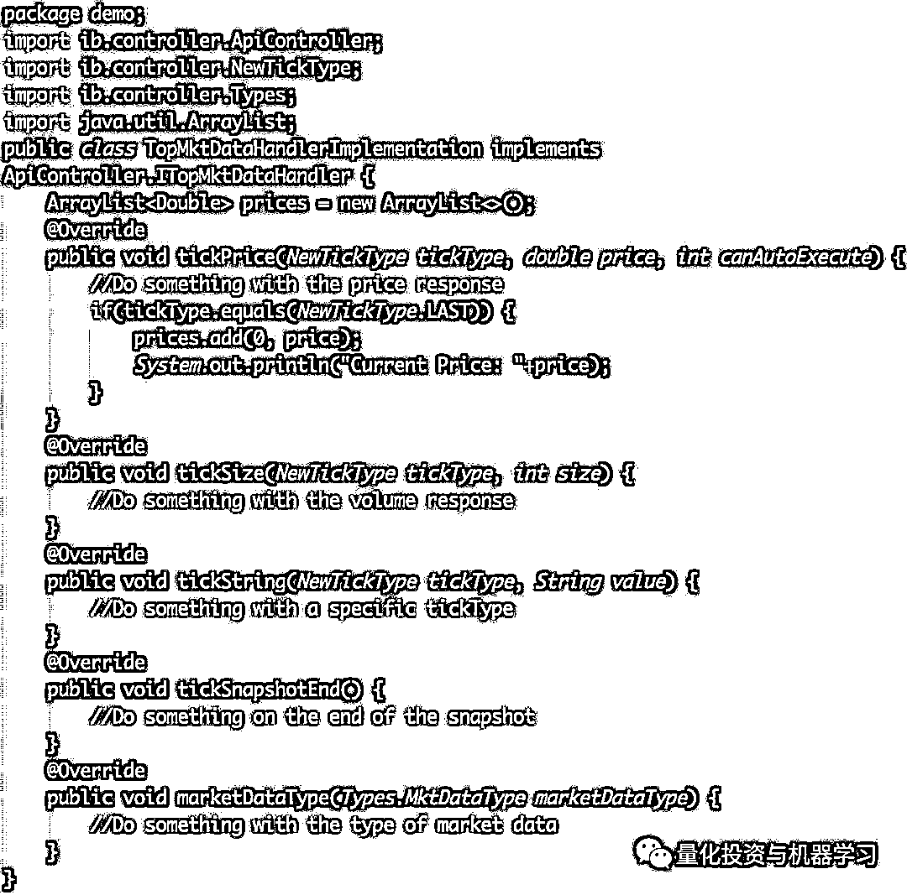

# 算法交易系统开发，揭开 Developer 的神秘面纱（代码+核心思路）

> 原文：[`mp.weixin.qq.com/s?__biz=MzAxNTc0Mjg0Mg==&mid=2653291419&idx=1&sn=18d12ce63167db55b9a5bb0df9f0b0c2&chksm=802dc18eb75a48981e2d995ed9b5632d35aa6480acd11d823ff0d09e5651b7c5a733326d3234&scene=27#wechat_redirect`](http://mp.weixin.qq.com/s?__biz=MzAxNTc0Mjg0Mg==&mid=2653291419&idx=1&sn=18d12ce63167db55b9a5bb0df9f0b0c2&chksm=802dc18eb75a48981e2d995ed9b5632d35aa6480acd11d823ff0d09e5651b7c5a733326d3234&scene=27#wechat_redirect)

**标星★公众号     **♥你们

▎作者：Roman Paolucci

**▎**编译：yana | 公众号翻译部

**近期原创文章：**

## ♥ [基于无监督学习的期权定价异常检测（代码+数据）](https://mp.weixin.qq.com/s?__biz=MzAxNTc0Mjg0Mg==&mid=2653290562&idx=1&sn=dee61b832e1aa2c062a96bb27621c29d&chksm=802dc257b75a4b41b5623ade23a7de86333bfd3b4299fb69922558b0cbafe4c930b5ef503d89&token=1298662931&lang=zh_CN&scene=21#wechat_redirect)

## ♥ [5 种机器学习算法在预测股价的应用（代码+数据）](https://mp.weixin.qq.com/s?__biz=MzAxNTc0Mjg0Mg==&mid=2653290588&idx=1&sn=1d0409ad212ea8627e5d5cedf61953ac&chksm=802dc249b75a4b5fa245433320a4cc9da1a2cceb22df6fb1a28e5b94ff038319ae4e7ec6941f&token=1298662931&lang=zh_CN&scene=21#wechat_redirect)

## ♥ [深入研读：利用 Twitter 情绪去预测股市](https://mp.weixin.qq.com/s?__biz=MzAxNTc0Mjg0Mg==&mid=2653290402&idx=1&sn=efda9ea106991f4f7ccabcae9d809e00&chksm=802e3db7b759b4a173dc8f2ab5c298ab3146bfd7dd5aca75929c74ecc999a53b195c16f19c71&token=1330520237&lang=zh_CN&scene=21#wechat_redirect)

## ♥ [Two Sigma 用新闻来预测股价走势，带你吊打 Kaggle](https://mp.weixin.qq.com/s?__biz=MzAxNTc0Mjg0Mg==&mid=2653290456&idx=1&sn=b8d2d8febc599742e43ea48e3c249323&chksm=802e3dcdb759b4db9279c689202101b6b154fb118a1c1be12b52e522e1a1d7944858dbd6637e&token=1330520237&lang=zh_CN&scene=21#wechat_redirect)

## ♥ [利用深度学习最新前沿预测股价走势](https://mp.weixin.qq.com/s?__biz=MzAxNTc0Mjg0Mg==&mid=2653290080&idx=1&sn=06c50cefe78a7b24c64c4fdb9739c7f3&chksm=802e3c75b759b563c01495d16a638a56ac7305fc324ee4917fd76c648f670b7f7276826bdaa8&token=770078636&lang=zh_CN&scene=21#wechat_redirect)

## ♥ [一位数据科学 PhD 眼中的算法交易](https://mp.weixin.qq.com/s?__biz=MzAxNTc0Mjg0Mg==&mid=2653290118&idx=1&sn=a261307470cf2f3e458ab4e7dc309179&chksm=802e3c93b759b585e079d3a797f512dfd0427ac02942339f4f1454bd368ba47be21cb52cf969&token=770078636&lang=zh_CN&scene=21#wechat_redirect)

## ♥ [基于 RNN 和 LSTM 的股市预测方法](https://mp.weixin.qq.com/s?__biz=MzAxNTc0Mjg0Mg==&mid=2653290481&idx=1&sn=f7360ea8554cc4f86fcc71315176b093&chksm=802e3de4b759b4f2235a0aeabb6e76b3e101ff09b9a2aa6fa67e6e824fc4274f68f4ae51af95&token=1865137106&lang=zh_CN&scene=21#wechat_redirect)

## ♥ [人工智能『AI』应用算法交易，7 个必踩的坑！](https://mp.weixin.qq.com/s?__biz=MzAxNTc0Mjg0Mg==&mid=2653289974&idx=1&sn=88f87cb64999d9406d7c618350aac35d&chksm=802e3fe3b759b6f5eca6e777364270cbaa0bf35e9a1535255be9751c3a77642676993a861132&token=770078636&lang=zh_CN&scene=21#wechat_redirect)

## ♥ [神经网络在算法交易上的应用系列（一）](https://mp.weixin.qq.com/s?__biz=MzAxNTc0Mjg0Mg==&mid=2653289962&idx=1&sn=5f5aa65ec00ce176501c85c7c106187d&chksm=802e3fffb759b6e9f2d4518f9d3755a68329c8753745333ef9d70ffd04bd088fd7b076318358&token=770078636&lang=zh_CN&scene=21#wechat_redirect)

## ♥ [预测股市 | 如何避免 p-Hacking，为什么你要看涨？](https://mp.weixin.qq.com/s?__biz=MzAxNTc0Mjg0Mg==&mid=2653289820&idx=1&sn=d3fee74ba1daab837433e4ef6b0ab4d9&chksm=802e3f49b759b65f422d20515942d5813aead73231da7d78e9f235bdb42386cf656079e69b8b&token=770078636&lang=zh_CN&scene=21#wechat_redirect)

## ♥ [如何鉴别那些用深度学习预测股价的花哨模型？](https://mp.weixin.qq.com/s?__biz=MzAxNTc0Mjg0Mg==&mid=2653290132&idx=1&sn=cbf1e2a4526e6e9305a6110c17063f46&chksm=802e3c81b759b597d3dd94b8008e150c90087567904a29c0c4b58d7be220a9ece2008956d5db&token=1266110554&lang=zh_CN&scene=21#wechat_redirect)

## ♥ [优化强化学习 Q-learning 算法进行股市](https://mp.weixin.qq.com/s?__biz=MzAxNTc0Mjg0Mg==&mid=2653290286&idx=1&sn=882d39a18018733b93c8c8eac385b515&chksm=802e3d3bb759b42d1fc849f96bf02ae87edf2eab01b0beecd9340112c7fb06b95cb2246d2429&token=1330520237&lang=zh_CN&scene=21#wechat_redirect)

**代码文末下载**

**量化开发**

通常量化研究员会用 Python 或 R 开发交易模型。然后把这些模型交给量化开发人员，用 java 或 C++在交易系统中使用。量化交易员通常在这些系统的帮助下执行交易。作为一个研究员、开发人员和交易员，多年与 Interactive Broker 的 Java API 打交道。在这篇文章中，我们会建立一个算法交易系统，用于基于模型的自动交易执行。在开发交易系统时，在概念上有无限的设计模式可以遵循。但是，**本文的目的是为最常见的开发阶段提供简单的解决方案**。这篇文章分成三个部分：

**• 连接 Interactive Broker 交易站（TWS）**

**• 创建实时市场数据流**

**• 实现自动交易执行模型**

安装 Interactive Brokers TWS：

*https://www.interactivebrokers.com.hk/en/index.php?f=16040*

安装 API：

*https://www.interactivebrokers.com.hk/en/index.php?f=5041*

查看 API 文档：

*https://interactivebrokers.github.io/tws-api/index.html*

**重点**

• **项目代码可以在文末下载。**

• 如果您没有 Interactive Brokers 的账户，你可以使用模拟账户【用户名：edemo，密码：demouser】来跟随并免费建立一个交易系统。

• 假设你有中级 Java 编程经验。

• 假设你具有使用 API 的一些知识，并且能够在 IDE 中进行安装过程和设置。

• 在真实账户进行交易时，某些证券的实时市场数据流需要一级市场数据订阅，更多信息可在此处找到：

*https://www.interactivebrokers.com/en/software/am3/am/settings/marketdatasubscriptions.htm*

**连接**

本节介绍用 Java 连接 TWS 以及该过程的几个特性。

**配置 TWS**

第一步是配置您 TWS。首先使用上面的模拟帐户或个人帐户登录，然后执行以下操作：

**选择 “Classic TWS” → 选择 “Conbgure” **

**选择 “API” → 启用 ActiveX 和 Client Sockets **

**禁用只读 API → Apply → Ok**

我们现在允许从 127.0.0.1:7497 进行 API 连接。

我们还允许 Java 通过禁用只读 API 来执行交易。

如果连接不成功，则可能需要转发端口。有关端口的更多信息，请参阅：主机和端口文档。*https://ibkr.info/node/2816*

**连接处理**

到目前为止，假设您已经从 Interactive Brokers 安装了 API，并在首选 IDE 中设置它的工作空间。我们将创建 IConnectionHandler 接口，来处理服务器和客户端之间的连接事件，从而实现 Java 和 TWS 之间建立连接：

接下来，需要创建 ILogger 接口的实现：

既然我们知道如何处理连接和记录信息（使用我们的接口实现），就可以建立与 TWS 的连接。在项目的主要类 Demo 中连接到 TWS：

主控制器是**ApiController**，通过它发送请求并从 TWS 接收响应。

连接成功，可以在终端中看到：

现在已成功连接到 TWS，我们可以创建实时市场数据流来处理实时数据。

**实时数据流**

本节介绍设置市场数据流的过程。

## **市场数据句柄**

与连接处理程序类似，必须创建 ITopMktDataHandler 接口的实例，以便处理服务器响应的数据。通过给实例方法传递参数的方式，从服务器接收数据。在数据发生变化时服务器对其进行响应，因此 Price, Volume，Bid_Size，Ask_Size 等功能的更改会发送给 ITopMktDataHandler 的实例方法。要在下一节中实现任何类型的交易模型，我们需要一种方法来捕获这些数据。现在把最新修改价格存储在 ArrayList 顶部：

简而言之，在 TopMktDataHandlerImplementation 的新类中实现 ITopMktDataHandler 接口，处理服务器响应的数据。 tickPrice 方法会在服务器更改时从服务器接收数据。当服务器响应最新价格的变化时，我们将其添加到 ArrayList 价格。

## **可视化 Price ArrayList 的行为**

我们正在改变将新项添加到 ArrayList 的方式。以下是其工作原理的图形表示：

新价格到达时，我们将其插入到 ArrayList 的顶部，可以通过语句 **price.get（0）**获得最新价格。在建模和交易执行部分会更具相关性。

## **创建合约对象**

这个过程最重要的部分是建立一个 NewContract 对象作为参数传递给请求。为此，我们使用流式传输的安全性的参数初始化 NewContract 对象。我将使用期货合约作为例子：

## **请求实时市场数据流**

现在有办法处理数据流，并定义了流的安全性，接下来看下并细分请求方法：

第一个参数是合约，简单地传递初始化契约的方法。

第二个参数可以保留为空字符串。

第三个参数确定是否正在请求快照，我们显然希望将此请求建立为流。

最后一个参数是 ITopMktDataHandler。这允许我们使用服务器的响应数据来处理事务。

以下是主类 Demo 建立数据流的更新：

运行此操作后，可以在终端中获得以下输出：

我们已成功为特定合约创建了市场数据流。

**自动交易执行模型**

# **可能是算法交易系统开发中最迷人的部分**。本节是关于实现模型和自动订单执行的全部内容。

## **模型开发**

**这是我们交易系统中最重要的部分**。如果模型没有盈利，就不会赚钱。虽然我们在本文中不会过多谈论模型开发过程，但想稍微谈谈它。 

正如我在介绍中简要提到的，**通常模型开发是一个不同的角色，属于定量研究员的职责。研究人员用 Python 或 R 开发模型，开发人员用 Java 或 C ++实现它，交易者负责交易执行。大多数研究人员使用某种形式的机器学习来协助开发他们的模型。就是掌握 Python 中的数据科学库，如 Pandas，ScikitLearn，Numpy 和 R 中的包，如 quantmod。如果您希望在模型开发中了解有关机器学习应用程序的更多信息。**

虽然有几种方法可以开发交易模型，但显然它绝不是一门精确的科学。**一些模型设计具有遗传能力，以不断适应市场条件，而其他模型设置有损失限制，因此当它们停止执行时，它们会被废弃。**对于定量研究，高级金融，数学和统计知识是必不可少的。这些技能与创造力和坚持不懈相媲美，从而推动了建模过程。

一般模型设计过程可以看作如下：

**阅读博士论文或其他相关信息 → 草拟模型创意 → 回测模型（评估绩效的一些关键指标）→ 废弃不良模型（通常约为所有模型创意的 70％-90％）→ 继续开发和审查剩余模型 → 查看生产潜力 → 重复过程。**

## **任意实施模式**

我们将使用**基于价格变化阈值的简单策略来构建期货合约**。以下是进入策略的直观表示：

下一步是制定退场策略。为简单起见，我们的退场策略只是一个限制，并分别停止 1 点和 0.5 点（费用后保持相同的费用）

此模型的目的是展示基于模型的自动订单执行的简单解决方案。不建议在真实账户上实施此策略。

## **模型开发**

我们将从 TopMktDataHandlerImplementation 中的价格 ArrayList 获取信息。在获得价格之后，我们将要开发一个类来处理（基于模型的）进入信号，然后开发一个类来处理发送订单。我将使用 EntrySignalA 类作为我的主要信号：

既然我们有办法让价格符合我们的信号，以确定买入或卖出，我们需要创建一个类来处理订单。我们将创建一个类来实现自定义订单和处理活动订单。

现在我们可以在信号类中使用 placeBracketOrder 方法：

  

**要点**

在此例中，使用 1000 和 2000 作为 parentOrderId。如果交易没有唯一的订单 ID，则不会发送交易。但是，如果在 TWS 中重置订单 ID API 序列，则将重置所有现有订单 ID，并且可以重复使用。有许多方法可以生成唯一的订单 ID，例如将当前日期/时间转换为整数。

## **全放在一起**

如果我们从逻辑上考虑这个问题，有一个非常简单的方法可以将它实现。只需在服务器响应的方法底部添加信号类的实例，以获得价格的每次变化：

我们现在有一个简单的系统，可以根据我们的模型自动执行交易。这是我们的模型执行买入订单时的样子：

**量化开发人员 - 系统开发**

**作为量化开发人员，你的工作通常是创建基于经过严格测试的 oi 模型的交易系统。**在这个例子中，我们引导你完成算法交易系统的开发，并为关键的开发阶段提供了简单的解决方案。有很多方法来改进这个系统（显然是模型），例如： 

**• 在交易执行系统中添加安全标志**

**• 未能以非最优价格执行订单**

**• 当前模型性能的分析库**

**• 等等**

**推荐阅读**

[01、经过多年交易之后你应该学到的东西（深度分享）](https://mp.weixin.qq.com/s?__biz=MzAxNTc0Mjg0Mg==&mid=2653289074&idx=1&sn=e859d363eef9249236244466a1af41b6&chksm=802e3867b759b1717f77e07a51ee5671e8115130c66562577280ba1243cba08218add04f1f00&token=449379994&lang=zh_CN&scene=21#wechat_redirect)

[02、监督学习标签在股市中的应用（代码+书籍）](https://mp.weixin.qq.com/s?__biz=MzAxNTc0Mjg0Mg==&mid=2653289050&idx=1&sn=60043a5c95b877dd329a5fd150ddacc4&chksm=802e384fb759b1598e500087374772059aa21b31ae104b3dca04331cf4b63a233c5e04c1945a&token=449379994&lang=zh_CN&scene=21#wechat_redirect)

[03、全球投行顶尖机器学习团队全面分析](https://mp.weixin.qq.com/s?__biz=MzAxNTc0Mjg0Mg==&mid=2653289018&idx=1&sn=8c411f676c2c0d92b0dd218f041bee4b&chksm=802e382fb759b139ffebf633ac14cdd0f21938e4613fe632d5d9231dab3d2aca95a11628378a&token=449379994&lang=zh_CN&scene=21#wechat_redirect)

[04、使用 Tensorflow 预测股票市场变动](https://mp.weixin.qq.com/s?__biz=MzAxNTc0Mjg0Mg==&mid=2653289014&idx=1&sn=3762d405e332c599a21b48a7dc4df587&chksm=802e3823b759b135928d55044c2729aea9690f86752b680eb973d1a376dc53cfa18287d0060b&token=449379994&lang=zh_CN&scene=21#wechat_redirect)

[05、使用 LSTM 预测股票市场基于 Tensorflow](https://mp.weixin.qq.com/s?__biz=MzAxNTc0Mjg0Mg==&mid=2653289238&idx=1&sn=3144f5792f84455dd53c27a78e8a316c&chksm=802e3903b759b015da88acde4fcbc8547ab3e6acbb5a0897404bbefe1d8a414265d5d5766ee4&token=2020206794&lang=zh_CN&scene=21#wechat_redirect)

[06、美丽的回测——教你定量计算过拟合概率](https://mp.weixin.qq.com/s?__biz=MzAxNTc0Mjg0Mg==&mid=2653289314&idx=1&sn=87c5a12b23a875966db7be50d11f09cd&chksm=802e3977b759b061675d1988168c1fec06c602e8583fbcc9b76f87008e0c10b702acc85467a0&token=1972390229&lang=zh_CN&scene=21#wechat_redirect)

[07、利用动态深度学习预测金融时间序列基于 Python](https://mp.weixin.qq.com/s?__biz=MzAxNTc0Mjg0Mg==&mid=2653289347&idx=1&sn=bf5d7899bc4a854d4ba9046fdc6fe0d6&chksm=802e3996b759b080287213840987bb0a0c02e4e1d4d7aae23f10a225a92ef6dd922d8006123d&token=290397496&lang=zh_CN&scene=21#wechat_redirect)

[08、Facebook 开源神器 Prophet 预测时间序列基于 Python](https://mp.weixin.qq.com/s?__biz=MzAxNTc0Mjg0Mg==&mid=2653289394&idx=1&sn=24a836136d730aa268605628e683d629&chksm=802e39a7b759b0b1dcf7aaa560699130a907716b71fc9c45ff0e5d236c5ae8ef80ebdb09dbb6&token=290397496&lang=zh_CN&scene=21#wechat_redirect)

[09、Facebook 开源神器 Prophet 预测股市行情基于 Python](https://mp.weixin.qq.com/s?__biz=MzAxNTc0Mjg0Mg==&mid=2653289437&idx=1&sn=f0dca7da8e69e7ba736992cb3d034ce7&chksm=802e39c8b759b0de5bce401c580623d0729ecca69d13926479d36e19aff8c9c9e8a20265afff&token=290397496&lang=zh_CN&scene=21#wechat_redirect)

[10、2018 第三季度最受欢迎的券商金工研报前 50（附下载）](https://mp.weixin.qq.com/s?__biz=MzAxNTc0Mjg0Mg==&mid=2653289358&idx=1&sn=db6e8ab85b08f6e67790ec0e401e586e&chksm=802e399bb759b08d6eec855f9901ea856d0da68c7425cba62791b8948da6ad761a3d88543dad&token=290397496&lang=zh_CN&scene=21#wechat_redirect)

[11、实战交易策略的精髓（公众号深度呈现）](https://mp.weixin.qq.com/s?__biz=MzAxNTc0Mjg0Mg==&mid=2653289447&idx=1&sn=f2948715bf82569a6556d518e56c1f9e&chksm=802e39f2b759b0e4502d1aaac562b87789573b55c76b3c85897d8c9d88dbf9a0b7ee34d86a4e&token=290397496&lang=zh_CN&scene=21#wechat_redirect)

[12、Markowitz 有效边界和投资组合优化基于 Python](https://mp.weixin.qq.com/s?__biz=MzAxNTc0Mjg0Mg==&mid=2653289478&idx=1&sn=f8e01a641be021993d8ef2d84e94a299&chksm=802e3e13b759b7055cf27a280c672371008a5564c97c658eee89ce8481396a28d254836ff9af&token=290397496&lang=zh_CN&scene=21#wechat_redirect)

[13、使用 LSTM 模型预测股价基于 Keras](https://mp.weixin.qq.com/s?__biz=MzAxNTc0Mjg0Mg==&mid=2653289495&idx=1&sn=c4eeaa2e9f9c10995be9ea0c56d29ba7&chksm=802e3e02b759b7148227675c23c403fb9a543b733e3d27fa237b53840e030bf387a473d83e3c&token=1260956004&lang=zh_CN&scene=21#wechat_redirect)

[14、量化金融导论 1：资产收益的程式化介绍基于 Python](https://mp.weixin.qq.com/s?__biz=MzAxNTc0Mjg0Mg==&mid=2653289507&idx=1&sn=f0ca71aa07531bbbdbd33213f0bab89f&chksm=802e3e36b759b720138b3b17a4dd0e198e054b9de29a038fdd50805f824effa55831111ad026&token=1936245282&lang=zh_CN&scene=21#wechat_redirect)

[15、预测股市崩盘基于统计机器学习与神经网络（Python+文档）](https://mp.weixin.qq.com/s?__biz=MzAxNTc0Mjg0Mg==&mid=2653289533&idx=1&sn=4ef964834e84a9995111bb057b0fc5dd&chksm=802e3e28b759b73e0618eb1262c53aa0601fbf5805525a7c7ff40dc3db62c7704496611bdbf1&token=1950551577&lang=zh_CN&scene=21#wechat_redirect)

[16、实现最优投资组合有效前沿基于 Python（附代码）](https://mp.weixin.qq.com/s?__biz=MzAxNTc0Mjg0Mg==&mid=2653289609&idx=1&sn=c7f0b3e47025862d10bb53b6ab88bcda&chksm=802e3e9cb759b78abf6b8b049c59bf18ccfb2ead7580d1f557d36de2292f59dcbd94dcd41910&token=2085008037&lang=zh_CN&scene=21#wechat_redirect)

[17、精心为大家整理了一些超级棒的机器学习资料（附链接）](https://mp.weixin.qq.com/s?__biz=MzAxNTc0Mjg0Mg==&mid=2653289615&idx=1&sn=1cdc89afb997d0c580bf0cef296d946c&chksm=802e3e9ab759b78ce9f0cd152a680d4a413d6c8dcb02a7a296f4091993a7e4137e7520394575&token=2085008037&lang=zh_CN&scene=21#wechat_redirect)

[18、海量 Wind 数据，与全网用户零距离邂逅！](https://mp.weixin.qq.com/s?__biz=MzAxNTc0Mjg0Mg==&mid=2653289623&idx=1&sn=28a3600fd7a72d7be00b066ca0f98244&chksm=802e3e82b759b7943f43a4f6ef4a91e4153fa6b8210de9590235fa8ee66eb9811ce177054dbc&token=1389401983&lang=zh_CN&scene=21#wechat_redirect)

[19、机器学习、深度学习、量化金融、Python 等最新书籍汇总下载](https://mp.weixin.qq.com/s?__biz=MzAxNTc0Mjg0Mg==&mid=2653289640&idx=1&sn=34e94fcbe99052b8e7381ecc48a36dc0&chksm=802e3ebdb759b7ab897cd329a680715b6f8294e63550ddf0c57b9e1320b2b7d1408c6fdca0c7&token=1389401983&lang=zh_CN&scene=21#wechat_redirect)

[20、各大卖方 2019 年 A 股策略报告，都是有故事的人！](https://mp.weixin.qq.com/s?__biz=MzAxNTc0Mjg0Mg==&mid=2653289725&idx=1&sn=4b65cd1fb8331438e4c0b3d0eae6b51f&chksm=802e3ee8b759b7fe1b94e84d54cc23b0ab05853d5cd227812574b350e9fc2cce9e5f1bc6cb7a&token=1389401983&lang=zh_CN&scene=21#wechat_redirect)

**如何获取代码**

在**后台**输入

**量化开发**

*—End—*

量化投资与机器学习微信公众号，是业内垂直于**Quant**、**MFE**、**CST**等专业的主流自媒体。公众号拥有来自**公募、私募、券商、银行、海外**等众多圈内**10W+**关注者。每日发布行业前沿研究成果和最新资讯。

