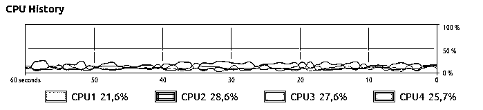

# 干货 | 如何用一行代码在多 CPU 环境下高效并行 Pandas

> 原文：[`mp.weixin.qq.com/s?__biz=MzAxNTc0Mjg0Mg==&mid=2653291393&idx=1&sn=f660f3082c853fd49fcbc9e040250663&chksm=802dc194b75a4882e821070d6f359369104f9a0564fc659c7dcc4e942cd2a3fdc04c6ff0f87e&scene=27#wechat_redirect`](http://mp.weixin.qq.com/s?__biz=MzAxNTc0Mjg0Mg==&mid=2653291393&idx=1&sn=f660f3082c853fd49fcbc9e040250663&chksm=802dc194b75a4882e821070d6f359369104f9a0564fc659c7dcc4e942cd2a3fdc04c6ff0f87e&scene=27#wechat_redirect)

**标星★公众号     **♥你们

▎作者：Manu NALEPA

**▎**编译：公众号翻译部

**近期原创文章：**

## ♥ [基于无监督学习的期权定价异常检测（代码+数据）](https://mp.weixin.qq.com/s?__biz=MzAxNTc0Mjg0Mg==&mid=2653290562&idx=1&sn=dee61b832e1aa2c062a96bb27621c29d&chksm=802dc257b75a4b41b5623ade23a7de86333bfd3b4299fb69922558b0cbafe4c930b5ef503d89&token=1298662931&lang=zh_CN&scene=21#wechat_redirect)

## ♥ [5 种机器学习算法在预测股价的应用（代码+数据）](https://mp.weixin.qq.com/s?__biz=MzAxNTc0Mjg0Mg==&mid=2653290588&idx=1&sn=1d0409ad212ea8627e5d5cedf61953ac&chksm=802dc249b75a4b5fa245433320a4cc9da1a2cceb22df6fb1a28e5b94ff038319ae4e7ec6941f&token=1298662931&lang=zh_CN&scene=21#wechat_redirect)

## ♥ [深入研读：利用 Twitter 情绪去预测股市](https://mp.weixin.qq.com/s?__biz=MzAxNTc0Mjg0Mg==&mid=2653290402&idx=1&sn=efda9ea106991f4f7ccabcae9d809e00&chksm=802e3db7b759b4a173dc8f2ab5c298ab3146bfd7dd5aca75929c74ecc999a53b195c16f19c71&token=1330520237&lang=zh_CN&scene=21#wechat_redirect)

## ♥ [Two Sigma 用新闻来预测股价走势，带你吊打 Kaggle](https://mp.weixin.qq.com/s?__biz=MzAxNTc0Mjg0Mg==&mid=2653290456&idx=1&sn=b8d2d8febc599742e43ea48e3c249323&chksm=802e3dcdb759b4db9279c689202101b6b154fb118a1c1be12b52e522e1a1d7944858dbd6637e&token=1330520237&lang=zh_CN&scene=21#wechat_redirect)

## ♥ [利用深度学习最新前沿预测股价走势](https://mp.weixin.qq.com/s?__biz=MzAxNTc0Mjg0Mg==&mid=2653290080&idx=1&sn=06c50cefe78a7b24c64c4fdb9739c7f3&chksm=802e3c75b759b563c01495d16a638a56ac7305fc324ee4917fd76c648f670b7f7276826bdaa8&token=770078636&lang=zh_CN&scene=21#wechat_redirect)

## ♥ [一位数据科学 PhD 眼中的算法交易](https://mp.weixin.qq.com/s?__biz=MzAxNTc0Mjg0Mg==&mid=2653290118&idx=1&sn=a261307470cf2f3e458ab4e7dc309179&chksm=802e3c93b759b585e079d3a797f512dfd0427ac02942339f4f1454bd368ba47be21cb52cf969&token=770078636&lang=zh_CN&scene=21#wechat_redirect)

## ♥ [基于 RNN 和 LSTM 的股市预测方法](https://mp.weixin.qq.com/s?__biz=MzAxNTc0Mjg0Mg==&mid=2653290481&idx=1&sn=f7360ea8554cc4f86fcc71315176b093&chksm=802e3de4b759b4f2235a0aeabb6e76b3e101ff09b9a2aa6fa67e6e824fc4274f68f4ae51af95&token=1865137106&lang=zh_CN&scene=21#wechat_redirect)

## ♥ [人工智能『AI』应用算法交易，7 个必踩的坑！](https://mp.weixin.qq.com/s?__biz=MzAxNTc0Mjg0Mg==&mid=2653289974&idx=1&sn=88f87cb64999d9406d7c618350aac35d&chksm=802e3fe3b759b6f5eca6e777364270cbaa0bf35e9a1535255be9751c3a77642676993a861132&token=770078636&lang=zh_CN&scene=21#wechat_redirect)

## ♥ [神经网络在算法交易上的应用系列（一）](https://mp.weixin.qq.com/s?__biz=MzAxNTc0Mjg0Mg==&mid=2653289962&idx=1&sn=5f5aa65ec00ce176501c85c7c106187d&chksm=802e3fffb759b6e9f2d4518f9d3755a68329c8753745333ef9d70ffd04bd088fd7b076318358&token=770078636&lang=zh_CN&scene=21#wechat_redirect)

## ♥ [预测股市 | 如何避免 p-Hacking，为什么你要看涨？](https://mp.weixin.qq.com/s?__biz=MzAxNTc0Mjg0Mg==&mid=2653289820&idx=1&sn=d3fee74ba1daab837433e4ef6b0ab4d9&chksm=802e3f49b759b65f422d20515942d5813aead73231da7d78e9f235bdb42386cf656079e69b8b&token=770078636&lang=zh_CN&scene=21#wechat_redirect)

## ♥ [如何鉴别那些用深度学习预测股价的花哨模型？](https://mp.weixin.qq.com/s?__biz=MzAxNTc0Mjg0Mg==&mid=2653290132&idx=1&sn=cbf1e2a4526e6e9305a6110c17063f46&chksm=802e3c81b759b597d3dd94b8008e150c90087567904a29c0c4b58d7be220a9ece2008956d5db&token=1266110554&lang=zh_CN&scene=21#wechat_redirect)

## ♥ [优化强化学习 Q-learning 算法进行股市](https://mp.weixin.qq.com/s?__biz=MzAxNTc0Mjg0Mg==&mid=2653290286&idx=1&sn=882d39a18018733b93c8c8eac385b515&chksm=802e3d3bb759b42d1fc849f96bf02ae87edf2eab01b0beecd9340112c7fb06b95cb2246d2429&token=1330520237&lang=zh_CN&scene=21#wechat_redirect)

本文中介绍的**库****只支持****Linux**和**MacOS**。

**安装文件文末下载**


**什么问题困扰着我们?**

对于 Pandas，当你运行以下代码行时：

```py
df.apply(func)
```


只使用一个 CPU

即使你的计算机有多个 CPU，也只有一个 CPU 是完全用于计算的。

我们希望用一种简单的方法来代替 CPU 的使用：



所有 CPU 齐上阵

**Pandaral·lel 如何解决这个问题？**

Pandaral·lel 的理念是将 Pandas 计算分配到计算机上所有可用的 CPU 上，以获得显著的速度提升。

**▍安装**

```py
$ pip install pandarallel [--user]
```

****▍**初始化**

```py
# Import
from pandarallel import pandarallel

# Initialization
pandarallel.initialize()
```

**▍用法**

对于一个带有 Pandas DataFrame df 的简单用例和一个应用 func 的函数，只需用 parallel_apply 替换经典的 apply。

```py
# Standard pandas apply
df.apply(func)

# Parallel apply
df.parallel_apply(func)
```

注意，如果不想并行化计算，仍然可以使用经典的 apply 方法。


你还可以通过在 initialize 函数中传递 progress_bar=True 来显示每个工作 CPU 的一个进度条。


在一个更加复杂的 Pandas DataFrame df 用例中，DataFrame column1 和 column2 的两列，以及一个函数用于 func：

```py
# Standard pandas apply
df.groupby(column1).column2.rolling(4).apply(func)

# Parallel apply
df.groupby(column1).column2.rolling(4).parallel_apply(func)
```

**基准**

以下是其中四个例子的配置：

*   操作系统：Linux Ubuntu 16.04

*   硬件：Intel Core i7 @ 3.40 GHz - 4 核

```py
%load_ext autoreload
%autoreload 2
import pandas as pd
import time
from pandarallel import pandarallel
import math
import numpy as np
```

# ****▍**DataFrame.apply**

```py
f_size = int(5e6)
df = pd.DataFrame(dict(a=np.random.randint(1, 8, df_size),b=np.random.rand(df_size)))

def func(x):
        return math.sin(x.a**2) + math.sin(x.b**2)
%%time
res = df.apply(func, axis=1)
%%time
res_parallel = df.parallel_apply(func, axis=1)
res.equals(res_parallel)
```

# **▍DataFrame.applymap**

```py
df_size = int(1e7)
df = pd.DataFrame(dict(a=np.random.randint(1, 8, df_size),b=np.random.rand(df_size)))

def func(x):
        return math.sin(x**2) - math.cos(x**2)
%%time
res = df.applymap(func)
%%time
res_parallel = df.parallel_applymap(func)
res.equals(res_parallel)
```

# **▍DataFrame.groupby.apply**

```py
df_size = int(3e7)
df = pd.DataFrame(dict(a=np.random.randint(1, 1000, df_size),
                       b=np.random.rand(df_size)))

def func(df):
        dum = 0
    for item in df.b:
            dum += math.log10(math.sqrt(math.exp(item**2)))
        return dum / len(df.b)
%%time
res = df.groupby("a").apply(func)
%%time
res_parallel = df.groupby("a").parallel_apply(func)
res.equals(res_parallel)
```

# **▍DataFrame.groupby.rolling.apply**

```py
df_size = int(1e6)
df = pd.DataFrame(dict(a=np.random.randint(1, 300, df_size),b=np.random.rand(df_size)))

def func(x):
        return x.iloc[0] + x.iloc[1] ** 2 + x.iloc[2] ** 3 + x.iloc[3] ** 4
%%time
res = df.groupby('a').b.rolling(4).apply(func, raw=False)
%%time
res_parallel = df.groupby('a').b.rolling(4).parallel_apply(func, raw=False)
res.equals(res_parallel)
```


# 标准 vs 并行四核（越低越好）

除了 df.groupby.col_name.rolling。如果应用程序的速度只增加了 x3.2 倍，那么平均速度就会增加大约 x4 倍，即使用的计算机上的内核数量。

# **▍Series.map**

```py
df_size = int(5e7)
df = pd.DataFrame(dict(a=np.random.rand(df_size) + 1))
def func(x):
        return math.log10(math.sqrt(math.exp(x**2)))
%%time
res = df.a.map(func)
%%time
res_parallel = df.a.parallel_map(func)
res.equals(res_parallel)
```

# **▍Series.apply**

```py
df_size = int(3.5e7)
df = pd.DataFrame(dict(a=np.random.rand(df_size) + 1))
def func(x, power, bias=0):
        return math.log10(math.sqrt(math.exp(x**power))) + bias
%%time
res = df.a.apply(func, args=(2,), bias=3)
%%time
res_parallel = df.a.parallel_apply(func, args=(2,), bias=3)
res.equals(res_parallel)
```

# **▍Series.rolling.apply**

```py
df_size = int(1e6)
df = pd.DataFrame(dict(a=np.random.randint(1, 8, df_size),
                       b=list(range(df_size))))
def func(x):
        return x.iloc[0] + x.iloc[1] ** 2 + x.iloc[2] ** 3 + x.iloc[3] ** 4
%%time
res = df.b.rolling(4).apply(func, raw=False)
%%time
res_parallel = df.b.rolling(4).parallel_apply(func, raw=False)
res.equals(res_parallel)
```

**警告**

1、进度条是一项实验性功能。这可能导致相当大的性能损失。parallel_apply 不能用于 DataFrameGroupy.parallel_apply。

2、使用 df 一个 Pandas DataFrame，series 一个 Pandas Series，func 一个函数来应用/ map，args1，args2 一些参数＆col_name 一个列名：


**具体如何操作的？**

调用 parallel_apply 时，Pandaral·lel：

*   实例化 Pyarrow Plasma shared memory。

*   *https://arrow.apache.org/docs/python/plasma.html*

*   为每个 CPU 创建一个子进程，并要求每个 CPU 处理 DataFrame 的一个子部分。

*   在父进程中组合所有结果。

与其他进程间通信媒介相比，使用共享内存的主要优点是不存在序列化/反序列化，这可能会导致 CPU 开销过大。

**警告**

1、**并行化是有条件的**（实现新进程，通过共享内存发送数据等等），所以**只有当并行化的计算量足够高时，并行化才有效**。对于很少的数据，使用 parallezation 并不总是有效的。 

2、应用的函数不应该是 lambda 函数。

```py
from pandarallel import pandarallel
from math import sin

pandarallel.initialize()

# FORBIDDEN
df.parallel_apply(lambda x: sin(x**2), axis=1)

# ALLOWED
def func(x):
    return sin(x**2)

df.parallel_apply(func, axis=1)
```

**问题排除**

我有 8 个 CPU，但是 *parallel_apply*只加快了大约 x4 的计算速度。为什么? 

实际上，Pandarallel 只能加快计算速度，直到你计算机有大约核心的数量。最近大多数 CPU（如 Intel core-i7）都使用超线程。例如，一个 4 核的超线程 CPU 将向操作系统显示 8 个 CPU，但实际上只有 4 个物理计算单元。

在 Ubuntu 上，你可以用如下获得内核的数量：

*$ grep - m1 'cpu core ' /proc/cpuinfo.*

当我运行如下时：

*from pandarallel import pandarallel*

我得到：

*ModuleNotFoundError: No module named 'pyarrow._plasma。*

为什么?

目前，Pyarrow Plasma 只在 Linux 和 macOS 上工作（不支持 Windows）

**推荐阅读**

[01、经过多年交易之后你应该学到的东西（深度分享）](https://mp.weixin.qq.com/s?__biz=MzAxNTc0Mjg0Mg==&mid=2653289074&idx=1&sn=e859d363eef9249236244466a1af41b6&chksm=802e3867b759b1717f77e07a51ee5671e8115130c66562577280ba1243cba08218add04f1f00&token=449379994&lang=zh_CN&scene=21#wechat_redirect)

[02、监督学习标签在股市中的应用（代码+书籍）](https://mp.weixin.qq.com/s?__biz=MzAxNTc0Mjg0Mg==&mid=2653289050&idx=1&sn=60043a5c95b877dd329a5fd150ddacc4&chksm=802e384fb759b1598e500087374772059aa21b31ae104b3dca04331cf4b63a233c5e04c1945a&token=449379994&lang=zh_CN&scene=21#wechat_redirect)

[03、全球投行顶尖机器学习团队全面分析](https://mp.weixin.qq.com/s?__biz=MzAxNTc0Mjg0Mg==&mid=2653289018&idx=1&sn=8c411f676c2c0d92b0dd218f041bee4b&chksm=802e382fb759b139ffebf633ac14cdd0f21938e4613fe632d5d9231dab3d2aca95a11628378a&token=449379994&lang=zh_CN&scene=21#wechat_redirect)

[04、使用 Tensorflow 预测股票市场变动](https://mp.weixin.qq.com/s?__biz=MzAxNTc0Mjg0Mg==&mid=2653289014&idx=1&sn=3762d405e332c599a21b48a7dc4df587&chksm=802e3823b759b135928d55044c2729aea9690f86752b680eb973d1a376dc53cfa18287d0060b&token=449379994&lang=zh_CN&scene=21#wechat_redirect)

[05、使用 LSTM 预测股票市场基于 Tensorflow](https://mp.weixin.qq.com/s?__biz=MzAxNTc0Mjg0Mg==&mid=2653289238&idx=1&sn=3144f5792f84455dd53c27a78e8a316c&chksm=802e3903b759b015da88acde4fcbc8547ab3e6acbb5a0897404bbefe1d8a414265d5d5766ee4&token=2020206794&lang=zh_CN&scene=21#wechat_redirect)

[06、美丽的回测——教你定量计算过拟合概率](https://mp.weixin.qq.com/s?__biz=MzAxNTc0Mjg0Mg==&mid=2653289314&idx=1&sn=87c5a12b23a875966db7be50d11f09cd&chksm=802e3977b759b061675d1988168c1fec06c602e8583fbcc9b76f87008e0c10b702acc85467a0&token=1972390229&lang=zh_CN&scene=21#wechat_redirect)

[07、利用动态深度学习预测金融时间序列基于 Python](https://mp.weixin.qq.com/s?__biz=MzAxNTc0Mjg0Mg==&mid=2653289347&idx=1&sn=bf5d7899bc4a854d4ba9046fdc6fe0d6&chksm=802e3996b759b080287213840987bb0a0c02e4e1d4d7aae23f10a225a92ef6dd922d8006123d&token=290397496&lang=zh_CN&scene=21#wechat_redirect)

[08、Facebook 开源神器 Prophet 预测时间序列基于 Python](https://mp.weixin.qq.com/s?__biz=MzAxNTc0Mjg0Mg==&mid=2653289394&idx=1&sn=24a836136d730aa268605628e683d629&chksm=802e39a7b759b0b1dcf7aaa560699130a907716b71fc9c45ff0e5d236c5ae8ef80ebdb09dbb6&token=290397496&lang=zh_CN&scene=21#wechat_redirect)

[09、Facebook 开源神器 Prophet 预测股市行情基于 Python](https://mp.weixin.qq.com/s?__biz=MzAxNTc0Mjg0Mg==&mid=2653289437&idx=1&sn=f0dca7da8e69e7ba736992cb3d034ce7&chksm=802e39c8b759b0de5bce401c580623d0729ecca69d13926479d36e19aff8c9c9e8a20265afff&token=290397496&lang=zh_CN&scene=21#wechat_redirect)

[10、2018 第三季度最受欢迎的券商金工研报前 50（附下载）](https://mp.weixin.qq.com/s?__biz=MzAxNTc0Mjg0Mg==&mid=2653289358&idx=1&sn=db6e8ab85b08f6e67790ec0e401e586e&chksm=802e399bb759b08d6eec855f9901ea856d0da68c7425cba62791b8948da6ad761a3d88543dad&token=290397496&lang=zh_CN&scene=21#wechat_redirect)

[11、实战交易策略的精髓（公众号深度呈现）](https://mp.weixin.qq.com/s?__biz=MzAxNTc0Mjg0Mg==&mid=2653289447&idx=1&sn=f2948715bf82569a6556d518e56c1f9e&chksm=802e39f2b759b0e4502d1aaac562b87789573b55c76b3c85897d8c9d88dbf9a0b7ee34d86a4e&token=290397496&lang=zh_CN&scene=21#wechat_redirect)

[12、Markowitz 有效边界和投资组合优化基于 Python](https://mp.weixin.qq.com/s?__biz=MzAxNTc0Mjg0Mg==&mid=2653289478&idx=1&sn=f8e01a641be021993d8ef2d84e94a299&chksm=802e3e13b759b7055cf27a280c672371008a5564c97c658eee89ce8481396a28d254836ff9af&token=290397496&lang=zh_CN&scene=21#wechat_redirect)

[13、使用 LSTM 模型预测股价基于 Keras](https://mp.weixin.qq.com/s?__biz=MzAxNTc0Mjg0Mg==&mid=2653289495&idx=1&sn=c4eeaa2e9f9c10995be9ea0c56d29ba7&chksm=802e3e02b759b7148227675c23c403fb9a543b733e3d27fa237b53840e030bf387a473d83e3c&token=1260956004&lang=zh_CN&scene=21#wechat_redirect)

[14、量化金融导论 1：资产收益的程式化介绍基于 Python](https://mp.weixin.qq.com/s?__biz=MzAxNTc0Mjg0Mg==&mid=2653289507&idx=1&sn=f0ca71aa07531bbbdbd33213f0bab89f&chksm=802e3e36b759b720138b3b17a4dd0e198e054b9de29a038fdd50805f824effa55831111ad026&token=1936245282&lang=zh_CN&scene=21#wechat_redirect)

[15、预测股市崩盘基于统计机器学习与神经网络（Python+文档）](https://mp.weixin.qq.com/s?__biz=MzAxNTc0Mjg0Mg==&mid=2653289533&idx=1&sn=4ef964834e84a9995111bb057b0fc5dd&chksm=802e3e28b759b73e0618eb1262c53aa0601fbf5805525a7c7ff40dc3db62c7704496611bdbf1&token=1950551577&lang=zh_CN&scene=21#wechat_redirect)

[16、实现最优投资组合有效前沿基于 Python（附代码）](https://mp.weixin.qq.com/s?__biz=MzAxNTc0Mjg0Mg==&mid=2653289609&idx=1&sn=c7f0b3e47025862d10bb53b6ab88bcda&chksm=802e3e9cb759b78abf6b8b049c59bf18ccfb2ead7580d1f557d36de2292f59dcbd94dcd41910&token=2085008037&lang=zh_CN&scene=21#wechat_redirect)

[17、精心为大家整理了一些超级棒的机器学习资料（附链接）](https://mp.weixin.qq.com/s?__biz=MzAxNTc0Mjg0Mg==&mid=2653289615&idx=1&sn=1cdc89afb997d0c580bf0cef296d946c&chksm=802e3e9ab759b78ce9f0cd152a680d4a413d6c8dcb02a7a296f4091993a7e4137e7520394575&token=2085008037&lang=zh_CN&scene=21#wechat_redirect)

[18、海量 Wind 数据，与全网用户零距离邂逅！](https://mp.weixin.qq.com/s?__biz=MzAxNTc0Mjg0Mg==&mid=2653289623&idx=1&sn=28a3600fd7a72d7be00b066ca0f98244&chksm=802e3e82b759b7943f43a4f6ef4a91e4153fa6b8210de9590235fa8ee66eb9811ce177054dbc&token=1389401983&lang=zh_CN&scene=21#wechat_redirect)

[19、机器学习、深度学习、量化金融、Python 等最新书籍汇总下载](https://mp.weixin.qq.com/s?__biz=MzAxNTc0Mjg0Mg==&mid=2653289640&idx=1&sn=34e94fcbe99052b8e7381ecc48a36dc0&chksm=802e3ebdb759b7ab897cd329a680715b6f8294e63550ddf0c57b9e1320b2b7d1408c6fdca0c7&token=1389401983&lang=zh_CN&scene=21#wechat_redirect)

[20、各大卖方 2019 年 A 股策略报告，都是有故事的人！](https://mp.weixin.qq.com/s?__biz=MzAxNTc0Mjg0Mg==&mid=2653289725&idx=1&sn=4b65cd1fb8331438e4c0b3d0eae6b51f&chksm=802e3ee8b759b7fe1b94e84d54cc23b0ab05853d5cd227812574b350e9fc2cce9e5f1bc6cb7a&token=1389401983&lang=zh_CN&scene=21#wechat_redirect)

**如何获取代码**

在**后台**输入（严格大小写）

***Pandarallel***

*—End—*

量化投资与机器学习微信公众号，是业内垂直于**Quant**、**MFE**、**CST**等专业的**主流自媒体**。公众号拥有来自**公募、私募、券商、银行、海外**等众多圈内**10W+**关注者。每日发布行业前沿研究成果和最新资讯。

