# 最新 | 使用 Prophet 预测股价并进行多策略交易（附代码）

> 原文：[`mp.weixin.qq.com/s?__biz=MzAxNTc0Mjg0Mg==&mid=2653291378&idx=1&sn=d0e48f303f3dc681cabb5db2aece93a4&chksm=802dc167b75a48719a9d0ad105c77ca78eb0d8d8d36883cac75e72cc23edc5ebbd9a24175a75&scene=27#wechat_redirect`](http://mp.weixin.qq.com/s?__biz=MzAxNTc0Mjg0Mg==&mid=2653291378&idx=1&sn=d0e48f303f3dc681cabb5db2aece93a4&chksm=802dc167b75a48719a9d0ad105c77ca78eb0d8d8d36883cac75e72cc23edc5ebbd9a24175a75&scene=27#wechat_redirect)

**标星★公众号     **♥你们

▎作者：Mike

**▎**编译：公众号翻译部

**近期原创文章：**

## ♥ [基于无监督学习的期权定价异常检测（代码+数据）](https://mp.weixin.qq.com/s?__biz=MzAxNTc0Mjg0Mg==&mid=2653290562&idx=1&sn=dee61b832e1aa2c062a96bb27621c29d&chksm=802dc257b75a4b41b5623ade23a7de86333bfd3b4299fb69922558b0cbafe4c930b5ef503d89&token=1298662931&lang=zh_CN&scene=21#wechat_redirect)

## ♥ [5 种机器学习算法在预测股价的应用（代码+数据）](https://mp.weixin.qq.com/s?__biz=MzAxNTc0Mjg0Mg==&mid=2653290588&idx=1&sn=1d0409ad212ea8627e5d5cedf61953ac&chksm=802dc249b75a4b5fa245433320a4cc9da1a2cceb22df6fb1a28e5b94ff038319ae4e7ec6941f&token=1298662931&lang=zh_CN&scene=21#wechat_redirect)

## ♥ [深入研读：利用 Twitter 情绪去预测股市](https://mp.weixin.qq.com/s?__biz=MzAxNTc0Mjg0Mg==&mid=2653290402&idx=1&sn=efda9ea106991f4f7ccabcae9d809e00&chksm=802e3db7b759b4a173dc8f2ab5c298ab3146bfd7dd5aca75929c74ecc999a53b195c16f19c71&token=1330520237&lang=zh_CN&scene=21#wechat_redirect)

## ♥ [Two Sigma 用新闻来预测股价走势，带你吊打 Kaggle](https://mp.weixin.qq.com/s?__biz=MzAxNTc0Mjg0Mg==&mid=2653290456&idx=1&sn=b8d2d8febc599742e43ea48e3c249323&chksm=802e3dcdb759b4db9279c689202101b6b154fb118a1c1be12b52e522e1a1d7944858dbd6637e&token=1330520237&lang=zh_CN&scene=21#wechat_redirect)

## ♥ [利用深度学习最新前沿预测股价走势](https://mp.weixin.qq.com/s?__biz=MzAxNTc0Mjg0Mg==&mid=2653290080&idx=1&sn=06c50cefe78a7b24c64c4fdb9739c7f3&chksm=802e3c75b759b563c01495d16a638a56ac7305fc324ee4917fd76c648f670b7f7276826bdaa8&token=770078636&lang=zh_CN&scene=21#wechat_redirect)

## ♥ [一位数据科学 PhD 眼中的算法交易](https://mp.weixin.qq.com/s?__biz=MzAxNTc0Mjg0Mg==&mid=2653290118&idx=1&sn=a261307470cf2f3e458ab4e7dc309179&chksm=802e3c93b759b585e079d3a797f512dfd0427ac02942339f4f1454bd368ba47be21cb52cf969&token=770078636&lang=zh_CN&scene=21#wechat_redirect)

## ♥ [基于 RNN 和 LSTM 的股市预测方法](https://mp.weixin.qq.com/s?__biz=MzAxNTc0Mjg0Mg==&mid=2653290481&idx=1&sn=f7360ea8554cc4f86fcc71315176b093&chksm=802e3de4b759b4f2235a0aeabb6e76b3e101ff09b9a2aa6fa67e6e824fc4274f68f4ae51af95&token=1865137106&lang=zh_CN&scene=21#wechat_redirect)

## ♥ [人工智能『AI』应用算法交易，7 个必踩的坑！](https://mp.weixin.qq.com/s?__biz=MzAxNTc0Mjg0Mg==&mid=2653289974&idx=1&sn=88f87cb64999d9406d7c618350aac35d&chksm=802e3fe3b759b6f5eca6e777364270cbaa0bf35e9a1535255be9751c3a77642676993a861132&token=770078636&lang=zh_CN&scene=21#wechat_redirect)

## ♥ [神经网络在算法交易上的应用系列（一）](https://mp.weixin.qq.com/s?__biz=MzAxNTc0Mjg0Mg==&mid=2653289962&idx=1&sn=5f5aa65ec00ce176501c85c7c106187d&chksm=802e3fffb759b6e9f2d4518f9d3755a68329c8753745333ef9d70ffd04bd088fd7b076318358&token=770078636&lang=zh_CN&scene=21#wechat_redirect)

## ♥ [预测股市 | 如何避免 p-Hacking，为什么你要看涨？](https://mp.weixin.qq.com/s?__biz=MzAxNTc0Mjg0Mg==&mid=2653289820&idx=1&sn=d3fee74ba1daab837433e4ef6b0ab4d9&chksm=802e3f49b759b65f422d20515942d5813aead73231da7d78e9f235bdb42386cf656079e69b8b&token=770078636&lang=zh_CN&scene=21#wechat_redirect)

## ♥ [如何鉴别那些用深度学习预测股价的花哨模型？](https://mp.weixin.qq.com/s?__biz=MzAxNTc0Mjg0Mg==&mid=2653290132&idx=1&sn=cbf1e2a4526e6e9305a6110c17063f46&chksm=802e3c81b759b597d3dd94b8008e150c90087567904a29c0c4b58d7be220a9ece2008956d5db&token=1266110554&lang=zh_CN&scene=21#wechat_redirect)

## ♥ [优化强化学习 Q-learning 算法进行股市](https://mp.weixin.qq.com/s?__biz=MzAxNTc0Mjg0Mg==&mid=2653290286&idx=1&sn=882d39a18018733b93c8c8eac385b515&chksm=802e3d3bb759b42d1fc849f96bf02ae87edf2eab01b0beecd9340112c7fb06b95cb2246d2429&token=1330520237&lang=zh_CN&scene=21#wechat_redirect)

在这篇文章中，我们将使用 Prophet 来预测时间序列。使用的数据是 SA&P500 历史调整收盘价。先建立一个 3 年的预测，然后模拟 1980 年以来的历史月度预测。最后，将创建多样的交易策略。

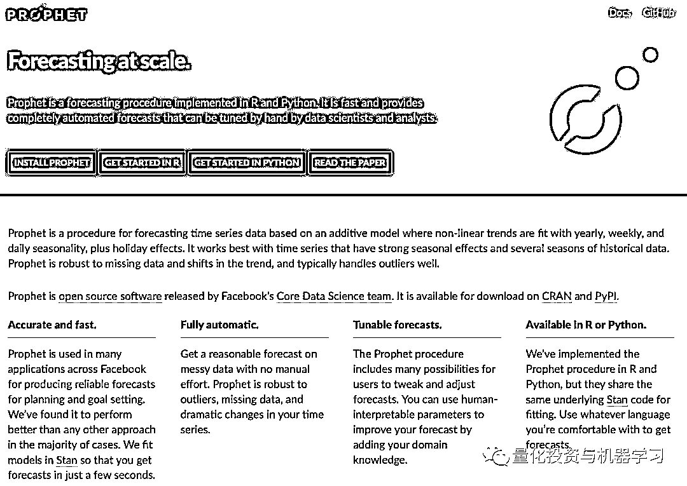

https://facebook.github.io/prophet/

**库的导入**

导入 Python 标准库。还将从 functools 中导入 Prophet 和 reduce。

```py
import pandas as pd
import numpy as np
from fbprophet import Prophet
import matplotlib.pyplot as plt
from functools import reduce

%matplotlib inline
import warnings
warnings.filterwarnings('ignore')

plt.style.use('seaborn-deep')
pd.options.display.float_format = "{:,.2f}".format
```

**数据获取**

使用的数据是 1980 年以来的标准普尔 500 指数历史数据。

```py
stock_price.describe()
```

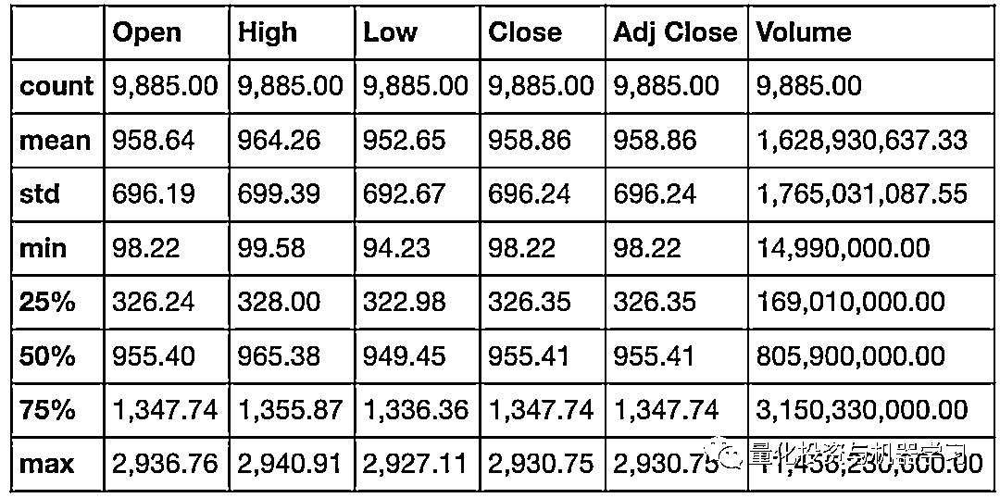

**数据准备**

要使 prophet 用起来，我们需要将日期和 Adj close 列的名称更改为 ds 和 y。 在大多数机器学习项目中，术语 y 通常用于目标列（要测试的内容）。

```py
stock_price = stock_price[['Date','Adj Close']]
stock_price.columns = ['ds', 'y']
stock_price.head(10)
```

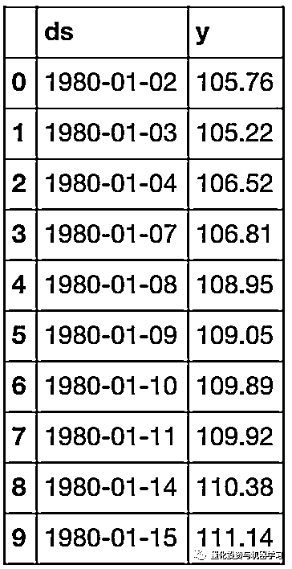

**Prophet**

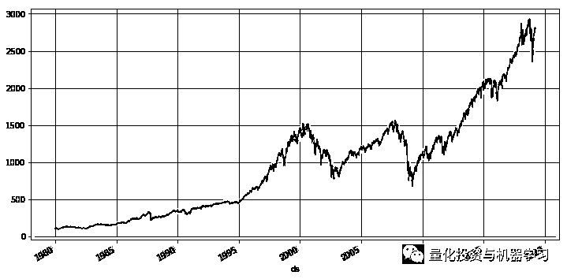

在使用 Prophet 创建预测之前，先将数据可视化。直观的来感受数据。

```py
model = Prophet()
model.fit(stock_price)
```

```py
<fbprophet.forecaster.Prophet at 0x21216301c18>
```

要激活 Prophet 模型，我们只需调用 Prophet()并将其分配给一个名为 Model 的变量。接下来，我们通过调用 fit 方法将股票数据匹配到模型中。

```py
future = model.make_future_dataframe(1095, freq='d')

future_boolean = future['ds'].map(lambda x : True if x.weekday() in range(0, 5) else False)
future = future[future_boolean] 

future.tail()
```

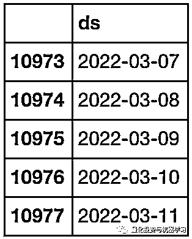

我们需要创建一些未来的日期。Prophet 为我们提供了一个名为 make_future_dataframe 的函数。传入未来周期和频率的数量。以上是我们对未来 1095 天或 3 年的预测。

由于股票只能在交易日操作，我们需要将预测数据从周末中删除。为此，我们创建一个布尔表达式，如果一天不等于 0-4，则返回 False。“0 =星期一，6=星期六，等等。”

然后我们将布尔表达式传递给 dataframe，它只返回 True 值。我们现在有一个包含未来 3 年交易日的预测数据。

```py
forecast = model.predict(future)
forecast.tail()
```

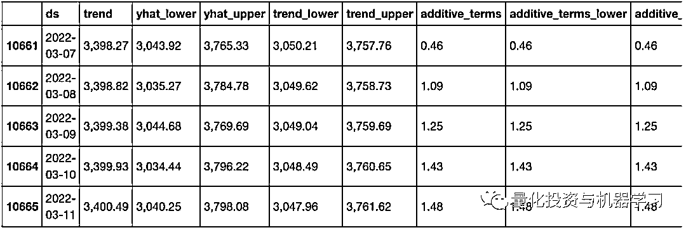

我们从模型中调用 predict 的预测，并在前面创建的 future 的 dataframe 中传递该预测。我们在一个名为 forecast 的新 dataframe 中返回结果。

当我们查看预测数据时，会看到一堆新术语。我们最感兴趣的是 yhat，它是我们的预测值。（yhat 是 y 的预测）

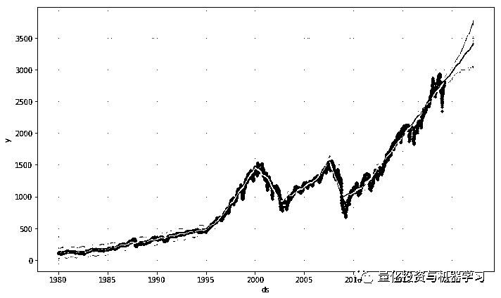

```py
model.plot_components(forecast);
```

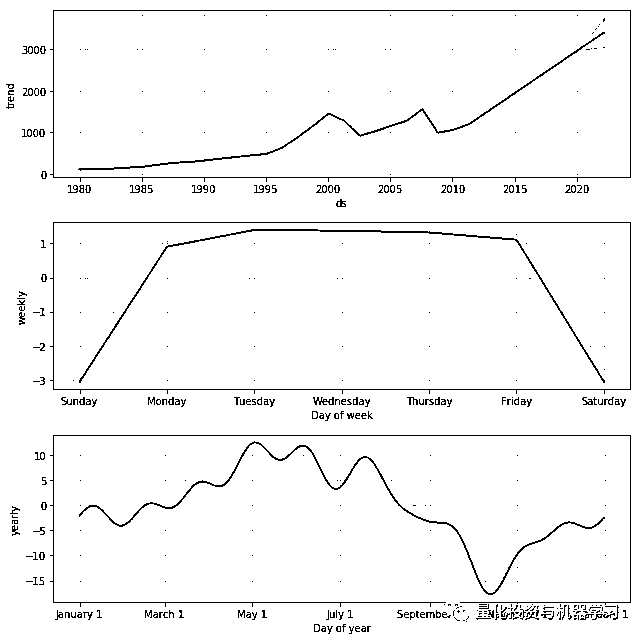

Prophet 提供了两个方便的可视化助手，plot 和 plot_components。plot 函数创建了实际/预测的图表，plot_components 提供了趋势/季节性的图表。

```py
stock_price_forecast = forecast[['ds', 'yhat', 'yhat_lower', 'yhat_upper']]
df = pd.merge(stock_price, stock_price_forecast, on='ds', how='right')
df.set_index('ds').plot(figsize=(16,8), color=['royalblue', "#34495e", "#e74c3c", "#e74c3c"], grid=True);
```

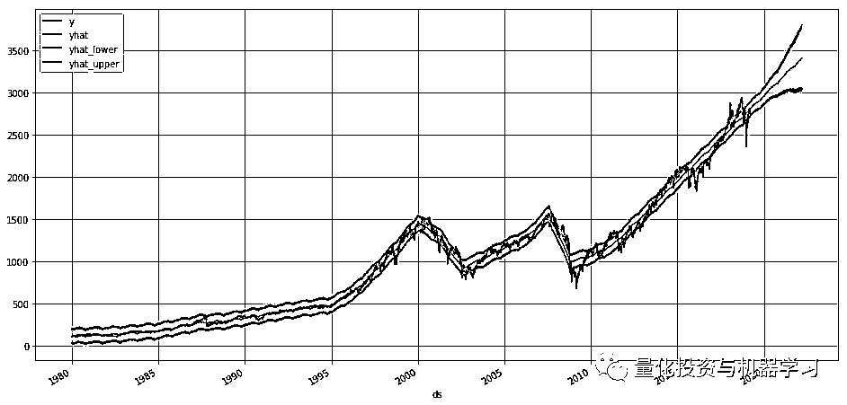

可视化助手只是使用我们的预测 dataframe 中的数据。我们可以重新创建相同的图表。

**模拟预测**

虽然我们在上面创建的 3 年预测非常酷，但我们不想在没有使用交易策略对业绩进行反向测试的情况下就对其做出任何交易决定。 

在本节中，我们将模拟 Prophet 在 1980 年就已经存在，并使用它来创建到 2019 年的月度预测。然后，我们将在下一节中使用这些数据来模拟各种交易策略对我们刚刚购买并持有该股票的效果。

```py
stock_price['dayname'] = stock_price['ds'].dt.day_name()
stock_price['month'] = stock_price['ds'].dt.month
stock_price['year'] = stock_price['ds'].dt.year
stock_price['month/year'] = stock_price['month'].map(str) + '/' + stock_price['year'].map(str) 

stock_price = pd.merge(stock_price, 
                       stock_price['month/year'].drop_duplicates().reset_index(drop=True).reset_index(),
                       on='month/year',
                       how='left')

stock_price = stock_price.rename(columns={'index':'month/year_index'})

stock_price.tail()
```

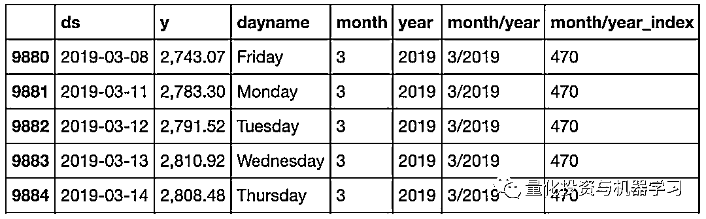

在模拟月度预测之前，我们需要向 stock_price dataframe 添加一些列，这是我们在这个项目开始时创建的，目的是使它更容易使用。添加 month、year、month/year 和 month/year_index。

```py
loop_list = stock_price['month/year'].unique().tolist()
max_num = len(loop_list) - 1
forecast_frames = []

for num, item in enumerate(loop_list):

        if  num == max_num:
                pass
        else:
                df = stock_price.set_index('ds')[
                     stock_price[stock_price['month/year'] == loop_list[0]]['ds'].min():\
                     stock_price[stock_price['month/year'] == item]['ds'].max()]

                df = df.reset_index()[['ds', 'y']]

                model = Prophet()
                model.fit(df)

                future = stock_price[stock_price['month/year_index'] == (num + 1)][['ds']]

                forecast = model.predict(future)
                forecast_frames.append(forecast)
```

```py
stock_price_forecast = reduce(lambda top, bottom: pd.concat([top, bottom], sort=False), forecast_frames)
stock_price_forecast = stock_price_forecast[['ds', 'yhat', 'yhat_lower', 'yhat_upper']]
stock_price_forecast.to_csv('stock_price_forecast.csv', index=False)
```

基本上我们在 stock_price 中循环每个月/年，并将预测模型与该时期可用的股票数据进行拟合，然后提前一个月预测。继续这样做，直到最后一个月/年。最后，将这些预测合并到一个名为 stock_price_forecast 的数据框中。将结果保存在 csv 文件中，这样如果需要重置数据，就不必再次运行模型。

```py
stock_price_forecast = pd.read_csv('stock_price_forecast.csv', parse_dates=['ds'])

df = pd.merge(stock_price[['ds','y', 'month/year_index']], stock_price_forecast, on='ds')
df['Percent Change'] = df['y'].pct_change()
df.set_index('ds')[['y', 'yhat', 'yhat_lower', 'yhat_upper']].plot(figsize=(16,8), color=['royalblue', "#34495e", "#e74c3c", "#e74c3c"], grid=True)
```

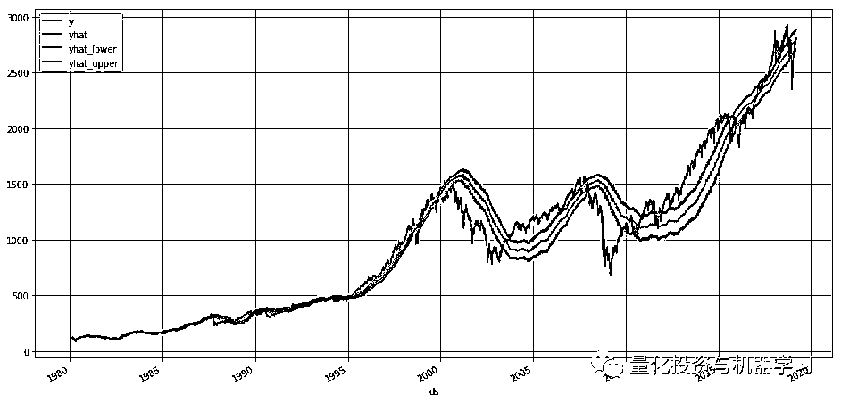

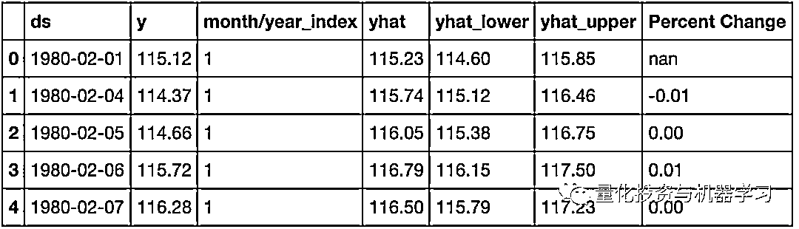

最后，我们将预测与实际价格结合起来，创建一个百分比变化列，将在下面的交易算法中使用。最后，将预测与实际情况作图，以查看它的表现如何。正如你所看到的，有一点延迟。它的行为很像移动平均线。

**交易算法**

创建了四个初始交易算法:

**Hold：**这是一种买入并持有的策略。也就是说，我们买股票并持有到最后一段时间。

**Prophet：**这种策略是当我们的预测显示下跌趋势时卖出，当我的预测显示上涨趋势时买进

**Prophet Thresh：**这个策略是只有当股票价格跌破我们的 yhat_lower 边界时才卖出。

**Seasonality：**这一策略是在 8 月退出市场，重新进入 Ocober。这是基于上面的季节性图表。

```py
(df.dropna().set_index('ds')[['Hold', 'Prophet', 'Prophet Thresh','Seasonality']] * 1000).plot(figsize=(16,8), grid=True)

print(f"Hold = {df['Hold'].iloc[-1]*1000:,.0f}")
print(f"Prophet = {df['Prophet'].iloc[-1]*1000:,.0f}")
print(f"Prophet Thresh = {df['Prophet Thresh'].iloc[-1]*1000:,.0f}")
print(f"Seasonality = {df['Seasonality'].iloc[-1]*1000:,.0f}")
```

Hold = 24,396

```py
Prophet = 13,366
Prophet Thresh = 17,087 Seasonality = 30,861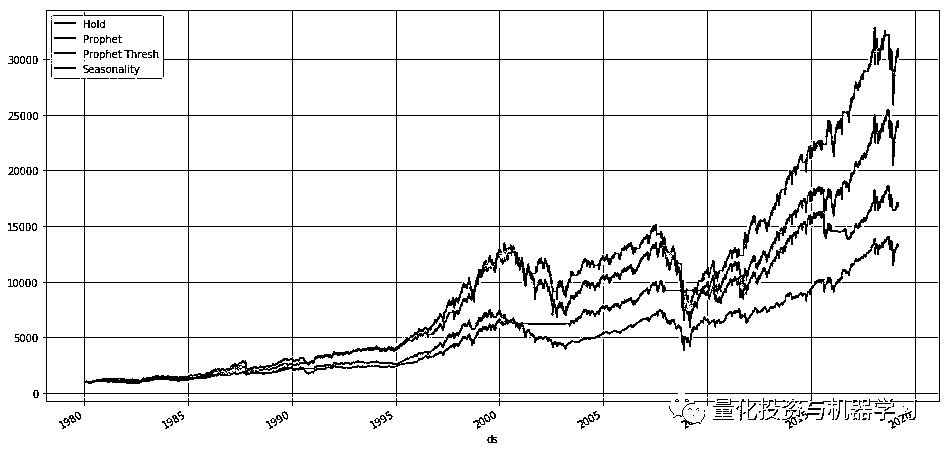我们绘制了初始资金为 1000 美元初始模拟策略结果。你可以看到季节性做得最好，持有策略其次。两种基于 Prophet 的策略都做得不太好。让我们看看是否可以通过优化阈值来改进 Prophet Thresh。

```
performance = {}

for x in np.linspace(.9,.99,10):
        y = ((df['y'] > df['yhat_lower']*x).shift(1)* (df['Percent Change']) + 1).cumprod()
        performance[x] = y

best_yhat = pd.DataFrame(performance).max().idxmax()
pd.DataFrame(performance).plot(figsize=(16,8), grid=True);
f'Best Yhat = {best_yhat:,.2f}'
```py

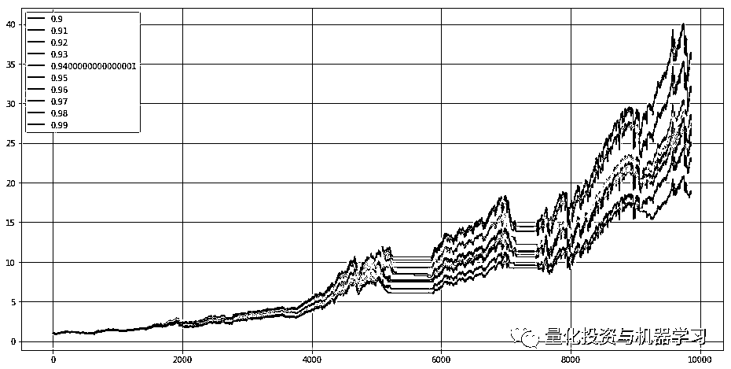上面我们循环遍历不同百分比的 thresh 以找到最优的 thresh。最佳阈值是当前 yhat_lower 值的 92%。

```
df['Optimized Prophet Thresh']  = ((df['y'] > df['yhat_lower'] * best_yhat).shift(1) * 
                                   (df['Percent Change']) + 1).cumprod()

(df.dropna().set_index('ds')[['Hold', 'Prophet', 'Prophet Thresh',
                              'Seasonality', 'Optimized Prophet Thresh']] * 1000).plot(figsize=(16,8), grid=True)

print(f"Hold = {df['Hold'].iloc[-1]*1000:,.0f}")
print(f"Prophet = {df['Prophet'].iloc[-1]*1000:,.0f}")
print(f"Prophet Thresh = {df['Prophet Thresh'].iloc[-1]*1000:,.0f}")
print(f"Seasonality = {df['Seasonality'].iloc[-1]*1000:,.0f}")
print(f"Optimized Prophet Thresh = {df['Optimized Prophet Thresh'].iloc[-1]*1000:,.0f}")
```py

Hold = 24,396Prophet = 13,366Prophet Thresh = 17,087Seasonality = 30,861
```

```py
Optimized Prophet Thresh = 36,375
```

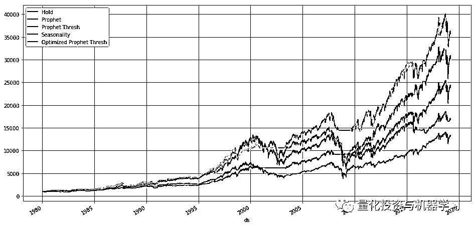

以上我们看到的是新的最佳交易策略。不幸的是，无论是优化的 ProphetThresh 都在有问题，**因为他们使用的数据有未来函数存在，而这些数据在我们交易的时候是不可用的**。我们将需要为我们预测的每个当前时间点创建一个优化的 Thresh。

```py
fcst_thresh = {}

for num, index in enumerate(df['month/year_index'].unique()):

        temp_df = df.set_index('ds')[
                 df[df['month/year_index'] == df['month/year_index'].unique()[0]]['ds'].min():\
                 df[df['month/year_index'] == index]['ds'].max()]

        performance = {}

        for thresh in np.linspace(0, .99, 100):
                percent =  ((temp_df['y'] > temp_df['yhat_lower'] * thresh).shift(1)* (temp_df['Percent Change']) + 1).cumprod()
                performance[thresh] = percent

        best_thresh = pd.DataFrame(performance).max().idxmax()

        if num == len(df['month/year_index'].unique())-1:
                pass
        else:
        fcst_thresh[df['month/year_index'].unique()[num+1]] = best_thresh
fcst_thresh = pd.DataFrame([fcst_thresh]).T.reset_index().rename(columns={'index':'month/year_index', 0:'Fcst Thresh'})
fcst_thresh['Fcst Thresh'].plot(figsize=(16,8), grid=True);
```

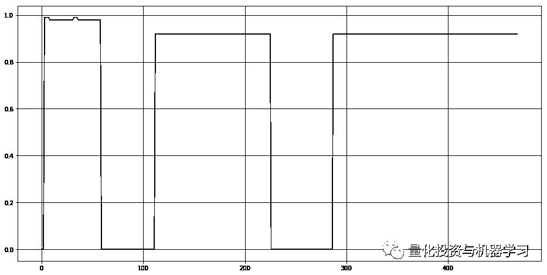

循环遍历数据，并为当前时间点找到到目前为止的最佳阈值百分比。正如你所看到的，随着时间的推移（1980 年 1 月 1 日- 2019 年 3 月 18 日），当前的 thresh 的百分比会跳跃。

```py
df['yhat_optimized'] = pd.merge(df, fcst_thresh, on='month/year_index', how='left')['Fcst Thresh'].shift(1) * df['yhat_lower']

df['Prophet Fcst Thresh']  = ((df['y'] > df['yhat_optimized']).shift(1)* (df['Percent Change']) + 1).cumprod()

(df.dropna().set_index('ds')[['Hold', 'Prophet', 'Prophet Thresh','Prophet Fcst Thresh']] * 1000).plot(figsize=(16,8), grid=True)

print(f"Hold = {df['Hold'].iloc[-1]*1000:,.0f}")
print(f"Prophet = {df['Prophet'].iloc[-1]*1000:,.0f}")
print(f"Prophet Thresh = {df['Prophet Thresh'].iloc[-1]*1000:,.0f}")
# print(f"Seasonality = {df['Seasonality'].iloc[-1]*1000:,.0f}")
print(f"Prophet Fcst Thresh = {df['Prophet Fcst Thresh'].iloc[-1]*1000:,.0f}")
Hold = 24,396
Prophet = 13,366
Prophet Thresh = 17,087
Prophet Fcst Thresh = 20,620
```

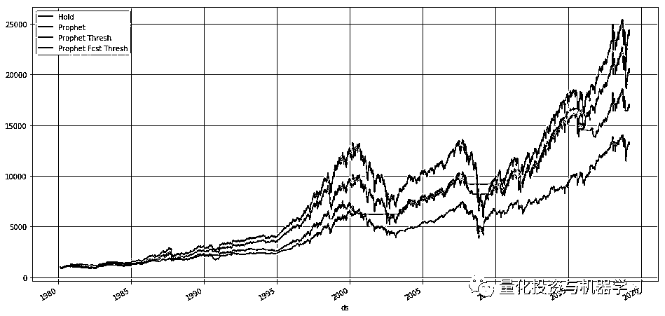

就像我们在创建新的交易策略并绘制图表所做的那样。不幸的是，结果变得更糟，但我们做得比我们最初的 ProphetThresh 更好。我们不使用到目前为止的整个周期来计算 thresh，而是像移动平均线（30、60、90 等等），尝试各种滚动窗口的时间。

```py
rolling_thresh = {}

for num, index in enumerate(df['month/year_index'].unique()):

        rolling_performance = {}

        for roll in range(10, 400, 10):

                temp_df = df.set_index('ds')[
                         df[df['month/year_index'] == index]['ds'].min() - pd.DateOffset(months=roll):\
                         df[df['month/year_index'] == index]['ds'].max()]

                performance = {}

                for thresh in np.linspace(.0,.99, 100):
                        percent =  ((temp_df['y'] > temp_df['yhat_lower'] * thresh).shift(1)* (temp_df['Percent Change']) + 1).cumprod()
                        performance[thresh] = percent

                per_df =  pd.DataFrame(performance)
                best_thresh = per_df.iloc[[-1]].max().idxmax()
                percents = per_df[best_thresh]

                rolling_performance[best_thresh] = percents

        per_df =  pd.DataFrame(rolling_performance)
        best_rolling_thresh = per_df.iloc[[-1]].max().idxmax()

        if num == len(df['month/year_index'].unique())-1:
                pass
        else:
                rolling_thresh[df['month/year_index'].unique()[num+1]] = best_rolling_thresh

rolling_thresh = pd.DataFrame([rolling_thresh]).T.reset_index().rename(columns={'index':'month/year_index', 0:'Fcst Thresh'})
rolling_thresh['Fcst Thresh'].plot(figsize=(16,8), grid=True);
```

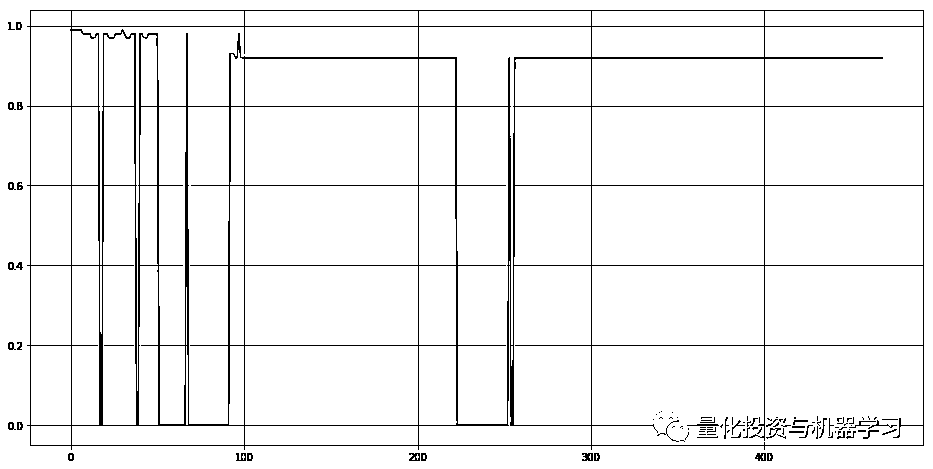

上面和以前很相似，但是现在我们尝试了不同的移动窗口和不同的阈值百分比。这变得相当复杂。从上面可以看到，随着时间的推移，阈值百分比随时间而变化。现在让我们看看我们是怎么做的。

```py
df['yhat_optimized'] = pd.merge(df, rolling_thresh, on='month/year_index', how='left')['Fcst Thresh'].fillna(1).shift(1) * df['yhat_lower']

df['Prophet Rolling Thresh']  = ((df['y'] > df['yhat_optimized']).shift(1)* (df['Percent Change']) + 1).cumprod()

(df.dropna().set_index('ds')[['Hold', 'Prophet', 'Prophet Thresh','Prophet Fcst Thresh', 'Prophet Rolling Thresh']] * 1000).plot(figsize=(16,8), grid=True)

print(f"Hold = {df['Hold'].iloc[-1]*1000:,.0f}")
print(f"Prophet = {df['Prophet'].iloc[-1]*1000:,.0f}")
print(f"Prophet Thresh = {df['Prophet Thresh'].iloc[-1]*1000:,.0f}")
# print(f"Seasonality = {df['Seasonality'].iloc[-1]*1000:,.0f}")
print(f"Prophet Fcst Thresh = {df['Prophet Fcst Thresh'].iloc[-1]*1000:,.0f}")
print(f"Prophet Rolling Thresh = {df['Prophet Rolling Thresh'].iloc[-1]*1000:,.0f}")

Hold = 24,396
Prophet = 13,366
Prophet Thresh = 17,087
Prophet Fcst Thresh = 20,620
Prophet Rolling Thresh = 23,621
```

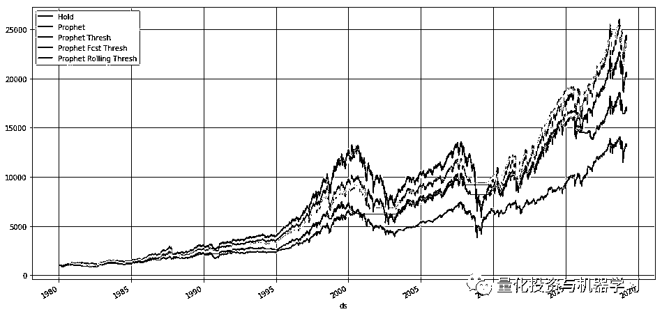

正如你所看到的，仍然没有击败最简单买入持有策略。也许***"Time in the Market is better then Timing the Market"***这句话有一定道理。

```py
df['Time Traveler'] = ((df['y'].shift(-1) > df['yhat']).shift(1) * (df['Percent Change']) + 1).cumprod()

(df.dropna().set_index('ds')[['Hold', 'Prophet', 'Prophet Thresh','Prophet Fcst Thresh', 'Prophet Rolling Thresh','Time Traveler']] * 1000).plot(figsize=(16,8), grid=True)

print(f"Hold = {df['Hold'].iloc[-1]*1000:,.0f}")
print(f"Prophet = {df['Prophet'].iloc[-1]*1000:,.0f}")
print(f"Prophet Thresh = {df['Prophet Thresh'].iloc[-1]*1000:,.0f}")
# print(f"Seasonality = {df['Seasonality'].iloc[-1]*1000:,.0f}")
print(f"Prophet Fcst Thresh = {df['Prophet Fcst Thresh'].iloc[-1]*1000:,.0f}")
print(f"Prophet Rolling Thresh = {df['Prophet Rolling Thresh'].iloc[-1]*1000:,.0f}")
print(f"Time Traveler = {df['Time Traveler'].iloc[-1]*1000:,.0f}")

Hold = 24,396
Prophet = 13,366
Prophet Thresh = 17,087
Prophet Fcst Thresh = 20,620
Prophet Rolling Thresh = 23,621
Time Traveler = 288,513
```

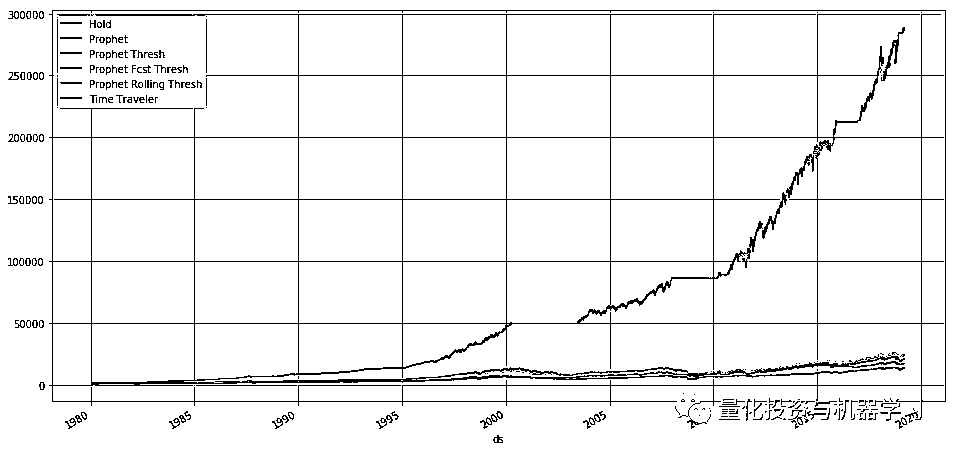

上面是 Time Traveler 策略。这当然是一个完美的交易策略，因为我们事先知道当市场上下波动。你最多能从 1000 美元中赚到 288,513 美元。

**总结**

时间序列预测是非常复杂的，但 Prophet 使它非常容易创建稳健的预测，只需很少的努力。虽然它并没有使我们对股票市场的预测变得丰富，但是它仍然非常有用，并且可以快速地来解决不同领域的许多问题。*原文：https://www.gardnmi.com/post/forecasting-stock-perfomance-with-prophet#Simulating-Forecasts*

**推荐阅读**

[01、经过多年交易之后你应该学到的东西（深度分享）](https://mp.weixin.qq.com/s?__biz=MzAxNTc0Mjg0Mg==&mid=2653289074&idx=1&sn=e859d363eef9249236244466a1af41b6&chksm=802e3867b759b1717f77e07a51ee5671e8115130c66562577280ba1243cba08218add04f1f00&token=449379994&lang=zh_CN&scene=21#wechat_redirect)

[02、监督学习标签在股市中的应用（代码+书籍）](https://mp.weixin.qq.com/s?__biz=MzAxNTc0Mjg0Mg==&mid=2653289050&idx=1&sn=60043a5c95b877dd329a5fd150ddacc4&chksm=802e384fb759b1598e500087374772059aa21b31ae104b3dca04331cf4b63a233c5e04c1945a&token=449379994&lang=zh_CN&scene=21#wechat_redirect)

[03、全球投行顶尖机器学习团队全面分析](https://mp.weixin.qq.com/s?__biz=MzAxNTc0Mjg0Mg==&mid=2653289018&idx=1&sn=8c411f676c2c0d92b0dd218f041bee4b&chksm=802e382fb759b139ffebf633ac14cdd0f21938e4613fe632d5d9231dab3d2aca95a11628378a&token=449379994&lang=zh_CN&scene=21#wechat_redirect)

[04、使用 Tensorflow 预测股票市场变动](https://mp.weixin.qq.com/s?__biz=MzAxNTc0Mjg0Mg==&mid=2653289014&idx=1&sn=3762d405e332c599a21b48a7dc4df587&chksm=802e3823b759b135928d55044c2729aea9690f86752b680eb973d1a376dc53cfa18287d0060b&token=449379994&lang=zh_CN&scene=21#wechat_redirect)

[05、使用 LSTM 预测股票市场基于 Tensorflow](https://mp.weixin.qq.com/s?__biz=MzAxNTc0Mjg0Mg==&mid=2653289238&idx=1&sn=3144f5792f84455dd53c27a78e8a316c&chksm=802e3903b759b015da88acde4fcbc8547ab3e6acbb5a0897404bbefe1d8a414265d5d5766ee4&token=2020206794&lang=zh_CN&scene=21#wechat_redirect)

[06、美丽的回测——教你定量计算过拟合概率](https://mp.weixin.qq.com/s?__biz=MzAxNTc0Mjg0Mg==&mid=2653289314&idx=1&sn=87c5a12b23a875966db7be50d11f09cd&chksm=802e3977b759b061675d1988168c1fec06c602e8583fbcc9b76f87008e0c10b702acc85467a0&token=1972390229&lang=zh_CN&scene=21#wechat_redirect)

[07、利用动态深度学习预测金融时间序列基于 Python](https://mp.weixin.qq.com/s?__biz=MzAxNTc0Mjg0Mg==&mid=2653289347&idx=1&sn=bf5d7899bc4a854d4ba9046fdc6fe0d6&chksm=802e3996b759b080287213840987bb0a0c02e4e1d4d7aae23f10a225a92ef6dd922d8006123d&token=290397496&lang=zh_CN&scene=21#wechat_redirect)

[08、Facebook 开源神器 Prophet 预测时间序列基于 Python](https://mp.weixin.qq.com/s?__biz=MzAxNTc0Mjg0Mg==&mid=2653289394&idx=1&sn=24a836136d730aa268605628e683d629&chksm=802e39a7b759b0b1dcf7aaa560699130a907716b71fc9c45ff0e5d236c5ae8ef80ebdb09dbb6&token=290397496&lang=zh_CN&scene=21#wechat_redirect)

[09、Facebook 开源神器 Prophet 预测股市行情基于 Python](https://mp.weixin.qq.com/s?__biz=MzAxNTc0Mjg0Mg==&mid=2653289437&idx=1&sn=f0dca7da8e69e7ba736992cb3d034ce7&chksm=802e39c8b759b0de5bce401c580623d0729ecca69d13926479d36e19aff8c9c9e8a20265afff&token=290397496&lang=zh_CN&scene=21#wechat_redirect)

[10、2018 第三季度最受欢迎的券商金工研报前 50（附下载）](https://mp.weixin.qq.com/s?__biz=MzAxNTc0Mjg0Mg==&mid=2653289358&idx=1&sn=db6e8ab85b08f6e67790ec0e401e586e&chksm=802e399bb759b08d6eec855f9901ea856d0da68c7425cba62791b8948da6ad761a3d88543dad&token=290397496&lang=zh_CN&scene=21#wechat_redirect)

[11、实战交易策略的精髓（公众号深度呈现）](https://mp.weixin.qq.com/s?__biz=MzAxNTc0Mjg0Mg==&mid=2653289447&idx=1&sn=f2948715bf82569a6556d518e56c1f9e&chksm=802e39f2b759b0e4502d1aaac562b87789573b55c76b3c85897d8c9d88dbf9a0b7ee34d86a4e&token=290397496&lang=zh_CN&scene=21#wechat_redirect)

[12、Markowitz 有效边界和投资组合优化基于 Python](https://mp.weixin.qq.com/s?__biz=MzAxNTc0Mjg0Mg==&mid=2653289478&idx=1&sn=f8e01a641be021993d8ef2d84e94a299&chksm=802e3e13b759b7055cf27a280c672371008a5564c97c658eee89ce8481396a28d254836ff9af&token=290397496&lang=zh_CN&scene=21#wechat_redirect)

[13、使用 LSTM 模型预测股价基于 Keras](https://mp.weixin.qq.com/s?__biz=MzAxNTc0Mjg0Mg==&mid=2653289495&idx=1&sn=c4eeaa2e9f9c10995be9ea0c56d29ba7&chksm=802e3e02b759b7148227675c23c403fb9a543b733e3d27fa237b53840e030bf387a473d83e3c&token=1260956004&lang=zh_CN&scene=21#wechat_redirect)

[14、量化金融导论 1：资产收益的程式化介绍基于 Python](https://mp.weixin.qq.com/s?__biz=MzAxNTc0Mjg0Mg==&mid=2653289507&idx=1&sn=f0ca71aa07531bbbdbd33213f0bab89f&chksm=802e3e36b759b720138b3b17a4dd0e198e054b9de29a038fdd50805f824effa55831111ad026&token=1936245282&lang=zh_CN&scene=21#wechat_redirect)

[15、预测股市崩盘基于统计机器学习与神经网络（Python+文档）](https://mp.weixin.qq.com/s?__biz=MzAxNTc0Mjg0Mg==&mid=2653289533&idx=1&sn=4ef964834e84a9995111bb057b0fc5dd&chksm=802e3e28b759b73e0618eb1262c53aa0601fbf5805525a7c7ff40dc3db62c7704496611bdbf1&token=1950551577&lang=zh_CN&scene=21#wechat_redirect)

[16、实现最优投资组合有效前沿基于 Python（附代码）](https://mp.weixin.qq.com/s?__biz=MzAxNTc0Mjg0Mg==&mid=2653289609&idx=1&sn=c7f0b3e47025862d10bb53b6ab88bcda&chksm=802e3e9cb759b78abf6b8b049c59bf18ccfb2ead7580d1f557d36de2292f59dcbd94dcd41910&token=2085008037&lang=zh_CN&scene=21#wechat_redirect)

[17、精心为大家整理了一些超级棒的机器学习资料（附链接）](https://mp.weixin.qq.com/s?__biz=MzAxNTc0Mjg0Mg==&mid=2653289615&idx=1&sn=1cdc89afb997d0c580bf0cef296d946c&chksm=802e3e9ab759b78ce9f0cd152a680d4a413d6c8dcb02a7a296f4091993a7e4137e7520394575&token=2085008037&lang=zh_CN&scene=21#wechat_redirect)

[18、海量 Wind 数据，与全网用户零距离邂逅！](https://mp.weixin.qq.com/s?__biz=MzAxNTc0Mjg0Mg==&mid=2653289623&idx=1&sn=28a3600fd7a72d7be00b066ca0f98244&chksm=802e3e82b759b7943f43a4f6ef4a91e4153fa6b8210de9590235fa8ee66eb9811ce177054dbc&token=1389401983&lang=zh_CN&scene=21#wechat_redirect)

[19、机器学习、深度学习、量化金融、Python 等最新书籍汇总下载](https://mp.weixin.qq.com/s?__biz=MzAxNTc0Mjg0Mg==&mid=2653289640&idx=1&sn=34e94fcbe99052b8e7381ecc48a36dc0&chksm=802e3ebdb759b7ab897cd329a680715b6f8294e63550ddf0c57b9e1320b2b7d1408c6fdca0c7&token=1389401983&lang=zh_CN&scene=21#wechat_redirect)

[20、各大卖方 2019 年 A 股策略报告，都是有故事的人！](https://mp.weixin.qq.com/s?__biz=MzAxNTc0Mjg0Mg==&mid=2653289725&idx=1&sn=4b65cd1fb8331438e4c0b3d0eae6b51f&chksm=802e3ee8b759b7fe1b94e84d54cc23b0ab05853d5cd227812574b350e9fc2cce9e5f1bc6cb7a&token=1389401983&lang=zh_CN&scene=21#wechat_redirect)

*—End—*

量化投资与机器学习微信公众号，是业内垂直于**Quant**、**MFE**、**CST**等专业的主流自媒体。公众号拥有来自**公募、私募、券商、银行、海外**等众多圈内**10W+**关注者。每日发布行业前沿研究成果和最新资讯。

