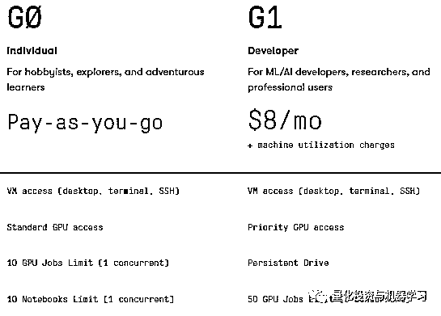
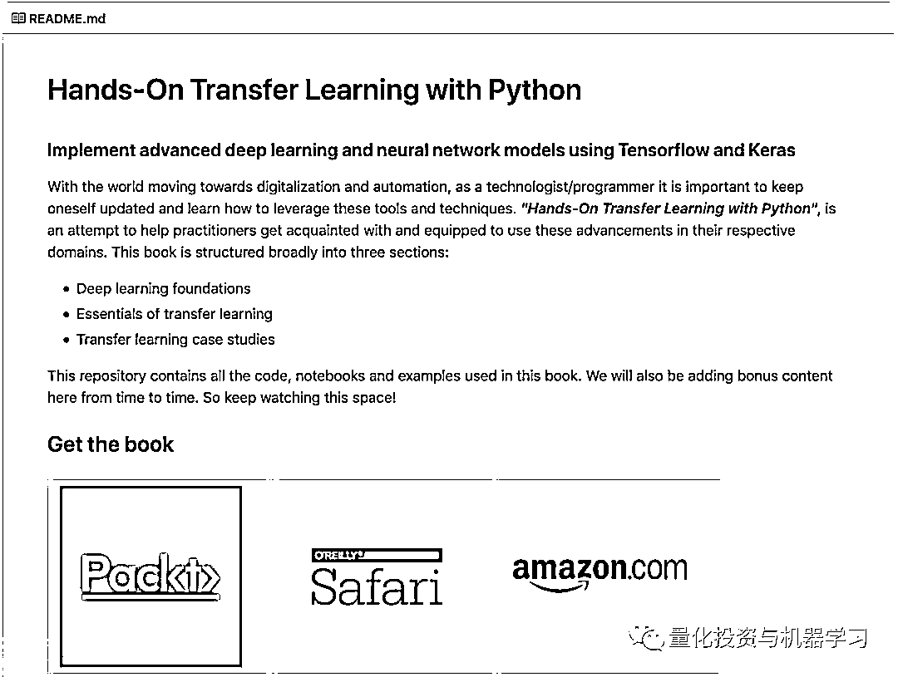
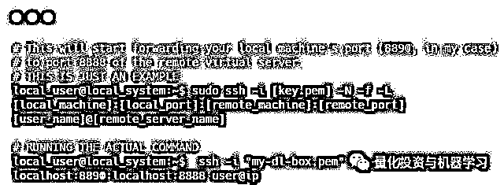

# 必须收藏 | 手把手教你几分钟内搭建自己强大的深度学习环境

> 原文：[`mp.weixin.qq.com/s?__biz=MzAxNTc0Mjg0Mg==&mid=2653291352&idx=1&sn=7ed561d3b6a3fdbf7ce10fa7f77b681e&chksm=802dc14db75a485b7a975ccb320a047ae1bec648832851529d85beca3f29b6e10c3107b1ddae&scene=27#wechat_redirect`](http://mp.weixin.qq.com/s?__biz=MzAxNTc0Mjg0Mg==&mid=2653291352&idx=1&sn=7ed561d3b6a3fdbf7ce10fa7f77b681e&chksm=802dc14db75a485b7a975ccb320a047ae1bec648832851529d85beca3f29b6e10c3107b1ddae&scene=27#wechat_redirect)

**标星★公众号     **♥你们

▎作者：Dipanjan Sarkar

**▎**编译：**Remedios** | 公众号翻译部

**近期原创文章：**

## ♥ [基于无监督学习的期权定价异常检测（代码+数据）](https://mp.weixin.qq.com/s?__biz=MzAxNTc0Mjg0Mg==&mid=2653290562&idx=1&sn=dee61b832e1aa2c062a96bb27621c29d&chksm=802dc257b75a4b41b5623ade23a7de86333bfd3b4299fb69922558b0cbafe4c930b5ef503d89&token=1298662931&lang=zh_CN&scene=21#wechat_redirect)

## ♥ [5 种机器学习算法在预测股价的应用（代码+数据）](https://mp.weixin.qq.com/s?__biz=MzAxNTc0Mjg0Mg==&mid=2653290588&idx=1&sn=1d0409ad212ea8627e5d5cedf61953ac&chksm=802dc249b75a4b5fa245433320a4cc9da1a2cceb22df6fb1a28e5b94ff038319ae4e7ec6941f&token=1298662931&lang=zh_CN&scene=21#wechat_redirect)

## ♥ [深入研读：利用 Twitter 情绪去预测股市](https://mp.weixin.qq.com/s?__biz=MzAxNTc0Mjg0Mg==&mid=2653290402&idx=1&sn=efda9ea106991f4f7ccabcae9d809e00&chksm=802e3db7b759b4a173dc8f2ab5c298ab3146bfd7dd5aca75929c74ecc999a53b195c16f19c71&token=1330520237&lang=zh_CN&scene=21#wechat_redirect)

## ♥ [Two Sigma 用新闻来预测股价走势，带你吊打 Kaggle](https://mp.weixin.qq.com/s?__biz=MzAxNTc0Mjg0Mg==&mid=2653290456&idx=1&sn=b8d2d8febc599742e43ea48e3c249323&chksm=802e3dcdb759b4db9279c689202101b6b154fb118a1c1be12b52e522e1a1d7944858dbd6637e&token=1330520237&lang=zh_CN&scene=21#wechat_redirect)

## ♥ [利用深度学习最新前沿预测股价走势](https://mp.weixin.qq.com/s?__biz=MzAxNTc0Mjg0Mg==&mid=2653290080&idx=1&sn=06c50cefe78a7b24c64c4fdb9739c7f3&chksm=802e3c75b759b563c01495d16a638a56ac7305fc324ee4917fd76c648f670b7f7276826bdaa8&token=770078636&lang=zh_CN&scene=21#wechat_redirect)

## ♥ [一位数据科学 PhD 眼中的算法交易](https://mp.weixin.qq.com/s?__biz=MzAxNTc0Mjg0Mg==&mid=2653290118&idx=1&sn=a261307470cf2f3e458ab4e7dc309179&chksm=802e3c93b759b585e079d3a797f512dfd0427ac02942339f4f1454bd368ba47be21cb52cf969&token=770078636&lang=zh_CN&scene=21#wechat_redirect)

## ♥ [基于 RNN 和 LSTM 的股市预测方法](https://mp.weixin.qq.com/s?__biz=MzAxNTc0Mjg0Mg==&mid=2653290481&idx=1&sn=f7360ea8554cc4f86fcc71315176b093&chksm=802e3de4b759b4f2235a0aeabb6e76b3e101ff09b9a2aa6fa67e6e824fc4274f68f4ae51af95&token=1865137106&lang=zh_CN&scene=21#wechat_redirect)

## ♥ [人工智能『AI』应用算法交易，7 个必踩的坑！](https://mp.weixin.qq.com/s?__biz=MzAxNTc0Mjg0Mg==&mid=2653289974&idx=1&sn=88f87cb64999d9406d7c618350aac35d&chksm=802e3fe3b759b6f5eca6e777364270cbaa0bf35e9a1535255be9751c3a77642676993a861132&token=770078636&lang=zh_CN&scene=21#wechat_redirect)

## ♥ [神经网络在算法交易上的应用系列（一）](https://mp.weixin.qq.com/s?__biz=MzAxNTc0Mjg0Mg==&mid=2653289962&idx=1&sn=5f5aa65ec00ce176501c85c7c106187d&chksm=802e3fffb759b6e9f2d4518f9d3755a68329c8753745333ef9d70ffd04bd088fd7b076318358&token=770078636&lang=zh_CN&scene=21#wechat_redirect)

## ♥ [预测股市 | 如何避免 p-Hacking，为什么你要看涨？](https://mp.weixin.qq.com/s?__biz=MzAxNTc0Mjg0Mg==&mid=2653289820&idx=1&sn=d3fee74ba1daab837433e4ef6b0ab4d9&chksm=802e3f49b759b65f422d20515942d5813aead73231da7d78e9f235bdb42386cf656079e69b8b&token=770078636&lang=zh_CN&scene=21#wechat_redirect)

## ♥ [如何鉴别那些用深度学习预测股价的花哨模型？](https://mp.weixin.qq.com/s?__biz=MzAxNTc0Mjg0Mg==&mid=2653290132&idx=1&sn=cbf1e2a4526e6e9305a6110c17063f46&chksm=802e3c81b759b597d3dd94b8008e150c90087567904a29c0c4b58d7be220a9ece2008956d5db&token=1266110554&lang=zh_CN&scene=21#wechat_redirect)

## ♥ [优化强化学习 Q-learning 算法进行股市](https://mp.weixin.qq.com/s?__biz=MzAxNTc0Mjg0Mg==&mid=2653290286&idx=1&sn=882d39a18018733b93c8c8eac385b515&chksm=802e3d3bb759b42d1fc849f96bf02ae87edf2eab01b0beecd9340112c7fb06b95cb2246d2429&token=1330520237&lang=zh_CN&scene=21#wechat_redirect)

**清明节安康**

**介绍**

在此，向大数据致谢。不过，这里真正的 MVP 是更快更好的计算，这也使 1980、90 年代的论文具有更加重要的意义（LSTM 诞生于 1997）！

▍*https://www.bioinf.jku.at/publications/older/2604.pdf*

因为有了更好更快的 CPU 和 GPU，我们最终可以利用神经网络和深度学习。不管我们是否喜欢，传统统计和机器学习模型在高维、非结构化和更复杂更大体积的数据上有很大的限制性。

深度学习在这些领域开始表现出众，并且我们已经渐渐开始看到行业在一些大规模的现实问题中开始接受它们。吴恩达自己几年前也开始提到这些可喜的事实。

**深度学习好的方面是**，我们有更好的计算，更多的数据和广泛边界的开源框架供我们在建立解决方案时使用，如 keras，tensorflow 和 pytorch。

**深度学习的缺点是什么？**从头建立你自己的深度学习环境可能是一项非常艰巨的任务，特别是你迫切需要开始写代码实现你的深度学习模型时。

多次经历了这个痛苦的过程并发现简单的使用服务的方式之后，**我们写了这个指南旨在让你轻松快速地考虑建立你个人深度学习环境的各个必要方面，以便你能够更快更好地建立深度学习环境并解决问题**。在这份指南中，我们将提到以下几个方面的内容：

**1、最小配置基于云的深度学习环境**

**2、建立你自己的基于云的深度学习环境**

**3、自有设置的建议**

让我们立刻开始吧！

**最小配置基于云的深度学习环境**

**如果你真的想要不在专用的硬件上做任何投资就建立深度学习环境，或者你想要跳过所有那些麻烦的配置和设置命令，**这里有一些专为你准备的选项！使用一个预先配置好的基于云的深度学习环境是最佳选择。这里有几个基于云的深度学习服务提供商。下面的选择使你能够使用最少的配置和设置立刻开始工作。这是我们一个很好的综合列表，**其中的项目都是我们亲自用过或从同伴的深度学习从业者那里听说过的。**

*   Google Colaboratory

*   *https://colab.research.google.com/*

*   Paperspace Gradient

*   *https://www.paperspace.com/gradient*

*   FloydHub Workspace

*   *https://www.floydhub.com/product/build*

*   Lambda GPU Cloud

*   *https://lambdalabs.com/service/gpu-cloud*

*   AWS Deep Learning AMIs

*   *https://aws.amazon.com/cn/machine-learning/amis/*

*   GCP Deep Learning VM Images

*   *https://cloud.google.com/deep-learning-vm*

我们会介绍这些提供商的概要以便你了解得足够清楚来以它们开始。除此之外，我们鼓励你走出去进一步探索它们并基于你的喜好选择其中之一。

**Google Colaboratory**

**可能是最好的之一并且仍然是谷歌的免费产品**，使你能够在一个依靠 GPU 甚至是 TPU 的深度学习环境中运行可交互的 Jupyter notebook。谷歌一直积极地在使用和促进这个产品在很多方面的用途，包括他们广受欢迎的机器学习速成班（Machine Learning Crash Course）。总而言之，Colarboratory 是一个免费的 Jupyter notebook 环境不需要任何社会中并且使你能够运行你自己的机器学习模型甚至无需任何花费就能使用一个 GPU。

默认情况下你就得到了一个依靠 CPU 建立的下载了所有库的深度学习环境，你可以用以下代码来验证这些事实：

现在，使用一个 CPU 对于相对简单、工作量和数据更少的的模型已经足够了，你肯定需要对更复杂的问题使用 GPU。正如在下面的截图中展示的，改变 Google Colab 的运行时间来使用一个 GPU 仅仅会多花几秒钟。

Google Colab 然后分配出一个新的 GPU 使你的深度学习环境配置完成，你可以通过下列代码看 GPU 类型。

**似乎你免费得到了一个含 12GB 记忆的 Tesla K80 GPU ！那是 AWS p2.xlarge  以 0.9 刀每小时的价格供给你的。**最终你可以使用以下代码来确认你的深度学习库正在使用 GPU。

这应该使你能够在 Google Colab 上尝试运行你自己的深度学习模型。轻松利用 my colab notebook 来测试依靠于 CPU 和 GPU 的深度学习环境吧！

**Paperspace Gradient**°****

Gradient°是由致力于机器学习和数据科学的轻松基础设施的公司 Paperspace 的产品。**它给开发者一套完整的工具来探索数据，训练深度学习模型并且在 GPU 上运行计算工作。Gradient°完全依靠 Paperspace GPU 云的一键 Jupyter notebook。**我们从油桶上下载了这个视频，更进一步详细地进行了介绍。

[`mp.weixin.qq.com/mp/readtemplate?t=pages/video_player_tmpl&action=mpvideo&auto=0&vid=wxv_750882685312270336`](https://mp.weixin.qq.com/mp/readtemplate?t=pages/video_player_tmpl&action=mpvideo&auto=0&vid=wxv_750882685312270336)

下面是他们的一些基础情况：

*https://www.paperspace.com/pricing*

你需要花钱购买 GPU 但是这个价格相较于其他服务提供商（例如 Quadro P4000 每小时花 0.5 美元，Tesla K80 每小时花 0.59 美元）还是非常有竞争力的，**相较于 AWS 上有相似功能要便宜很多。**

**FloydHub Workspace**

FloydHub 的一个有趣的产品是 FloydHub Workspace，**目标是通过提供一个完全配置好的开发环境减少你自己建立云端深度学习环境的麻烦**。最好的部分？尽管这不是免费的，**你仅仅花一秒钟的钱就可以从一个 CPU 终端无缝切入到一个 GPU 终端。**

他们的价格也非常好，**你可以花最便宜的价格（12 刀）得到一个有 12GB 空间的 Tesla K80, 61GB 的 RAM 和 200GB 10 小时的 SSD 的专用实例。**

**Lambda GPU Cloud**

Lambda Labs 或者说 Lambda 是一个为人类的进步提供计算服务的 AI 产业公司。他们专攻于深度学习工作站并且最近已经启动了 Lambda GPU Cloud，不过目前还在封闭测试阶段。**每个 Lambda GPU Cloud 实例有 4 个 GPU 并且比 AWS 的 p2.8xlarge 实例快两倍。他们说你简单地按下一个按钮，就可以直接 SSH 远程进入一个 4 GPU 的实例。价格是 0.9 刀每个 GPU 每小时。**

**AWS Deep Learning AMIs**

Amazon Web 服务（AWS）是亚马逊的一个子业务，提供基于付费订阅的按命令运行的云计算平台。最近，他们已经启动了为建立深度学习模型专用 GPU 加强工作量的 Amazon Machine Images（AMIs）项目， Deep Learning AMIs。 **AWS Deep Learning AMIs 为我们提供必需的设备，预先设置好的工具和框架以大规模地加速云端深度学习。它预先配置了所有最新和最好的深度学习框架。**

你可以得到特别为深度学习建立的虚拟环境 Conda AMI 或者是基础 AMI 配上配置和定制建立。

**因为你根据小时付费，请谨慎选择你自己的 AWS 实例。最便宜的选择应该是 p2.xlarge 以每小时 0.9 刀的价格向你提供一个 12GB 的 GPU。**

**GCP Deep Learning VM Images**

**GCP 是谷歌云平台提供给我们的一套用于运行深度学习模型和空间的云计算服务**。它最大的**优点**是在**与谷歌内部为它的终端用户所提供的相同的基础设施上运行。GCP 也提供给你第一年价值 300 刀的免费积分。**

Google Cloud Deep Learning VM Images 使开发者能够在一个 Google Compute Engine 实例上运行一个包括受欢迎的深度学习和机器学习框架的 VM 图像。你可以使用有名的机器学习框架比如 TensorFlow, PyTorch 或 Scikit-learn 启动 Compute Engine 实例。优点在于，你仅仅需要一次点击就能增加云 TPU 和 CPU 支持。**它的价格也非常有竞争性，并且比 AWS 便宜。GCP VMs 给你仅花费每小时 0.45 刀使用一个 12GB 的 Tesla K80 GPU 的权限。**

**▍*****https://cloud.google.com/compute/pricing#gpus***

**相信这些选项应该给你了一个很好的概念来开启你的深度学习之旅。**

****建立你自己的云端深度学习环境****

**当准备好了你自己的云端配置，有时候你就想要建立你自己个性化的云端或者预置深度学习环境。在这个章节，我们会介绍如何在云端利用广为使用的云平台建立一个强大的深度学习环境。主要步骤如下：** 

*   ****选择一个云提供商****

*   ****创建你的虚拟服务器****

*   ****配置你的虚拟服务器****

*   ****设置你的深度学习环境****

*   ****使用你的深度学习环境****

*   ****验证 GPU 可用性****

**让我们来仔细看看建立深度学习环境的过程。**

****选择一个云提供商****

**现在市面上有许多价格比较便宜并且具有竞争性的云提供商。我们已经在上一部分看到了他们中的一部分。我们正在寻找具有“平台即服务”能力产品，这些产品要使我们能够在平台上管理数据应用和基础的配置，同时为深度学习使用 GPU 计算。下图展示了一些深度学习从业者常用的云提供商，包括亚马逊的 AWS，微软的 Azure 和谷歌的 GCP。** 

****

**支持深度学习的云提供商** 

****创建你的虚拟服务器****

**选择你的云服务器提供商之后的下一步是创建你的 VM 实例，这个实例基本上包括一个作为代码主机的服务器，数据和配置设置。建立一个 VM 的下一步取决于你选择了什么云服务器。** 

**下面的教程将为你提供一个深入的指南，帮助你在 AWS 和 GCP 中创建和设置自己的实例。**

****▍*****使用 AWS 深度学习 AMI 创建和设置云实例*****

****▍***https://aws.amazon.com/cn/blogs/machine-learning/get-started-with-deep-learning-using-the-aws-deep-learning-ami/***

******▍***使用 GCP Marketplace 创建和设置云实例*****

****▍***https://cloud.google.com/deep-learning-vm/docs/quickstart-marketplace#before-you-begin***

**在这本书《Hands-on Transfer Learning with Python》第二章中，介绍了一步一步地在 AWS 上创建和实例化自己的 VM 的指南。整个代码库都是开源的，可以在 GitHub 上查看：**

****▍**https://github.com/dipanjanS/hands-on-transfer-learning-with-python**

 ****

****配置你的虚拟服务器****

**实例创建之后，你就可以从云提供商的平台启动这个实例了，特别是当你是从 AWS 或者是从 GCP 实例页面启动的 EC2 用户时。**通常你需要一个私人密匙来登录你的服务器，从本地终端使用 SSH。通常情况下 AWS 会让你在创建你的 VM 的最后一步时设置内自己的密匙，并且给你一个可下载的私人密匙。GCP 允许你直接使用 SSH 从 GCP 实例页面登陆你的系统。然后，如果需要你可以在系统上创建你自己的 SSH 密匙。**** 

**记得在一个安全位置保存你的私人 SSH 密匙，并从终端使用下列指令登陆你的服务器。**

****

**祝贺！你现在已经成功地登陆了你的深度学习服务器。下面的深度学习设置细节仅当你使用的是 Linux 服务器时才需要被执行。我们的 Linux 版本是**Ubuntu 18.10.**你可以根据你的喜好自由选择你自己的操作系统。** 

**我们将广泛地在试验和研究中使用 Jupyter notebook,它也经常被用于给 notebook 服务器建立一个密码，这样未知访问者就不能通过公共 IP 地址访问该服务器了。如果你不想设置密码，你可以跳过密码设置的步骤。这里的第一步是创建一个新的由 Open SSL 认证的 SSL。**

****

**如果系统中没有下载 python，我们推荐使用 Anaconda 搭建 Python 环境。** 

**下一步是为我们的 Jupyter notebook 服务器生成一个认证文件，以防它没有呈现。通常情况下这个文件会在你的主文件夹，在***~/.jupyter/jupyter_notebook_config.py *****

**。如果它没有被呈现，你可以用以下命令创造它。**

****

**为了保证 notebook 的密码安全性，我们首先要生成一个密码和它的哈希。我们可以利用以下代码：**

****

**一旦你键入密码并认证，函数会返回给你一个哈希，这个哈希就是你密码的哈希。复制并保存返回的哈希值因为我们很快又要用到，接下来，启动你最爱的文本编辑器来编辑 Jupyter 认证文件，如下：** 

****

**我们现在做好了设置我们的深度学习环境的准备。** 

****设置你的深度学习环境****

**我们现在开始设置使用 GPU 的深度学习环境的必须配置。如果你的实例中已经有了 CUDA 和 cuDNN，你可以跳过以下所需步骤：**

****▍1、下载图片驱动器****

**这里的第一步是为了保证你的图片驱动器已经为你的 GPU 下载好了。接下去我们假设你正在使用一个 NVIDIA GPU。最好的方法来测试驱动器是否下载好了的就是在终端中运行 nvidia-smi 命令。现在如果下面的命令运行失败，我们就需要下载这个 GPU 驱动器。**

****

****▍2、下载 CUDA**** 

**NVIDIA® CUDA® 工具箱是一个用于创建应用和程序的可以最大化使用 NVIDIA GPU 的开发环境。有 GPU 加速的 CUDA 库使许多领域有所发展，包括线性代数，图像和视频处理，深度学习和图像分析等。假设我们正在使用一个基于 Ubuntu 的系统，你可以到官方的 NVIDIA CUDA 页面并且下载这个必要的配置文件：**

****▍*****https://developer.nvidia.com/cuda-downloads?target_os=Linux&target_arch=x86_64&target_distro=Ubuntu*****

********

****在写这篇文章的时候，CUDA10 已经发布了但还是非常新，因此我们将使用旧版的 CUDA9.0，你可以从旧版的发布页面获取：****

******▍***https://developer.nvidia.com/cuda-toolkit-archive*****

****如果你已经有了一个服务器，那你最好使用终端下载配置文件使用以下命令认证 CUDA。****

******▍3、下载 cuDNN******

******NVIDIA CUDA® 深度神经网络库是一个 GPU 加速的深度神经网络基元的库**。**cuDNN 库提供神经网络标准路径高度调谐的实现，包括前向和后向卷积，池化，正则化和激活层。**深度学习从业者可以依赖于 cuDNN 使用深度学习框架广泛在 GPU 上广泛加速。你可以从官方页面下载 cuDNN，但是你需要注册一个 NVIDIA 账号：****

******▍***https://developer.nvidia.com/cudnn*****

********

****你将得到一个 cuDNN 的下载链接，之后在终端时从服务器时直接下载时会用到。通常情况下，这很大程度上依赖于 GPU 的设置。****

******▍4、下载深度学习框架******

****现在，我们需要下载并配置我们的 Python 深度学习框架。我们使用大量的 keras 和 tensorflow 和下列指令来帮助我们下载到我们的环境中。****

********

******使用你的深度学习环境******

****我们并不是一直要在服务器的终端商编写代码。因为我们想要将 Jupyter Notebooks 用于交互性研究，我们将在从本地操作系统在云端服务器上进入 Notebook。为了达到这个目的，我们首先需要从远程实例启动我们的 Jupyter Notebook。****

********

****现在如果你有一个公共的 IP 只想你的实例并且端口**8888**是暴露的，你可以直接键入**http://<IP_Address>:8888 **然后从本地浏览器进入你的 Jupyter 服务器。****

****另一个选项，特别对于 AWS 实例来说，是要允许本地实例中的虚拟主机从本地机器上的浏览器进入我们的云端服务器 notebook，也就是要建立 SSH 隧道。****

********

****我们从虚拟服务器进入远程 notebook 服务器，注意检查浏览器的地址中有**https**，否则会出现 SSL 错误。**** 

******验证 GPU 可用性******

****最后的步骤是确认一切都在正常运作中，并且我们的深度学习框架正在利用我们的（付费使用的）GPU，下面的代码将帮助我们验证这个事实。**** 

********

****我们的深度学习设置已经基本完成啦！****

******自有设置的建议******

****通常使用者或机构可能不想要利用云端服务器，特别是当他们的数据敏感是，他们致力于建立私有的深度学习环境。这里的主要关注点应当是投资在正确的硬件和软件上，以最大化地利用正确的 GPU 以建立深度学习模型。对于硬件有以下几点需要强调的：**** 

******处理器：**你可以购买 i5 或者 i7 的英特尔 CPU，或者是奢侈一点买一个 Intel Xeon。****

******RAM：**为内存考虑投资至少 32GB 的 DDR4\DDR5 或更好的 RAM。****

******硬盘：**选择一个 1TB 的硬盘是很棒的，为了快速获取数据你也可以购买至少 128GB 或者 256GB 的 SSD。****

******GPU：**GPU 也许是深度学习需要的最重要的配件。买一个 NVIDIA GPU，或者至少是比 8GB 的 GTX1070 更好的。****

****其他你不能忽略的东西包括一个母版，能源提供，坚固的盒子和冷却器。一旦你配置好了你的装备，对于软件配置，你可以重复前面几节的出去云环境配置外的所有步骤，然后开始你的深度学习研究。****

******总结******

****这个手把手指南的目标是让开发者，工程师和深度学习从业者从零开始快速建立自己的深度学习环境**。我希望这个指南帮助你建立你自己的深度学习环境并不要把时间浪费在从论坛和 Stack Overflow 数不清的帖子里找答案上。******

******现在，开始你的深度学习吧！******

******推荐阅读******

****[01、经过多年交易之后你应该学到的东西（深度分享）](https://mp.weixin.qq.com/s?__biz=MzAxNTc0Mjg0Mg==&mid=2653289074&idx=1&sn=e859d363eef9249236244466a1af41b6&chksm=802e3867b759b1717f77e07a51ee5671e8115130c66562577280ba1243cba08218add04f1f00&token=449379994&lang=zh_CN&scene=21#wechat_redirect)**** 

****[02、监督学习标签在股市中的应用（代码+书籍）](https://mp.weixin.qq.com/s?__biz=MzAxNTc0Mjg0Mg==&mid=2653289050&idx=1&sn=60043a5c95b877dd329a5fd150ddacc4&chksm=802e384fb759b1598e500087374772059aa21b31ae104b3dca04331cf4b63a233c5e04c1945a&token=449379994&lang=zh_CN&scene=21#wechat_redirect)****

****[03、全球投行顶尖机器学习团队全面分析](https://mp.weixin.qq.com/s?__biz=MzAxNTc0Mjg0Mg==&mid=2653289018&idx=1&sn=8c411f676c2c0d92b0dd218f041bee4b&chksm=802e382fb759b139ffebf633ac14cdd0f21938e4613fe632d5d9231dab3d2aca95a11628378a&token=449379994&lang=zh_CN&scene=21#wechat_redirect)**** 

****[04、使用 Tensorflow 预测股票市场变动](https://mp.weixin.qq.com/s?__biz=MzAxNTc0Mjg0Mg==&mid=2653289014&idx=1&sn=3762d405e332c599a21b48a7dc4df587&chksm=802e3823b759b135928d55044c2729aea9690f86752b680eb973d1a376dc53cfa18287d0060b&token=449379994&lang=zh_CN&scene=21#wechat_redirect)****

****[05、使用 LSTM 预测股票市场基于 Tensorflow](https://mp.weixin.qq.com/s?__biz=MzAxNTc0Mjg0Mg==&mid=2653289238&idx=1&sn=3144f5792f84455dd53c27a78e8a316c&chksm=802e3903b759b015da88acde4fcbc8547ab3e6acbb5a0897404bbefe1d8a414265d5d5766ee4&token=2020206794&lang=zh_CN&scene=21#wechat_redirect)****

****[06、美丽的回测——教你定量计算过拟合概率](https://mp.weixin.qq.com/s?__biz=MzAxNTc0Mjg0Mg==&mid=2653289314&idx=1&sn=87c5a12b23a875966db7be50d11f09cd&chksm=802e3977b759b061675d1988168c1fec06c602e8583fbcc9b76f87008e0c10b702acc85467a0&token=1972390229&lang=zh_CN&scene=21#wechat_redirect)****

****[07、利用动态深度学习预测金融时间序列基于 Python](https://mp.weixin.qq.com/s?__biz=MzAxNTc0Mjg0Mg==&mid=2653289347&idx=1&sn=bf5d7899bc4a854d4ba9046fdc6fe0d6&chksm=802e3996b759b080287213840987bb0a0c02e4e1d4d7aae23f10a225a92ef6dd922d8006123d&token=290397496&lang=zh_CN&scene=21#wechat_redirect)****

****[08、Facebook 开源神器 Prophet 预测时间序列基于 Python](https://mp.weixin.qq.com/s?__biz=MzAxNTc0Mjg0Mg==&mid=2653289394&idx=1&sn=24a836136d730aa268605628e683d629&chksm=802e39a7b759b0b1dcf7aaa560699130a907716b71fc9c45ff0e5d236c5ae8ef80ebdb09dbb6&token=290397496&lang=zh_CN&scene=21#wechat_redirect)****

****[09、Facebook 开源神器 Prophet 预测股市行情基于 Python](https://mp.weixin.qq.com/s?__biz=MzAxNTc0Mjg0Mg==&mid=2653289437&idx=1&sn=f0dca7da8e69e7ba736992cb3d034ce7&chksm=802e39c8b759b0de5bce401c580623d0729ecca69d13926479d36e19aff8c9c9e8a20265afff&token=290397496&lang=zh_CN&scene=21#wechat_redirect)****

****[10、2018 第三季度最受欢迎的券商金工研报前 50（附下载）](https://mp.weixin.qq.com/s?__biz=MzAxNTc0Mjg0Mg==&mid=2653289358&idx=1&sn=db6e8ab85b08f6e67790ec0e401e586e&chksm=802e399bb759b08d6eec855f9901ea856d0da68c7425cba62791b8948da6ad761a3d88543dad&token=290397496&lang=zh_CN&scene=21#wechat_redirect)**** 

****[11、实战交易策略的精髓（公众号深度呈现）](https://mp.weixin.qq.com/s?__biz=MzAxNTc0Mjg0Mg==&mid=2653289447&idx=1&sn=f2948715bf82569a6556d518e56c1f9e&chksm=802e39f2b759b0e4502d1aaac562b87789573b55c76b3c85897d8c9d88dbf9a0b7ee34d86a4e&token=290397496&lang=zh_CN&scene=21#wechat_redirect)****

****[12、Markowitz 有效边界和投资组合优化基于 Python](https://mp.weixin.qq.com/s?__biz=MzAxNTc0Mjg0Mg==&mid=2653289478&idx=1&sn=f8e01a641be021993d8ef2d84e94a299&chksm=802e3e13b759b7055cf27a280c672371008a5564c97c658eee89ce8481396a28d254836ff9af&token=290397496&lang=zh_CN&scene=21#wechat_redirect)****

****[13、使用 LSTM 模型预测股价基于 Keras](https://mp.weixin.qq.com/s?__biz=MzAxNTc0Mjg0Mg==&mid=2653289495&idx=1&sn=c4eeaa2e9f9c10995be9ea0c56d29ba7&chksm=802e3e02b759b7148227675c23c403fb9a543b733e3d27fa237b53840e030bf387a473d83e3c&token=1260956004&lang=zh_CN&scene=21#wechat_redirect)****

****[14、量化金融导论 1：资产收益的程式化介绍基于 Python](https://mp.weixin.qq.com/s?__biz=MzAxNTc0Mjg0Mg==&mid=2653289507&idx=1&sn=f0ca71aa07531bbbdbd33213f0bab89f&chksm=802e3e36b759b720138b3b17a4dd0e198e054b9de29a038fdd50805f824effa55831111ad026&token=1936245282&lang=zh_CN&scene=21#wechat_redirect)****

****[15、预测股市崩盘基于统计机器学习与神经网络（Python+文档）](https://mp.weixin.qq.com/s?__biz=MzAxNTc0Mjg0Mg==&mid=2653289533&idx=1&sn=4ef964834e84a9995111bb057b0fc5dd&chksm=802e3e28b759b73e0618eb1262c53aa0601fbf5805525a7c7ff40dc3db62c7704496611bdbf1&token=1950551577&lang=zh_CN&scene=21#wechat_redirect)****

****[16、实现最优投资组合有效前沿基于 Python（附代码）](https://mp.weixin.qq.com/s?__biz=MzAxNTc0Mjg0Mg==&mid=2653289609&idx=1&sn=c7f0b3e47025862d10bb53b6ab88bcda&chksm=802e3e9cb759b78abf6b8b049c59bf18ccfb2ead7580d1f557d36de2292f59dcbd94dcd41910&token=2085008037&lang=zh_CN&scene=21#wechat_redirect)****

****[17、精心为大家整理了一些超级棒的机器学习资料（附链接）](https://mp.weixin.qq.com/s?__biz=MzAxNTc0Mjg0Mg==&mid=2653289615&idx=1&sn=1cdc89afb997d0c580bf0cef296d946c&chksm=802e3e9ab759b78ce9f0cd152a680d4a413d6c8dcb02a7a296f4091993a7e4137e7520394575&token=2085008037&lang=zh_CN&scene=21#wechat_redirect)****

****[18、海量 Wind 数据，与全网用户零距离邂逅！](https://mp.weixin.qq.com/s?__biz=MzAxNTc0Mjg0Mg==&mid=2653289623&idx=1&sn=28a3600fd7a72d7be00b066ca0f98244&chksm=802e3e82b759b7943f43a4f6ef4a91e4153fa6b8210de9590235fa8ee66eb9811ce177054dbc&token=1389401983&lang=zh_CN&scene=21#wechat_redirect)****

****[19、机器学习、深度学习、量化金融、Python 等最新书籍汇总下载](https://mp.weixin.qq.com/s?__biz=MzAxNTc0Mjg0Mg==&mid=2653289640&idx=1&sn=34e94fcbe99052b8e7381ecc48a36dc0&chksm=802e3ebdb759b7ab897cd329a680715b6f8294e63550ddf0c57b9e1320b2b7d1408c6fdca0c7&token=1389401983&lang=zh_CN&scene=21#wechat_redirect)****

****[20、各大卖方 2019 年 A 股策略报告，都是有故事的人！](https://mp.weixin.qq.com/s?__biz=MzAxNTc0Mjg0Mg==&mid=2653289725&idx=1&sn=4b65cd1fb8331438e4c0b3d0eae6b51f&chksm=802e3ee8b759b7fe1b94e84d54cc23b0ab05853d5cd227812574b350e9fc2cce9e5f1bc6cb7a&token=1389401983&lang=zh_CN&scene=21#wechat_redirect)****

*****—End—*****

****量化投资与机器学习微信公众号，是业内垂直于**Quant**、**MFE**、**CST**等专业的主流自媒体。公众号拥有来自**公募、私募、券商、银行、海外**等众多圈内**10W+**关注者。每日发布行业前沿研究成果和最新资讯。****

********