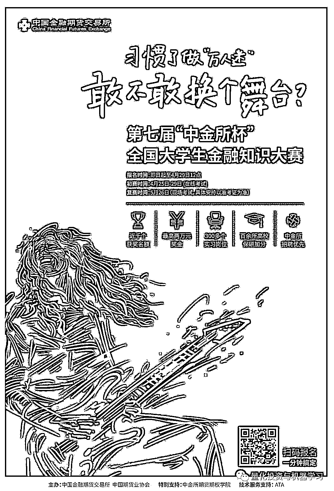
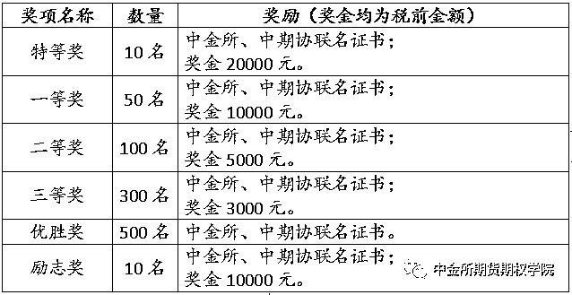
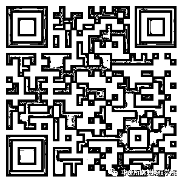

# 百万奖金，等你来拿！第七届“中金所杯”全国大学生金融知识大赛开始啦！

> 原文：[`mp.weixin.qq.com/s?__biz=MzAxNTc0Mjg0Mg==&mid=2653291281&idx=1&sn=4cdf773b0a70f8b81429e371e27339a4&chksm=802dc104b75a48126703ddad7ba8453df4e11480fe04391e2437f61103a5f3852d1584ff1049&scene=27#wechat_redirect`](http://mp.weixin.qq.com/s?__biz=MzAxNTc0Mjg0Mg==&mid=2653291281&idx=1&sn=4cdf773b0a70f8b81429e371e27339a4&chksm=802dc104b75a48126703ddad7ba8453df4e11480fe04391e2437f61103a5f3852d1584ff1049&scene=27#wechat_redirect)

**标星★公众号     **♥你们

**近期原创文章：**

## ♥ [基于无监督学习的期权定价异常检测（代码+数据）](https://mp.weixin.qq.com/s?__biz=MzAxNTc0Mjg0Mg==&mid=2653290562&idx=1&sn=dee61b832e1aa2c062a96bb27621c29d&chksm=802dc257b75a4b41b5623ade23a7de86333bfd3b4299fb69922558b0cbafe4c930b5ef503d89&token=1298662931&lang=zh_CN&scene=21#wechat_redirect)

## ♥ [5 种机器学习算法在预测股价的应用（代码+数据）](https://mp.weixin.qq.com/s?__biz=MzAxNTc0Mjg0Mg==&mid=2653290588&idx=1&sn=1d0409ad212ea8627e5d5cedf61953ac&chksm=802dc249b75a4b5fa245433320a4cc9da1a2cceb22df6fb1a28e5b94ff038319ae4e7ec6941f&token=1298662931&lang=zh_CN&scene=21#wechat_redirect)

## ♥ [深入研读：利用 Twitter 情绪去预测股市](https://mp.weixin.qq.com/s?__biz=MzAxNTc0Mjg0Mg==&mid=2653290402&idx=1&sn=efda9ea106991f4f7ccabcae9d809e00&chksm=802e3db7b759b4a173dc8f2ab5c298ab3146bfd7dd5aca75929c74ecc999a53b195c16f19c71&token=1330520237&lang=zh_CN&scene=21#wechat_redirect)

## ♥ [Two Sigma 用新闻来预测股价走势，带你吊打 Kaggle](https://mp.weixin.qq.com/s?__biz=MzAxNTc0Mjg0Mg==&mid=2653290456&idx=1&sn=b8d2d8febc599742e43ea48e3c249323&chksm=802e3dcdb759b4db9279c689202101b6b154fb118a1c1be12b52e522e1a1d7944858dbd6637e&token=1330520237&lang=zh_CN&scene=21#wechat_redirect)

## ♥ [利用深度学习最新前沿预测股价走势](https://mp.weixin.qq.com/s?__biz=MzAxNTc0Mjg0Mg==&mid=2653290080&idx=1&sn=06c50cefe78a7b24c64c4fdb9739c7f3&chksm=802e3c75b759b563c01495d16a638a56ac7305fc324ee4917fd76c648f670b7f7276826bdaa8&token=770078636&lang=zh_CN&scene=21#wechat_redirect)

## ♥ [一位数据科学 PhD 眼中的算法交易](https://mp.weixin.qq.com/s?__biz=MzAxNTc0Mjg0Mg==&mid=2653290118&idx=1&sn=a261307470cf2f3e458ab4e7dc309179&chksm=802e3c93b759b585e079d3a797f512dfd0427ac02942339f4f1454bd368ba47be21cb52cf969&token=770078636&lang=zh_CN&scene=21#wechat_redirect)

## ♥ [基于 RNN 和 LSTM 的股市预测方法](https://mp.weixin.qq.com/s?__biz=MzAxNTc0Mjg0Mg==&mid=2653290481&idx=1&sn=f7360ea8554cc4f86fcc71315176b093&chksm=802e3de4b759b4f2235a0aeabb6e76b3e101ff09b9a2aa6fa67e6e824fc4274f68f4ae51af95&token=1865137106&lang=zh_CN&scene=21#wechat_redirect)

## ♥ [人工智能『AI』应用算法交易，7 个必踩的坑！](https://mp.weixin.qq.com/s?__biz=MzAxNTc0Mjg0Mg==&mid=2653289974&idx=1&sn=88f87cb64999d9406d7c618350aac35d&chksm=802e3fe3b759b6f5eca6e777364270cbaa0bf35e9a1535255be9751c3a77642676993a861132&token=770078636&lang=zh_CN&scene=21#wechat_redirect)

## ♥ [神经网络在算法交易上的应用系列（一）](https://mp.weixin.qq.com/s?__biz=MzAxNTc0Mjg0Mg==&mid=2653289962&idx=1&sn=5f5aa65ec00ce176501c85c7c106187d&chksm=802e3fffb759b6e9f2d4518f9d3755a68329c8753745333ef9d70ffd04bd088fd7b076318358&token=770078636&lang=zh_CN&scene=21#wechat_redirect)

## ♥ [预测股市 | 如何避免 p-Hacking，为什么你要看涨？](https://mp.weixin.qq.com/s?__biz=MzAxNTc0Mjg0Mg==&mid=2653289820&idx=1&sn=d3fee74ba1daab837433e4ef6b0ab4d9&chksm=802e3f49b759b65f422d20515942d5813aead73231da7d78e9f235bdb42386cf656079e69b8b&token=770078636&lang=zh_CN&scene=21#wechat_redirect)

## ♥ [如何鉴别那些用深度学习预测股价的花哨模型？](https://mp.weixin.qq.com/s?__biz=MzAxNTc0Mjg0Mg==&mid=2653290132&idx=1&sn=cbf1e2a4526e6e9305a6110c17063f46&chksm=802e3c81b759b597d3dd94b8008e150c90087567904a29c0c4b58d7be220a9ece2008956d5db&token=1266110554&lang=zh_CN&scene=21#wechat_redirect)

## ♥ [优化强化学习 Q-learning 算法进行股市](https://mp.weixin.qq.com/s?__biz=MzAxNTc0Mjg0Mg==&mid=2653290286&idx=1&sn=882d39a18018733b93c8c8eac385b515&chksm=802e3d3bb759b42d1fc849f96bf02ae87edf2eab01b0beecd9340112c7fb06b95cb2246d2429&token=1330520237&lang=zh_CN&scene=21#wechat_redirect)

▎**中金所期货期权学院官方授权发布**

让同学们等待许久的第七届“中金所杯”全国大学生金融知识大赛，正式启动啦！快搬好小板凳，来看看如何报名参加吧！

**主办单位**

中国金融期货交易所、中国期货业协会

**参赛对象**

中国内地及港澳台、北美、欧洲等地区高等院校全日制在校学生，包括专科、本科以及研究生（硕士/博士）。

在职人员、曾获特等奖或累计两次获奖者（不含优胜奖、励志奖）不在参赛对象之列。

**参赛方式**

参赛者需以个人名义报名参赛，大赛不接受团队报名。

**注册报名**

**考生应先注册账号，再凭注册账号登录系统完成正式报名。**

注册报名时间：**2019 年 3 月 21 日——4 月 29 日 12 点**

考生可选择以下两种途径完成注册报名：

1\. 扫码注册报名：考生可通过大赛海报、H5、“中金所期货期权学院”微信公众号扫码注册报名。

2\. 网站注册报名：考生可登录大赛官网——中金所期货期权学院网站 www.e-cffex.com.cn 注册报名。

考生注册报名时请填写完整、真实、有效的个人信息。大赛期间，考生可通过“中金所期货期权学院”微信公众号或大赛官网实时了解大赛动态。

**特别提醒：为能有效联系考生，境外考生在填写考生信息时，邮箱建议使用新浪、搜狐、网易邮箱。**

**参考题库：**参赛者可在“中金所期货期权学院”微信公众号或大赛官网查阅考试大纲和参考题库。

**大赛流程**

**初赛（网上考试）：2019 年 4 月 25 日-29 日**

参赛者自备电脑，登录大赛官网参与网上在线答题，答题时间为 50 分钟。

**复赛（现场考试）：2019 年 5 月 26 日**（具体时间及考点见准考证）

复赛采取现场机考方式，考试时间为 100 分钟。主办方将根据复赛入围人数在主要城市、大学城、高校设置考点，安排入围参赛者就近参赛。参赛期间的食宿、交通等由参赛者自理。

**奖项设置**

**获奖学生奖励**

**1\. 奖金及证书**

**2\. 实习及招聘**

*   **中金所暑期实习及夏令营（30 个）**

*   全部特等奖及部分其他奖项获奖者。夏令营活动将组织参访证券、期货交易所，证券、基金等金融机构以及各类博物馆，近距离接触金融市场。

*   **中期协暑期实习岗位（5-10 个）**

*   面向所有获奖者。

*   **金融机构实习岗位（300 个）**

*   面向所有获奖者，由获奖学生与金融机构双向选择。金融机构类别包括期货、证券、基金、银行、保险、私募等。

*   **实习及招聘推荐**

*   所有获奖者应聘中金所时，同等条件下优先录用。

**励志奖申请说明**

**1\. 申请对象：**取得复赛成绩、且经家庭所在地政府开具贫困证明的贫困学生。曾获得过本奖项的，不得再次申请。

**2\. 申请时间：**主办方发布复赛成绩并公布获奖候选人名单后即可申请。具体时间及申请方式请关注大赛公告。

**3\. 评奖依据：**根据合格申请者的复赛成绩、励志材料（国家级、省部级、学校级奖励证书）综合评定获奖名单，可以不满额。

**参赛咨询**

在参赛过程中，如有问题，可查阅“中金所期货期权学院”微信公众号、大赛官网或致电 021-61948892 进行咨询。

**立即报名**

长按或扫描以下二维码，立即注册报名！

中国金融期货交易所   中国期货业协会

*—End—*

量化投资与机器学习微信公众号，是业内垂直于**Quant**、**MFE**、**CST**等专业的**主流自媒体**。公众号拥有来自**公募、私募、券商、银行、海外**等众多圈内**10W+**关注者。每日发布行业前沿研究成果和最新资讯。