# Fama-French，让我们重新认识你！

> 原文：[`mp.weixin.qq.com/s?__biz=MzAxNTc0Mjg0Mg==&mid=2653291269&idx=1&sn=db7ca00342cd024c124d11690cce6473&chksm=802dc110b75a480658ae5d33545dc28dc9836019ce39e4d3ab8cac10c6df13fc15fb7f44eefb&scene=27#wechat_redirect`](http://mp.weixin.qq.com/s?__biz=MzAxNTc0Mjg0Mg==&mid=2653291269&idx=1&sn=db7ca00342cd024c124d11690cce6473&chksm=802dc110b75a480658ae5d33545dc28dc9836019ce39e4d3ab8cac10c6df13fc15fb7f44eefb&scene=27#wechat_redirect)

**标星★公众号     **♥你们

▎作者：McMillan

**▎**编译：**Archan Jin** | 公众号翻译部

**近期原创文章：**

## ♥ [基于无监督学习的期权定价异常检测（代码+数据）](https://mp.weixin.qq.com/s?__biz=MzAxNTc0Mjg0Mg==&mid=2653290562&idx=1&sn=dee61b832e1aa2c062a96bb27621c29d&chksm=802dc257b75a4b41b5623ade23a7de86333bfd3b4299fb69922558b0cbafe4c930b5ef503d89&token=1298662931&lang=zh_CN&scene=21#wechat_redirect)

## ♥ [5 种机器学习算法在预测股价的应用（代码+数据）](https://mp.weixin.qq.com/s?__biz=MzAxNTc0Mjg0Mg==&mid=2653290588&idx=1&sn=1d0409ad212ea8627e5d5cedf61953ac&chksm=802dc249b75a4b5fa245433320a4cc9da1a2cceb22df6fb1a28e5b94ff038319ae4e7ec6941f&token=1298662931&lang=zh_CN&scene=21#wechat_redirect)

## ♥ [深入研读：利用 Twitter 情绪去预测股市](https://mp.weixin.qq.com/s?__biz=MzAxNTc0Mjg0Mg==&mid=2653290402&idx=1&sn=efda9ea106991f4f7ccabcae9d809e00&chksm=802e3db7b759b4a173dc8f2ab5c298ab3146bfd7dd5aca75929c74ecc999a53b195c16f19c71&token=1330520237&lang=zh_CN&scene=21#wechat_redirect)

## ♥ [Two Sigma 用新闻来预测股价走势，带你吊打 Kaggle](https://mp.weixin.qq.com/s?__biz=MzAxNTc0Mjg0Mg==&mid=2653290456&idx=1&sn=b8d2d8febc599742e43ea48e3c249323&chksm=802e3dcdb759b4db9279c689202101b6b154fb118a1c1be12b52e522e1a1d7944858dbd6637e&token=1330520237&lang=zh_CN&scene=21#wechat_redirect)

## ♥ [利用深度学习最新前沿预测股价走势](https://mp.weixin.qq.com/s?__biz=MzAxNTc0Mjg0Mg==&mid=2653290080&idx=1&sn=06c50cefe78a7b24c64c4fdb9739c7f3&chksm=802e3c75b759b563c01495d16a638a56ac7305fc324ee4917fd76c648f670b7f7276826bdaa8&token=770078636&lang=zh_CN&scene=21#wechat_redirect)

## ♥ [一位数据科学 PhD 眼中的算法交易](https://mp.weixin.qq.com/s?__biz=MzAxNTc0Mjg0Mg==&mid=2653290118&idx=1&sn=a261307470cf2f3e458ab4e7dc309179&chksm=802e3c93b759b585e079d3a797f512dfd0427ac02942339f4f1454bd368ba47be21cb52cf969&token=770078636&lang=zh_CN&scene=21#wechat_redirect)

## ♥ [基于 RNN 和 LSTM 的股市预测方法](https://mp.weixin.qq.com/s?__biz=MzAxNTc0Mjg0Mg==&mid=2653290481&idx=1&sn=f7360ea8554cc4f86fcc71315176b093&chksm=802e3de4b759b4f2235a0aeabb6e76b3e101ff09b9a2aa6fa67e6e824fc4274f68f4ae51af95&token=1865137106&lang=zh_CN&scene=21#wechat_redirect)

## ♥ [人工智能『AI』应用算法交易，7 个必踩的坑！](https://mp.weixin.qq.com/s?__biz=MzAxNTc0Mjg0Mg==&mid=2653289974&idx=1&sn=88f87cb64999d9406d7c618350aac35d&chksm=802e3fe3b759b6f5eca6e777364270cbaa0bf35e9a1535255be9751c3a77642676993a861132&token=770078636&lang=zh_CN&scene=21#wechat_redirect)

## ♥ [神经网络在算法交易上的应用系列（一）](https://mp.weixin.qq.com/s?__biz=MzAxNTc0Mjg0Mg==&mid=2653289962&idx=1&sn=5f5aa65ec00ce176501c85c7c106187d&chksm=802e3fffb759b6e9f2d4518f9d3755a68329c8753745333ef9d70ffd04bd088fd7b076318358&token=770078636&lang=zh_CN&scene=21#wechat_redirect)

## ♥ [预测股市 | 如何避免 p-Hacking，为什么你要看涨？](https://mp.weixin.qq.com/s?__biz=MzAxNTc0Mjg0Mg==&mid=2653289820&idx=1&sn=d3fee74ba1daab837433e4ef6b0ab4d9&chksm=802e3f49b759b65f422d20515942d5813aead73231da7d78e9f235bdb42386cf656079e69b8b&token=770078636&lang=zh_CN&scene=21#wechat_redirect)

## ♥ [如何鉴别那些用深度学习预测股价的花哨模型？](https://mp.weixin.qq.com/s?__biz=MzAxNTc0Mjg0Mg==&mid=2653290132&idx=1&sn=cbf1e2a4526e6e9305a6110c17063f46&chksm=802e3c81b759b597d3dd94b8008e150c90087567904a29c0c4b58d7be220a9ece2008956d5db&token=1266110554&lang=zh_CN&scene=21#wechat_redirect)

## ♥ [优化强化学习 Q-learning 算法进行股市](https://mp.weixin.qq.com/s?__biz=MzAxNTc0Mjg0Mg==&mid=2653290286&idx=1&sn=882d39a18018733b93c8c8eac385b515&chksm=802e3d3bb759b42d1fc849f96bf02ae87edf2eab01b0beecd9340112c7fb06b95cb2246d2429&token=1330520237&lang=zh_CN&scene=21#wechat_redirect)

**先来纪念一下哥哥**

[`v.qq.com/iframe/preview.html?width=500&height=375&auto=0&vid=s0856dvkz3c`](https://v.qq.com/iframe/preview.html?width=500&height=375&auto=0&vid=s0856dvkz3c)

**涉及的论文请在文末下载**

**正文**

在 1992 年的论文中， Eugene Fama 和 Ken French 提出了两种新的因子，可以用来帮助解释 CAPM 中某些股票超出“全市场组合”的超额收益。这些新的因子是“价值”（股价/账面价值）和“规模”（市值）。尽管事实上价值投资的观念已并不陌生（1949 年 Ben Graham 出版了 Intelligent Investor 一书），Fama 和 French 还是引发了一场寻找其他新因子的热潮。人们希望这些因子可以解释（当然也可能捕捉）超出市场的表现。不出意外地，对新因子的搜寻导致了聪明 Beta（Smart Beta）ETF 的盛行。

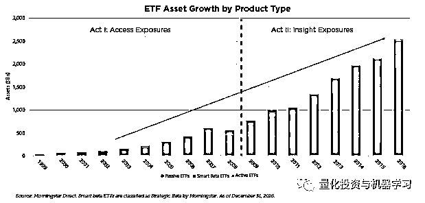

通常来说，这对投资者（包括个人投资者和机构投资者）来说是个有利的发展，因为投资格局（特别是主动型 Alpha 基金经理的领域）正在逐渐变得“民主”，正如下图所示。这就允许投资者以简单、成本有效、透明的形式接触到为主动型基金经理带来大部分收益的因子。由于模型的成熟，**Sm****art Beta ETFs 甚至可以完全有效地复制某些对冲基金的策略**。论文：*https://jwm.iijournals.com/content/14/3/58*

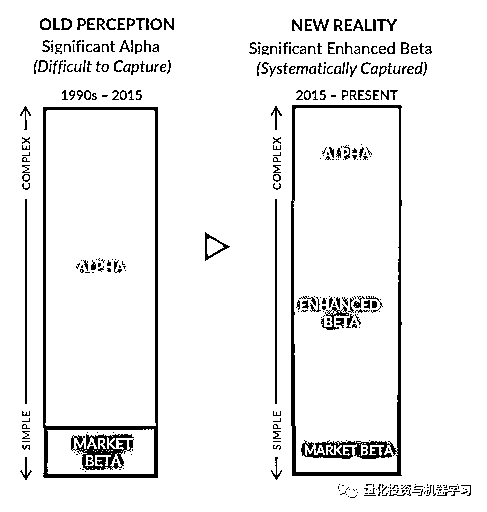

**因子并非生来平等**

尽管 Alpha 的商品化对投资者（和“主动到被动”策略转换的驱动力）来说很有利，许多投资者还是把价值因子（举个例子）看作一个同质的构建块，在投资组合中可有可无，找到最便宜的 ETF 然后坐享其成就可以了。Two Sigma 在一篇文章中提出了这一问题：

*Consider the equity value factor. Academics have written about the excess returns of “high value” stocks (as compared to the broader equity market) for nearly a century (e.g., Graham and Dodd, 1934). One might expect that the financial market equivalent of a patent—i.e., the “secret sauce” embedded in an investment style—would have long since expired, but Figure 1 and the accompanying table contradict that notion.*

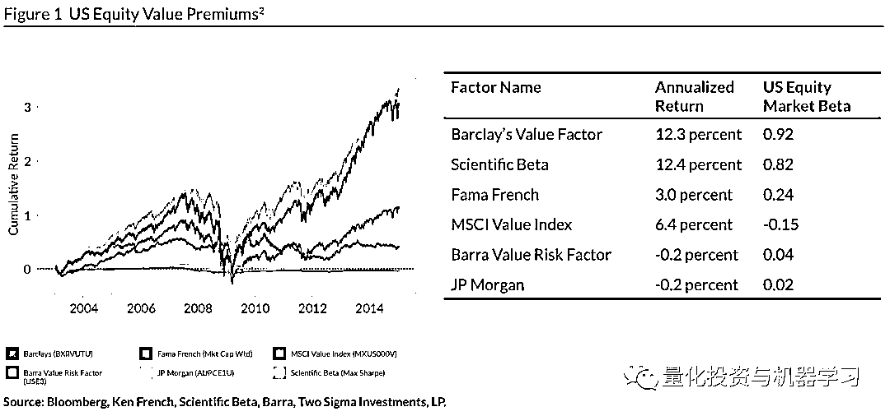

**论文文末下载**

显然价值风险因子之间的差别主要由这两种因素引起：**①定义；②构建**。

虽然 Fama 和 French 常常因“发现”了价值（和规模）因子而饱受赞誉，这种想法在投资者之中绝不是全新的主意。Benjamin Graham（价值投资之父）在数十年之前就已经出版了一本完整的关于这方面的书。Fama 和 French 只是用了一种简单的方法来定义价值（只需比较账面价值和市值），作为分析超额收益的一种方式。他们提出的价值因子被称为**“高账面市值比-低账面市值比”（HML），计算方式是对前 30%账面市值比公司的股票收益取平均然后减去后 30%账面市值比公司股票收益的平均数**。

正如 Two Sigma 所指出的那样， **“Fama-Frennch(1991)在学界与业界引发了一系列的问题。问题之一就是账面市值比是否能够代表获得价值风险因子敞口最有效的方法。举例来说，为什么不按照收益率或者现金流收益率对公司进行排序呢？”**

他们还使用了滚动相关分析法，对 2 种不同（但都很流行）的“价值”定义的预期收益进行了说明：账面市值比和收益率。

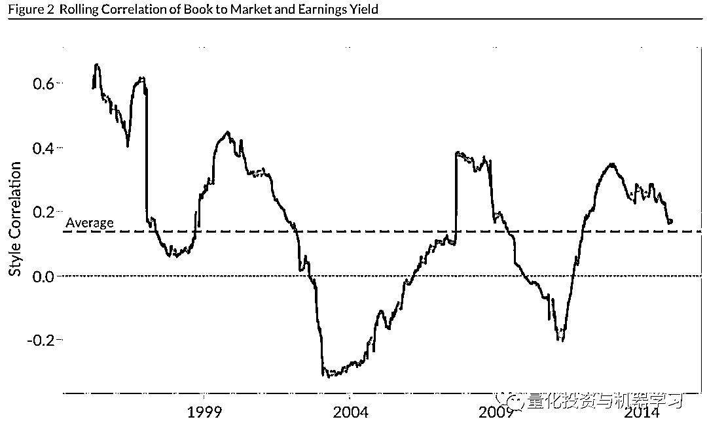

显然，如何定义“价值”举足轻重。正如在 Vanguard 最近发布的一篇文章种所说，**价值的定义和落实的不同对投资表现有显著的影响。**

地址：

*https://vanguardinstitutionalblog.com/2018/04/23/do-you-like-your-style-factor-spicy-or-tangy-evaluating-factor-funds/*

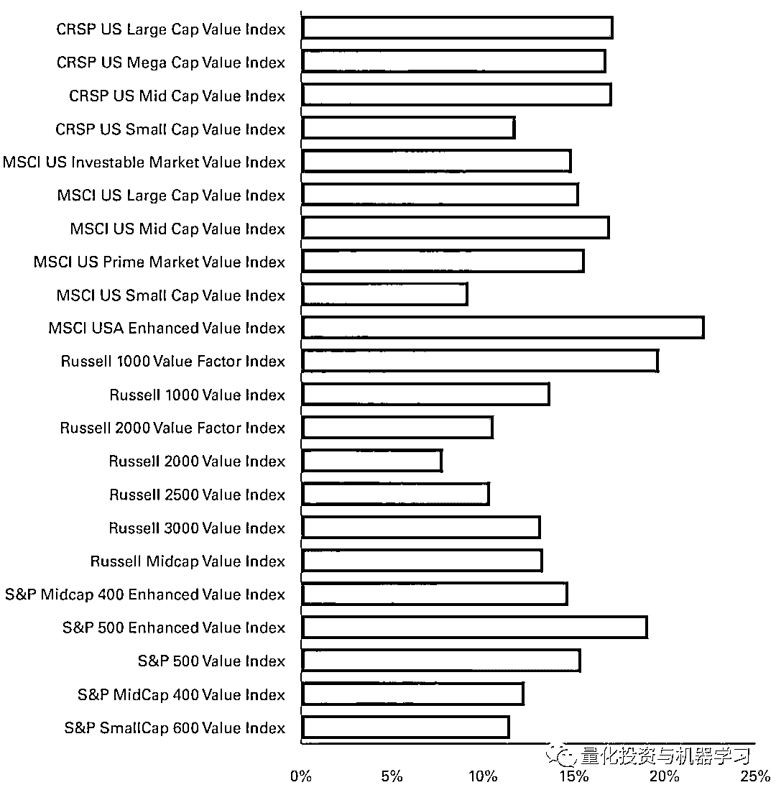

**方法：理论 vs. 实践**

现在显然的问题是：“**如何正确定义和解释价值因子（或者任何因子）？**”当一个因子不止一次被纳入考虑范围，这个问题就会变得愈发重要。为了继续探索，我们考虑 Fama 和 French 论文中一个最流行的例子：**小市值**。其是 Smart Beta 中最受欢迎的，并且从 1992 论文发表以来，已经有数以百计的小市值基金（主动型和被动型）设立。为了深入测试这些因子，我们看看 Eugene Fama 任职的公司——Dimensional Fund Advisors（DFA），尤其是 DFA 美国小市值组合**DFA US SmallCap Value Portfolio** (DFSVX)。

从基金计划书中可以看出：

**①“证券主要被视为价值股，因为一个公司的低股价与账面价值有关”。**

**②“美国小市值公司的相对市场价值越高，就越具有代表性”。**

所以，这个基金落实小市值因子的方式正与 Fama 和 French 的论文如出一辙，用账面价值代表价值。此外，这个基金按照市值为组合中的股票分配权重（这一方法有很多已知缺陷）。

然而，没有绝对正确或错误的方法来表示对价值因子的敞口（风险溢价），所以投资者应该意识到他们选择某一方案时所承担的风险（直接的和间接的）。仅仅依赖对价值的单一定义会增加特定敞口的风险（这个敞口体现了相对于其他定义出现的较大偏离）。类似地，根**据市值分配权重可能会导致放大特定时期内的价值影响**（在 2018 年“FANG”体现显著），称为动量倾斜。在这两种情况之一下，这些风险或倾斜可能会被投资者完全接受——**必须指出它们代表的风险是小市值因子的使用，而不是因子本身。**

让我们考虑另一种小市值因子的使用，Invesco S&P 600 Pure Value ETF（RZV）。这只 ETF 同样搜寻获取丰厚的小市值风险溢价的机会，但是换了一种方式：

**①“价值通过这几种风险因子来衡量：市净率、市盈率、市销率”。**

**②“股票的权重按照 Style(Value) Score 的比例来分配”。**

这种方式通过 3 种分离的度量价值的方法来分散模型风险，然后根据复合度量来赋予权。重。另外，根据价值排序后的小市值股票已经按照盈利能力进行过筛选。这是格外有趣的，**因为大量学术研究已经表明盈利能力（更宽泛地说，“质量”）是以一种鲁棒的、可以实际增加“经典”因子溢价（如价值）的“条件”因子。**

AQR 在 2015 的一篇论文（Size Matters, If you Control Your Junk）中，指出当评估小市值溢价时控制质量的重要性。

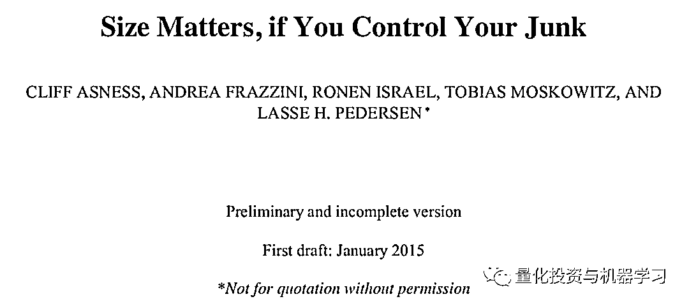

**论文文末下载**

*The previous evidence on the variability of the size effect is largely due to the volatile performance of small, low quality “junky” firms. Controlling for junk, a much stronger and more stable size premium emerges that is robust across time, including those periods where the size effect seems to fail; monotonic in size and not concentrated in the extremes; robust across months of the year; robust across non-market price based measures of size; not subsumed by illiquidity premia; and robust internationally. These results are robust across a variety of quality measures as well.*

*We further find that interactions between size and other firm characteristics, such as value and momentum, can also be fully or partially explained by quality versus junk. Hence, the quality of a firm helps clean up the relation between size and the cross-section of expected returns.*

事实上，Fama 和 French 在 2014 年的一篇论文中重新回顾了他们的三因子模型（侧重规模和价值因子），并引入了两个新的**“质量”因子**：**“盈利能力”和“投资”**。有趣的是，**他们发现当这两个新因子被纳入考虑，“价值”就没有之前那么重要了。**

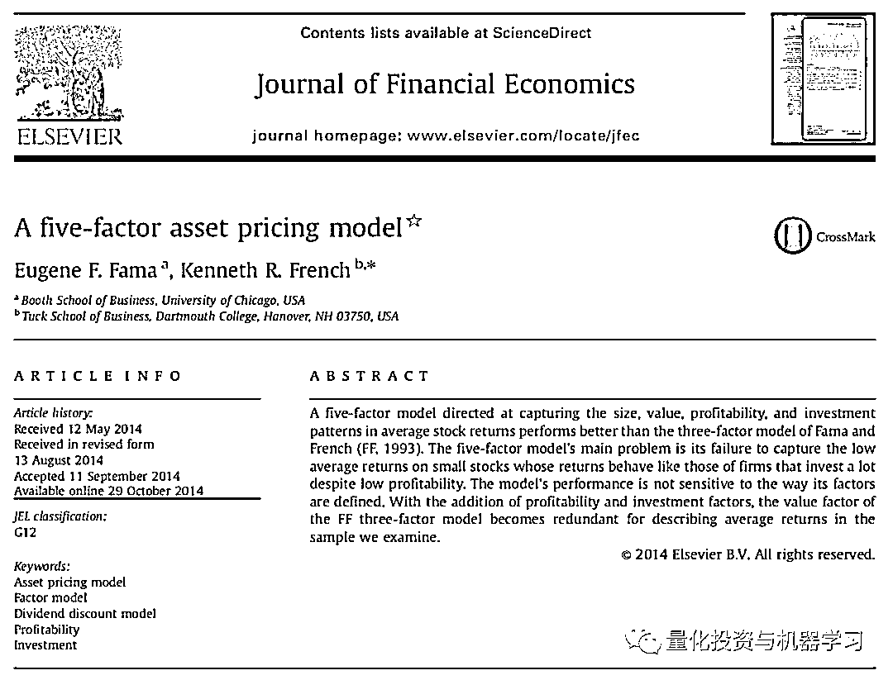

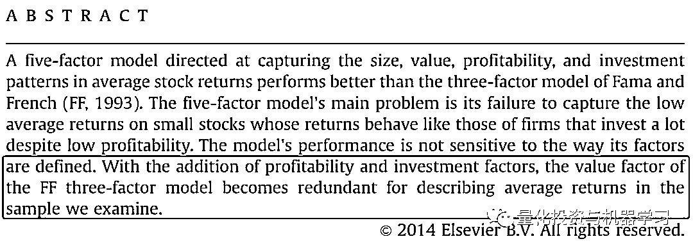

所以，Invesco S&P 600 Pure Value ETF (RZV)**对全部小市值股票按照盈利能力进行了筛选，根据价值的 3 种度量方法进行排序，按照价值“得分”赋予权重**。直观地来看，这种方法看起来是要将 DFA 的两个潜在缺点一起解决。

Invesco 的方法同样更好地与主动型基金追捧的价值敞口保持了一致，但是使用的是一种基于规则的方法（从而避免了任一主动型基金经理决策引起的所有问题）。

那么，这两种方法对比起来会怎样？

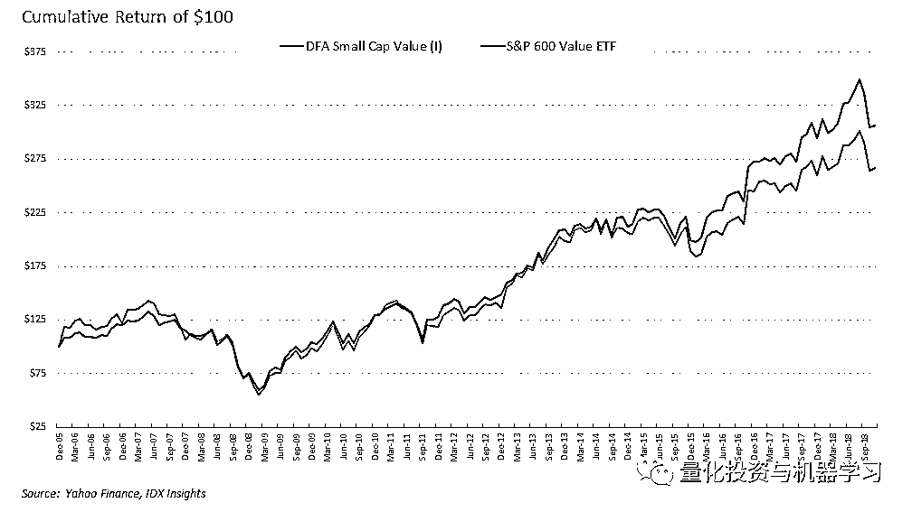

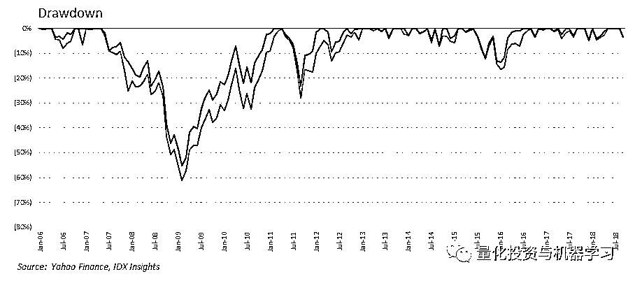

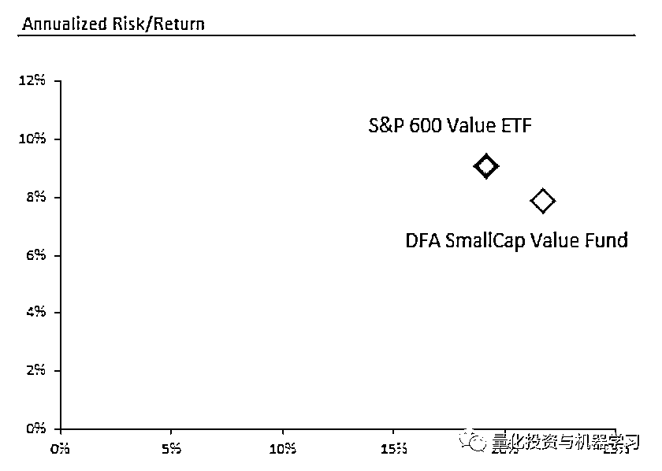

所以，在过去 12 年里，与 DFA 基金相同，**S&P 600 Value ETF 一直在试图提取小市值价值溢价，但是达到了更低的波动率，更低的回撤和更高的回报**（扣除交易成本及费用后）。

**这两种方法都被看做是“聪明 Beta”策略，但我们认为其中一种比另一种更“聪明”。**

**推荐阅读**

[01、经过多年交易之后你应该学到的东西（深度分享）](https://mp.weixin.qq.com/s?__biz=MzAxNTc0Mjg0Mg==&mid=2653289074&idx=1&sn=e859d363eef9249236244466a1af41b6&chksm=802e3867b759b1717f77e07a51ee5671e8115130c66562577280ba1243cba08218add04f1f00&token=449379994&lang=zh_CN&scene=21#wechat_redirect)

[02、监督学习标签在股市中的应用（代码+书籍）](https://mp.weixin.qq.com/s?__biz=MzAxNTc0Mjg0Mg==&mid=2653289050&idx=1&sn=60043a5c95b877dd329a5fd150ddacc4&chksm=802e384fb759b1598e500087374772059aa21b31ae104b3dca04331cf4b63a233c5e04c1945a&token=449379994&lang=zh_CN&scene=21#wechat_redirect)

[03、全球投行顶尖机器学习团队全面分析](https://mp.weixin.qq.com/s?__biz=MzAxNTc0Mjg0Mg==&mid=2653289018&idx=1&sn=8c411f676c2c0d92b0dd218f041bee4b&chksm=802e382fb759b139ffebf633ac14cdd0f21938e4613fe632d5d9231dab3d2aca95a11628378a&token=449379994&lang=zh_CN&scene=21#wechat_redirect)

[04、使用 Tensorflow 预测股票市场变动](https://mp.weixin.qq.com/s?__biz=MzAxNTc0Mjg0Mg==&mid=2653289014&idx=1&sn=3762d405e332c599a21b48a7dc4df587&chksm=802e3823b759b135928d55044c2729aea9690f86752b680eb973d1a376dc53cfa18287d0060b&token=449379994&lang=zh_CN&scene=21#wechat_redirect)

[05、使用 LSTM 预测股票市场基于 Tensorflow](https://mp.weixin.qq.com/s?__biz=MzAxNTc0Mjg0Mg==&mid=2653289238&idx=1&sn=3144f5792f84455dd53c27a78e8a316c&chksm=802e3903b759b015da88acde4fcbc8547ab3e6acbb5a0897404bbefe1d8a414265d5d5766ee4&token=2020206794&lang=zh_CN&scene=21#wechat_redirect)

[06、美丽的回测——教你定量计算过拟合概率](https://mp.weixin.qq.com/s?__biz=MzAxNTc0Mjg0Mg==&mid=2653289314&idx=1&sn=87c5a12b23a875966db7be50d11f09cd&chksm=802e3977b759b061675d1988168c1fec06c602e8583fbcc9b76f87008e0c10b702acc85467a0&token=1972390229&lang=zh_CN&scene=21#wechat_redirect)

[07、利用动态深度学习预测金融时间序列基于 Python](https://mp.weixin.qq.com/s?__biz=MzAxNTc0Mjg0Mg==&mid=2653289347&idx=1&sn=bf5d7899bc4a854d4ba9046fdc6fe0d6&chksm=802e3996b759b080287213840987bb0a0c02e4e1d4d7aae23f10a225a92ef6dd922d8006123d&token=290397496&lang=zh_CN&scene=21#wechat_redirect)

[08、Facebook 开源神器 Prophet 预测时间序列基于 Python](https://mp.weixin.qq.com/s?__biz=MzAxNTc0Mjg0Mg==&mid=2653289394&idx=1&sn=24a836136d730aa268605628e683d629&chksm=802e39a7b759b0b1dcf7aaa560699130a907716b71fc9c45ff0e5d236c5ae8ef80ebdb09dbb6&token=290397496&lang=zh_CN&scene=21#wechat_redirect)

[09、Facebook 开源神器 Prophet 预测股市行情基于 Python](https://mp.weixin.qq.com/s?__biz=MzAxNTc0Mjg0Mg==&mid=2653289437&idx=1&sn=f0dca7da8e69e7ba736992cb3d034ce7&chksm=802e39c8b759b0de5bce401c580623d0729ecca69d13926479d36e19aff8c9c9e8a20265afff&token=290397496&lang=zh_CN&scene=21#wechat_redirect)

[10、2018 第三季度最受欢迎的券商金工研报前 50（附下载）](https://mp.weixin.qq.com/s?__biz=MzAxNTc0Mjg0Mg==&mid=2653289358&idx=1&sn=db6e8ab85b08f6e67790ec0e401e586e&chksm=802e399bb759b08d6eec855f9901ea856d0da68c7425cba62791b8948da6ad761a3d88543dad&token=290397496&lang=zh_CN&scene=21#wechat_redirect)

[11、实战交易策略的精髓（公众号深度呈现）](https://mp.weixin.qq.com/s?__biz=MzAxNTc0Mjg0Mg==&mid=2653289447&idx=1&sn=f2948715bf82569a6556d518e56c1f9e&chksm=802e39f2b759b0e4502d1aaac562b87789573b55c76b3c85897d8c9d88dbf9a0b7ee34d86a4e&token=290397496&lang=zh_CN&scene=21#wechat_redirect)

[12、Markowitz 有效边界和投资组合优化基于 Python](https://mp.weixin.qq.com/s?__biz=MzAxNTc0Mjg0Mg==&mid=2653289478&idx=1&sn=f8e01a641be021993d8ef2d84e94a299&chksm=802e3e13b759b7055cf27a280c672371008a5564c97c658eee89ce8481396a28d254836ff9af&token=290397496&lang=zh_CN&scene=21#wechat_redirect)

[13、使用 LSTM 模型预测股价基于 Keras](https://mp.weixin.qq.com/s?__biz=MzAxNTc0Mjg0Mg==&mid=2653289495&idx=1&sn=c4eeaa2e9f9c10995be9ea0c56d29ba7&chksm=802e3e02b759b7148227675c23c403fb9a543b733e3d27fa237b53840e030bf387a473d83e3c&token=1260956004&lang=zh_CN&scene=21#wechat_redirect)

[14、量化金融导论 1：资产收益的程式化介绍基于 Python](https://mp.weixin.qq.com/s?__biz=MzAxNTc0Mjg0Mg==&mid=2653289507&idx=1&sn=f0ca71aa07531bbbdbd33213f0bab89f&chksm=802e3e36b759b720138b3b17a4dd0e198e054b9de29a038fdd50805f824effa55831111ad026&token=1936245282&lang=zh_CN&scene=21#wechat_redirect)

[15、预测股市崩盘基于统计机器学习与神经网络（Python+文档）](https://mp.weixin.qq.com/s?__biz=MzAxNTc0Mjg0Mg==&mid=2653289533&idx=1&sn=4ef964834e84a9995111bb057b0fc5dd&chksm=802e3e28b759b73e0618eb1262c53aa0601fbf5805525a7c7ff40dc3db62c7704496611bdbf1&token=1950551577&lang=zh_CN&scene=21#wechat_redirect)

[16、实现最优投资组合有效前沿基于 Python（附代码）](https://mp.weixin.qq.com/s?__biz=MzAxNTc0Mjg0Mg==&mid=2653289609&idx=1&sn=c7f0b3e47025862d10bb53b6ab88bcda&chksm=802e3e9cb759b78abf6b8b049c59bf18ccfb2ead7580d1f557d36de2292f59dcbd94dcd41910&token=2085008037&lang=zh_CN&scene=21#wechat_redirect)

[17、精心为大家整理了一些超级棒的机器学习资料（附链接）](https://mp.weixin.qq.com/s?__biz=MzAxNTc0Mjg0Mg==&mid=2653289615&idx=1&sn=1cdc89afb997d0c580bf0cef296d946c&chksm=802e3e9ab759b78ce9f0cd152a680d4a413d6c8dcb02a7a296f4091993a7e4137e7520394575&token=2085008037&lang=zh_CN&scene=21#wechat_redirect)

[18、海量 Wind 数据，与全网用户零距离邂逅！](https://mp.weixin.qq.com/s?__biz=MzAxNTc0Mjg0Mg==&mid=2653289623&idx=1&sn=28a3600fd7a72d7be00b066ca0f98244&chksm=802e3e82b759b7943f43a4f6ef4a91e4153fa6b8210de9590235fa8ee66eb9811ce177054dbc&token=1389401983&lang=zh_CN&scene=21#wechat_redirect)

[19、机器学习、深度学习、量化金融、Python 等最新书籍汇总下载](https://mp.weixin.qq.com/s?__biz=MzAxNTc0Mjg0Mg==&mid=2653289640&idx=1&sn=34e94fcbe99052b8e7381ecc48a36dc0&chksm=802e3ebdb759b7ab897cd329a680715b6f8294e63550ddf0c57b9e1320b2b7d1408c6fdca0c7&token=1389401983&lang=zh_CN&scene=21#wechat_redirect)

[20、各大卖方 2019 年 A 股策略报告，都是有故事的人！](https://mp.weixin.qq.com/s?__biz=MzAxNTc0Mjg0Mg==&mid=2653289725&idx=1&sn=4b65cd1fb8331438e4c0b3d0eae6b51f&chksm=802e3ee8b759b7fe1b94e84d54cc23b0ab05853d5cd227812574b350e9fc2cce9e5f1bc6cb7a&token=1389401983&lang=zh_CN&scene=21#wechat_redirect)

**如何获取论文**

在**后台**输入（严格大小写）

# ***Fama-French***

*—End—*

量化投资与机器学习微信公众号，是业内垂直于**Quant**、**MFE**、**CST**等专业的**主流自媒体**。公众号拥有来自**公募、私募、券商、银行、海外**等众多圈内**10W+**关注者。每日发布行业前沿研究成果和最新资讯。

