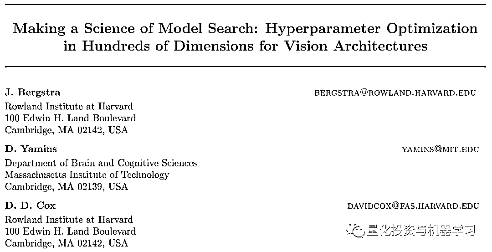
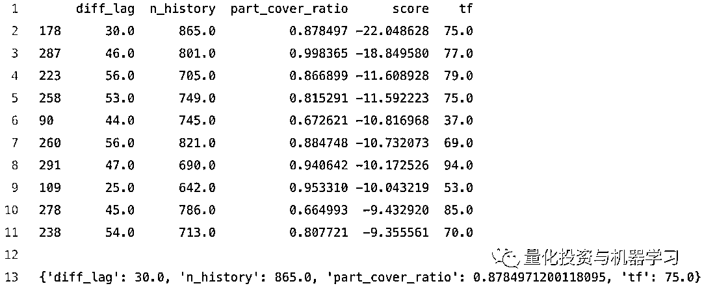

# 独家呈现 | 量化交易中的贝叶斯优化问题（论文+代码）

> 原文：[`mp.weixin.qq.com/s?__biz=MzAxNTc0Mjg0Mg==&mid=2653291242&idx=1&sn=a7cf26908f0589d9a683d275c4f11baa&chksm=802dc0ffb75a49e9deb9549240515644ca78a2b74f8eb456d9efe9a53bf4a8701a8edb96e80b&scene=27#wechat_redirect`](http://mp.weixin.qq.com/s?__biz=MzAxNTc0Mjg0Mg==&mid=2653291242&idx=1&sn=a7cf26908f0589d9a683d275c4f11baa&chksm=802dc0ffb75a49e9deb9549240515644ca78a2b74f8eb456d9efe9a53bf4a8701a8edb96e80b&scene=27#wechat_redirect)

**标星★公众号     **♥你们

▎作者：*Sergey Malchevskiy*

**▎**编译：**Kiwi** | 公众号翻译部

**近期原创文章：**

## ♥ [基于无监督学习的期权定价异常检测（代码+数据）](https://mp.weixin.qq.com/s?__biz=MzAxNTc0Mjg0Mg==&mid=2653290562&idx=1&sn=dee61b832e1aa2c062a96bb27621c29d&chksm=802dc257b75a4b41b5623ade23a7de86333bfd3b4299fb69922558b0cbafe4c930b5ef503d89&token=1298662931&lang=zh_CN&scene=21#wechat_redirect)

## ♥ [5 种机器学习算法在预测股价的应用（代码+数据）](https://mp.weixin.qq.com/s?__biz=MzAxNTc0Mjg0Mg==&mid=2653290588&idx=1&sn=1d0409ad212ea8627e5d5cedf61953ac&chksm=802dc249b75a4b5fa245433320a4cc9da1a2cceb22df6fb1a28e5b94ff038319ae4e7ec6941f&token=1298662931&lang=zh_CN&scene=21#wechat_redirect)

## ♥ [深入研读：利用 Twitter 情绪去预测股市](https://mp.weixin.qq.com/s?__biz=MzAxNTc0Mjg0Mg==&mid=2653290402&idx=1&sn=efda9ea106991f4f7ccabcae9d809e00&chksm=802e3db7b759b4a173dc8f2ab5c298ab3146bfd7dd5aca75929c74ecc999a53b195c16f19c71&token=1330520237&lang=zh_CN&scene=21#wechat_redirect)

## ♥ [Two Sigma 用新闻来预测股价走势，带你吊打 Kaggle](https://mp.weixin.qq.com/s?__biz=MzAxNTc0Mjg0Mg==&mid=2653290456&idx=1&sn=b8d2d8febc599742e43ea48e3c249323&chksm=802e3dcdb759b4db9279c689202101b6b154fb118a1c1be12b52e522e1a1d7944858dbd6637e&token=1330520237&lang=zh_CN&scene=21#wechat_redirect)

## ♥ [利用深度学习最新前沿预测股价走势](https://mp.weixin.qq.com/s?__biz=MzAxNTc0Mjg0Mg==&mid=2653290080&idx=1&sn=06c50cefe78a7b24c64c4fdb9739c7f3&chksm=802e3c75b759b563c01495d16a638a56ac7305fc324ee4917fd76c648f670b7f7276826bdaa8&token=770078636&lang=zh_CN&scene=21#wechat_redirect)

## ♥ [一位数据科学 PhD 眼中的算法交易](https://mp.weixin.qq.com/s?__biz=MzAxNTc0Mjg0Mg==&mid=2653290118&idx=1&sn=a261307470cf2f3e458ab4e7dc309179&chksm=802e3c93b759b585e079d3a797f512dfd0427ac02942339f4f1454bd368ba47be21cb52cf969&token=770078636&lang=zh_CN&scene=21#wechat_redirect)

## ♥ [基于 RNN 和 LSTM 的股市预测方法](https://mp.weixin.qq.com/s?__biz=MzAxNTc0Mjg0Mg==&mid=2653290481&idx=1&sn=f7360ea8554cc4f86fcc71315176b093&chksm=802e3de4b759b4f2235a0aeabb6e76b3e101ff09b9a2aa6fa67e6e824fc4274f68f4ae51af95&token=1865137106&lang=zh_CN&scene=21#wechat_redirect)

## ♥ [人工智能『AI』应用算法交易，7 个必踩的坑！](https://mp.weixin.qq.com/s?__biz=MzAxNTc0Mjg0Mg==&mid=2653289974&idx=1&sn=88f87cb64999d9406d7c618350aac35d&chksm=802e3fe3b759b6f5eca6e777364270cbaa0bf35e9a1535255be9751c3a77642676993a861132&token=770078636&lang=zh_CN&scene=21#wechat_redirect)

## ♥ [神经网络在算法交易上的应用系列（一）](https://mp.weixin.qq.com/s?__biz=MzAxNTc0Mjg0Mg==&mid=2653289962&idx=1&sn=5f5aa65ec00ce176501c85c7c106187d&chksm=802e3fffb759b6e9f2d4518f9d3755a68329c8753745333ef9d70ffd04bd088fd7b076318358&token=770078636&lang=zh_CN&scene=21#wechat_redirect)

## ♥ [预测股市 | 如何避免 p-Hacking，为什么你要看涨？](https://mp.weixin.qq.com/s?__biz=MzAxNTc0Mjg0Mg==&mid=2653289820&idx=1&sn=d3fee74ba1daab837433e4ef6b0ab4d9&chksm=802e3f49b759b65f422d20515942d5813aead73231da7d78e9f235bdb42386cf656079e69b8b&token=770078636&lang=zh_CN&scene=21#wechat_redirect)

## ♥ [如何鉴别那些用深度学习预测股价的花哨模型？](https://mp.weixin.qq.com/s?__biz=MzAxNTc0Mjg0Mg==&mid=2653290132&idx=1&sn=cbf1e2a4526e6e9305a6110c17063f46&chksm=802e3c81b759b597d3dd94b8008e150c90087567904a29c0c4b58d7be220a9ece2008956d5db&token=1266110554&lang=zh_CN&scene=21#wechat_redirect)

## ♥ [优化强化学习 Q-learning 算法进行股市](https://mp.weixin.qq.com/s?__biz=MzAxNTc0Mjg0Mg==&mid=2653290286&idx=1&sn=882d39a18018733b93c8c8eac385b515&chksm=802e3d3bb759b42d1fc849f96bf02ae87edf2eab01b0beecd9340112c7fb06b95cb2246d2429&token=1330520237&lang=zh_CN&scene=21#wechat_redirect)

**明天的推文还有第二篇，不要错过哦！**

**周末快乐**

**前言**

算法交易与机器学习中的问题相似。今天, 公众号将展示如何将贝叶斯优化应用于调整交易策略的超参数中。

假设你创建了一个具有几个超参数的交易策略。这种策略在回溯测试中是可盈利的。你希望将策略部署到实际环境中，但还有一个问题：**"这一组参数是最佳的吗？"**

通常，网格搜索方法用于搜索最佳超参数。这种方法也用于机器学习，但这需要大量的计算，往往是在错误的参数空间。

另一种方法是随机搜索，它的性能可以比网格搜索稍好一些。

我们在 Quora 上找到了一个非常好的解释：

**问题：****目标是找到一些 "昂贵" 函数的近似最小值。这样的函数接受一个实值向量∈R，返回一个标量，并需要相当长的时间来做它。此外，没有可用的渐变计算。因此，让我们想象一个简单的一维案例：**


虚线意味着我们看不到这个函数，我们可能只选择在某些点对其进行评估。

由于此函数成本很高，假设我们有固定的评估预算，因此我们可能只对其进行 10 次评估。

有了这些，你将如何找到尽可能好的最低限度？

**想法是这样的：****采样一些输入输出 （小于 10），并使用它们来猜测真正的函数与东西****称为 "高斯过程" （或 "GP" ）。然后使用该猜测函数来确定下一步在何处进行评估。评估这一点，将其添加到我们的输入输出集，并再次推断猜测函数。重复此操作，直到你耗尽了评估预算 （或其他一些停止条件）。如果 GP 善于猜测真正的函数，我们会比随机抽样做得更好。**

为了让你对 GP 有感觉, 让我们从昂贵函数中抽取四点，把这些交给 GP，让它推断其余的功能。这可能会像这样：


实线绿线是我们对真正功能的猜测。每增加一个绿色波段，就会出现另一个输出分布标准差。

所以现在的问题变成了：考虑到所有这些有用的猜测信息，我们下一步应该检查什么点？在回答这个问题时，我们关心两件事：

我们应该评估我们认为会产生较低产出值的点。也就是说，我们应该对固体绿线较低的点进行评估。

我们应该检查我们不太了解的领域。因此, 在上图中，在 0.65 和 0.75 之间的某个地方进行检查比在 0.15 和 0.25 之间检查要明智得多，因为我们对后一个区域发生的事情有一个相当好的想法。换句话说, 我们应该检查区域，这将最大化减少我们的猜测中的方差。

平衡这两者是勘探开发的权衡。你是查看新的地方还是开发你迄今发现的金矿？我们使用采集函数明确我们的首选项。这是 x 的函数，它将产生一个数字, 告诉我们在实现这两个目标方面的表现。这个函数很便宜，所以我们可以优化它，用那个 x 作为下一个搜索点。

那么哪种采集功能呢？有几个选择，但我们会带着改进的期待去做。也就是说，评估预期改进最高的下一点。

所以，如果：

μ(x) μ(x) 是函数在 x （绿线）的猜测值。

σ(x) σ(x) 是输出在 x 处的标准偏差 （与绿色波段成比例）。

然后, 我们对改进的期望 （称之为 (A(x) A(x)）是：


其中 Φ(⋅)和 N(⋅)分别指标准正态分布的 CDF 和 PDF。准确地理解这个公式并不重要。只需知道它是一个低 μ (x) μ (x)和一个高 σ(x) σ(x)的平衡。

要查看其操作方式，请在下图旁边查看它：


因此，这将告诉我们在 x=1 检查, 因为该点具有最高的激活。

然后再重复一遍，就像我们之前说的，如果 GP 善于猜测真正的功能，它就会战胜随机抽样。

这篇论文比较了机器学习中超参数调优的不同方法。它认为贝叶斯优化是一种比随机搜索、网格搜索或手动更好的方法。（**论文在文末帮你们打包好了**）




**贝叶斯优化**

Siraj Raval 的这段视频有很好的解释。


*https://www.youtube.com/watch?v=ttE0F7fghfk&feature=youtu.be*

如果你想深入了解这个主题，你应该阅读这篇论文（**论文在文末帮你们打包好了**）


在 hyperopt 包中实现了 Bayesian 优化。我们可以在一行中完成基本的贝叶斯优化！

```py
import numpy as np
from hyperopt import hp, tpe, fmin

# Single line bayesian optimization of polynomial function
best = fmin(fn = lambda x: np.poly1d([1, -2, -28, 28, 12, -26, 100])(x),
                    space = hp.normal('x', 4.9, 0.5), algo=tpe.suggest, 
                    max_evals = 2000)
```

贝叶斯优化 1-D polynomial

网址：*https://github.com/hyperopt/hyperopt*


**明天的文章中我们为大家详细解读 hyperopt 用法**

**案例展示**

我们将考虑前面讨论过的一个策略。这个策略有 4 个超参数，我们来定义需要的库：

```py
from hyperopt import hp, tpe, fmin, Trials
import numpy as np
import pandas as pd
import datetime
import pyrenko
import scipy.optimize as opt
from scipy.stats import iqr

from catalyst import run_algorithm
from catalyst.api import (record, symbol, order_target, order_target_percent, get_datetime)
```

贝叶斯优化是在超选择包（hyperopt package）中实现的。


通常，研究人员使用回回测来确定最佳的超参数和样品外测试来进行评估。但我们认为，如果我们使用几个回测周期，我们可以得到一个更有意义的结果。

当倍数更接近采样外周期时，则倍数在最终加权分数中具有更大的权重。

此外，如果某个倍数具有负性能，则此函数应惩罚最终值。作为交易中的分数函数，你可以使用 Sortino ratio，或任何估计策略质量的函数。为了我们的目的，较低的值更好。这意味着我们应该反转 Sortino ratio 值。


本例中，我们将使用：

*   训练 (优化) 步骤为 5 倍，即 1 个月

*   测试周期为 1 个月，验证为 3 周（样本外）

*   训练时间：2018-06–01 至 2018-10-31

*   测试时间：2018-11–10 至 2018-11-30

*   有效期：2018-12–01 至 2018-12–21

让我们定义周期、超参数空间和加权均值函数。此代码允许按 period_weights 对不同长度的折叠进行编码。

```py
period_weights = [0.2, 0.2, 0.2, 0.2, 0.2]

start_date = datetime.datetime.strptime("1-6-2018", "%d-%m-%Y")
end_date = datetime.datetime.strptime("31-10-2018", "%d-%m-%Y")
total_days = (end_date - start_date).days + 1

folds_start_date = [start_date] + [start_date + datetime.timedelta(days = round(total_days * x)) for x in np.cumsum(period_weights)[:-1]]
folds_end_date = [start_date + datetime.timedelta(days = round(total_days * x) - 1) for x in np.cumsum(period_weights)]

hyper_params_space = {'n_history': hp.quniform('n_history', 150, 1000, 1),
'tf': hp.quniform('tf', 10, 100, 1),
'diff_lag': hp.quniform('diff_lag', 1, 100, 1),
'part_cover_ratio': hp.uniform('part_cover_ratio', 0.0, 1.0)}

def weighted_mean(values):
    return np.average(values, weights = list(range(1, len(values) + 1)))
```

下一步是定义运行算法的分数函数并测量性能（在本例中为 Sortino ratio）。

将参数从超选项包传递到 Catalyst 框架的替代变体是使用 os.environ。

```py
def score_func(params):
  # Function for Renko brick optimization
        def evaluate_renko(brick, history, column_name):
                renko_obj = pyrenko.renko()
                renko_obj.set_brick_size(brick_size = brick, auto = False)
                renko_obj.build_history(prices = history)
                return renko_obj.evaluate()[column_name]

        def initialize(context):
                context.asset = symbol('eth_btc')

                context.leverage = 1.0                              # 1.0 - no leverage
                context.n_history = int(params['n_history'])                    # Number of lookback bars for modelling
                context.tf = str(int(params['tf'])) + 'T'                        # How many minutes in a timeframe
                context.diff_lag = int(params['diff_lag'])      # Lag of differences to get returns
                context.model = pyrenko.renko()                # Renko object
                context.part_cover_ratio = float(params['part_cover_ratio'])   # Partially cover position ratio
                context.last_brick_size = 0.0                       # Last optimal brick size (just for storing)

                context.set_benchmark(context.asset)
                context.set_commission(maker = 0.001, taker = 0.002)
                context.set_slippage(slippage = 0.0005)

        def handle_data(context, data):
                current_time = get_datetime().time()

                # When model is empty
                if len(context.model.get_renko_prices()) == 0:
                        context.model = pyrenko.renko()
                        history = data.history(context.asset,
                                'price',
                                 bar_count = context.n_history, 
                                frequency = context.tf
                                )

                        # Get daily absolute returns
                        diffs = history.diff(context.diff_lag).abs()
                        diffs = diffs[~np.isnan(diffs)]
                        # Calculate IQR of daily returns
                        iqr_diffs = np.percentile(diffs, [25, 75])

                        # Find the optimal brick size
                        opt_bs = opt.fminbound(lambda x: -evaluate_renko(brick = x,
                          history = history, column_name = 'score'),
                        iqr_diffs[0], iqr_diffs[1], disp=0)

                        # Build the model
                        context.last_brick_size = opt_bs
                        context.model.set_brick_size(brick_size = opt_bs, auto = False)
                        context.model.build_history(prices = history)

                        # Open a position
                        order_target_percent(context.asset, context.leverage * context.model.get_renko_directions()[-1])

            else:
                    last_price = data.history(context.asset,
                          'price',
                          bar_count = 1,
                          frequency = '1440T',
                          )

                         Just for output and debug
                        prev = context.model.get_renko_prices()[-1]
                        prev_dir = context.model.get_renko_directions()[-1]
                        num_created_bars = context.model.do_next(last_price)

                        # If the last price moves in the backward direction we should rebuild the model
                        if np.sign(context.portfolio.positions[context.asset].amount * context.model.get_renko_directions()[-1]) == -1:
                            order_target_percent(context.asset, 0.0)
                            context.model = pyrenko.renko()
                        # or we cover the part of the position
                elif context.part_cover_ratio > 0.0 and num_created_bars != 0:
                        order_target(context.asset, context.portfolio.positions[context.asset].amount * (1.0 - context.part_cover_ratio))

        def analyze(context, perf):
              pass

            # Run alfo and get the performance
            perf = run_algorithm(
              capital_base = 1000000,
              data_frequency = 'daily',
              initialize = initialize,
              handle_data = handle_data,
              analyze = analyze,
              exchange_name = 'bitfinex',
              quote_currency = 'btc',
              start = pd.to_datetime(params['start'], utc = True),
              end = pd.to_datetime(params['end'], utc = True))

          # Invert the metric
        if pd.isnull(perf.sortino[-1]):
              return 0.0
        else:
              return (-1.0) * perf.sortino[-1]
```

核心是用 weighted_mean 函数测量几个褶皱性能的 objective 函数，否则得到倍数的最大值 （惩罚）。

```py
def objective(hyper_params):
        print(hyper_params)

            # Calculate metric for each fold
            metric_folds = [0.0] * (len(folds_start_date))
        for p in range(len(folds_start_date)):
                hyper_params['start'] = folds_start_date[p]
                hyper_params['end'] = folds_end_date[p]

                metric_folds[p] = score_func(hyper_params)
                print('Fold #' + str(p) +' metric value: ' + str(metric_folds[p]))

        result = 0.0
        if np.max(metric_folds) >= 0.0:
                result = np.max(metric_folds)
        else:
                result = weighted_mean(metric_folds)

        print('Objective function value: ' + str(result))
        return result
```

下一个代码通过 300 次迭代运行优化。

```py
tpe_trials = Trials()
opt_params = fmin(fn = objective,
            space = hyper_params_space,
            algo = tpe.suggest, 
            max_evals = 300,
            trials = tpe_trials, 
            rstate = np.random.RandomState(100))

tpe_results = pd.DataFrame({'score': [x['loss'] for x in tpe_trials.results], 
                            'n_history': tpe_trials.idxs_vals[1]['n_history'],
                            'tf': tpe_trials.idxs_vals[1]['tf'],
                            'diff_lag': tpe_trials.idxs_vals[1]['diff_lag'],
                            'part_cover_ratio': tpe_trials.idxs_vals[1]['part_cover_ratio']})
tpe_results.sort_values(by = ['score'], inplace = True)

print(tpe_results.head(10))
print(opt_params)
view raw
```

输出如下所示：



此表包含按分数分列的试验的顶部。最后一行是最佳超参数集。利用 Bitnex 数据对 ETH/BTC、LTC/BTC、XMR/BTC 和 ZEC/etc 进行了实验。

从理论上讲, 您可以可视化 3D 空间中的 objective value，如维度 1-维度 2-目标值，并且最佳解决方案具有全局最小值：


此超参数表显示每个资产的参数的最佳值：


**资产选择（测试步骤）**

在此步骤中，我们应该在测试期间运行特定资产的固定超参数策略。将为下一步（样本外测试）选择性能为正的资产。

正如你所看到的，两个资产 (ETTH-BTC 和 ETH/BTC) 获得了正向的表现。


**样本外测试（验证步骤）**

当我们找到最佳超参数和选定的资产时，我们可以在不用于优化的期间运行交易算法。 

让我们在这两种资产的基础上构建一个投资组合。在 t = 0 时，根据每个资产资本的目标值的比例 (-15.45 和-9.72) 设置每个资产资本。

从理论上讲，每个资产的权重可能不同。例如，统一分配或其他方法。投资组合的最终权益结合了这些资产的表现。


总体来说, 该策略在样本外期间表现良好。

正如你在上图中看到的，回撤期太长。可能该算法在上一次快速增长后无法适应下降。在制定 objective 函数时，你可以考虑到这一点。

我们在测试步骤中从投资组合中撤出了两项资产 (LTC/BTC 和 LTC/BTC)。让我们看看这是否是一个正确的决定：


这个决定是对的。如果将这些资产包括在内，投资组合将更加糟糕。混淆矩阵如下所示：


正如我们所看到的，我们没有Ⅰ型错误。我们只从投资组合中删除了 ZEC/BTC，但该资产在验证步骤上是好的 (Ⅱ型错误)。在这种情况下，这不如包括一些无法保护的资产重要。*原文：https://towardsdatascience.com/bayesian-optimization-in-trading-77202ffed530*

**结论**

这个例子不是最终的交易策略，给定的结果可能是随机的。它需要大量的实验来得出一个关于是否适合交易的结论。

如何改进此方法：

1、根据你的目标定义你自己的目标和评分功能。

2、自定义训练/验证期。

3、创建一个投资组合，包括大量的资产，以检验这种方法可能适用于你的假设。

4、使用 walk-forward 测试来获得更显著的结果。它允许模拟更接近真实交易的情况。你将获得更多用于统计推断的数据。

**推荐阅读**

[01、经过多年交易之后你应该学到的东西（深度分享）](https://mp.weixin.qq.com/s?__biz=MzAxNTc0Mjg0Mg==&mid=2653289074&idx=1&sn=e859d363eef9249236244466a1af41b6&chksm=802e3867b759b1717f77e07a51ee5671e8115130c66562577280ba1243cba08218add04f1f00&token=449379994&lang=zh_CN&scene=21#wechat_redirect)

[02、监督学习标签在股市中的应用（代码+书籍）](https://mp.weixin.qq.com/s?__biz=MzAxNTc0Mjg0Mg==&mid=2653289050&idx=1&sn=60043a5c95b877dd329a5fd150ddacc4&chksm=802e384fb759b1598e500087374772059aa21b31ae104b3dca04331cf4b63a233c5e04c1945a&token=449379994&lang=zh_CN&scene=21#wechat_redirect)

[03、全球投行顶尖机器学习团队全面分析](https://mp.weixin.qq.com/s?__biz=MzAxNTc0Mjg0Mg==&mid=2653289018&idx=1&sn=8c411f676c2c0d92b0dd218f041bee4b&chksm=802e382fb759b139ffebf633ac14cdd0f21938e4613fe632d5d9231dab3d2aca95a11628378a&token=449379994&lang=zh_CN&scene=21#wechat_redirect)

[04、使用 Tensorflow 预测股票市场变动](https://mp.weixin.qq.com/s?__biz=MzAxNTc0Mjg0Mg==&mid=2653289014&idx=1&sn=3762d405e332c599a21b48a7dc4df587&chksm=802e3823b759b135928d55044c2729aea9690f86752b680eb973d1a376dc53cfa18287d0060b&token=449379994&lang=zh_CN&scene=21#wechat_redirect)

[05、使用 LSTM 预测股票市场基于 Tensorflow](https://mp.weixin.qq.com/s?__biz=MzAxNTc0Mjg0Mg==&mid=2653289238&idx=1&sn=3144f5792f84455dd53c27a78e8a316c&chksm=802e3903b759b015da88acde4fcbc8547ab3e6acbb5a0897404bbefe1d8a414265d5d5766ee4&token=2020206794&lang=zh_CN&scene=21#wechat_redirect)

[06、美丽的回测——教你定量计算过拟合概率](https://mp.weixin.qq.com/s?__biz=MzAxNTc0Mjg0Mg==&mid=2653289314&idx=1&sn=87c5a12b23a875966db7be50d11f09cd&chksm=802e3977b759b061675d1988168c1fec06c602e8583fbcc9b76f87008e0c10b702acc85467a0&token=1972390229&lang=zh_CN&scene=21#wechat_redirect)

[07、利用动态深度学习预测金融时间序列基于 Python](https://mp.weixin.qq.com/s?__biz=MzAxNTc0Mjg0Mg==&mid=2653289347&idx=1&sn=bf5d7899bc4a854d4ba9046fdc6fe0d6&chksm=802e3996b759b080287213840987bb0a0c02e4e1d4d7aae23f10a225a92ef6dd922d8006123d&token=290397496&lang=zh_CN&scene=21#wechat_redirect)

[08、Facebook 开源神器 Prophet 预测时间序列基于 Python](https://mp.weixin.qq.com/s?__biz=MzAxNTc0Mjg0Mg==&mid=2653289394&idx=1&sn=24a836136d730aa268605628e683d629&chksm=802e39a7b759b0b1dcf7aaa560699130a907716b71fc9c45ff0e5d236c5ae8ef80ebdb09dbb6&token=290397496&lang=zh_CN&scene=21#wechat_redirect)

[09、Facebook 开源神器 Prophet 预测股市行情基于 Python](https://mp.weixin.qq.com/s?__biz=MzAxNTc0Mjg0Mg==&mid=2653289437&idx=1&sn=f0dca7da8e69e7ba736992cb3d034ce7&chksm=802e39c8b759b0de5bce401c580623d0729ecca69d13926479d36e19aff8c9c9e8a20265afff&token=290397496&lang=zh_CN&scene=21#wechat_redirect)

[10、2018 第三季度最受欢迎的券商金工研报前 50（附下载）](https://mp.weixin.qq.com/s?__biz=MzAxNTc0Mjg0Mg==&mid=2653289358&idx=1&sn=db6e8ab85b08f6e67790ec0e401e586e&chksm=802e399bb759b08d6eec855f9901ea856d0da68c7425cba62791b8948da6ad761a3d88543dad&token=290397496&lang=zh_CN&scene=21#wechat_redirect)

[11、实战交易策略的精髓（公众号深度呈现）](https://mp.weixin.qq.com/s?__biz=MzAxNTc0Mjg0Mg==&mid=2653289447&idx=1&sn=f2948715bf82569a6556d518e56c1f9e&chksm=802e39f2b759b0e4502d1aaac562b87789573b55c76b3c85897d8c9d88dbf9a0b7ee34d86a4e&token=290397496&lang=zh_CN&scene=21#wechat_redirect)

[12、Markowitz 有效边界和投资组合优化基于 Python](https://mp.weixin.qq.com/s?__biz=MzAxNTc0Mjg0Mg==&mid=2653289478&idx=1&sn=f8e01a641be021993d8ef2d84e94a299&chksm=802e3e13b759b7055cf27a280c672371008a5564c97c658eee89ce8481396a28d254836ff9af&token=290397496&lang=zh_CN&scene=21#wechat_redirect)

[13、使用 LSTM 模型预测股价基于 Keras](https://mp.weixin.qq.com/s?__biz=MzAxNTc0Mjg0Mg==&mid=2653289495&idx=1&sn=c4eeaa2e9f9c10995be9ea0c56d29ba7&chksm=802e3e02b759b7148227675c23c403fb9a543b733e3d27fa237b53840e030bf387a473d83e3c&token=1260956004&lang=zh_CN&scene=21#wechat_redirect)

[14、量化金融导论 1：资产收益的程式化介绍基于 Python](https://mp.weixin.qq.com/s?__biz=MzAxNTc0Mjg0Mg==&mid=2653289507&idx=1&sn=f0ca71aa07531bbbdbd33213f0bab89f&chksm=802e3e36b759b720138b3b17a4dd0e198e054b9de29a038fdd50805f824effa55831111ad026&token=1936245282&lang=zh_CN&scene=21#wechat_redirect)

[15、预测股市崩盘基于统计机器学习与神经网络（Python+文档）](https://mp.weixin.qq.com/s?__biz=MzAxNTc0Mjg0Mg==&mid=2653289533&idx=1&sn=4ef964834e84a9995111bb057b0fc5dd&chksm=802e3e28b759b73e0618eb1262c53aa0601fbf5805525a7c7ff40dc3db62c7704496611bdbf1&token=1950551577&lang=zh_CN&scene=21#wechat_redirect)

[16、实现最优投资组合有效前沿基于 Python（附代码）](https://mp.weixin.qq.com/s?__biz=MzAxNTc0Mjg0Mg==&mid=2653289609&idx=1&sn=c7f0b3e47025862d10bb53b6ab88bcda&chksm=802e3e9cb759b78abf6b8b049c59bf18ccfb2ead7580d1f557d36de2292f59dcbd94dcd41910&token=2085008037&lang=zh_CN&scene=21#wechat_redirect)

[17、精心为大家整理了一些超级棒的机器学习资料（附链接）](https://mp.weixin.qq.com/s?__biz=MzAxNTc0Mjg0Mg==&mid=2653289615&idx=1&sn=1cdc89afb997d0c580bf0cef296d946c&chksm=802e3e9ab759b78ce9f0cd152a680d4a413d6c8dcb02a7a296f4091993a7e4137e7520394575&token=2085008037&lang=zh_CN&scene=21#wechat_redirect)

[18、海量 Wind 数据，与全网用户零距离邂逅！](https://mp.weixin.qq.com/s?__biz=MzAxNTc0Mjg0Mg==&mid=2653289623&idx=1&sn=28a3600fd7a72d7be00b066ca0f98244&chksm=802e3e82b759b7943f43a4f6ef4a91e4153fa6b8210de9590235fa8ee66eb9811ce177054dbc&token=1389401983&lang=zh_CN&scene=21#wechat_redirect)

[19、机器学习、深度学习、量化金融、Python 等最新书籍汇总下载](https://mp.weixin.qq.com/s?__biz=MzAxNTc0Mjg0Mg==&mid=2653289640&idx=1&sn=34e94fcbe99052b8e7381ecc48a36dc0&chksm=802e3ebdb759b7ab897cd329a680715b6f8294e63550ddf0c57b9e1320b2b7d1408c6fdca0c7&token=1389401983&lang=zh_CN&scene=21#wechat_redirect)

[20、各大卖方 2019 年 A 股策略报告，都是有故事的人！](https://mp.weixin.qq.com/s?__biz=MzAxNTc0Mjg0Mg==&mid=2653289725&idx=1&sn=4b65cd1fb8331438e4c0b3d0eae6b51f&chksm=802e3ee8b759b7fe1b94e84d54cc23b0ab05853d5cd227812574b350e9fc2cce9e5f1bc6cb7a&token=1389401983&lang=zh_CN&scene=21#wechat_redirect)

**如何获取代码**

在**后台**输入（严格大小写）

# ***Bayesian***

*—End—*

量化投资与机器学习微信公众号，是业内垂直于**Quant**、**MFE**、**CST**等专业的**主流自媒体**。公众号拥有来自**公募、私募、券商、银行、海外**等众多圈内**10W+**关注者。每日发布行业前沿研究成果和最新资讯。

