# NLP for Quant：使用 NLP 和深度学习预测股价（附代码）

> 原文：[`mp.weixin.qq.com/s?__biz=MzAxNTc0Mjg0Mg==&mid=2653291217&idx=1&sn=8e69338bbfe3521892597f0dd9d79a3d&chksm=802dc0c4b75a49d2a4863c827e2ee2cf9331029a078096b4dd3b3f7a96a2eedae8c35df90162&scene=27#wechat_redirect`](http://mp.weixin.qq.com/s?__biz=MzAxNTc0Mjg0Mg==&mid=2653291217&idx=1&sn=8e69338bbfe3521892597f0dd9d79a3d&chksm=802dc0c4b75a49d2a4863c827e2ee2cf9331029a078096b4dd3b3f7a96a2eedae8c35df90162&scene=27#wechat_redirect)

**标星★公众号     **爱你们♥

▎作者：*Yusuf Aktan*

**▎**编译：**张子木** | 公众号翻译部

**近期原创文章：**

## ♥ [基于无监督学习的期权定价异常检测（代码+数据）](https://mp.weixin.qq.com/s?__biz=MzAxNTc0Mjg0Mg==&mid=2653290562&idx=1&sn=dee61b832e1aa2c062a96bb27621c29d&chksm=802dc257b75a4b41b5623ade23a7de86333bfd3b4299fb69922558b0cbafe4c930b5ef503d89&token=1298662931&lang=zh_CN&scene=21#wechat_redirect)

## ♥ [5 种机器学习算法在预测股价的应用（代码+数据）](https://mp.weixin.qq.com/s?__biz=MzAxNTc0Mjg0Mg==&mid=2653290588&idx=1&sn=1d0409ad212ea8627e5d5cedf61953ac&chksm=802dc249b75a4b5fa245433320a4cc9da1a2cceb22df6fb1a28e5b94ff038319ae4e7ec6941f&token=1298662931&lang=zh_CN&scene=21#wechat_redirect)

## ♥ [深入研读：利用 Twitter 情绪去预测股市](https://mp.weixin.qq.com/s?__biz=MzAxNTc0Mjg0Mg==&mid=2653290402&idx=1&sn=efda9ea106991f4f7ccabcae9d809e00&chksm=802e3db7b759b4a173dc8f2ab5c298ab3146bfd7dd5aca75929c74ecc999a53b195c16f19c71&token=1330520237&lang=zh_CN&scene=21#wechat_redirect)

## ♥ [Two Sigma 用新闻来预测股价走势，带你吊打 Kaggle](https://mp.weixin.qq.com/s?__biz=MzAxNTc0Mjg0Mg==&mid=2653290456&idx=1&sn=b8d2d8febc599742e43ea48e3c249323&chksm=802e3dcdb759b4db9279c689202101b6b154fb118a1c1be12b52e522e1a1d7944858dbd6637e&token=1330520237&lang=zh_CN&scene=21#wechat_redirect)

## ♥ [利用深度学习最新前沿预测股价走势](https://mp.weixin.qq.com/s?__biz=MzAxNTc0Mjg0Mg==&mid=2653290080&idx=1&sn=06c50cefe78a7b24c64c4fdb9739c7f3&chksm=802e3c75b759b563c01495d16a638a56ac7305fc324ee4917fd76c648f670b7f7276826bdaa8&token=770078636&lang=zh_CN&scene=21#wechat_redirect)

## ♥ [一位数据科学 PhD 眼中的算法交易](https://mp.weixin.qq.com/s?__biz=MzAxNTc0Mjg0Mg==&mid=2653290118&idx=1&sn=a261307470cf2f3e458ab4e7dc309179&chksm=802e3c93b759b585e079d3a797f512dfd0427ac02942339f4f1454bd368ba47be21cb52cf969&token=770078636&lang=zh_CN&scene=21#wechat_redirect)

## ♥ [基于 RNN 和 LSTM 的股市预测方法](https://mp.weixin.qq.com/s?__biz=MzAxNTc0Mjg0Mg==&mid=2653290481&idx=1&sn=f7360ea8554cc4f86fcc71315176b093&chksm=802e3de4b759b4f2235a0aeabb6e76b3e101ff09b9a2aa6fa67e6e824fc4274f68f4ae51af95&token=1865137106&lang=zh_CN&scene=21#wechat_redirect)

## ♥ [人工智能『AI』应用算法交易，7 个必踩的坑！](https://mp.weixin.qq.com/s?__biz=MzAxNTc0Mjg0Mg==&mid=2653289974&idx=1&sn=88f87cb64999d9406d7c618350aac35d&chksm=802e3fe3b759b6f5eca6e777364270cbaa0bf35e9a1535255be9751c3a77642676993a861132&token=770078636&lang=zh_CN&scene=21#wechat_redirect)

## ♥ [神经网络在算法交易上的应用系列（一）](https://mp.weixin.qq.com/s?__biz=MzAxNTc0Mjg0Mg==&mid=2653289962&idx=1&sn=5f5aa65ec00ce176501c85c7c106187d&chksm=802e3fffb759b6e9f2d4518f9d3755a68329c8753745333ef9d70ffd04bd088fd7b076318358&token=770078636&lang=zh_CN&scene=21#wechat_redirect)

## ♥ [预测股市 | 如何避免 p-Hacking，为什么你要看涨？](https://mp.weixin.qq.com/s?__biz=MzAxNTc0Mjg0Mg==&mid=2653289820&idx=1&sn=d3fee74ba1daab837433e4ef6b0ab4d9&chksm=802e3f49b759b65f422d20515942d5813aead73231da7d78e9f235bdb42386cf656079e69b8b&token=770078636&lang=zh_CN&scene=21#wechat_redirect)

## ♥ [如何鉴别那些用深度学习预测股价的花哨模型？](https://mp.weixin.qq.com/s?__biz=MzAxNTc0Mjg0Mg==&mid=2653290132&idx=1&sn=cbf1e2a4526e6e9305a6110c17063f46&chksm=802e3c81b759b597d3dd94b8008e150c90087567904a29c0c4b58d7be220a9ece2008956d5db&token=1266110554&lang=zh_CN&scene=21#wechat_redirect)

## ♥ [优化强化学习 Q-learning 算法进行股市](https://mp.weixin.qq.com/s?__biz=MzAxNTc0Mjg0Mg==&mid=2653290286&idx=1&sn=882d39a18018733b93c8c8eac385b515&chksm=802e3d3bb759b42d1fc849f96bf02ae87edf2eab01b0beecd9340112c7fb06b95cb2246d2429&token=1330520237&lang=zh_CN&scene=21#wechat_redirect)

**摘要**

美国证券交易委员会（SEC）的文件长期以来一直被用作出投资决策的宝贵信息来源。一些论文和项目已经演示了如何使用自然语言处理技术从 SEC 文件和新闻中提取信息，以预测股票波动。本文在其他工作的基础上，通过使用**GloVE 嵌入技术**、**MLP**、**CNN**和**R****NN 深度学习体系结构**，预测 8-K 文件发布后的股票价格变化。

全部代码文末下载

**介绍**

在金融服务和银行业，大量的资源致力于倾注、分析和试图量化新闻和 SEC 授权报告中的定性数据。随着新闻周期的缩短和对上市公司的报告要求变得更加繁重，这个问题也不断加剧。几项研究还表明，股票价格波动的最高质量信号并非来自第三方新闻报道，而是来自公司本身及其向 SEC 的报告。此外，几篇论文已经证明了神经网络在 NLP 中的效果，并且证明了使用 NLP 从 SEC 报告中做信息抽取，来预测股票价格变化的作用。

在这个项目中，我们试图用深度学习的方法证明，在 SEC8-K 文档中**使用自然语言处理的词嵌入技术，来预测公司经历重大事件后股票价格波动的可行性**。根据谷歌和斯坦福大学的一篇论文《文本分析对于股票价格预测的重要性》建立了这个项目，并通过探索预先训练过的单嵌入和深度学习的神经网络架构来构建它。

论文：

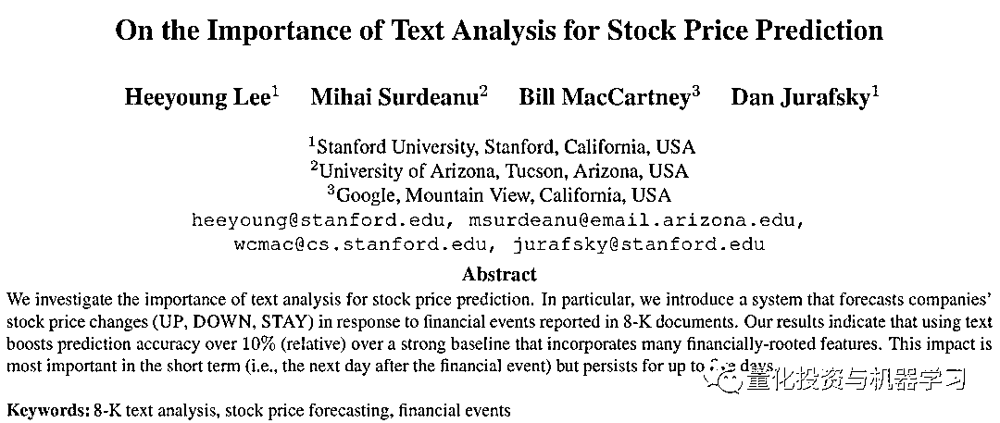

其他几篇论文下载地址如下：

*1、https://www.aaai.org/ocs/index.php/FLAIRS/FLAIRS15/paper/download/10430/10279.
2、https://careeradvancement.uchicago.edu/sites/default/files/ucib-journal/filings-volume-and-volatility.pdf3 3、https://arxiv.org/pdf/1703.03091.pdf
4、 https://arxiv.org/abs/1702.01923
5 、https://nlp.stanford.edu/pubs/lrec2014-stock.pdf*

**数据收集**

截至 2018 年 5 月，标准普尔 500 指数中所有公司的 8-K 文件都是从 SEC Edgar 数据库中使用 BeautifulSoup python 软件包获取的。文件发布的日期和时间，以及披露的类别，被提取出来，而表格和图表则被丢弃。由于数据的大小和收集所需的时间，最终设置了一个具有 8 个 Intel Xeon 内核和 52 GB 内存的 Google 云实例以及一个 Google 云。从 AlphaVantage API 收集了同一公司的历史开盘价和调整后收盘价数据。VIX 和 GSPC（S&P 500）的历史指数价格从雅虎金融（YahooFinance）下载。

部分代码：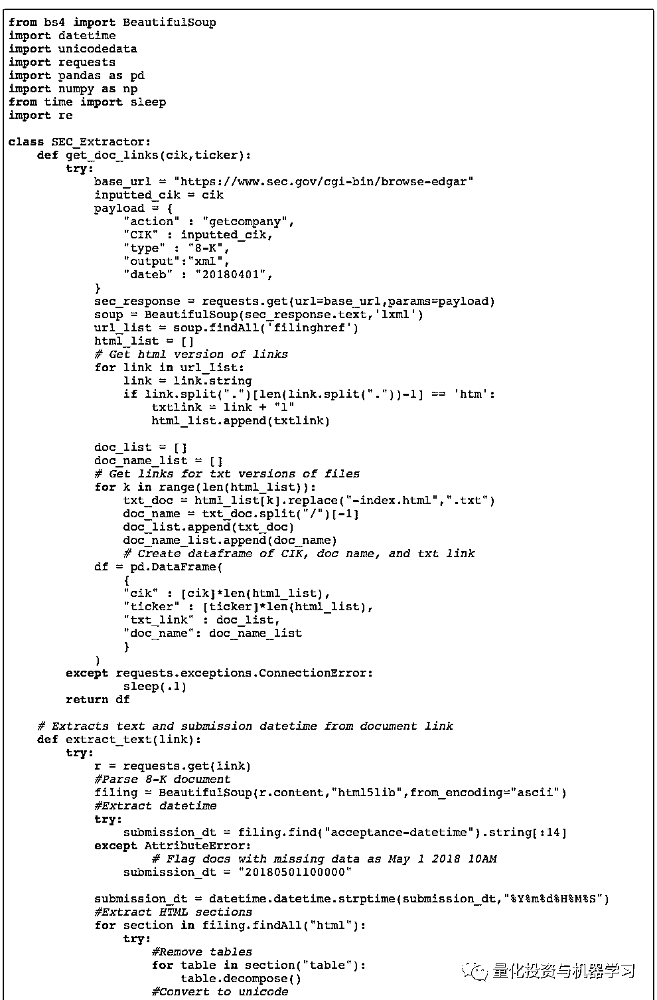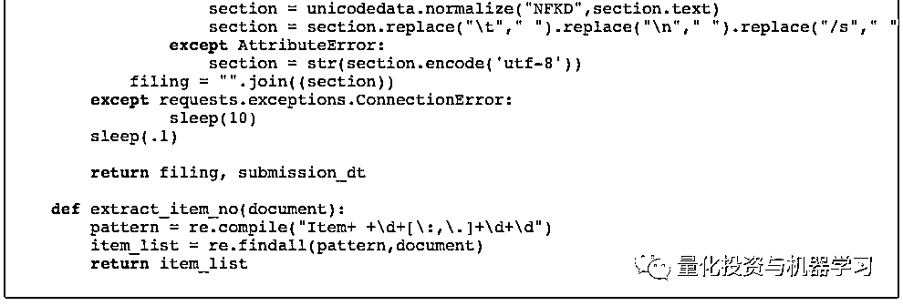

**特征工程**

对于每份发布的文件，根据文件发布前的时间计算一年、一季度和一个月的历史滑动平均价格变动，并通过标准普尔 500 指数的变化进行归一化。所有窗口均指纽约证交所和纳斯达克实际营业的日期（非假日工作日）。

表 1\. 计算历史滑动价格的滑动平均窗口

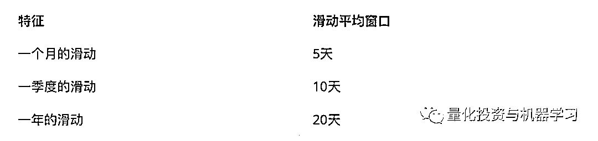

目标特征计算为文件发布前后的股权价格变化，使用标准普尔 500 指数将其标准化。例如，对于于 2018 年 2 月 5 日发布文件的公司，计算其开盘价和调整后收盘价的变化，并减去标准普尔 500 指数同期的变化。标准化变化被标记为“向上”（>1%）、向下”（<1%）或“不变”（介于-1 和 1%之间）。

**文本处理**

所有的文本都是**通过删除停用词、标点和数字、词形还原和转换为小写进行预处理的**。这是通过使用**NLTK WordNet 语料库阅读器**与**DASK**结合来**实现多线程加速**的。

所有文件都用零填充，长度统一为 34603 个字。为了保留大多数文本信息，但防止数据集变得不必要的大，在文档长度的 90%处选择了此截止值。斯坦福大学 NLP 维基百科 2014+Gigaword 5100 维度被选作欲训练词嵌入，前提是它将携带从维基百科语料库培训而来的文本中发现的专门的、行业特定的单词的信息。

表 2\. 数据特征列列表

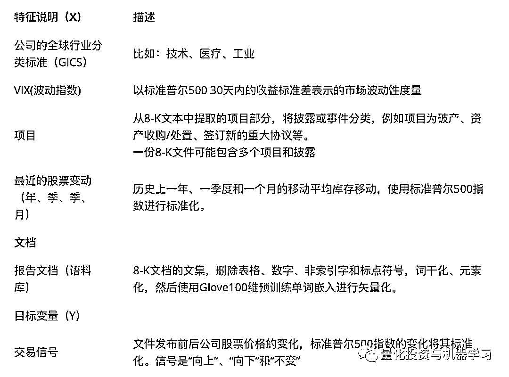

在丢弃重复样品和无法提取发布日期的文本后，最终数据集包括 2011 年至 2018 年 500 家公司的约 17000 份文件。

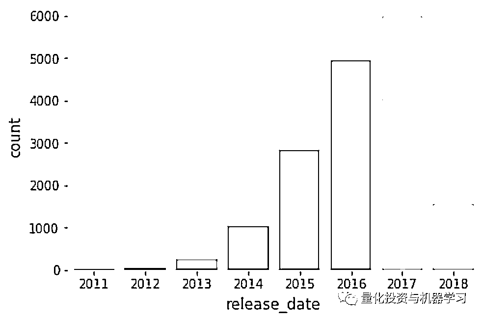

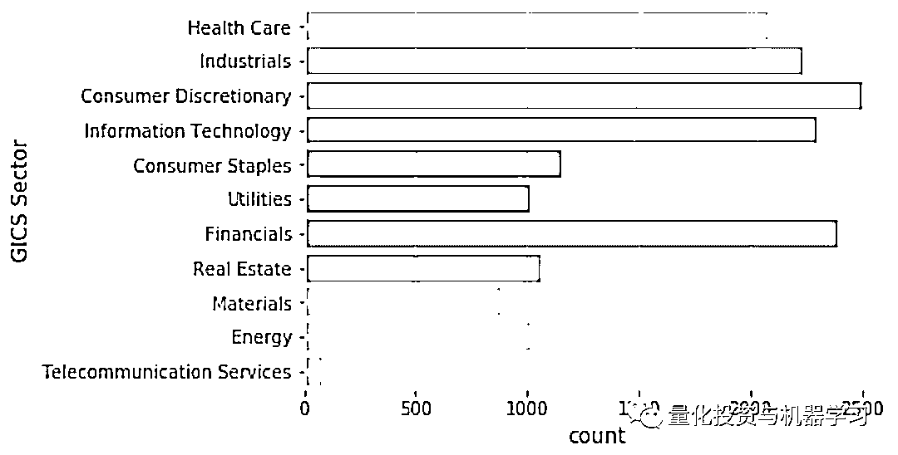

图 1&2  数据集样本规模为一年发布 8K 发布，运营部门公司

部分代码：

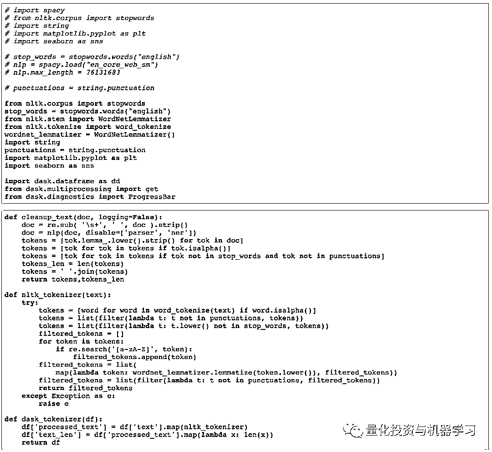

**机器学习**

所有分类特征都是一个热编码特征，连续特征。**如最近的股票走势和 VIX 的收盘价，都被标准化为平均值为 0，标准偏差为 1。**

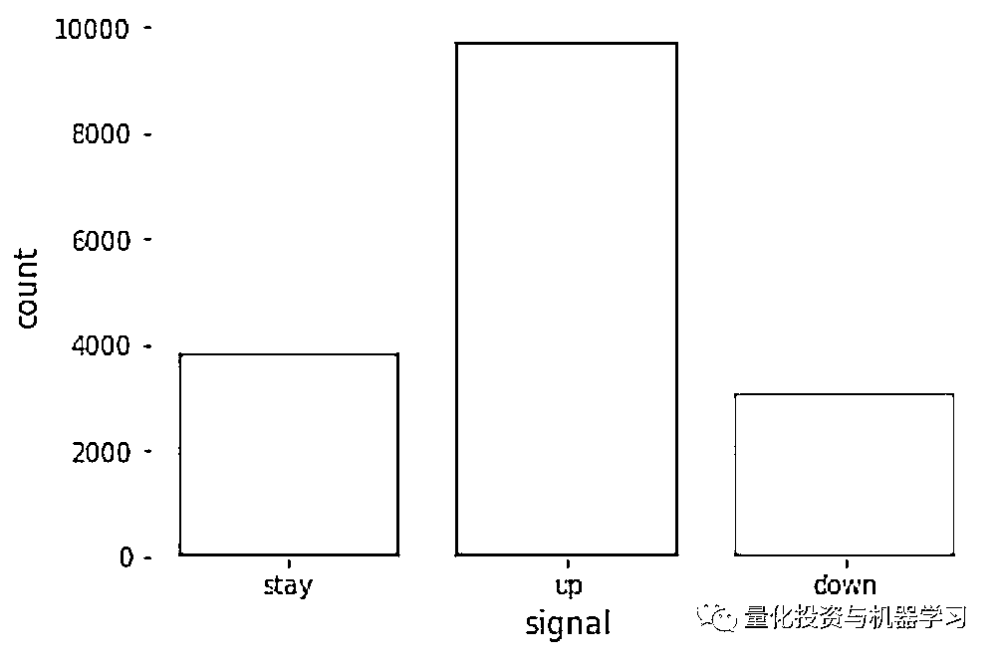

图 3 目标类别计数，数据集中类别不平衡

然后将数据集随机打乱，并分成 80%的训练集和 20%的测试集。数据集的类别不平衡，超过 50%的样本被标记为“向上”（up），考虑到过去十年标准普尔 500 指数的稳步上升，这在直觉上是合理的。为了纠正这一点，我们使用了训练数据的过采样，在每一个类别中随机选择的样本进行了重复，以使三个类别中每个类别的样本数相等。

使用带有 TensorFlow 后端的 Keras 构建了四种不同的机器学习体系结构，包括两个输入层（一个用于文本文档，一个用于功能），一个带有预训练 GloVE 向量的嵌入层，以及：

*   一个多层感知器完全连接的网络—MLP

*   两个一维卷积层—CNN

*   双向 GRU 层—RNN

*   一维卷积层，然后是 GRU 层—CNN-RNN

每个网络在两个 Nvidia K80 GPU 上接受了 10 个时期的训练，每个批次大小为 32。

表 3\. 10 次训练后验证集上的评价

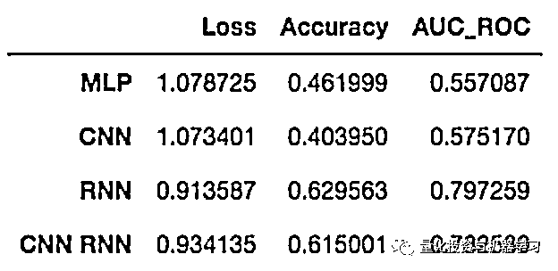

RNN 和 CNN-RNN 网络在验证数据集上获得了最高的准确性和 AUC ROC 得分。然而，CNN-RNN 模型需要 RNN 模型一半的训练时间。继续训练 CNN-RNN 模型，再进行 15 次，验证集上的损失最小。

部分模型代码：

## Build & Train Models

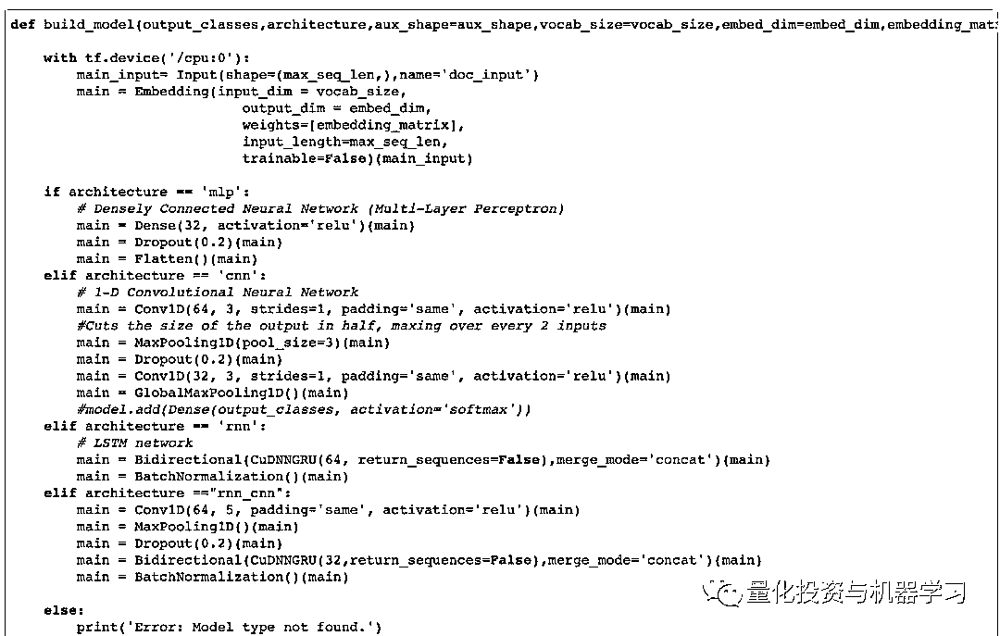

## Model Evaluation

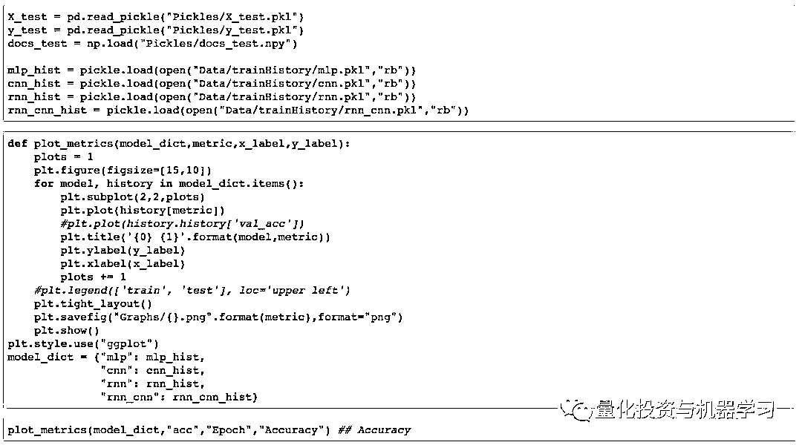

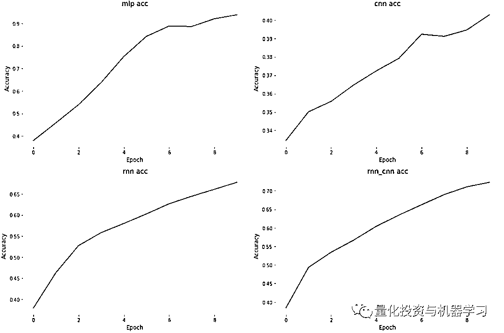

**结果**

CNN-RNN 网络在验证数据上的**准确率为 64.5%，AUC-ROC 为 0.90**。

表 4\. 23 轮训练后 CNN RNN 模型的最好表现

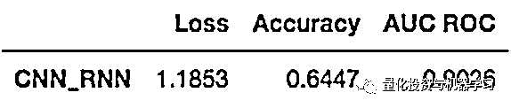

**这个模型比基线随机选择算法提高了 94%，比斯坦福大学和谷歌的论文提高了 16%。**这些结果表明，虽然字嵌入和神经网络需要更多的时间和计算资源来建立和训练，但在准确性方面的有一定的提升。

**讨论**

本文触及了如何利用最新的自然语言处理技术和深度学习模型从 SEC 报告中提取有意义的信息以及公司股价的波动。为了从文本中收集更细微的信息，可以探索更专门的单词嵌入集或高级技术如 Sense2Vec。

股票市场价格的变化只在文件发布前后立即进行测量，尽管市场很可能以不同的速度对不同类型的新闻作出反应。本文的拓展可以是在披露后的几天内考虑价格变动。

最后，尽管 CNN、RNN 和混合体系结构目前被认为是最先进的 NLP 模型，但在这些模型中，关于 RNN、LSTM 和 GRU 单元，以及关于 RNN 和 CNN 层的深度、大小和超参数，以及使用池化层还存在很多问题。时间和金钱的限制（使用多个 GPU 和处理大型数据集可以很快在谷歌云中累积）让我们不得不停止探索这些研究的可能性。尽管如此，**6****4%的准确率表明，这些努力可能值得一试，即快速从大量文本数据中提取数据，并做出交易****决策 。**

本文其他的一些参考资料：

*6、https://www.sec.gov/fast-answers/answersform8khtm.html*

*7、https://arxiv.org/abs/1511.06388*

**推荐阅读**

[01、经过多年交易之后你应该学到的东西（深度分享）](https://mp.weixin.qq.com/s?__biz=MzAxNTc0Mjg0Mg==&mid=2653289074&idx=1&sn=e859d363eef9249236244466a1af41b6&chksm=802e3867b759b1717f77e07a51ee5671e8115130c66562577280ba1243cba08218add04f1f00&token=449379994&lang=zh_CN&scene=21#wechat_redirect)

[02、监督学习标签在股市中的应用（代码+书籍）](https://mp.weixin.qq.com/s?__biz=MzAxNTc0Mjg0Mg==&mid=2653289050&idx=1&sn=60043a5c95b877dd329a5fd150ddacc4&chksm=802e384fb759b1598e500087374772059aa21b31ae104b3dca04331cf4b63a233c5e04c1945a&token=449379994&lang=zh_CN&scene=21#wechat_redirect)

[03、全球投行顶尖机器学习团队全面分析](https://mp.weixin.qq.com/s?__biz=MzAxNTc0Mjg0Mg==&mid=2653289018&idx=1&sn=8c411f676c2c0d92b0dd218f041bee4b&chksm=802e382fb759b139ffebf633ac14cdd0f21938e4613fe632d5d9231dab3d2aca95a11628378a&token=449379994&lang=zh_CN&scene=21#wechat_redirect)

[04、使用 Tensorflow 预测股票市场变动](https://mp.weixin.qq.com/s?__biz=MzAxNTc0Mjg0Mg==&mid=2653289014&idx=1&sn=3762d405e332c599a21b48a7dc4df587&chksm=802e3823b759b135928d55044c2729aea9690f86752b680eb973d1a376dc53cfa18287d0060b&token=449379994&lang=zh_CN&scene=21#wechat_redirect)

[05、使用 LSTM 预测股票市场基于 Tensorflow](https://mp.weixin.qq.com/s?__biz=MzAxNTc0Mjg0Mg==&mid=2653289238&idx=1&sn=3144f5792f84455dd53c27a78e8a316c&chksm=802e3903b759b015da88acde4fcbc8547ab3e6acbb5a0897404bbefe1d8a414265d5d5766ee4&token=2020206794&lang=zh_CN&scene=21#wechat_redirect)

[06、美丽的回测——教你定量计算过拟合概率](https://mp.weixin.qq.com/s?__biz=MzAxNTc0Mjg0Mg==&mid=2653289314&idx=1&sn=87c5a12b23a875966db7be50d11f09cd&chksm=802e3977b759b061675d1988168c1fec06c602e8583fbcc9b76f87008e0c10b702acc85467a0&token=1972390229&lang=zh_CN&scene=21#wechat_redirect)

[07、利用动态深度学习预测金融时间序列基于 Python](https://mp.weixin.qq.com/s?__biz=MzAxNTc0Mjg0Mg==&mid=2653289347&idx=1&sn=bf5d7899bc4a854d4ba9046fdc6fe0d6&chksm=802e3996b759b080287213840987bb0a0c02e4e1d4d7aae23f10a225a92ef6dd922d8006123d&token=290397496&lang=zh_CN&scene=21#wechat_redirect)

[08、Facebook 开源神器 Prophet 预测时间序列基于 Python](https://mp.weixin.qq.com/s?__biz=MzAxNTc0Mjg0Mg==&mid=2653289394&idx=1&sn=24a836136d730aa268605628e683d629&chksm=802e39a7b759b0b1dcf7aaa560699130a907716b71fc9c45ff0e5d236c5ae8ef80ebdb09dbb6&token=290397496&lang=zh_CN&scene=21#wechat_redirect)

[09、Facebook 开源神器 Prophet 预测股市行情基于 Python](https://mp.weixin.qq.com/s?__biz=MzAxNTc0Mjg0Mg==&mid=2653289437&idx=1&sn=f0dca7da8e69e7ba736992cb3d034ce7&chksm=802e39c8b759b0de5bce401c580623d0729ecca69d13926479d36e19aff8c9c9e8a20265afff&token=290397496&lang=zh_CN&scene=21#wechat_redirect)

[10、2018 第三季度最受欢迎的券商金工研报前 50（附下载）](https://mp.weixin.qq.com/s?__biz=MzAxNTc0Mjg0Mg==&mid=2653289358&idx=1&sn=db6e8ab85b08f6e67790ec0e401e586e&chksm=802e399bb759b08d6eec855f9901ea856d0da68c7425cba62791b8948da6ad761a3d88543dad&token=290397496&lang=zh_CN&scene=21#wechat_redirect)

[11、实战交易策略的精髓（公众号深度呈现）](https://mp.weixin.qq.com/s?__biz=MzAxNTc0Mjg0Mg==&mid=2653289447&idx=1&sn=f2948715bf82569a6556d518e56c1f9e&chksm=802e39f2b759b0e4502d1aaac562b87789573b55c76b3c85897d8c9d88dbf9a0b7ee34d86a4e&token=290397496&lang=zh_CN&scene=21#wechat_redirect)

[12、Markowitz 有效边界和投资组合优化基于 Python](https://mp.weixin.qq.com/s?__biz=MzAxNTc0Mjg0Mg==&mid=2653289478&idx=1&sn=f8e01a641be021993d8ef2d84e94a299&chksm=802e3e13b759b7055cf27a280c672371008a5564c97c658eee89ce8481396a28d254836ff9af&token=290397496&lang=zh_CN&scene=21#wechat_redirect)

[13、使用 LSTM 模型预测股价基于 Keras](https://mp.weixin.qq.com/s?__biz=MzAxNTc0Mjg0Mg==&mid=2653289495&idx=1&sn=c4eeaa2e9f9c10995be9ea0c56d29ba7&chksm=802e3e02b759b7148227675c23c403fb9a543b733e3d27fa237b53840e030bf387a473d83e3c&token=1260956004&lang=zh_CN&scene=21#wechat_redirect)

[14、量化金融导论 1：资产收益的程式化介绍基于 Python](https://mp.weixin.qq.com/s?__biz=MzAxNTc0Mjg0Mg==&mid=2653289507&idx=1&sn=f0ca71aa07531bbbdbd33213f0bab89f&chksm=802e3e36b759b720138b3b17a4dd0e198e054b9de29a038fdd50805f824effa55831111ad026&token=1936245282&lang=zh_CN&scene=21#wechat_redirect)

[15、预测股市崩盘基于统计机器学习与神经网络（Python+文档）](https://mp.weixin.qq.com/s?__biz=MzAxNTc0Mjg0Mg==&mid=2653289533&idx=1&sn=4ef964834e84a9995111bb057b0fc5dd&chksm=802e3e28b759b73e0618eb1262c53aa0601fbf5805525a7c7ff40dc3db62c7704496611bdbf1&token=1950551577&lang=zh_CN&scene=21#wechat_redirect)

[16、实现最优投资组合有效前沿基于 Python（附代码）](https://mp.weixin.qq.com/s?__biz=MzAxNTc0Mjg0Mg==&mid=2653289609&idx=1&sn=c7f0b3e47025862d10bb53b6ab88bcda&chksm=802e3e9cb759b78abf6b8b049c59bf18ccfb2ead7580d1f557d36de2292f59dcbd94dcd41910&token=2085008037&lang=zh_CN&scene=21#wechat_redirect)

[17、精心为大家整理了一些超级棒的机器学习资料（附链接）](https://mp.weixin.qq.com/s?__biz=MzAxNTc0Mjg0Mg==&mid=2653289615&idx=1&sn=1cdc89afb997d0c580bf0cef296d946c&chksm=802e3e9ab759b78ce9f0cd152a680d4a413d6c8dcb02a7a296f4091993a7e4137e7520394575&token=2085008037&lang=zh_CN&scene=21#wechat_redirect)

[18、海量 Wind 数据，与全网用户零距离邂逅！](https://mp.weixin.qq.com/s?__biz=MzAxNTc0Mjg0Mg==&mid=2653289623&idx=1&sn=28a3600fd7a72d7be00b066ca0f98244&chksm=802e3e82b759b7943f43a4f6ef4a91e4153fa6b8210de9590235fa8ee66eb9811ce177054dbc&token=1389401983&lang=zh_CN&scene=21#wechat_redirect)

[19、机器学习、深度学习、量化金融、Python 等最新书籍汇总下载](https://mp.weixin.qq.com/s?__biz=MzAxNTc0Mjg0Mg==&mid=2653289640&idx=1&sn=34e94fcbe99052b8e7381ecc48a36dc0&chksm=802e3ebdb759b7ab897cd329a680715b6f8294e63550ddf0c57b9e1320b2b7d1408c6fdca0c7&token=1389401983&lang=zh_CN&scene=21#wechat_redirect)

[20、各大卖方 2019 年 A 股策略报告，都是有故事的人！](https://mp.weixin.qq.com/s?__biz=MzAxNTc0Mjg0Mg==&mid=2653289725&idx=1&sn=4b65cd1fb8331438e4c0b3d0eae6b51f&chksm=802e3ee8b759b7fe1b94e84d54cc23b0ab05853d5cd227812574b350e9fc2cce9e5f1bc6cb7a&token=1389401983&lang=zh_CN&scene=21#wechat_redirect)

**如何获取代码**

在**后台**输入（严格大小写）

**NLP_Quant_1**

*—End—*

量化投资与机器学习微信公众号，是业内垂直于**Quant**、**MFE**、**CST**等专业的**主流自媒体**。公众号拥有来自**公募、私募、券商、银行、海外**等众多圈内**10W+**关注者。每日发布行业前沿研究成果和最新资讯。

