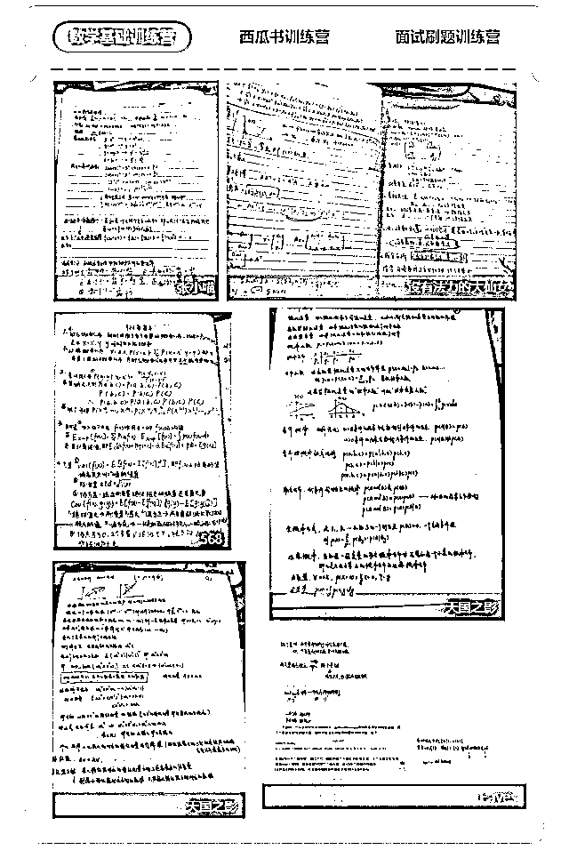
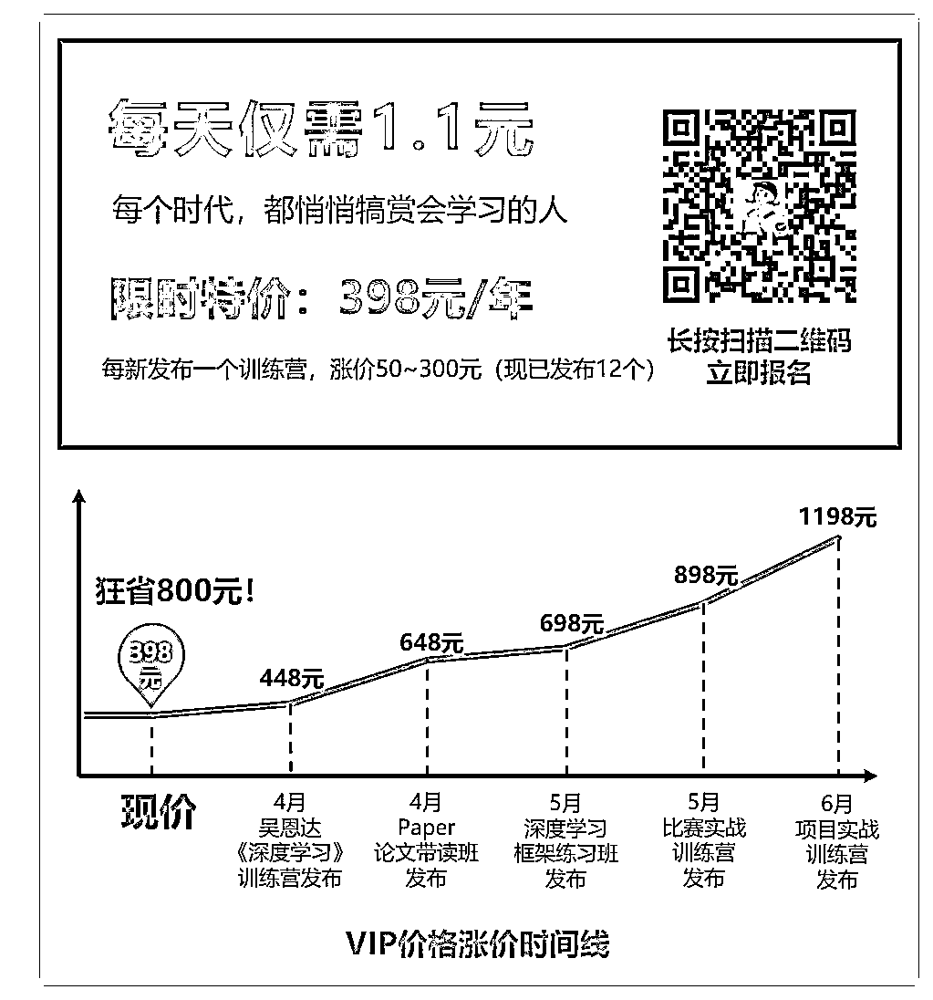
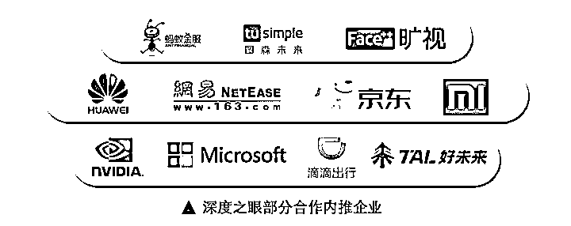

# 倒计时 3 天 | 一年学遍吴恩达、李飞飞、周志华等 17 大精品课（ML、CV、NLP 一应俱全）

> 原文：[`mp.weixin.qq.com/s?__biz=MzAxNTc0Mjg0Mg==&mid=2653291195&idx=1&sn=831b73e70b9bfe11e4ae59f13a3281df&chksm=802dc0aeb75a49b844c7e92df5b90bb3d9db72c379a84fb501a030125c8881f8d0c2df81c9a6&scene=27#wechat_redirect`](http://mp.weixin.qq.com/s?__biz=MzAxNTc0Mjg0Mg==&mid=2653291195&idx=1&sn=831b73e70b9bfe11e4ae59f13a3281df&chksm=802dc0aeb75a49b844c7e92df5b90bb3d9db72c379a84fb501a030125c8881f8d0c2df81c9a6&scene=27#wechat_redirect)

最近几个月，互联网公司缩减甚至停止社会招聘的消息不绝于耳。在各大媒体平台上，都被“互联网行业的裁员潮”刷屏了。

西瓜书训练营的一个学生找到我说：“老师，我现在特别迷茫，行业这么不景气，我觉得自己找不到工作了。”

的确，寒冬是会对职业有一定影响，但是真有你想象的那么大吗？

追求深层原因，我们可能更担心的是，**互联网泡沫少了，自己“滥竽充数”的工资也就得不到而已。**

10 月份我们技术部门招了一个实习生小哥哥，他也是我们的学员之一，刚从上家公司离职，想利用这一段时间充实自己，前两周，他成功收到了计算机视觉工程师岗位的 offer，年薪比之前翻了 2 倍。

他说，市面上很多视频课学起来是简单，但是学了依旧找不到工作。而咱们的训练营虽然用的都是难度较高的经典教材和作业，但是学完能找到好工作。 

更重要的是，这种学习氛围和明确的学习计划能督促他坚持学完，而不是让资料在百度云里积着灰。

所以

如果你不想被行业淘汰

如果你想寻求良好的学习氛围和一群志同道合的小伙伴

如果你经常在深度之眼学习，报名其他课程时想要更多折扣

如果你想在 2019 年努力上进，就让【深度之眼】帮你设计进击学习计划！带你学遍全球好课（好书）！

**欢迎加入【深度之眼】2019 年 VIP 会员：**

**首创最佳学习模式**

**内容：**由浅入深，教材均为经典知名书籍或课程，优中选优

**实战：**将抽象的理论知识嵌入比赛代码，学以致用

**打卡：**严格按照阶段划分学习任务，治好你的拖延症

**社群**：微信群及时交流+知识星球精选内容回顾

**活动：**不定期组队比赛、头脑风暴，彻底引爆你的学习力

**只****要认真跟着训练营学习，我们保证结营时，你一定能收获“面试级”的能力。**

部分训练营学员作业

**学员评价**

已累计服务 1W+学员，好评如潮

其中《机器学习》西瓜书训练营，在网易云课堂上，更是机器学习细分类目全网唯二的**五星好评**课程！

睁开眼，阳光和你都在～

可上下滑动，查看部分学员评价

**398 元存在余额宝里，一年可以赚 7 块钱** 

**花在自己身上，则可能让你的年薪增加 10—20 万**

**作为一个聪明人，你要怎么选？**

如果，你愿意加入我们

你不仅能掌握 AI 工程师必备能力

**学习技巧+实战能力+参赛****经****验**

还能结识一群志同道合的伙伴

**学员来自：40%以上 985 学校，60%以上 211 学校**

一个人难免有扛不住的时候 

但一群人注定走得更远

**4 月 1 日将涨价至 448 元！！**

**同时支持****支付宝花呗分期，每月低至 33 元**

**添加班主任微信获取分期付款码！**

**（我们帮你付花呗分期利息！）**

报名成功后请添加班主任微信发送支付截图进 VIP 内部群

开启你的升级之旅

备注：报名成功后，请及时添加班主任微信，如有任何问题，也请添加班主任微信咨询。

**名企合作**

截止目前，我们已经和**多家国内知名在线教育平台和比赛机构**建立了合作关系，只为给大家提供最优质的学习服务：

除此之外，已经有超过**15 家知名互联网企业**和我们建立了内推合作，旨在帮助同学们更加快捷、有效地找到工作： 

**顶级导师团助力**

我们使用的教材都是国内或者全球知名经典的课程或者书籍，均由知名大咖亲授，这也保证了学习内容的质量。 

同时，深度之眼的导师团和助教团也实行**360 度服务**，包括：小组微信群、1V1 答疑、直播答疑、作业讲解等，通过这些方式，全方位保证同学们的学习质量和体验。

**购买须知**

**Q、会员有效期多久？**

A、2019 年 1 月 1 日后报名：会员有效期由报名之日起 1 年

**Q、课程资料在哪里看？**

A、所有的课程资料均会在训练营上传。

**Q、报名后可以退款吗？**

A、本服务为虚拟内容产品，一经购买，概不退款，敬请谅解。

**Q、可以开具发票吗？**

A、可以开具普通发票，请联系微信班主任填写需要的信息即可。