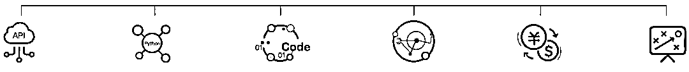

# 加入顶尖对冲基金 Point72，和 Billions 大佬面对面！

> 原文：[`mp.weixin.qq.com/s?__biz=MzAxNTc0Mjg0Mg==&mid=2653291180&idx=1&sn=04858d7d50c14bb52659b0e82ea9adef&chksm=802dc0b9b75a49af5f1bd549098126b349e8ad7432f0a88bf1f835d0c0ed4052a408bce594c8&scene=27#wechat_redirect`](http://mp.weixin.qq.com/s?__biz=MzAxNTc0Mjg0Mg==&mid=2653291180&idx=1&sn=04858d7d50c14bb52659b0e82ea9adef&chksm=802dc0b9b75a49af5f1bd549098126b349e8ad7432f0a88bf1f835d0c0ed4052a408bce594c8&scene=27#wechat_redirect)

**标星★公众号**，第一时间获取最新研究

**近期原创文章：**

## ♥ [基于无监督学习的期权定价异常检测（代码+数据）](https://mp.weixin.qq.com/s?__biz=MzAxNTc0Mjg0Mg==&mid=2653290562&idx=1&sn=dee61b832e1aa2c062a96bb27621c29d&chksm=802dc257b75a4b41b5623ade23a7de86333bfd3b4299fb69922558b0cbafe4c930b5ef503d89&token=1298662931&lang=zh_CN&scene=21#wechat_redirect)

## ♥ [5 种机器学习算法在预测股价的应用（代码+数据）](https://mp.weixin.qq.com/s?__biz=MzAxNTc0Mjg0Mg==&mid=2653290588&idx=1&sn=1d0409ad212ea8627e5d5cedf61953ac&chksm=802dc249b75a4b5fa245433320a4cc9da1a2cceb22df6fb1a28e5b94ff038319ae4e7ec6941f&token=1298662931&lang=zh_CN&scene=21#wechat_redirect)

## ♥ [深入研读：利用 Twitter 情绪去预测股市](https://mp.weixin.qq.com/s?__biz=MzAxNTc0Mjg0Mg==&mid=2653290402&idx=1&sn=efda9ea106991f4f7ccabcae9d809e00&chksm=802e3db7b759b4a173dc8f2ab5c298ab3146bfd7dd5aca75929c74ecc999a53b195c16f19c71&token=1330520237&lang=zh_CN&scene=21#wechat_redirect)

## ♥ [Two Sigma 用新闻来预测股价走势，带你吊打 Kaggle](https://mp.weixin.qq.com/s?__biz=MzAxNTc0Mjg0Mg==&mid=2653290456&idx=1&sn=b8d2d8febc599742e43ea48e3c249323&chksm=802e3dcdb759b4db9279c689202101b6b154fb118a1c1be12b52e522e1a1d7944858dbd6637e&token=1330520237&lang=zh_CN&scene=21#wechat_redirect)

## ♥ [利用深度学习最新前沿预测股价走势](https://mp.weixin.qq.com/s?__biz=MzAxNTc0Mjg0Mg==&mid=2653290080&idx=1&sn=06c50cefe78a7b24c64c4fdb9739c7f3&chksm=802e3c75b759b563c01495d16a638a56ac7305fc324ee4917fd76c648f670b7f7276826bdaa8&token=770078636&lang=zh_CN&scene=21#wechat_redirect)

## ♥ [一位数据科学 PhD 眼中的算法交易](https://mp.weixin.qq.com/s?__biz=MzAxNTc0Mjg0Mg==&mid=2653290118&idx=1&sn=a261307470cf2f3e458ab4e7dc309179&chksm=802e3c93b759b585e079d3a797f512dfd0427ac02942339f4f1454bd368ba47be21cb52cf969&token=770078636&lang=zh_CN&scene=21#wechat_redirect)

## ♥ [基于 RNN 和 LSTM 的股市预测方法](https://mp.weixin.qq.com/s?__biz=MzAxNTc0Mjg0Mg==&mid=2653290481&idx=1&sn=f7360ea8554cc4f86fcc71315176b093&chksm=802e3de4b759b4f2235a0aeabb6e76b3e101ff09b9a2aa6fa67e6e824fc4274f68f4ae51af95&token=1865137106&lang=zh_CN&scene=21#wechat_redirect)

## ♥ [人工智能『AI』应用算法交易，7 个必踩的坑！](https://mp.weixin.qq.com/s?__biz=MzAxNTc0Mjg0Mg==&mid=2653289974&idx=1&sn=88f87cb64999d9406d7c618350aac35d&chksm=802e3fe3b759b6f5eca6e777364270cbaa0bf35e9a1535255be9751c3a77642676993a861132&token=770078636&lang=zh_CN&scene=21#wechat_redirect)

## ♥ [神经网络在算法交易上的应用系列（一）](https://mp.weixin.qq.com/s?__biz=MzAxNTc0Mjg0Mg==&mid=2653289962&idx=1&sn=5f5aa65ec00ce176501c85c7c106187d&chksm=802e3fffb759b6e9f2d4518f9d3755a68329c8753745333ef9d70ffd04bd088fd7b076318358&token=770078636&lang=zh_CN&scene=21#wechat_redirect)

## ♥ [预测股市 | 如何避免 p-Hacking，为什么你要看涨？](https://mp.weixin.qq.com/s?__biz=MzAxNTc0Mjg0Mg==&mid=2653289820&idx=1&sn=d3fee74ba1daab837433e4ef6b0ab4d9&chksm=802e3f49b759b65f422d20515942d5813aead73231da7d78e9f235bdb42386cf656079e69b8b&token=770078636&lang=zh_CN&scene=21#wechat_redirect)

## ♥ [如何鉴别那些用深度学习预测股价的花哨模型？](https://mp.weixin.qq.com/s?__biz=MzAxNTc0Mjg0Mg==&mid=2653290132&idx=1&sn=cbf1e2a4526e6e9305a6110c17063f46&chksm=802e3c81b759b597d3dd94b8008e150c90087567904a29c0c4b58d7be220a9ece2008956d5db&token=1266110554&lang=zh_CN&scene=21#wechat_redirect)

## ♥ [优化强化学习 Q-learning 算法进行股市](https://mp.weixin.qq.com/s?__biz=MzAxNTc0Mjg0Mg==&mid=2653290286&idx=1&sn=882d39a18018733b93c8c8eac385b515&chksm=802e3d3bb759b42d1fc849f96bf02ae87edf2eab01b0beecd9340112c7fb06b95cb2246d2429&token=1330520237&lang=zh_CN&scene=21#wechat_redirect)

▎本文由 Wind 授权转载

如果你希望 2019 年在 Point72 找到一份工作，你可以通过 Point72 研究员来进行申请。具体链接：*https://www.point72.com/academy/*

在这里，我们给大家介绍一下 Point72 研究院。

****Point72 研究院****

*Imagine a company that takes you on a year-long journey of learning and discovery, at the end of which you’ve become a highly-trained, deeply knowledgeable Research Analyst ready to contribute your research and ideas. That’s right – roughly ten months dedicated entirely to your development. That’s what the Point72 Academy can do for you – and it’s something no other Firm does. Are you ready to start your investing career?*

先看看研究院视频介绍：

**高、大、上**

[`mp.weixin.qq.com/mp/readtemplate?t=pages/video_player_tmpl&action=mpvideo&auto=0&vid=wxv_737850546744377346`](https://mp.weixin.qq.com/mp/readtemplate?t=pages/video_player_tmpl&action=mpvideo&auto=0&vid=wxv_737850546744377346)

在 Point72 建立自己的职业生涯，成为一名优秀的投资者。

这个计划分为 5 个阶段：

**▎阶段一：全球案例大赛**

一年一度的全球案例大赛让你有机会与你的团队一起向 Point72 展示你们的投资技巧。你还有机会将获得一次全额费用的旅行，向 Point72 的顶级投资专业人士展示你们的案例。去年还向竞赛获胜者颁发了超过**2.4 万美元的现金和奖品**。

**▎阶段二：学术峰会**

作为峰会的参与者，你将与你的同行、我们的投资组合经理、分析师和学院教师进行小组合作，**学习前所未有的投资方式**。

**▎阶段三：暑期实习项目**

在这 10 周的实习中，你将接受研究院工作人员的培训，**由投资专家指导，并由研究院毕业生指导**。暑期实习项目是 Point72 研究院（全日制）最重要的项目。我们非常谨慎地雇佣每一位暑期实习生，并希望他们中的大多数能在毕业时收到重返 Point72 研究院项目的 offer。2020 年暑期实习申请截止日期为 2019 年 5 月 1 日。

**▎阶段四：金融分析师计划**

学期最后一年的学生被邀请参加为期 10 个月的强化培训项目，旨在教你在 Point72 开始投资生涯所需的技能。你将**花费 2500 多个小时学习创建和完善金融模型**，进行初步研究，准备股票推荐以及有效地传达你的投资理念。

**▎阶段五：开始在 Point72 职业生涯**

Point72 基于你的技能、能力和职业道德，为你提供了一条通往成功职业生涯的清晰道路。如果你在课程中一直表现出色，你将有机会继续留在 Point72 作为投资专业人士。

***An experience like no other***

*“Point72 研究院将帮助你以一种前所未有的方式思考市场。我们将把你对研究和投资的热情转化为你作为 Point72 分析师所需要的技能。”*

Point72 研究院招募和培训大学毕业生，以速成的培训方式将其培养成为多/空股票投资专业人士。在 12 个月的金融分析师课程期间，学院课程学员将花费 2500 多个小时的时间学习创建和完善金融模型，开展初级研究，策划股票建议，并有效地传递其理念。

学院主任 Jaimi Goodfriend 表示，“Point72 学院转变了我们招募和培养青年投资人才的方式。首期学院课程班的才华和成就让我们大吃一惊，坦率来讲，甚至让我们感到汗颜。我们成功地将 2015 届的每位毕业生安置到我们的投资平台上。”

Point72 国际业务首席执行官 Marc Desmidt 表示：“我们可以将 Point72 在美国的投资方式教给青年才俊，并向他们提供直接与所在区域的投资组合经理共事的机会。”

**2019 学院计划**

从 2019 年开始，Point72 研究院将为其 10 个月的课程开设三个不同的班级，预计开课日期为**4 月 29 日，7 月 15 日和 10 月 7 日**。

2017 年，该计划开始接受少数具有一定专业经验的候选人。这个“年轻的专业人士小组”是与本科学生分开培训的。到 2019 年，两个小组将混合起来，并考虑创造更多的学习机会。

在一开始，研究院更像是一所学校而非实习。最初的几个月实际上花在了课堂上，学习了买方职业生涯所需的所有基础知识：会计，金融建模，业务运营和数据分析等。在课程的第二部分，学生将学习如何利用这些技能来研究公司和股票。学生还将听取目前 Point72 投资专业人士以及沃顿商学院和哈佛商学院的专家意见。该计划的最后三分之一是更多动手实践。

**前 ****1％**

如果你想参加这个计划，你可能会面临一些激烈的竞争。 2015 年，Point72 收到了约 400 份申请人。这个数字今年增加到大约**12k**，这意味着只有不到 1%的才能最终入选。

**Point72 最有趣的领域**

Point72 首席市场情报官 Matthew Granade 在本月早些时候说：**“我们在数据科学和机器学习方面投入了大量资金。在未来 7 到 10 年内，我们对待对冲基金的观点是：****人加机器****”**

Granade 说：“机器最擅长于投资组合的构建和执行，以及纠正投资组合的偏差。人类最擅长的是，解释公司内部相当复杂和微妙的情况”。

Point72 同时运营着三个团队：一个是自由投资团队，数百人在与管理团队会面并将自己的想法应验证后，做出投资决策；一个是系统化的投资团队，由人和机器创建算法来做出投资决策；最后就是他的人与机器协同工作的混合团队。

如果你有兴趣也可以直接投递简历。

**万得 WQFA 计划**

如果你觉得出国有些困难，或想在国内继续发展，**Wind 作为中国大陆领先的金融数据、信息和软件服务企业**。推出了 WQFA 人才培养计划（**全免费**），旨在：

**培养金融行业高端量化人才**

**WQFA **英文全称 WindQuant Quantitative Finance Analyst（**万矿量化金融分析师**）。由 Wind 旗下量化云平台万矿联合众多金融机构以及高校，共同开展的一项专业量化人才培养计划。

**WQFA 课程体系与培养方案**

基于 Wind 金融终端与万矿量化云平台，从**Wind****数据 API 教学****、Python 编程、量化策略开发、量化交易实战、投资市场前沿、数理统计分析**等方面搭建**全方位学习矩阵**。

通过**在线课程学习**与**线下导师教学**，让学员全面系统地掌握量化策略的开发与实战。从入门到精通，课程分为**初、中、高三个阶段**，学员需通过进阶考试才能进入后面阶段的学习与培训。WQFA 的课程大纲：

WQFA 中级、高级课程导师均来自国内顶尖的**金融机构和行业大咖**。部分导师名单：

参加培养计划的学员通过阶段考核后可获得**高含金量结业证书****。**同时，有机会**推荐各大金融机构实习与就业**等。**阅读原文**免费原文报名！

*—End—*

量化投资与机器学习微信公众号，是业内垂直于**Quant**、**MFE**、**CST**等专业的**主流自媒体**。公众号拥有来自**公募、私募、券商、银行、海外**等众多圈内**10W+**关注者。每日发布行业前沿研究成果和最新资讯。

点击阅读原文，加入**WQFA 计划**