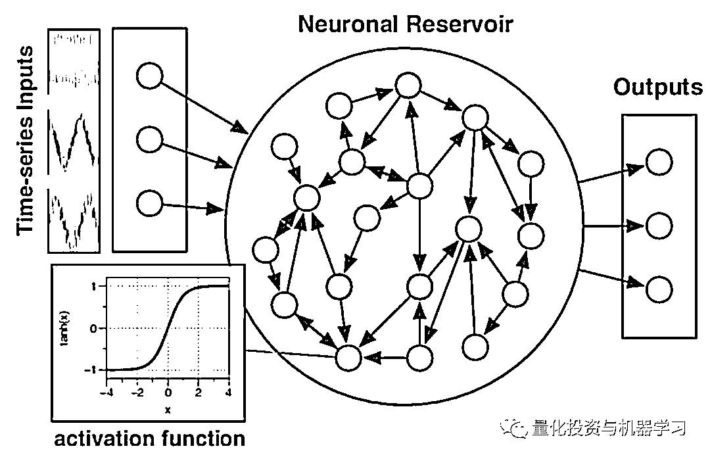

# 最新 | 基于回声状态网络预测股票价格（附代码）

> 原文：[`mp.weixin.qq.com/s?__biz=MzAxNTc0Mjg0Mg==&mid=2653291171&idx=1&sn=485a35e564b45046ff5a07c42bba1743&chksm=802dc0b6b75a49a07e5b91c512c8575104f777b39d0e1d71cf11881502209dc399fd6f641fb1&scene=27#wechat_redirect`](http://mp.weixin.qq.com/s?__biz=MzAxNTc0Mjg0Mg==&mid=2653291171&idx=1&sn=485a35e564b45046ff5a07c42bba1743&chksm=802dc0b6b75a49a07e5b91c512c8575104f777b39d0e1d71cf11881502209dc399fd6f641fb1&scene=27#wechat_redirect)

**标星★公众号**，第一时间获取最新研究

# 本期作者：Matthew Stewart

本期编译：1+1=6

**近期原创文章：**

## ♥ [基于无监督学习的期权定价异常检测（代码+数据）](https://mp.weixin.qq.com/s?__biz=MzAxNTc0Mjg0Mg==&mid=2653290562&idx=1&sn=dee61b832e1aa2c062a96bb27621c29d&chksm=802dc257b75a4b41b5623ade23a7de86333bfd3b4299fb69922558b0cbafe4c930b5ef503d89&token=1298662931&lang=zh_CN&scene=21#wechat_redirect)

## ♥ [5 种机器学习算法在预测股价的应用（代码+数据）](https://mp.weixin.qq.com/s?__biz=MzAxNTc0Mjg0Mg==&mid=2653290588&idx=1&sn=1d0409ad212ea8627e5d5cedf61953ac&chksm=802dc249b75a4b5fa245433320a4cc9da1a2cceb22df6fb1a28e5b94ff038319ae4e7ec6941f&token=1298662931&lang=zh_CN&scene=21#wechat_redirect)

## ♥ [深入研读：利用 Twitter 情绪去预测股市](https://mp.weixin.qq.com/s?__biz=MzAxNTc0Mjg0Mg==&mid=2653290402&idx=1&sn=efda9ea106991f4f7ccabcae9d809e00&chksm=802e3db7b759b4a173dc8f2ab5c298ab3146bfd7dd5aca75929c74ecc999a53b195c16f19c71&token=1330520237&lang=zh_CN&scene=21#wechat_redirect)

## ♥ [Two Sigma 用新闻来预测股价走势，带你吊打 Kaggle](https://mp.weixin.qq.com/s?__biz=MzAxNTc0Mjg0Mg==&mid=2653290456&idx=1&sn=b8d2d8febc599742e43ea48e3c249323&chksm=802e3dcdb759b4db9279c689202101b6b154fb118a1c1be12b52e522e1a1d7944858dbd6637e&token=1330520237&lang=zh_CN&scene=21#wechat_redirect)

## ♥ [利用深度学习最新前沿预测股价走势](https://mp.weixin.qq.com/s?__biz=MzAxNTc0Mjg0Mg==&mid=2653290080&idx=1&sn=06c50cefe78a7b24c64c4fdb9739c7f3&chksm=802e3c75b759b563c01495d16a638a56ac7305fc324ee4917fd76c648f670b7f7276826bdaa8&token=770078636&lang=zh_CN&scene=21#wechat_redirect)

## ♥ [一位数据科学 PhD 眼中的算法交易](https://mp.weixin.qq.com/s?__biz=MzAxNTc0Mjg0Mg==&mid=2653290118&idx=1&sn=a261307470cf2f3e458ab4e7dc309179&chksm=802e3c93b759b585e079d3a797f512dfd0427ac02942339f4f1454bd368ba47be21cb52cf969&token=770078636&lang=zh_CN&scene=21#wechat_redirect)

## ♥ [基于 RNN 和 LSTM 的股市预测方法](https://mp.weixin.qq.com/s?__biz=MzAxNTc0Mjg0Mg==&mid=2653290481&idx=1&sn=f7360ea8554cc4f86fcc71315176b093&chksm=802e3de4b759b4f2235a0aeabb6e76b3e101ff09b9a2aa6fa67e6e824fc4274f68f4ae51af95&token=1865137106&lang=zh_CN&scene=21#wechat_redirect)

## ♥ [人工智能『AI』应用算法交易，7 个必踩的坑！](https://mp.weixin.qq.com/s?__biz=MzAxNTc0Mjg0Mg==&mid=2653289974&idx=1&sn=88f87cb64999d9406d7c618350aac35d&chksm=802e3fe3b759b6f5eca6e777364270cbaa0bf35e9a1535255be9751c3a77642676993a861132&token=770078636&lang=zh_CN&scene=21#wechat_redirect)

## ♥ [神经网络在算法交易上的应用系列（一）](https://mp.weixin.qq.com/s?__biz=MzAxNTc0Mjg0Mg==&mid=2653289962&idx=1&sn=5f5aa65ec00ce176501c85c7c106187d&chksm=802e3fffb759b6e9f2d4518f9d3755a68329c8753745333ef9d70ffd04bd088fd7b076318358&token=770078636&lang=zh_CN&scene=21#wechat_redirect)

## ♥ [预测股市 | 如何避免 p-Hacking，为什么你要看涨？](https://mp.weixin.qq.com/s?__biz=MzAxNTc0Mjg0Mg==&mid=2653289820&idx=1&sn=d3fee74ba1daab837433e4ef6b0ab4d9&chksm=802e3f49b759b65f422d20515942d5813aead73231da7d78e9f235bdb42386cf656079e69b8b&token=770078636&lang=zh_CN&scene=21#wechat_redirect)

## ♥ [如何鉴别那些用深度学习预测股价的花哨模型？](https://mp.weixin.qq.com/s?__biz=MzAxNTc0Mjg0Mg==&mid=2653290132&idx=1&sn=cbf1e2a4526e6e9305a6110c17063f46&chksm=802e3c81b759b597d3dd94b8008e150c90087567904a29c0c4b58d7be220a9ece2008956d5db&token=1266110554&lang=zh_CN&scene=21#wechat_redirect)

## ♥ [优化强化学习 Q-learning 算法进行股市](https://mp.weixin.qq.com/s?__biz=MzAxNTc0Mjg0Mg==&mid=2653290286&idx=1&sn=882d39a18018733b93c8c8eac385b515&chksm=802e3d3bb759b42d1fc849f96bf02ae87edf2eab01b0beecd9340112c7fb06b95cb2246d2429&token=1330520237&lang=zh_CN&scene=21#wechat_redirect)

*“There (is) order and even great beauty in what looks like total chaos. If we look closely enough at the randomness around us, patterns will start to emerge.” *

*― Aaron Sorkin*

**时间序列预测基本准则**

**股票市场通常被认为是一个混沌的时间序列**，前沿的随机方法经常被一些机构用来尝试做出合理准确的预测，以便他们能够占上风并赚钱。这本质上是所有投资银行业务背后的理念，尤其是那些市场交易员。 

作为科学家，我们确实对机器学习和随机方法有相当的了解。该领域最大的问题之一是试图以可靠的方式准确预测混沌时间序列。预测混沌系统动力学的想法有点违反直觉，因为从定义上讲，混沌并不会以可预测的方式表现。

时间序列的研究在股票市场诞生之前就已经存在了。随着时间的推移，时间序列的受欢迎程度显著上升。为了做到这一点，人们必须开发基于先前信息估计市场趋势的可靠方法。

首先，让我们讨论一下时间序列的一些性质，使它们易于分析，这样我们就能理解为什么当我们看股票市场时，时间序列分析会变得相当困难。

## **平稳性**

在时间序列分析中，平稳性是时间序列分析的基础。

**时间序列的平稳性是其基本的假设，只有基于平稳时间序列的预测才是有效的**。平稳性有强平稳和弱平稳之分，在一般条件下，**我们所说的平稳时间序列指的是弱平稳时间序列。**

下图中第一张图为上证综指部分年份的收盘价，是一个非平稳时间序列；第二张图是其收益率。而第三第四张图为收益率的 n 阶差分，为平稳时间序列。


平稳性是金融时间序列分析的基础。同时，平稳性又分为了严平稳（strictly stationary）和弱平稳（weekly stationary）。

‍‍‍‍‍‍‍‍‍‍严平稳是一个很强的条件，难以用经验方法验证。经常假定的是平稳性的一个较弱的方式。


我们看到上证综指在 1996 年 1 月 1 日至 2018 年 1 年 1 间的月对数收益率在 0 值上下变化。在统计上，**这种现象表明收益率的均值不随时间变化，或者说，期望收益率具有时间不变性。**

上图也印证了这一点，除了在 1990 年至 1995 年的波动外，月对数收益率的范围大约在区间 [-0.2,0.2]。在统计上，**该特征表明对数收益率的方差不随时间变化**。

正式的说：

如果一个时间序列 <nobr aria-hidden="true">Xt 的一阶矩和二阶矩（均值和方差）具有时间不变性，则称它为弱平稳的（weekly stationary）。</nobr>

<nobr aria-hidden="true">弱平稳为预测提供了基础的框架。我们有理由相信沪深 300 未来的月收益率大约在 0 值左右，并且在 [-0.2,0.2]之间变化。</nobr>

<nobr aria-hidden="true">**在金融文献中，通常假定资产收益率序列式若平稳的，只要有足够多的历史数据，这个假定可以用实证方法验证。**</nobr>

<nobr aria-hidden="true">**如何检验平稳性？**</nobr>

*   <nobr aria-hidden="true">观察时间序列图</nobr>

*   <nobr aria-hidden="true">观察 ACF 和 PACF 图</nobr>

*   <nobr aria-hidden="true">单位根检验</nobr> 

## 

<nobr aria-hidden="true">通过 ACF、PACF 图来判断时间序列的平稳性时，是以最直观的角度去看的，单位根检验会更加客观、准确的检验时间序列的平稳性。</nobr>

<nobr aria-hidden="true">常见的单位根检验方法有 DF 检验（Dickey-Fuller Test），ADF 检验（Augmented Dickey-Fuller Test）和 PP 检验（Phillips-Perron Test）。ADF 的原假设为序列有单位根（非平稳）H0，备择假设为序列是平稳的 H1。对于一个平稳的时序数据，就需要在给定的置信水平上显著，拒绝原假设。</nobr>

<nobr aria-hidden="true">现在我们对时间序列有了更多的了解，我们可以看看人们研究时间序列的传统方式，他们如何开发模型，以及为什么它们不足以研究股票市场。</nobr>

<nobr aria-hidden="true">**时间序列预测的基本方法**</nobr>

<nobr aria-hidden="true">最基本的方法是如此简单，大多数人不需要上时间序列分析的课就能想到它们，最简单模型：移动平均线。本质上，移动平均取最后一个 t 值并取它们的平均值作为下一个点的预测。</nobr> 

<nobr aria-hidden="true">移动平均是惊人的准确，对异常值和短期波动的鲁棒性可以通过改变之前在平均过程中使用的点数来控制。</nobr>

<nobr aria-hidden="true">然后逐级递增模型复杂度，如指数平滑。这类似于移动平均线，只是它是一个加权过程，对最近的数据点给予更高的权重。指数平滑中使用的特殊加权函数是指数函数，但是这个过程可以使用不同的方法加权。</nobr>

<nobr aria-hidden="true">这些方法对于相对一致和周期性的时间序列来说是很好的，但是对那些表现出季节性和持久的线性趋势或混沌性质相结合的时间序列来说很难适用。</nobr>

<nobr aria-hidden="true">分析具有不同自相关水平的时间序列的一种非常流行的方法叫做 Holtz linear 模型。Holtz 扩展了简单指数平滑，允许预测数据的趋势。它只不过是指数平滑应用于水平（序列的平均值）和趋势。为了用数学符号表达这一点，需要三个方程：一个用于水平，一个用于趋势，一个用于组合水平和趋势以获得预期的预测ŷ。</nobr>

<nobr aria-hidden="true"></nobr>

<nobr aria-hidden="true">另一个很流行的方法是：ARIMA。它包含了移动平均线和自回归特征（查看后续时间步长之间的相关性）。ARIMA 模型遵循特定的方法。</nobr>

<nobr aria-hidden="true"></nobr>

<nobr aria-hidden="true">所有这些方法都依赖于具有某种自相关或周期性的平稳时间序列。这一特性在股市中是不存在的。确实有股票市场波动的时候，这些在大学的经济学课上都有详细的研究。然而，个别公司的股票会受到政治、社会经济和社会因素的影响。从时间序列模型的角度来看，这些因素本质上是随机和混乱的。此外，人们对这些波动的理解还不够准确，无法根据它们的存在对经济市场的未来做出有用的预测。这也是很有道理的，否则每个人都去这么做了。</nobr>

<nobr aria-hidden="true">**神经网络**</nobr>

<nobr aria-hidden="true">神经网络似乎适用于任何涉及非线性特征空间的情况。事实上，RNN 已经被用来预测股票市场。然而，在预测股票价格方面，RNN 面临着几个挑战，最明显的是与 RNN 相关的梯度消失问题。</nobr> 

<nobr aria-hidden="true">到目前为止，RNN 最重要的问题是梯度消失问题。这个问题来自于这样一个事实，即通过称为反向传播的过程优化非常深的神经网络使用每层之间的导数来“学习”。这些衍生可以相对较小，也可以相对较大。如果我们的网络有 100 个隐藏层，将一个小数字乘以 100 次，则该值基本上消失了，如果所有的梯度都为零，我们的网络就什么也学不到，该怎么办？</nobr>

<nobr aria-hidden="true">有三个解决办法：</nobr>

<nobr aria-hidden="true">1、Clipping gradients method</nobr>

<nobr aria-hidden="true">2、Special RNN with leaky units such as Long-Short-Term-Memory (LSTM) and Gated Recurrent Units (GRU)</nobr>

<nobr aria-hidden="true">3、Echo states RNNs</nobr>

<nobr aria-hidden="true">梯度裁剪可以防止梯度变得太大或太小，但是这样做仍然会丢失信息，所以这不是一个理想的方法。 RNN with leaky units 是很好的，并且是大多数个人和公司将 RNN 用于商业目的标准技术。这些算法通过某种形式的梯度下降调整所有连接（输入、循环、输出）。这会使得这些算法变慢，甚至可能更加麻烦，使得学习过程容易受到分叉的干扰，不能保证收敛。因此，RNN 在实际工程应用中很少得到应用。</nobr>

<nobr aria-hidden="true">**回声状态网络（Echo State Network）**的用武之地来了。回声状态网络是一个相对较新的发明，它本质上是一个具有松散连接隐层的递归神经网络。在混沌时间序列的存在下运行得非常好。在回波状态网络中，我们只需要训练网络的输出权重，它加快了神经网络的训练，提供了更好的预测，解决了我们之前用时间序列分析讨论的所有问题。与其他方法相比，回声状态网络训练速度快，不存在分支，易于实现。在许多基准测试任务中，回声状态网络的性能明显优于其他非线性动力学建模方法。</nobr>

<nobr aria-hidden="true">**回声状态网络**</nobr>

<nobr aria-hidden="true">ESN 背后的数学证明相当复杂，因此本文不会过论述。相反，我们将讨论 ESN 背后的概念，并研究如何相对简单地使用 Python 实现它。</nobr>

<nobr aria-hidden="true">在最初的论文中描述了为什么它被称为“回声”网络：</nobr>

<nobr aria-hidden="true">*“The unifying theme throughout all these variations is to use a fixed RNN as a random nonlinear excitable medium, whose high-dimensional dynamical “echo” response to a driving input (and/or output feedback) is used as a non-orthogonal signal basis to reconstruct the desired output by a linear combination, minimizing some error criteria.”*</nobr>

<nobr aria-hidden="true">ESN 采用任意长度的序列输入向量（u）和（1）将其映射到高维特征空间（即复现的储层状态 h），并应用线性预测器（线性回归）来找到ŷ。</nobr>

<nobr aria-hidden="true"></nobr>

<nobr aria-hidden="true">网络结构依次是输入层，储备池和输出层，所谓的储备池就是中间的部分。这个储备池的特点是：</nobr>

<nobr aria-hidden="true">1、储备池中神经元的连接状态是随机的，即神经元之间是否建立连接并不是我们人工确定的；</nobr>

<nobr aria-hidden="true">2、储备池中的连接权重是固定的，不像传统的 MLP 网络使用梯度下降进行权重的更新。这样做的好处是：</nobr>

<nobr aria-hidden="true">a.  大大降低了训练的计算量；</nobr>

<nobr aria-hidden="true">b. 一定程度上避免了梯度下降的优化算法中出现的局部极小情况；</nobr>

<nobr aria-hidden="true">c. 此外，在很多问题上确实有着不错的建模能力。</nobr>

<nobr aria-hidden="true">ESN 的基本思想就是由储备池生成一个随输入不断变化的复杂动态空间，当这个状态空间足够复杂时，就可以利用这些内部状态，线性地组合处所需要的对应输出（实际上就是传统的 MLP 拟合的能力）。</nobr>

<nobr aria-hidden="true">**训练**</nobr>

<nobr aria-hidden="true">你可能会想，我们如何选择隐藏状态的值呢？随机初始化输入和循环权值，然后固定它们。所以，我们没有训练他们。我们应该如何修正它们来优化预测?</nobr>

<nobr aria-hidden="true">训练简单、快速，但存在超参数，如超参数控制权重的随机生成、储层节点的程度、储层节点的稀疏性、谱半径等。遗憾的是，目前还没有系统的方法来优化超参数，因此这通常是使用验证集来完成的。由于在特征空间中存在固有的自相关性，对时间序列数据进行交叉验证是不可行的。</nobr>

<nobr aria-hidden="true"></nobr>

<nobr aria-hidden="true">**Python 实现回声状态网络**</nobr>

<nobr aria-hidden="true">我们使用 PyESN 库。要安装此库，你要克隆存储库并将 pyESN.py 文件放在当前的 Jupyter Notebook 文件夹中。 然后当你在 Python3 Notebook 中简单地调用 import pyESN 来实现。</nobr>

<nobr aria-hidden="true">**代码在文末获取**</nobr>

```py
`import numpy as np
import pandas as pd
import seaborn as sns
from matplotlib import pyplot as plt
import warnings
warnings.filterwarnings('ignore')

# This is the library for the Reservoir Computing got it by: https://github.com/cknd/pyESN
from pyESN import ESN 
%matplotlib inline

# Read dataset amazon.txt (this was scraped from the internet)
amazon = open("amazon.txt").read().split()
amazon = np.array(amazon).astype('float64')`
```

<nobr aria-hidden="true">**用于 RC 实现的 pyESN 库概述**</nobr>

```py
`esn=ESN(n_inputs =1,
 n_outputs = #, 
 n_reservoir = #,
 sparsity= #,
 random_state= #, 
 spectral_radius = #,
 noise= #)`
```

<nobr aria-hidden="true">有关参数的简要说明：</nobr>

*   <nobr aria-hidden="true">n_inputs: number of input dimensions</nobr>

*   <nobr aria-hidden="true">n_outputs: number of output dimensions</nobr>

*   <nobr aria-hidden="true">n_reservoir: number of reservoir neurons</nobr>

*   <nobr aria-hidden="true">ranodom_state: seed for the random generator</nobr>

*   <nobr aria-hidden="true">sparsity: the proportion of recurrent weights set to zero</nobr>

*   <nobr aria-hidden="true">spectral_radius: spectral radius of the recurrent weight matrix</nobr>

*   <nobr aria-hidden="true">noise: noise added to each neuron (regularization)</nobr>

<nobr aria-hidden="true">**预测股价**</nobr>

<nobr aria-hidden="true">现在，介绍一个使用 ESN 预测未来股价的例子。首先，我们导入所有必要的库。</nobr> 

<nobr aria-hidden="true">然后，我们使用 pyESN 库中的 ESN 来使用 RC 网络。这里的任务是使用前面的 1500 个点预测两天前的情况，并对未来的 100 个点进行预测。因此，最终将得到一个 100 时间步长的预测，其中 prediction-window = 2。我们将使用这个作为验证集。</nobr>

<nobr aria-hidden="true"></nobr>

<nobr aria-hidden="true">首先，我们使用一些合理的值创建回声状态网络实现，并指定训练和验证长度。然后，创建函数来计算平均平方误差，以及运行特定输入参数（谱半径、噪声和窗口长度）的回声状态网络。</nobr>

```py
`esn = ESN(n_inputs = 1,
          n_outputs = 1,
          n_reservoir = 500,
          sparsity=0.2,
          random_state=23,
          spectral_radius=1.2,
          noise = 0.005)

trainlen = 1500

validation_set = []
for i in range(0,100):
        pred_training = esn.fit(np.ones(trainlen),amazon[i:trainlen+i])
        prediction = esn.predict(np.ones(2))
        validation_set.append(prediction[0])

def MSE(prediction, actual):
        return np.mean(np.power(np.subtract(np.array(prediction),actual),2))

def run_echo(sr, n, window):
        esn = ESN(n_inputs = 1,
                  n_outputs = 1,
                  n_reservoir = 500,
                  sparsity=0.2,
                  random_state=23,
                  spectral_radius=sr,
                  noise = n)

        trainlen = 1500
        current_set = []
        for i in range(0,100):
                pred_training = esn.fit(np.ones(trainlen),amazon[i:trainlen+i])
                prediction = esn.predict(np.ones(window))
                current_set.append(prediction[0])
    current_set = np.reshape(np.array(current_set),(-1,100))
    mse = MSE(current_set, amazon[trainlen:trainlen+100])

        return (mse, current_set)`
```

<nobr aria-hidden="true">现在我们可以简单地运行一个函数来得到我们的预测，然后我们可以画出这个图来看看我们做得有多好。</nobr>

```py
`error, validation_set = run_echo(1.2, .005,2)

future = 2
plt.figure(figsize=(18,8))
plt.plot(range(0,trainlen+future),amazon[0:trainlen+future],'k',label="target system")
plt.plot(range(trainlen,trainlen+100),validation_set.reshape(-1,1),'r', label="free running ESN")
lo,hi = plt.ylim()
plt.plot([trainlen,trainlen],[lo+np.spacing(1),hi-np.spacing(1)],'k:')
plt.legend(loc=(0.61,0.12),fontsize='x-large')
sns.despine();`
```

<nobr aria-hidden="true"></nobr>

<nobr aria-hidden="true">如果我们放大这张图，可以看到这个预测是多么令人印象深刻。</nobr>

<nobr aria-hidden="true"></nobr>

<nobr aria-hidden="true">还不错吧？唯一需要注意的是，它似乎在短时间内（大约 1 天或 2 天）运行得很好，具有合理的准确性，但随着估计值的进一步推断，误差会变得越来越大。上述模型的预测窗口为 2 天，这意味着我们在任何给定时间只能预测未来 2 天。</nobr>

<nobr aria-hidden="true">我们可以通过增加窗口长度来说明这一点。对于 10 天的窗口长度，预测仍然是惊人的准确，尽管它明显比两天的预测窗口噪声更多。</nobr>

<nobr aria-hidden="true"></nobr>

<nobr aria-hidden="true">通过选择合适的超参数，可以减小外推引起的误差。这完全依赖于任务，必须通过对验证集进行迭代测试来找到超参数的最佳子集。幸运的是，**由于训练 ESN 所需的权重较少，这并不需要像传统的 RNN 那么长的时间**。</nobr>

<nobr aria-hidden="true">**总结**</nobr>

<nobr aria-hidden="true">回声状态网络分析混沌时间序列的能力使其成为一个不错的工具，**金融预测的数据是高度非线性的。 但是，我们可以利用这些网络做更多的事情，而不是预测股市。**</nobr>

<nobr aria-hidden="true">参考文献</nobr>

<nobr aria-hidden="true">1、http://www.scholarpedia.org/article/Echo_state_network</nobr> 

<nobr aria-hidden="true">2、https://arxiv.org/pdf/1712.04323.pdf</nobr>

<nobr aria-hidden="true">文章来自：</nobr>

<nobr aria-hidden="true">https://towardsdatascience.com/predicting-stock-prices-with-echo-state-networks-f910809d23d4</nobr>

<nobr aria-hidden="true">**代码下载**</nobr>

<nobr aria-hidden="true">在**后台**输入</nobr>

<nobr aria-hidden="true">**20190325**</nobr>

<nobr aria-hidden="true">*— End —*</nobr> 

<nobr aria-hidden="true">量化投资与机器学习微信公众号，是业内垂直于**Quant**、**MFE**、**CST**等专业的主流自媒体。公众号拥有来自**公募**、**私募**、**券商**、**投行**、**海外金融机构**等众多圈内**10W+**关注者。</nobr>

<nobr aria-hidden="true"></nobr>