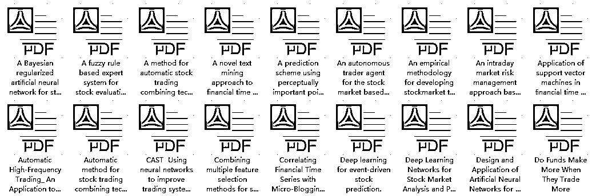

# 量化千万条，你猜哪个第一条？

> 原文：[`mp.weixin.qq.com/s?__biz=MzAxNTc0Mjg0Mg==&mid=2653291136&idx=1&sn=437c7f2a55be37f435d5d6ab1d67ff72&chksm=802dc095b75a49838ae5e04713f037e6bbdf0a1053b6f5c81d6ec58957be3ea941247cc5aa4e&scene=27#wechat_redirect`](http://mp.weixin.qq.com/s?__biz=MzAxNTc0Mjg0Mg==&mid=2653291136&idx=1&sn=437c7f2a55be37f435d5d6ab1d67ff72&chksm=802dc095b75a49838ae5e04713f037e6bbdf0a1053b6f5c81d6ec58957be3ea941247cc5aa4e&scene=27#wechat_redirect)

**标星★公众号**，第一时间获取最新研究

**近期原创文章：**

## ♥ [基于无监督学习的期权定价异常检测（代码+数据）](https://mp.weixin.qq.com/s?__biz=MzAxNTc0Mjg0Mg==&mid=2653290562&idx=1&sn=dee61b832e1aa2c062a96bb27621c29d&chksm=802dc257b75a4b41b5623ade23a7de86333bfd3b4299fb69922558b0cbafe4c930b5ef503d89&token=1298662931&lang=zh_CN&scene=21#wechat_redirect)

## ♥ [5 种机器学习算法在预测股价的应用（代码+数据）](https://mp.weixin.qq.com/s?__biz=MzAxNTc0Mjg0Mg==&mid=2653290588&idx=1&sn=1d0409ad212ea8627e5d5cedf61953ac&chksm=802dc249b75a4b5fa245433320a4cc9da1a2cceb22df6fb1a28e5b94ff038319ae4e7ec6941f&token=1298662931&lang=zh_CN&scene=21#wechat_redirect)

## ♥ [深入研读：利用 Twitter 情绪去预测股市](https://mp.weixin.qq.com/s?__biz=MzAxNTc0Mjg0Mg==&mid=2653290402&idx=1&sn=efda9ea106991f4f7ccabcae9d809e00&chksm=802e3db7b759b4a173dc8f2ab5c298ab3146bfd7dd5aca75929c74ecc999a53b195c16f19c71&token=1330520237&lang=zh_CN&scene=21#wechat_redirect)

## ♥ [Two Sigma 用新闻来预测股价走势，带你吊打 Kaggle](https://mp.weixin.qq.com/s?__biz=MzAxNTc0Mjg0Mg==&mid=2653290456&idx=1&sn=b8d2d8febc599742e43ea48e3c249323&chksm=802e3dcdb759b4db9279c689202101b6b154fb118a1c1be12b52e522e1a1d7944858dbd6637e&token=1330520237&lang=zh_CN&scene=21#wechat_redirect)

## ♥ [利用深度学习最新前沿预测股价走势](https://mp.weixin.qq.com/s?__biz=MzAxNTc0Mjg0Mg==&mid=2653290080&idx=1&sn=06c50cefe78a7b24c64c4fdb9739c7f3&chksm=802e3c75b759b563c01495d16a638a56ac7305fc324ee4917fd76c648f670b7f7276826bdaa8&token=770078636&lang=zh_CN&scene=21#wechat_redirect)

## ♥ [一位数据科学 PhD 眼中的算法交易](https://mp.weixin.qq.com/s?__biz=MzAxNTc0Mjg0Mg==&mid=2653290118&idx=1&sn=a261307470cf2f3e458ab4e7dc309179&chksm=802e3c93b759b585e079d3a797f512dfd0427ac02942339f4f1454bd368ba47be21cb52cf969&token=770078636&lang=zh_CN&scene=21#wechat_redirect)

## ♥ [基于 RNN 和 LSTM 的股市预测方法](https://mp.weixin.qq.com/s?__biz=MzAxNTc0Mjg0Mg==&mid=2653290481&idx=1&sn=f7360ea8554cc4f86fcc71315176b093&chksm=802e3de4b759b4f2235a0aeabb6e76b3e101ff09b9a2aa6fa67e6e824fc4274f68f4ae51af95&token=1865137106&lang=zh_CN&scene=21#wechat_redirect)

## ♥ [人工智能『AI』应用算法交易，7 个必踩的坑！](https://mp.weixin.qq.com/s?__biz=MzAxNTc0Mjg0Mg==&mid=2653289974&idx=1&sn=88f87cb64999d9406d7c618350aac35d&chksm=802e3fe3b759b6f5eca6e777364270cbaa0bf35e9a1535255be9751c3a77642676993a861132&token=770078636&lang=zh_CN&scene=21#wechat_redirect)

## ♥ [神经网络在算法交易上的应用系列（一）](https://mp.weixin.qq.com/s?__biz=MzAxNTc0Mjg0Mg==&mid=2653289962&idx=1&sn=5f5aa65ec00ce176501c85c7c106187d&chksm=802e3fffb759b6e9f2d4518f9d3755a68329c8753745333ef9d70ffd04bd088fd7b076318358&token=770078636&lang=zh_CN&scene=21#wechat_redirect)

## ♥ [预测股市 | 如何避免 p-Hacking，为什么你要看涨？](https://mp.weixin.qq.com/s?__biz=MzAxNTc0Mjg0Mg==&mid=2653289820&idx=1&sn=d3fee74ba1daab837433e4ef6b0ab4d9&chksm=802e3f49b759b65f422d20515942d5813aead73231da7d78e9f235bdb42386cf656079e69b8b&token=770078636&lang=zh_CN&scene=21#wechat_redirect)

## ♥ [如何鉴别那些用深度学习预测股价的花哨模型？](https://mp.weixin.qq.com/s?__biz=MzAxNTc0Mjg0Mg==&mid=2653290132&idx=1&sn=cbf1e2a4526e6e9305a6110c17063f46&chksm=802e3c81b759b597d3dd94b8008e150c90087567904a29c0c4b58d7be220a9ece2008956d5db&token=1266110554&lang=zh_CN&scene=21#wechat_redirect)

## ♥ [优化强化学习 Q-learning 算法进行股市](https://mp.weixin.qq.com/s?__biz=MzAxNTc0Mjg0Mg==&mid=2653290286&idx=1&sn=882d39a18018733b93c8c8eac385b515&chksm=802e3d3bb759b42d1fc849f96bf02ae87edf2eab01b0beecd9340112c7fb06b95cb2246d2429&token=1330520237&lang=zh_CN&scene=21#wechat_redirect)

***量化***

***Quantitative***

量化，一个横跨多个学科领域的工作。已经在不同场合，听了无数次的三座大山：**较好的数学功底**、**编程技能**、**金融知识**。

*   你觉得你会编程就很容易上手量化吗？

*   你认为交易策略开发完了就没有价值了吗？

*   那你了解交易策略有多少种吗？

*   ···

所有的一切都要经过你一步一步的努力。

***入行 Quant***

***You Must Know!***

Quant 的职位主要集中在投资银行、对冲基金、商业银行和金融机构。负责的主要工作根据职位也有很大区别，比较有代表性的包括**Pricing、Model Validation、Research、Develop and Risk Management**，分别负责衍生品定价模型的建立和应用、模型验证、模型研究、程序开发和风险管理。

最近几年，很多跨专业的朋友（计算机、生物、物理、通信等专业）也想在量化的领域展示一下自己的抱负。

像计算机、物理等专业有自身的优势，做 Quant 不能一辈子当开发吧。得全面发展。

大家可能觉得搞量化的人就是整天和大量数据打交道，用一行行代码写出复杂的模型，然后没完没了地 Run，在回测和优化中挣扎，沉浸在数学和统计海洋里的一群人。实际上，这只是表面现象。虽然每个搞量化的人必须会写代码，也必须具备扎实的数学功底，在开发策略的过程中，的确需要分析大量数据，不断做回测和优化，但是，**这一切的背后是强大的金融思维和对金融市场的深刻理解在支撑的**。换句话说，**如果你没有经济、金融的完整知识体系和工作经验，或者没有正确的、科学的思维方式，无论数学多么地好，也很可能在做无用功**；即便编程多么在行，也只能沦为码农一枚（没有歧视程序员的意思哦）。反过来说，如果你具备科学的思维和逻辑，并发现了经济、金融的某些规律，想做 Quant 就不难了。接下来，你只需花点时间学习编程工具，好好利用数据和代码为你实现自己的想法。

在国内，你可以去以下几种类型的机构：

**1、买方：公募**

**特点：**朝九晚五，人际关系处理好，当甲方爸爸的感觉真好！

**工作：**做好研究，大多以股票为主，少数投资债券或者货币市场。手握数亿资金，与上市公司董秘、高管运筹帷幄。

**要求：****本科忽略！****最基本是硕士，PhD 也是挤破头，985&211，有些只招清北复交**，很正常。名校海龟也很吃香。其他的要求我们在下文介绍。

**评价：**从业情况，盈利能力、抗风险能力、稳定性等。还有管理基金的业绩综合排名、业绩排名稳定性等。

**未来：**研究员、基金经理助理、基金经理、某部门 MD 等出了本事以外。越想往上就得耗啊！

**2、卖方：券商金融工程团队\研究所**

**特点：**朝九晚不知道，**一年坐的飞机可环绕地球 N 圈，真的很辛苦**。

**工作：****写研报、**写研报、****写研报****（你能想到的各种模型各种方法），**各种路演**（可能一份报告已经倒背如流，买方会根据卖方的表现来派点给卖），****寻创新****（多因子已经写烂啦哈哈~），保持与机构的密切沟通。

**要求：本科确实很难啊！**基本硕士起，有些甚至要求 985，211 都不要。同等水平可能海龟会优先考虑。其他的要求我们在下文介绍。

**评价：**研报热度啊！新财富啊！不知道以后还有不。等~

**未来：**成为首席或者高级研究员，跳槽去买方、私募等。

**3、风云之地：私募**

**特点：**看的是结果，各种投资思路、投资标的都有涉及。

**要求：**有来自券商、基金或者自民间的投资高手。所以学历相对不是特别严格。

**评价：****研究要和收益挂钩**。站在研究的角度，总有人愿意为高屋建瓴的所谓前瞻性和理论买单，私募却行不通。你可以基于你优漂亮的净值曲线去包装，但反着来不行！这样你作为研究员就没有了价值，**最终沦为发产品时宣传三折页上打酱油的角色，熊市或震荡市时裁员降薪的首选。**

**未来：**继续留用 or 成为大佬 or 走人。

**4、金融科技公司**

**特点：**服务产品，写相关研究报告，搞培训等。

**要求：**很典型的例子，现在国内很多量化平台都会招聘有一帮人为平台社区写各种研报复现、论文复现、策略复现等等。再者就是针对某一量化产品做深度开发研究。还有一些专门做量化课程培训。

**评价：**研报热度（主要为平台流量）、产品的功能好坏、培训口碑等。

**未来：**卖方、买方、私募或者自己干都有可能。

还有一个是在银行的量化部门。但主要是前四者居多。

***Python***

***大势所趋***

同样，**作为一名优秀的 Quant，**你必须要掌握当下最主流的一门语言，那就是：

**Python** 

> *Beautiful is better than ugly.*
> 
> *Explicit is better than implicit.*
> 
> *Simple is better than complex.*
> 
> *Complex is better than complicated.*

这是 Zen of Python 的前四行，它总结了 Python 作为编程语言的精髓。

真的太火了，以至于不用过多介绍。你懂得~

国内很多量化交易平台都使用 Python 开发，因为**Python 作为一个生态系统。**更容易的实现加上用于数学计算、数据收集、机器学习、数据可视化甚至基于这些模型的应用程序开发的大量库，已经将 Python 转变为一个完整的数据科学项目生态系统。

图来自网络

**容易学习**

学习成本低，运行速度快，扩展性较强。无论是开始学习编程的金融分析师、数学家、学生还是自由开发者，都将自己呈现为最佳选项。

**数据分析与机器学习**

这也是下面的一个主题我们要说的。

图来自网络

***AI &***

***Machine Learning***

现在，很多量化机构将人工智能和机器学习与量化策略相结合。国内的一些顶尖私募，比如：九坤、幻方、朱雀等都在使用 AI 量化策略，从各大公司的招聘公告上也可以看出这点。

图来自网络

海外的大型对冲基金公司更是如此：

*   **Aidyia（香港**）：运用先进的人工智能技术，识别金融市场模式和预测价格走势。

*   **Binatix（美国）**：是最早使用机器学习算法来发现在投资中具有优势模式的公司之一。

*   **Kimerick Technologies（美国）**：机器学习和人工神经网络驱动预测交易的公司。

*   **Pit.ai（英国）**：一个机器学习驱动的对冲基金等等······

图来自网络

***Frist***

***这里第一条***

对于初学的同学，能否真正进入 AI 量化的大门，掌握最前沿的量化算法理论，**取决于是否熟练掌握金融学相关理论，机器学习和深度学习相关知识，以及在实践中能否熟练应用。**

系统地讲，初学者想要登堂入室，必须掌握金融理论、交易策略研发、机器学习与深度学习以及将策略进行实盘检验。

**针对量化研究的小白、有志于投身 AI 量化交易事业的同学**，**网易云课堂**特推出了 AI 量化交易课程。

课程的主要目标是从金融学基础出发，通过讲解量化中常见的模型和策略并使用 Python 加以实现，让学习者深度掌握量化交易模型和方法。**重点加入了机器学习和深度学习的相关内容，将量化金融和人工智能技术相结合**，与时俱进，希望大家能够通过学习研究出适合于自己的量化策略，早日实现财务自由。    

现在推出限时福利：特邀讲师免费直播课、免费体验课以及免费大礼包。

Part.1 免费直播公开课

**直播主题**

**从华尔街 Quant 到纽约家族办公室基金经理**

**——如何应用量化技术做全球资产配置**

3 月 7 日 周四 20:00

**直播大纲**

1.  投行、券商外，家族办公室也可以是求职目标

2.  来自华尔街的 2019 年宏观经济形势展望

3.  仓位分配思路分享：预防衰退的资产配置策略

4.  来自老司机的入门学习建议

**直播讲师**

Will 网易特邀讲师 纽约家族办公室基金经理

Part.2 免费体验课

**《AI 量化交易》**

**课程大纲**

1\. 量化交易的历史背景与发展

2\. 机器学习加持下的量化交易新世界

3\. 量化案例展示——大单跟随

4\. 量化交易指衍生品定价

Part.3 免费学习资料包

AI 量化交易电子书

▼

AI 量化交易相关论文

▼

Part.4 获取方式

扫描下方二维码

添加网易云课堂「AI 量化交易」助教

即可获取所有免费福利

**微信号：weizhuanye030**

为了保证学习体验

本次学习社群限时开放

**数量有限，进群从速哦~**