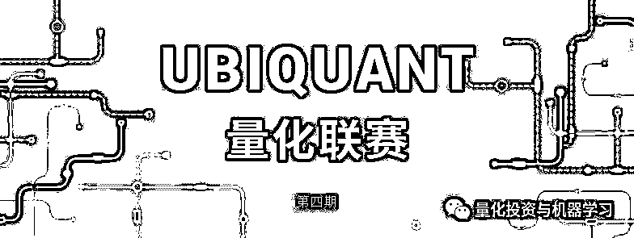

# 九坤 ▎第二届 UBIQUANT 量化联赛等你来挑战！

> 原文：[`mp.weixin.qq.com/s?__biz=MzAxNTc0Mjg0Mg==&mid=2653291134&idx=1&sn=1364817a2f9e5676a501fcae8454bbc8&chksm=802dc06bb75a497db22807e35ffd8b26189097c22e392e68cd380d1269d43a082f3001b7975c&scene=27#wechat_redirect`](http://mp.weixin.qq.com/s?__biz=MzAxNTc0Mjg0Mg==&mid=2653291134&idx=1&sn=1364817a2f9e5676a501fcae8454bbc8&chksm=802dc06bb75a497db22807e35ffd8b26189097c22e392e68cd380d1269d43a082f3001b7975c&scene=27#wechat_redirect)

**标星★公众号**，第一时间获取最新研究

**近期原创文章：**

## ♥ [基于无监督学习的期权定价异常检测（代码+数据）](https://mp.weixin.qq.com/s?__biz=MzAxNTc0Mjg0Mg==&mid=2653290562&idx=1&sn=dee61b832e1aa2c062a96bb27621c29d&chksm=802dc257b75a4b41b5623ade23a7de86333bfd3b4299fb69922558b0cbafe4c930b5ef503d89&token=1298662931&lang=zh_CN&scene=21#wechat_redirect)

## ♥ [5 种机器学习算法在预测股价的应用（代码+数据）](https://mp.weixin.qq.com/s?__biz=MzAxNTc0Mjg0Mg==&mid=2653290588&idx=1&sn=1d0409ad212ea8627e5d5cedf61953ac&chksm=802dc249b75a4b5fa245433320a4cc9da1a2cceb22df6fb1a28e5b94ff038319ae4e7ec6941f&token=1298662931&lang=zh_CN&scene=21#wechat_redirect)

## ♥ [深入研读：利用 Twitter 情绪去预测股市](https://mp.weixin.qq.com/s?__biz=MzAxNTc0Mjg0Mg==&mid=2653290402&idx=1&sn=efda9ea106991f4f7ccabcae9d809e00&chksm=802e3db7b759b4a173dc8f2ab5c298ab3146bfd7dd5aca75929c74ecc999a53b195c16f19c71&token=1330520237&lang=zh_CN&scene=21#wechat_redirect)

## ♥ [Two Sigma 用新闻来预测股价走势，带你吊打 Kaggle](https://mp.weixin.qq.com/s?__biz=MzAxNTc0Mjg0Mg==&mid=2653290456&idx=1&sn=b8d2d8febc599742e43ea48e3c249323&chksm=802e3dcdb759b4db9279c689202101b6b154fb118a1c1be12b52e522e1a1d7944858dbd6637e&token=1330520237&lang=zh_CN&scene=21#wechat_redirect)

## ♥ [利用深度学习最新前沿预测股价走势](https://mp.weixin.qq.com/s?__biz=MzAxNTc0Mjg0Mg==&mid=2653290080&idx=1&sn=06c50cefe78a7b24c64c4fdb9739c7f3&chksm=802e3c75b759b563c01495d16a638a56ac7305fc324ee4917fd76c648f670b7f7276826bdaa8&token=770078636&lang=zh_CN&scene=21#wechat_redirect)

## ♥ [一位数据科学 PhD 眼中的算法交易](https://mp.weixin.qq.com/s?__biz=MzAxNTc0Mjg0Mg==&mid=2653290118&idx=1&sn=a261307470cf2f3e458ab4e7dc309179&chksm=802e3c93b759b585e079d3a797f512dfd0427ac02942339f4f1454bd368ba47be21cb52cf969&token=770078636&lang=zh_CN&scene=21#wechat_redirect)

## ♥ [基于 RNN 和 LSTM 的股市预测方法](https://mp.weixin.qq.com/s?__biz=MzAxNTc0Mjg0Mg==&mid=2653290481&idx=1&sn=f7360ea8554cc4f86fcc71315176b093&chksm=802e3de4b759b4f2235a0aeabb6e76b3e101ff09b9a2aa6fa67e6e824fc4274f68f4ae51af95&token=1865137106&lang=zh_CN&scene=21#wechat_redirect)

## ♥ [人工智能『AI』应用算法交易，7 个必踩的坑！](https://mp.weixin.qq.com/s?__biz=MzAxNTc0Mjg0Mg==&mid=2653289974&idx=1&sn=88f87cb64999d9406d7c618350aac35d&chksm=802e3fe3b759b6f5eca6e777364270cbaa0bf35e9a1535255be9751c3a77642676993a861132&token=770078636&lang=zh_CN&scene=21#wechat_redirect)

## ♥ [神经网络在算法交易上的应用系列（一）](https://mp.weixin.qq.com/s?__biz=MzAxNTc0Mjg0Mg==&mid=2653289962&idx=1&sn=5f5aa65ec00ce176501c85c7c106187d&chksm=802e3fffb759b6e9f2d4518f9d3755a68329c8753745333ef9d70ffd04bd088fd7b076318358&token=770078636&lang=zh_CN&scene=21#wechat_redirect)

## ♥ [预测股市 | 如何避免 p-Hacking，为什么你要看涨？](https://mp.weixin.qq.com/s?__biz=MzAxNTc0Mjg0Mg==&mid=2653289820&idx=1&sn=d3fee74ba1daab837433e4ef6b0ab4d9&chksm=802e3f49b759b65f422d20515942d5813aead73231da7d78e9f235bdb42386cf656079e69b8b&token=770078636&lang=zh_CN&scene=21#wechat_redirect)

## ♥ [如何鉴别那些用深度学习预测股价的花哨模型？](https://mp.weixin.qq.com/s?__biz=MzAxNTc0Mjg0Mg==&mid=2653290132&idx=1&sn=cbf1e2a4526e6e9305a6110c17063f46&chksm=802e3c81b759b597d3dd94b8008e150c90087567904a29c0c4b58d7be220a9ece2008956d5db&token=1266110554&lang=zh_CN&scene=21#wechat_redirect)

## ♥ [优化强化学习 Q-learning 算法进行股市](https://mp.weixin.qq.com/s?__biz=MzAxNTc0Mjg0Mg==&mid=2653290286&idx=1&sn=882d39a18018733b93c8c8eac385b515&chksm=802e3d3bb759b42d1fc849f96bf02ae87edf2eab01b0beecd9340112c7fb06b95cb2246d2429&token=1330520237&lang=zh_CN&scene=21#wechat_redirect)

如果你热爱挑战、编程强大又酷爱研究

九坤投资第二届“UBIQUANT”量化联赛等你来挑战

我们期待这样的你，玩转一波量化

**全年联赛奖励**

我们为大赛参与者设置了丰厚的奖励计划：

⚑  全年积分总排名前三的队伍，将分别获得：**10 万、3 万、1 万现金激励**

⚑  我们将提供实习和全职职位给比赛中展现出亮点的参赛者

⚑  每期比赛，我们为前三名队伍准备精美礼品和荣誉证书

⚑  参与报名的选手，将从中随机抽取 3 位幸运选手平分**666 元红包**

而参加此次量化联赛，你也将收获：

➤ 大大地提升你的量化分析能力

➤ 与兴趣相投的小伙伴切磋交流

➤ 探索学业和职业发展的新机遇

➤ 挑战你的编程技能和思维边界

➤ 与顶尖学府的量化人才较高下

**第四期比赛介绍**

比赛分三个阶段：**报名阶段**、**线上测试**、**正式比赛阶段**

**⚑ 比赛内容**

**在模拟交易所环境下，要求每位玩家当做市商（想象你是银行，对每个想换外汇的人提供双边兑换），即要求买卖双边同时报价，挂到市场上，且所报挂单的价差宽度不超过某个比例。统计持续有效双边报价时间，以时间长短为主要评分依据，pnl 为辅。**

**参赛者须根据行情变化，及时调整自己的挂单，既要避免某边挂单被吃掉，不算完成义务，也要防止积累单边头寸，被市场拉爆，亏光 pnl。**

**⚑ 报名阶段**

**报名时间**：

**2019 年 3 月 24 日（周日）24:00 截止报名**

**报名方式：**

投递简历

***hackathon@ubiquant.com ***

命名如团队名称+姓名+学校+专业

**参赛对象：**

2-3 人组队，不限院校专业（欢迎单刀赴会）

***参加往期正式比赛的队伍可直接入围第四期比赛，请邮件报名确认***

**⚑ 线上测试**

**测试通知：**3 月 26 日（周二）18:00 邮件通知

**测试时间：**3 月 27 日（周三）- 4 月 8 日（周一）

**入围通知：**4 月 9 日（周二）对通过测试及简历筛选的同学，大赛工作组将邮件和电话邀请加入正式比赛。（测试不分先后，在规定测试时段完成任务即可）

**⚑ 正式比赛阶段**

**比赛时间：**2019 年 4 月 13 日（周六）下午

**比赛地点：**邮件另行通知

**比赛形式：**正式比赛采用封闭式比赛，现场公布题型，期待你的现场表现

**技能要求：**考察编程（语言不限）、数学能力

**联赛说明**

➤ 第二届“UBIQUANT"大赛采用联赛制，全年共 6 期，量化比赛+量化沙龙交替进行，最终根据积分总和排名决定年度总排名。

➤ 比赛主题每期不同，玩的就是不一样。每期量化沙龙，会邀请大家圆桌讨论，想怎么玩等你来说。

➤比赛成绩和每队积分将通过官网（www.ubiquant.com）公布，如果有任何疑问欢迎发邮件至 hackathon@ubiquant.com 询问。

➤本次比赛解释权归九坤投资（北京）有限公司所有。

**公司简介**

九坤投资（北京）有限公司[是国内成立最早、最顶尖的多策略量化私募基金管理机构之一。作为一家资产管理机构，我们依靠多年稳定且有竞争力的业绩，得到了投资人广泛认可。连续两年均收获私募行业最高奖项——私募金牛奖。](http://mp.weixin.qq.com/s?__biz=MzIyODU3MjQ0MQ==&mid=2247483865&idx=1&sn=0962b40c346662af264f6449ac1b8dc1&chksm=e84eadafdf3924b900a2cf72f4592feb724e292ed11c0ad159b74ff26bbd8fcdb08b8421d9b5&scene=21#wechat_redirect)

—End—

**扫码关注我们**

