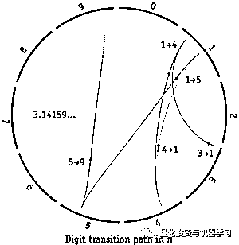

# 惊喜~

> 原文：[`mp.weixin.qq.com/s?__biz=MzAxNTc0Mjg0Mg==&mid=2653291102&idx=1&sn=5e517afa9c2cd7041e298fed7669f135&chksm=802dc04bb75a495d381d65ee77b45beb7effee7754fdd2f5a47926898ff39c10e41e8eecf7b6&scene=27#wechat_redirect`](http://mp.weixin.qq.com/s?__biz=MzAxNTc0Mjg0Mg==&mid=2653291102&idx=1&sn=5e517afa9c2cd7041e298fed7669f135&chksm=802dc04bb75a495d381d65ee77b45beb7effee7754fdd2f5a47926898ff39c10e41e8eecf7b6&scene=27#wechat_redirect)

***很喜欢这张图***

**原图点击预读原文**

专门从**油桶**上给你们下载了这幅图产生的视频：

[`mp.weixin.qq.com/mp/readtemplate?t=pages/video_player_tmpl&action=mpvideo&auto=0&vid=wxv_722384862459691009`](https://mp.weixin.qq.com/mp/readtemplate?t=pages/video_player_tmpl&action=mpvideo&auto=0&vid=wxv_722384862459691009)

下面是绘图原理，看不懂就······

最后送一首歌：

**祝大家周末快乐！**