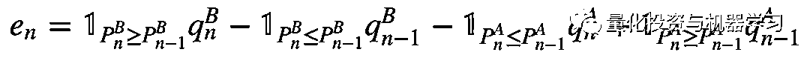

# 基于强化学习 Q-Learning 模型构建算法交易策略（文档+代码）

> 原文：[`mp.weixin.qq.com/s?__biz=MzAxNTc0Mjg0Mg==&mid=2653290998&idx=1&sn=ffde72ad95a214220030d84c1b6e4bd3&chksm=802dc3e3b75a4af544d8cb092a9e803a7b9c9caa02662d207d62115349e4efd8d7e6a4d5de56&scene=27#wechat_redirect`](http://mp.weixin.qq.com/s?__biz=MzAxNTc0Mjg0Mg==&mid=2653290998&idx=1&sn=ffde72ad95a214220030d84c1b6e4bd3&chksm=802dc3e3b75a4af544d8cb092a9e803a7b9c9caa02662d207d62115349e4efd8d7e6a4d5de56&scene=27#wechat_redirect)

**标星★公众号**，第一时间获取最新研究

**近期原创文章：**

## ♥ [基于无监督学习的期权定价异常检测（代码+数据）](https://mp.weixin.qq.com/s?__biz=MzAxNTc0Mjg0Mg==&mid=2653290562&idx=1&sn=dee61b832e1aa2c062a96bb27621c29d&chksm=802dc257b75a4b41b5623ade23a7de86333bfd3b4299fb69922558b0cbafe4c930b5ef503d89&token=1298662931&lang=zh_CN&scene=21#wechat_redirect)

## ♥ [5 种机器学习算法在预测股价的应用（代码+数据）](https://mp.weixin.qq.com/s?__biz=MzAxNTc0Mjg0Mg==&mid=2653290588&idx=1&sn=1d0409ad212ea8627e5d5cedf61953ac&chksm=802dc249b75a4b5fa245433320a4cc9da1a2cceb22df6fb1a28e5b94ff038319ae4e7ec6941f&token=1298662931&lang=zh_CN&scene=21#wechat_redirect)

## ♥ [深入研读：利用 Twitter 情绪去预测股市](https://mp.weixin.qq.com/s?__biz=MzAxNTc0Mjg0Mg==&mid=2653290402&idx=1&sn=efda9ea106991f4f7ccabcae9d809e00&chksm=802e3db7b759b4a173dc8f2ab5c298ab3146bfd7dd5aca75929c74ecc999a53b195c16f19c71&token=1330520237&lang=zh_CN&scene=21#wechat_redirect)

## ♥ [Two Sigma 用新闻来预测股价走势，带你吊打 Kaggle](https://mp.weixin.qq.com/s?__biz=MzAxNTc0Mjg0Mg==&mid=2653290456&idx=1&sn=b8d2d8febc599742e43ea48e3c249323&chksm=802e3dcdb759b4db9279c689202101b6b154fb118a1c1be12b52e522e1a1d7944858dbd6637e&token=1330520237&lang=zh_CN&scene=21#wechat_redirect)

## ♥ [利用深度学习最新前沿预测股价走势](https://mp.weixin.qq.com/s?__biz=MzAxNTc0Mjg0Mg==&mid=2653290080&idx=1&sn=06c50cefe78a7b24c64c4fdb9739c7f3&chksm=802e3c75b759b563c01495d16a638a56ac7305fc324ee4917fd76c648f670b7f7276826bdaa8&token=770078636&lang=zh_CN&scene=21#wechat_redirect)

## ♥ [一位数据科学 PhD 眼中的算法交易](https://mp.weixin.qq.com/s?__biz=MzAxNTc0Mjg0Mg==&mid=2653290118&idx=1&sn=a261307470cf2f3e458ab4e7dc309179&chksm=802e3c93b759b585e079d3a797f512dfd0427ac02942339f4f1454bd368ba47be21cb52cf969&token=770078636&lang=zh_CN&scene=21#wechat_redirect)

## ♥ [基于 RNN 和 LSTM 的股市预测方法](https://mp.weixin.qq.com/s?__biz=MzAxNTc0Mjg0Mg==&mid=2653290481&idx=1&sn=f7360ea8554cc4f86fcc71315176b093&chksm=802e3de4b759b4f2235a0aeabb6e76b3e101ff09b9a2aa6fa67e6e824fc4274f68f4ae51af95&token=1865137106&lang=zh_CN&scene=21#wechat_redirect)

## ♥ [人工智能『AI』应用算法交易，7 个必踩的坑！](https://mp.weixin.qq.com/s?__biz=MzAxNTc0Mjg0Mg==&mid=2653289974&idx=1&sn=88f87cb64999d9406d7c618350aac35d&chksm=802e3fe3b759b6f5eca6e777364270cbaa0bf35e9a1535255be9751c3a77642676993a861132&token=770078636&lang=zh_CN&scene=21#wechat_redirect)

## ♥ [神经网络在算法交易上的应用系列（一）](https://mp.weixin.qq.com/s?__biz=MzAxNTc0Mjg0Mg==&mid=2653289962&idx=1&sn=5f5aa65ec00ce176501c85c7c106187d&chksm=802e3fffb759b6e9f2d4518f9d3755a68329c8753745333ef9d70ffd04bd088fd7b076318358&token=770078636&lang=zh_CN&scene=21#wechat_redirect)

## ♥ [预测股市 | 如何避免 p-Hacking，为什么你要看涨？](https://mp.weixin.qq.com/s?__biz=MzAxNTc0Mjg0Mg==&mid=2653289820&idx=1&sn=d3fee74ba1daab837433e4ef6b0ab4d9&chksm=802e3f49b759b65f422d20515942d5813aead73231da7d78e9f235bdb42386cf656079e69b8b&token=770078636&lang=zh_CN&scene=21#wechat_redirect)

## ♥ [如何鉴别那些用深度学习预测股价的花哨模型？](https://mp.weixin.qq.com/s?__biz=MzAxNTc0Mjg0Mg==&mid=2653290132&idx=1&sn=cbf1e2a4526e6e9305a6110c17063f46&chksm=802e3c81b759b597d3dd94b8008e150c90087567904a29c0c4b58d7be220a9ece2008956d5db&token=1266110554&lang=zh_CN&scene=21#wechat_redirect)

## ♥ [优化强化学习 Q-learning 算法进行股市](https://mp.weixin.qq.com/s?__biz=MzAxNTc0Mjg0Mg==&mid=2653290286&idx=1&sn=882d39a18018733b93c8c8eac385b515&chksm=802e3d3bb759b42d1fc849f96bf02ae87edf2eab01b0beecd9340112c7fb06b95cb2246d2429&token=1330520237&lang=zh_CN&scene=21#wechat_redirect)

**前言**

在本文中，**我们将提出一个自适应学习模型，用户在强化学习框架下交易单只股票**。机器学习领域通过奖励和惩罚来训练 agent，而不需要指定预期的操作。agent 从经验中学习，并制定出最大化利润策略。**结果表明，该模型成功地用于构建算法交易策略。**

**论文文末查看**

**项目介绍**

随着程序化策略的日益流行，构建一个能够**每天进行多次交易**、并能根**据市场情况进行调整**、同时仍**能持续盈利**的智能交易系统，是任何市场参与者都非常感兴趣的课题。

考虑到很难产生这样的策略，在这个项目中，我们将尝试构建一个比随机 agent 更好的算法，让其己学习如何交易。为此，我们将在一个强化学习框架中进行。

在这个项目中使用的数据为 Level-1 行情数据。

**开始我们的研究**

在 BMFBovespa 证交所选择 PETR4。时间为 2016 年 7 月 25 日至 2016 年 9 月 26 日 45 个交易日。数据来自彭博。

在下面的图中可以观察到在样本外市场是如何表现的。BOVA11 是一种 ETF，可以作为 BMFBovespa 证交所指数 Bovespa 指数的 agent。可以看出，PETR4 的波动性比其他市场相对更大。

```py
import zipfile
s_fname = "data/data_0725_0926.zip"
s_fname2 = "data/bova11_2.zip"
archive = zipfile.ZipFile(s_fname, 'r')
archive2 = zipfile.ZipFile(s_fname2, 'r')
l_fnames = archive.infolist()

import qtrader.eda as eda; reload(eda);
df_last_pnl = eda.plot_cents_changed(archive, archive2)
```


总共有 45 个数据文件，每个文件平均有 11 万行，总共有 5,631,273 行近 230 MB。看看其中一个文件的数据结构：

```py
import pandas as pd
df = pd.read_csv(archive.open(l_fnames[0]), index_col=0, parse_dates=['Date'])
df.head()
```


每个文件由四个不同的字段组成。所有这些数据将用于创建 agent 运行环境。此环境是订单簿，agent 可以以最优惠的价格插入限价订单执行交易。订单簿由两个二叉树表示，一个用于 Bid，另一个用于 Ask。从下表中可以看出，这些树的节点按价格（价格水平）按投标方按升序排序，按询价方按降序排序。

```py
mport qtrader.simulator as simulator
import qtrader.environment as environment
e = environment.Environment()
sim = simulator.Simulator(e)
%time sim.run(n_trials=1)

sim.env.get_order_book()
```


每当 agent 执行交易或完成订单时，环境将用 agent 的当前位置和损益（PnL)进行回答。这笔交易的费用将作为罚金计算。


订单流不平衡（OFI）的度量：


en 定义为第 n 个事件对买卖队列大小的贡献的度量：



```py
import qtrader.eda as eda; reload(eda);
s_fname = "data/petr4_0725_0818_2.zip"
%time eda.test_ofi_indicator(s_fname, f_min_time=20.)

mport pandas as pd
df = pd.read_csv('data/ofi_petr.txt', sep='\t')
df.drop('TIME', axis=1, inplace=True)
df.dropna(inplace=True)
ax = sns.lmplot(x="OFI", y="LOG_RET", data=df, markers=["x"], palette="Set2", size=4, aspect=2.)
ax.ax.set_title(u'Relation between the Log-return and the $OFI$\n', fontsize=15);
ax.ax.set_ylim([-0.004, 0.005])
ax.ax.set_xlim([-400000, 400000])
```


从图中可以看出，订单流的不平衡是高频价格变化的一个更强驱动因素，这个变量将被用来描述订单的当前状态。

算法和技术部分，大家自行查看论文。

**方法**

在本节中，我们将对输入空间进行离散化并实现一个 agent 来学习 Q 函数。 

如前所述，我们将实现一个马尔可夫决策过程（MDP），它需要一系列离散的状态 s。除了输入变量 position、OrderBid、OrderAsk 之外，其他变量都是在一个无限域中定义的。我们要将这些输入离散化，这样学习 agent 就可以用它们来表示模拟状态。在下面的图中，我们可以看到这些变量的分布。数据是使用数据集的第一天生成的。

```py
mport pandas as pd
df = pd.read_csv('data/ofi_petr.txt', sep='\t')
df.drop(['TIME', 'DELTA_MID'], axis=1, inplace=True)
df.dropna(inplace=True)

pd.scatter_matrix(df.ix[:, ['OFI', 'BOOK_RATIO']],
                  alpha = 0.3, figsize = (14,8), diagonal = 'kde')
```


变量的比例非常不同，在 BOOK_RATIO 的情况下，它呈现对数分布。我将对这个变量进行对数变换，并使用 scikit-learn 中的 MinMaxScaler 对每个特征进行归一化，使其位于给定的最小值和最大值之间。


```py
import sklearn.preprocessing as preprocessing
import numpy as np
scaler_ofi = preprocessing.MinMaxScaler().fit(pd.DataFrame(df.OFI))
scaler_bookratio = preprocessing.MinMaxScaler().fit(pd.DataFrame(np.log(df.BOOK_RATIO)))
d_transformed = {}
d_transformed['OFI'] = scaler_ofi.transform(pd.DataFrame(df.OFI)).T[0]
d_transformed['BOOK_RATIO'] = scaler_bookratio.transform(pd.DataFrame(np.log(df.BOOK_RATIO))).T[0]
df_transformed = pd.DataFrame(d_transformed)
pd.scatter_matrix(df_transformed.ix[:, ['OFI', 'BOOK_RATIO']],
                    alpha = 0.3, figsize = (14,8), diagonal = 'kde');
```


如前所述，在 MDP 环境中，agent 必须无限次地访问每个可能的状态。如果只是将变量随机化并将它们组合起来，那么我们将会有大量的状态需要探索。因此，为了减少状态空间，我们将使用**K-Means**和**高斯混合模型（GMM）聚类算法**对这些变量进行分组。然后通过计算每个数据点的轮廓系数来量化聚类结果的“良好度”。一数据点的轮廓系数测量它与指定簇的相似程度，从-1（不相似）到 1（相似）。在下面的图中，我们将使用不同数量的簇计算到 K-Means 和 GMM 的平均轮廓系数。此外，我们将测试不同协方差结构的 GMM。

```py
from sklearn import metrics
from sklearn.cluster import KMeans
from sklearn.mixture import GMM
import time

reduced_data = df_transformed.ix[:, ['OFI', 'BOOK_RATIO']]
reduced_data.columns = ['Dimension 1', 'Dimension 2']
range_n_clusters = [2, 3, 4, 5, 6, 8, 10]

f_st = time.time()
d_score = {}
d_model = {}
s_key = "Kmeans"
d_score[s_key] = {}
d_model[s_key] = {}
for n_clusters in range_n_clusters:
    clusterer = KMeans(n_clusters=n_clusters, random_state=10)
    preds = clusterer.fit_predict(reduced_data)
    d_model[s_key][n_clusters] = clusterer
    d_score[s_key][n_clusters] = metrics.silhouette_score(reduced_data, preds)
print "K-Means took {:0.2f} seconds to run over all complexity space".format(time.time() - f_st)

f_avg = 0

for covar_type in ['spherical', 'diag', 'tied', 'full']:
    f_st = time.time()
    s_key = "GMM_{}".format(covar_type)
    d_score[s_key] = {}
    d_model[s_key] = {}
    for n_clusters in range_n_clusters:

        clusterer = GMM(n_components=n_clusters,
                        covariance_type=covar_type,
                        random_state=10)
        clusterer.fit(reduced_data)
        preds = clusterer.predict(reduced_data)
        d_model[s_key][n_clusters] = clusterer
        d_score[s_key][n_clusters] = metrics.silhouette_score(reduced_data, preds)
        f_avg += time.time() - f_st

print "GMM took {:0.2f} seconds on average to run over all complexity space".format(f_avg / 4.)
K-Means took 4.59 seconds to run over all complexity space
GMM took 16.85 seconds on average to run over all complexity space

import pandas as pd
ax = pd.DataFrame(d_score).plot()
ax.set_xlabel("Number of Clusters")
ax.set_ylabel("Silhouette Score\n")
ax.set_title("Performance vs Complexity\n", fontsize = 16);
```


使用两个集群获得了最高的分数。然而，我们认为市场不能被简化得那么多。所以，将用 K-means 和 6 个质心来对变量进行分组。在下面的图中，我们可以看到算法是如何对数据进行分类的。同样，在下表中，质心被放入它们原来的刻度中。

```py
sample_preds = []
centers = d_model["Kmeans"][6].cluster_centers_
preds = d_model["Kmeans"][6].fit_predict(reduced_data)

import qtrader.eda as eda; reload(eda);
eda.cluster_results(reduced_data, preds, centers)
```


```py
log_centers = centers.copy()
df_aux = pd.DataFrame([np.exp(scaler_bookratio.inverse_transform(log_centers.T[0].reshape(1, -1))[0]),
                      scaler_ofi.inverse_transform(log_centers.T[1].reshape(1, -1))[0]]).T
df_aux.columns = df_transformed.columns
df_aux.index.name = 'CLUSTER'
df_aux.columns = ['BOOK RATIO', 'OFI']
df_aux.round(2)
```


奇怪的是，当 BOOK_RATIO 的值非常大（bid 大小几乎是 ask 大小的 8 倍）或很小（bid 大小是 ask 大小的十分之一）时，该算法更强调 BOOK_RATIO。另一个集群似乎主要由 OFI 控制。在下一小节中，我们将讨论如何实现 Q-learning。

**Q-learning**

具体理论查看论文。不再陈述。


每节训练都将包括从 10:30 开始至 16:30 交易时段的大部分数据。此外，agent 最多可持有 100 股（多头或空头）。当训练结束时，学习者的所有位置都将被关闭，因此 agent 总是会在没有位置的情况下开始新的训练。 

agent 将被允许每 2 秒采取一次操作，由于这种延迟，每次它决定插入限价订单时，它都会给出比最优价格低 1 美分的价格。因此，如果最好的出价是 12.00，最好要求是 12.02，如果 agent 选择执行 BEST_BOTH，它应该包括 11.99 的买单和 12.03 的卖单。允许在 2 秒后取消这些订单。但是，如果同时执行了这些订单，系统境将通知 agent，以便其更新当前位置。即使这样，它也会在这 2 秒后采取新的操作。

‍‍**One of the biggest complication of the approach proposed in this project was to find out a reasonable representation of the environment state that wasn't too big to visit each state-action pair sufficiently often but was still useful in the learning process. **

**细化模型**

如前所述，我们应该迭代相同的数据集并检查在相同观察中学到的策略，直到收敛。给定执行每个训练测试迭代所需的时间，直到收敛将重复 10 次。从 8 月 15 日开始对数据集上的模型进行训练。在每次迭代之后，我们将使用刚刚学习的策略检查 agent 如何执行。agent 在第一次训练将使用γ=0.7 和 k=0.3。下图是第一轮迭代的结果：

```py
import qtrader.eda as eda;reload(eda);
s_fname = 'log/train_test/sim_Fri_Oct__7_002946_2016.log'  # 15 old
# s_fname = 'log/train_test/sim_Wed_Oct__5_110344_2016.log'  # 15
# s_fname = 'log/train_test/sim_Thu_Oct__6_165539_2016.log'  # 25
# s_fname = 'log/train_test/sim_Thu_Oct__6_175507_2016.log'  # 35
# s_fname = 'log/train_test/sim_Thu_Oct__6_183555_2016.log'  # 5
%time d_rtn_train_1 = eda.simple_counts(s_fname, 'LearningAgent_k')
CPU times: user 38.7 s, sys: 200 ms, total: 38.9 s
Wall time: 39.1 s

import qtrader.eda as eda; reload(eda);
eda.plot_train_test_sim(d_rtn_train_1)
```


图中曲线训练是训练过程中允许 agent 随机探索新操作时得到的 PnL。测试是严格按照所学习的策略获得的 PnL。

虽然 agent 能够在每一轮结束时获利，但“收敛”是我们不能断言的。例如，PnL 在第一轮中表现最差。我们认为这种结果的稳定性很难在日内交易中获得。例如，即使但如果订单被填补，则不依赖于其意愿。认为它应该在市场上涨之前购买，但如果订单被填补，则不依赖于其意愿。

我们的目标是提高 agent 最终的 PnL。然而，希望结果的可变性较小，特别是在当天开始时，策略尚未赚钱。因此，我们还将研究由每种结构产生的累积 PnL 的第一阶差分的夏普比率。

首先，我们将迭代 k 的一些值，并查看它在训练阶段的表现，在训练的第一个小时。我们还将在这里使用 5 个迭代来加速测试。

```py
import qtrader.eda as eda;reload(eda);
s_fname = 'log/train_test/sim_Thu_Oct__6_133518_2016.log'
%time d_rtn_k = eda.count_by_k_gamma(s_fname, 'LearningAgent_k', 'k')
CPU times: user 42 s, sys: 140 ms, total: 42.1 s
Wall time: 43.1 s

import pandas as pd
import matplotlib.pyplot as plt
f, na_ax = plt.subplots(1, 4, sharex=True, sharey=True)
for ax1, s_key in zip(na_ax.ravel(), ['0.3', '0.8', '1.3', '2.0']):
    df_aux = pd.Series(d_rtn_k[s_key][5])
    df_filter = pd.Series([x.hour for x in df_aux.index])
    df_aux = df_aux[((df_filter < 15)).values]
    df_aux.reset_index(drop=True, inplace=True)
    df_aux.plot(legend=False, ax=ax1)
    df_first_diff = df_aux - df_aux.shift()
    df_first_diff = df_first_diff[df_first_diff != 0]
    f_sharpe = df_first_diff.mean()/df_first_diff.std()
    ax1.set_title('$k = {}$ | $sharpe = {:0.2f}$'.format(s_key, f_sharpe), fontsize=10)
    ax1.xaxis.set_ticklabels([])
    ax1.set_ylabel('PnL', fontsize=8)
    ax1.set_xlabel('Time', fontsize=8)
f.tight_layout()
s_title = 'Cumulative PnL Changing K\n'
f.suptitle(s_title, fontsize=16, y=1.03);
```

当将 agent 设置为 k=0.8 和 k=2.0 时，得到了非常相似的结果和夏普比率。由于变量 k 控制 agent 根据已经观察到的 Q 值尝试新操作的可能性，所以们更喜欢最小的值，因为它提高了 agent 探索的机会。现在，让我们来执行相同的分析，只改变γ： 

```py
import qtrader.eda as eda;reload(eda);
s_fname = 'log/train_test/sim_Thu_Oct__6_154516_2016.log'
%time d_rtn_gammas = eda.count_by_k_gamma(s_fname, 'LearningAgent_k', 'gamma')
CPU times: user 41.4 s, sys: 140 ms, total: 41.5 s
Wall time: 42.8 s

import pandas as pd
import matplotlib.pyplot as plt

f, na_ax = plt.subplots(1, 4, sharex=True, sharey=True)
for ax1, s_key in zip(na_ax.ravel(), ['0.3', '0.5', '0.7', '0.9']):
    df_aux = pd.Series(d_rtn_gammas[s_key][5])
    df_filter = pd.Series([x.hour for x in df_aux.index])
    df_aux = df_aux[((df_filter < 15)).values]
    df_aux.reset_index(drop=True, inplace=True)
    df_aux.plot(legend=False, ax=ax1)
    df_first_diff = df_aux - df_aux.shift()
    f_sharpe = df_first_diff.mean()/df_first_diff.std()
    ax1.set_title('$\gamma = {}$ | $sharpe = {:0.2f}$'.format(s_key, f_sharpe), fontsize=10)
    ax1.xaxis.set_ticklabels([])
    ax1.set_ylabel('PnL', fontsize=8)
    ax1.set_xlabel('Time Step', fontsize=8)
f.tight_layout()
s_title = 'Cumulative PnL Changing Gamma\n'
f.suptitle(s_title, fontsize=16, y=1.03);
```


如前所述，当γ接近 1 时。未来回报会更加强调立即回报。当它为 0 时，只考虑立即回报。尽管最佳参数γ=0.9，但是我们很少注意立即给予回报。当我们谈论股票市场时，这听起来很危险。所以，我会选择在下一次测试中任意使用γ=0.5。在下面的图中，使用γ=0.5 和 k=0.8 训练 agent。

```py
import qtrader.eda as eda;reload(eda);
# s_fname = 'log/train_test/sim_Fri_Oct__7_002946_2016.log'  # 15 old
s_fname = 'log/train_test/sim_Wed_Oct__5_110344_2016.log'  # 15
# s_fname = 'log/train_test/sim_Thu_Oct__6_165539_2016.log'  # 25
# s_fname = 'log/train_test/sim_Thu_Oct__6_175507_2016.log'  # 35
# s_fname = 'log/train_test/sim_Thu_Oct__6_183555_2016.log'  # 5
%time d_rtn_train_2 = eda.simple_counts(s_fname, 'LearningAgent_k')
CPU times: user 40.8 s, sys: 331 ms, total: 41.1 s
Wall time: 41.6 s

import qtrader.eda as eda; reload(eda);
eda.plot_train_test_sim(d_rtn)
```


```py
import qtrader.eda as eda;reload(eda);
s_fname = 'log/train_test/sim_Fri_Oct__7_003943_2016.log'  # idx = 15 old
%time d_rtn_test_1 = eda.simple_counts(s_fname, 'LearningAgent_k')
CPU times: user 1.91 s, sys: 13.9 ms, total: 1.92 s
Wall time: 1.96 s

import qtrader.eda as eda;reload(eda);
s_fname = 'log/train_test/sim_Wed_Oct__5_111812_2016.log'  # idx = 15
%time d_rtn_test_2 = eda.simple_counts(s_fname, 'LearningAgent_k')
CPU times: user 1.8 s, sys: 9.08 ms, total: 1.81 s
Wall time: 1.82 s

import pandas as pd
df_plot = pd.DataFrame(d_rtn_test_1['pnl']['test']).mean(axis=1).fillna(method='ffill')
ax1 = df_plot.plot(legend=True, label='old')
df_plot = pd.DataFrame(d_rtn_test_2['pnl']['test']).mean(axis=1).fillna(method='ffill')
df_plot.plot(legend=True, label='new', ax=ax1)
ax1.set_title('Cumulative PnL Produced by New\nand Old Configurations')
ax1.set_xlabel('Time')
ax1.set_ylabel('PnL');
```


在上图中，使用γ=0.5 和 k=0.8 训练，并将在样本外的测试性能与先前的方案进行比较。使用的是 7 月 16 日的数据集。当前的配置改善了模型的性能。我们将在下一节中讨论最终结果。

**结果**

在本节中，我们将评估最终模型，测试其鲁棒性，并将其性能与前面建立的基准进行比较。

剩下的最后一个问题是：**该模型能否在不同的场景中赚钱？**为了测试最终模型的鲁棒性，我们将在非常短的时间内使用相同的框架。

在下面的图中，我们可以看到模型是如何在不同不可见数据集中执行的。

```py
import qtrader.eda as eda;reload(eda);
l_fname = ['log/train_test/sim_Thu_Oct__6_171842_2016.log',  # idx = 25
           'log/train_test/sim_Thu_Oct__6_181611_2016.log',  # idx = 35
           'log/train_test/sim_Thu_Oct__6_184852_2016.log']  # idx = 5
def foo(l_fname):
    d_learning_k = {}
    for idx, s_fname in zip([25, 35, 5], l_fname):
        d_learning_k[idx] = eda.simple_counts(s_fname, 'LearningAgent_k')
    return d_learning_k

%time d_learning_k = foo(l_fname)
CPU times: user 5.83 s, sys: 35 ms, total: 5.86 s
Wall time: 5.94 s

import pandas as pd
import matplotlib.pyplot as plt

f, na_ax = plt.subplots(1, 3, sharey=True)
for ax1, idx in zip(na_ax.ravel(), [5, 25, 35]):
    df_plot = pd.DataFrame(d_learning_k[idx]['pnl']['test']).mean(axis=1)
    df_plot.fillna(method='ffill').plot(legend=False, ax=ax1)
    ax1.set_title('idx: {}'.format(idx + 1), fontsize=10)
    ax1.set_ylabel('PnL', fontsize=8)
    ax1.set_xlabel('Time', fontsize=8)
f.tight_layout()
s_title = 'Cumulative PnL in Diferent Days\n'
f.suptitle(s_title, fontsize=16, y=1.03);
```


在前一阶段的训练后，该模型能够在两天内赚钱。第三天的表现相当糟糕。然而，即使在一天开始时浪费了很多钱，也能够在收盘是收回大部分损失。

仅从这些数据来看，该模型的性能看起来非常不稳定，有点令人失望。在下一小节中，我们将看到为什么它没有那么糟糕。

**模型的辩解**

最后，我们将把最终模型与随机 agent 的性能进行比较。我们将在样本外测试中比较这些 agent 的性能。

由于学习 agent 严格遵循所学习的策略，所以将仅对测试过的数据集模拟 agent 理的操作。即使我们做了更多的试验，结果还是一样的。但是，我们将在每个数据集上模拟随机代理的操作 20 次。由于 agent 可以在每次运行时执行任何操作，所以性能可以非常好，也可以非常差。因此，我们将把学习 agent 的性能与随机 agent 的平均性能进行比较。

在下面的图中，我们可以看到从 8 月 16 日开始，每个人在这个项目使用的第一个数据集中赚了多少钱。学习 agent 使用前一天 8 月 15 日的数据进行训练。

```py
import qtrader.eda as eda;reload(eda);
s_fname = 'log/train_test/sim_Wed_Oct__5_111907_2016.log'  # idx = 15
%time d_rtn_test_1r = eda.simple_counts(s_fname, 'BasicAgent')
CPU times: user 36 s, sys: 135 ms, total: 36.1 s
Wall time: 36.2 s

import pandas as pd
import scipy
ax1 = pd.DataFrame(d_rtn_test_2['pnl']['test']).mean(axis=1).fillna(method='ffill').plot(legend=True, label='LearningAgent_k')
pd.DataFrame(d_rtn_test_1r['pnl']['test']).mean(axis=1).fillna(method='ffill').plot(legend=True, label='RandomAgent', ax=ax1)
ax1.set_title('Cumulative PnL Comparision\n')
ax1.set_xlabel('Time')
ax1.set_ylabel('PnL');

a = [float(pd.DataFrame(d_rtn_test_2['pnl']['test']).iloc[-1].values)] * 2
b = list(pd.DataFrame(d_rtn_test_1r['pnl']['test']).fillna(method='ffill').iloc[-1].values)
tval, p_value = scipy.stats.ttest_ind(a, b, equal_var=False)
```


采用 Welch's t 检验比较学习者的 PnL 是否大于随机参与者的 PnL。试验结果表明（t≈7.93；p-value< 0.000）。这些结果表明学习 agent 实优于随机 agent，即选择的基准。最后，我将使用前面小节中使用的数据集执行相同的测试。

```py
print "t-value = {:0.6f}, p-value = {:0.8f}".format(tval, p_value)

t-value = 7.928302, p-value = 0.00000019
```

```py
import qtrader.eda as eda;reload(eda);
l_fname = ['log/train_test/sim_Thu_Oct__6_172024_2016.log',  # idx = 25
           'log/train_test/sim_Thu_Oct__6_181735_2016.log',  # idx = 35
           'log/train_test/sim_Thu_Oct__6_184957_2016.log']  # idx = 5
def foo(l_fname):
    d_basic = {}
    for idx, s_fname in zip([25, 35, 5], l_fname):
        d_basic[idx] = eda.simple_counts(s_fname, 'BasicAgent')
    return d_basic

%time d_basic = foo(l_fname)
CPU times: user 1min 52s, sys: 433 ms, total: 1min 52s
Wall time: 1min 52s

import pandas as pd
import matplotlib.pyplot as plt
import scipy.stats

f, na_ax = plt.subplots(1, 3, sharey=True)
l_stattest = []
for ax1, idx in zip(na_ax.ravel(), [5, 25, 35]):
    # plot results
    df_learning_agent = pd.DataFrame(d_learning_k[idx]['pnl']['test']).mean(axis=1)
    df_learning_agent.fillna(method='ffill').plot(legend=True, label='LearningAgent_k', ax=ax1)
    df_random_agent = pd.DataFrame(d_basic[idx]['pnl']['test']).mean(axis=1)
    df_random_agent.fillna(method='ffill').plot(legend=True, label='RandomAgent', ax=ax1)
    #performs t-test
    a = [float(pd.DataFrame(d_learning_k[idx]['pnl']['test']).iloc[-1].values)] * 2
    b = list(pd.DataFrame(d_basic[idx]['pnl']['test']).iloc[-1].values)
    tval, p_value = scipy.stats.ttest_ind(a, b, equal_var=False)
    l_stattest.append({'key': idx+1,'tval': tval, 'p_value': p_value/2})
    # set axis
    ax1.set_title('idx: ${}$ | p-value : ${:.3f}$'.format(idx+1, p_value/2.), fontsize=10)
    ax1.set_ylabel('PnL', fontsize=8)
    ax1.set_xlabel('Time', fontsize=8)
f.tight_layout()
s_title = 'Cumulative PnL Comparision in Diferent Days\n'
f.suptitle(s_title, fontsize=16, y=1.03);
```


在索引为 26 和 36 的数据集中，随机 agent 在大多数情况下都优于学 agent，但在这些天结束时，学习 agent 能够赶上随机 agent 的性能。t 检验也否定了学习者的 PnL 大于随机 agent 的 PnL。在索引为 6 的数据集中，学习 agent 的性能大大优于随机 agent，这也得到了 t 检验的证实（t≈5.97；p-value< 0.000)。奇怪的是，在测试最糟糕的那一天，随机 agent 的表现也很差，这表明这不是 agent 的问题，而是市场上发生的一些事情。

我们相信这些结果是有说服力的，因为它们表明：**在不同的时间里使用相同的学习框架，我们可以成功地找到适应新环境的实用解决方案。**


**总结**

在本节中，我将讨论模型的最终结果，总结整个问题的解决方案，并提出一些可以改进的地方。

在这个项目中，我们提出了使用强化学习框架来构建一个学习如何根据市场状态和自身条件进行交易的 agent。在样本外测试中，agent 可以生成下图中的结果。

```py
df_aux = pd.concat([pd.DataFrame(d_learning_k[5]['pnl']['test']),
                    pd.DataFrame(d_rtn_test_2['pnl']['test']),
                    pd.DataFrame(d_learning_k[25]['pnl']['test']),
                    pd.DataFrame(d_learning_k[35]['pnl']['test'])])
d_data = df_aux.to_dict()
df_plot = eda.make_df(d_data).reset_index(drop=True)[1]

df_aux = pd.concat([pd.DataFrame(d_basic[5]['pnl']['test']).mean(axis=1),
                    pd.DataFrame(d_rtn_test_1r['pnl']['test']).mean(axis=1),
                    pd.DataFrame(d_basic[25]['pnl']['test']).mean(axis=1),
                    pd.DataFrame(d_basic[35]['pnl']['test']).mean(axis=1)])
d_data = pd.DataFrame(df_aux).to_dict()
df_plot2 = eda.make_df(d_data).reset_index(drop=True)[0]
ax1 = df_plot.plot(legend=True, label='LearningAgent_k')
df_plot2.plot(legend=True, label='RandomAgent')
ax1.set_title('Cumulated PnL from Simulations\n', fontsize=16)
ax1.set_ylabel('PnL')
ax1.set_xlabel('Time Step');
```


为了找到最优策略，我们使用 Q-Learning，一种 model-free 的强化学习方法。我们通过在同一数据集上模拟多次运行来训练 agent，允许 agent 在相同环境中探索不同的操作。因此，我们对在相同数据集上学习的策略进行了反向测试，发现学习的策略并不总是收敛到更好的策略。我们注意到这种不收敛可能与我们问题的本质有关。

因此，我们改进了测试模型参数的不同配置的模型，并将新策略的 PnL 与旧策略的 PnL 进行比较，将它们与不同的数据集进行回测。最后，选择了最佳参数，我们在不同的时间对模型进行训练，并进行了测试。

我们将这些结果与随机 agent 的回报进行了比较，并得出结论，我们的模型在测试期间明显更好。 

这个项目最有趣的部分之一是定义环境的状态表示。我们发现，当我们增加太多的状态空间时，在我们使用的试验数量中，agent 很难学会一个可接受的策略。使用的试验次数主要由运行时间决定。

有趣的是，即使使用 k-means 对变量进行聚类，agent 仍然能够使用生成的集群从环境中学习一些有用的东西。

**搭建环境是整个项目中最困难和最具挑战性的部分**。不仅要为构建订单找到一个合适的结构，而且要让环境正确地运行它也很困难。它必须管理来自不同 agent 的不同订单，并确保每个 agent 能够按照正确的顺序下订单、取消订单或填写订单。

总体而言，我们相信模拟结果在将强化学习应用构建算法交易策略方面取得了初步成功。开发一种既不进行套利，又不会赔钱的策略是不太可能发生的事情。agent 有时能够模拟随机 agent 的性能，有时性能优于它。从长远来看，这已经足够好了。

▎编译：1+1=6

▎作者：*Uir´a Caiado*

**参考文献**  

[1] Nicholas Tung Chan and Christian Shelton. An electronic market-maker. Technical Report AI-MEMO-2001-005, MIT, AI Lab, 2001. 

[2] Rama Cont, Arseniy Kukanov, and Sasha Stoikov. The price impact of order book events. Journal of financial econometrics, 12(1):47–88, 2014. 

[3] Xin Du, Jinjian Zhai, and Koupin Lv. Algorithm trading using q-learning and recurrent reinforcement learning. 

[4] T.M. Mitchell. Machine Learning. McGraw-Hill International Editions. McGraw-Hill, 1997. 

[5] Mehryar Mohri, Afshin Rostamizadeh, and Ameet Talwalkar. Foundations of Machine Learning. The MIT Press, 2012.

**推荐阅读**

[01、经过多年交易之后你应该学到的东西（深度分享）](https://mp.weixin.qq.com/s?__biz=MzAxNTc0Mjg0Mg==&mid=2653289074&idx=1&sn=e859d363eef9249236244466a1af41b6&chksm=802e3867b759b1717f77e07a51ee5671e8115130c66562577280ba1243cba08218add04f1f00&token=449379994&lang=zh_CN&scene=21#wechat_redirect)

[02、监督学习标签在股市中的应用（代码+书籍）](https://mp.weixin.qq.com/s?__biz=MzAxNTc0Mjg0Mg==&mid=2653289050&idx=1&sn=60043a5c95b877dd329a5fd150ddacc4&chksm=802e384fb759b1598e500087374772059aa21b31ae104b3dca04331cf4b63a233c5e04c1945a&token=449379994&lang=zh_CN&scene=21#wechat_redirect)

[03、全球投行顶尖机器学习团队全面分析](https://mp.weixin.qq.com/s?__biz=MzAxNTc0Mjg0Mg==&mid=2653289018&idx=1&sn=8c411f676c2c0d92b0dd218f041bee4b&chksm=802e382fb759b139ffebf633ac14cdd0f21938e4613fe632d5d9231dab3d2aca95a11628378a&token=449379994&lang=zh_CN&scene=21#wechat_redirect)

[04、使用 Tensorflow 预测股票市场变动](https://mp.weixin.qq.com/s?__biz=MzAxNTc0Mjg0Mg==&mid=2653289014&idx=1&sn=3762d405e332c599a21b48a7dc4df587&chksm=802e3823b759b135928d55044c2729aea9690f86752b680eb973d1a376dc53cfa18287d0060b&token=449379994&lang=zh_CN&scene=21#wechat_redirect)

[05、使用 LSTM 预测股票市场基于 Tensorflow](https://mp.weixin.qq.com/s?__biz=MzAxNTc0Mjg0Mg==&mid=2653289238&idx=1&sn=3144f5792f84455dd53c27a78e8a316c&chksm=802e3903b759b015da88acde4fcbc8547ab3e6acbb5a0897404bbefe1d8a414265d5d5766ee4&token=2020206794&lang=zh_CN&scene=21#wechat_redirect)

[06、美丽的回测——教你定量计算过拟合概率](https://mp.weixin.qq.com/s?__biz=MzAxNTc0Mjg0Mg==&mid=2653289314&idx=1&sn=87c5a12b23a875966db7be50d11f09cd&chksm=802e3977b759b061675d1988168c1fec06c602e8583fbcc9b76f87008e0c10b702acc85467a0&token=1972390229&lang=zh_CN&scene=21#wechat_redirect)

[07、利用动态深度学习预测金融时间序列基于 Python](https://mp.weixin.qq.com/s?__biz=MzAxNTc0Mjg0Mg==&mid=2653289347&idx=1&sn=bf5d7899bc4a854d4ba9046fdc6fe0d6&chksm=802e3996b759b080287213840987bb0a0c02e4e1d4d7aae23f10a225a92ef6dd922d8006123d&token=290397496&lang=zh_CN&scene=21#wechat_redirect)

[08、Facebook 开源神器 Prophet 预测时间序列基于 Python](https://mp.weixin.qq.com/s?__biz=MzAxNTc0Mjg0Mg==&mid=2653289394&idx=1&sn=24a836136d730aa268605628e683d629&chksm=802e39a7b759b0b1dcf7aaa560699130a907716b71fc9c45ff0e5d236c5ae8ef80ebdb09dbb6&token=290397496&lang=zh_CN&scene=21#wechat_redirect)

[09、Facebook 开源神器 Prophet 预测股市行情基于 Python](https://mp.weixin.qq.com/s?__biz=MzAxNTc0Mjg0Mg==&mid=2653289437&idx=1&sn=f0dca7da8e69e7ba736992cb3d034ce7&chksm=802e39c8b759b0de5bce401c580623d0729ecca69d13926479d36e19aff8c9c9e8a20265afff&token=290397496&lang=zh_CN&scene=21#wechat_redirect)

[10、2018 第三季度最受欢迎的券商金工研报前 50（附下载）](https://mp.weixin.qq.com/s?__biz=MzAxNTc0Mjg0Mg==&mid=2653289358&idx=1&sn=db6e8ab85b08f6e67790ec0e401e586e&chksm=802e399bb759b08d6eec855f9901ea856d0da68c7425cba62791b8948da6ad761a3d88543dad&token=290397496&lang=zh_CN&scene=21#wechat_redirect)

[11、实战交易策略的精髓（公众号深度呈现）](https://mp.weixin.qq.com/s?__biz=MzAxNTc0Mjg0Mg==&mid=2653289447&idx=1&sn=f2948715bf82569a6556d518e56c1f9e&chksm=802e39f2b759b0e4502d1aaac562b87789573b55c76b3c85897d8c9d88dbf9a0b7ee34d86a4e&token=290397496&lang=zh_CN&scene=21#wechat_redirect)

[12、Markowitz 有效边界和投资组合优化基于 Python](https://mp.weixin.qq.com/s?__biz=MzAxNTc0Mjg0Mg==&mid=2653289478&idx=1&sn=f8e01a641be021993d8ef2d84e94a299&chksm=802e3e13b759b7055cf27a280c672371008a5564c97c658eee89ce8481396a28d254836ff9af&token=290397496&lang=zh_CN&scene=21#wechat_redirect)

[13、使用 LSTM 模型预测股价基于 Keras](https://mp.weixin.qq.com/s?__biz=MzAxNTc0Mjg0Mg==&mid=2653289495&idx=1&sn=c4eeaa2e9f9c10995be9ea0c56d29ba7&chksm=802e3e02b759b7148227675c23c403fb9a543b733e3d27fa237b53840e030bf387a473d83e3c&token=1260956004&lang=zh_CN&scene=21#wechat_redirect)

[14、量化金融导论 1：资产收益的程式化介绍基于 Python](https://mp.weixin.qq.com/s?__biz=MzAxNTc0Mjg0Mg==&mid=2653289507&idx=1&sn=f0ca71aa07531bbbdbd33213f0bab89f&chksm=802e3e36b759b720138b3b17a4dd0e198e054b9de29a038fdd50805f824effa55831111ad026&token=1936245282&lang=zh_CN&scene=21#wechat_redirect)

[15、预测股市崩盘基于统计机器学习与神经网络（Python+文档）](https://mp.weixin.qq.com/s?__biz=MzAxNTc0Mjg0Mg==&mid=2653289533&idx=1&sn=4ef964834e84a9995111bb057b0fc5dd&chksm=802e3e28b759b73e0618eb1262c53aa0601fbf5805525a7c7ff40dc3db62c7704496611bdbf1&token=1950551577&lang=zh_CN&scene=21#wechat_redirect)

[16、实现最优投资组合有效前沿基于 Python（附代码）](https://mp.weixin.qq.com/s?__biz=MzAxNTc0Mjg0Mg==&mid=2653289609&idx=1&sn=c7f0b3e47025862d10bb53b6ab88bcda&chksm=802e3e9cb759b78abf6b8b049c59bf18ccfb2ead7580d1f557d36de2292f59dcbd94dcd41910&token=2085008037&lang=zh_CN&scene=21#wechat_redirect)

[17、精心为大家整理了一些超级棒的机器学习资料（附链接）](https://mp.weixin.qq.com/s?__biz=MzAxNTc0Mjg0Mg==&mid=2653289615&idx=1&sn=1cdc89afb997d0c580bf0cef296d946c&chksm=802e3e9ab759b78ce9f0cd152a680d4a413d6c8dcb02a7a296f4091993a7e4137e7520394575&token=2085008037&lang=zh_CN&scene=21#wechat_redirect)

[18、海量 Wind 数据，与全网用户零距离邂逅！](https://mp.weixin.qq.com/s?__biz=MzAxNTc0Mjg0Mg==&mid=2653289623&idx=1&sn=28a3600fd7a72d7be00b066ca0f98244&chksm=802e3e82b759b7943f43a4f6ef4a91e4153fa6b8210de9590235fa8ee66eb9811ce177054dbc&token=1389401983&lang=zh_CN&scene=21#wechat_redirect)

[19、机器学习、深度学习、量化金融、Python 等最新书籍汇总下载](https://mp.weixin.qq.com/s?__biz=MzAxNTc0Mjg0Mg==&mid=2653289640&idx=1&sn=34e94fcbe99052b8e7381ecc48a36dc0&chksm=802e3ebdb759b7ab897cd329a680715b6f8294e63550ddf0c57b9e1320b2b7d1408c6fdca0c7&token=1389401983&lang=zh_CN&scene=21#wechat_redirect)

[20、各大卖方 2019 年 A 股策略报告，都是有故事的人！](https://mp.weixin.qq.com/s?__biz=MzAxNTc0Mjg0Mg==&mid=2653289725&idx=1&sn=4b65cd1fb8331438e4c0b3d0eae6b51f&chksm=802e3ee8b759b7fe1b94e84d54cc23b0ab05853d5cd227812574b350e9fc2cce9e5f1bc6cb7a&token=1389401983&lang=zh_CN&scene=21#wechat_redirect)


**如何获取论文**

在**后台**输入

**20190313**

**后台获取方式介绍**


**扫码关注我们**

