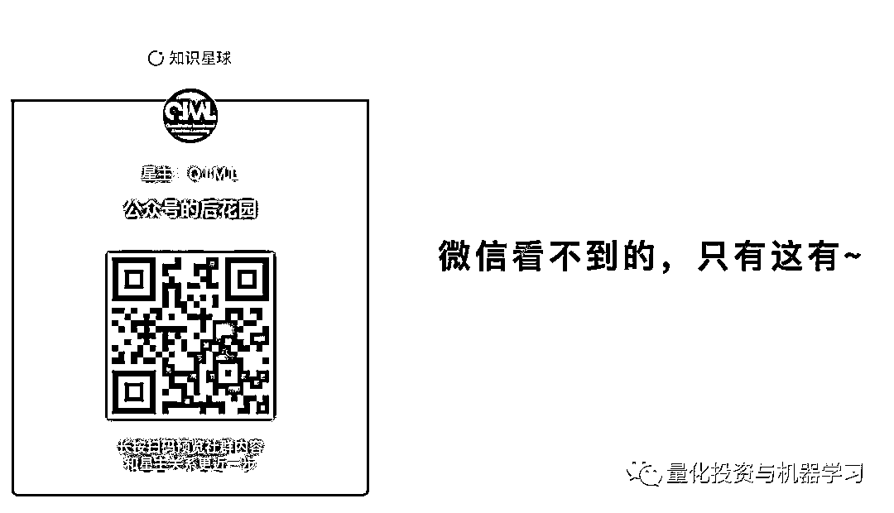

# 深度 | 如何面对投资中的巨大回撤？

> 原文：[`mp.weixin.qq.com/s?__biz=MzAxNTc0Mjg0Mg==&mid=2653290932&idx=1&sn=259801f8c8e158901139dad91ba2a527&chksm=802dc3a1b75a4ab74cf4f19a2a1acd200c98a93f6ff161756463e10dfa5d24cc472dd4af044b&scene=27#wechat_redirect`](http://mp.weixin.qq.com/s?__biz=MzAxNTc0Mjg0Mg==&mid=2653290932&idx=1&sn=259801f8c8e158901139dad91ba2a527&chksm=802dc3a1b75a4ab74cf4f19a2a1acd200c98a93f6ff161756463e10dfa5d24cc472dd4af044b&scene=27#wechat_redirect)

**标星★公众号**，第一时间获取最新研究

撰写：长信基金黄韵

来自：点拾投资

**近期原创文章：**

## ♥ [基于无监督学习的期权定价异常检测（代码+数据）](https://mp.weixin.qq.com/s?__biz=MzAxNTc0Mjg0Mg==&mid=2653290562&idx=1&sn=dee61b832e1aa2c062a96bb27621c29d&chksm=802dc257b75a4b41b5623ade23a7de86333bfd3b4299fb69922558b0cbafe4c930b5ef503d89&token=1298662931&lang=zh_CN&scene=21#wechat_redirect)

## ♥ [5 种机器学习算法在预测股价的应用（代码+数据）](https://mp.weixin.qq.com/s?__biz=MzAxNTc0Mjg0Mg==&mid=2653290588&idx=1&sn=1d0409ad212ea8627e5d5cedf61953ac&chksm=802dc249b75a4b5fa245433320a4cc9da1a2cceb22df6fb1a28e5b94ff038319ae4e7ec6941f&token=1298662931&lang=zh_CN&scene=21#wechat_redirect)

## ♥ [深入研读：利用 Twitter 情绪去预测股市](https://mp.weixin.qq.com/s?__biz=MzAxNTc0Mjg0Mg==&mid=2653290402&idx=1&sn=efda9ea106991f4f7ccabcae9d809e00&chksm=802e3db7b759b4a173dc8f2ab5c298ab3146bfd7dd5aca75929c74ecc999a53b195c16f19c71&token=1330520237&lang=zh_CN&scene=21#wechat_redirect)

## ♥ [Two Sigma 用新闻来预测股价走势，带你吊打 Kaggle](https://mp.weixin.qq.com/s?__biz=MzAxNTc0Mjg0Mg==&mid=2653290456&idx=1&sn=b8d2d8febc599742e43ea48e3c249323&chksm=802e3dcdb759b4db9279c689202101b6b154fb118a1c1be12b52e522e1a1d7944858dbd6637e&token=1330520237&lang=zh_CN&scene=21#wechat_redirect)

## ♥ [利用深度学习最新前沿预测股价走势](https://mp.weixin.qq.com/s?__biz=MzAxNTc0Mjg0Mg==&mid=2653290080&idx=1&sn=06c50cefe78a7b24c64c4fdb9739c7f3&chksm=802e3c75b759b563c01495d16a638a56ac7305fc324ee4917fd76c648f670b7f7276826bdaa8&token=770078636&lang=zh_CN&scene=21#wechat_redirect)

## ♥ [一位数据科学 PhD 眼中的算法交易](https://mp.weixin.qq.com/s?__biz=MzAxNTc0Mjg0Mg==&mid=2653290118&idx=1&sn=a261307470cf2f3e458ab4e7dc309179&chksm=802e3c93b759b585e079d3a797f512dfd0427ac02942339f4f1454bd368ba47be21cb52cf969&token=770078636&lang=zh_CN&scene=21#wechat_redirect)

## ♥ [基于 RNN 和 LSTM 的股市预测方法](https://mp.weixin.qq.com/s?__biz=MzAxNTc0Mjg0Mg==&mid=2653290481&idx=1&sn=f7360ea8554cc4f86fcc71315176b093&chksm=802e3de4b759b4f2235a0aeabb6e76b3e101ff09b9a2aa6fa67e6e824fc4274f68f4ae51af95&token=1865137106&lang=zh_CN&scene=21#wechat_redirect)

## ♥ [人工智能『AI』应用算法交易，7 个必踩的坑！](https://mp.weixin.qq.com/s?__biz=MzAxNTc0Mjg0Mg==&mid=2653289974&idx=1&sn=88f87cb64999d9406d7c618350aac35d&chksm=802e3fe3b759b6f5eca6e777364270cbaa0bf35e9a1535255be9751c3a77642676993a861132&token=770078636&lang=zh_CN&scene=21#wechat_redirect)

## ♥ [神经网络在算法交易上的应用系列（一）](https://mp.weixin.qq.com/s?__biz=MzAxNTc0Mjg0Mg==&mid=2653289962&idx=1&sn=5f5aa65ec00ce176501c85c7c106187d&chksm=802e3fffb759b6e9f2d4518f9d3755a68329c8753745333ef9d70ffd04bd088fd7b076318358&token=770078636&lang=zh_CN&scene=21#wechat_redirect)

## ♥ [预测股市 | 如何避免 p-Hacking，为什么你要看涨？](https://mp.weixin.qq.com/s?__biz=MzAxNTc0Mjg0Mg==&mid=2653289820&idx=1&sn=d3fee74ba1daab837433e4ef6b0ab4d9&chksm=802e3f49b759b65f422d20515942d5813aead73231da7d78e9f235bdb42386cf656079e69b8b&token=770078636&lang=zh_CN&scene=21#wechat_redirect)

## ♥ [如何鉴别那些用深度学习预测股价的花哨模型？](https://mp.weixin.qq.com/s?__biz=MzAxNTc0Mjg0Mg==&mid=2653290132&idx=1&sn=cbf1e2a4526e6e9305a6110c17063f46&chksm=802e3c81b759b597d3dd94b8008e150c90087567904a29c0c4b58d7be220a9ece2008956d5db&token=1266110554&lang=zh_CN&scene=21#wechat_redirect)

## ♥ [优化强化学习 Q-learning 算法进行股市](https://mp.weixin.qq.com/s?__biz=MzAxNTc0Mjg0Mg==&mid=2653290286&idx=1&sn=882d39a18018733b93c8c8eac385b515&chksm=802e3d3bb759b42d1fc849f96bf02ae87edf2eab01b0beecd9340112c7fb06b95cb2246d2429&token=1330520237&lang=zh_CN&scene=21#wechat_redirect)

**导读**

大部分人的成长都来自痛苦的经历，看到每一个成功投资大师的背后，都有失败的经历。从一个人，到一种策略，我们都需要了解其背后的弱点，以及完整的进化过程。这也是为什么这本《Big Mistakes: The Best Investors and Their Worst Investments》能够从另一个视角给我们带来启发。

为了将这些投资大师不为人知的失败和大家分享，点拾投资特意和长信基金的投研团队一起合作,将本书的内容原汁原味翻译出来，和朋友们共享。在这里，我们非常感谢长信基金投研团队的无私分享。

今天和大家分享的是第十四章：查理·芒格，如何正确看待投资中的回撤。

**译者前言**

这个章节的内容描述了一个略带残酷的现实市场，这就是无论是一个长期向上的市场还是一个长期向上的公司都难免会经历大幅的向下波动，这和我们当下所处的市场环境是何其的相似。而在遭受市场损失时如何从容面对，对于任何投资者而言都是相当不易的，因为我们不仅要考虑投资组合的波动率，我们还要考虑到基金持有人的感受。而这两方面的需求在某些极端下行的市场环境下也是相互矛盾的。也许我们作为投资人有能够承担市场损失的能力，但我们可能会因此失去我们的投资人。芒格作为伟大的投资导师，他的亲身经历给了我们很好的借鉴，如何真的拥有耐心、守纪以及即使遭受损失和身处逆境也不会疯掉的能力。

***学会承受损失***

***你需要有耐心、守纪以及即使遭受损失和身处逆境也不会疯掉的能力。***

*-查理·芒格 | 2005*

毫无疑问，奈飞、亚马逊和谷歌是过去十年中最成功的三个公司。他们的产品深刻地改变了我们生活方式，如果他们的股东能够长期坚持持有他们的股票，这些股东们也将获得巨大的投资收益。然而，最古老的一条金融法则之一就是收益永远和风险相伴。如果你想要获得巨大的投资收益，你也注定要承担相伴而来的风险。

自 1997 年首次上市以来，亚马逊股价涨幅高达 38600％，相当于年复合收益率 35.5％。 这意味着初始 1000 美元的投资到今天将变为$ 387,000。 但实际上在过去 20 年中，要真的将这 1000 美金变为 387,000 美元的难度不容小觑。历史上，亚马逊的股价曾有三次跌幅超过 50%。第一次是从 1999 年 12 月到 2001 年 10 月，它跌去了 95％的市值。在那段时间内，初始假设的 1,000 美元投资将会从 54,433 美元的高位下跌至 3,045 美元，损失 51,388 美元。

这也就是为什么会说能够买入并持有一个长期的赢家其实并不简单。也许你确实知道“亚马逊将会改变世界”，但即便如此，也不会使投资变得更加容易。

另一家革命性的公司奈飞，自 2002 年 5 月上市以来的复合收益率为 38％。但实现这个收益也几乎超出了人所能承受的投资纪律。奈飞的股价曾有四次跌幅超过 50%，其在 2011 年 7 月至 2012 年 9 月间跌幅超过 82%。这相当于初始投资的 1,000 美元涨到 36,792 美元，然后萎缩到 6,629 美元。投资者真的能够忍受他们的初始投资回撤三十多次吗？特别是 500%收益在短短 14 个月内烟消云散！

谷歌是这三家公司中最年轻的公司，自 2004 年上市以来的年复合收益率为 25％。他为投资者提供了一个比持有亚马逊或 Netflix 更好的投资体验。 谷歌的股价只有一次跌幅超过 50%，就是在 2017 年 11 月至 2018 年 11 月间跌幅达到 65%。当他的股价大幅回撤时，很多投资都无法忍受这段时期。在这 264 天内，谷歌的换手量达到 8450 亿美金，而当时谷歌的平均市值不到 1530 亿美金。也就是说，这段时间内股票被换手了 5.5 次，这使很多投资者失去了未来八年能够获得 515%回报的机会。

查理芒格从来没有对投资亚马逊、奈飞、谷歌这类公司感过兴趣。但他长期投资过的那些让他获得巨大投资收益的公司也曾在短时期内出现过巨大的回撤。芒格，伯克希尔哈撒韦公司的副董事长，以作为沃伦巴菲特的长期合作伙伴而闻名。他那些富有智慧和哲理的名言被统称为芒格主义。**他喜欢用不同的思维方式从多个角度思考问题，他的名言之一是“如果知道我会死在哪里，那我将永远不去那个地方”。在 2002 年伯克希尔哈撒韦股东大会上他说“人们算得太多、想得太少”。**

将芒格和我们大部分平庸的人区分开的一点是他永远不会被他能力圈外的投资所吸引。他曾经说过“我们有三个篮子，分别是进入、退出、太难” 1。投资者都应该遵循他的建议“如果投资标的太难分析，我们就转向其他的投资标的。还有比这更简单的事情吗？” 2。

今天，我们的市场上涌现出很多为投资者服务的新产品，这些产品就像那些紫色和绿色的鱼饵：我想我们的投资管理之所以陷入窘境的原因就像下面这个我和渔具老板的对话所揭示的道理那样。我问他：“我的天，这些紫的和绿的鱼饵！鱼真的会因此而上钩吗？”，他说：“先生，我不卖鱼” 3。

1948 年，芒格毕业于哈佛大学法学院，并追随其父亲的脚步成功的开拓了法律事业。在芒格的早期投资生涯中，他通过投资地产项目获得了他的第一个百万美元。1959 年他的投资热情被彻底点燃，这一年埃德戴维斯（Ed Davis）作为巴菲特的第一批投资者将他介绍给了巴菲特。巴菲特惊讶于他很轻松的获得了埃德戴维斯的 10 万美金，因为戴维斯似乎并没有太在意巴菲特的投资策略。这其中的原因在于巴菲特很像戴维斯全心全意信任的另一位投资人查理芒格。他们两人如此之像以至于戴维斯曾经在给巴菲特的支票上填了芒格的名字。4

芒格和巴菲特一见如故。 在和巴菲特经过多年的沟通、相互学习和分享后，芒格在 1962 年和其他合伙人创办了一家律师事务所（Munger，Tolles＆Olson; 查理在 1965 年离开），同时他也创立了一个对冲基金公司（Wheeler，Munger＆Company）。

芒格的投资业绩斐然。从 1962 年到 1969 年，该基金扣除费率之前的年均回报率达到令人难以置信的 37.1％。5 尤其是当你结合当时的市场环境看的话，这个成绩更是显的难能可贵。在这八年中，挑选股票并不是件简单的事情。 事实上，标准普尔 500 指数（含股息）在同一时间内只上涨了 6.6％。 在整个基金存续的 14 年内，芒格年均回报率为 24％，复合收益率为 19.82％，远高于指数，同期标准普尔 500 指数（含股息）复合收益率仅为 5.2％。 芒格的有限合伙人如果能和芒格一道坚持下来也将收益丰厚，然而这件事就像一直坚持持有亚马逊公司一样并不那么容易。

投资者从过往历史中可以学到的最好一条经验就是没有坏时光就没有好时光。在一段长期的投资中往往蕴含着短期阶段性的大幅损失。如果你不能接受短期的损失，那你很难收获长期的市场回报。芒格说过：

**如果你对于在一个世纪内发生两三次或者更多次市场超过 50%下跌不能泰然处之，你就不适合做投资，并且和那些具有能理性处理市场波动的投资者相比也只能获得相对平庸的投资收益。6**

沃伦巴菲特曾这样评价芒格：“他愿意接受业绩出现更大的起伏，他恰好是一位心理结构倾向集中的人”7。当然芒格不仅是专注这么简单，他的专注是建立在更高层面上的多元化思考。 1974 年底，其 61％的资金投资于蓝筹印花公司 8。在那个自大萧条以来最糟糕的熊市里，这个公司给芒格的投资组合带来了严重的损害。 蓝筹印花公司的销售额在当年超过了 1.24 亿美金。但是很快就开始减少，到 1982 年，销售额锐减至 900 万美元，到 2006 年仅为 2.5 万美金。 “考虑到蓝筹印花公司的初始业务，“我预测到其销售额将从 1.2 亿美金降到不足 10 万美金，所以我从开始就预测到了其业务单独看几乎就是一个会失败的业务””。9

然而蓝筹印花公司作为基金投资的重要的资产，在之后为收购喜诗糖果、布法罗晚报和韦斯科金融公司等提供了大量的资金，并于 1983 年被纳入伯克希尔哈撒韦公司旗下。10

芒格在 1973 年损失了 31.9％（相比之下，道琼斯工业指数为-13.1％），在 1974 年损失了 31.5％（相比之下道琼斯指数为-23.1％）。 芒格说：“我们在 1973 年到 1974 年间被市场碾压了，并不是因为被真实低估的价值，而是市场价值，因为我们的公开交易证券不得不在低于他们真正价值的一半价格下交易。 “这是一段艰难的经历 -- 1973 年至 1974 年是一个非常不愉快的经历。”11 芒格并不孤单，对许多伟大的投资者来说，这都是一个很艰难的过程。巴菲特的伯克希尔哈撒韦公司从 1972 年 12 月的 80 美元跌至 1974 年 12 月的 40 美元。1973 年至 1974 年的熊市标准普尔 500 指数下跌 50％（道琼斯工业指数下跌 46.6％，直接回到 1958 年的水平）。

**与查理芒格一起从 1973 年 1 月 1 日开始投资的 1,000 美元到 1975 年 1 月 1 日将变为 467 美元。即使该基金在 1975 年上涨了 73.2%，但芒格还是失去了其最大的投资人，这让他感到沮丧，并使他做出了清算基金的决定。**这只基金在其整个生命周期即使经历了从 1973 年到 1974 年的残酷历史时期也获得了扣费前 24.3%的复合收益率。

不仅仅是那些明星股票会跌幅超过 50%。那些长期复合增长的指数在某一个点上也都可能会发生回撤。道琼斯指数自 1914 年以来增长了 26400%，其中包含了 9 次超过 30%的回撤。在大萧条期间道指跌幅超过 90%，直到 1955 年才回到 1929 年的那个高点。道琼斯指数作为蓝筹股指数在二十一世纪的第一个十年内就发生过两次大幅回撤（科技泡沫破灭期跌幅 38%，金融危机期间跌幅 54%）。

对于像你我这样大多数普通的投资者而言，如果我们要寻求高额的投资回报，那么巨大亏损注定也是其中的一个部分，无论投资周期是几年还是一生。芒格曾经说过“我们热衷于保持简单” 12。你可以简化你想要的一切，但这并不会使你远离亏损。即使是 50/50 的股票和债券配置的投资组合在金融危机期间也损失了 25%。

**有几种方法来处理损失。第一是损失是绝对的，即你的投资损失。**在芒格的例子里，他很少有绝对损失。在他管理他的对冲基金期间，他经历过 53%的下跌，他持有的伯克希尔哈撒韦公司的股票有过 6 次跌幅超过 20%。对于不熟悉的人来说，回撤就是从高点开始的下行。换句话说，伯克希尔哈撒韦创历史新高后下跌超过 20%的情况发生了 6 次。

**第二种类型的损失是相对的，即你的机会成本。** 在九十年代末期，当互联网股票席卷全国时，伯克希尔并没有对其进行投资。这也让他们付出了代价。 从 1998 年 6 月到 2000 年 3 月，伯克希尔下跌了 49%。 然而更痛苦的是，互联网股票在持续飙升。同期纳斯达克 100 指数上涨了 270％！ 在 1999 年伯克希尔哈撒韦致股东的信中，沃伦巴菲特写道“相对收益是我们关心的问题，在同期，不好的相对收益造成了并不令人满意的绝对收益”。

无论你是投资股票还是指数，不好的相对收益都是投资中要面对的一个问题。在五年的互联网泡沫中，伯克希尔哈撒韦公司的收益表现落后于标准普尔 500 指数 117％！当时很多人质疑芒格和巴菲特是否脱节与新世界。

芒格的财富之所以能够在过去 55 年内持续复合增长的原因，用他自己的话说就是：**沃伦和我并非奇才。我们不能蒙上眼睛下棋或成为钢琴演奏家。但我们的成绩斐然，因为我们在性情上占优势，这足以弥补我们在智商上的不足 13。**

你必须能对损失泰然处之。合适的卖时点并不是在股价已经下跌之后。如果你这样投资，你可能就注定了不会取得好的长期回报。 从历史中学习，不要试图避免损失。 损失是不可避免的。相反，应该专注于确保没有把自己会被迫卖出的境地。如果你知道股票曾经跌幅超过 50%，这种情况无疑将来还会发生，请确保你未来能面对和承担这样的情况。

如何做？这里有个例子。假设你的投资组合价值 10 万美元并且你知道你不能忍受超过 3 万美元的损失。假设如果股票价值减少一半而债券将保留价值（这绝对是一个假设，没有任何保证），那就不要配置超过 60%的股票资产。那样即使这 60%的资产下跌一半，你也应该还好。

备注

1．Wesco 年会，2002 年

2．伯克希尔哈撒韦年会，2006 年

3．南加州大学商学院，1994 年

4．Janet Lowe，Damn Right! Behind the Scenes with BerkshireHathaway Billionaire Charlie Munger (Hoboken, NJ: Wiley,2000) 2。

5\. 同上，103。

6\. BBC 的采访，2012 年

7．Lowe，Damn Right!，100。

8．同上，105

9．加利福尼亚州洛杉矶县高级法院安吉利斯，大都会新闻公司诉 Daily Journal 公司和 Charles T. Munger，1999 年 7 月 1 日，Vol12，p1815

10\. Charles Munger，“Blue Chip Stamps 股东信函 1978-1982 年

11\. Lowe，Damn Right!，100，103

12\. Wesco 年会，2002 年

13\. Jason Zweig，“与查理芒格的炉边访谈”，华尔街期刊，2014 年 9 月 12 日

**推荐阅读**

[01、经过多年交易之后你应该学到的东西（深度分享）](https://mp.weixin.qq.com/s?__biz=MzAxNTc0Mjg0Mg==&mid=2653289074&idx=1&sn=e859d363eef9249236244466a1af41b6&chksm=802e3867b759b1717f77e07a51ee5671e8115130c66562577280ba1243cba08218add04f1f00&token=449379994&lang=zh_CN&scene=21#wechat_redirect)

[02、监督学习标签在股市中的应用（代码+书籍）](https://mp.weixin.qq.com/s?__biz=MzAxNTc0Mjg0Mg==&mid=2653289050&idx=1&sn=60043a5c95b877dd329a5fd150ddacc4&chksm=802e384fb759b1598e500087374772059aa21b31ae104b3dca04331cf4b63a233c5e04c1945a&token=449379994&lang=zh_CN&scene=21#wechat_redirect)

[03、全球投行顶尖机器学习团队全面分析](https://mp.weixin.qq.com/s?__biz=MzAxNTc0Mjg0Mg==&mid=2653289018&idx=1&sn=8c411f676c2c0d92b0dd218f041bee4b&chksm=802e382fb759b139ffebf633ac14cdd0f21938e4613fe632d5d9231dab3d2aca95a11628378a&token=449379994&lang=zh_CN&scene=21#wechat_redirect)

[04、使用 Tensorflow 预测股票市场变动](https://mp.weixin.qq.com/s?__biz=MzAxNTc0Mjg0Mg==&mid=2653289014&idx=1&sn=3762d405e332c599a21b48a7dc4df587&chksm=802e3823b759b135928d55044c2729aea9690f86752b680eb973d1a376dc53cfa18287d0060b&token=449379994&lang=zh_CN&scene=21#wechat_redirect)

[05、使用 LSTM 预测股票市场基于 Tensorflow](https://mp.weixin.qq.com/s?__biz=MzAxNTc0Mjg0Mg==&mid=2653289238&idx=1&sn=3144f5792f84455dd53c27a78e8a316c&chksm=802e3903b759b015da88acde4fcbc8547ab3e6acbb5a0897404bbefe1d8a414265d5d5766ee4&token=2020206794&lang=zh_CN&scene=21#wechat_redirect)

[06、美丽的回测——教你定量计算过拟合概率](https://mp.weixin.qq.com/s?__biz=MzAxNTc0Mjg0Mg==&mid=2653289314&idx=1&sn=87c5a12b23a875966db7be50d11f09cd&chksm=802e3977b759b061675d1988168c1fec06c602e8583fbcc9b76f87008e0c10b702acc85467a0&token=1972390229&lang=zh_CN&scene=21#wechat_redirect)

[07、利用动态深度学习预测金融时间序列基于 Python](https://mp.weixin.qq.com/s?__biz=MzAxNTc0Mjg0Mg==&mid=2653289347&idx=1&sn=bf5d7899bc4a854d4ba9046fdc6fe0d6&chksm=802e3996b759b080287213840987bb0a0c02e4e1d4d7aae23f10a225a92ef6dd922d8006123d&token=290397496&lang=zh_CN&scene=21#wechat_redirect)

[08、Facebook 开源神器 Prophet 预测时间序列基于 Python](https://mp.weixin.qq.com/s?__biz=MzAxNTc0Mjg0Mg==&mid=2653289394&idx=1&sn=24a836136d730aa268605628e683d629&chksm=802e39a7b759b0b1dcf7aaa560699130a907716b71fc9c45ff0e5d236c5ae8ef80ebdb09dbb6&token=290397496&lang=zh_CN&scene=21#wechat_redirect)

[09、Facebook 开源神器 Prophet 预测股市行情基于 Python](https://mp.weixin.qq.com/s?__biz=MzAxNTc0Mjg0Mg==&mid=2653289437&idx=1&sn=f0dca7da8e69e7ba736992cb3d034ce7&chksm=802e39c8b759b0de5bce401c580623d0729ecca69d13926479d36e19aff8c9c9e8a20265afff&token=290397496&lang=zh_CN&scene=21#wechat_redirect)

[10、2018 第三季度最受欢迎的券商金工研报前 50（附下载）](https://mp.weixin.qq.com/s?__biz=MzAxNTc0Mjg0Mg==&mid=2653289358&idx=1&sn=db6e8ab85b08f6e67790ec0e401e586e&chksm=802e399bb759b08d6eec855f9901ea856d0da68c7425cba62791b8948da6ad761a3d88543dad&token=290397496&lang=zh_CN&scene=21#wechat_redirect)

[11、实战交易策略的精髓（公众号深度呈现）](https://mp.weixin.qq.com/s?__biz=MzAxNTc0Mjg0Mg==&mid=2653289447&idx=1&sn=f2948715bf82569a6556d518e56c1f9e&chksm=802e39f2b759b0e4502d1aaac562b87789573b55c76b3c85897d8c9d88dbf9a0b7ee34d86a4e&token=290397496&lang=zh_CN&scene=21#wechat_redirect)

[12、Markowitz 有效边界和投资组合优化基于 Python](https://mp.weixin.qq.com/s?__biz=MzAxNTc0Mjg0Mg==&mid=2653289478&idx=1&sn=f8e01a641be021993d8ef2d84e94a299&chksm=802e3e13b759b7055cf27a280c672371008a5564c97c658eee89ce8481396a28d254836ff9af&token=290397496&lang=zh_CN&scene=21#wechat_redirect)

[13、使用 LSTM 模型预测股价基于 Keras](https://mp.weixin.qq.com/s?__biz=MzAxNTc0Mjg0Mg==&mid=2653289495&idx=1&sn=c4eeaa2e9f9c10995be9ea0c56d29ba7&chksm=802e3e02b759b7148227675c23c403fb9a543b733e3d27fa237b53840e030bf387a473d83e3c&token=1260956004&lang=zh_CN&scene=21#wechat_redirect)

[14、量化金融导论 1：资产收益的程式化介绍基于 Python](https://mp.weixin.qq.com/s?__biz=MzAxNTc0Mjg0Mg==&mid=2653289507&idx=1&sn=f0ca71aa07531bbbdbd33213f0bab89f&chksm=802e3e36b759b720138b3b17a4dd0e198e054b9de29a038fdd50805f824effa55831111ad026&token=1936245282&lang=zh_CN&scene=21#wechat_redirect)

[15、预测股市崩盘基于统计机器学习与神经网络（Python+文档）](https://mp.weixin.qq.com/s?__biz=MzAxNTc0Mjg0Mg==&mid=2653289533&idx=1&sn=4ef964834e84a9995111bb057b0fc5dd&chksm=802e3e28b759b73e0618eb1262c53aa0601fbf5805525a7c7ff40dc3db62c7704496611bdbf1&token=1950551577&lang=zh_CN&scene=21#wechat_redirect)

[16、实现最优投资组合有效前沿基于 Python（附代码）](https://mp.weixin.qq.com/s?__biz=MzAxNTc0Mjg0Mg==&mid=2653289609&idx=1&sn=c7f0b3e47025862d10bb53b6ab88bcda&chksm=802e3e9cb759b78abf6b8b049c59bf18ccfb2ead7580d1f557d36de2292f59dcbd94dcd41910&token=2085008037&lang=zh_CN&scene=21#wechat_redirect)

[17、精心为大家整理了一些超级棒的机器学习资料（附链接）](https://mp.weixin.qq.com/s?__biz=MzAxNTc0Mjg0Mg==&mid=2653289615&idx=1&sn=1cdc89afb997d0c580bf0cef296d946c&chksm=802e3e9ab759b78ce9f0cd152a680d4a413d6c8dcb02a7a296f4091993a7e4137e7520394575&token=2085008037&lang=zh_CN&scene=21#wechat_redirect)

[18、海量 Wind 数据，与全网用户零距离邂逅！](https://mp.weixin.qq.com/s?__biz=MzAxNTc0Mjg0Mg==&mid=2653289623&idx=1&sn=28a3600fd7a72d7be00b066ca0f98244&chksm=802e3e82b759b7943f43a4f6ef4a91e4153fa6b8210de9590235fa8ee66eb9811ce177054dbc&token=1389401983&lang=zh_CN&scene=21#wechat_redirect)

[19、机器学习、深度学习、量化金融、Python 等最新书籍汇总下载](https://mp.weixin.qq.com/s?__biz=MzAxNTc0Mjg0Mg==&mid=2653289640&idx=1&sn=34e94fcbe99052b8e7381ecc48a36dc0&chksm=802e3ebdb759b7ab897cd329a680715b6f8294e63550ddf0c57b9e1320b2b7d1408c6fdca0c7&token=1389401983&lang=zh_CN&scene=21#wechat_redirect)

[20、各大卖方 2019 年 A 股策略报告，都是有故事的人！](https://mp.weixin.qq.com/s?__biz=MzAxNTc0Mjg0Mg==&mid=2653289725&idx=1&sn=4b65cd1fb8331438e4c0b3d0eae6b51f&chksm=802e3ee8b759b7fe1b94e84d54cc23b0ab05853d5cd227812574b350e9fc2cce9e5f1bc6cb7a&token=1389401983&lang=zh_CN&scene=21#wechat_redirect)

**扫码关注我们**

