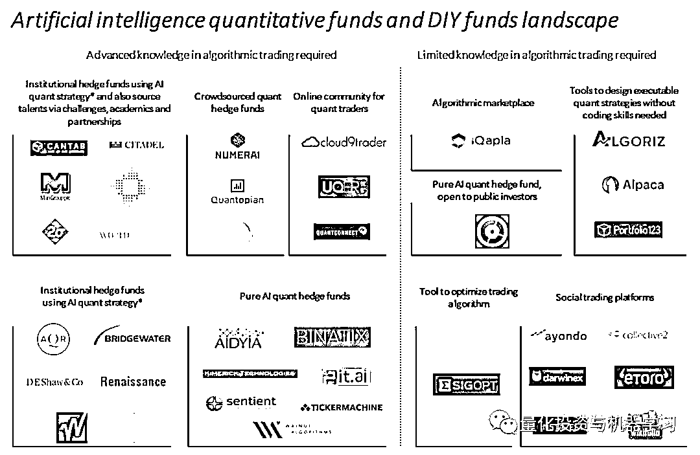
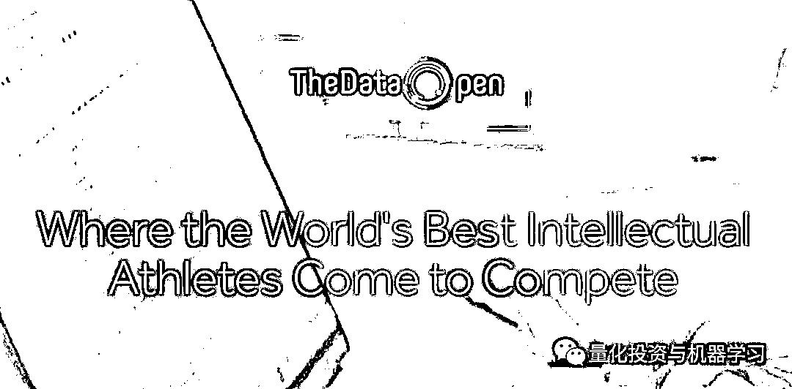

# 独家 | 全球 AI 量化金融机构全景图（附完整分析）

> 原文：[`mp.weixin.qq.com/s?__biz=MzAxNTc0Mjg0Mg==&mid=2653290903&idx=1&sn=a710e6ff2f41fdf90e162cc910fe1031&chksm=802dc382b75a4a94ec784c99146e08486fef8b5cd0bdc06748e649fcb355d6e455e743f5e42b&scene=27#wechat_redirect`](http://mp.weixin.qq.com/s?__biz=MzAxNTc0Mjg0Mg==&mid=2653290903&idx=1&sn=a710e6ff2f41fdf90e162cc910fe1031&chksm=802dc382b75a4a94ec784c99146e08486fef8b5cd0bdc06748e649fcb355d6e455e743f5e42b&scene=27#wechat_redirect)

**标星★公众号**，第一时间获取最新研究

编辑：1+1=6

**近期原创文章：**

## ♥ [基于无监督学习的期权定价异常检测（代码+数据）](https://mp.weixin.qq.com/s?__biz=MzAxNTc0Mjg0Mg==&mid=2653290562&idx=1&sn=dee61b832e1aa2c062a96bb27621c29d&chksm=802dc257b75a4b41b5623ade23a7de86333bfd3b4299fb69922558b0cbafe4c930b5ef503d89&token=1298662931&lang=zh_CN&scene=21#wechat_redirect)

## ♥ [5 种机器学习算法在预测股价的应用（代码+数据）](https://mp.weixin.qq.com/s?__biz=MzAxNTc0Mjg0Mg==&mid=2653290588&idx=1&sn=1d0409ad212ea8627e5d5cedf61953ac&chksm=802dc249b75a4b5fa245433320a4cc9da1a2cceb22df6fb1a28e5b94ff038319ae4e7ec6941f&token=1298662931&lang=zh_CN&scene=21#wechat_redirect)

## ♥ [深入研读：利用 Twitter 情绪去预测股市](https://mp.weixin.qq.com/s?__biz=MzAxNTc0Mjg0Mg==&mid=2653290402&idx=1&sn=efda9ea106991f4f7ccabcae9d809e00&chksm=802e3db7b759b4a173dc8f2ab5c298ab3146bfd7dd5aca75929c74ecc999a53b195c16f19c71&token=1330520237&lang=zh_CN&scene=21#wechat_redirect)

## ♥ [Two Sigma 用新闻来预测股价走势，带你吊打 Kaggle](https://mp.weixin.qq.com/s?__biz=MzAxNTc0Mjg0Mg==&mid=2653290456&idx=1&sn=b8d2d8febc599742e43ea48e3c249323&chksm=802e3dcdb759b4db9279c689202101b6b154fb118a1c1be12b52e522e1a1d7944858dbd6637e&token=1330520237&lang=zh_CN&scene=21#wechat_redirect)

## ♥ [利用深度学习最新前沿预测股价走势](https://mp.weixin.qq.com/s?__biz=MzAxNTc0Mjg0Mg==&mid=2653290080&idx=1&sn=06c50cefe78a7b24c64c4fdb9739c7f3&chksm=802e3c75b759b563c01495d16a638a56ac7305fc324ee4917fd76c648f670b7f7276826bdaa8&token=770078636&lang=zh_CN&scene=21#wechat_redirect)

## ♥ [一位数据科学 PhD 眼中的算法交易](https://mp.weixin.qq.com/s?__biz=MzAxNTc0Mjg0Mg==&mid=2653290118&idx=1&sn=a261307470cf2f3e458ab4e7dc309179&chksm=802e3c93b759b585e079d3a797f512dfd0427ac02942339f4f1454bd368ba47be21cb52cf969&token=770078636&lang=zh_CN&scene=21#wechat_redirect)

## ♥ [基于 RNN 和 LSTM 的股市预测方法](https://mp.weixin.qq.com/s?__biz=MzAxNTc0Mjg0Mg==&mid=2653290481&idx=1&sn=f7360ea8554cc4f86fcc71315176b093&chksm=802e3de4b759b4f2235a0aeabb6e76b3e101ff09b9a2aa6fa67e6e824fc4274f68f4ae51af95&token=1865137106&lang=zh_CN&scene=21#wechat_redirect)

## ♥ [人工智能『AI』应用算法交易，7 个必踩的坑！](https://mp.weixin.qq.com/s?__biz=MzAxNTc0Mjg0Mg==&mid=2653289974&idx=1&sn=88f87cb64999d9406d7c618350aac35d&chksm=802e3fe3b759b6f5eca6e777364270cbaa0bf35e9a1535255be9751c3a77642676993a861132&token=770078636&lang=zh_CN&scene=21#wechat_redirect)

## ♥ [神经网络在算法交易上的应用系列（一）](https://mp.weixin.qq.com/s?__biz=MzAxNTc0Mjg0Mg==&mid=2653289962&idx=1&sn=5f5aa65ec00ce176501c85c7c106187d&chksm=802e3fffb759b6e9f2d4518f9d3755a68329c8753745333ef9d70ffd04bd088fd7b076318358&token=770078636&lang=zh_CN&scene=21#wechat_redirect)

## ♥ [预测股市 | 如何避免 p-Hacking，为什么你要看涨？](https://mp.weixin.qq.com/s?__biz=MzAxNTc0Mjg0Mg==&mid=2653289820&idx=1&sn=d3fee74ba1daab837433e4ef6b0ab4d9&chksm=802e3f49b759b65f422d20515942d5813aead73231da7d78e9f235bdb42386cf656079e69b8b&token=770078636&lang=zh_CN&scene=21#wechat_redirect)

## ♥ [如何鉴别那些用深度学习预测股价的花哨模型？](https://mp.weixin.qq.com/s?__biz=MzAxNTc0Mjg0Mg==&mid=2653290132&idx=1&sn=cbf1e2a4526e6e9305a6110c17063f46&chksm=802e3c81b759b597d3dd94b8008e150c90087567904a29c0c4b58d7be220a9ece2008956d5db&token=1266110554&lang=zh_CN&scene=21#wechat_redirect)

## ♥ [优化强化学习 Q-learning 算法进行股市](https://mp.weixin.qq.com/s?__biz=MzAxNTc0Mjg0Mg==&mid=2653290286&idx=1&sn=882d39a18018733b93c8c8eac385b515&chksm=802e3d3bb759b42d1fc849f96bf02ae87edf2eab01b0beecd9340112c7fb06b95cb2246d2429&token=1330520237&lang=zh_CN&scene=21#wechat_redirect)

**前言**

先上图

然后我们一家家分析

**通过竞赛、学术和合作关系来寻找人才**

招聘是量化基金面临的主要挑战。激烈的竞争迫使量化基金重新设计工作环境，并采取新的招聘策略，包括与 Quantopian 等众包对冲基金合作，加强与大学的关系，以及推出 datathon，以寻找下一个西蒙斯。

图：来自网络

*   **Cantab Capital（英国）：**于 2016 年 6 月被 GAM 收购。该基金通过在数学学院内设立的 Cantab 资本信息数学研究所与剑桥大学有着密切的联系。

    ▍网站：https://www.cantabcapital.com/why-cantab

*   **Citadel（美国）：**推出了 Datathon，获胜者将获得价值 10 万美元的奖金。

    ▍网站：https://www.citadel.com/

*   **Point72（美国）：**史蒂夫•科恩的私人投资工具。该公司投资了 Quantopian，并宣布将向 Quantopian 管理的算法投资近 2.5 亿美元。

    ▍https://www.point72.com/

*   **Two Sigma（美国）：**率先与 Kaggle 一起提供公共金融建模挑战的公司之一，在该挑战中，Quant 有 3 个月的时间，利用 Two Sigma 提供的 4G 金融数据创建一个可预测的交易模型。

    ▍https://www.twosigma.com/

*   **WorldQuant（美国）：**WorldQuant 挑战赛提供了一个在 WorldQuant 竞争并获得研究顾问职位的机会。

    ▍https://www.worldquant.com/home/

**个性十足**

这些基金是最受推崇的。然而，他们似乎都没有采取合作/竞赛的形式策略来吸引新人才。 

*   **AQR（美国）：**成立于 1998 年，管理着 1750 亿美元资产，为机构客户和金融顾问提供各种量化模型和传统投资工具。

    ▍https://www.aqr.com/

*   **Bridgewater Associates（美国）：**是全球最大的对冲基金，拥有 1500 亿美元资产，位于人工智能研究的最前沿。该基金对其招聘员工的方式十分隐秘。

    ▍https://www.bridgewater.com/

*   **D.E Shaw（美国）：**成立于 1988 年，目前管理着约 400 亿美元的资产。

    ▍https://www.deshaw.com/

*   **Renaissance Technologies（美国）：**成立于 1982 年，是量化交易的先驱之一。这家相必大家耳熟能详，西蒙斯掌管的哟。Renaissance 的旗舰基金 Medallion 主要面向基金员工，该基金"以投资史上最佳纪录之一而闻名，20 年间年化回报率超过 35%。"

    ▍https://www.rentec.com/Home.action?index=true

*   **Winton Capital（英国）：**是欧洲最受尊敬的量化基金之一，资产管理规模约为 280 亿美元。该基金近期推出了自己的孵化器，并开拓了风险投资部门。

    ▍https://www.winton.com/

**众包量化对冲基金**

到目前为止，Quantopian 似乎在资金、机构支持以及谷歌趋势方面处于领先地位…… 

*   **Quantopian（美国）：**是资金最充裕的新量化基金之一，投资者包括 Point72、Andreessen Horowitz 和 Bessemer，共投资 4900 万美元。用户可以分享他们的算法/策略。然后，Quantopian 选择最好的算法/策略并换取部分回报。

    ▍https://www.quantopian.com/posts

*   **Numerai（美国）：**拥有来自 Union Square、Playfair Capital 和 First round 等公司的 750 万美元资金，管理着一只多/空全球股票对冲基金。它为其全球数据科学家社区将金融数据转化为机器学习问题，并将其规范化。此外，也是唯一一家通过比特币提供完全匿名和支付服务对冲基金。

    ▍https://numer.ai/homepage

*   **Quantiacs（美国）：**通常被称为世界上第一个也是唯一一个众包对冲基金匹配自由定量化析师与机构投资资本。Quant 拥有自己的 IP，但将其授权给 Quantiacs 以获得 10%的终身利润。

    ▍https://www.quantiacs.com/

**在线量化社区**

大家可以在平台上分享策略与研究、评论，也可以访问数据，还可以进行回测。 

*   **Backtrader（美国）：**能够专注于编写可重复使用的交易策略、指标和分析，而不是花时间构回测框架。

    ▍https://www.backtrader.com/

*   **Quantconnect （美国）：**提供了使用免费数据集设计和测试策略的能力，并允许通过券商直接部署交易。用户可以用多种编程语言编写代码，并利用数百台服务器集群运行回测，分析他们在股票、外汇、期权或期货市场的策略。

    ▍https://www.quantconnect.com/

*   **UQER （中国）：**优矿是国内最早的一批量化平台，提供免费的数据支持和丰富的社区交流。宽客可以随时随地创建和回测策略。

    ▍https://uqer.io/

*   **Cloud9trader（英国）：**允许开发人员通过经纪人从算法交易中获利。

    ▍https://www.cloud9trader.com/

** 纯 AI 量化对冲基金**

他们的目标是实现所有投资研究和交易的自动化，以创造高额回报。许多人喜欢来自 WorldQuant 的 Igor Tulchinsky 认为人工智能更像是一种帮助人类交易员的工具，而不是替代他们。

*   **Aidyia（香港）：**运用先进的人工智能技术，识别金融市场模式和预测价格走势。

    ▍http://www.aidyia.com/

*   **Binatix（美国）：**是最早使用机器学习算法来发现投资模式的公司之一。

    ▍http://www.binatix.com/

*   **Kimerick Technologies （美国）：**使用机器学习和人工神经网络驱动预测交易。

    ▍http://www.kimerick.com/

*   **Pit.ai（英国）：**一个机器学习型对冲基金，被纳入 YC W17 类别。

    ▍https://pit.ai/

*   **Sentient Technologies （美国/香港）：**是拥有最多资金的公司之一，从 Access Industries、TATA Ventures 和 Horizon Ventures 获得 1.4 亿美元资金。

    ▍https://www.sentient.ai/

*   **Tickermachine（美国）：**是一家基于行为经济学原理的低频算法交易公司。

    ▍https://tickermachine.com/

*   **Walnut Algorithm（法国）：**将人工智能的最新进展应用于系统性投资策略，目前专注于美国和欧洲的流动性股指期货。

    ▍https://walnut.ai/

**算法市场**

*   **iQapla（西班牙）**：在排名算法之前，允许用户选择不同的策略和创建他们的自动交易组合。

    ▍https://iqapla.com/#/home

**纯量化对冲基金，面向散户**

*   **Clone Algo（美国）：**它的生态系统允许其连接到经纪商、银行和对冲基金的用户，轻松地将交易从主账户克隆到自己的账户。

    ▍https://clonealgo.us/index.html

**无编程，亦量化**

*   **Algoriz（美国）：**让用户建立交易算法不需要编程。

    ▍https://algoriz.com/

*   **Alpaca （美国）：**筹集了 100 万美元，并在 2015 年宣布推出其深度学习交易平台 Capitalico。该平台允许人们通过很少的点击和可视化图表来构建交易算法。

    ▍https://www.alpaca.ai/

*   **Portfolio123（美国）：**将投资策略转换为算法。

    ▍https://www.portfolio123.com/

**优化交易量化策略的工具**

*   **Sigopt（美国）：**为算法提供优化解决方案。该工具可以应用于算法交易，但也适用于不同的领域。该公司从 Andreessen Horowitz、Data Collective 和 Ycombinator 筹集了 870 万美元。

    ▍https://sigopt.com/

**大众量化交易平台**

投资者可以很容易地模仿其他散户/半专业投资者的交易。事实上，所有这些交易员都没有使用 AI / 量化策略，但他们是首批尝试向非机构投资者提供一种只需点击几下鼠标就能获得新策略的机构。

*   Ayondo（英国）：成立于 2008 年，从 Luminor Capital 等 7 家风投等公司筹集了 1000 万美元。

    ▍http://www.ayondo.com/en/home/

*   Collective2（美国）：允许用户轻松地将交易策略、算法和人工交易员组合在一起，形成一个虚拟的定制对冲基金，可以在个人常规经纪账户中进行交易。

    ▍https://trade.collective2.com/

*   Darwinex（英国）：成立于 2012 年，是一家受 FCA 监管的垂直市场，为有经验的交易员和活跃的投资者配对。筹集了约 400 万美元。

    ▍https://www.darwinex.cn/zh/

*   eToro （以色列）：拥有来自 CommerzVentures 和 Spark Capital 和 Spark Capital 在内的领先投资者提供的 7300 万美元资金。

    ▍https://www.etoro.com/

*   Instavest（美国）：投资者可以在 Instavest 上列出他们的交易，包括公司、股票数量和投资背后的理由。其他用户可以与其购买一起投资。筹资了 170 万美元。

    ▍https://instavest.com/

*   Wikifolio （奥地利）：是奥地利交易商和资产管理公司投资策略在线平台。该公司从 SpeedInvest 等公司筹集了约 700 万美元。

    ▍https://www.wikifolio.com

**扫码关注我们**

