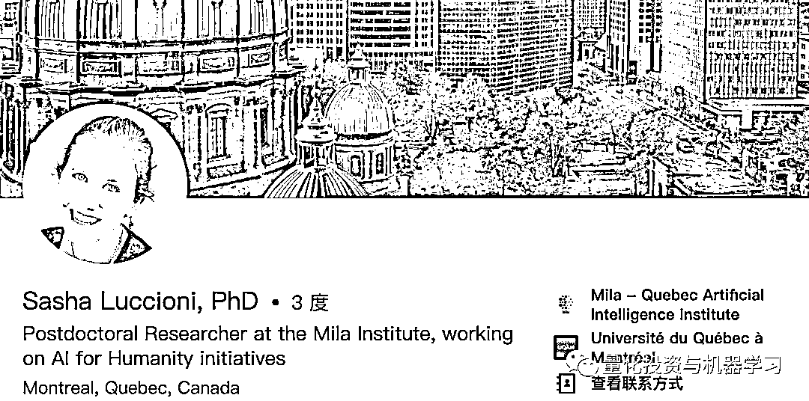
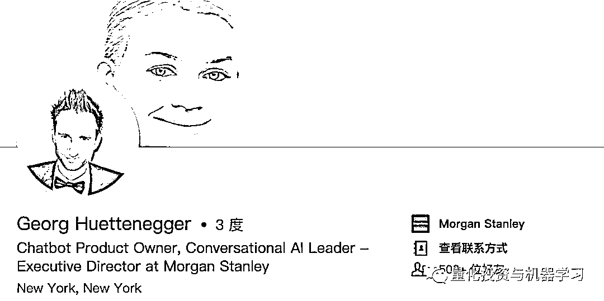
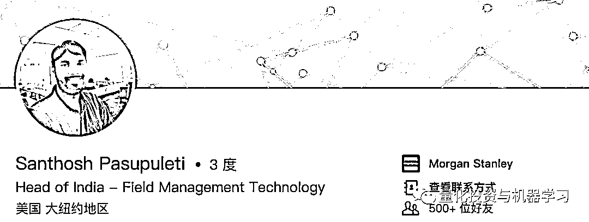
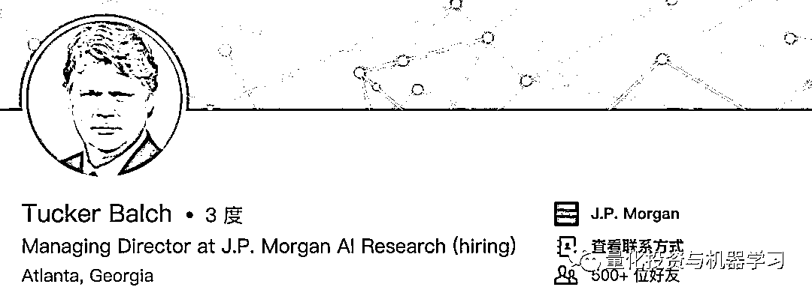
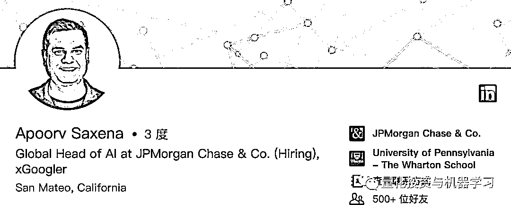
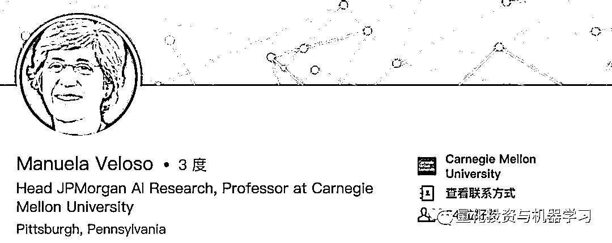

# 投行怎么了？又一顶尖 AI 专家离开摩根士丹利进入学术界

> 原文：[`mp.weixin.qq.com/s?__biz=MzAxNTc0Mjg0Mg==&mid=2653290894&idx=1&sn=9c95f7ab7e3b606ca623c910dbfb90eb&chksm=802dc39bb75a4a8dff5a81c249fd82451e364c4cd07e6f09ccb3dcd8d20b27426abf9a6392d7&scene=27#wechat_redirect`](http://mp.weixin.qq.com/s?__biz=MzAxNTc0Mjg0Mg==&mid=2653290894&idx=1&sn=9c95f7ab7e3b606ca623c910dbfb90eb&chksm=802dc39bb75a4a8dff5a81c249fd82451e364c4cd07e6f09ccb3dcd8d20b27426abf9a6392d7&scene=27#wechat_redirect)

**标星★公众号**，第一时间获取最新研究

编辑：1+1=6

**近期原创文章：**

## ♥ [基于无监督学习的期权定价异常检测（代码+数据）](https://mp.weixin.qq.com/s?__biz=MzAxNTc0Mjg0Mg==&mid=2653290562&idx=1&sn=dee61b832e1aa2c062a96bb27621c29d&chksm=802dc257b75a4b41b5623ade23a7de86333bfd3b4299fb69922558b0cbafe4c930b5ef503d89&token=1298662931&lang=zh_CN&scene=21#wechat_redirect)

## ♥ [5 种机器学习算法在预测股价的应用（代码+数据）](https://mp.weixin.qq.com/s?__biz=MzAxNTc0Mjg0Mg==&mid=2653290588&idx=1&sn=1d0409ad212ea8627e5d5cedf61953ac&chksm=802dc249b75a4b5fa245433320a4cc9da1a2cceb22df6fb1a28e5b94ff038319ae4e7ec6941f&token=1298662931&lang=zh_CN&scene=21#wechat_redirect)

## ♥ [深入研读：利用 Twitter 情绪去预测股市](https://mp.weixin.qq.com/s?__biz=MzAxNTc0Mjg0Mg==&mid=2653290402&idx=1&sn=efda9ea106991f4f7ccabcae9d809e00&chksm=802e3db7b759b4a173dc8f2ab5c298ab3146bfd7dd5aca75929c74ecc999a53b195c16f19c71&token=1330520237&lang=zh_CN&scene=21#wechat_redirect)

## ♥ [Two Sigma 用新闻来预测股价走势，带你吊打 Kaggle](https://mp.weixin.qq.com/s?__biz=MzAxNTc0Mjg0Mg==&mid=2653290456&idx=1&sn=b8d2d8febc599742e43ea48e3c249323&chksm=802e3dcdb759b4db9279c689202101b6b154fb118a1c1be12b52e522e1a1d7944858dbd6637e&token=1330520237&lang=zh_CN&scene=21#wechat_redirect)

## ♥ [利用深度学习最新前沿预测股价走势](https://mp.weixin.qq.com/s?__biz=MzAxNTc0Mjg0Mg==&mid=2653290080&idx=1&sn=06c50cefe78a7b24c64c4fdb9739c7f3&chksm=802e3c75b759b563c01495d16a638a56ac7305fc324ee4917fd76c648f670b7f7276826bdaa8&token=770078636&lang=zh_CN&scene=21#wechat_redirect)

## ♥ [一位数据科学 PhD 眼中的算法交易](https://mp.weixin.qq.com/s?__biz=MzAxNTc0Mjg0Mg==&mid=2653290118&idx=1&sn=a261307470cf2f3e458ab4e7dc309179&chksm=802e3c93b759b585e079d3a797f512dfd0427ac02942339f4f1454bd368ba47be21cb52cf969&token=770078636&lang=zh_CN&scene=21#wechat_redirect)

## ♥ [基于 RNN 和 LSTM 的股市预测方法](https://mp.weixin.qq.com/s?__biz=MzAxNTc0Mjg0Mg==&mid=2653290481&idx=1&sn=f7360ea8554cc4f86fcc71315176b093&chksm=802e3de4b759b4f2235a0aeabb6e76b3e101ff09b9a2aa6fa67e6e824fc4274f68f4ae51af95&token=1865137106&lang=zh_CN&scene=21#wechat_redirect)

## ♥ [人工智能『AI』应用算法交易，7 个必踩的坑！](https://mp.weixin.qq.com/s?__biz=MzAxNTc0Mjg0Mg==&mid=2653289974&idx=1&sn=88f87cb64999d9406d7c618350aac35d&chksm=802e3fe3b759b6f5eca6e777364270cbaa0bf35e9a1535255be9751c3a77642676993a861132&token=770078636&lang=zh_CN&scene=21#wechat_redirect)

## ♥ [神经网络在算法交易上的应用系列（一）](https://mp.weixin.qq.com/s?__biz=MzAxNTc0Mjg0Mg==&mid=2653289962&idx=1&sn=5f5aa65ec00ce176501c85c7c106187d&chksm=802e3fffb759b6e9f2d4518f9d3755a68329c8753745333ef9d70ffd04bd088fd7b076318358&token=770078636&lang=zh_CN&scene=21#wechat_redirect)

## ♥ [预测股市 | 如何避免 p-Hacking，为什么你要看涨？](https://mp.weixin.qq.com/s?__biz=MzAxNTc0Mjg0Mg==&mid=2653289820&idx=1&sn=d3fee74ba1daab837433e4ef6b0ab4d9&chksm=802e3f49b759b65f422d20515942d5813aead73231da7d78e9f235bdb42386cf656079e69b8b&token=770078636&lang=zh_CN&scene=21#wechat_redirect)

## ♥ [如何鉴别那些用深度学习预测股价的花哨模型？](https://mp.weixin.qq.com/s?__biz=MzAxNTc0Mjg0Mg==&mid=2653290132&idx=1&sn=cbf1e2a4526e6e9305a6110c17063f46&chksm=802e3c81b759b597d3dd94b8008e150c90087567904a29c0c4b58d7be220a9ece2008956d5db&token=1266110554&lang=zh_CN&scene=21#wechat_redirect)

## ♥ [优化强化学习 Q-learning 算法进行股市](https://mp.weixin.qq.com/s?__biz=MzAxNTc0Mjg0Mg==&mid=2653290286&idx=1&sn=882d39a18018733b93c8c8eac385b515&chksm=802e3d3bb759b42d1fc849f96bf02ae87edf2eab01b0beecd9340112c7fb06b95cb2246d2429&token=1330520237&lang=zh_CN&scene=21#wechat_redirect)

**正文**

**人工智能（AI）专家很难招到，更难以留住。**

本月初，Morgan Stanley 蒙特利尔机器学习团队的人工智能研究员 Sasha Luccioni 离开了这家公司，在 Mila-Quebec 人工智能研究所担任博士后研究员。

Luccioni 的工作地点在加拿大，在摩根斯坦利做了一年的自然语言处理（NLP）专家。作为银行机器学习团队的一员，她使用机器学习（ML）和 NLP 进行风险、合规、安全、管理进行研究。**她的退出反映了学术界对机器学习领域高级研究员的吸引力。**

Luccioni 毕业于索邦大学语言学专业，在法国巴黎高等师范学院获得认知科学硕士学位，在蒙特利尔魁北克大学获得人工智能博士学位。据她的领英称，在 Mila Institute，她正在从事人工智能项目。她可能希望在教育中利用人工智能，这也是她博士论文的主题。

在加入摩根士丹利之前，Luccioni 是纽昂司（Nuance Communications）的一名自然语言研究科学家。在攻读硕士学位期间，她先后在法国和阿根廷担任研究员，2012 年在 Université TÉLUQ 担任了五年的研究助理。有了这个新角色，Luccioni 的职业生涯似乎又回到了正轨。

一段时间以来，摩根士丹利一直在加强其 AI 和 ML 团队。本月早些时候，聘请了对话人工智能系统专家 Georg Huettenegger 领导其在纽约的聊天机器人团队。

一年前，他们还聘请了人工智能和云工程专家 Santhosh Pasupuleti。

摩根士丹利并不是唯一一家竞相招聘人工智能领域顶尖人才的公司。上月，JPMorgan 聘用了著名人工智能和机器学习专家 Tucker Balch，帮助其在纽约组建人工智能团队。

2018 年，他们还挖走了谷歌最优秀的人工智能人才 Apoorv Saxena。

以及卡内基梅隆大学（CMU）机器学习部门主管 Manuela Veloso，以领导其人工智能研究项目。

附一篇相关文章：

## [投身 AI 行业，你必须了解的国内外顶尖人工智能实验室](https://mp.weixin.qq.com/s?__biz=MzAxNTc0Mjg0Mg==&mid=2653290870&idx=1&sn=f1c839bab41613ac15f6abc2722ab5b3&chksm=802dc363b75a4a7586113b01078071f4e2b4beb1affce051d545f882002e3192032150e62ce3&token=1074044602&lang=zh_CN&scene=21#wechat_redirect)

大家好好学习啊！

**扫码关注我们**

