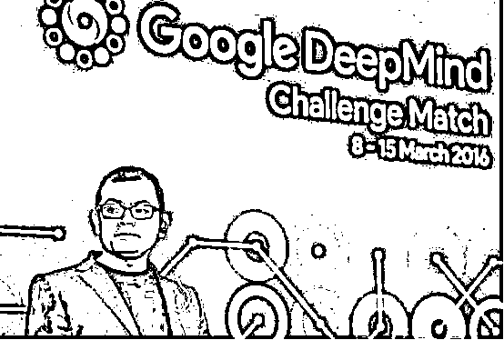

# 投身 AI 行业，你必须了解的国内外顶尖人工智能实验室（附录取建议）

> 原文：[`mp.weixin.qq.com/s?__biz=MzAxNTc0Mjg0Mg==&mid=2653290870&idx=1&sn=f1c839bab41613ac15f6abc2722ab5b3&chksm=802dc363b75a4a7586113b01078071f4e2b4beb1affce051d545f882002e3192032150e62ce3&scene=27#wechat_redirect`](http://mp.weixin.qq.com/s?__biz=MzAxNTc0Mjg0Mg==&mid=2653290870&idx=1&sn=f1c839bab41613ac15f6abc2722ab5b3&chksm=802dc363b75a4a7586113b01078071f4e2b4beb1affce051d545f882002e3192032150e62ce3&scene=27#wechat_redirect)

**标星★公众号**，第一时间获取最新研究

作者：数据派 

来源：THU 数据派

**近期原创文章：**

## ♥ [基于无监督学习的期权定价异常检测（代码+数据）](https://mp.weixin.qq.com/s?__biz=MzAxNTc0Mjg0Mg==&mid=2653290562&idx=1&sn=dee61b832e1aa2c062a96bb27621c29d&chksm=802dc257b75a4b41b5623ade23a7de86333bfd3b4299fb69922558b0cbafe4c930b5ef503d89&token=1298662931&lang=zh_CN&scene=21#wechat_redirect)

## ♥ [5 种机器学习算法在预测股价的应用（代码+数据）](https://mp.weixin.qq.com/s?__biz=MzAxNTc0Mjg0Mg==&mid=2653290588&idx=1&sn=1d0409ad212ea8627e5d5cedf61953ac&chksm=802dc249b75a4b5fa245433320a4cc9da1a2cceb22df6fb1a28e5b94ff038319ae4e7ec6941f&token=1298662931&lang=zh_CN&scene=21#wechat_redirect)

## ♥ [深入研读：利用 Twitter 情绪去预测股市](https://mp.weixin.qq.com/s?__biz=MzAxNTc0Mjg0Mg==&mid=2653290402&idx=1&sn=efda9ea106991f4f7ccabcae9d809e00&chksm=802e3db7b759b4a173dc8f2ab5c298ab3146bfd7dd5aca75929c74ecc999a53b195c16f19c71&token=1330520237&lang=zh_CN&scene=21#wechat_redirect)

## ♥ [Two Sigma 用新闻来预测股价走势，带你吊打 Kaggle](https://mp.weixin.qq.com/s?__biz=MzAxNTc0Mjg0Mg==&mid=2653290456&idx=1&sn=b8d2d8febc599742e43ea48e3c249323&chksm=802e3dcdb759b4db9279c689202101b6b154fb118a1c1be12b52e522e1a1d7944858dbd6637e&token=1330520237&lang=zh_CN&scene=21#wechat_redirect)

## ♥ [利用深度学习最新前沿预测股价走势](https://mp.weixin.qq.com/s?__biz=MzAxNTc0Mjg0Mg==&mid=2653290080&idx=1&sn=06c50cefe78a7b24c64c4fdb9739c7f3&chksm=802e3c75b759b563c01495d16a638a56ac7305fc324ee4917fd76c648f670b7f7276826bdaa8&token=770078636&lang=zh_CN&scene=21#wechat_redirect)

## ♥ [一位数据科学 PhD 眼中的算法交易](https://mp.weixin.qq.com/s?__biz=MzAxNTc0Mjg0Mg==&mid=2653290118&idx=1&sn=a261307470cf2f3e458ab4e7dc309179&chksm=802e3c93b759b585e079d3a797f512dfd0427ac02942339f4f1454bd368ba47be21cb52cf969&token=770078636&lang=zh_CN&scene=21#wechat_redirect)

## ♥ [基于 RNN 和 LSTM 的股市预测方法](https://mp.weixin.qq.com/s?__biz=MzAxNTc0Mjg0Mg==&mid=2653290481&idx=1&sn=f7360ea8554cc4f86fcc71315176b093&chksm=802e3de4b759b4f2235a0aeabb6e76b3e101ff09b9a2aa6fa67e6e824fc4274f68f4ae51af95&token=1865137106&lang=zh_CN&scene=21#wechat_redirect)

## ♥ [人工智能『AI』应用算法交易，7 个必踩的坑！](https://mp.weixin.qq.com/s?__biz=MzAxNTc0Mjg0Mg==&mid=2653289974&idx=1&sn=88f87cb64999d9406d7c618350aac35d&chksm=802e3fe3b759b6f5eca6e777364270cbaa0bf35e9a1535255be9751c3a77642676993a861132&token=770078636&lang=zh_CN&scene=21#wechat_redirect)

## ♥ [神经网络在算法交易上的应用系列（一）](https://mp.weixin.qq.com/s?__biz=MzAxNTc0Mjg0Mg==&mid=2653289962&idx=1&sn=5f5aa65ec00ce176501c85c7c106187d&chksm=802e3fffb759b6e9f2d4518f9d3755a68329c8753745333ef9d70ffd04bd088fd7b076318358&token=770078636&lang=zh_CN&scene=21#wechat_redirect)

## ♥ [预测股市 | 如何避免 p-Hacking，为什么你要看涨？](https://mp.weixin.qq.com/s?__biz=MzAxNTc0Mjg0Mg==&mid=2653289820&idx=1&sn=d3fee74ba1daab837433e4ef6b0ab4d9&chksm=802e3f49b759b65f422d20515942d5813aead73231da7d78e9f235bdb42386cf656079e69b8b&token=770078636&lang=zh_CN&scene=21#wechat_redirect)

## ♥ [如何鉴别那些用深度学习预测股价的花哨模型？](https://mp.weixin.qq.com/s?__biz=MzAxNTc0Mjg0Mg==&mid=2653290132&idx=1&sn=cbf1e2a4526e6e9305a6110c17063f46&chksm=802e3c81b759b597d3dd94b8008e150c90087567904a29c0c4b58d7be220a9ece2008956d5db&token=1266110554&lang=zh_CN&scene=21#wechat_redirect)

## ♥ [优化强化学习 Q-learning 算法进行股市](https://mp.weixin.qq.com/s?__biz=MzAxNTc0Mjg0Mg==&mid=2653290286&idx=1&sn=882d39a18018733b93c8c8eac385b515&chksm=802e3d3bb759b42d1fc849f96bf02ae87edf2eab01b0beecd9340112c7fb06b95cb2246d2429&token=1330520237&lang=zh_CN&scene=21#wechat_redirect)

**前言**

随着科技的快速发展，人工智能领域的关注度在不断上升，越来越多的前沿学术院校和科技企业都已将目光和战略转移到了人工智能领域。此外，伴随着世界各国纷纷出台国家战略政策方针，全球巨头们对人工智能领域研究的投入正在不断增加。同时，某种程度上而言，国内外的顶级人工智能实验室代表着人工智能领域的发展方向和顶尖技术。因此了解国内外人工智能实验室的发展现状，对于想要投身人工智能行业的企业或是个人都有着极大的帮助。

下面，我们将结合知名度、典型性、综合性等多种因素，以国内国外、企业院校等 4 个维度为标准，每个维度选取 3 个具有代表性的企业或院校，为大家总结国内外知名院校及企业的人工智能实验室现状，以及他们的就职以及实习（录取）申请要求，以下排名不分先后，仅供各位参考。

**一、国外学院派**

**1\. 麻省理工学院计算机科学与人工智能实验室(CSAIL)**

CSAIL 的创办最早可以追溯至 1959 年，LISP 编程语言发明人及“人工智能”一词的发明人约翰·麦卡锡同人工神经网络研究专家马文·明斯基一同创办了麻省理工学院人工智能项目。2003 年，MIT 将计算机科学研究和人工智能实验室合并。目前，CSAIL 是麻省理工学院最大的实验室，在人工智能研究方向主要涉及脑和认知科学。

**研究方向：**人工智能，寻求理解和发展使人与机器都能便于理解的推理、感知和行为的人工系统；系统，从软硬件两方面寻求拥有新的原则；模型，指标的电脑系统；理论，寻求对数学在计算中的广泛性、实时性。

**入职及实习（录取）建议：**本科成绩要求比较优秀，科研经历也要求足够丰富，同时需要准备好已发表的论文资料，以及一封推荐信。对于研究经历及学术成果不太丰富的人群而言，一封高质量的行业大牛推荐信是一个很加分的项目。

**2\. 卡耐基梅隆大学机器人学院（Robotics Academy）**

美国卡耐基梅隆大学是世界上第一所专门开设机器人系的大学，机器人学院隶属于卡耐基梅隆大学，前身是成立于 1979 年的机器人研究所。研究注重理论与实践经验结合，目标是成为全球研究机器人最好的地方。

**研究方向：**作为 NASA 航空航天科研任务的主要承制单位之一，卡耐基梅隆大学机器人学院在自动驾驶、月球探测步行机器人、单轮陀螺式滚动探测机器人的研究上成绩非凡。目前，该学院以 ROBOTC 平台为基础，已发布近 20 门教育机器人相关课程，构成了覆盖 K12 到大学阶段的课程体系。

**入职及实习（录取）建议：**本科申请要求：卡内基梅隆大学要求英语非母语的国家的申请者提供托福考试（TOEFL）成绩或者雅思考试（IELTS）成绩；SAT/ACT 考试成绩：大部分专业要求递交 2 门 SAT II 考试成绩。新 SAT 单项成绩要求：阅读与写作 710-770，其中阅读 35-39，数学 750-800；ACT 均分范围 31-34。研究生申请要求：计算机科学、生物科学类专业 TOEFL 要求不低于 100 分，工程类专业要求不低于 84 分；IELTS 要求多在 7.0 以上。所有的申请者均需要通过 Common Application 美国大学申请系统进行申请；提供标准化考试成绩，同时部分学院要求申请者提供 SAT Sub 成绩；教师推荐信；申请文书以及个人称述等材料。

**3\. 斯坦福大学的人工智能实验室(SAIL)**

斯坦福大学的人工智能实验室(SAIL)成立于 1962 年，一直致力于推动机器人教育。并且，该校在网上公开了许多他们有关机器人和深度学习的课程。在斯坦福，人工智能方面的课程非常全面，且非常前沿。

**研究方向：**计算生物学、语音识别和机器学习等。另外，国内目前知名度非常高的吴恩达、李飞飞都是斯坦福大学教授。李飞飞参与建立了著名的 ImageNet 计算机视觉识别数据库及挑战赛，每年都会吸引各大公司的图像识别程序的参加，极大促进了图像识别领域的技术发展。

**入职及实习（录取）建议：**最主要的申请材料为之前的研究经历。申请者需要提供包括之前做过什么成功的研究、发表的论文（是否为第一作者和发表所属期刊、会议的声望）等材料，这些都将有助于其进入实验室实习。同时，一封权威人士写的推荐信也极其重要，如果申请者曾获得一位受人尊敬教授的高度评价，那么就有极大的可能获得实习录取。

****二、国外市场派****

**1\. 谷歌 DeepMind 人工智能实验室**

DeepMind 原是一家英国的人工智能公司，由人工智能研究者兼神经科学家 Demis Hassabis 等人联合创立，2014 年被谷歌收购，举世闻名的 AlphaGo 就是这家公司的成果。据哈撒比斯的描述，DeepMind 的总目标是“攻克智能领域的难题”。这促使公司不断研发多功能的、能够像人类那样广泛和高效思考的“通用型”人工智能。

**研究方向：**将机器学习和系统神经科学的最先进技术结合起来，建立强大的通用学习算法，打造能通过与周围环境互动学习优化自己行为，通过不断试错改善自我、反应灵敏、能有效学习的 AI。

**入职及实习（录取）建议****：**DeepMind 聘请的都是研发科学家、研发工程师以及纯粹的软件工程师。如果申请者希望作为一个研发科学家加入 DeepMind，必须拥有一个 PhD 学位，最好还有几年机器学习研究经历，以及在学术界或工业研究实验室的丰富经验。如果申请者想作为研发工程师加入（依然是研发领域，但是比起理论更具有应用性），依然至少需要有硕士学位，还有大量的机器学习研究相关的经验。

**2\. 微软 Microsoft Research AI 研究院**

微软早在 1991 年便创立微软研究院。2014 年，微软联合创始人保罗·艾伦与他人又共同创立了艾伦人工智能研究院。据了解，Microsoft Research AI 研究院共分为十三个研究小组，共近百位人工智能领域的科学家将集中在此。这些小组包括自适应系统和互动组、空中信息和机器人组、会话系统组、深度学习组、信息和数据科学组、知识技术组、语言和信息技术组、机器学习和优化组、机器教学组、自然语言处理组、感知和互动组、生产力组、强化学习组。

**研究方向：**人机交互、人机对话、机器学习和思想感知、不确定决策在机器人平台上产生各种挑战、合成算法和系统应用、自然语言处理、马尔可夫决策过程和上下文决策过程的泛化等。

**入职及实习（录取）建议：**申请者如果想进入 MSAI 研究院实习，必须准备一份英文简历，建议措辞不需要太过华丽，简单明了最好。重点需要突出自己的编程能力和相关项目经验，如果有相关行业知名人士的推荐信可以附上。可能会面临四轮电话面试，基本都是询问和考察技术面，除了基础问题就是问一些关于项目相关的问题。以即兴提问为主，在回答的过程中，申请者可以尽可能展示自己对于相关技术知识的熟稔程度，这样有助于被最终录取。

**3\. Facebook 人工智能实验室**

2013 年 12 月，Facebook 正式成立人工智能实验室。该实验室在人工智能和机器学习领域的理念是：保持开放。Facebook 最出名的有两大人工智能实验室，一个名 FAIR（Facebook’s Artificial Intelligence Research），由著名人工智能学者、纽约大学教授 Yann LeCun 领导，另一个名为 AML（Applied Machine Learning），由机器学习领域专家 Joaquin Candela 领导。

**研究方向：**主要致力于基础科学和长期项目的研究，以及找到将人工智能和机器学习领域的研究成果应用到 Facebook 现有产品里的方法。

**入职及实习（录取）建议：**Facebook 已经开始与部分中国大学合作，比如清华和上海交大，采取同美国、法国等地相同的合作模式。如果申请者想获得进入 Facebook 人工智能实验室的机会，可以首先参与自己大学人工智能领域的相关项目。Facebook 会关注大学的科研项目，寻找他们感兴趣的领域，并且找到做那些研究的学生，给他们提供实习的机会。同样，申请者也可以主动递交实习申请，最重要的就是之前的研究经历，论文发表情况，以及一封高质量的推荐信。

**三、国内学院派**

**1\. 清华大学智能技术与系统国家重点实验室**

清华大学智能技术与系统国家重点实验室于 1987 年 7 月开始筹建，1990 年 2 月通过国家验收，并正式对外开放运行。实验室由中心实验室（智能技术与系统）和三个分室（智能信号处理、智能图形图像处理、人机交互与媒体集成）组成，分别设立在清华大学计算机科学与技术系、自动化系和电子工程系。

**研究方向：**认知过程与智能信息处理的交叉与结合研究；基于内容的海量信息处理理论与方法，特别是针对信息安全、信息检索、信息挖掘等研究具体的算法及应用；面向动态过程的机器学习理论与方法；智能信息处理与控制理论在移动机器人与智能车、类人机器人、无人飞机、空间机器人等系统中的应用理论与技术；智能图文信息处理，包括各种文字识别、文档识别和理解等方面。

**入职及实习（录取）建议：**首先需要申请者是计算机、通讯、电子及相关专业在读研究生或者本科高年级学生；其次，需要在本科阶段学习过算法与数据结构、软件理论基础等相关课程，并取得优良的成绩；此外还需要申请者了解图像识别、深度学习、人工智能、机器学习等相关技术，善于快速学习新知识，有实际项目经验者会被优先考虑。在计算机语言上，需要精通 Java/Python 等编程语言，有较强的快速编程能力，熟悉 Windows/Linux 操作系统，并且对算法研发有强烈的兴趣。

**2\. 北京大学视觉与听觉信息处理国家重点实验室**

北京大学视觉与听觉信息处理国家重点实验室 1988 年正式通过国家验收，是北京大学建立的第一个国家重点实验室。实验室以实现高度智能化的机器感知系统为目标，紧密结合国民经济和社会发展的需要，在机器视觉与听觉信息处理领域开展具有多学科交叉性质的基础与应用基础研究，同时注重以原创性的研究成果推动技术创新，实现科技成果转化。

**研究方向：**在机器视觉领域、机器听觉领域、智能信息系统领域开展生物特征识别与信息安全、图像处理、智能人机交互、语音语言信息处理系统、人工神经网络及机器学习等研究以及视觉与听觉的神经计算模型和生理心理基础研究等。

**入职及实习（录取）建议：**首先需要申请者是计算机、数学等相关专业在读学生；其次需要拥有扎实的数据结构和算法基础，熟悉 C/Python 等常用编程语言及脚本语言；拥有有一定的计算机视觉理论学习基础，熟悉常见的深度学习框架；如果有相关的实际项目经验，将是一个极大的加分项目。

**3\. 浙江大学人工智能研究所**

浙江大学在人工智能方面有着肥沃的土壤，其计算机学院下设的人工智能研究所是中国设立最早的人工智能研究机构之一。早在上世纪 80 年代，浙江大学就建立了人工智能研究所。从 1981 年至今，浙大人工智能研究所见证和参与了人工智能的一系列变化。到现在，人工智能进入大数据阶段，浙大在计算机视觉领域已经建立了相当大的优势。

**研究方向：**跨媒体智能、混合增强智能、大数据、机器学习、人工智能理论、计算机图形学、多媒体、数据挖掘等领域。

**入职及实习（录取）建议：**浙江大学人工智能研究所目前暂不对外招生，建议申请者最好考入浙江大学计算机、电子及相关专业在读。其次需要拥有扎实的数据结构和算法基础，熟悉一些常用编程语言及脚本语言。如果有相关的实际项目经验，将有极大的可能被录取。

**四、国内市场派**

**1\. 百度研究院**

百度研究院隶属于百度 AI 技术平台体系（AIG），下设五大实验室：分别是深度学习实验室（IDL）、大数据实验室（BDL）、硅谷人工智能实验室（SVAIL）、商业智能实验室（BIL）、机器人与自动驾驶实验室（RAL）。目前，百度研究院拥有了包括院长王海峰，以及徐伟、李平、杨睿刚，和新加盟的 Ward Church、浣军、熊辉等七位世界级科学家的阵容。

**研究方向：**商业智能实验室主要关注用于新型数据密集型应用的高效数据分析技术，机器人与自动驾驶实验室则重点关注机器人技术，以及百度在自动驾驶领域技术的推进。

**入职及实习（录取）建议：**需要申请者熟悉基本的数据结构与算法，熟练运用 python 编程以及 tensorflow 等深度学习工具。关注并了解机器学习算法，自然语言理解，知识图谱，图像与视觉等领域的现状与最新进展，并在其中一个领域有实践经验，并保持对前沿的深刻理解。同时具备良好的数学基础，熟悉线性代数、概率与统计、数值优化等，熟悉常见机器学习算法。有人工智能各领域的相关研究经验，有高水平论文发表者，会被优先考虑。

**2\. 阿里巴巴人工智能实验室**

阿里巴巴人工智能实验室于 2016 年成立，于 2017 年 7 月 5 日首次公开亮相，该机构负责阿里巴巴集团旗下消费级 AI 产品的研发。当前已孵化出天猫精灵个人助手等产品。实验室的使命是让机器拥有智能，让人性充满光辉，将基于阿里巴巴强大消费者沟通渠道和完善的服务生态，立志成为下一代人机交互入口。

**研究方向：**语音交互、自然语言理解、数据挖掘和知识图谱、用户画像和个性化推荐。工业设计，致力于人工智能硬件产品、机器人的创新工业设计，通过人机交互、产品形态、材料工艺等领域的研究，探索未来智能硬件、机器人的新方式。智能制造，基于人工智能技术的新一代硬件研发与制造，如硬件芯片和模组研究，并提供边缘计算和云端结合的解决方案。机器人技术，从事智能机器人相关的技术研究，包括：实时定位、环境建模、传感器融合、目标检测、场景分割、路径规划、运动控制、故障检测、多机器人系统等方向。

**入职及实习（录取）建议：**需要申请者是计算机、数学等相关专业在读博士硕士。其次是需要熟悉深度学习、自然语言理解等相关领域技术和应用，有大量实践经验者优先；有科研能力并有成果发表在国际顶级会议、期刊者优先；极佳的工程实现能力，熟练掌握 C/C 、Java、Python 等至少一门语言；良好的数据分析能力和逻辑分析能力。

**3\. 腾讯 AI Lab**

腾讯 AI Lab 作为企业级 AI 实验室，依托腾讯丰富应用场景、海量大数据、强大计算能力和一流科技人才，专注于 AI 基础研究和应用探索的结合。目前已打造出围棋 AI“绝艺”，技术也被微信、QQ、天天快报和 QQ 音乐等上百个腾讯产品使用。团队有 70 余位来自世界知名院校的科学家，及 300 多位经验丰富的应用工程师组成，由机器学习和大数据领域专家张潼博士，及语音识别及深度学习专家俞栋博士，并与世界顶级院校与机构合作，共同打造“产学研用一体”的 AI 生态。

**研究方向：**基础研究方向包括计算机视觉、语音识别、自然语言处理和机器学习，应用探索需要结合腾讯场景与业务优势，包括内容、游戏、社交和平台工具型等 AI 四类。

**入职及实习（录取）建议：**需要申请者是计算机、人工智能等相关专业的博士；熟悉自然语言处理、对话系统和机器学习等领域，有相关的的项目或研究经验优先；有良好的文献检索及前沿问题探索能力及创造力；熟悉 python 或 c/c++编程及深度学习框架。

**国内外市场派和国内外学院派最主要的区别在于：**学院派注重以理论研究为主要方向，对于人工智能的实用性相关关注度偏弱，而市场派主要是以人工智能前沿技术市场转化研究为主要方向，对于人工智能相关理论进一步研究则相对没有学院派深厚；另一方面，市场派的薪资待遇相对较好，但准入门槛相对较高，绝大部分都需要有一定的项目经验，或者拥有相关的科研成果发表。而学院派则相对门槛较低，但薪资待遇没有市场派高，但是可以跟随导师获取项目研究经验，增强相关理论知识基础，接触人工智能尖端学术研究成果。

总体而言，国内外企业及学院人工智能实验室各有优劣，如果你想要尽快将人工智能相关理论市场化、成果化，同时获取丰厚报酬，建议你选择市场派，而如果觉得自己需要更多的理论知识学习，希望获取尖端的学术研究，以便自身的进步，则可以选择去学院派。总之，大家根据自身需求，各取所需。

编辑：文婧

校对：林亦霖

**扫码关注我们**

