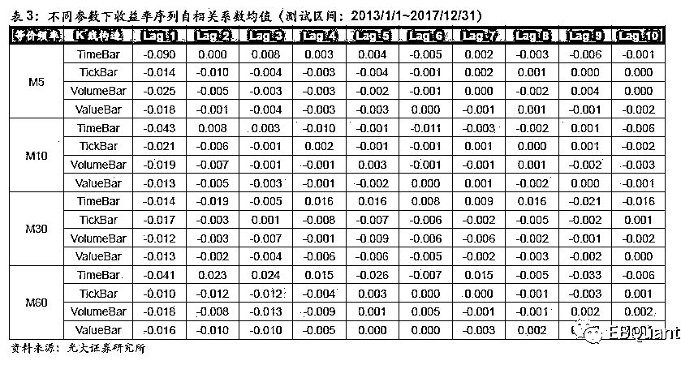

# 机器学习系列：深度探秘 K 线结构新维度

> 原文：[`mp.weixin.qq.com/s?__biz=MzAxNTc0Mjg0Mg==&mid=2653290844&idx=1&sn=b2f428368aa528df791c01ee21b7c599&chksm=802dc349b75a4a5f510494516a0ef6f510cdf20de2ccf12509bb7427c386d377996dfe34cd55&scene=27#wechat_redirect`](http://mp.weixin.qq.com/s?__biz=MzAxNTc0Mjg0Mg==&mid=2653290844&idx=1&sn=b2f428368aa528df791c01ee21b7c599&chksm=802dc349b75a4a5f510494516a0ef6f510cdf20de2ccf12509bb7427c386d377996dfe34cd55&scene=27#wechat_redirect)

**标星★公众号**，第一时间获取最新研究

来源：光大证券金工团队独家授权

作者：胡骥聪

**近期原创文章：**

## ♥ [基于无监督学习的期权定价异常检测（代码+数据）](https://mp.weixin.qq.com/s?__biz=MzAxNTc0Mjg0Mg==&mid=2653290562&idx=1&sn=dee61b832e1aa2c062a96bb27621c29d&chksm=802dc257b75a4b41b5623ade23a7de86333bfd3b4299fb69922558b0cbafe4c930b5ef503d89&token=1298662931&lang=zh_CN&scene=21#wechat_redirect)

## ♥ [5 种机器学习算法在预测股价的应用（代码+数据）](https://mp.weixin.qq.com/s?__biz=MzAxNTc0Mjg0Mg==&mid=2653290588&idx=1&sn=1d0409ad212ea8627e5d5cedf61953ac&chksm=802dc249b75a4b5fa245433320a4cc9da1a2cceb22df6fb1a28e5b94ff038319ae4e7ec6941f&token=1298662931&lang=zh_CN&scene=21#wechat_redirect)

## ♥ [深入研读：利用 Twitter 情绪去预测股市](https://mp.weixin.qq.com/s?__biz=MzAxNTc0Mjg0Mg==&mid=2653290402&idx=1&sn=efda9ea106991f4f7ccabcae9d809e00&chksm=802e3db7b759b4a173dc8f2ab5c298ab3146bfd7dd5aca75929c74ecc999a53b195c16f19c71&token=1330520237&lang=zh_CN&scene=21#wechat_redirect)

## ♥ [Two Sigma 用新闻来预测股价走势，带你吊打 Kaggle](https://mp.weixin.qq.com/s?__biz=MzAxNTc0Mjg0Mg==&mid=2653290456&idx=1&sn=b8d2d8febc599742e43ea48e3c249323&chksm=802e3dcdb759b4db9279c689202101b6b154fb118a1c1be12b52e522e1a1d7944858dbd6637e&token=1330520237&lang=zh_CN&scene=21#wechat_redirect)

## ♥ [利用深度学习最新前沿预测股价走势](https://mp.weixin.qq.com/s?__biz=MzAxNTc0Mjg0Mg==&mid=2653290080&idx=1&sn=06c50cefe78a7b24c64c4fdb9739c7f3&chksm=802e3c75b759b563c01495d16a638a56ac7305fc324ee4917fd76c648f670b7f7276826bdaa8&token=770078636&lang=zh_CN&scene=21#wechat_redirect)

## ♥ [一位数据科学 PhD 眼中的算法交易](https://mp.weixin.qq.com/s?__biz=MzAxNTc0Mjg0Mg==&mid=2653290118&idx=1&sn=a261307470cf2f3e458ab4e7dc309179&chksm=802e3c93b759b585e079d3a797f512dfd0427ac02942339f4f1454bd368ba47be21cb52cf969&token=770078636&lang=zh_CN&scene=21#wechat_redirect)

## ♥ [基于 RNN 和 LSTM 的股市预测方法](https://mp.weixin.qq.com/s?__biz=MzAxNTc0Mjg0Mg==&mid=2653290481&idx=1&sn=f7360ea8554cc4f86fcc71315176b093&chksm=802e3de4b759b4f2235a0aeabb6e76b3e101ff09b9a2aa6fa67e6e824fc4274f68f4ae51af95&token=1865137106&lang=zh_CN&scene=21#wechat_redirect)

## ♥ [人工智能『AI』应用算法交易，7 个必踩的坑！](https://mp.weixin.qq.com/s?__biz=MzAxNTc0Mjg0Mg==&mid=2653289974&idx=1&sn=88f87cb64999d9406d7c618350aac35d&chksm=802e3fe3b759b6f5eca6e777364270cbaa0bf35e9a1535255be9751c3a77642676993a861132&token=770078636&lang=zh_CN&scene=21#wechat_redirect)

## ♥ [神经网络在算法交易上的应用系列（一）](https://mp.weixin.qq.com/s?__biz=MzAxNTc0Mjg0Mg==&mid=2653289962&idx=1&sn=5f5aa65ec00ce176501c85c7c106187d&chksm=802e3fffb759b6e9f2d4518f9d3755a68329c8753745333ef9d70ffd04bd088fd7b076318358&token=770078636&lang=zh_CN&scene=21#wechat_redirect)

## ♥ [预测股市 | 如何避免 p-Hacking，为什么你要看涨？](https://mp.weixin.qq.com/s?__biz=MzAxNTc0Mjg0Mg==&mid=2653289820&idx=1&sn=d3fee74ba1daab837433e4ef6b0ab4d9&chksm=802e3f49b759b65f422d20515942d5813aead73231da7d78e9f235bdb42386cf656079e69b8b&token=770078636&lang=zh_CN&scene=21#wechat_redirect)

## ♥ [如何鉴别那些用深度学习预测股价的花哨模型？](https://mp.weixin.qq.com/s?__biz=MzAxNTc0Mjg0Mg==&mid=2653290132&idx=1&sn=cbf1e2a4526e6e9305a6110c17063f46&chksm=802e3c81b759b597d3dd94b8008e150c90087567904a29c0c4b58d7be220a9ece2008956d5db&token=1266110554&lang=zh_CN&scene=21#wechat_redirect)

## ♥ [优化强化学习 Q-learning 算法进行股市交易](https://mp.weixin.qq.com/s?__biz=MzAxNTc0Mjg0Mg==&mid=2653290286&idx=1&sn=882d39a18018733b93c8c8eac385b515&chksm=802e3d3bb759b42d1fc849f96bf02ae87edf2eab01b0beecd9340112c7fb06b95cb2246d2429&token=1330520237&lang=zh_CN&scene=21#wechat_redirect)

## ♥ [搭建入门级高频交易系统（架构细节分享）](https://mp.weixin.qq.com/s?__biz=MzAxNTc0Mjg0Mg==&mid=2653290615&idx=1&sn=ba1f774031b6dae519f614e7f5cf3141&chksm=802dc262b75a4b74dc3198cc507dbe1e97afc262f4ca4f9e9e122391fb9ebc916b14137c03d1&token=863052737&lang=zh_CN&scene=21#wechat_redirect)

**前言**

在金融投资领域下运用机器学习并非易事，许多在看似直观的应用方式下直接套用机器学习算法的做法往往并不能达到预期的效果。在光大金工机器学习系列第一篇报告中我们提出“机器学习能否在金融投资取得成功，更取决于算法之外的细节处理”的理念。本篇报告延续上述思路，探索在运用机器学习算法之前，如何更好地处理交易数据的 K 线结构。

**数据结构特征对机器学习效果有较大影响**

数据很重要。这对于研究量化的人几乎是不言自明的。无论是构建模型还是开发因子，研究的进行与验证都需要大量的数据支撑。**而机器学习作为一种量化的辅助研究工具（至少目前仅是辅助工具）对于数据的依赖与要求比其它量化工具更高**。人脑与机器学习在对数据的处理上各有优劣，人脑的优势在于对数据本身有解释性，例如我们知道应收账款是什么含义、营业收入是什么含义，并能一定程度上理解不同数据间是否有一定的关联逻辑，如果这种关联偏向于线性逻辑，我们往往能通过传统的量化方法逼近它，然而如果这种关联逻辑更偏向于非线性时，用传统量化方法研究的效率就会比较低；而机器学习的优势在于能够更高效地探索不同数据间可能以怎么样的方式关联起来，但它并没有对数据本身的认知。因此它往往需要质量更高数量更大的数据来弥补这一点。

**机器学习是通过在训练样本“学习”到数据之间的关联，并外推到新的样本中去。它的外推（或者也称泛化）效果除了受数据本身信噪比大小制约以外，也直接受到新数据与样本数据的特征是否相近的影响。如果数据里不同样本的结构或分布特征有较大差异的话，往往会使得机器学习算法无法有效运作，甚至可能将研究者引向错误的结论。**

**传统 K 线结构的统计特征不适合机器学习**

交易数据是金融投资领域数据量最大的数据源之一，蕴藏大量的预测信息。为了利用这些非结构化的数据，我们往往会先把这些数据处理成更易处理的 K 线结构，形成我们常用的量价数据。传统的时间 K 线使用的是每根 K 线时间跨度一致的结构化发方式，这种构造方式在传统人工环境、低频环境下有比较直观的好处：人们在处理任何事情时都习惯于以时间为刻度。当我们需要利用机器学习工具在高频数据中探究规律、进行研究时，时间等分切片却未必是一个好的结构化方式。它们往往会面临样本点信息不均，序列自相关性，样本非同方差，收益率非正态分布等问题，这些在低频环境下可能提供一定信息的特质在运用机器学习算法时反而更大概率会影响算法的有效性。

目前基于**高频数据可以构造很多不同的采样切片方式**，目前比较主流的方式包括：**tick 等分 K 线，成交量等分 K 线，成交额等分 K 线，信息量等分 K 线**。其中 tick 等分 K 线，成交量等分 K 线，成交额等分 K 线的构造方式顾名思义都非常直观。而信息量等分 K 线的构造方式则依赖于对信息的定义。

**不同 K 线结构的正态性**

**股票收益率是我们最常使用也最关心的数据之一**，在很多研究与模型中（不限于计量经济学、机器学习等）研究者在假定收益率服从正态的基础上作出了许多推导与测试。但简单的测试就能发现传统意义上的股票收益率（时间等分取样下）并不符合正态分布，其密度函数有非常明显的尖峰厚尾的特性。

我们做了较为细致的测试，选取当前上证 50 成分股中历史较长的四十几只股票在 2017 年的 30 分钟等价频率数据作为样本，分别从**偏度、峰度、Jarque-Bera 正态测试、Kolmogorov-Smirnov 正态测试**这 4 个指标来探讨不同 K 线结构的正态性。

首先通过 K-S 检验可以看出无论哪种 K 线构造，其股票收益率与正态分布的相差甚远，其累计分布函数与正态累计分布函数的最大差值都接近 0.5。但比较偏度、峰度与 J-B 检验的值，可以看出大部分的股票在非时间切片 K 线上的收益序列要比时间 K 线上的收益序列更接近正态分布的统计特征。

除了上述股票 2017 年等价频率 30 分钟的数据，我们也以 2013-1-1 到 2017-12-31 为测试区间，分别统计了股票在 5 分钟、10 分钟、30 分钟、1 小时这 4 个等价频率下的正态性数据。结论上：在所有这 4 种等价频率下，**接近正态分布的构造皆为 成交额等分 > 成交量等分 > Tick 等分 > 时间等分**；**而对于所有 K 线构造，等价频率越低，K 线收益率数据就越接近正态分布**。对具体数据感兴趣的读者可在深度报告附录中查看详细数据。

**不同 K 线结构的自相关性**

除了正态分布假设，还有一些要求偏低的假设也是交易数据很难符合的。其中一个就是**非自相关假设**。这一条假设大多是隐含在样本点独立这一假设下的。当我们平常说到股票动量或者反转时，实际上已经在利用股票收益的自相关性了。但在使用机器学习工具时，拥有强自相关性这个平常对我们而言有利的状态反而可能制约算法的功能。

探索收益序列的自相关性最直观的方式就是检查其自相关函数各项系数。下图展示了平安银行（000001.SZ）在不同 K 线构造下的收益序列自相关函数（为方便比较，去除了函数在自变量为 0 处的值 acf(0)=1）。相比与时间 K 线，非时间 K 线，尤其是成交量 K 线与成交额 K 线，更接近非自相关假设。

我们在测试池里所有股票上验证上述观点，并测试了在不同等价频率下的统计表现。不同 K 线构造下的收益率自相关性的确有显著的差异，时间 K 线收益率序列有更为显著的自相关性。 

**不同 K 线结构的异方差性**

**无论是样本同分布假设，还是平稳性假设，都要求样本点符合同方差的要求**。这点在许多自然科学的实验样本上相对容易符合，但在金融时间序列上却几乎完全不可能实现。相比于非时间 K 线，时间 K 线的异方差现象更为严重。我们可以通过周内波动序列来体现股票收益在不同时期的波动变化。每一周的周内波动是以当周内所有 K 线的收益率为样本计算方差得到的。我们展示了平安银行（000001.SZ）在 2017 年内共 50 周左右的周内波动序列。比较不同 K 线构造下的周内波动序列曲线，可以看出在接近年末时，时间 K 线的收益波动远远高于年初的水平，最高时超过年初平均周内波动 10 倍有余；而其它 K 线构造下的周内波动序列虽在年末也有明显上升，但整体更为平稳。 **为了能较为量化的体现不同 K 线构造下异方差性的严重程度，我们计算不同 K 线的方差时间序列自己的方差，若该方差越大，则说明异方差现象越严重。**

我们继续在测试池里的股票测试其在 2017 年的不同 K 线收益率周内波动方差。除了个别股票以外，其它所有股票在时间 K 线上的异方差现象都最为严重。**大部分股票时间 K 线收益率的周内波动方差在其余 K 线构造的 3 倍以上**。同样，在不同等价频率上测试都能等到相似的结论，时间 K 线上的股票收益率序列异方差现象格外严重。各个股票在不同等价频率 K 线上的周内波动序列方差详细数据可在深度报告文后附录查看。

**在不同 K 线结构数据上预测波动率变化**

在从统计特征角度比较不同 K 线结构对于机器学习运用上的优劣后，我们通过一个实例来更直观地感受不同 K 线结构可能带来的影响，仅运用不同 K 线构造下的量价数据基于一些机器学习算法预测未来股票的波动率变化的方向。**想要预测股票波动率在未来的变化方向，我们需要尽可能地给算法准备有预测能力的解释变量。**为了更直观地比较不同 K 线结构的数据在算法效果上的差异，我们这次只使用与 K 线相关的数据。最直接的包括以 K 线收盘价计算的收益率数据，以 K 线收益率序列标准差计算的历史波动率等。除了以上较为常见的 K 线数据以外，我们还尝试运用一些需要高频细节构造的 K 线数据，比如知情交易概率。

在市场交易结构，尤其是市场微观结构这个领域，知情交易概率是业界研究者非常关心的一个议题。在个议题目前最重要的研究成果之一是由 Easley,Kiefer,O’Hara 和 Paperman（EKOP）在 1996 年论文中提出的 PIN 指标（Probability ofInformed Trading）。简单来说，如果我们假定一个独立信息出现的概率是 α；出现的消息是好消息与坏消息的概率分别为（1-δ）与 δ；知情交易者进入市场的概率为 μ，并且他们会根据知道的消息是好是坏而作出买入或卖出的交易行为；而非知情交易者作出买入交易行为或作出卖出交易行为的概率皆为 ε。那么知情交易概率 PIN 有以下计算方式：

传统上 α、δ、μ、ε 这 4 个参数是由最大似然法来估计得出。由于这种方式在稳定性及敏感性上不够理想，同时在数值计算的过程中也容易碰到各种问题，因此其它估计 PIN 值的方式也在不断被研究与改进。在这些研究里，Easley,Engle,O’Hara 和 Wu 在 2008 年的论文中论证了：

其中，V(Bt)指 t 时段买入的成交量，V(St)指 t 时段卖出的成交量。在 Easley,Prado,O’Hara 于 2011 年发表的论文里将以上结论继续延伸，提出了 VPIN 指标（Volume-SynchronizedProbability of Informed Trading）。  借鉴前述研究成果，我们尝试利用成交量数据计算知情交易概率数据，对于每一根 K 线，其 PIN 值我们 |V_Buy-V_Sell|/(V_Buy+V_Sell) 计算。从比较直观的逻辑出发，如果某个时段内知情交易概率增大，则表明市场内有新的信息进入，市场在接下来一段时期会开始消化这个新信息，从而未来波动率大概率会上升；反之若知情交易概率下降，则市场在未来一段时期波动率大概率会下降。**因此我们分别计算不同 K 线结构下的知情交易概率，并把其一定长度的序列均值与标准差也作为解释变量输入给机器学习算法。** 

**成交量 K 线预测波动率变化的效果更好**

我们采用几个常见算法分别测试不同 K 线结构下对未来波动率改变方向的预测，具体设置如下:

*   测试算法：逻辑回归、支持向量机、随机森林

*   测试标的：测试池内所有股票逐一测试

*   训练集区间：2013-1-1 ~ 2016-12-31

*   测试集区间：2017-1-1 ~ 2017-12-31

通过观察测试集的准确率，可以发现 3 种算法都有一定的预测效果，不同股票稍有差异，整体准确率平均在 65%左右。比较不同 K 线结构上的差异，时间 K 线结构的预测准确率在所有测试的机器学习算法上都是最低的。在逻辑回归与支持向量机模型上，Tick 等分 K 线、成交量 K 线与成交额 K 线的预测准确性相差不大；而随机森林算法波动预测模型则明显在成交量 K 线上有更好的预测结果，但相比与逻辑回归与支持向量机，其 Tick 等分 K 线、成交额 K 线与时间 K 线的预测效果差异较小。**整体来看，波动率改变方向预测在成交量 K 线上的预测效果最佳。**

波动率方向预测模型里有两个参数，一个是 K 线等价频率，一个是波动率（及输入变量）K 线窗宽。为了确定其它参数下我们之前观察到的不同 K 线上效果差异是否还存在，以及差异大小与参数之间是否有联系，我们也测试了其它参数对下的波动预测模型效果。

  **不同算法模型在参数测试时表现出许多共性特征：**

1.    对于所有等价频率与 K 线结构上，模型的预测准确率基本上都随着窗宽边长而降低。这个可以理解为随着窗宽拉长，所需要预测的未来信息变得更多，其难度也相应增大。

 2.    时间 K 线与非时间 K 线结构在模型上的表现差异随着等价频率的降低而缩小。在 60 分钟频率上不同 K 线结构上的预测效果差异很小。也就是说对于一些机器学习算法，K 线结构不同的影响的确更多是在偏高频的领域更为显著，而在偏低频的结构上差异不会很大。

 3.    最后，在等价频率较低的 30 分钟及 60 分钟频率上，非时间 K 线模型准确率在窗宽参数上的衰减速率要高于时间 K 线模型。

**不同算法模型的差异则在于：**

对数据分布要求更高的逻辑回归与支持向量机算法，高频场景下模型运用在时间 K 线与非时间 K 线上，效果有明显差异；而在随机森林算法下这种差异则并不突出。

篇幅原因这里我们在下方展示逻辑回归算法的参数检验，具体的测试数据及其它算法的表现结构可详见深度报告文后附录。 

**波动率方向预测的应用与启示**

上述验证模型预测的标的是波动率，最容易想到的应用场景就在波动率交易策略上。我们在此并不会去构造一个完整的波动率交易策略，我们想要向大家展示与论证的一是该预测可以作为波动率交易的基础信号之一，二是不同 K 线结构的模型在这种场景下会产生怎样的差异。

要论证上述观点，我们利用股指的历史波动率构造波动率指数，并假设该波动率指数可以被直接交易。之后再根据上一章机器学习算法给出的波动率预测改变方向在每周末相应做多或做空下一周的波动率指数。

预测下一周的波动率，我们选择分别利用等价频率 1 小时，窗口宽度 20 的时间 K 线与成交量 K 线。用上证 50 指数 2009 到 2014 共 6 年数据训练 SVM 模型，并用之于上证 50 指数 2015 到 2017 年的预测上。 

从净值图上可以看出波动率方向预测信息一定程度上可以充当波动率交易的信号，而在成交量 K 线上运用模型的效果相比时间 K 线更胜一筹。不同 K 线结构训练出来的模型信号主要在 2015 年有明显分化。一个重要的原因是由于 2015 年市场情绪较为亢奋、整体交易更为活跃，此时时间 K 线的信息结构与之前训练期内的时间 K 线信息表征有较大差异，因而机器学习在时间 K 线训练得到的模型在此时失效的概率大增，而成交量 K 线结构在通过增加交易活跃期间的 K 线数量，一定程度上使得不同市场环境下的 K 线信息特征都更为相似。因此，基于成交量 K 线训练的模型在 2015 年依然有较稳定的预测效果。而当市场整体环境恢复正常水平时，两种不同 K 线训练出的模型表现差异不大。

上述测试结论均假设处于较为理想的市场环境中，实际在构建策略的过程中，除了信号本身，还需要处理各种各样的约束条件。随着金融市场不断开放，越来越多金融工具与金融产品被开发，与波动率相关的研究以及合理的机器学习运用也会有更大的舞台。

**--End--**

**扫码关注我们**

