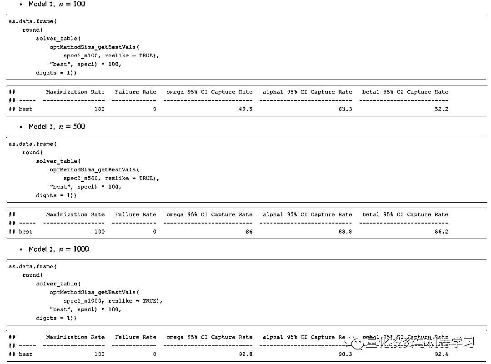

# 在 R 中估计 GARCH 参数存在问题（基于 rugarch 包）

> 原文：[`mp.weixin.qq.com/s?__biz=MzAxNTc0Mjg0Mg==&mid=2653290819&idx=1&sn=400895e7a596364e65b02b9f9596a8f2&chksm=802dc356b75a4a40638bd0e9ae187f6c33fbdba747929d49c85aeb126ea0af8e34bcd1861292&scene=27#wechat_redirect`](http://mp.weixin.qq.com/s?__biz=MzAxNTc0Mjg0Mg==&mid=2653290819&idx=1&sn=400895e7a596364e65b02b9f9596a8f2&chksm=802dc356b75a4a40638bd0e9ae187f6c33fbdba747929d49c85aeb126ea0af8e34bcd1861292&scene=27#wechat_redirect)

**标星★公众号**，第一时间获取最新研究

本期作者：徐瑞龙 | 公众号特约作者

**近期原创文章：**

## ♥ [基于无监督学习的期权定价异常检测（代码+数据）](https://mp.weixin.qq.com/s?__biz=MzAxNTc0Mjg0Mg==&mid=2653290562&idx=1&sn=dee61b832e1aa2c062a96bb27621c29d&chksm=802dc257b75a4b41b5623ade23a7de86333bfd3b4299fb69922558b0cbafe4c930b5ef503d89&token=1298662931&lang=zh_CN&scene=21#wechat_redirect)

## ♥ [5 种机器学习算法在预测股价的应用（代码+数据）](https://mp.weixin.qq.com/s?__biz=MzAxNTc0Mjg0Mg==&mid=2653290588&idx=1&sn=1d0409ad212ea8627e5d5cedf61953ac&chksm=802dc249b75a4b5fa245433320a4cc9da1a2cceb22df6fb1a28e5b94ff038319ae4e7ec6941f&token=1298662931&lang=zh_CN&scene=21#wechat_redirect)

## ♥ [深入研读：利用 Twitter 情绪去预测股市](https://mp.weixin.qq.com/s?__biz=MzAxNTc0Mjg0Mg==&mid=2653290402&idx=1&sn=efda9ea106991f4f7ccabcae9d809e00&chksm=802e3db7b759b4a173dc8f2ab5c298ab3146bfd7dd5aca75929c74ecc999a53b195c16f19c71&token=1330520237&lang=zh_CN&scene=21#wechat_redirect)

## ♥ [Two Sigma 用新闻来预测股价走势，带你吊打 Kaggle](https://mp.weixin.qq.com/s?__biz=MzAxNTc0Mjg0Mg==&mid=2653290456&idx=1&sn=b8d2d8febc599742e43ea48e3c249323&chksm=802e3dcdb759b4db9279c689202101b6b154fb118a1c1be12b52e522e1a1d7944858dbd6637e&token=1330520237&lang=zh_CN&scene=21#wechat_redirect)

## ♥ [利用深度学习最新前沿预测股价走势](https://mp.weixin.qq.com/s?__biz=MzAxNTc0Mjg0Mg==&mid=2653290080&idx=1&sn=06c50cefe78a7b24c64c4fdb9739c7f3&chksm=802e3c75b759b563c01495d16a638a56ac7305fc324ee4917fd76c648f670b7f7276826bdaa8&token=770078636&lang=zh_CN&scene=21#wechat_redirect)

## ♥ [一位数据科学 PhD 眼中的算法交易](https://mp.weixin.qq.com/s?__biz=MzAxNTc0Mjg0Mg==&mid=2653290118&idx=1&sn=a261307470cf2f3e458ab4e7dc309179&chksm=802e3c93b759b585e079d3a797f512dfd0427ac02942339f4f1454bd368ba47be21cb52cf969&token=770078636&lang=zh_CN&scene=21#wechat_redirect)

## ♥ [基于 RNN 和 LSTM 的股市预测方法](https://mp.weixin.qq.com/s?__biz=MzAxNTc0Mjg0Mg==&mid=2653290481&idx=1&sn=f7360ea8554cc4f86fcc71315176b093&chksm=802e3de4b759b4f2235a0aeabb6e76b3e101ff09b9a2aa6fa67e6e824fc4274f68f4ae51af95&token=1865137106&lang=zh_CN&scene=21#wechat_redirect)

## ♥ [人工智能『AI』应用算法交易，7 个必踩的坑！](https://mp.weixin.qq.com/s?__biz=MzAxNTc0Mjg0Mg==&mid=2653289974&idx=1&sn=88f87cb64999d9406d7c618350aac35d&chksm=802e3fe3b759b6f5eca6e777364270cbaa0bf35e9a1535255be9751c3a77642676993a861132&token=770078636&lang=zh_CN&scene=21#wechat_redirect)

## ♥ [神经网络在算法交易上的应用系列（一）](https://mp.weixin.qq.com/s?__biz=MzAxNTc0Mjg0Mg==&mid=2653289962&idx=1&sn=5f5aa65ec00ce176501c85c7c106187d&chksm=802e3fffb759b6e9f2d4518f9d3755a68329c8753745333ef9d70ffd04bd088fd7b076318358&token=770078636&lang=zh_CN&scene=21#wechat_redirect)

## ♥ [预测股市 | 如何避免 p-Hacking，为什么你要看涨？](https://mp.weixin.qq.com/s?__biz=MzAxNTc0Mjg0Mg==&mid=2653289820&idx=1&sn=d3fee74ba1daab837433e4ef6b0ab4d9&chksm=802e3f49b759b65f422d20515942d5813aead73231da7d78e9f235bdb42386cf656079e69b8b&token=770078636&lang=zh_CN&scene=21#wechat_redirect)

## ♥ [如何鉴别那些用深度学习预测股价的花哨模型？](https://mp.weixin.qq.com/s?__biz=MzAxNTc0Mjg0Mg==&mid=2653290132&idx=1&sn=cbf1e2a4526e6e9305a6110c17063f46&chksm=802e3c81b759b597d3dd94b8008e150c90087567904a29c0c4b58d7be220a9ece2008956d5db&token=1266110554&lang=zh_CN&scene=21#wechat_redirect)

## ♥ [优化强化学习 Q-learning 算法进行股市交易](https://mp.weixin.qq.com/s?__biz=MzAxNTc0Mjg0Mg==&mid=2653290286&idx=1&sn=882d39a18018733b93c8c8eac385b515&chksm=802e3d3bb759b42d1fc849f96bf02ae87edf2eab01b0beecd9340112c7fb06b95cb2246d2429&token=1330520237&lang=zh_CN&scene=21#wechat_redirect)

## ♥ [搭建入门级高频交易系统（架构细节分享）](https://mp.weixin.qq.com/s?__biz=MzAxNTc0Mjg0Mg==&mid=2653290615&idx=1&sn=ba1f774031b6dae519f614e7f5cf3141&chksm=802dc262b75a4b74dc3198cc507dbe1e97afc262f4ca4f9e9e122391fb9ebc916b14137c03d1&token=863052737&lang=zh_CN&scene=21#wechat_redirect)

> 本文翻译自《Problems in Estimating GARCH Parameters in R (Part 2; rugarch)》
> 
> 原文链接：https://ntguardian.wordpress.com/2019/01/28/problems-estimating-garch-parameters-r-part-2-rugarch/

**导论**

这是一篇本应早就写完的博客文章。一年前我写了一篇文章，关于在 R 中估计 GARCH(1, 1) 模型参数时遇到的问题。我记录了参数估计的行为（重点是 <nobr aria-hidden="true" style="transition: none 0s ease 0s;border-width: 0px;border-style: initial;border-color: initial;max-width: none;max-height: none;min-width: 0px;min-height: 0px;vertical-align: 0px;line-height: normal;">β </nobr><nobr aria-hidden="true" style="transition: none 0s ease 0s;border-width: 0px;border-style: initial;border-color: initial;max-width: none;max-height: none;min-width: 0px;min-height: 0px;vertical-align: 0px;line-height: normal;">），以及使用 **fGarch** 计算这些估计值时发现的病态行为。我在 R 社区呼吁帮助，包括通过 R Finance 邮件列表发送我的博客文章。</nobr> 

<nobr aria-hidden="true" style="transition: none 0s ease 0s;border-width: 0px;border-style: initial;border-color: initial;max-width: none;max-height: none;min-width: 0px;min-height: 0px;vertical-align: 0px;line-height: normal;">反馈没有让我感到失望。你可以看到一些邮件列表反馈，并且一些来自 Reddit 的评论也很有帮助，但我认为我得到的最佳反馈来自于我自己的电子邮件。</nobr>

<nobr aria-hidden="true" style="transition: none 0s ease 0s;border-width: 0px;border-style: initial;border-color: initial;max-width: none;max-height: none;min-width: 0px;min-height: 0px;vertical-align: 0px;line-height: normal;">Dr. Brian G. Peterson 作为 R 金融社区的一员，给我发送了一些发人深思的电子邮件。首先，他告诉我 **fGarch** 不再是处理 GARCH 模型的首选方案。RMetrics 套件包（包括 **fGarch**）由 ETH Zürich 的 Diethelm Würtz 教授维护。他在 2016 年的车祸中丧生。</nobr>

<nobr aria-hidden="true" style="transition: none 0s ease 0s;border-width: 0px;border-style: initial;border-color: initial;max-width: none;max-height: none;min-width: 0px;min-height: 0px;vertical-align: 0px;line-height: normal;">Dr. Peterson 建议我研究另外两个用于 GARCH 建模的现代软件包，**rugarch**（适用于单变量 GARCH 模型）和 **rmgarch**（适用于多变量 GARCH 模型）。之前我没有听说过这些包（我之所以知道 **fGarch** 的原因是因为它在由 Shumway 和 Stoffer 编写的时间序列教科书——*Time Series Analysis and Its Applications with R Examples*中），所以我非常感谢这个建议。由于我现在对单变量时间序列感兴趣，所以我研究了 **rugarch**。该软件包似乎具有比 **fGarch** 更多的功能和函数，这可以解释为什么它似乎更难以使用。然而，包的 vignette 很有帮助，值得打印出来。</nobr>

<nobr aria-hidden="true" style="transition: none 0s ease 0s;border-width: 0px;border-style: initial;border-color: initial;max-width: none;max-height: none;min-width: 0px;min-height: 0px;vertical-align: 0px;line-height: normal;">Dr. Peterson 对我提出的应用也有一些有趣的评论。他认为，日内数据应优于日间数据，并且模拟数据（包括模拟 GARCH 过程）具有在实际数据中看不到的特质。获取日间数据的便利性（特别是亚洲金融危机期间的 USD/JPY，这是我正在研究的检验统计量的预期应用）激发了我对日间数据的兴趣。不过，他的评论可能会让我重新考虑这个应用。（我也许应该试图通过 EUR/USD 来检测 2010 年欧元区金融危机。为此，我可以从 HistData.com 获得免费的日内数据。）但是，如果对于小样本而言不能信任标准差的估计，我们的检验统计量仍然会遇到麻烦，因为它涉及小样本的参数估计。</nobr>

<nobr aria-hidden="true" style="transition: none 0s ease 0s;border-width: 0px;border-style: initial;border-color: initial;max-width: none;max-height: none;min-width: 0px;min-height: 0px;vertical-align: 0px;line-height: normal;">他还警告说，模拟数据表现出在实际数据中看不到的行为。这可能是真的，但模拟数据很重要，因为它可以被认为是统计学家的最佳情景。另外，生成模拟数据的过程的属性是*先验已知*的，包括生成参数的值，以及哪些假设（例如序列中是否存在结构变化）是真的。这允许对估计器和检验进行健全的检查。这对现实世界来说是不可能的，因为我们没有所需的*先验知识*。</nobr>

<nobr aria-hidden="true" style="transition: none 0s ease 0s;border-width: 0px;border-style: initial;border-color: initial;max-width: none;max-height: none;min-width: 0px;min-height: 0px;vertical-align: 0px;line-height: normal;">Prof. André Portela Santos 要求我重复模拟，但使用 </nobr><nobr aria-hidden="true" style="transition: none 0s ease 0s;border-width: 0px;border-style: initial;border-color: initial;max-width: none;max-height: none;min-width: 0px;min-height: 0px;vertical-align: 0px;line-height: normal;">α=0.6<mi>α</mi><mo>=</mo><mn>0.6</mn>，因为这些值比我选择的 </nobr><nobr aria-hidden="true" style="transition: none 0s ease 0s;border-width: 0px;border-style: initial;border-color: initial;max-width: none;max-height: none;min-width: 0px;min-height: 0px;vertical-align: 0px;line-height: normal;">α=β=0.2 更常见。这是一个很好的建议，除了 </nobr><nobr aria-hidden="true" style="transition: none 0s ease 0s;border-width: 0px;border-style: initial;border-color: initial;max-width: none;max-height: none;min-width: 0px;min-height: 0px;vertical-align: 0px;line-height: normal;">α=β=0.2 之外，我还会在博文里考虑此范围内的参数。然而，我的模拟暗示当 </nobr><nobr aria-hidden="true" style="transition: none 0s ease 0s;border-width: 0px;border-style: initial;border-color: initial;max-width: none;max-height: none;min-width: 0px;min-height: 0px;vertical-align: 0px;line-height: normal;">α=β=0.2 时，估计算法似乎想要接近较大的 </nobr><nobr aria-hidden="true" style="transition: none 0s ease 0s;border-width: 0px;border-style: initial;border-color: initial;max-width: none;max-height: none;min-width: 0px;min-height: 0px;vertical-align: 0px;line-height: normal;">β。我也很惊讶，因为我的导师给我的印象是，</nobr><nobr aria-hidden="true" style="transition: none 0s ease 0s;border-width: 0px;border-style: initial;border-color: initial;max-width: none;max-height: none;min-width: 0px;min-height: 0px;vertical-align: 0px;line-height: normal;">α 或 </nobr><nobr aria-hidden="true" style="transition: none 0s ease 0s;border-width: 0px;border-style: initial;border-color: initial;max-width: none;max-height: none;min-width: 0px;min-height: 0px;vertical-align: 0px;line-height: normal;">β 大的 GARCH 过程更难以处理。最后，如果估计量严重有偏，我们可能会看到大多数估计参数位于该范围内，但这并不意味着“正确”值位于该范围内。我的模拟显示 **fGarch** 很难发现 </nobr><nobr aria-hidden="true" style="transition: none 0s ease 0s;border-width: 0px;border-style: initial;border-color: initial;max-width: none;max-height: none;min-width: 0px;min-height: 0px;vertical-align: 0px;line-height: normal;">α=β=0.2，即使这些参数是“真的”。Prof. Santos 的评论让我想要做一个在真实世界中 GARCH 参数的估计是什么样子的元研究（metastudy）。(可能有也可能没有，我没有检查过。如果有人知道，请分享。)</nobr>

<nobr aria-hidden="true" style="transition: none 0s ease 0s;border-width: 0px;border-style: initial;border-color: initial;max-width: none;max-height: none;min-width: 0px;min-height: 0px;vertical-align: 0px;line-height: normal;">我的导师联系了另一位 GARCH 模型的专家，并获得了一些反馈。据推测，</nobr><nobr aria-hidden="true" style="transition: none 0s ease 0s;border-width: 0px;border-style: initial;border-color: initial;max-width: none;max-height: none;min-width: 0px;min-height: 0px;vertical-align: 0px;line-height: normal;">β 的标准差很大，因此参数估计应该有很大的变动范围。即使对于小样本，我的一些模拟也认同这种行为，但同时显示出对 </nobr><nobr aria-hidden="true" style="transition: none 0s ease 0s;border-width: 0px;border-style: initial;border-color: initial;max-width: none;max-height: none;min-width: 0px;min-height: 0px;vertical-align: 0px;line-height: normal;">β=0 和 </nobr><nobr aria-hidden="true" style="transition: none 0s ease 0s;border-width: 0px;border-style: initial;border-color: initial;max-width: none;max-height: none;min-width: 0px;min-height: 0px;vertical-align: 0px;line-height: normal;">β=1 令人不舒服的偏向。正如我假设的那样，这可能是优化程序的结果。</nobr>

<nobr aria-hidden="true" style="transition: none 0s ease 0s;border-width: 0px;border-style: initial;border-color: initial;max-width: none;max-height: none;min-width: 0px;min-height: 0px;vertical-align: 0px;line-height: normal;">因此，鉴于此反馈，我将进行更多的模拟实验。我不会再研究 **fGarch** 或 **tseries** 了，我将专门研究 **rugarch**。我将探讨包支持的不同优化程序。我不会像我在第一篇文章中那样画图，这些图只是为了表明存在的问题及其严重性。相反，我将考察由不同优化程序生成的估计器的特性。</nobr>

<nobr aria-hidden="true" style="transition: none 0s ease 0s;border-width: 0px;border-style: initial;border-color: initial;max-width: none;max-height: none;min-width: 0px;min-height: 0px;vertical-align: 0px;line-height: normal;">****rugarch** 简介**</nobr>

<nobr aria-hidden="true" style="transition: none 0s ease 0s;border-width: 0px;border-style: initial;border-color: initial;max-width: none;max-height: none;min-width: 0px;min-height: 0px;vertical-align: 0px;line-height: normal;">如上所述，**rugarch** 是一个用于处理 GARCH 模型的软件包，一个主要的用例显然是估计模型的参数。在这里，我将演示如何指定 GARCH 模型、模拟模型的数据以及估计参数。在此之后，我们可以深入了解模拟研究。</nobr> 

```py
`library(rugarch)
## Loading required package: parallel
##
## Attaching package: 'rugarch'
## The following object is masked from 'package:stats':
##
##     sigma`
```

### <nobr aria-hidden="true" style="transition: none 0s ease 0s;border-width: 0px;border-style: initial;border-color: initial;max-width: none;max-height: none;min-width: 0px;min-height: 0px;vertical-align: 0px;line-height: normal;">**指定一个 **</nobr>**<nobr aria-hidden="true" style="transition: none 0s ease 0s;border-width: 0px;border-style: initial;border-color: initial;max-width: none;max-height: none;min-width: 0px;min-height: 0px;vertical-align: 0px;line-height: normal;">GARCH(1,1)模型</nobr>**

<nobr aria-hidden="true" style="transition: none 0s ease 0s;border-width: 0px;border-style: initial;border-color: initial;max-width: none;max-height: none;min-width: 0px;min-height: 0px;vertical-align: 0px;line-height: normal;">要使用 GARCH 模型，我们需要指定它。执行此操作的函数是 `ugarchspec()`。我认为最重要的参数是 `variance.model` 和 `mean.model`。</nobr>

<nobr aria-hidden="true" style="transition: none 0s ease 0s;border-width: 0px;border-style: initial;border-color: initial;max-width: none;max-height: none;min-width: 0px;min-height: 0px;vertical-align: 0px;line-height: normal;">`variance.model` 是一个命名列表，也许最感兴趣的两个元素是 `model` 和 `garchOrder`。`model` 是一个字符串，指定拟合哪种类型的 GARCH 模型。包支持许多主要的 GARCH 模型（例如 EGARCH、IGARCH 等），对于“普通”GARCH 模型，要将其设置为 `sGARCH`（或者只是忽略它，标准模型是默认的)。`garchOrder` 是模型中 ARCH 和 GARCH 部分的阶数向量。</nobr>

<nobr aria-hidden="true" style="transition: none 0s ease 0s;border-width: 0px;border-style: initial;border-color: initial;max-width: none;max-height: none;min-width: 0px;min-height: 0px;vertical-align: 0px;line-height: normal;">`mean.model` 允许拟合 ARMA-GARCH 模型，并且像 `variance.model` 一样接受一个命名列表，最感兴趣的参数是 `armaOrder` 和 `include.mean`。`armaOrder` 就像 `garchOrder`，它是一个指定 ARMA 模型阶数的向量。`include.mean` 是一个布尔值，如果为 `true`，则允许模型的 ARMA 部分具有非零均值。</nobr>

<nobr aria-hidden="true" style="transition: none 0s ease 0s;border-width: 0px;border-style: initial;border-color: initial;max-width: none;max-height: none;min-width: 0px;min-height: 0px;vertical-align: 0px;line-height: normal;">在模拟过程时，我们需要设置参数的值。这是通过 `fixed.pars` 参数完成的，该参数接受命名列表，列表的元素是数字。它们需要符合函数对于参数的约定。例如，如果我们想设置 </nobr><nobr aria-hidden="true" style="transition: none 0s ease 0s;border-width: 0px;border-style: initial;border-color: initial;max-width: none;max-height: none;min-width: 0px;min-height: 0px;vertical-align: 0px;line-height: normal;">GARCH(1,1)模型的参数，我们列表元素的名称应该是 `alpha1` 和 `beta1`。如果计划是模拟一个模型，则应以这种方式设置模型中的每个参数。</nobr>

<nobr aria-hidden="true" style="transition: none 0s ease 0s;border-width: 0px;border-style: initial;border-color: initial;max-width: none;max-height: none;min-width: 0px;min-height: 0px;vertical-align: 0px;line-height: normal;">还有其他有趣的参数，但我只关注这些，因为默认指定是 ARMA-GARCH 模型，ARMA 阶数为 </nobr><nobr aria-hidden="true" style="transition: none 0s ease 0s;border-width: 0px;border-style: initial;border-color: initial;max-width: none;max-height: none;min-width: 0px;min-height: 0px;vertical-align: 0px;line-height: normal;">(1,1)，非零均值，并且 GARCH 模型的阶数是 </nobr><nobr aria-hidden="true" style="transition: none 0s ease 0s;border-width: 0px;border-style: initial;border-color: initial;max-width: none;max-height: none;min-width: 0px;min-height: 0px;vertical-align: 0px;line-height: normal;">(1,1)。这不是我想要的普通 </nobr><nobr aria-hidden="true" style="transition: none 0s ease 0s;border-width: 0px;border-style: initial;border-color: initial;max-width: none;max-height: none;min-width: 0px;min-height: 0px;vertical-align: 0px;line-height: normal;">GARCH(1,1)模型，所以我几乎总是要修改它。</nobr>

<nobr aria-hidden="true" style="transition: none 0s ease 0s;border-width: 0px;border-style: initial;border-color: initial;max-width: none;max-height: none;min-width: 0px;min-height: 0px;vertical-align: 0px;line-height: normal;">部分代码展示</nobr>

```py
`spec1 <- ugarchspec(
    mean.model = list(
        armaOrder = c(0,0), include.mean = FALSE),
    fixed.pars = list(
        "omega" = 0.2, "alpha1" = 0.2, "beta1" = 0.2))
spec2 <- ugarchspec(
    mean.model = list(
        armaOrder = c(0,0), include.mean = FALSE),
    fixed.pars = list(
        "omega" = 0.2, "alpha1" = 0.1, "beta1" = 0.7))

show(spec1)
##
## *---------------------------------*
## *       GARCH Model Spec          *
## *---------------------------------*
##
## Conditional Variance Dynamics
## ------------------------------------
## GARCH Model      : sGARCH(1,1)
## Variance Targeting   : FALSE
##
## Conditional Mean Dynamics
## ------------------------------------
## Mean Model       : ARFIMA(0,0,0)
## Include Mean     : FALSE
## GARCH-in-Mean        : FALSE
##
## Conditional Distribution
## ------------------------------------
## Distribution :  norm
## Includes Skew    :  FALSE
## Includes Shape   :  FALSE
## Includes Lambda  :  FALSE`
```

### <nobr aria-hidden="true" style="transition: none 0s ease 0s;border-width: 0px;border-style: initial;border-color: initial;max-width: none;max-height: none;min-width: 0px;min-height: 0px;vertical-align: 0px;line-height: normal;">模拟一个 GARCH 过程</nobr>

<nobr aria-hidden="true" style="transition: none 0s ease 0s;border-width: 0px;border-style: initial;border-color: initial;max-width: none;max-height: none;min-width: 0px;min-height: 0px;vertical-align: 0px;line-height: normal;">函数 `ugarchpath()` 模拟由 `ugarchspec()` 指定的 GARCH 模型。该函数首先需要由 `ugarchspec()` 创建的指定对象。参数 `n.sim` 和 `n.start` 分别指定过程的大小和预热期的长度（分别默认为 1000 和 0。我强烈建议将预热期设置为至少 500，但我设置为 1000）。该函数创建的对象不仅包含模拟序列，还包含残差和 </nobr><nobr aria-hidden="true" style="transition: none 0s ease 0s;border-width: 0px;border-style: initial;border-color: initial;max-width: none;max-height: none;min-width: 0px;min-height: 0px;vertical-align: 0px;line-height: normal;">σt<msub><mi>σ</mi><mi>t</mi></msub>。</nobr>

<nobr aria-hidden="true" style="transition: none 0s ease 0s;border-width: 0px;border-style: initial;border-color: initial;max-width: none;max-height: none;min-width: 0px;min-height: 0px;vertical-align: 0px;line-height: normal;">`rseed` 参数控制函数用于生成数据的随机种子。请注意，此函数会有效地忽略 `set.seed()`，因此如果需要一致的结果，则需要设置此参数。</nobr>

<nobr aria-hidden="true" style="transition: none 0s ease 0s;border-width: 0px;border-style: initial;border-color: initial;max-width: none;max-height: none;min-width: 0px;min-height: 0px;vertical-align: 0px;line-height: normal;">这些对象相应的 `plot()` 方法并不完全透明。它可以创建一些图，当在命令行中对 `uGARCHpath` 对象调用 `plot()` 时，系统会提示用户输入与所需图形对应的数字。这有时挺痛苦，所以不要忘记将所需的编号传递给 `which` 参数以避免提示，设置 `which = 2` 将正好给出序列的图。</nobr>

<nobr aria-hidden="true" style="transition: none 0s ease 0s;border-width: 0px;border-style: initial;border-color: initial;max-width: none;max-height: none;min-width: 0px;min-height: 0px;vertical-align: 0px;line-height: normal;">部分代码展示</nobr>

```py
`old_par <- par()
par(mfrow = c(2, 2))

x_obj <- ugarchpath(
    spec1, n.sim = 1000, n.start = 1000, rseed = 111217)
show(x_obj)
##
## *------------------------------------*
## *     GARCH Model Path Simulation    *
## *------------------------------------*
## Model: sGARCH
## Horizon:  1000
## Simulations: 1
##                 Seed Sigma2.Mean Sigma2.Min Sigma2.Max Series.Mean
## sim1          111217       0.332      0.251      0.915    0.000165
## Mean(All)          0       0.332      0.251      0.915    0.000165
## Unconditional     NA       0.333         NA         NA    0.000000
##               Series.Min Series.Max
## sim1               -1.76       1.62
## Mean(All)          -1.76       1.62
## Unconditional         NA         NA
for (i in 1:4)
{
    plot(x_obj, which = i)
}`
```

<nobr aria-hidden="true" style="transition: none 0s ease 0s;border-width: 0px;border-style: initial;border-color: initial;max-width: none;max-height: none;min-width: 0px;min-height: 0px;vertical-align: 0px;line-height: normal;"></nobr>

```py
`par(old_par)
# The actual series
x1 <- x_obj@path$seriesSim
plot.ts(x1)`
```

<nobr aria-hidden="true" style="transition: none 0s ease 0s;border-width: 0px;border-style: initial;border-color: initial;max-width: none;max-height: none;min-width: 0px;min-height: 0px;vertical-align: 0px;line-height: normal;"></nobr>

### <nobr aria-hidden="true" style="transition: none 0s ease 0s;border-width: 0px;border-style: initial;border-color: initial;max-width: none;max-height: none;min-width: 0px;min-height: 0px;vertical-align: 0px;line-height: normal;">拟合一个 </nobr><nobr aria-hidden="true" style="transition: none 0s ease 0s;border-width: 0px;border-style: initial;border-color: initial;max-width: none;max-height: none;min-width: 0px;min-height: 0px;vertical-align: 0px;line-height: normal;">GARCH(1,1)<mtext>GARCH</mtext><mo stretchy="false">(</mo><mn>1</mn><mo>,</mo><mn>1</mn><mo stretchy="false">)</mo> 模型</nobr>

<nobr aria-hidden="true" style="transition: none 0s ease 0s;border-width: 0px;border-style: initial;border-color: initial;max-width: none;max-height: none;min-width: 0px;min-height: 0px;vertical-align: 0px;line-height: normal;">`ugarchfit()` 函数拟合 GARCH 模型。该函数需要指定和数据集。`solver` 参数接受一个字符串，说明要使用哪个数值优化器来寻找参数估计值。函数的大多数参数管理数值优化器的接口。特别是，`solver.control` 可以接受一个传递给优化器的参数列表。我们稍后会更详细地讨论这个问题。</nobr>

<nobr aria-hidden="true" style="transition: none 0s ease 0s;border-width: 0px;border-style: initial;border-color: initial;max-width: none;max-height: none;min-width: 0px;min-height: 0px;vertical-align: 0px;line-height: normal;">用于生成模拟数据的指定将不适用于 `ugarchfit()`，因为它包含其参数的固定值。在我的情况下，我将需要创建第二个指定对象。</nobr>

<nobr aria-hidden="true" style="transition: none 0s ease 0s;border-width: 0px;border-style: initial;border-color: initial;max-width: none;max-height: none;min-width: 0px;min-height: 0px;vertical-align: 0px;line-height: normal;">部分代码展示</nobr>

```py
`spec <- ugarchspec(
    mean.model = list(armaOrder = c(0, 0), include.mean = FALSE))
fit <- ugarchfit(spec, data = x1)
show(fit)

par(mfrow = c(3, 4))
for (i in 1:12)
{
    plot(fit, which = i)
}`
```

<nobr aria-hidden="true" style="transition: none 0s ease 0s;border-width: 0px;border-style: initial;border-color: initial;max-width: none;max-height: none;min-width: 0px;min-height: 0px;vertical-align: 0px;line-height: normal;"></nobr>

<nobr aria-hidden="true" style="transition: none 0s ease 0s;border-width: 0px;border-style: initial;border-color: initial;max-width: none;max-height: none;min-width: 0px;min-height: 0px;vertical-align: 0px;line-height: normal;">注意估计的参数和标准差？即使对于 1000 的样本大小，估计也与“正确”数字相去甚远，并且基于估计标准差的合理置信区间不包含正确的值。看起来我在上一篇文章中记录的问题并没有消失。</nobr>

<nobr aria-hidden="true" style="transition: none 0s ease 0s;border-width: 0px;border-style: initial;border-color: initial;max-width: none;max-height: none;min-width: 0px;min-height: 0px;vertical-align: 0px;line-height: normal;">出于好奇，在 Prof. Santos 建议范围的其他指定会发生什么？</nobr>

<nobr aria-hidden="true" style="transition: none 0s ease 0s;border-width: 0px;border-style: initial;border-color: initial;max-width: none;max-height: none;min-width: 0px;min-height: 0px;vertical-align: 0px;line-height: normal;">部分代码展示</nobr>

```py
`x_obj <- ugarchpath(
    spec2, n.start = 1000, rseed = 111317)
x2 <- x_obj@path$seriesSim
fit <- ugarchfit(spec, x2)
show(fit)`
```

```py
`##
## *---------------------------------*
## *          GARCH Model Fit        *
## *---------------------------------*
##
## Conditional Variance Dynamics
## -----------------------------------
## GARCH Model  : sGARCH(1,1)
## Mean Model   : ARFIMA(0,0,0)
## Distribution : norm
##
## Optimal Parameters
## ------------------------------------
##         Estimate  Std. Error    t value Pr(>|t|)
## omega   0.001076    0.002501    0.43025  0.66701
## alpha1  0.001992    0.002948    0.67573  0.49921
## beta1   0.997008    0.000472 2112.23364  0.00000
##
## Robust Standard Errors:
##         Estimate  Std. Error    t value Pr(>|t|)
## omega   0.001076    0.002957    0.36389  0.71594
## alpha1  0.001992    0.003510    0.56767  0.57026
## beta1   0.997008    0.000359 2777.24390  0.00000`
```

<nobr aria-hidden="true" style="transition: none 0s ease 0s;border-width: 0px;border-style: initial;border-color: initial;max-width: none;max-height: none;min-width: 0px;min-height: 0px;vertical-align: 0px;line-height: normal;">没有更好。现在让我们看看当我们使用不同的优化算法时会发生什么。</nobr>

<nobr aria-hidden="true" style="transition: none 0s ease 0s;border-width: 0px;border-style: initial;border-color: initial;max-width: none;max-height: none;min-width: 0px;min-height: 0px;vertical-align: 0px;line-height: normal;">******rugarch** 中的优化与参数估计****</nobr>

### <nobr aria-hidden="true" style="transition: none 0s ease 0s;border-width: 0px;border-style: initial;border-color: initial;max-width: none;max-height: none;min-width: 0px;min-height: 0px;vertical-align: 0px;line-height: normal;">**优化器的选择**</nobr>

<nobr aria-hidden="true" style="transition: none 0s ease 0s;border-width: 0px;border-style: initial;border-color: initial;max-width: none;max-height: none;min-width: 0px;min-height: 0px;vertical-align: 0px;line-height: normal;">**`ugarchfit()` 的默认参数很好地找到了我称之为模型 2 的适当参数（其中 **</nobr>**<nobr aria-hidden="true" style="transition: none 0s ease 0s;border-width: 0px;border-style: initial;border-color: initial;max-width: none;max-height: none;min-width: 0px;min-height: 0px;vertical-align: 0px;line-height: normal;">α=0.1 和 </nobr><nobr aria-hidden="true" style="transition: none 0s ease 0s;border-width: 0px;border-style: initial;border-color: initial;max-width: none;max-height: none;min-width: 0px;min-height: 0px;vertical-align: 0px;line-height: normal;">β=0.7），但不适用于模型 1（</nobr><nobr aria-hidden="true" style="transition: none 0s ease 0s;border-width: 0px;border-style: initial;border-color: initial;max-width: none;max-height: none;min-width: 0px;min-height: 0px;vertical-align: 0px;line-height: normal;">α=β=0.2)。我想知道的是何时一个求解器能击败另一个求解器。</nobr>**

**<nobr aria-hidden="true" style="transition: none 0s ease 0s;border-width: 0px;border-style: initial;border-color: initial;max-width: none;max-height: none;min-width: 0px;min-height: 0px;vertical-align: 0px;line-height: normal;">正如 Vivek Rao 在 R-SIG-Finance 邮件列表中所说，“最佳”估计是最大化似然函数（或等效地，对数似然函数）的估计，在上一篇文章中我忽略了检查对数似然函数值。在这里，我将看到哪些优化程序导致最大对数似然。</nobr>**

**<nobr aria-hidden="true" style="transition: none 0s ease 0s;border-width: 0px;border-style: initial;border-color: initial;max-width: none;max-height: none;min-width: 0px;min-height: 0px;vertical-align: 0px;line-height: normal;">下面是一个辅助函数，它简化了拟合 GARCH 模型参数、提取对数似然、参数值和标准差的过程，同时允许将不同的值传递给 `solver` 和 `solver.control`。</nobr>**

**<nobr aria-hidden="true" style="transition: none 0s ease 0s;border-width: 0px;border-style: initial;border-color: initial;max-width: none;max-height: none;min-width: 0px;min-height: 0px;vertical-align: 0px;line-height: normal;"></nobr>**

**<nobr aria-hidden="true" style="transition: none 0s ease 0s;border-width: 0px;border-style: initial;border-color: initial;max-width: none;max-height: none;min-width: 0px;min-height: 0px;vertical-align: 0px;line-height: normal;">下面我列出将要考虑的所有优化方案。我只使用 `solver.control`，但可能有其他参数可以帮助数值优化算法，即 `numderiv.control`，它们作为控制参数传递给负责标准差计算的数值算法。这利用了包含 **numDeriv** 的包，它执行数值微分。</nobr>**

 **<nobr aria-hidden="true" style="transition: none 0s ease 0s;border-width: 0px;border-style: initial;border-color: initial;max-width: none;max-height: none;min-width: 0px;min-height: 0px;vertical-align: 0px;line-height: normal;"></nobr>**

**<nobr aria-hidden="true" style="transition: none 0s ease 0s;border-width: 0px;border-style: initial;border-color: initial;max-width: none;max-height: none;min-width: 0px;min-height: 0px;vertical-align: 0px;line-height: normal;">现在让我们进行优化计算选择的交叉射击（gauntlet），看看哪个算法产生的估计在模型 1 生成的数据上达到最大的对数似然。遗憾的是，`lbfgs` 方法（Broyden-Fletcher-Goldfarb-Shanno 方法的低存储版本）在这个序列上没有收敛，所以我省略了它。</nobr>**

**<nobr aria-hidden="true" style="transition: none 0s ease 0s;border-width: 0px;border-style: initial;border-color: initial;max-width: none;max-height: none;min-width: 0px;min-height: 0px;vertical-align: 0px;line-height: normal;"></nobr>**

**<nobr aria-hidden="true" style="transition: none 0s ease 0s;border-width: 0px;border-style: initial;border-color: initial;max-width: none;max-height: none;min-width: 0px;min-height: 0px;vertical-align: 0px;line-height: normal;"></nobr>**

**<nobr aria-hidden="true" style="transition: none 0s ease 0s;border-width: 0px;border-style: initial;border-color: initial;max-width: none;max-height: none;min-width: 0px;min-height: 0px;vertical-align: 0px;line-height: normal;">根据最大似然准则，“最优”结果是由 `gosolnp` 实现的。结果有一个不幸的属性——</nobr><nobr aria-hidden="true" style="transition: none 0s ease 0s;border-width: 0px;border-style: initial;border-color: initial;max-width: none;max-height: none;min-width: 0px;min-height: 0px;vertical-align: 0px;line-height: normal;">β≈0，这当然不是正确的，但至少 </nobr><nobr aria-hidden="true" style="transition: none 0s ease 0s;border-width: 0px;border-style: initial;border-color: initial;max-width: none;max-height: none;min-width: 0px;min-height: 0px;vertical-align: 0px;line-height: normal;">β 的标准差会创建一个包含 </nobr><nobr aria-hidden="true" style="transition: none 0s ease 0s;border-width: 0px;border-style: initial;border-color: initial;max-width: none;max-height: none;min-width: 0px;min-height: 0px;vertical-align: 0px;line-height: normal;">β 真值的置信区间。其中，我的首选估计是由 `AUGLAG + PRAXIS` 生成的，因为 </nobr><nobr aria-hidden="true" style="transition: none 0s ease 0s;border-width: 0px;border-style: initial;border-color: initial;max-width: none;max-height: none;min-width: 0px;min-height: 0px;vertical-align: 0px;line-height: normal;">β 似乎是合理的，事实上估计都接近事实（至少在置信区间包含真值的意义上），但不幸的是，即使它们是最合理的，估计并没有*最大化*对数似然。</nobr>**

**<nobr aria-hidden="true" style="transition: none 0s ease 0s;border-width: 0px;border-style: initial;border-color: initial;max-width: none;max-height: none;min-width: 0px;min-height: 0px;vertical-align: 0px;line-height: normal;">如果我们看一下模型 2，我们会看到什么？同样，`lbfgs` 没有收敛，所以我省略忽略了它。不幸的是，`nlminb` 也没有收敛，因此也必须省略。</nobr>**

**<nobr aria-hidden="true" style="transition: none 0s ease 0s;border-width: 0px;border-style: initial;border-color: initial;max-width: none;max-height: none;min-width: 0px;min-height: 0px;vertical-align: 0px;line-height: normal;"></nobr>**

**<nobr aria-hidden="true" style="transition: none 0s ease 0s;border-width: 0px;border-style: initial;border-color: initial;max-width: none;max-height: none;min-width: 0px;min-height: 0px;vertical-align: 0px;line-height: normal;">这里是 `PRAXIS` 和 `AUGLAG + PRAXIS` 给出了“最优”结果，只有这两种方法做到了。其他优化器给出了明显糟糕的结果。也就是说，“最优”解在参数为非零、置信区间包含正确值上是首选的。</nobr>**

**<nobr aria-hidden="true" style="transition: none 0s ease 0s;border-width: 0px;border-style: initial;border-color: initial;max-width: none;max-height: none;min-width: 0px;min-height: 0px;vertical-align: 0px;line-height: normal;">如果我们将样本限制为 100，会发生什么？（`lbfgs` 仍然不起作用。）</nobr>**

**<nobr aria-hidden="true" style="transition: none 0s ease 0s;border-width: 0px;border-style: initial;border-color: initial;max-width: none;max-height: none;min-width: 0px;min-height: 0px;vertical-align: 0px;line-height: normal;"></nobr>**

**<nobr aria-hidden="true" style="transition: none 0s ease 0s;border-width: 0px;border-style: initial;border-color: initial;max-width: none;max-height: none;min-width: 0px;min-height: 0px;vertical-align: 0px;line-height: normal;"></nobr>**

**<nobr aria-hidden="true" style="transition: none 0s ease 0s;border-width: 0px;border-style: initial;border-color: initial;max-width: none;max-height: none;min-width: 0px;min-height: 0px;vertical-align: 0px;line-height: normal;">结果并不令人兴奋。多个求解器获得了模型 1 生成序列的“最佳”结果，同时 </nobr><nobr aria-hidden="true" style="transition: none 0s ease 0s;border-width: 0px;border-style: initial;border-color: initial;max-width: none;max-height: none;min-width: 0px;min-height: 0px;vertical-align: 0px;line-height: normal;">ω 的 95％ 置信区间（CI）不包含 </nobr><nobr aria-hidden="true" style="transition: none 0s ease 0s;border-width: 0px;border-style: initial;border-color: initial;max-width: none;max-height: none;min-width: 0px;min-height: 0px;vertical-align: 0px;line-height: normal;">ω 的真实值，尽管其他的 CI 将包含其真实值。对于由模型 2 生成的序列，最佳结果是由 `nlminb` 求解器实现的，但参数值不合理，标准差很大。至少 CI 将包含正确值。</nobr>**

**<nobr aria-hidden="true" style="transition: none 0s ease 0s;border-width: 0px;border-style: initial;border-color: initial;max-width: none;max-height: none;min-width: 0px;min-height: 0px;vertical-align: 0px;line-height: normal;">从这里开始，我们不应再仅仅关注两个序列，而是在两个模型生成的许多模拟序列中研究这些方法的表现。这篇文章中的模拟对于我的笔记本电脑而言计算量太大，因此我将使用我院系的超级计算机来执行它们，利用其多核进行并行计算。</nobr>**

**<nobr aria-hidden="true" style="transition: none 0s ease 0s;border-width: 0px;border-style: initial;border-color: initial;max-width: none;max-height: none;min-width: 0px;min-height: 0px;vertical-align: 0px;line-height: normal;">部分代码展示</nobr>**

**<nobr aria-hidden="true" style="transition: none 0s ease 0s;border-width: 0px;border-style: initial;border-color: initial;max-width: none;max-height: none;min-width: 0px;min-height: 0px;vertical-align: 0px;line-height: normal;"></nobr>**

**<nobr aria-hidden="true" style="transition: none 0s ease 0s;border-width: 0px;border-style: initial;border-color: initial;max-width: none;max-height: none;min-width: 0px;min-height: 0px;vertical-align: 0px;line-height: normal;">以下是一组辅助函数，用于我要进行的分析。</nobr>**

**<nobr aria-hidden="true" style="transition: none 0s ease 0s;border-width: 0px;border-style: initial;border-color: initial;max-width: none;max-height: none;min-width: 0px;min-height: 0px;vertical-align: 0px;line-height: normal;">部分代码展示</nobr>**

**<nobr aria-hidden="true" style="transition: none 0s ease 0s;border-width: 0px;border-style: initial;border-color: initial;max-width: none;max-height: none;min-width: 0px;min-height: 0px;vertical-align: 0px;line-height: normal;"></nobr>**

**<nobr aria-hidden="true" style="transition: none 0s ease 0s;border-width: 0px;border-style: initial;border-color: initial;max-width: none;max-height: none;min-width: 0px;min-height: 0px;vertical-align: 0px;line-height: normal;">我首先为固定样本量和模型创建表：</nobr>**

*   **<nobr aria-hidden="true" style="transition: none 0s ease 0s;border-width: 0px;border-style: initial;border-color: initial;max-width: none;max-height: none;min-width: 0px;min-height: 0px;vertical-align: 0px;line-height: normal;">所有求解器中，某个求解器达到最高对数似然的频率</nobr>**

*   **<nobr aria-hidden="true" style="transition: none 0s ease 0s;border-width: 0px;border-style: initial;border-color: initial;max-width: none;max-height: none;min-width: 0px;min-height: 0px;vertical-align: 0px;line-height: normal;">某个求解器未能收敛的频率</nobr>**

*   **<nobr aria-hidden="true" style="transition: none 0s ease 0s;border-width: 0px;border-style: initial;border-color: initial;max-width: none;max-height: none;min-width: 0px;min-height: 0px;vertical-align: 0px;line-height: normal;">基于某个求解器的解，95％ 置信区间包含每个参数真实值的频率（称为“捕获率”，并使用稳健标准差）</nobr>**

**<nobr aria-hidden="true" style="transition: none 0s ease 0s;border-width: 0px;border-style: initial;border-color: initial;max-width: none;max-height: none;min-width: 0px;min-height: 0px;vertical-align: 0px;line-height: normal;"></nobr>**

**<nobr aria-hidden="true" style="transition: none 0s ease 0s;border-width: 0px;border-style: initial;border-color: initial;max-width: none;max-height: none;min-width: 0px;min-height: 0px;vertical-align: 0px;line-height: normal;"></nobr>**

**<nobr aria-hidden="true" style="transition: none 0s ease 0s;border-width: 0px;border-style: initial;border-color: initial;max-width: none;max-height: none;min-width: 0px;min-height: 0px;vertical-align: 0px;line-height: normal;"></nobr>**

**<nobr aria-hidden="true" style="transition: none 0s ease 0s;border-width: 0px;border-style: initial;border-color: initial;max-width: none;max-height: none;min-width: 0px;min-height: 0px;vertical-align: 0px;line-height: normal;">···</nobr>**

**<nobr aria-hidden="true" style="transition: none 0s ease 0s;border-width: 0px;border-style: initial;border-color: initial;max-width: none;max-height: none;min-width: 0px;min-height: 0px;vertical-align: 0px;line-height: normal;">这些表已经揭示了很多信息。一般来说，`NLOpt` 中提供的 `AUGLAG-PRAXIS` 方法（使用主轴求解器的增广拉格朗日方法）似乎对模型 2 最有效，特别是对于大样本；而对于模型 1，`gosolnp` 方法（使用 Yinyu Ye 的 `solnp` 求解器，但使用随机初始化和重启）似乎在大样本上胜出。</nobr>**

**<nobr aria-hidden="true" style="transition: none 0s ease 0s;border-width: 0px;border-style: initial;border-color: initial;max-width: none;max-height: none;min-width: 0px;min-height: 0px;vertical-align: 0px;line-height: normal;">然而，更大的故事是任何方法都不能成为“最佳”，特别是在样本量较小的情况下。有些优化器始终未能达到最大对数似然，没有优化器能够始终如一地获得最佳结果。此外，不同的优化器似乎在不同的模型下表现更好。真实世界的数据——真正的模型参数从未被知道——暗示了要尝试每个优化器（或至少那些有可能最大化对数似然的），并选择产生最大对数似然的结果。没有算法值得信赖，都无法成为首选算法。</nobr>**

**<nobr aria-hidden="true" style="transition: none 0s ease 0s;border-width: 0px;border-style: initial;border-color: initial;max-width: none;max-height: none;min-width: 0px;min-height: 0px;vertical-align: 0px;line-height: normal;">现在让我们看一下参数估计的分布图。首先是辅助函数。</nobr>**

 **<nobr aria-hidden="true" style="transition: none 0s ease 0s;border-width: 0px;border-style: initial;border-color: initial;max-width: none;max-height: none;min-width: 0px;min-height: 0px;vertical-align: 0px;line-height: normal;"></nobr>**

**<nobr aria-hidden="true" style="transition: none 0s ease 0s;border-width: 0px;border-style: initial;border-color: initial;max-width: none;max-height: none;min-width: 0px;min-height: 0px;vertical-align: 0px;line-height: normal;"></nobr>**

**<nobr aria-hidden="true" style="transition: none 0s ease 0s;border-width: 0px;border-style: initial;border-color: initial;max-width: none;max-height: none;min-width: 0px;min-height: 0px;vertical-align: 0px;line-height: normal;"></nobr>**

**<nobr aria-hidden="true" style="transition: none 0s ease 0s;border-width: 0px;border-style: initial;border-color: initial;max-width: none;max-height: none;min-width: 0px;min-height: 0px;vertical-align: 0px;line-height: normal;">···</nobr>**

**<nobr aria-hidden="true" style="transition: none 0s ease 0s;border-width: 0px;border-style: initial;border-color: initial;max-width: none;max-height: none;min-width: 0px;min-height: 0px;vertical-align: 0px;line-height: normal;">请记住，只有 1000 个模拟序列，并且优化器为每个序列生成解，因此原则上优化器结果不应该是独立的，但优化器运行得非常糟糕的时候，这些密度图才看起来是相同的。但即使优化器的表现不是很糟糕（就像 `gosolnp`、`PRAXIS` 和 `AUGLAG-PRAXIS` 方法的情况一样)，有证据表明估计 </nobr><nobr aria-hidden="true" style="transition: none 0s ease 0s;border-width: 0px;border-style: initial;border-color: initial;max-width: none;max-height: none;min-width: 0px;min-height: 0px;vertical-align: 0px;line-height: normal;">ω 和 </nobr><nobr aria-hidden="true" style="transition: none 0s ease 0s;border-width: 0px;border-style: initial;border-color: initial;max-width: none;max-height: none;min-width: 0px;min-height: 0px;vertical-align: 0px;line-height: normal;">α 的估计错误地接近 0，并且 </nobr><nobr aria-hidden="true" style="transition: none 0s ease 0s;border-width: 0px;border-style: initial;border-color: initial;max-width: none;max-height: none;min-width: 0px;min-height: 0px;vertical-align: 0px;line-height: normal;">β 的估计错误地接近 1。对于较小的样本，这些错误更明显。也就是说，对于更好的优化器，估计应该看起来几乎无偏，特别是对于 </nobr><nobr aria-hidden="true" style="transition: none 0s ease 0s;border-width: 0px;border-style: initial;border-color: initial;max-width: none;max-height: none;min-width: 0px;min-height: 0px;vertical-align: 0px;line-height: normal;">ω 和 </nobr><nobr aria-hidden="true" style="transition: none 0s ease 0s;border-width: 0px;border-style: initial;border-color: initial;max-width: none;max-height: none;min-width: 0px;min-height: 0px;vertical-align: 0px;line-height: normal;">α，但是即使对于大样本，它们的变动范围也很大，特别是对于 </nobr><nobr aria-hidden="true" style="transition: none 0s ease 0s;border-width: 0px;border-style: initial;border-color: initial;max-width: none;max-height: none;min-width: 0px;min-height: 0px;vertical-align: 0px;line-height: normal;">β 的估计。但是，对于 `AUGLAG-PRAXIS` 优化器来说情况并非如此，它似乎产生有偏的估计。</nobr>**

**<nobr aria-hidden="true" style="transition: none 0s ease 0s;border-width: 0px;border-style: initial;border-color: initial;max-width: none;max-height: none;min-width: 0px;min-height: 0px;vertical-align: 0px;line-height: normal;">让我们看看模型 2 的图。</nobr>**

**<nobr aria-hidden="true" style="transition: none 0s ease 0s;border-width: 0px;border-style: initial;border-color: initial;max-width: none;max-height: none;min-width: 0px;min-height: 0px;vertical-align: 0px;line-height: normal;"></nobr>**

**<nobr aria-hidden="true" style="transition: none 0s ease 0s;border-width: 0px;border-style: initial;border-color: initial;max-width: none;max-height: none;min-width: 0px;min-height: 0px;vertical-align: 0px;line-height: normal;"></nobr>**

**<nobr aria-hidden="true" style="transition: none 0s ease 0s;border-width: 0px;border-style: initial;border-color: initial;max-width: none;max-height: none;min-width: 0px;min-height: 0px;vertical-align: 0px;line-height: normal;">···</nobr>**

**<nobr aria-hidden="true" style="transition: none 0s ease 0s;border-width: 0px;border-style: initial;border-color: initial;max-width: none;max-height: none;min-width: 0px;min-height: 0px;vertical-align: 0px;line-height: normal;">对于模型 2 来说估计器并没有那么费力，但是图显示仍然不太乐观。`PRAXIS` 和 `AUGLAG-PRAXIS` 方法似乎表现良好，但对于小样本量来说远非吸引人。</nobr>**

**<nobr aria-hidden="true" style="transition: none 0s ease 0s;border-width: 0px;border-style: initial;border-color: initial;max-width: none;max-height: none;min-width: 0px;min-height: 0px;vertical-align: 0px;line-height: normal;">到目前为止，我的实验表明，从业者不应该依赖任何一个优化器，而是应该尝试不同的优化器，并选择具有最大对数似然的结果。假设我们将此优化算法称为“最佳”优化器。这个优化器执行效果如何？</nobr>**

**<nobr aria-hidden="true" style="transition: none 0s ease 0s;border-width: 0px;border-style: initial;border-color: initial;max-width: none;max-height: none;min-width: 0px;min-height: 0px;vertical-align: 0px;line-height: normal;"></nobr>**

**<nobr aria-hidden="true" style="transition: none 0s ease 0s;border-width: 0px;border-style: initial;border-color: initial;max-width: none;max-height: none;min-width: 0px;min-height: 0px;vertical-align: 0px;line-height: normal;">···</nobr>**

**<nobr aria-hidden="true" style="transition: none 0s ease 0s;border-width: 0px;border-style: initial;border-color: initial;max-width: none;max-height: none;min-width: 0px;min-height: 0px;vertical-align: 0px;line-height: normal;">请记住，我们通过 CI 捕获率来评估“最佳”优化器的表现，该捕获率应该在 95％ 左右。“最佳”优化器显然具有良好的表现，但并不优于所有优化器。这令人失望。我曾希望“最佳”优化器具有捕获率 95％ 的理想特性。除了较大的样本量外，表现远不及预期。标准差被低估，或者对于小样本，正态分布很难描述估计量的实际分布（这意味着标准差乘以 2 不会导致置信区间具有所需置信水平）。</nobr>**

**<nobr aria-hidden="true" style="transition: none 0s ease 0s;border-width: 0px;border-style: initial;border-color: initial;max-width: none;max-height: none;min-width: 0px;min-height: 0px;vertical-align: 0px;line-height: normal;">有趣的是，对于这种“最佳”估计器，两种模型之间的表现没有明显差异。这启示我，在实际数据中常见模型看似更好的结果可能正在利用优化器的偏差。</nobr>**

**<nobr aria-hidden="true" style="transition: none 0s ease 0s;border-width: 0px;border-style: initial;border-color: initial;max-width: none;max-height: none;min-width: 0px;min-height: 0px;vertical-align: 0px;line-height: normal;">让我们看一下估计参数的分布。</nobr>**

**<nobr aria-hidden="true" style="transition: none 0s ease 0s;border-width: 0px;border-style: initial;border-color: initial;max-width: none;max-height: none;min-width: 0px;min-height: 0px;vertical-align: 0px;line-height: normal;"></nobr>**

**<nobr aria-hidden="true" style="transition: none 0s ease 0s;border-width: 0px;border-style: initial;border-color: initial;max-width: none;max-height: none;min-width: 0px;min-height: 0px;vertical-align: 0px;line-height: normal;">···</nobr>**

**<nobr aria-hidden="true" style="transition: none 0s ease 0s;border-width: 0px;border-style: initial;border-color: initial;max-width: none;max-height: none;min-width: 0px;min-height: 0px;vertical-align: 0px;line-height: normal;"></nobr>**

**<nobr aria-hidden="true" style="transition: none 0s ease 0s;border-width: 0px;border-style: initial;border-color: initial;max-width: none;max-height: none;min-width: 0px;min-height: 0px;vertical-align: 0px;line-height: normal;">这些图表明，“最佳”估计器仍然显示出一些病态，即使它的表现不如其他估计器差。无论模型选择如何，我都没有看到参数估计有偏的证据，但我不相信“最佳”估计器真正最大化对数似然，特别是对于较小的样本量。</nobr><nobr aria-hidden="true" style="transition: none 0s ease 0s;border-width: 0px;border-style: initial;border-color: initial;max-width: none;max-height: none;min-width: 0px;min-height: 0px;vertical-align: 0px;line-height: normal;">β 的估计值特别糟糕。即使 </nobr><nobr aria-hidden="true" style="transition: none 0s ease 0s;border-width: 0px;border-style: initial;border-color: initial;max-width: none;max-height: none;min-width: 0px;min-height: 0px;vertical-align: 0px;line-height: normal;">β 的标准差应该很大，我也不认为它应该像图中揭示的那样向 0 或 1 倾斜。</nobr>**

**<nobr aria-hidden="true" style="transition: none 0s ease 0s;border-width: 0px;border-style: initial;border-color: initial;max-width: none;max-height: none;min-width: 0px;min-height: 0px;vertical-align: 0px;line-height: normal;">**结论**</nobr>**

**<nobr aria-hidden="true" style="transition: none 0s ease 0s;border-width: 0px;border-style: initial;border-color: initial;max-width: none;max-height: none;min-width: 0px;min-height: 0px;vertical-align: 0px;line-height: normal;">我最初在一年前写过这篇文章，直到现在才发表。中断的原因是因为我想得到一个关于估计 GARCH 模型参数替代方法的文献综述。不幸的是，我从未完成过这样的综述，而且我已经决定发布这篇文章。</nobr>** 

**<nobr aria-hidden="true" style="transition: none 0s ease 0s;border-width: 0px;border-style: initial;border-color: initial;max-width: none;max-height: none;min-width: 0px;min-height: 0px;vertical-align: 0px;line-height: normal;">那就是说，我会分享我正在读的东西。Gilles Zumbach 的一篇文章试图解释为什么估计 GARCH 参数很难。他指出，求解器试图最大化的准似然方程具有不良特性，例如非凸，且具有可能让算法陷入困境的“平坦”区域。他提出了另一种寻找 GARCH 模型参数的方法，在一个替代参数空间中找到最佳拟合（假设它具有比所使用 GARCH 模型的原始参数空间更好的属性），并且使用例如矩方法估计其中一个参数，而没有任何优化算法。另一篇由 Fiorentini、Calzolari 和 Panattoni 撰写的文章表明，GARCH 模型的解析梯度可以明确计算，因此这里看到的优化算法所使用的无梯度方法实际上并不是必需的。由于数值微分通常是一个难题，这可以帮助确保不会引入导致这些算法无法收敛的额外数值误差。我还想探索其他估计方法，看看它们是否能够以某种方式完全避免数值技术，或具有更好的数值属性，例如通过矩估计。我想阅读 Andersen、Chung 和 Sørensen 撰写的文章，以了解有关这种估计方法的更多信息。</nobr>**

**<nobr aria-hidden="true" style="transition: none 0s ease 0s;border-width: 0px;border-style: initial;border-color: initial;max-width: none;max-height: none;min-width: 0px;min-height: 0px;vertical-align: 0px;line-height: normal;">然而，生活正在继续，我没有完成这篇综述。项目继续进行，基本上很好地避免了估计 GARCH 模型参数的问题。也就是说，我想重新审视这一点，或许可以探索模拟退火等技术如何用于估计 GARCH 模型参数。</nobr>**

**<nobr aria-hidden="true" style="transition: none 0s ease 0s;border-width: 0px;border-style: initial;border-color: initial;max-width: none;max-height: none;min-width: 0px;min-height: 0px;vertical-align: 0px;line-height: normal;">所以现在，如果你是一名从业者，在估计 GARCH 模型时你应该怎么做？我想说不要理所当然地认为你的包使用的默认估计算法会起作用。你应该探索不同的算法和不同的参数选择，并使用导致最大对数似然的结果。我展示了如何以自动化方式完成这项工作，但你应该准备*手动*选择最佳的模型（由对数似然确定）。如果你不这样做，你估计的模型实际上可能不是理论可行的模型。</nobr>**

**<nobr aria-hidden="true" style="transition: none 0s ease 0s;border-width: 0px;border-style: initial;border-color: initial;max-width: none;max-height: none;min-width: 0px;min-height: 0px;vertical-align: 0px;line-height: normal;">我将在本文的最后再次说一遍，特别强调：**不要将数值技术和结果视为理所当然的！**</nobr>**

**<nobr aria-hidden="true" style="transition: none 0s ease 0s;border-width: 0px;border-style: initial;border-color: initial;max-width: none;max-height: none;min-width: 0px;min-height: 0px;vertical-align: 0px;line-height: normal;">当我最初写这篇文章时，我的导师和他的前学生开发了一个检验统计量，应该检测时间序列中的早期或晚期变点，包括 GARCH 模型参数的变化。我对我们所撰写论文的贡献包括证明，当应用于真实世界数据时，检验统计量比其他检验统计量更快地检测到结构变化。为了说服审阅者，我们的检验统计量应检测到另一个统计量在获得更多数据之前无法检测到的变化。这意味着变化应该存在，但不会太强，以至于两个统计数据都可以立即通过微小的 <mi>p</mi>-value 检测到变化。</nobr>**

**<nobr aria-hidden="true" style="transition: none 0s ease 0s;border-width: 0px;border-style: initial;border-color: initial;max-width: none;max-height: none;min-width: 0px;min-height: 0px;vertical-align: 0px;line-height: normal;"></nobr>**

**<nobr aria-hidden="true" style="transition: none 0s ease 0s;border-width: 0px;border-style: initial;border-color: initial;max-width: none;max-height: none;min-width: 0px;min-height: 0px;vertical-align: 0px;line-height: normal;">**扫码关注我们**</nobr>**

**<nobr aria-hidden="true" style="transition: none 0s ease 0s;border-width: 0px;border-style: initial;border-color: initial;max-width: none;max-height: none;min-width: 0px;min-height: 0px;vertical-align: 0px;line-height: normal;"></nobr>**