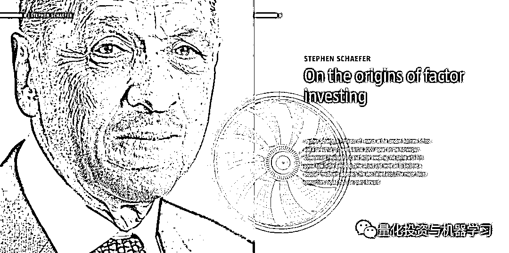
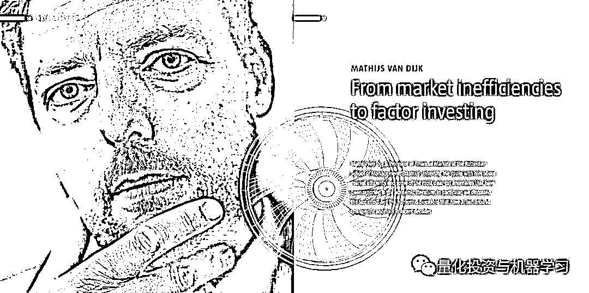
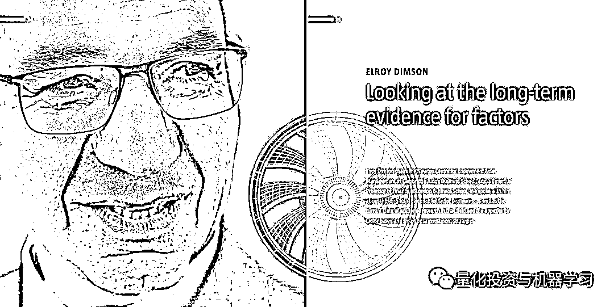
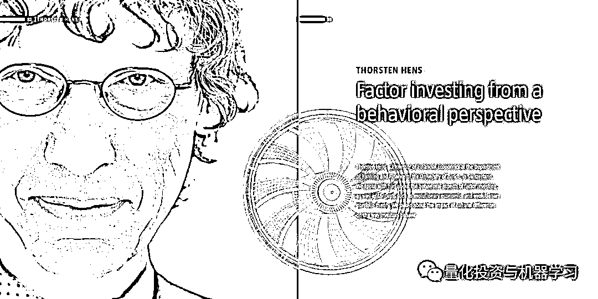
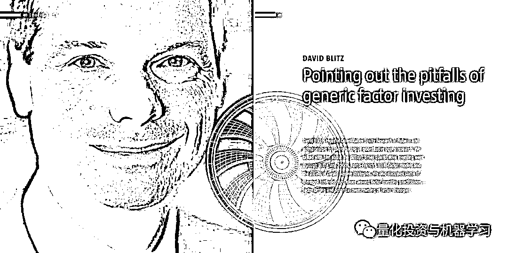
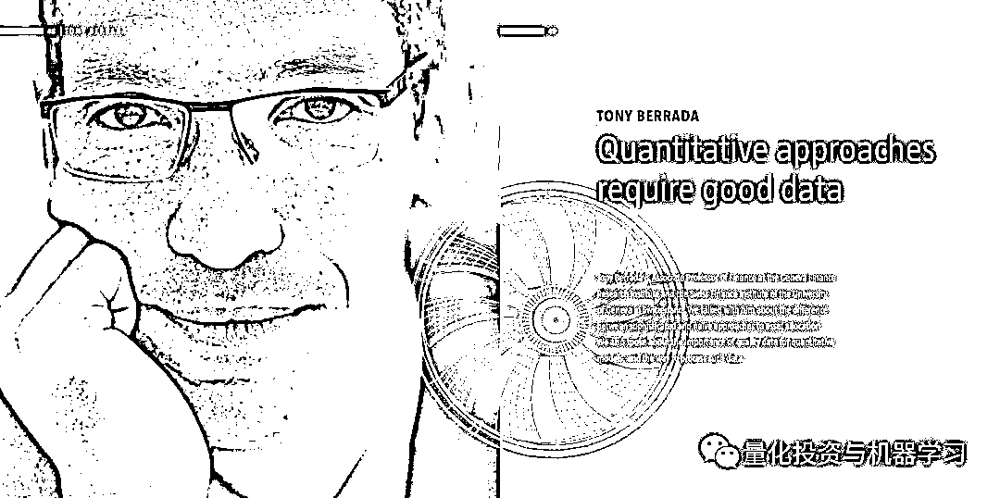
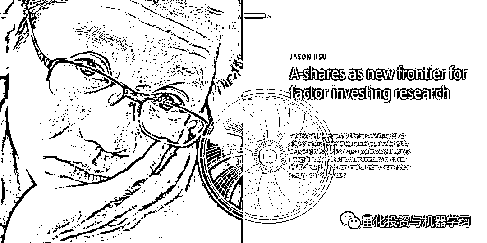
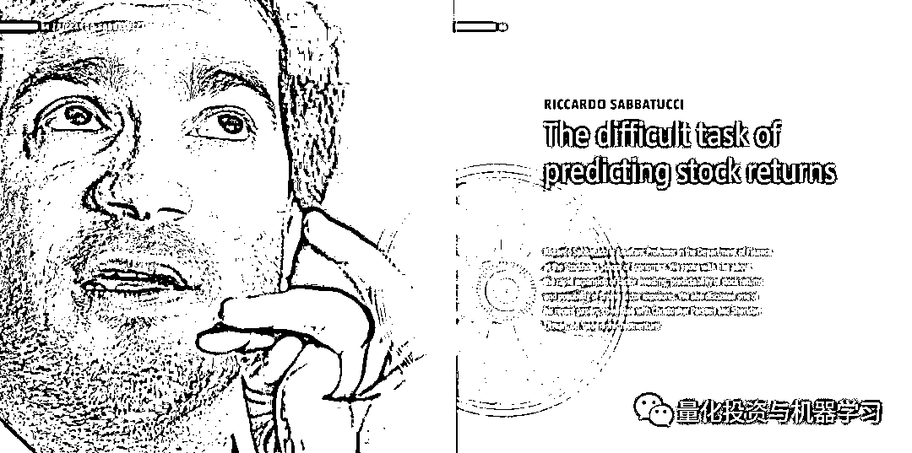
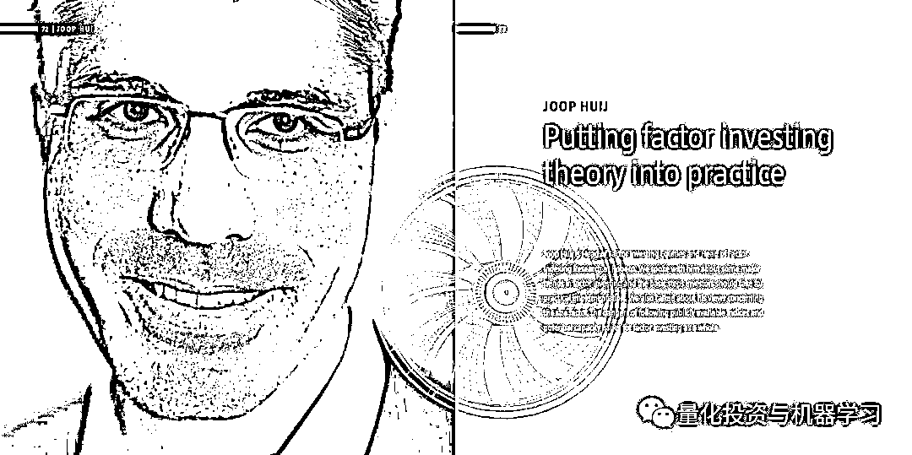

# 独家 | 9 位全球顶尖学者，研讨因子投资和 Smart Beta

> 原文：[`mp.weixin.qq.com/s?__biz=MzAxNTc0Mjg0Mg==&mid=2653290772&idx=1&sn=384384fbcf283f92c7af4aa29e28e6dd&chksm=802dc301b75a4a1711d9818c4b107925b0688f921ed49581d0f5f003d01bec7250d5b57a5b53&scene=27#wechat_redirect`](http://mp.weixin.qq.com/s?__biz=MzAxNTc0Mjg0Mg==&mid=2653290772&idx=1&sn=384384fbcf283f92c7af4aa29e28e6dd&chksm=802dc301b75a4a1711d9818c4b107925b0688f921ed49581d0f5f003d01bec7250d5b57a5b53&scene=27#wechat_redirect)

**标星★公众号**，第一时间获取最新研究

荷兰历史最悠久、规模最大的资管公司 Robeco（荷宝）近期发布了一份题为**《Ex****ploring the world of factors》**的报告。

Robeco 的研究人员和投资组合经理与学术界保持着密切的联系，其中一些人在一流大学担任客座讲师，并参与长期开展的量化投资研究和学术项目。他们对量化投资理论做出了大量贡献，并定期在顶级学术期刊上发表文章，主题包括**因子投资**、**低波动异常**以及**如何在量化投资过程中让交易成本最小化**。

《Exploring the world of factors》报告收集了对金融学术领域 7 位知名外部研究人员的采访，他们在 Robeco 欧洲和亚洲举办的一系列因子投资研讨会上发表了主题演讲。其中还包括两位我们最受尊敬的因子投资专家，以及对 Robeco’s factor-based 策略的简要介绍，特别是**指数增强策略**。

> **公众号将独家为大家介绍这篇报告，希望对各位在资产配置和因子投资领域有所帮助。**

**公众号只解读部分内容，具体详见文末**

**第一位**

> **《论因子投资的起源》**
> 
> Stephen Schaefer 是伦敦商学院的金融学教授，2009 年发表了一份有关挪威政府养老基金和因子投资颇具影响力的报告。
> 
> *We spoke with him about how factor investing came about and went on to become a popular investment approach. We also talked about the major issues researchers should focus on going forward.*

**第二位**

> **《从市场无效到因子投资》**
> 
> Mathijs van Dijk 是伊拉斯莫斯大学鹿特丹管理学院金融市场教授。
> 
> *We spoke with him about market efficiency and some of the most clear-cut anomalies that have been reported in the academic literature. In particular, we discussed the size effect and the numerous questions that have arisen around this specific anomaly in recent decades.*

**第三位**

> **《影响因子的长期证据》**
> 
> Elroy Dimson 是剑桥大学贾奇商学院，牛顿养老资产管理中心的主席，也是伦敦商学院金融学名誉教授。
> 
> *We spoke with him about the long-term evidence for factor premiums, as well as the current state of academic research in that field and the appetite for factor-based and smart beta investment strategies.*

**第四位**

> **《从行为的角度研究因子投资》**
> 
> Thorsten Hens 是瑞士苏黎世大学银行和金融系的金融经济学教授。
> 
> *We spoke with him about the behavioral aspects of factor investing, as well as concepts such as evolutionary economics and evolutionary portfolio theory. We talked about the impact of cultural differences on the way investors behave.*

**第五位**

> **《指出一般因子投资的陷阱》**
> 
> David Blitz 是 Robeco 定量股票研究主管，负责协调所有量股票研究。
> 
> *We talked with him about the difficult times quantitative investing went through in the late 2000s, Fama-French’s multi-factor models and the pitfalls of classic passive strategies. We also discussed some of the most hotly-debated issues among factor investing practitioners: factor timing and potential overcrowding of factor strategies.*

**第六位**

> **《量化方法需要优质数据》**
> 
> Tony Berrada 是瑞士日内瓦大学金融研究所的金融学副教授。
> 
> *We talked with him about the difference between sophisticated and naïve approaches to asset allocation. We also spoke about the importance of quality data for quantitative models, and the way to process such data.*

**第七位**

> **《中国 A 股因子投资研究新前沿》**
> 
> Jason Hsu 是锐联财智（RGA）的创始人和 CIO，RGA 成立于 2012 年，是香港的一家投资管理集团。
> 
> *We spoke with him about what makes a good factor-based investment strategy, in particular from a practical implementation point of view. We also discussed the most recent empirical findings concerning factor premiums with Chinese A-shares.*

**第八位**

> **《预测股票收益的难处》**
> 
> Riccardo Sabbatucci 是瑞典斯德哥尔摩经济学院金融系的助理教授。
> 
> *We spoke with him about the rapid expansion of factor investing, predictability of stock returns and possibility of timing factor exposures. We also discussed one of his recent papers, co-written with Christopher Parsons and Sheridan Titman, on ‘geographic momentum’.*

**第九位**

> **《将因子投资理论进行实践》**
> 
> Joop Huij 是 Robeco 的因子投资股票主管和因子指数研究主管。
> 
> *We spoke with him about some major trends in factor investing and the basic steps investors should take for practical implementation. We also talked about his views concerning the size factor, the dangers of following publicly available indices and potential capacity issues for factor investing as a whole.*

**推荐阅读**

[01、经过多年交易之后你应该学到的东西（深度分享）](https://mp.weixin.qq.com/s?__biz=MzAxNTc0Mjg0Mg==&mid=2653289074&idx=1&sn=e859d363eef9249236244466a1af41b6&chksm=802e3867b759b1717f77e07a51ee5671e8115130c66562577280ba1243cba08218add04f1f00&token=449379994&lang=zh_CN&scene=21#wechat_redirect)

[02、监督学习标签在股市中的应用（代码+书籍）](https://mp.weixin.qq.com/s?__biz=MzAxNTc0Mjg0Mg==&mid=2653289050&idx=1&sn=60043a5c95b877dd329a5fd150ddacc4&chksm=802e384fb759b1598e500087374772059aa21b31ae104b3dca04331cf4b63a233c5e04c1945a&token=449379994&lang=zh_CN&scene=21#wechat_redirect)

[03、全球投行顶尖机器学习团队全面分析](https://mp.weixin.qq.com/s?__biz=MzAxNTc0Mjg0Mg==&mid=2653289018&idx=1&sn=8c411f676c2c0d92b0dd218f041bee4b&chksm=802e382fb759b139ffebf633ac14cdd0f21938e4613fe632d5d9231dab3d2aca95a11628378a&token=449379994&lang=zh_CN&scene=21#wechat_redirect)

[04、使用 Tensorflow 预测股票市场变动](https://mp.weixin.qq.com/s?__biz=MzAxNTc0Mjg0Mg==&mid=2653289014&idx=1&sn=3762d405e332c599a21b48a7dc4df587&chksm=802e3823b759b135928d55044c2729aea9690f86752b680eb973d1a376dc53cfa18287d0060b&token=449379994&lang=zh_CN&scene=21#wechat_redirect)

[05、使用 LSTM 预测股票市场基于 Tensorflow](https://mp.weixin.qq.com/s?__biz=MzAxNTc0Mjg0Mg==&mid=2653289238&idx=1&sn=3144f5792f84455dd53c27a78e8a316c&chksm=802e3903b759b015da88acde4fcbc8547ab3e6acbb5a0897404bbefe1d8a414265d5d5766ee4&token=2020206794&lang=zh_CN&scene=21#wechat_redirect)

[06、美丽的回测——教你定量计算过拟合概率](https://mp.weixin.qq.com/s?__biz=MzAxNTc0Mjg0Mg==&mid=2653289314&idx=1&sn=87c5a12b23a875966db7be50d11f09cd&chksm=802e3977b759b061675d1988168c1fec06c602e8583fbcc9b76f87008e0c10b702acc85467a0&token=1972390229&lang=zh_CN&scene=21#wechat_redirect)

[07、利用动态深度学习预测金融时间序列基于 Python](https://mp.weixin.qq.com/s?__biz=MzAxNTc0Mjg0Mg==&mid=2653289347&idx=1&sn=bf5d7899bc4a854d4ba9046fdc6fe0d6&chksm=802e3996b759b080287213840987bb0a0c02e4e1d4d7aae23f10a225a92ef6dd922d8006123d&token=290397496&lang=zh_CN&scene=21#wechat_redirect)

[08、Facebook 开源神器 Prophet 预测时间序列基于 Python](https://mp.weixin.qq.com/s?__biz=MzAxNTc0Mjg0Mg==&mid=2653289394&idx=1&sn=24a836136d730aa268605628e683d629&chksm=802e39a7b759b0b1dcf7aaa560699130a907716b71fc9c45ff0e5d236c5ae8ef80ebdb09dbb6&token=290397496&lang=zh_CN&scene=21#wechat_redirect)

[09、Facebook 开源神器 Prophet 预测股市行情基于 Python](https://mp.weixin.qq.com/s?__biz=MzAxNTc0Mjg0Mg==&mid=2653289437&idx=1&sn=f0dca7da8e69e7ba736992cb3d034ce7&chksm=802e39c8b759b0de5bce401c580623d0729ecca69d13926479d36e19aff8c9c9e8a20265afff&token=290397496&lang=zh_CN&scene=21#wechat_redirect)

[10、2018 第三季度最受欢迎的券商金工研报前 50（附下载）](https://mp.weixin.qq.com/s?__biz=MzAxNTc0Mjg0Mg==&mid=2653289358&idx=1&sn=db6e8ab85b08f6e67790ec0e401e586e&chksm=802e399bb759b08d6eec855f9901ea856d0da68c7425cba62791b8948da6ad761a3d88543dad&token=290397496&lang=zh_CN&scene=21#wechat_redirect)

[11、实战交易策略的精髓（公众号深度呈现）](https://mp.weixin.qq.com/s?__biz=MzAxNTc0Mjg0Mg==&mid=2653289447&idx=1&sn=f2948715bf82569a6556d518e56c1f9e&chksm=802e39f2b759b0e4502d1aaac562b87789573b55c76b3c85897d8c9d88dbf9a0b7ee34d86a4e&token=290397496&lang=zh_CN&scene=21#wechat_redirect)

[12、Markowitz 有效边界和投资组合优化基于 Python](https://mp.weixin.qq.com/s?__biz=MzAxNTc0Mjg0Mg==&mid=2653289478&idx=1&sn=f8e01a641be021993d8ef2d84e94a299&chksm=802e3e13b759b7055cf27a280c672371008a5564c97c658eee89ce8481396a28d254836ff9af&token=290397496&lang=zh_CN&scene=21#wechat_redirect)

[13、使用 LSTM 模型预测股价基于 Keras](https://mp.weixin.qq.com/s?__biz=MzAxNTc0Mjg0Mg==&mid=2653289495&idx=1&sn=c4eeaa2e9f9c10995be9ea0c56d29ba7&chksm=802e3e02b759b7148227675c23c403fb9a543b733e3d27fa237b53840e030bf387a473d83e3c&token=1260956004&lang=zh_CN&scene=21#wechat_redirect)

[14、量化金融导论 1：资产收益的程式化介绍基于 Python](https://mp.weixin.qq.com/s?__biz=MzAxNTc0Mjg0Mg==&mid=2653289507&idx=1&sn=f0ca71aa07531bbbdbd33213f0bab89f&chksm=802e3e36b759b720138b3b17a4dd0e198e054b9de29a038fdd50805f824effa55831111ad026&token=1936245282&lang=zh_CN&scene=21#wechat_redirect)

[15、预测股市崩盘基于统计机器学习与神经网络（Python+文档）](https://mp.weixin.qq.com/s?__biz=MzAxNTc0Mjg0Mg==&mid=2653289533&idx=1&sn=4ef964834e84a9995111bb057b0fc5dd&chksm=802e3e28b759b73e0618eb1262c53aa0601fbf5805525a7c7ff40dc3db62c7704496611bdbf1&token=1950551577&lang=zh_CN&scene=21#wechat_redirect)

[16、实现最优投资组合有效前沿基于 Python（附代码）](https://mp.weixin.qq.com/s?__biz=MzAxNTc0Mjg0Mg==&mid=2653289609&idx=1&sn=c7f0b3e47025862d10bb53b6ab88bcda&chksm=802e3e9cb759b78abf6b8b049c59bf18ccfb2ead7580d1f557d36de2292f59dcbd94dcd41910&token=2085008037&lang=zh_CN&scene=21#wechat_redirect)

[17、精心为大家整理了一些超级棒的机器学习资料（附链接）](https://mp.weixin.qq.com/s?__biz=MzAxNTc0Mjg0Mg==&mid=2653289615&idx=1&sn=1cdc89afb997d0c580bf0cef296d946c&chksm=802e3e9ab759b78ce9f0cd152a680d4a413d6c8dcb02a7a296f4091993a7e4137e7520394575&token=2085008037&lang=zh_CN&scene=21#wechat_redirect)

[18、海量 Wind 数据，与全网用户零距离邂逅！](https://mp.weixin.qq.com/s?__biz=MzAxNTc0Mjg0Mg==&mid=2653289623&idx=1&sn=28a3600fd7a72d7be00b066ca0f98244&chksm=802e3e82b759b7943f43a4f6ef4a91e4153fa6b8210de9590235fa8ee66eb9811ce177054dbc&token=1389401983&lang=zh_CN&scene=21#wechat_redirect)

[19、机器学习、深度学习、量化金融、Python 等最新书籍汇总下载](https://mp.weixin.qq.com/s?__biz=MzAxNTc0Mjg0Mg==&mid=2653289640&idx=1&sn=34e94fcbe99052b8e7381ecc48a36dc0&chksm=802e3ebdb759b7ab897cd329a680715b6f8294e63550ddf0c57b9e1320b2b7d1408c6fdca0c7&token=1389401983&lang=zh_CN&scene=21#wechat_redirect)

[20、各大卖方 2019 年 A 股策略报告，都是有故事的人！](https://mp.weixin.qq.com/s?__biz=MzAxNTc0Mjg0Mg==&mid=2653289725&idx=1&sn=4b65cd1fb8331438e4c0b3d0eae6b51f&chksm=802e3ee8b759b7fe1b94e84d54cc23b0ab05853d5cd227812574b350e9fc2cce9e5f1bc6cb7a&token=1389401983&lang=zh_CN&scene=21#wechat_redirect)

**如何获取报告**

在**后台**输入

**20190223**

**后台获取方式介绍**

**扫码关注我们**

