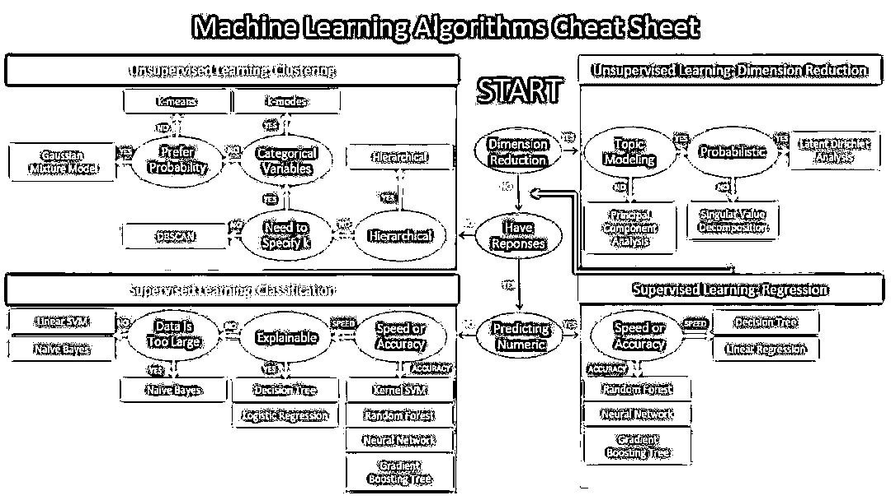
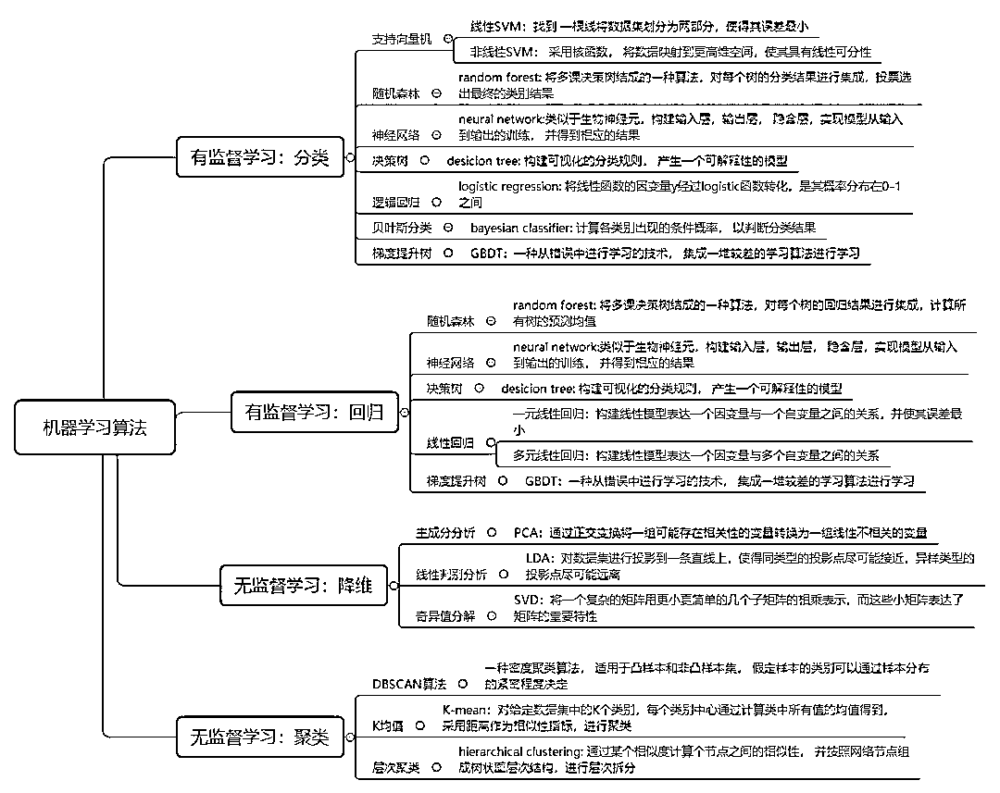
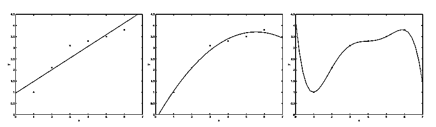
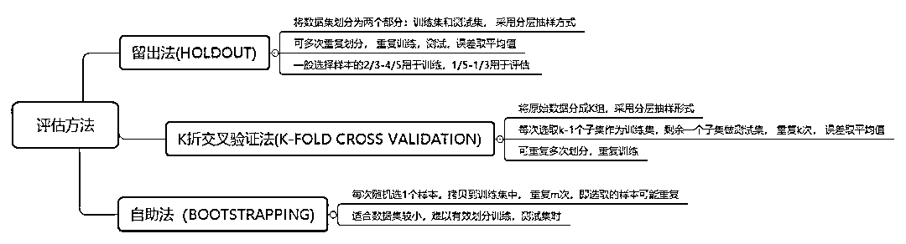
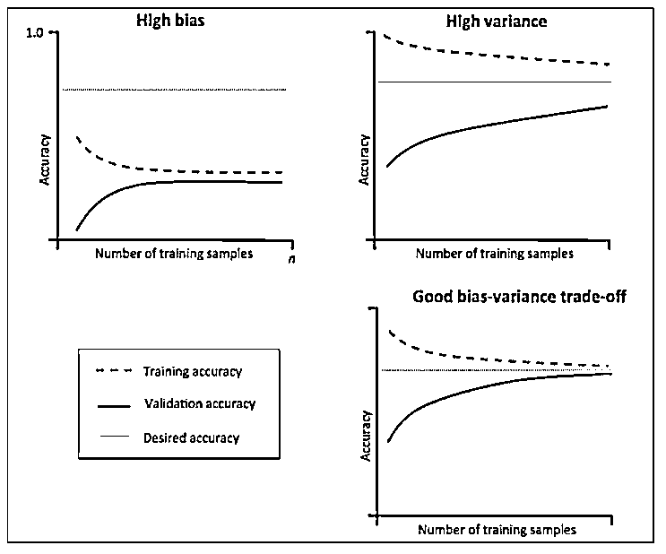
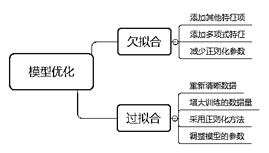
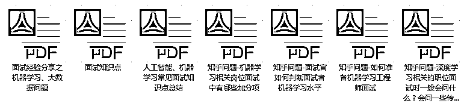
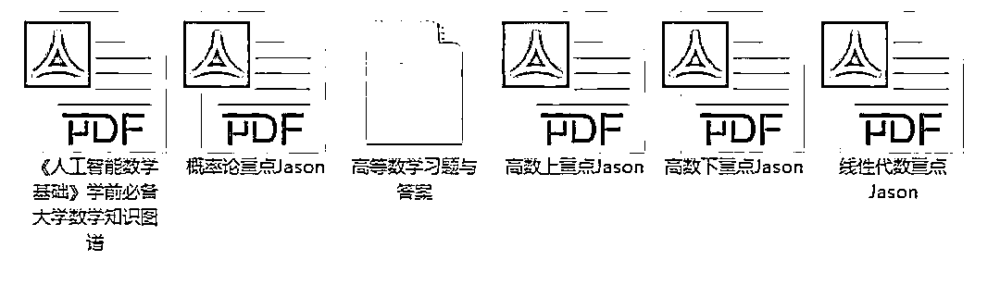
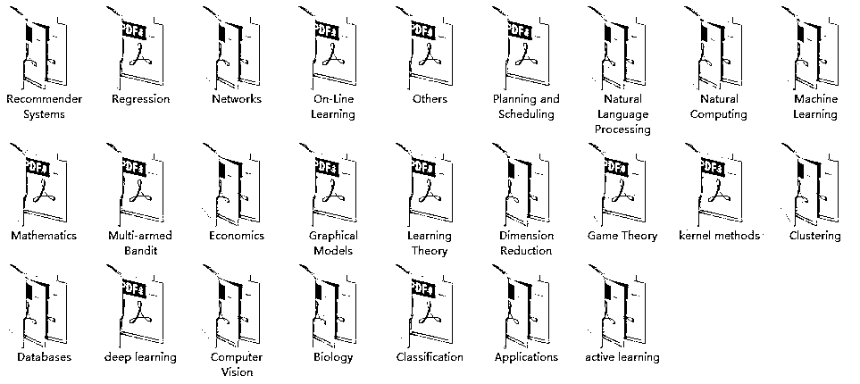

# 抽离数学焦虑、算法选择，思考做好机器学习项目的 3 个核心问题

> 原文：[`mp.weixin.qq.com/s?__biz=MzAxNTc0Mjg0Mg==&mid=2653290724&idx=1&sn=4249b2bc07bdb293e806cdf3889c1dec&chksm=802dc2f1b75a4be7504b42ef4f75bfb67321ceb33f099032d9699c1ae59929d4d969e886fb79&scene=27#wechat_redirect`](http://mp.weixin.qq.com/s?__biz=MzAxNTc0Mjg0Mg==&mid=2653290724&idx=1&sn=4249b2bc07bdb293e806cdf3889c1dec&chksm=802dc2f1b75a4be7504b42ef4f75bfb67321ceb33f099032d9699c1ae59929d4d969e886fb79&scene=27#wechat_redirect)

**标星★公众号**，第一时间获取最新研究

机器学习是目前人工智能最令人激动的研究方向之一。我们可能更关注机器学习算法的实现细节，沉浸于机器学习所需要的数学功底，**但对于机器学习从业者来说，如何更好更快速的实现一个机器学习项目更值得关注。**

正如吴恩达在《机器学习》这门课中所说，他将花费更多的时间来教授机器学习、人工智能的最佳实践以及如何让它们工作。好的工具，在会用和不会用的人之间存在着鸿沟。

当我们做一个机器学习项目时，不纠结于各个模型算法的内部细节，从整体的角度看具体问题该如何更可靠更高效得出结论，才不至于浪费更多的时间。**从对数学的焦虑中，众多算法的选择中抽身出来， 去思考以下几个问题：**

*   我们如何在项目中选择更为合适的算法？

*   选择算法之后，如何知道我们的模型是更有用的或更好的？

*   如何进一步优化模型以达到更理想的效果？

本文将基于上述几个问题展开，在此之前，首先明确几个概念。

> 机器学习：机器学习是一门涉及多领域，多门学科理论的交叉学科，通过一个程序使其能从已有的经验中学习，从而能提升对某一项任务的解决能力。
> 
> 有监督学习：有监督学习是指需要给出一定量的标签指导计算机去完成任务。就像一个学生需要在老师的教导启发下进行学习。
> 
> 如预测房屋的价格，需要预先知道一些房屋的价格以及房屋的有关属性的数据，对已有数据进行训练后，得到的模型将会产生对不同属性房屋特性的价格预测情况。
> 
> 无监督学习：无监督学习顾名思义是指不需要给定标签，让模型自己训练，得出结论。类似于一个学生通过自己的积累产生对知识的理解。
> 
> 如有一些房屋的有关属性的数据， 模型可以自动识别出哪些特征是属于市中心的房子， 哪些事属于郊区的房子，得到的模型可以产生对不同房屋属性的类别的判断。

**选择合适的算法**

**针对具体的问题选择不同的算法。**

> 如一个分类问题可优先选择逻辑回归，支持向量机，神经网络等模型，数据集较大的问题优先选择朴素贝叶斯方法，决策树和逻辑回归具有可解释性。聚类问题我们可能会考虑层次分析，k 均值模型。 如果数据集的特征很多，可以考虑采用主成分分析，线性判别分析等进行降维。

**第一步，明确具体问题**

明确目标任务，进而实现对算法的选择。

有监督学习主要有回归和分类任务：

> **回归是研究因变量与自变量之间关系的方法。**
> 
> 上文所说的房屋价格的预测的例子就是一个回归问题，构建房屋价格与房屋其他属性之间关系的模型， 实现新房屋的价格的预测，我们预测的是一个模型的连续性的值。
> 
> **分类将数据集按照不同的特点分为不同的类别。**
> 
> 如金融市场中一个常见的预测股价涨跌的示例，给定一段时间内股价的涨跌方向作为模型的输出，即我们设定的标签，预测后一段时间股价的涨跌情况，这里的结果只会有涨和跌两种情况，预测的是间断的值。

无监督学习主要有聚类和降维任务：

> **聚类将数据集分为多个类似的对象组成的多个类。**
> 
> 当我们在网站上搜索一条内容的时候，网站会有相似的内容推荐，这是因为网站通过聚类的方式将有相似浏览特征的客户聚集在一起共同分析，以便更了解客户。聚类与分类的差别是，分类是我们知道怎样的特征能够属于一类，并设定了标签，而聚类分的类别则完全是模型自主切分。
> 
> **降维的基本原理是将样本点从输入空间通过线性或非线性变换映射到一个低维空间，从而降低了原数据集的维度，同时又能尽量减少数据信息的丢失**。经过降维，一方面可以对数据进行可视化研究，另一方面由于数据量大大减少，将提高机器学习的效率。

**第二步，选择算法**

明确项目的任务，对算法有进一步的了解，可以帮助我们了解模型的使用细节，以便更快速实现模型。

我们将一些算法模型整理成如下思维导图的形式，并对相关算法的基本思想做了简单阐述。**你可以很快速的浏览每个算法的核心及应用，在面对实际问题时做出大致的判断。**

我们论述了有关问题的定位以及相关算法模型的选择，**但需要注意的是，我们已经针对算法模型有一个初步的定位，在实践过程中仍然需要将实际数据与模型结合考虑**。最初尝试时可以使用较少的数据量快速过滤出一些算法，最终选定少数的算法进行后续的优化。同时，对数据的理解程度也将影响模型的选择，对数据越熟悉越能够做出更高效的判断。

**模型评估**

选择合适的算法之后，如何知道我们所设计的模型是有用的或者较好的？ 

机器学习是利用模型对数据进行拟合，对训练集进行拟合，训练模型，对样本外数据集进行预测。其中模型对训练集数据的误差称为经验误差， 对测试集数据的误差称为泛化误差。模型对样本外数据集的预测能力称为模型的泛化能力。

**过拟合与欠拟合**

欠拟合和过拟合都是模型泛化能力不高的表现。欠拟合通常表现为模型学习能力不足，没有学习到数据的一般规律。而过拟合则是模型捕捉到数据中太多的特征，以至于将所有特征都认为是数据的一般规律。如下图树叶的示例很形象的表达了欠拟合与过拟合。

我们希望的状态是模型能训练出数据的一般规律，既不过拟合，也不欠拟合。如下图所示，最左侧可能是一种欠拟合状态，拟合的函数和训练集的误差较大，最右侧是过拟合，拟合的函数与训练集几乎完全匹配，这种情况在测试集中结果反而会变差。**由此，需要构建评估模型来评估模型的泛化能力，这是检验一个模型是否更为有效的方法。**

**评估方法**

将一个模型的训练集也当作测试集会导致对模型泛化能力的评估不准确，因此我们需要将数据拆分，即使用训练集进行训练， 测试集进行验证评估模型的准确性， 两个数据集不相交，从而验证模型的泛化能力。

常见的模型评估方法有留出法，k 折交叉验证法和自助法：

K 折交叉验证中 k 一般会选择 5,10,20，其中 k 越大需要训练的次数越长，其误差估计的效果也越好。在验证中，训练集和测试集的数据分布应尽可能一致，如果不一致，可能会影响测试集的误差。

**优化模型**

评估模型的泛化能力评估，当模型的应用不理想时，我们应该如何优化模型？假设我们在做一个预测模型时， 预测的结果与实际有很大的误差。我们知道模型不理想主要来源于模型的欠拟合和过拟合，接下来该如何做？

**学习曲线**

**考虑使用学习曲线来判断模型的过拟合问题。**

学习曲线是通过画出不同训练集大小时训练集和交叉验证的准确率，可以看到模型在新数据上的表现，进而判断模型是否方差偏高或偏差过高，以及增大训练集是否可以减小过拟合。

当训练集与测试集的误差收敛但却很高时，为高偏差，左上角偏差较高，训练集和验证集的准确率很低，可能是欠拟合。当训练集与测试集的误差之间有很大的差距时，为高方差，右上角中方差较高，训练集的准确率要高于验证集的准确率，可能是过拟合。理想的状况是偏差和方差都很小，此时既不欠拟合也不过拟合。

**优化模型**

基于上文，当模型出现过拟合或欠拟合时，可从以下几个方面考虑：

> **1\. 数据量的多少。**较少的数据量更容易过拟合，增大数据量对过拟合是有效的。
> 
> **2\. 增加或减少特征量。**特征值较少会影响模型对样本数据的认识，导致欠拟合，增加特征值对欠拟合时有效的。
> 
> **3\. 增加或减少正则化。**正则化的使用对过拟合是有效的。

具体可以参见以下思维导图：

一个机器学习项目是实践与理论相结合的过程，通过实践加深对理论的认识，学习理论提高对实际问题的应用能力。在不断熟悉实际问题的数据类型与背景的过程中，通过训练机器学习模型，使用各种方法调整并优化模型以得到满意的结论，这一过程可能比单一熟悉机器学习算法理论耗时要长。 通常情况下，我们会花更多的时间在数据的预处理和参数调优上，需要不断调整数据，优化模型，直到达到较为理想的效果。 

**如果想要更好的加强这方面的锻炼，建议多交流，看看别人的经验总结，****网易云课堂****推出机器学习微专业，目前有免费的直播课程，由行业专业人士免费为各位答疑解惑，加强交流。以下福利都是限时免费送出，感兴趣的不要错过：**

***Part.1***

**免费直播课**

**手把手带你了解 AI 项目全流程之北京房价预测**

<2 月 25 日 周一 20:00>

**直播大纲：**

1 北京房价预测项目介绍及分析

2 从数据处理到建模预测，项目流程全解析

3 学习经验分享——机器学习的必备技能树

直播讲师：

网易特邀 AI 讲师：汤汤

***Part.2***

**免费体验课** 

**▼**

**《机器学习基础》**

**课程大纲**

1 机器学习的就业前景

2 Python 实战学习

（附 15 天学习计划和趣味项目源码）

3 机器学习工程师的实际应用

**小姐姐群内答疑**

▼

***Part.3***

**人工智能学习资料包** 

▼

6 个实战案例学习资料及代码

▼

面试相关问题

▼

程序员简历模板

▼

数学基础学习资料

▼

134 篇国际经典论文集

****

***Part.4***

**答疑助力+福利获取方式**

扫码添加小助手，即可免费获取以上所有福利

**席位有限，先到先得~**