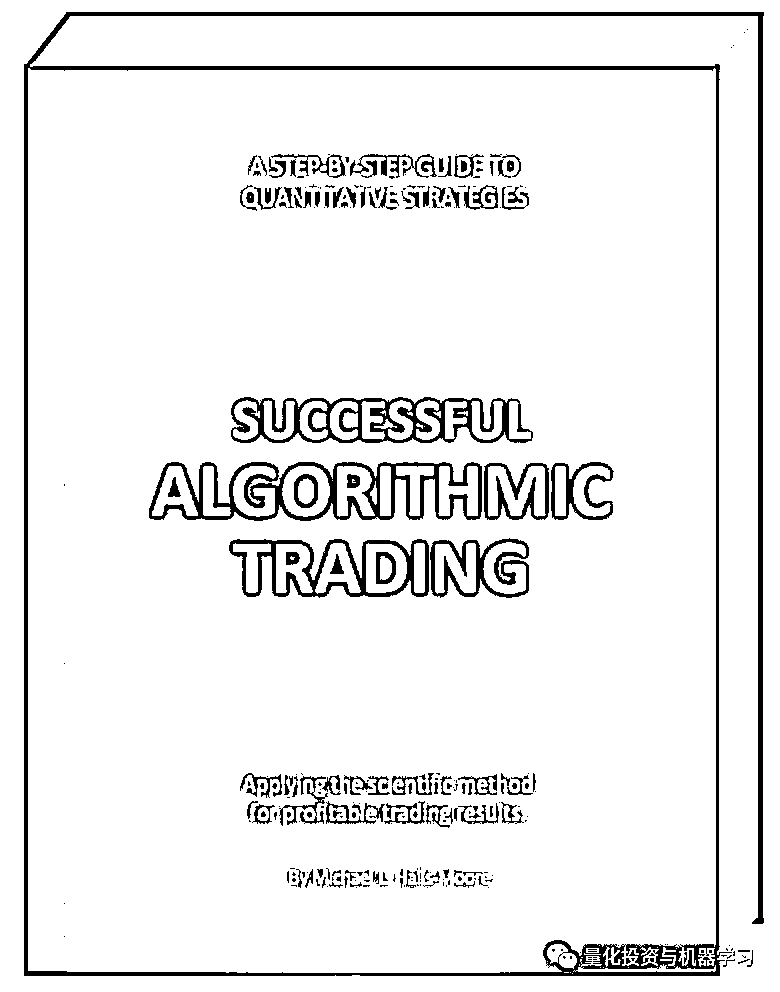

# 神经网络在算法交易上的应用系列——时序预测+回测

> 原文：[`mp.weixin.qq.com/s?__biz=MzAxNTc0Mjg0Mg==&mid=2653290703&idx=1&sn=7b8ce836b7cd4f4a72f0c09e7b4be2af&chksm=802dc2dab75a4bcc7f2d9753d6f4da7a2fd48f666ea78a99c41a87d656baa70da8e692ae9b09&scene=27#wechat_redirect`](http://mp.weixin.qq.com/s?__biz=MzAxNTc0Mjg0Mg==&mid=2653290703&idx=1&sn=7b8ce836b7cd4f4a72f0c09e7b4be2af&chksm=802dc2dab75a4bcc7f2d9753d6f4da7a2fd48f666ea78a99c41a87d656baa70da8e692ae9b09&scene=27#wechat_redirect)

**标星★公众号**，第一时间获取最新研究

本期作者：Alexandr Honchar

本期翻译：LIN | 公众号翻译部 

**近期原创文章：**

## ♥ [基于无监督学习的期权定价异常检测（代码+数据）](https://mp.weixin.qq.com/s?__biz=MzAxNTc0Mjg0Mg==&mid=2653290562&idx=1&sn=dee61b832e1aa2c062a96bb27621c29d&chksm=802dc257b75a4b41b5623ade23a7de86333bfd3b4299fb69922558b0cbafe4c930b5ef503d89&token=1298662931&lang=zh_CN&scene=21#wechat_redirect)

## ♥ [5 种机器学习算法在预测股价的应用（代码+数据）](https://mp.weixin.qq.com/s?__biz=MzAxNTc0Mjg0Mg==&mid=2653290588&idx=1&sn=1d0409ad212ea8627e5d5cedf61953ac&chksm=802dc249b75a4b5fa245433320a4cc9da1a2cceb22df6fb1a28e5b94ff038319ae4e7ec6941f&token=1298662931&lang=zh_CN&scene=21#wechat_redirect)

## ♥ [深入研读：利用 Twitter 情绪去预测股市](https://mp.weixin.qq.com/s?__biz=MzAxNTc0Mjg0Mg==&mid=2653290402&idx=1&sn=efda9ea106991f4f7ccabcae9d809e00&chksm=802e3db7b759b4a173dc8f2ab5c298ab3146bfd7dd5aca75929c74ecc999a53b195c16f19c71&token=1330520237&lang=zh_CN&scene=21#wechat_redirect)

## ♥ [Two Sigma 用新闻来预测股价走势，带你吊打 Kaggle](https://mp.weixin.qq.com/s?__biz=MzAxNTc0Mjg0Mg==&mid=2653290456&idx=1&sn=b8d2d8febc599742e43ea48e3c249323&chksm=802e3dcdb759b4db9279c689202101b6b154fb118a1c1be12b52e522e1a1d7944858dbd6637e&token=1330520237&lang=zh_CN&scene=21#wechat_redirect)

## ♥ [利用深度学习最新前沿预测股价走势](https://mp.weixin.qq.com/s?__biz=MzAxNTc0Mjg0Mg==&mid=2653290080&idx=1&sn=06c50cefe78a7b24c64c4fdb9739c7f3&chksm=802e3c75b759b563c01495d16a638a56ac7305fc324ee4917fd76c648f670b7f7276826bdaa8&token=770078636&lang=zh_CN&scene=21#wechat_redirect)

## ♥ [一位数据科学 PhD 眼中的算法交易](https://mp.weixin.qq.com/s?__biz=MzAxNTc0Mjg0Mg==&mid=2653290118&idx=1&sn=a261307470cf2f3e458ab4e7dc309179&chksm=802e3c93b759b585e079d3a797f512dfd0427ac02942339f4f1454bd368ba47be21cb52cf969&token=770078636&lang=zh_CN&scene=21#wechat_redirect)

## ♥ [基于 RNN 和 LSTM 的股市预测方法](https://mp.weixin.qq.com/s?__biz=MzAxNTc0Mjg0Mg==&mid=2653290481&idx=1&sn=f7360ea8554cc4f86fcc71315176b093&chksm=802e3de4b759b4f2235a0aeabb6e76b3e101ff09b9a2aa6fa67e6e824fc4274f68f4ae51af95&token=1865137106&lang=zh_CN&scene=21#wechat_redirect)

## ♥ [人工智能『AI』应用算法交易，7 个必踩的坑！](https://mp.weixin.qq.com/s?__biz=MzAxNTc0Mjg0Mg==&mid=2653289974&idx=1&sn=88f87cb64999d9406d7c618350aac35d&chksm=802e3fe3b759b6f5eca6e777364270cbaa0bf35e9a1535255be9751c3a77642676993a861132&token=770078636&lang=zh_CN&scene=21#wechat_redirect)

## ♥ [神经网络在算法交易上的应用系列（一）](https://mp.weixin.qq.com/s?__biz=MzAxNTc0Mjg0Mg==&mid=2653289962&idx=1&sn=5f5aa65ec00ce176501c85c7c106187d&chksm=802e3fffb759b6e9f2d4518f9d3755a68329c8753745333ef9d70ffd04bd088fd7b076318358&token=770078636&lang=zh_CN&scene=21#wechat_redirect)

## ♥ [预测股市 | 如何避免 p-Hacking，为什么你要看涨？](https://mp.weixin.qq.com/s?__biz=MzAxNTc0Mjg0Mg==&mid=2653289820&idx=1&sn=d3fee74ba1daab837433e4ef6b0ab4d9&chksm=802e3f49b759b65f422d20515942d5813aead73231da7d78e9f235bdb42386cf656079e69b8b&token=770078636&lang=zh_CN&scene=21#wechat_redirect)

## ♥ [如何鉴别那些用深度学习预测股价的花哨模型？](https://mp.weixin.qq.com/s?__biz=MzAxNTc0Mjg0Mg==&mid=2653290132&idx=1&sn=cbf1e2a4526e6e9305a6110c17063f46&chksm=802e3c81b759b597d3dd94b8008e150c90087567904a29c0c4b58d7be220a9ece2008956d5db&token=1266110554&lang=zh_CN&scene=21#wechat_redirect)

## ♥ [优化强化学习 Q-learning 算法进行股市交易](https://mp.weixin.qq.com/s?__biz=MzAxNTc0Mjg0Mg==&mid=2653290286&idx=1&sn=882d39a18018733b93c8c8eac385b515&chksm=802e3d3bb759b42d1fc849f96bf02ae87edf2eab01b0beecd9340112c7fb06b95cb2246d2429&token=1330520237&lang=zh_CN&scene=21#wechat_redirect)

## ♥ [搭建入门级高频交易系统（架构细节分享）](https://mp.weixin.qq.com/s?__biz=MzAxNTc0Mjg0Mg==&mid=2653290615&idx=1&sn=ba1f774031b6dae519f614e7f5cf3141&chksm=802dc262b75a4b74dc3198cc507dbe1e97afc262f4ca4f9e9e122391fb9ebc916b14137c03d1&token=863052737&lang=zh_CN&scene=21#wechat_redirect)


**这是公众号关于神经网络在金融领域特别是算法交易上的一个连载系列：**

> [**1、简单时间序列预测**](https://mp.weixin.qq.com/s?__biz=MzAxNTc0Mjg0Mg==&mid=2653289962&idx=1&sn=5f5aa65ec00ce176501c85c7c106187d&chksm=802e3fffb759b6e9f2d4518f9d3755a68329c8753745333ef9d70ffd04bd088fd7b076318358&token=452595295&lang=zh_CN&scene=21#wechat_redirect)**（已发表）**
> 
> **2、正确的时间序列预测+回测**
> 
> 3、多变量时间序列预测
> 
> 4、波动率预测和自定义损失函数
> 
> 5、多任务和多模式学习
> 
> 6、超参数优化
> 
> 7、用神经网络增强传统策略
> 
> 8、概率编程和 Pyro 进行预测

欢迎大家**关注公众号**查看此系列。本期我们从讲第二部分。

**前言**

在第二部分中，我们想描述更正确处理金融数据的方法。与前一篇文章相比，我们想展示不同的**数据标准化方法**，并多**讨论些过拟合的问题**（在处理具有随机特性的数据时肯定会出现过拟合问题）。我们不会比较不同的架构（CNN, LSTM），你可以在之前的文章中查看它们。但即使只使用简单的前馈神经网络，我们也能看到一些重要的东西。

**数据准备**

让我们看看从 2005 年到今天苹果股价的历史时间序列。你可以很容易地从雅虎财经下载到 csv 格式的文件。在这个文件中数据的顺序是“颠倒”的——从 2017 年到 2005 年，所以我们需要先把它颠倒过来，如图：

```py
data = pd.read_csv('./data/AAPL.csv')[::-1] 
close_price = data.ix[:, 'Adj Close'].tolist() 
plt.plot(close_price) 
plt.show()
```


正如我们在前一篇文章中所讨论的，我们可以用两种不同的方式来处理金融时间序列预测的问题（暂时忽略波动率预测、异常检测等有趣的话题）:

我们将问题看作：

> 1、回归问题（试图准确预测收盘价或第二天的收益）
> 
> 2、二元分类问题（价格将上升[1;0]或向下[0;1]）

首先，我们准备训练数据。我们想根据 N 天前的信息来预测 t+1 的值。例如，有过去 30 天的收盘价数据，我们想预测明天，也就是第 31 天的价格是多少。我们将前 90%的时间序列作为训练集（将其视为历史数据），后 10%作为测试集来评估模型。

金融时间序列的主要问题是它们并不一定平稳，这意味着它们的统计特性（平均值、方差、最大值和最小值）随着时间的变化而变化，我们可以用 ADF 检验。**正因为这种不平稳性，我们不能使用经典的数据标准化方法，如 MinMax 或 Z-score 标准化**。

在我们的例子中，我们将在分类问题上做一点“弊”。**我们不需要预测某个确切的值，所以未来的期望值和方差对我们来说不是很有意义，我们只需要预测价格往上还是往下运动。**这就是为什么我们冒险用 30 天窗口内数据的均值和方差（z-score 标准化）来标准化的原因，不妨假设在一个时间窗口内均值和方差不会改变很多，和未来的信息也没有关系。

```py
X = [(np.array(x) — np.mean(x)) / np.std(x) for x in X]
```

对于回归问题，我们已经不能像这样作弊了，所以我们用 pandas 计算收益率（价格与昨天相比变化的百分比），它看起来是这样的:

```py
close_price_diffs = close.price.pct_change()
```


正如我们所看到的，这个数据已经比较规范了，位于-0.5 到 0.5 之间。

**神经网络结构**

正如我之前所说，在本文中，我们将只使用 MLPs 来展示在金融数据上过度拟合神经网络是多么容易（在前一篇文章中实际上存在过拟合），以及如何预防它。在 CNNs 或 RNNs 上扩展这些想法相对容易，但是理解这个概念要重要得多。和以前一样，**我们使用 Keras 作为神经网络原型的主要框架**。

我们的第一个网络是这样的：

```py
model = Sequential() 
model.add(Dense(64, input_dim=30)) 
model.add(BatchNormalization()) 
model.add(LeakyReLU()) 
model.add(Dense(2)) 
model.add(Activation('softmax'))
```

> 建议在每一个仿射或卷积层之后都使用批规范化方法和用 Leaky ReLU 作为基本的激活函数，因为它已经成为了“工业标准”——它们有助于更快地训练网络。另一个好处是在训练中降低学习率，Keras 用**ReduceLROnPlateau**函数做到了这一点：

```py
reduce_lr = ReduceLROnPlateau(monitor='val_loss', factor=0.9, 
patience=5, min_lr=0.000001, verbose=1) 

model.compile(optimizer=opt,                
loss='categorical_crossentropy', metrics=['accuracy'])
```

我们是这样开始训练的：

```py
history = model.fit(X_train, Y_train, nb_epoch = 50,  
batch_size = 128, verbose=1, validation_data=(X_test, Y_test),           
shuffle=True, callbacks=[reduce_lr])
```

这是我们将结果可视化的方法（让我们来判断 loss 和 accuracy 图）

```py
plt.figure() 
plt.plot(history.history['loss']) plt.plot(history.history['val_loss']) 
plt.title('model loss') 
plt.ylabel('loss') 
plt.xlabel('epoch') 
plt.legend(['train', 'test'], loc='best')
```

**重要时刻 : **

**在上一篇文章中，我们在训练网络时只迭代了 10 次——这是完全错误的。即使我们能看到 55%的准确率，这并不意味着我们能比随机猜测更好地预测未来。最有可能的是，在我们的训练数据集中有 55%的窗口数据具有一种行为（向上），45%的窗口数据具有另一种行为（向下）。我们的网络只是学习到了训练数据的这种分布而已。所以，最好可以让网络迭代学习 20-50-100 次，如果迭代次数太多的话无法使用提前停止策略（early stopping）。**

**分类**


First network loss


First network accuracy

结果一点都不好，我们的测试 loss 根本没有改变，我们可以看到明显的过拟合，让我们建立一个更深的网络并尝试一下：

```py
model = Sequential() 
model.add(Dense(64, input_dim=30)) 
model.add(BatchNormalization()) 
model.add(LeakyReLU()) 
model.add(Dense(16)) 
model.add(BatchNormalization()) 
model.add(LeakyReLU()) 
model.add(Dense(2)) model.add(Activation('softmax'))
```

以下是结果：


Second network loss


Second network accuracy

在这里，我们看到结果或多或少是相同的，甚至更糟…… 是时候**向模型添加一些正则化方法**了，首先在权重求和上添加 L2 范数（译者注：一种深度学习中常用的减少泛化误差技术）:

```py
model = Sequential() 
model.add(Dense(64, input_dim=30,                 
activity_regularizer=regularizers.l2(0.01))) model.add(BatchNormalization()) 
model.add(LeakyReLU()) 
model.add(Dense(16,                 
activity_regularizer=regularizers.l2(0.01))) model.add(BatchNormalization()) 
model.add(LeakyReLU()) 
model.add(Dense(2)) 
model.add(Activation('softmax'))
```

它表现得更好，但仍然不够好（即使损失在减少，但准确性很差）。这种情况在处理金融数据时经常发生——在这里有更好的解释：

*https://www.quora.com/Loss-cross-entropy-is-decreasing-but-accuracy-remains-the-same-while-training-convolutional-neural-networks-How-can-it-happen*


Regularized network loss


Regularized network accuracy

接下来我要做的事情看起来很奇怪，就是我们要对已经正则化的网络进行正则化，以 0.5 的概率加入 dropout（在反向传播时随机忽略一些权重，以避免神经元之间的共适应关系造成的过拟合）：

```py
model = Sequential()  
model.add(Dense(64, input_dim=30,                 
activity_regularizer=regularizers.l2(0.01))) model.add(BatchNormalization()) 
model.add(LeakyReLU()) 
model.add(Dropout(0.5)) 
model.add(Dense(16,                 
activity_regularizer=regularizers.l2(0.01))) model.add(BatchNormalization()) 
model.add(LeakyReLU()) 
model.add(Dense(2)) 
model.add(Activation('softmax'))
```


Hardcore regularized network loss


Hardcore regularized network accuracy

正如我们所看到的，图表上看起来有点凑合了，我们可以报告大约 58%的准确率，这比随机猜测好一点。

**回归**

对于回归，我们将使用收益率数据和前面搭建好的神经网络（但没有 dropout），并检查回归的效果如何：

```py
model = Sequential()
model.add(Dense(64, input_dim=30,                 
activity_regularizer=regularizers.l2(0.01))) model.add(BatchNormalization()) 
model.add(LeakyReLU()) 
model.add(Dense(16,                 
activity_regularizer=regularizers.l2(0.01))) model.add(BatchNormalization()) 
model.add(LeakyReLU()) 
model.add(Dense(1)) 
model.add(Activation('linear'))
```

这是将预测结果可视化的代码：

```py
pred = model.predict(np.array(X_test)) 
original = Y_test 
predicted = pred  
plt.plot(original, color='black', label = 'Original data') plt.plot(predicted, color='blue', label = 'Predicted data') plt.legend(loc='best') 
plt.title('Actual and predicted') 
plt.show()
```

它的效果很差，甚至不值得评论。在结论部分，我们将给出一些有助于解决回归问题的小提示。


**回测**

请想起通常我们为什么处理这些时间序列？我们想要建立一个交易系统，这意味着它必须做一些交易——买卖股票，希望能使投资组合增值。

有很多现成的解决方案可以测试你的策略（比如 Quantopian），但我们决定学习它们是如何从内部构建的，这本详细介绍实现的方法：（**文末下载**）



文末下载


附随书代码下载

我们测试的策略非常简单：如果我们的网络说股价会上涨，我们就买入股票，然后在网络说股价会下跌时卖出，并等待下一个买入信号。逻辑是这样的：

```py
if np.argmax(pred) == 0 and not self.long_market:
     self.long_market = True
     signal = SignalEvent(1, sym, dt, 'LONG', 1.0)
     self.events.put(signal)
     print pred, 'LONG'
if np.argmax(pred) == 1 and self.long_market:
     self.long_market = False
     signal = SignalEvent(1, sym, dt, 'EXIT', 1.0)
     self.events.put(signal)
     print pred, 'EXIT'
```

以下是用 2012 - 2016 年数据训练的分类网络在 2016 - 2017 年 5 月测试的结果：


蓝色的图显示了组合净值的增长(哇，在 1.5 年里增长了 3%)，黑色的图显示了收益，红色的图-回撤（亏钱的时期）。

**讨论**

乍一看，结果很烂。糟心的回归和平淡无奇的分类（58%的准确率）似乎在乞求我们放弃这个想法。当你看到那“难以置信”的 3%的收入（只买苹果股票并持有会更容易实现，在这段时间里品苹果股票增长了 20%）之后，你也许想合上电脑，做一些不涉及金融或机器学习的事情。但是有很多方法可以改善我们的结果（人们在基金中所做的就是这些事情）: 

**1、使用高频数据（每小时、分钟）——**机器学习算法需要更多的数据，并且短期预测效果更好。

**2、做一些超参数优化，**不仅包括神经网络优化和训练参数优化，还包括训练的历史窗口优化。

**3、使用更好的神经网络架构，**如 CNNs 或 RNNs。

**4、不仅****要使用收盘价或收益率，还可以使用每天的所有开高低成交量数据；**如果可能的话——收集 N 个最相关的公司、行业财务状况、经济变量等信息。只依靠我们使用的简单数据是不可能建立好的预测模型的。

**5、使用****更复杂的，也许非对称的损失函数**。例如，我们用于回归的 MSE 对符号是不变的，而符号却对我们的任务至关重要。

**结论**

**预测金融数据是极其复杂的。很容易过度拟合，我们不知道要训练的正确历史范围，而且很难获得所需的所有数据**。但正如我们所看到的，它是有效的，甚至可以带来一些利润。本文可以作为一个进一步研究的好起点并提供了探索的一个流程。

在**明天**的文章中，我们计划展示**自动化的超参数搜索过程**，添加更多的数据（开高低收成交量量和财务指标），**并使用强化学习来学习策略**，以及检查强化学习的 agent 是否相信我们的预测。敬请期待！

**推荐阅读**

[01、经过多年交易之后你应该学到的东西（深度分享）](https://mp.weixin.qq.com/s?__biz=MzAxNTc0Mjg0Mg==&mid=2653289074&idx=1&sn=e859d363eef9249236244466a1af41b6&chksm=802e3867b759b1717f77e07a51ee5671e8115130c66562577280ba1243cba08218add04f1f00&token=449379994&lang=zh_CN&scene=21#wechat_redirect)

[02、监督学习标签在股市中的应用（代码+书籍）](https://mp.weixin.qq.com/s?__biz=MzAxNTc0Mjg0Mg==&mid=2653289050&idx=1&sn=60043a5c95b877dd329a5fd150ddacc4&chksm=802e384fb759b1598e500087374772059aa21b31ae104b3dca04331cf4b63a233c5e04c1945a&token=449379994&lang=zh_CN&scene=21#wechat_redirect)

[03、全球投行顶尖机器学习团队全面分析](https://mp.weixin.qq.com/s?__biz=MzAxNTc0Mjg0Mg==&mid=2653289018&idx=1&sn=8c411f676c2c0d92b0dd218f041bee4b&chksm=802e382fb759b139ffebf633ac14cdd0f21938e4613fe632d5d9231dab3d2aca95a11628378a&token=449379994&lang=zh_CN&scene=21#wechat_redirect)

[04、使用 Tensorflow 预测股票市场变动](https://mp.weixin.qq.com/s?__biz=MzAxNTc0Mjg0Mg==&mid=2653289014&idx=1&sn=3762d405e332c599a21b48a7dc4df587&chksm=802e3823b759b135928d55044c2729aea9690f86752b680eb973d1a376dc53cfa18287d0060b&token=449379994&lang=zh_CN&scene=21#wechat_redirect)

[05、使用 LSTM 预测股票市场基于 Tensorflow](https://mp.weixin.qq.com/s?__biz=MzAxNTc0Mjg0Mg==&mid=2653289238&idx=1&sn=3144f5792f84455dd53c27a78e8a316c&chksm=802e3903b759b015da88acde4fcbc8547ab3e6acbb5a0897404bbefe1d8a414265d5d5766ee4&token=2020206794&lang=zh_CN&scene=21#wechat_redirect)

[06、美丽的回测——教你定量计算过拟合概率](https://mp.weixin.qq.com/s?__biz=MzAxNTc0Mjg0Mg==&mid=2653289314&idx=1&sn=87c5a12b23a875966db7be50d11f09cd&chksm=802e3977b759b061675d1988168c1fec06c602e8583fbcc9b76f87008e0c10b702acc85467a0&token=1972390229&lang=zh_CN&scene=21#wechat_redirect)

[07、利用动态深度学习预测金融时间序列基于 Python](https://mp.weixin.qq.com/s?__biz=MzAxNTc0Mjg0Mg==&mid=2653289347&idx=1&sn=bf5d7899bc4a854d4ba9046fdc6fe0d6&chksm=802e3996b759b080287213840987bb0a0c02e4e1d4d7aae23f10a225a92ef6dd922d8006123d&token=290397496&lang=zh_CN&scene=21#wechat_redirect)

[08、Facebook 开源神器 Prophet 预测时间序列基于 Python](https://mp.weixin.qq.com/s?__biz=MzAxNTc0Mjg0Mg==&mid=2653289394&idx=1&sn=24a836136d730aa268605628e683d629&chksm=802e39a7b759b0b1dcf7aaa560699130a907716b71fc9c45ff0e5d236c5ae8ef80ebdb09dbb6&token=290397496&lang=zh_CN&scene=21#wechat_redirect)

[09、Facebook 开源神器 Prophet 预测股市行情基于 Python](https://mp.weixin.qq.com/s?__biz=MzAxNTc0Mjg0Mg==&mid=2653289437&idx=1&sn=f0dca7da8e69e7ba736992cb3d034ce7&chksm=802e39c8b759b0de5bce401c580623d0729ecca69d13926479d36e19aff8c9c9e8a20265afff&token=290397496&lang=zh_CN&scene=21#wechat_redirect)

[10、2018 第三季度最受欢迎的券商金工研报前 50（附下载）](https://mp.weixin.qq.com/s?__biz=MzAxNTc0Mjg0Mg==&mid=2653289358&idx=1&sn=db6e8ab85b08f6e67790ec0e401e586e&chksm=802e399bb759b08d6eec855f9901ea856d0da68c7425cba62791b8948da6ad761a3d88543dad&token=290397496&lang=zh_CN&scene=21#wechat_redirect)

[11、实战交易策略的精髓（公众号深度呈现）](https://mp.weixin.qq.com/s?__biz=MzAxNTc0Mjg0Mg==&mid=2653289447&idx=1&sn=f2948715bf82569a6556d518e56c1f9e&chksm=802e39f2b759b0e4502d1aaac562b87789573b55c76b3c85897d8c9d88dbf9a0b7ee34d86a4e&token=290397496&lang=zh_CN&scene=21#wechat_redirect)

[12、Markowitz 有效边界和投资组合优化基于 Python](https://mp.weixin.qq.com/s?__biz=MzAxNTc0Mjg0Mg==&mid=2653289478&idx=1&sn=f8e01a641be021993d8ef2d84e94a299&chksm=802e3e13b759b7055cf27a280c672371008a5564c97c658eee89ce8481396a28d254836ff9af&token=290397496&lang=zh_CN&scene=21#wechat_redirect)

[13、使用 LSTM 模型预测股价基于 Keras](https://mp.weixin.qq.com/s?__biz=MzAxNTc0Mjg0Mg==&mid=2653289495&idx=1&sn=c4eeaa2e9f9c10995be9ea0c56d29ba7&chksm=802e3e02b759b7148227675c23c403fb9a543b733e3d27fa237b53840e030bf387a473d83e3c&token=1260956004&lang=zh_CN&scene=21#wechat_redirect)

[14、量化金融导论 1：资产收益的程式化介绍基于 Python](https://mp.weixin.qq.com/s?__biz=MzAxNTc0Mjg0Mg==&mid=2653289507&idx=1&sn=f0ca71aa07531bbbdbd33213f0bab89f&chksm=802e3e36b759b720138b3b17a4dd0e198e054b9de29a038fdd50805f824effa55831111ad026&token=1936245282&lang=zh_CN&scene=21#wechat_redirect)

[15、预测股市崩盘基于统计机器学习与神经网络（Python+文档）](https://mp.weixin.qq.com/s?__biz=MzAxNTc0Mjg0Mg==&mid=2653289533&idx=1&sn=4ef964834e84a9995111bb057b0fc5dd&chksm=802e3e28b759b73e0618eb1262c53aa0601fbf5805525a7c7ff40dc3db62c7704496611bdbf1&token=1950551577&lang=zh_CN&scene=21#wechat_redirect)

[16、实现最优投资组合有效前沿基于 Python（附代码）](https://mp.weixin.qq.com/s?__biz=MzAxNTc0Mjg0Mg==&mid=2653289609&idx=1&sn=c7f0b3e47025862d10bb53b6ab88bcda&chksm=802e3e9cb759b78abf6b8b049c59bf18ccfb2ead7580d1f557d36de2292f59dcbd94dcd41910&token=2085008037&lang=zh_CN&scene=21#wechat_redirect)

[17、精心为大家整理了一些超级棒的机器学习资料（附链接）](https://mp.weixin.qq.com/s?__biz=MzAxNTc0Mjg0Mg==&mid=2653289615&idx=1&sn=1cdc89afb997d0c580bf0cef296d946c&chksm=802e3e9ab759b78ce9f0cd152a680d4a413d6c8dcb02a7a296f4091993a7e4137e7520394575&token=2085008037&lang=zh_CN&scene=21#wechat_redirect)

[18、海量 Wind 数据，与全网用户零距离邂逅！](https://mp.weixin.qq.com/s?__biz=MzAxNTc0Mjg0Mg==&mid=2653289623&idx=1&sn=28a3600fd7a72d7be00b066ca0f98244&chksm=802e3e82b759b7943f43a4f6ef4a91e4153fa6b8210de9590235fa8ee66eb9811ce177054dbc&token=1389401983&lang=zh_CN&scene=21#wechat_redirect)

[19、机器学习、深度学习、量化金融、Python 等最新书籍汇总下载](https://mp.weixin.qq.com/s?__biz=MzAxNTc0Mjg0Mg==&mid=2653289640&idx=1&sn=34e94fcbe99052b8e7381ecc48a36dc0&chksm=802e3ebdb759b7ab897cd329a680715b6f8294e63550ddf0c57b9e1320b2b7d1408c6fdca0c7&token=1389401983&lang=zh_CN&scene=21#wechat_redirect)

[20、各大卖方 2019 年 A 股策略报告，都是有故事的人！](https://mp.weixin.qq.com/s?__biz=MzAxNTc0Mjg0Mg==&mid=2653289725&idx=1&sn=4b65cd1fb8331438e4c0b3d0eae6b51f&chksm=802e3ee8b759b7fe1b94e84d54cc23b0ab05853d5cd227812574b350e9fc2cce9e5f1bc6cb7a&token=1389401983&lang=zh_CN&scene=21#wechat_redirect)

**如何获取书籍**

在**后台**输入

**20190218**

**后台获取方式介绍**


**扫码关注我们**

