# 验证 | 单纯用 LSTM 预测股价，结果有多糟（附代码）

> 原文：[`mp.weixin.qq.com/s?__biz=MzAxNTc0Mjg0Mg==&mid=2653290668&idx=1&sn=914544a8ee6525498d3bb220678722a4&chksm=802dc2b9b75a4baf34b2a5b1e0a2922c9a24ea66112865ff1b50031eca04a1c2f4443f6ca3b8&scene=27#wechat_redirect`](http://mp.weixin.qq.com/s?__biz=MzAxNTc0Mjg0Mg==&mid=2653290668&idx=1&sn=914544a8ee6525498d3bb220678722a4&chksm=802dc2b9b75a4baf34b2a5b1e0a2922c9a24ea66112865ff1b50031eca04a1c2f4443f6ca3b8&scene=27#wechat_redirect)

**标星★公众号**，第一时间获取最新研究

本期作者：Alexandre Xavier

本期翻译：Remedios | 公众号翻译部

**近期原创文章：**

## ♥ [基于无监督学习的期权定价异常检测（代码+数据）](https://mp.weixin.qq.com/s?__biz=MzAxNTc0Mjg0Mg==&mid=2653290562&idx=1&sn=dee61b832e1aa2c062a96bb27621c29d&chksm=802dc257b75a4b41b5623ade23a7de86333bfd3b4299fb69922558b0cbafe4c930b5ef503d89&token=1298662931&lang=zh_CN&scene=21#wechat_redirect)

## ♥ [5 种机器学习算法在预测股价的应用（代码+数据）](https://mp.weixin.qq.com/s?__biz=MzAxNTc0Mjg0Mg==&mid=2653290588&idx=1&sn=1d0409ad212ea8627e5d5cedf61953ac&chksm=802dc249b75a4b5fa245433320a4cc9da1a2cceb22df6fb1a28e5b94ff038319ae4e7ec6941f&token=1298662931&lang=zh_CN&scene=21#wechat_redirect)

## ♥ [深入研读：利用 Twitter 情绪去预测股市](https://mp.weixin.qq.com/s?__biz=MzAxNTc0Mjg0Mg==&mid=2653290402&idx=1&sn=efda9ea106991f4f7ccabcae9d809e00&chksm=802e3db7b759b4a173dc8f2ab5c298ab3146bfd7dd5aca75929c74ecc999a53b195c16f19c71&token=1330520237&lang=zh_CN&scene=21#wechat_redirect)

## ♥ [Two Sigma 用新闻来预测股价走势，带你吊打 Kaggle](https://mp.weixin.qq.com/s?__biz=MzAxNTc0Mjg0Mg==&mid=2653290456&idx=1&sn=b8d2d8febc599742e43ea48e3c249323&chksm=802e3dcdb759b4db9279c689202101b6b154fb118a1c1be12b52e522e1a1d7944858dbd6637e&token=1330520237&lang=zh_CN&scene=21#wechat_redirect)

## ♥ [利用深度学习最新前沿预测股价走势](https://mp.weixin.qq.com/s?__biz=MzAxNTc0Mjg0Mg==&mid=2653290080&idx=1&sn=06c50cefe78a7b24c64c4fdb9739c7f3&chksm=802e3c75b759b563c01495d16a638a56ac7305fc324ee4917fd76c648f670b7f7276826bdaa8&token=770078636&lang=zh_CN&scene=21#wechat_redirect)

## ♥ [一位数据科学 PhD 眼中的算法交易](https://mp.weixin.qq.com/s?__biz=MzAxNTc0Mjg0Mg==&mid=2653290118&idx=1&sn=a261307470cf2f3e458ab4e7dc309179&chksm=802e3c93b759b585e079d3a797f512dfd0427ac02942339f4f1454bd368ba47be21cb52cf969&token=770078636&lang=zh_CN&scene=21#wechat_redirect)

## ♥ [基于 RNN 和 LSTM 的股市预测方法](https://mp.weixin.qq.com/s?__biz=MzAxNTc0Mjg0Mg==&mid=2653290481&idx=1&sn=f7360ea8554cc4f86fcc71315176b093&chksm=802e3de4b759b4f2235a0aeabb6e76b3e101ff09b9a2aa6fa67e6e824fc4274f68f4ae51af95&token=1865137106&lang=zh_CN&scene=21#wechat_redirect)

## ♥ [人工智能『AI』应用算法交易，7 个必踩的坑！](https://mp.weixin.qq.com/s?__biz=MzAxNTc0Mjg0Mg==&mid=2653289974&idx=1&sn=88f87cb64999d9406d7c618350aac35d&chksm=802e3fe3b759b6f5eca6e777364270cbaa0bf35e9a1535255be9751c3a77642676993a861132&token=770078636&lang=zh_CN&scene=21#wechat_redirect)

## ♥ [神经网络在算法交易上的应用系列（一）](https://mp.weixin.qq.com/s?__biz=MzAxNTc0Mjg0Mg==&mid=2653289962&idx=1&sn=5f5aa65ec00ce176501c85c7c106187d&chksm=802e3fffb759b6e9f2d4518f9d3755a68329c8753745333ef9d70ffd04bd088fd7b076318358&token=770078636&lang=zh_CN&scene=21#wechat_redirect)

## ♥ [预测股市 | 如何避免 p-Hacking，为什么你要看涨？](https://mp.weixin.qq.com/s?__biz=MzAxNTc0Mjg0Mg==&mid=2653289820&idx=1&sn=d3fee74ba1daab837433e4ef6b0ab4d9&chksm=802e3f49b759b65f422d20515942d5813aead73231da7d78e9f235bdb42386cf656079e69b8b&token=770078636&lang=zh_CN&scene=21#wechat_redirect)

## ♥ [如何鉴别那些用深度学习预测股价的花哨模型？](https://mp.weixin.qq.com/s?__biz=MzAxNTc0Mjg0Mg==&mid=2653290132&idx=1&sn=cbf1e2a4526e6e9305a6110c17063f46&chksm=802e3c81b759b597d3dd94b8008e150c90087567904a29c0c4b58d7be220a9ece2008956d5db&token=1266110554&lang=zh_CN&scene=21#wechat_redirect)

## ♥ [优化强化学习 Q-learning 算法进行股市交易](https://mp.weixin.qq.com/s?__biz=MzAxNTc0Mjg0Mg==&mid=2653290286&idx=1&sn=882d39a18018733b93c8c8eac385b515&chksm=802e3d3bb759b42d1fc849f96bf02ae87edf2eab01b0beecd9340112c7fb06b95cb2246d2429&token=1330520237&lang=zh_CN&scene=21#wechat_redirect)

## ♥ [搭建入门级高频交易系统（架构细节分享）](https://mp.weixin.qq.com/s?__biz=MzAxNTc0Mjg0Mg==&mid=2653290615&idx=1&sn=ba1f774031b6dae519f614e7f5cf3141&chksm=802dc262b75a4b74dc3198cc507dbe1e97afc262f4ca4f9e9e122391fb9ebc916b14137c03d1&token=863052737&lang=zh_CN&scene=21#wechat_redirect)

**前言**

在这篇文章中，我们会使用神经网络，特别是 LSTM 模型，来预测时间序列。

尽管**预测股价确实是一个老问题，至今仍然没有被解决**。事实十分简单：股票的价格由多种因素决定，而股票的历史价格仅仅是众多原因中的一小部分。因此，**预测****股价走势是一个非常困难的问题**。

**获取全部代码见文末：**

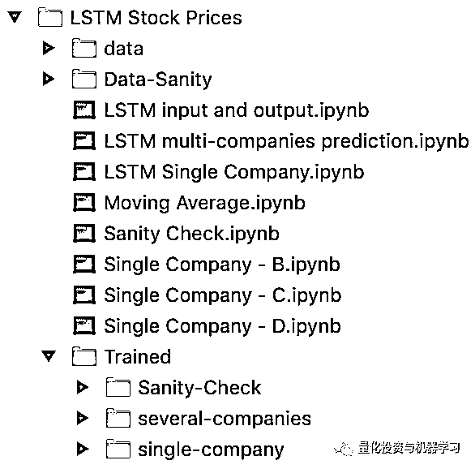

**摘要**

首先，我将使用一些数据可视化工具介绍数据集。然后，我们将大致讨论使用移动平均算法预测股票市场走势有多难并且展示其局限性。接下来，我们将对 RNN 和 LSTM 的做一个简短的介绍，并举一个预测单个公司股价的 LSTM 实例。最后，**我们会展示使用 LSTM 同时预测四个公司的股价，并且比较结果以探究是否预测效果会随着我们预测股价的公司个数的增加而提升。**

**数据可视化**

本文使用的数据集是以 CSV 格式从雅虎财经下载下来的，其中包括四个公司从 2010 年 1 月 8 日到 2019 年 1 月 7 日的股价。我们将这四个公司分别称为 A,B,C 和 D.

基础步骤是用 Pandas 打开这个 CSV 文件。我们先看一下这些数据：

```py
df_A = pd.read_csv(‘data/company_A.csv’)
df_A[‘Date’] = pd.to_datetime(df_A[‘Date’])
df_A.head()
```

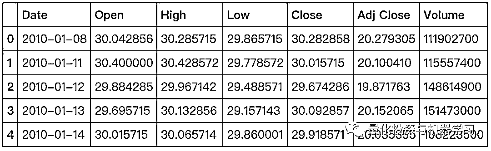

```py
plt.figure(figsize = (15,10))
plt.plot(df_A['Date'], df_A['Close'], label='Company A')
plt.plot(df_B['Date'], df_B['Close'], label='Company B')
plt.plot(df_C['Date'], df_C['Close'], label='Company C')
plt.plot(df_D['Date'], df_D['Close'], label='Company D')
plt.legend(loc='best')
plt.show()
```

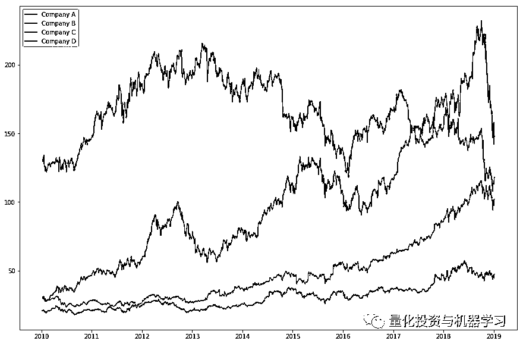

四个公司的收盘价

**移动平均**

用于股价预测的一个经典算法是移动平均值（MA）。这个方法主要在于计算过去“m”个观察日的平均值，并且使用此结果作为下一日的预测值。作为举例，使用过去 10 天和 20 天的收盘价计算移动平均值。

```py
df['MA_window_10'] = df['Close'].rolling(10).mean().shift() 
df['MA_window_20'] = df['Close'].rolling(20).mean().shift()
```

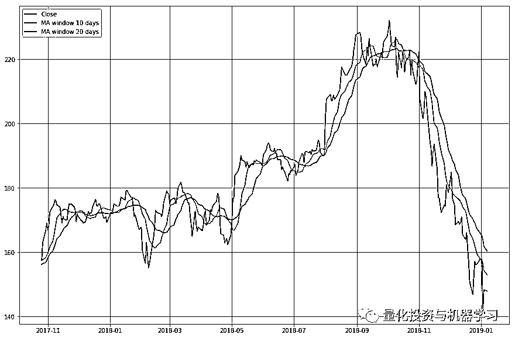

当我们尝试使用移动平均值对未来 10 天股票的收盘价进行预测时，结果如下：

**获取全部代码，见文末**

```py
window_size = 10
forward_days = 10 # > 1, ou seja, 2,3,4,5,...
for index in range(window_size, len(df), forward_days):
    for i in range(0,forward_days):
        if index+i >= len(df):
            break
        window_close = make_window(window_size-i, index+i-window_size)
        #print(window_close)
        window_MA = make_window(i, index)
        #print(window_MA)
        mean = pd.concat([ df['Close'].iloc[window_close], df['MA_window_10_forward_10'].iloc[window_MA] ]).mean(axis=0)
        df.iat[index+i, df.columns.get_loc('MA_window_10_forward_10')] = mean

plt.figure(figsize = (15,10))

size = len(df)-limit - (len(df)-limit)%forward_days

for index in range(size, len(df), forward_days):
    plt.plot(df['MA_window_10_forward_10'][index:index+forward_days], color='r')

plt.plot(df['Close'][-limit:], color='b', label='Close')
#plt.legend(loc='best')
plt.show()
```

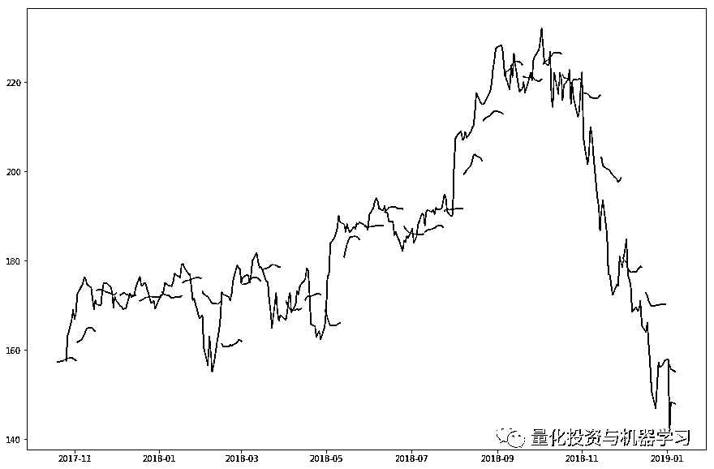

使用移动平均对公司*A*股票的十日收盘价预测

注意每条红线代表一个基于过去十天数据的 10 日股价预测。因此，红线是不连续的。

使用一个稍微更好一点的算法，指数移动平均（EMA），我们可以对预测实现一点点改善：

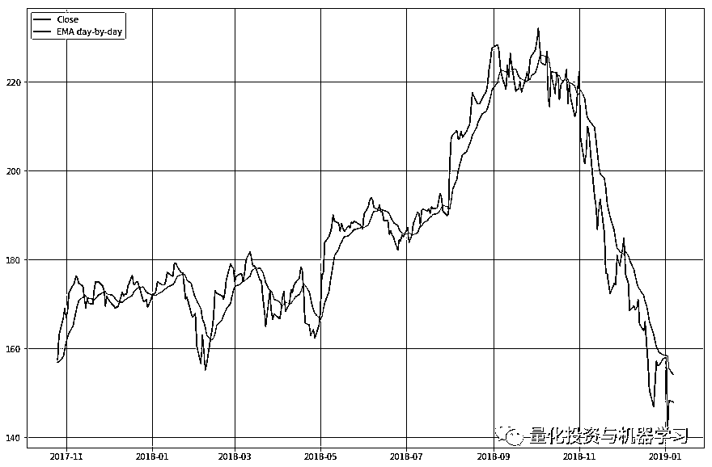

 使用指数移动平均对公司*A*股票收盘价进行提前一天预测结果

对比 MA 和 EMA：

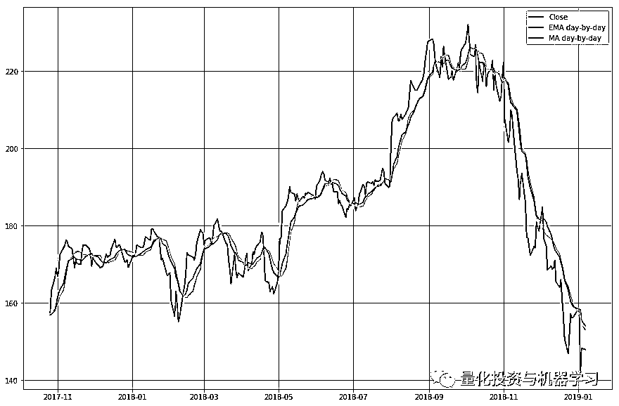

提前一天使用移动平均和指数移动平均对股票收盘价进行预测结果对比

**这个方法过于简单。**我们真正想要的是提前“n”天预测未来的走势，这个任务 MA 和 EMA 都无法做到。

****RNN****

要理解 LSTM 网络，我们首先需要理解 RNN。这种网络被用于过去结果对目前结果有影响时的模式识别。时间序列函数是 RNN 的一个运用实例。在这个函数中，数据顺序极其重要。 

在这个网络架构中，神经元不仅使用普通的输入（即前一层的输出），也使用它之前的状态作为输入。

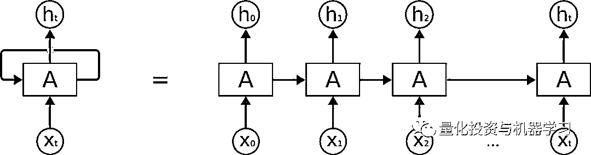

RNN 结构

需要注意的是，“H”代表神经元的状态。因此，在状态 H1,神经元使用参数 X1 和 H0（它之前的状态）作为输入。这个模型的主要问题是记忆的损失。之前的网络状态将会被更快地遗忘。在我们需要记忆前序信息之前的信息的序列中，RNN 无法记忆。

**LSTM**

LSTM 源于 RNN，但是它能够通过改变神经元架构解决记忆的损失。

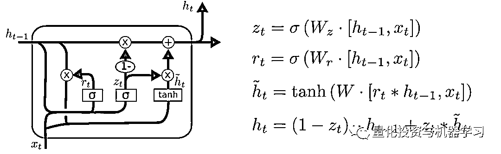

LSTM 结构

新的神经元有三个门，每一个有不同的功能。这些门分别是：

*   输入门

*   输出门

*   遗忘门

每个 LSTM 神经元依然将它之前的状态作为输入：

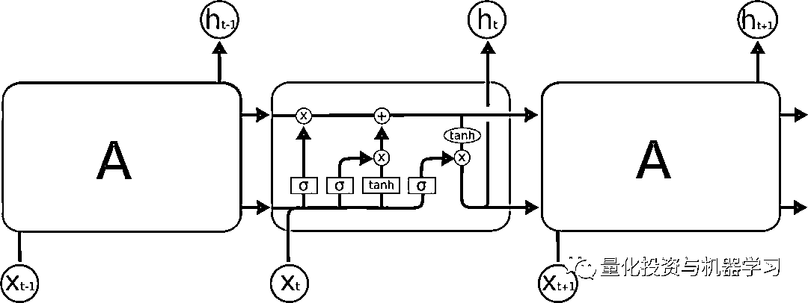

LSTM 神经元让它之前状态的参数通过

****使用****LSTM****预测单个公司股价****

最后，让我们使用一个 LSTM 来预测公司 A 单个公司股价的走势。 

首先来看以下这些参数。我们想要利用 m 日过去的数据（look_back）对未来 n 天（forward_days）的股价进行预测。所以，如果我们有 m 天过去数据的输入值，这个网络的输出值会是之后 n 天股价的预测值。我们将数据集划分为训练集和测试集。训练集将由 k 个周期组成（num_periods），每个周期中有一系列的 n 日预测。

```py
look_back = 40
forward_days = 10
num_periods = 20
```

现在，让我们用 Pandas 打开这个 CSV 文件并且只保留我们会用到的日期和收盘价两列。公司 A 初始的收盘价作图如下：

```py
plt.figure(figsize = (15,10))
plt.plot(df)
plt.show()
```

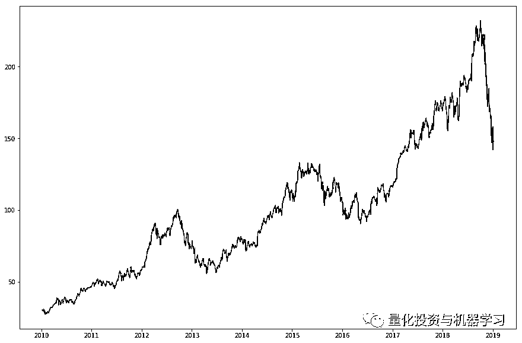

我们依次衡量输入值的比例，将数据划分成训练集/验证集和测试集，并进行格式化来反馈给模型。**详细过程可以在文末代码上找到**。

现在，我们建立并训练这个模型。

**获取全部代码，见文末**

```py
NUM_NEURONS_FirstLayer = 128
NUM_NEURONS_SecondLayer = 64
EPOCHS = 220
#Build the model
model = Sequential()
model.add(LSTM(NUM_NEURONS_FirstLayer,input_shape=(look_back,1), return_sequences=True))
model.add(LSTM(NUM_NEURONS_SecondLayer,input_shape=(NUM_NEURONS_FirstLayer,1)))
model.add(Dense(foward_days))
model.compile(loss='mean_squared_error', optimizer='adam')
history = model.fit(X_train,y_train,epochs=EPOCHS,validation_data=(X_validate,y_validate),shuffle=True,batch_size=2, verbose=2)
```

结果得到：

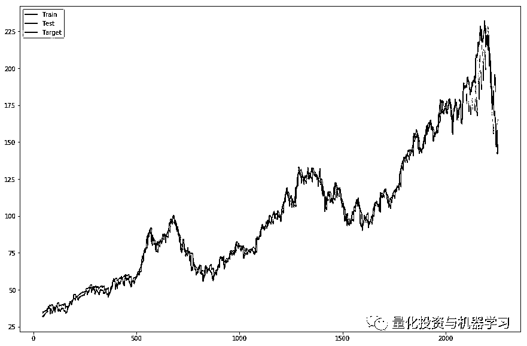

看看测试集：

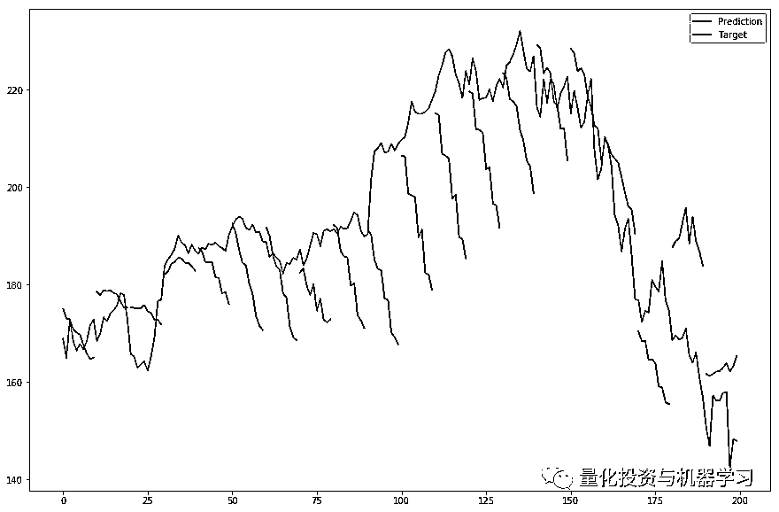

注意每条红线代表基于过去 40 天的十日预测。我们选择在 20 个周期上测试，因而有 20 根红线。这就是为什么红色的预测线不连续。

通过对所有公司重复以上相同的流程，测试集的最好结果出现在对公司 C 的预测。

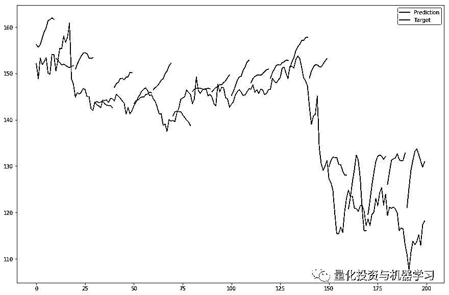

尽管这是这之间最好的模型，结果还远远不够优秀。可能导致这个结果的理由有很多，其中的一些可能是：

*   **仅仅用收盘价历史数据不足以预测股价走势**

*   **这个模型还能被进一步改善**

****使用****LSTM****预测四个公司的股价****

最后，我们将用 LSTM 模型来一起预测所有四个公司的股价走势，并将结果与 LSTM 预测单个公司的结果进行对比。目标是分析是否使用来自几个不同公司的数据能够提高对个个公司股价的预测。 

需要指出的是，所有四个 CSV 文件有相同的日期。这样以来，网络不会从一家公司接收未来讯息来预测另一家公司的价值。

在数据正则化并格式化，反馈给模型之后，这个模型被训练：

```py
NUM_NEURONS_FirstLayer = 100
NUM_NEURONS_SecondLayer = 50
EPOCHS = 200
#Build the model
model = Sequential()
model.add(LSTM(NUM_NEURONS_FirstLayer,input_shape=(look_back,num_companies), return_sequences=True))
model.add(LSTM(NUM_NEURONS_SecondLayer,input_shape=(NUM_NEURONS_FirstLayer,1)))
model.add(Dense(foward_days * num_companies))
model.compile(loss='mean_squared_error', optimizer='adam')
history = model.fit(X_train,y_train,epochs=EPOCHS,validation_data=(X_validate,y_validate),shuffle=True,batch_size=1, verbose=2)
```

结果：

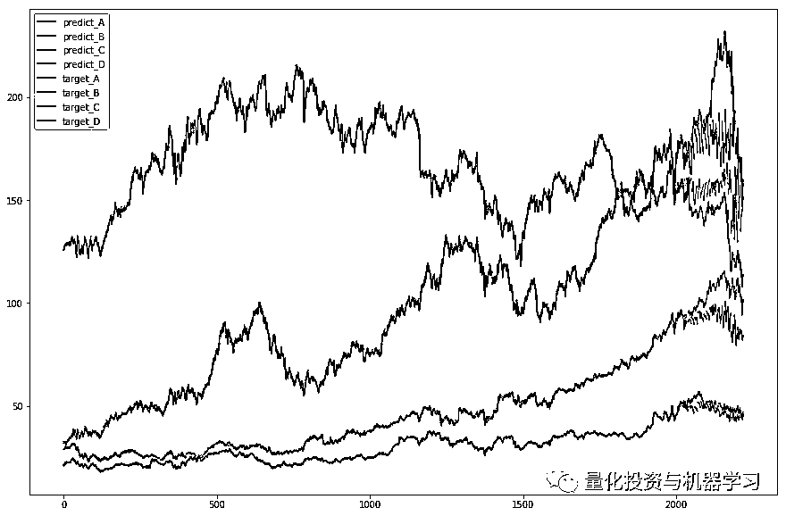

仔细看测试集：

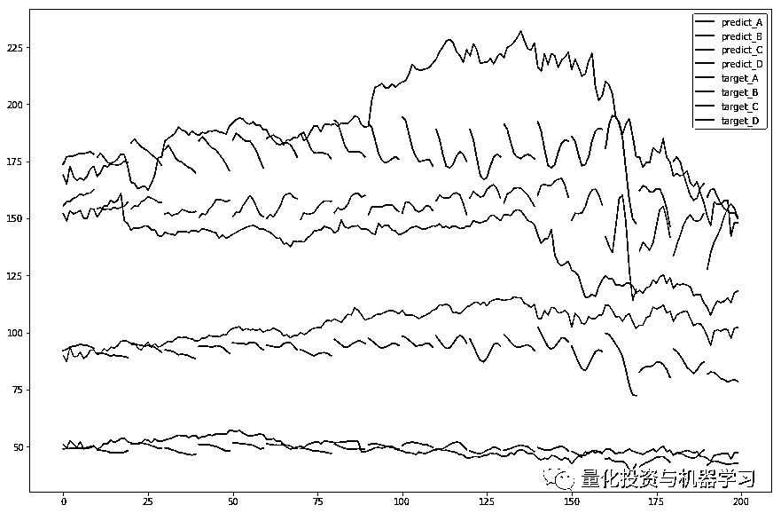

到了比较结果的时候了。单个公司 LSTM 模型的结果放在左边，四个公司 LSTM 模型的结果放右边遍。第一条线展示的是测试集中的预测，第二条线是所有数据集的预测。

**公司 A**

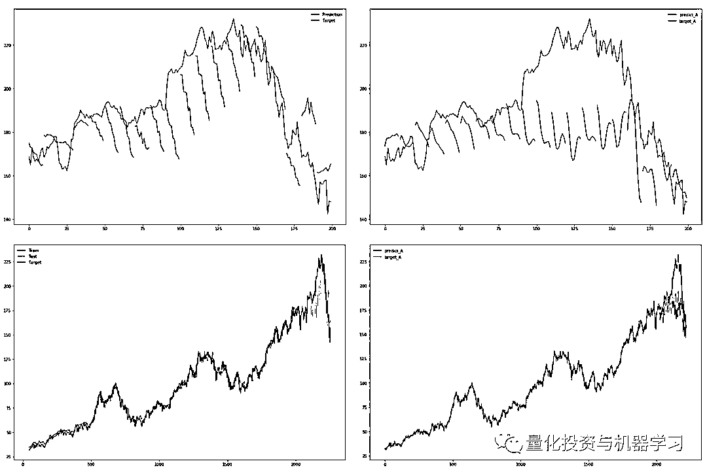   

**公司 B**

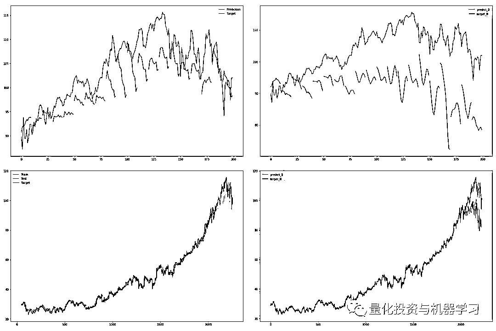

**公司 C**


**公司 D**

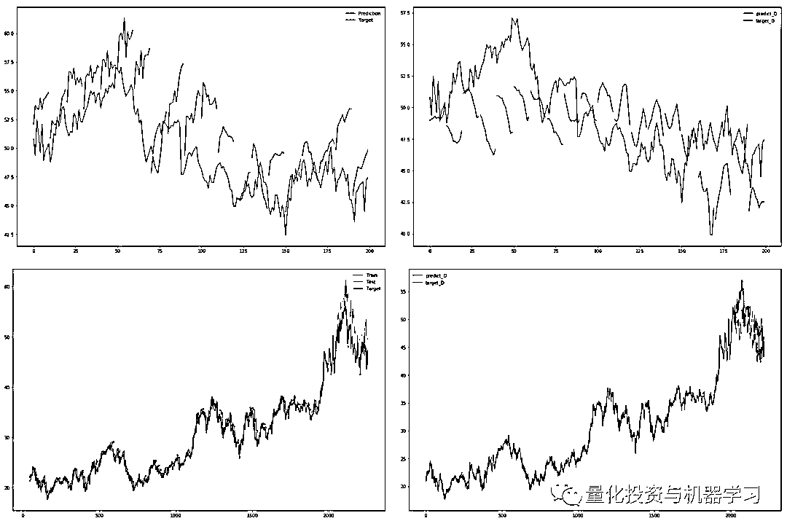

**总结**

**仅仅使用股票的历史价格预测证券市场的走势是不可能的。LSTM 预测仍然令人不合意。****甚至当利用多个公司的历史股价预测时，预测结果更加糟糕。**

*The original：https://medium.com/infosimples/predicting-stock-prices-with-lstm-349f5a0974d4*

**参考资料**

[1] https://www.datacamp.com/community/tutorials/lstm-python-stock- market 

[2] http://colah.github.io/posts/2015-08-Understanding-LSTMs/ 

[3] https://towardsdatascience.com/train-validation-and-test-sets- 72cb40cba9e7 

[4] https://machinelearningmastery.com/diagnose-over12tting-under12tting- lstm-models/ 

[5] https://machinelearningmastery.com/reshape-input-data-long-short- term-memory-networks-keras/ 

**推荐阅读**

[01、经过多年交易之后你应该学到的东西（深度分享）](https://mp.weixin.qq.com/s?__biz=MzAxNTc0Mjg0Mg==&mid=2653289074&idx=1&sn=e859d363eef9249236244466a1af41b6&chksm=802e3867b759b1717f77e07a51ee5671e8115130c66562577280ba1243cba08218add04f1f00&token=449379994&lang=zh_CN&scene=21#wechat_redirect)

[02、监督学习标签在股市中的应用（代码+书籍）](https://mp.weixin.qq.com/s?__biz=MzAxNTc0Mjg0Mg==&mid=2653289050&idx=1&sn=60043a5c95b877dd329a5fd150ddacc4&chksm=802e384fb759b1598e500087374772059aa21b31ae104b3dca04331cf4b63a233c5e04c1945a&token=449379994&lang=zh_CN&scene=21#wechat_redirect)

[03、全球投行顶尖机器学习团队全面分析](https://mp.weixin.qq.com/s?__biz=MzAxNTc0Mjg0Mg==&mid=2653289018&idx=1&sn=8c411f676c2c0d92b0dd218f041bee4b&chksm=802e382fb759b139ffebf633ac14cdd0f21938e4613fe632d5d9231dab3d2aca95a11628378a&token=449379994&lang=zh_CN&scene=21#wechat_redirect)

[04、使用 Tensorflow 预测股票市场变动](https://mp.weixin.qq.com/s?__biz=MzAxNTc0Mjg0Mg==&mid=2653289014&idx=1&sn=3762d405e332c599a21b48a7dc4df587&chksm=802e3823b759b135928d55044c2729aea9690f86752b680eb973d1a376dc53cfa18287d0060b&token=449379994&lang=zh_CN&scene=21#wechat_redirect)

[05、使用 LSTM 预测股票市场基于 Tensorflow](https://mp.weixin.qq.com/s?__biz=MzAxNTc0Mjg0Mg==&mid=2653289238&idx=1&sn=3144f5792f84455dd53c27a78e8a316c&chksm=802e3903b759b015da88acde4fcbc8547ab3e6acbb5a0897404bbefe1d8a414265d5d5766ee4&token=2020206794&lang=zh_CN&scene=21#wechat_redirect)

[06、美丽的回测——教你定量计算过拟合概率](https://mp.weixin.qq.com/s?__biz=MzAxNTc0Mjg0Mg==&mid=2653289314&idx=1&sn=87c5a12b23a875966db7be50d11f09cd&chksm=802e3977b759b061675d1988168c1fec06c602e8583fbcc9b76f87008e0c10b702acc85467a0&token=1972390229&lang=zh_CN&scene=21#wechat_redirect)

[07、利用动态深度学习预测金融时间序列基于 Python](https://mp.weixin.qq.com/s?__biz=MzAxNTc0Mjg0Mg==&mid=2653289347&idx=1&sn=bf5d7899bc4a854d4ba9046fdc6fe0d6&chksm=802e3996b759b080287213840987bb0a0c02e4e1d4d7aae23f10a225a92ef6dd922d8006123d&token=290397496&lang=zh_CN&scene=21#wechat_redirect)

[08、Facebook 开源神器 Prophet 预测时间序列基于 Python](https://mp.weixin.qq.com/s?__biz=MzAxNTc0Mjg0Mg==&mid=2653289394&idx=1&sn=24a836136d730aa268605628e683d629&chksm=802e39a7b759b0b1dcf7aaa560699130a907716b71fc9c45ff0e5d236c5ae8ef80ebdb09dbb6&token=290397496&lang=zh_CN&scene=21#wechat_redirect)

[09、Facebook 开源神器 Prophet 预测股市行情基于 Python](https://mp.weixin.qq.com/s?__biz=MzAxNTc0Mjg0Mg==&mid=2653289437&idx=1&sn=f0dca7da8e69e7ba736992cb3d034ce7&chksm=802e39c8b759b0de5bce401c580623d0729ecca69d13926479d36e19aff8c9c9e8a20265afff&token=290397496&lang=zh_CN&scene=21#wechat_redirect)

[10、2018 第三季度最受欢迎的券商金工研报前 50（附下载）](https://mp.weixin.qq.com/s?__biz=MzAxNTc0Mjg0Mg==&mid=2653289358&idx=1&sn=db6e8ab85b08f6e67790ec0e401e586e&chksm=802e399bb759b08d6eec855f9901ea856d0da68c7425cba62791b8948da6ad761a3d88543dad&token=290397496&lang=zh_CN&scene=21#wechat_redirect)

[11、实战交易策略的精髓（公众号深度呈现）](https://mp.weixin.qq.com/s?__biz=MzAxNTc0Mjg0Mg==&mid=2653289447&idx=1&sn=f2948715bf82569a6556d518e56c1f9e&chksm=802e39f2b759b0e4502d1aaac562b87789573b55c76b3c85897d8c9d88dbf9a0b7ee34d86a4e&token=290397496&lang=zh_CN&scene=21#wechat_redirect)

[12、Markowitz 有效边界和投资组合优化基于 Python](https://mp.weixin.qq.com/s?__biz=MzAxNTc0Mjg0Mg==&mid=2653289478&idx=1&sn=f8e01a641be021993d8ef2d84e94a299&chksm=802e3e13b759b7055cf27a280c672371008a5564c97c658eee89ce8481396a28d254836ff9af&token=290397496&lang=zh_CN&scene=21#wechat_redirect)

[13、使用 LSTM 模型预测股价基于 Keras](https://mp.weixin.qq.com/s?__biz=MzAxNTc0Mjg0Mg==&mid=2653289495&idx=1&sn=c4eeaa2e9f9c10995be9ea0c56d29ba7&chksm=802e3e02b759b7148227675c23c403fb9a543b733e3d27fa237b53840e030bf387a473d83e3c&token=1260956004&lang=zh_CN&scene=21#wechat_redirect)

[14、量化金融导论 1：资产收益的程式化介绍基于 Python](https://mp.weixin.qq.com/s?__biz=MzAxNTc0Mjg0Mg==&mid=2653289507&idx=1&sn=f0ca71aa07531bbbdbd33213f0bab89f&chksm=802e3e36b759b720138b3b17a4dd0e198e054b9de29a038fdd50805f824effa55831111ad026&token=1936245282&lang=zh_CN&scene=21#wechat_redirect)

[15、预测股市崩盘基于统计机器学习与神经网络（Python+文档）](https://mp.weixin.qq.com/s?__biz=MzAxNTc0Mjg0Mg==&mid=2653289533&idx=1&sn=4ef964834e84a9995111bb057b0fc5dd&chksm=802e3e28b759b73e0618eb1262c53aa0601fbf5805525a7c7ff40dc3db62c7704496611bdbf1&token=1950551577&lang=zh_CN&scene=21#wechat_redirect)

[16、实现最优投资组合有效前沿基于 Python（附代码）](https://mp.weixin.qq.com/s?__biz=MzAxNTc0Mjg0Mg==&mid=2653289609&idx=1&sn=c7f0b3e47025862d10bb53b6ab88bcda&chksm=802e3e9cb759b78abf6b8b049c59bf18ccfb2ead7580d1f557d36de2292f59dcbd94dcd41910&token=2085008037&lang=zh_CN&scene=21#wechat_redirect)

[17、精心为大家整理了一些超级棒的机器学习资料（附链接）](https://mp.weixin.qq.com/s?__biz=MzAxNTc0Mjg0Mg==&mid=2653289615&idx=1&sn=1cdc89afb997d0c580bf0cef296d946c&chksm=802e3e9ab759b78ce9f0cd152a680d4a413d6c8dcb02a7a296f4091993a7e4137e7520394575&token=2085008037&lang=zh_CN&scene=21#wechat_redirect)

[18、海量 Wind 数据，与全网用户零距离邂逅！](https://mp.weixin.qq.com/s?__biz=MzAxNTc0Mjg0Mg==&mid=2653289623&idx=1&sn=28a3600fd7a72d7be00b066ca0f98244&chksm=802e3e82b759b7943f43a4f6ef4a91e4153fa6b8210de9590235fa8ee66eb9811ce177054dbc&token=1389401983&lang=zh_CN&scene=21#wechat_redirect)

[19、机器学习、深度学习、量化金融、Python 等最新书籍汇总下载](https://mp.weixin.qq.com/s?__biz=MzAxNTc0Mjg0Mg==&mid=2653289640&idx=1&sn=34e94fcbe99052b8e7381ecc48a36dc0&chksm=802e3ebdb759b7ab897cd329a680715b6f8294e63550ddf0c57b9e1320b2b7d1408c6fdca0c7&token=1389401983&lang=zh_CN&scene=21#wechat_redirect)

[20、各大卖方 2019 年 A 股策略报告，都是有故事的人！](https://mp.weixin.qq.com/s?__biz=MzAxNTc0Mjg0Mg==&mid=2653289725&idx=1&sn=4b65cd1fb8331438e4c0b3d0eae6b51f&chksm=802e3ee8b759b7fe1b94e84d54cc23b0ab05853d5cd227812574b350e9fc2cce9e5f1bc6cb7a&token=1389401983&lang=zh_CN&scene=21#wechat_redirect)

**如何获取代码**

在**后台**输入

**20190216**

**后台获取方式介绍**


**扫码关注我们**

