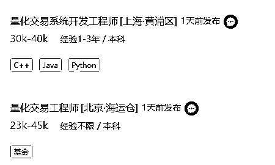
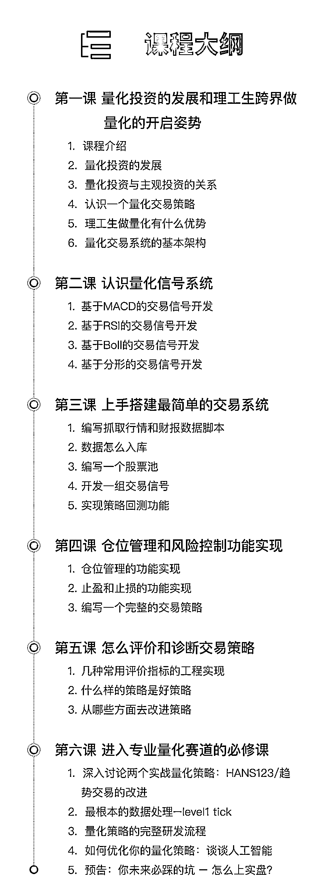

# 普通程序员如何平稳度过资本寒冬？

> 原文：[`mp.weixin.qq.com/s?__biz=MzAxNTc0Mjg0Mg==&mid=2653290619&idx=1&sn=05187981ffcf774b20826011d9348470&chksm=802dc26eb75a4b780aec65d2aeac1b359a2c208481e331a8b227c46fd465c3edd58c502ba6bb&scene=27#wechat_redirect`](http://mp.weixin.qq.com/s?__biz=MzAxNTc0Mjg0Mg==&mid=2653290619&idx=1&sn=05187981ffcf774b20826011d9348470&chksm=802dc26eb75a4b780aec65d2aeac1b359a2c208481e331a8b227c46fd465c3edd58c502ba6bb&scene=27#wechat_redirect)

**标星★公众号**，第一时间获取最新研究

在寒冬面前，有人被迫离职，也有人工资依旧水涨船高。在残酷的大环境面前，程序员面临的危机好像比任何一个行业都要高，如何保住工作？如何稳稳握住手里的既得利益不贬值？ 

身边已经有不少程序员开始关注投资，有的咨询身边的人，有的开始到处听分享会，关注金融动态，加了一堆的金融销售微信，最后却发现：楼盘、股票、黄金、期货……五花八门的投资方向看花了眼也没有挑选到一个适合的投资方向。

对于程序员来说，**如何让自己手中的钱持续增益**是现阶段的一个难题。

**只有适合的投资才能为你带来收益。**

**什么样的投资是适合自己的投资？**

雷军早年做天使投资时有一个原则：只投熟人。

罗杰斯表示，投资的原则只能有一条，那就是：不要做自己不懂的事情。或者说，只做自己懂的事情。

简而言之就是投资自己熟悉的领域，做你熟悉的事情。与其听金融销售们喋喋不休的推销那些云里雾里的投资项目，不如选择自己了解并能驾驭的。

程序员最擅长并且能够驾驭的是什么？用缜密的逻辑思维以代码的形式编写成计算机程序并让它运作起来。对于程序员来说，没有什么比自己用代码编写的计算机程序更安全。

作为以代码为生的程序员，可以考虑**研究量化投资，让自己成为一名宽客。**

无论你擅长哪一种语言，都不要觉得宽客离你很遥远。你可以通过系统的学习让自己成为一名优秀的宽客，从而自如的搭建属于自己的量化系统，制作自己的量化策略；掌握量化策略中的仓位管理和风控；提升自己小金库的含金量

如果你是一名技术新手，也不用担心，学习了量化交易之后，你可以选择成为一名量化交易开发工程师，目前市场上量化交易开发工程师的薪资水平一般在 20-30K。进入金融公司，你还可以最先接触一手金融信息，高薪+理财，人生马上就要到达巅峰啦！

（↑↑某招聘网站量化交易开发工程师薪资信息）

**如果你想成为一名宽客；**

**如果你想成为一名量化交易系统开发工程师；**

**如果你想为自己的未来多做些储备，并确信自己有足够的学习能力；**

**我们建议你来****接受挑战**

## **《初阶！量化交易：策略编写及系统搭建》**

## **第 6 期**

开课时间：**2019 年 2 月 22 日**

主讲老师：汪浩、宋战江、孟康健、刘英斐

这次课程我们邀请到清华大学量化交易主讲老师，通过**12 小时在线直播**，手把手地教你**完整的代码示例****，在线答疑解惑****。**将**4 万小时量化技术实战，上万次量化策略交易实盘**以及老师在现实中遇到的**实盘交易、量化系统实践**浓缩到课程当中，12 小时课程满满的都是干货哦~

课程详情请见如下**<课程大纲>**

祝你早日成为

**IT 圈里的金融家，金融圈里的 IT 工程师**

点击**【阅读原文】**价格有惊喜哦~

👇👇👇