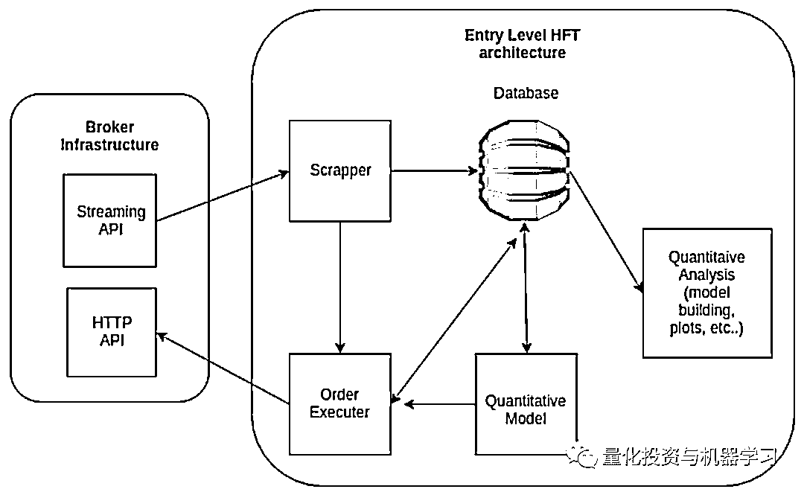

# 独家 | 搭建入门级高频交易系统（架构细节分享）

> 原文：[`mp.weixin.qq.com/s?__biz=MzAxNTc0Mjg0Mg==&mid=2653290615&idx=1&sn=ba1f774031b6dae519f614e7f5cf3141&chksm=802dc262b75a4b74dc3198cc507dbe1e97afc262f4ca4f9e9e122391fb9ebc916b14137c03d1&scene=27#wechat_redirect`](http://mp.weixin.qq.com/s?__biz=MzAxNTc0Mjg0Mg==&mid=2653290615&idx=1&sn=ba1f774031b6dae519f614e7f5cf3141&chksm=802dc262b75a4b74dc3198cc507dbe1e97afc262f4ca4f9e9e122391fb9ebc916b14137c03d1&scene=27#wechat_redirect)

**标星★公众号**，第一时间获取最新研究

本期作者：Gonçalo Abreu

本期编译：1+1=6

**近期原创文章：**

## ♥ [基于无监督学习的期权定价异常检测（代码+数据）](https://mp.weixin.qq.com/s?__biz=MzAxNTc0Mjg0Mg==&mid=2653290562&idx=1&sn=dee61b832e1aa2c062a96bb27621c29d&chksm=802dc257b75a4b41b5623ade23a7de86333bfd3b4299fb69922558b0cbafe4c930b5ef503d89&token=1298662931&lang=zh_CN&scene=21#wechat_redirect)

## ♥ [5 种机器学习算法在预测股价的应用（代码+数据）](https://mp.weixin.qq.com/s?__biz=MzAxNTc0Mjg0Mg==&mid=2653290588&idx=1&sn=1d0409ad212ea8627e5d5cedf61953ac&chksm=802dc249b75a4b5fa245433320a4cc9da1a2cceb22df6fb1a28e5b94ff038319ae4e7ec6941f&token=1298662931&lang=zh_CN&scene=21#wechat_redirect)

## ♥ [深入研读：利用 Twitter 情绪去预测股市](https://mp.weixin.qq.com/s?__biz=MzAxNTc0Mjg0Mg==&mid=2653290402&idx=1&sn=efda9ea106991f4f7ccabcae9d809e00&chksm=802e3db7b759b4a173dc8f2ab5c298ab3146bfd7dd5aca75929c74ecc999a53b195c16f19c71&token=1330520237&lang=zh_CN&scene=21#wechat_redirect)

## ♥ [Two Sigma 用新闻来预测股价走势，带你吊打 Kaggle](https://mp.weixin.qq.com/s?__biz=MzAxNTc0Mjg0Mg==&mid=2653290456&idx=1&sn=b8d2d8febc599742e43ea48e3c249323&chksm=802e3dcdb759b4db9279c689202101b6b154fb118a1c1be12b52e522e1a1d7944858dbd6637e&token=1330520237&lang=zh_CN&scene=21#wechat_redirect)

## ♥ [利用深度学习最新前沿预测股价走势](https://mp.weixin.qq.com/s?__biz=MzAxNTc0Mjg0Mg==&mid=2653290080&idx=1&sn=06c50cefe78a7b24c64c4fdb9739c7f3&chksm=802e3c75b759b563c01495d16a638a56ac7305fc324ee4917fd76c648f670b7f7276826bdaa8&token=770078636&lang=zh_CN&scene=21#wechat_redirect)

## ♥ [一位数据科学 PhD 眼中的算法交易](https://mp.weixin.qq.com/s?__biz=MzAxNTc0Mjg0Mg==&mid=2653290118&idx=1&sn=a261307470cf2f3e458ab4e7dc309179&chksm=802e3c93b759b585e079d3a797f512dfd0427ac02942339f4f1454bd368ba47be21cb52cf969&token=770078636&lang=zh_CN&scene=21#wechat_redirect)

## ♥ [基于 RNN 和 LSTM 的股市预测方法](https://mp.weixin.qq.com/s?__biz=MzAxNTc0Mjg0Mg==&mid=2653290481&idx=1&sn=f7360ea8554cc4f86fcc71315176b093&chksm=802e3de4b759b4f2235a0aeabb6e76b3e101ff09b9a2aa6fa67e6e824fc4274f68f4ae51af95&token=1865137106&lang=zh_CN&scene=21#wechat_redirect)

## ♥ [人工智能『AI』应用算法交易，7 个必踩的坑！](https://mp.weixin.qq.com/s?__biz=MzAxNTc0Mjg0Mg==&mid=2653289974&idx=1&sn=88f87cb64999d9406d7c618350aac35d&chksm=802e3fe3b759b6f5eca6e777364270cbaa0bf35e9a1535255be9751c3a77642676993a861132&token=770078636&lang=zh_CN&scene=21#wechat_redirect)

## ♥ [神经网络在算法交易上的应用系列（一）](https://mp.weixin.qq.com/s?__biz=MzAxNTc0Mjg0Mg==&mid=2653289962&idx=1&sn=5f5aa65ec00ce176501c85c7c106187d&chksm=802e3fffb759b6e9f2d4518f9d3755a68329c8753745333ef9d70ffd04bd088fd7b076318358&token=770078636&lang=zh_CN&scene=21#wechat_redirect)

## ♥ [预测股市 | 如何避免 p-Hacking，为什么你要看涨？](https://mp.weixin.qq.com/s?__biz=MzAxNTc0Mjg0Mg==&mid=2653289820&idx=1&sn=d3fee74ba1daab837433e4ef6b0ab4d9&chksm=802e3f49b759b65f422d20515942d5813aead73231da7d78e9f235bdb42386cf656079e69b8b&token=770078636&lang=zh_CN&scene=21#wechat_redirect)

## ♥ [如何鉴别那些用深度学习预测股价的花哨模型？](https://mp.weixin.qq.com/s?__biz=MzAxNTc0Mjg0Mg==&mid=2653290132&idx=1&sn=cbf1e2a4526e6e9305a6110c17063f46&chksm=802e3c81b759b597d3dd94b8008e150c90087567904a29c0c4b58d7be220a9ece2008956d5db&token=1266110554&lang=zh_CN&scene=21#wechat_redirect)

## ♥ [优化强化学习 Q-learning 算法进行股市交易](https://mp.weixin.qq.com/s?__biz=MzAxNTc0Mjg0Mg==&mid=2653290286&idx=1&sn=882d39a18018733b93c8c8eac385b515&chksm=802e3d3bb759b42d1fc849f96bf02ae87edf2eab01b0beecd9340112c7fb06b95cb2246d2429&token=1330520237&lang=zh_CN&scene=21#wechat_redirect)

**前言**

在过去的几个月里，我们花费了很多时间构建属于自己的入门级高频交易系统。由于我们将学习机器学习应用金融领域已经很长一段时间了，并试图弄清楚其在现实世界中是如何工作的。**互联网上的资源并不多。我们希望告诉你，如果你尝试类似的事情，可能会遇到一些坑。我们将努力用通俗的语言为你讲述深入的问题**，希望你能喜欢。

**问题开始**

**1、高频交易系统的基本原理是什么?**

要建立搭建一个高频交易系统，你必须假设“存在低效率市场”的假设是正确的。因为每个人都在同一时间关注市场，所以会有一群人找出这些低效率（例如使用统计数据），并试图弥补它们。这意味着，等待的时间越长，在纠正这种低效率之前发现它的概率就越低。在不同的时间窗口上存在不同类型的低效率，你所看到的时间框架越小，效率就越低，面临的竞争就更多。

**2、为什么要搭建加密货币高频交易系统?**

在我看来，标准资产市场相当糟糕。为什么？如果你试图作为一个单一获取市场数据你会发现是很困难的（没有人会免费给你，如果他们这样做，我可以向你保证，你将比你更好的人竞争）。大多数加密货币的货币交换“借用”了已经为标准资产市场构建的基础设施，它们的 FIX API 的结构与标准资产市场上的结构完全相同。此外，由于在加密货币交换中存在许多竞争，你将发现您必须为交易这些工具支付的佣金比常规市场上的竞争要激烈得多。例如，你可以找到经纪人，他们会因为你为市场带来流动性而付给你钱。

为什么你需要原始访问市场？这用机器学习的座右铭来回答这个问题：

**垃圾进，垃圾出**

此外，如果你想进行任何类型的量化分析，你必须控制系统上的一切，也就是：你希望在使用的数据聚合平台上完成所有的分析。当你建立一个机器学习模型时你假设他们的预测在一组边界条件下是有效的，你越违反这些条件你的预测就越无效。因此，你拥有的最佳选择是让代理尽可能快地向你发送每笔交易（或订单更改）。

**架构概述**

我之后会解释为什么高频交易系统必须对故障具有巨大的容错度。当发现这一点时，**我们采用了微服务架构**，因为对我们来说，这是**确保多组件系统具有容错性和可扩展性的最佳方法**。可以向你保证，当你进行实时交易时，你的系统将出现无法预料的错误，其中一些错误与第三方相关，例如对代理的分布式拒绝服务（DDOS）攻击等。当使用微服务架构时，当服务失败时，调度程序会尝试立即重新启动服务，这是一个非常优雅的解决方案，当你尝试单独构建此类系统时。

**小贴士：**

分布式拒绝服务（DDoS：Distributed Denial of Service）攻击指借助于客户/服务器技术，将多个计算机联合起来作为攻击平台，对一个或多个目标发动 DDoS 攻击，从而成倍地提高拒绝服务攻击的威力。通常，攻击者使用一个偷窃帐号将 DDoS 主控程序安装在一个计算机上，在一个设定的时间主控程序将与大量代理程序通讯，代理程序已经被安装在网络上的许多计算机上。代理程序收到指令时就发动攻击。利用客户/服务器技术，主控程序能在几秒钟内激活成百上千次代理程序的运行。

**组件简介：**  

*   **数据库：**高密度的时间序列数据库，需要能够处理每天数十万的数据写入（提示：选择一个物联网数据库 marvels)。还需要具有可扩展性，以便能够以不可变的分布式方式执行非常高速的重新采样。

*   **Scrapper：**将新的流数据写入数据库。

*   **量化模型：**当 Alpha 出现时发出信号的量化模型。

*   **订单执行器：**接收量化模型的信号，与市场进行互动。有时市场流动性不强，或者你的策略必须满足某些类型的滑点要求。因此，为了使您的系统不可变，最好有一个微系统试图以最好的方式执行你的头寸，这可以让你节省佣金。例如：不使用市场订单，而尽可能去执行限价订单，这需要一些时间的消耗和根据市场流动性随时的调整。

*   **量化分析：**你必须开发一套工具来建立模型。由于这些数据来自你的基础架构，因此你有更好的方法来确保系统的边界条件。例如，你不能保证在高波动性的市场条件下你能完全进入市场，因此，通过建立基础架构，你可以准确地衡量发生了什么，什么时候发生，并记录下来。

为什么要采用这样的微服务架构？有时你的 Scrapper 会因为代理中断而失败（在高度不稳定的情况下，会有恶意的代理启动 DDOS，使其他人更难进入市场）。我们推断这是一种 DDOS 攻击，但更准确地说，我们称之为代理不可用。这是市场有效时的情况：

具有良好利差的有效市场

由于 broker 不可用，市场效率非常低（注意下一幅图中的 y 轴刻度更大）：

你可以在最后一幅图中看到，在一个小的时间窗口中有巨大的开口。这是因为 broker 不可用。由于算法无法定期下限价单，从而给市场带来稳定和流动性，因此给出了一些较高的市场订单（无论市场条件如何，这些订单都是可以接受的，但不能保证你会得到什么价格），通过消耗现有的限价单来扩大价差。

**更详细的架构概述**

我们将尝试对这个系统做一个更详细的概述，并解释一些设计选择。**我们建议开发服务的应用程序是 Docker。**Docker 提供了非常好的管理工具，如果你想使用类似于 Kubernetes 的集群，那么 Docker 可以让你更轻松地进行部署。

*   **REST API scrapper 服务：**该服务具有一个缓冲区，用于缓冲订单簿的 Websocket API 通过流提供最近的市场事务、报价和订单。它有多个 worker 的原因是为了减少 broker 基础设施的中断（如果 broker 服务器开始出现阻塞，这种情况发生在很长一段时间，那么有多个冗余的 worker 会增加你获得所有消息的机会)。例如，代理服务器可能会开始删除一些连接以保持其工作负载的运行，如果有更多的 worker，那么在已经删除的 worker 重新启动时，至少保留一个连接的可能性更高。你还可以在多个 IP 中运行多个服务，这将带来更多的冗余。

*   **Scrapper 服务：**Scrapper 服务收集发布在 REST API 上的信息，并将其写入数据库。它能够跳过多个 REST 服务，如果检测到错误的行为，就触发其重启。

*   **订单执行服务：**通过执行市场订单或限价订单，从数据库的表中获取执行操作的信号并启动其执行。它还具有跳过多个 REST 服务的能力。

*   **量化算法服****务：**有模型实现，利用数据库收集的数据生成交易信号。

*   **数据库集群：**从市场接收原始数据需要高带宽的数据传输。重新采样这些数据可能会非常密集，因为你需要相同的数据库进行开发和生产，所以确实需要具有高吞吐量。

*   **开发和研究工具：**通过在相同的系统上开发模型，你可以确保在满足必要的边界条件方面有更好的质量。毕竟，它现在是你的数据，你确切地知道花了多长时间来接收和处理它。

**为什么 REST API 和 scrapper 服务是分开的?**

这个决定是基于提高系统的速度，确保系统全天候可靠性。例如当你决定你想打开或关闭一个位置时，你不想不断查询数据库，通过查询 REST API 直接将信息存储在 RAM（降低硬盘开销）你能够获得更高的汇集频率（这也很大程度上取决于你与交易所和所选择的编程语言的距离)。如果 REST 服务由于某种未知的原因失败，你可以重新启动，不会丢失任何正在进行的数据流，同时有足够的时间安全地重新启动它。这与触发交易信号并试图执行交易是不同的。你需要尽快完成交易。

**总结**

在实现这样的架构时，我们遇到了许多瓶颈，同时还试图为我们所做的模型预测获得最佳的边界条件。这是在实现全天候可靠性的同时获得最佳数据的流程。

**推荐阅读**

[01、经过多年交易之后你应该学到的东西（深度分享）](https://mp.weixin.qq.com/s?__biz=MzAxNTc0Mjg0Mg==&mid=2653289074&idx=1&sn=e859d363eef9249236244466a1af41b6&chksm=802e3867b759b1717f77e07a51ee5671e8115130c66562577280ba1243cba08218add04f1f00&token=449379994&lang=zh_CN&scene=21#wechat_redirect)

[02、监督学习标签在股市中的应用（代码+书籍）](https://mp.weixin.qq.com/s?__biz=MzAxNTc0Mjg0Mg==&mid=2653289050&idx=1&sn=60043a5c95b877dd329a5fd150ddacc4&chksm=802e384fb759b1598e500087374772059aa21b31ae104b3dca04331cf4b63a233c5e04c1945a&token=449379994&lang=zh_CN&scene=21#wechat_redirect)

[03、全球投行顶尖机器学习团队全面分析](https://mp.weixin.qq.com/s?__biz=MzAxNTc0Mjg0Mg==&mid=2653289018&idx=1&sn=8c411f676c2c0d92b0dd218f041bee4b&chksm=802e382fb759b139ffebf633ac14cdd0f21938e4613fe632d5d9231dab3d2aca95a11628378a&token=449379994&lang=zh_CN&scene=21#wechat_redirect)

[04、使用 Tensorflow 预测股票市场变动](https://mp.weixin.qq.com/s?__biz=MzAxNTc0Mjg0Mg==&mid=2653289014&idx=1&sn=3762d405e332c599a21b48a7dc4df587&chksm=802e3823b759b135928d55044c2729aea9690f86752b680eb973d1a376dc53cfa18287d0060b&token=449379994&lang=zh_CN&scene=21#wechat_redirect)

[05、使用 LSTM 预测股票市场基于 Tensorflow](https://mp.weixin.qq.com/s?__biz=MzAxNTc0Mjg0Mg==&mid=2653289238&idx=1&sn=3144f5792f84455dd53c27a78e8a316c&chksm=802e3903b759b015da88acde4fcbc8547ab3e6acbb5a0897404bbefe1d8a414265d5d5766ee4&token=2020206794&lang=zh_CN&scene=21#wechat_redirect)

[06、美丽的回测——教你定量计算过拟合概率](https://mp.weixin.qq.com/s?__biz=MzAxNTc0Mjg0Mg==&mid=2653289314&idx=1&sn=87c5a12b23a875966db7be50d11f09cd&chksm=802e3977b759b061675d1988168c1fec06c602e8583fbcc9b76f87008e0c10b702acc85467a0&token=1972390229&lang=zh_CN&scene=21#wechat_redirect)

[07、利用动态深度学习预测金融时间序列基于 Python](https://mp.weixin.qq.com/s?__biz=MzAxNTc0Mjg0Mg==&mid=2653289347&idx=1&sn=bf5d7899bc4a854d4ba9046fdc6fe0d6&chksm=802e3996b759b080287213840987bb0a0c02e4e1d4d7aae23f10a225a92ef6dd922d8006123d&token=290397496&lang=zh_CN&scene=21#wechat_redirect)

[08、Facebook 开源神器 Prophet 预测时间序列基于 Python](https://mp.weixin.qq.com/s?__biz=MzAxNTc0Mjg0Mg==&mid=2653289394&idx=1&sn=24a836136d730aa268605628e683d629&chksm=802e39a7b759b0b1dcf7aaa560699130a907716b71fc9c45ff0e5d236c5ae8ef80ebdb09dbb6&token=290397496&lang=zh_CN&scene=21#wechat_redirect)

[09、Facebook 开源神器 Prophet 预测股市行情基于 Python](https://mp.weixin.qq.com/s?__biz=MzAxNTc0Mjg0Mg==&mid=2653289437&idx=1&sn=f0dca7da8e69e7ba736992cb3d034ce7&chksm=802e39c8b759b0de5bce401c580623d0729ecca69d13926479d36e19aff8c9c9e8a20265afff&token=290397496&lang=zh_CN&scene=21#wechat_redirect)

[10、2018 第三季度最受欢迎的券商金工研报前 50（附下载）](https://mp.weixin.qq.com/s?__biz=MzAxNTc0Mjg0Mg==&mid=2653289358&idx=1&sn=db6e8ab85b08f6e67790ec0e401e586e&chksm=802e399bb759b08d6eec855f9901ea856d0da68c7425cba62791b8948da6ad761a3d88543dad&token=290397496&lang=zh_CN&scene=21#wechat_redirect)

[11、实战交易策略的精髓（公众号深度呈现）](https://mp.weixin.qq.com/s?__biz=MzAxNTc0Mjg0Mg==&mid=2653289447&idx=1&sn=f2948715bf82569a6556d518e56c1f9e&chksm=802e39f2b759b0e4502d1aaac562b87789573b55c76b3c85897d8c9d88dbf9a0b7ee34d86a4e&token=290397496&lang=zh_CN&scene=21#wechat_redirect)

[12、Markowitz 有效边界和投资组合优化基于 Python](https://mp.weixin.qq.com/s?__biz=MzAxNTc0Mjg0Mg==&mid=2653289478&idx=1&sn=f8e01a641be021993d8ef2d84e94a299&chksm=802e3e13b759b7055cf27a280c672371008a5564c97c658eee89ce8481396a28d254836ff9af&token=290397496&lang=zh_CN&scene=21#wechat_redirect)

[13、使用 LSTM 模型预测股价基于 Keras](https://mp.weixin.qq.com/s?__biz=MzAxNTc0Mjg0Mg==&mid=2653289495&idx=1&sn=c4eeaa2e9f9c10995be9ea0c56d29ba7&chksm=802e3e02b759b7148227675c23c403fb9a543b733e3d27fa237b53840e030bf387a473d83e3c&token=1260956004&lang=zh_CN&scene=21#wechat_redirect)

[14、量化金融导论 1：资产收益的程式化介绍基于 Python](https://mp.weixin.qq.com/s?__biz=MzAxNTc0Mjg0Mg==&mid=2653289507&idx=1&sn=f0ca71aa07531bbbdbd33213f0bab89f&chksm=802e3e36b759b720138b3b17a4dd0e198e054b9de29a038fdd50805f824effa55831111ad026&token=1936245282&lang=zh_CN&scene=21#wechat_redirect)

[15、预测股市崩盘基于统计机器学习与神经网络（Python+文档）](https://mp.weixin.qq.com/s?__biz=MzAxNTc0Mjg0Mg==&mid=2653289533&idx=1&sn=4ef964834e84a9995111bb057b0fc5dd&chksm=802e3e28b759b73e0618eb1262c53aa0601fbf5805525a7c7ff40dc3db62c7704496611bdbf1&token=1950551577&lang=zh_CN&scene=21#wechat_redirect)

[16、实现最优投资组合有效前沿基于 Python（附代码）](https://mp.weixin.qq.com/s?__biz=MzAxNTc0Mjg0Mg==&mid=2653289609&idx=1&sn=c7f0b3e47025862d10bb53b6ab88bcda&chksm=802e3e9cb759b78abf6b8b049c59bf18ccfb2ead7580d1f557d36de2292f59dcbd94dcd41910&token=2085008037&lang=zh_CN&scene=21#wechat_redirect)

[17、精心为大家整理了一些超级棒的机器学习资料（附链接）](https://mp.weixin.qq.com/s?__biz=MzAxNTc0Mjg0Mg==&mid=2653289615&idx=1&sn=1cdc89afb997d0c580bf0cef296d946c&chksm=802e3e9ab759b78ce9f0cd152a680d4a413d6c8dcb02a7a296f4091993a7e4137e7520394575&token=2085008037&lang=zh_CN&scene=21#wechat_redirect)

[18、海量 Wind 数据，与全网用户零距离邂逅！](https://mp.weixin.qq.com/s?__biz=MzAxNTc0Mjg0Mg==&mid=2653289623&idx=1&sn=28a3600fd7a72d7be00b066ca0f98244&chksm=802e3e82b759b7943f43a4f6ef4a91e4153fa6b8210de9590235fa8ee66eb9811ce177054dbc&token=1389401983&lang=zh_CN&scene=21#wechat_redirect)

[19、机器学习、深度学习、量化金融、Python 等最新书籍汇总下载](https://mp.weixin.qq.com/s?__biz=MzAxNTc0Mjg0Mg==&mid=2653289640&idx=1&sn=34e94fcbe99052b8e7381ecc48a36dc0&chksm=802e3ebdb759b7ab897cd329a680715b6f8294e63550ddf0c57b9e1320b2b7d1408c6fdca0c7&token=1389401983&lang=zh_CN&scene=21#wechat_redirect)

[20、各大卖方 2019 年 A 股策略报告，都是有故事的人！](https://mp.weixin.qq.com/s?__biz=MzAxNTc0Mjg0Mg==&mid=2653289725&idx=1&sn=4b65cd1fb8331438e4c0b3d0eae6b51f&chksm=802e3ee8b759b7fe1b94e84d54cc23b0ab05853d5cd227812574b350e9fc2cce9e5f1bc6cb7a&token=1389401983&lang=zh_CN&scene=21#wechat_redirect)

**扫码关注我们**

