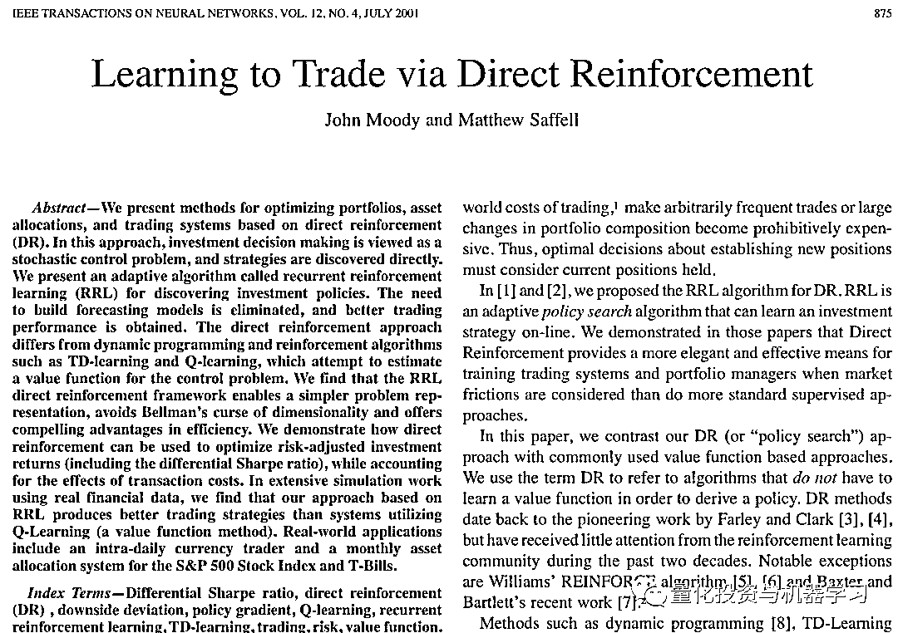
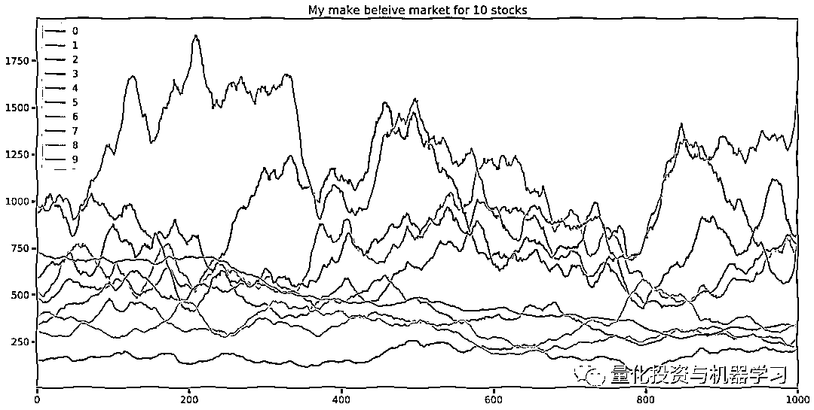
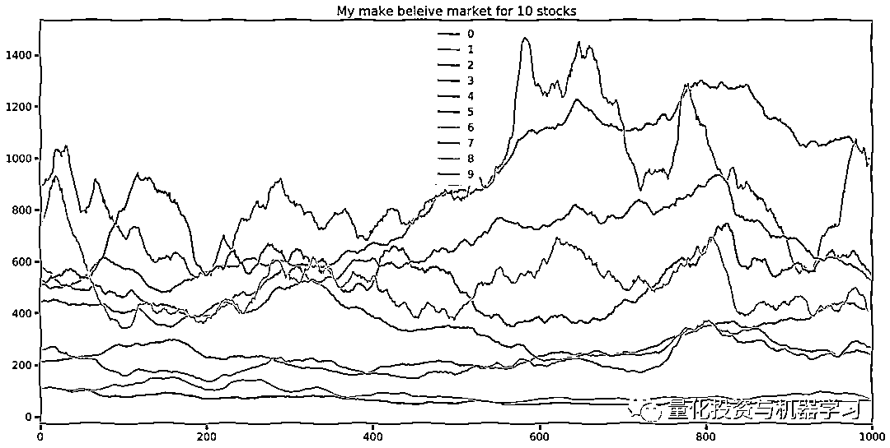
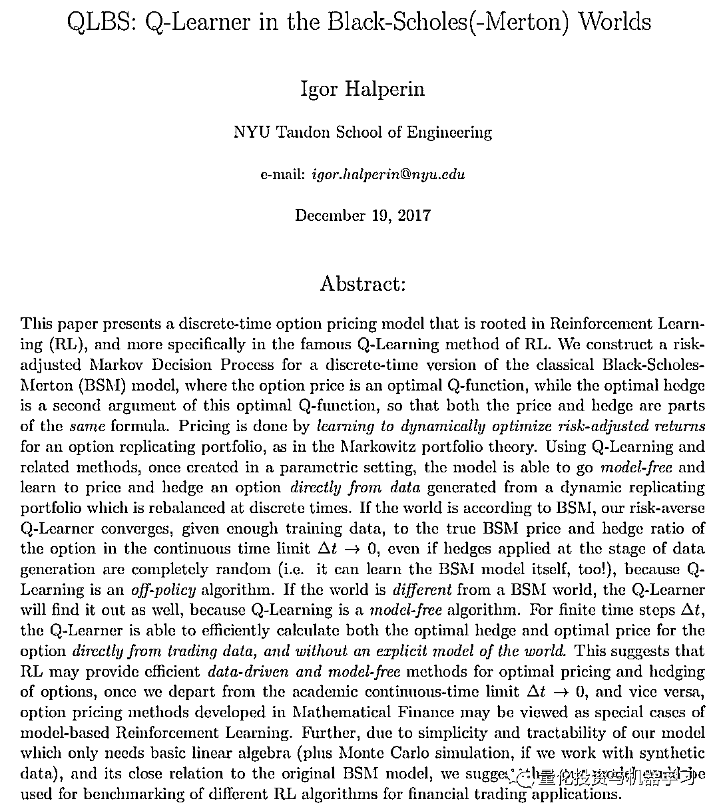
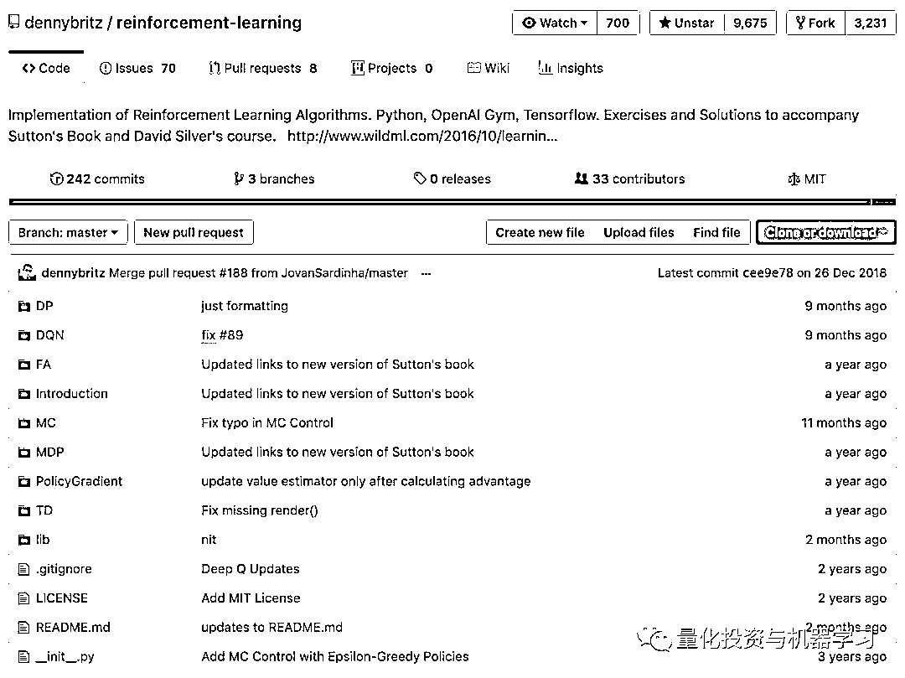
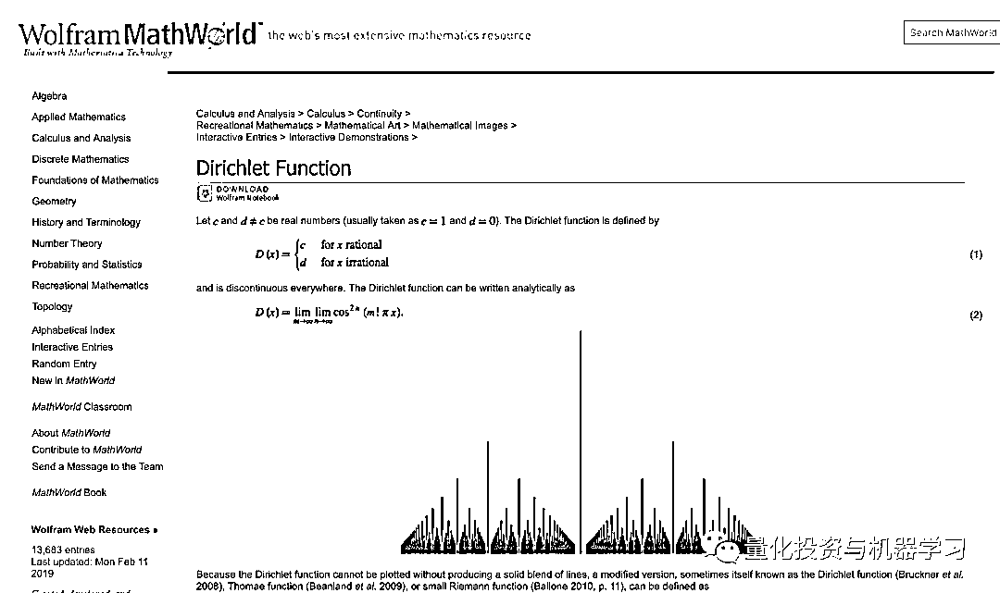
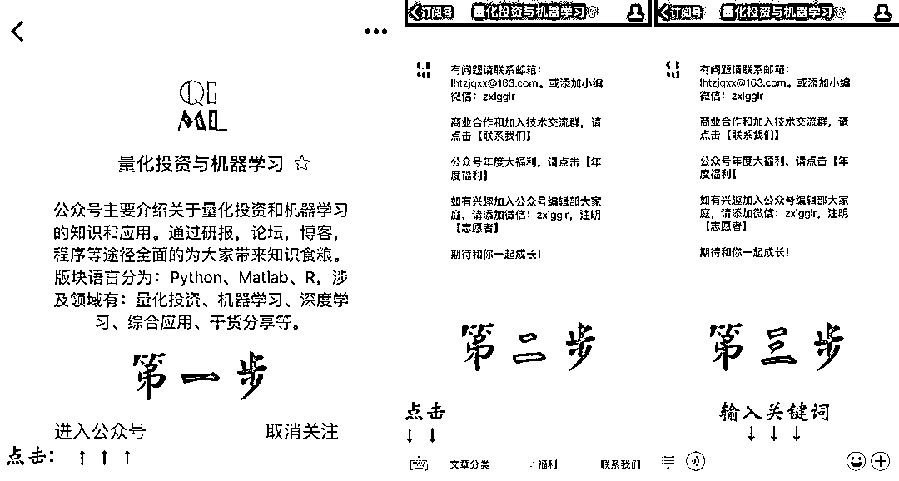

# 深度 | 强化学习应用金融投资组合优化（附代码）

> 原文：[`mp.weixin.qq.com/s?__biz=MzAxNTc0Mjg0Mg==&mid=2653290602&idx=1&sn=27ad2c311de6a8aa3ef0f66117fa1692&chksm=802dc27fb75a4b6900c5f7e049c6892b28eb779d9cd3af42cefddac755b49217a35285f79890&scene=27#wechat_redirect`](http://mp.weixin.qq.com/s?__biz=MzAxNTc0Mjg0Mg==&mid=2653290602&idx=1&sn=27ad2c311de6a8aa3ef0f66117fa1692&chksm=802dc27fb75a4b6900c5f7e049c6892b28eb779d9cd3af42cefddac755b49217a35285f79890&scene=27#wechat_redirect)

**标星★公众号**，第一时间获取最新研究

本期作者：Tal Perry

作者介绍：Nevermore

**近期原创文章：**

## ♥ [基于无监督学习的期权定价异常检测（代码+数据）](https://mp.weixin.qq.com/s?__biz=MzAxNTc0Mjg0Mg==&mid=2653290562&idx=1&sn=dee61b832e1aa2c062a96bb27621c29d&chksm=802dc257b75a4b41b5623ade23a7de86333bfd3b4299fb69922558b0cbafe4c930b5ef503d89&token=1298662931&lang=zh_CN&scene=21#wechat_redirect)

## ♥ [5 种机器学习算法在预测股价的应用（代码+数据）](https://mp.weixin.qq.com/s?__biz=MzAxNTc0Mjg0Mg==&mid=2653290588&idx=1&sn=1d0409ad212ea8627e5d5cedf61953ac&chksm=802dc249b75a4b5fa245433320a4cc9da1a2cceb22df6fb1a28e5b94ff038319ae4e7ec6941f&token=1298662931&lang=zh_CN&scene=21#wechat_redirect)

## ♥ [深入研读：利用 Twitter 情绪去预测股市](https://mp.weixin.qq.com/s?__biz=MzAxNTc0Mjg0Mg==&mid=2653290402&idx=1&sn=efda9ea106991f4f7ccabcae9d809e00&chksm=802e3db7b759b4a173dc8f2ab5c298ab3146bfd7dd5aca75929c74ecc999a53b195c16f19c71&token=1330520237&lang=zh_CN&scene=21#wechat_redirect)

## ♥ [Two Sigma 用新闻来预测股价走势，带你吊打 Kaggle](https://mp.weixin.qq.com/s?__biz=MzAxNTc0Mjg0Mg==&mid=2653290456&idx=1&sn=b8d2d8febc599742e43ea48e3c249323&chksm=802e3dcdb759b4db9279c689202101b6b154fb118a1c1be12b52e522e1a1d7944858dbd6637e&token=1330520237&lang=zh_CN&scene=21#wechat_redirect)

## ♥ [利用深度学习最新前沿预测股价走势](https://mp.weixin.qq.com/s?__biz=MzAxNTc0Mjg0Mg==&mid=2653290080&idx=1&sn=06c50cefe78a7b24c64c4fdb9739c7f3&chksm=802e3c75b759b563c01495d16a638a56ac7305fc324ee4917fd76c648f670b7f7276826bdaa8&token=770078636&lang=zh_CN&scene=21#wechat_redirect)

## ♥ [一位数据科学 PhD 眼中的算法交易](https://mp.weixin.qq.com/s?__biz=MzAxNTc0Mjg0Mg==&mid=2653290118&idx=1&sn=a261307470cf2f3e458ab4e7dc309179&chksm=802e3c93b759b585e079d3a797f512dfd0427ac02942339f4f1454bd368ba47be21cb52cf969&token=770078636&lang=zh_CN&scene=21#wechat_redirect)

## ♥ [基于 RNN 和 LSTM 的股市预测方法](https://mp.weixin.qq.com/s?__biz=MzAxNTc0Mjg0Mg==&mid=2653290481&idx=1&sn=f7360ea8554cc4f86fcc71315176b093&chksm=802e3de4b759b4f2235a0aeabb6e76b3e101ff09b9a2aa6fa67e6e824fc4274f68f4ae51af95&token=1865137106&lang=zh_CN&scene=21#wechat_redirect)

## ♥ [人工智能『AI』应用算法交易，7 个必踩的坑！](https://mp.weixin.qq.com/s?__biz=MzAxNTc0Mjg0Mg==&mid=2653289974&idx=1&sn=88f87cb64999d9406d7c618350aac35d&chksm=802e3fe3b759b6f5eca6e777364270cbaa0bf35e9a1535255be9751c3a77642676993a861132&token=770078636&lang=zh_CN&scene=21#wechat_redirect)

## ♥ [神经网络在算法交易上的应用系列（一）](https://mp.weixin.qq.com/s?__biz=MzAxNTc0Mjg0Mg==&mid=2653289962&idx=1&sn=5f5aa65ec00ce176501c85c7c106187d&chksm=802e3fffb759b6e9f2d4518f9d3755a68329c8753745333ef9d70ffd04bd088fd7b076318358&token=770078636&lang=zh_CN&scene=21#wechat_redirect)

## ♥ [预测股市 | 如何避免 p-Hacking，为什么你要看涨？](https://mp.weixin.qq.com/s?__biz=MzAxNTc0Mjg0Mg==&mid=2653289820&idx=1&sn=d3fee74ba1daab837433e4ef6b0ab4d9&chksm=802e3f49b759b65f422d20515942d5813aead73231da7d78e9f235bdb42386cf656079e69b8b&token=770078636&lang=zh_CN&scene=21#wechat_redirect)

## ♥ [如何鉴别那些用深度学习预测股价的花哨模型？](https://mp.weixin.qq.com/s?__biz=MzAxNTc0Mjg0Mg==&mid=2653290132&idx=1&sn=cbf1e2a4526e6e9305a6110c17063f46&chksm=802e3c81b759b597d3dd94b8008e150c90087567904a29c0c4b58d7be220a9ece2008956d5db&token=1266110554&lang=zh_CN&scene=21#wechat_redirect)

## ♥ [优化强化学习 Q-learning 算法进行股市交易](https://mp.weixin.qq.com/s?__biz=MzAxNTc0Mjg0Mg==&mid=2653290286&idx=1&sn=882d39a18018733b93c8c8eac385b515&chksm=802e3d3bb759b42d1fc849f96bf02ae87edf2eab01b0beecd9340112c7fb06b95cb2246d2429&token=1330520237&lang=zh_CN&scene=21#wechat_redirect)

**代码与论文全部打包，请在文末下载**

**前言**

首先我们要声明。我们本着分享的精神把所有内容进行分享，并希望大家能从中学习。

#### *Everything here is probably wrong, and you should trust none of it*

**我想要 Agent 做什么**

我们建立一个观察 N 只股票的 Agent，并在每一阶段根据决策分配给每只股票一定比例的资金。我们希望 Agent 能够在符合股票市场真实场景假设下做到这一点，例如：有（实质性的）交易成本，股票不遵循标准正态分布等。我们不知道其他的市场参与者所拥有信息的多少等（换句话说，Agent 可以处理 POMDP 模型中尽可能多的 PO）。

**互联网上很难找到有关金融方面强化学习的资料。很多资料都是非常琐碎的。更好的材料来自于学术界**，（我们被很多论文的启发，但是这一篇我觉得比其他的都要好）。

*http://citeseerx.ist.psu.edu/viewdoc/download?doi=10.1.1.1.7210&rep=rep1&type=pdf*



为了理解一篇关于应用强化学习构建最优投资组合的论文，**你需要有足够的知识来知道什么是最优投资组合和全面的强化学习知识**，用来理解作者是如何使用这种技术的。**最好是试图将这两个不同领域（金融和计算机）的知识结合起来。**

我们希望很通俗的去解释这些问题，但是如果你有一些 RL 和金融的概念，可能会更容易理解。我们会试用通俗的语言解释高大上的问题，但是**强化学习是核心**。

**数据**

金融数据是需要花钱购买的。为了满足我们的好奇心，我们先决定自己生成模拟数据。这样可以更好地控制问题的难易程度，然后从简单的情况入手，最后慢慢深入问题。 

我们写了一个能够模拟股票市场的 magic 函数。生成 10 只股票数据。

**获取全部代码，见文末**

```py
%load_ext autoreload
%autoreload 2
cd ../acfl/

from env.Env import Env
from env.priceGenerator import make_stock
from learners.a2c import PolicyEstimator,ValueEstimator, reinforce
import tensorflow as tf

def sin_func(num_stocks,length):
    a = np.array(range(length+1))
    a.shape= [length+1,1]
    a = a/(2*np.pi)
    a = np.sin(a)
    return a+5.0001

D = pd.DataFrame(make_stock(1000,10)*np.random.uniform(2,4,10))
plt.xkcd()
D.plot(figsize=(20,10),title='My make beleive market for 10 stocks')
```



我们认为这个市场比实际市场更容易设计，一些股票显然是相关的，并且有足够强的自相关性。这是经过设计的，最终将模拟更加复杂的市场，但最好先看看算法，可以先学到一些基本的思路，以便让你相信和理解这样一个 magic 函数，下面是模拟生成的另一个市场。



这是生成这些模拟股票的代码： 

**获取全部代码，见文末**

```py
import numpy as np
def make_stock(length=100, num_stocks=2):
    alpha = 0.9
    k = 2
    cov = np.random.normal(0, 5, [num_stocks, num_stocks])
    cov = cov.dot(cov.T) # This is a positive semidefinite matrix, e.g. a covariance matrix
    A = np.random.multivariate_normal(np.zeros(num_stocks), cov, size=[length]) # sample noise, with covariance 
    B = np.random.multivariate_normal(np.zeros(num_stocks), cov, size=[length]) # sample another noise, with covariance
    bs = [np.zeros(shape=num_stocks)] # 
    ps = [np.zeros(shape=num_stocks)] # The prices

    for a, b in zip(A, B):
        bv = alpha * bs[-1] + b # calculate some trend
        bs.append(bv)
        pv = ps[-1] + bs[-2] + k * a # Previosu price + previous trend factor, plus some noise
        ps.append(pv)

    #     ps = [0]
    #     for a,b,common in zip(A,BB,commonNoise):
    #         ps.append(ps[-1]+b+k*a+2*common)
    #     P = np.array(ps)
    #     P = np.exp(P/(P.max()-P.min()))
    ps = np.array(ps).T # reshape it so that its [length,stocks] 
    R = ps.max(1) - ps.min(1) # Scale factor
    prices = np.exp(ps.T / (R)) *np.random.uniform(10,250,num_stocks) # Normalize, exponantiate then make the prices more varied
    return prices
```

**我们最开始只使用了正弦波来看看否可以让模型进行强化学习。**一旦程序能够运行了，就会继续注入一点噪音。这个思想是非常有价值的，**这样操作会更容易在一个简单确定的环境中找到 bug，然后再从更复杂的加上随机数学的代码寻找类似的 bug。**

**建立 RL 环境**

强化学习是关于一个 Agent 与环境之间进行的互动，就像詹姆斯邦德加入绿色和平组织一样。这是一种奇特的说法，即环境告诉 Agent 外部世界现在的状态是什么，Agent 说要做什么，然后 Agent 获得一份奖励，并利用它来改进。

建立环境可以让你扮演上帝的角色，从而让你意识到这个世界为什么如此混乱。要把一切都弄好是很难的，很容易在这种环境中犯下小错误从而毁掉一切的，并且这种小错误一般很难找到。

总之，在我们扮演上帝的角色中，模拟了如下的世界：环境告诉 Agent 每种股票的当前价格价格、一定回测期的历史价格和当前的投资组合。Agent 反馈它想要加入更新的新投资组合。

然后环境在时间上进入下一节点，通过买卖构造出 Agent 所提出的投资组合，并考虑交易成本。这其中有些人为操作的思想，因为 Agent 总是处理帐户的百分比，而环境必须将其转换为美元和股票，并需要调整四舍五入、承担交易成本，并由于舍入错误而返还资金（否则我们将得到负的奖励）。

下面的代码，用于构造上述的环境：

**获取全部代码，见文末**

```py
import numpy as np
from collections import  defaultdict

from env.priceGenerator import make_stock

costPerShare = 0 # 0.01
class Env:
    '''
    A simple environemnt for our agent,
    the action our agent gives is  weighting over the stocks + cash
    the env calcutes that into stock and figures out the returns
    '''
    def __init__(self,price_fn,num_stocks=2,length=2,starting_value=1000,lookback=10):
        '''
        :param price_fn:  A function that returns a numpy array of prices
        :param num_stocks: How many stocks in our univerese
        :param length: The length of an episode
        '''
        self.num_stocks = num_stocks
        self.lookback = lookback
        self.length = length
        self.oprices= price_fn(num_stocks=num_stocks,length=length)
        self.prices = np.concatenate([self.oprices,np.ones([length+1,1])],axis=1) #attach the value of cash
        self.portfolio = np.zeros([num_stocks+1]) #2k and 2k+1 are te long and short of a stock. portfolio[-1] is cash
        self.portfolio[-1] = 1
        self.time =0
        self.__account_value = starting_value
        self.__shares=np.array([0]*num_stocks +[starting_value])
        self.hist = defaultdict(list)
 @property
    def shares(self):
        return self.__shares
 @property
    def account_value(self):
        return self.__account_value
 @shares.setter
    def shares(self,new_shares):

        self.__shares = new_shares
        self.hist['shares'].append(self.shares)
 @account_value.setter
    def account_value(self,new_act_val):
        self.__account_value = new_act_val
        try:
            act_returns  = self.account_value / self.hist['act_val'][-1]
        except:
            act_returns =1
        self.hist['act_val'].append(self.account_value)
        self.hist['act_returns'].append(act_returns)

    def step(self,new_portfolio):
        '''
        Get the next prices. Then transition the value of the account into the desired portfolio
        :param new_portfolio:
        :return:
        '''
        self.time +=1

        self.update_acount_value(new_portfolio)
        reward = np.log(self.hist['act_returns'][-1]) #already includes transaction costs
        state = {
            "prices":self.prices[self.time-self.lookback+1:self.time+1,:-1], # All prices upto now inclusive but no cash
            "portfolio":self.portfolio,

        }
        done = self.time >=len(self.prices)-2
        return state,reward,done

    def update_acount_value(self,new_portfolio):
        currentShareValues = self.shares * self.prices[self.time]
        currentAccountValue = sum(currentShareValues)

        currentPortfolioProportions = currentShareValues / currentAccountValue
        desiredCashChange = (new_portfolio -currentPortfolioProportions )* currentAccountValue

        desiredChangeInShares = np.floor(desiredCashChange / self.prices[self.time])
        self.shares = self.shares + desiredChangeInShares
        newAccountValue = np.sum(self.shares*self.prices[self.time])
        #becuse we take the floor, sometimes we lose cash for no reason. This is a fix
        missingCash  = currentAccountValue - newAccountValue
        transactionCost = sum(np.abs(desiredChangeInShares[:-1])*costPerShare)

        self.shares[-1] += missingCash - transactionCost

        transactionCost = sum(np.abs(desiredChangeInShares[:-1])*costPerShare)
        self.hist["changeInShares"].append(desiredChangeInShares)
        self.hist["transactionCosts"].append(transactionCost)

        self.account_value =np.sum(self.shares*self.prices[self.time])
```

**实际学习的东西**

强化学习能分成两种主流的方法，Policy 方法和 Value 方法。其中，Policy 方法决定模型下一步应该做什么，Value 方法确定最好的决策是什么。通常比较流行并且效果较好的方法是将这两者混合起来，并且加上现代的 Actor 批判方法。

我们认为 Value 的估计在金融上的应用是有问题的，除非你设置一个非常聪明的模型来定义收益回报。但是如果你没有深入研究透彻，使用收益或风险调整后的收益作为奖励，那么这是一个非常嘈杂的信号。这就是为什么我们怀疑在这种情况下的 Value 函数。（感兴趣的读者可以阅读 QLBS 论文，该论文用一种 Value 函数进行了完美的实现）

*https://arxiv.org/pdf/1712.04609.pdf*



有趣的是，当我们研究由正弦波产生的价格时，Actor-Critic 方法（近似于状态值）比 pure policy 好得多，但是一旦加入噪音更大的数据，它们似乎只会让事情变得更糟而不是更好。

互联网有很多关于强化学习算法的资料，而 github 上拥有很多算法实现。实际上，这里讨论的代码是在 github 从 Denny Britz 的 repo 中复制的。

*https://github.com/dennybritz/reinforcement-learning*



此外，虽然 RL 背后的想法非常深刻，但他们的应用主要是关于良好的工程设计和使问题的现实适应它们。因此，由于这些原因，本节仍然很短。

**投资组合操作**

我们希望 Agent 的行为是投资组合在 n 只股票和现金上的权重（一共 n+1 个权重）。

互联网上的大多数 RL 资料上都说，当你想要连续动作时需要从高斯分布中采样；如果你想要多重连续动作时（投资组合的权重），那么你需要从多元高斯分布中采样。

高斯分布函数有着各种不满意的属性，他们就像概率分布中的 Kardashians。我们希望为每个股票分配一个权重，介于 0 和 1 之间，且所有权重总和恰好为 1。此时多元高斯分布只能给出- inf 和 inf 之间的数字，没有约束，这是不令人满意的。事实上，更糟糕的是，高斯分布下 softmaxing 的输出将是的 Agent 几乎无法训练。

除此之外，多元高斯分布一般通过各变量及其协方差矩阵的均值进行拟合。要计算这么多的参数，还要编写一些复杂的程序以使深层的输出成为半正定对称矩阵。所以在这两个问题之间，我们宁愿使用一些更具体的方法来解决这个问题。

**讨厌 Dirichlet 函数，喜欢 Dirichlet 分布**

这是因为我么恩在一个关于 Dirichlet 函数的 cal 1 中失败了。

*http://mathworld.wolfram.com/DirichletFunction.html*



幸运的是，有一个更加合适的分布供我们抽样。Dirichlet(K) distribution 是 K-单纯形上的一个分布。N 只股票和现金的投资组合是 N + 1 维空间上的一个点，因此从 Dirichlet（N + 1）分布中抽样就可以得到一个投资组合。

虽然这个函数不是内置于 Tensorflow 中，但它内置于 Tensorflow Propability 中，因此整个实现过程非常简单：

*https://www.tensorflow.org/probability/api_docs/python/tfp/distributions/Dirichlet*

```py
self.alphas= tf.contrib.layers.fully_connected(
          inputs=l2,
          num_outputs=num_stocks+1,
          activation_fn=tf.nn.relu,
          weights_initializer=tf.initializers.glorot_uniform)

      self.alphas +=1

      self.dirichlet  = tfp.distributions.Dirichlet(self.alphas)
      self.action = self.dirichlet._sample_n(1)
      self.action = tf.squeeze(self.action)
```

就这么简单。

**反思**

我们从 Dirichlet 分布中抽样的想法在理论上是非常棒的，但是在实践中则被证明是一无是处的。有两种现象不很很好。

首先，我们在每一步都采样一个新的分布，这意味着我们正在改变位置。这是低效的，但是当你从分布中进行采样时这是不可避免的。更糟糕的是，我们因为调整投资组合获得了负的收益回报（交易成本），但没有机制维持原有的投资组合权重不变。

其次，在每一步采样新的投资组合看起来是愚蠢的。我们认为应该对改变投资组合的决策进行抽样，然后在必要时对投资组合进行抽样。这样可以使用分布的方差（或方差向量的范数）来做出这个决策。

这是我们目前最感兴趣的问题。总之，它在数学上做到了我想要的，但是在实践上却做得一塌糊涂。

**其他问题**

另一个问题是赋予模型的奖励。目前 Reward 只是账户的对数收益（股票价值的变化 - 交易成本）。我们认为在多股票环境中这一方式噪声过多了，但即使在单只股票正弦波的环境中也是一个不好的收益定义。Agent 了解到最简单的赚钱方法是购买市场上涨最大的股票。

同样，可能有很多 bug。我们纯粹是为了好玩而编写了这段代码且没有编写测试，讲真，RL 是一个极其需要测试的领域。每个 bug 都可能很糟糕，因为通常你不知道它是一个错误还是要求比你预期更复杂的系统。它会暴露你每个工程上的坏习惯和不正确的假设。

**未来**

讲真，如果这是一台印钞机，我们就不会把它放在互联网上了。我们认为交易员确实可以寻找合适的应用 RL 取赚钱的途径，但是这一过程中还有很多工作要做，如果你能够执行它，你可能有更好的选择。

然而，我们发现这是非常有趣的。金融领域有很多问题，深度强化学习能让你从有趣的角度看待它们。

**推荐阅读**

[01、经过多年交易之后你应该学到的东西（深度分享）](https://mp.weixin.qq.com/s?__biz=MzAxNTc0Mjg0Mg==&mid=2653289074&idx=1&sn=e859d363eef9249236244466a1af41b6&chksm=802e3867b759b1717f77e07a51ee5671e8115130c66562577280ba1243cba08218add04f1f00&token=449379994&lang=zh_CN&scene=21#wechat_redirect)

[02、监督学习标签在股市中的应用（代码+书籍）](https://mp.weixin.qq.com/s?__biz=MzAxNTc0Mjg0Mg==&mid=2653289050&idx=1&sn=60043a5c95b877dd329a5fd150ddacc4&chksm=802e384fb759b1598e500087374772059aa21b31ae104b3dca04331cf4b63a233c5e04c1945a&token=449379994&lang=zh_CN&scene=21#wechat_redirect)

[03、全球投行顶尖机器学习团队全面分析](https://mp.weixin.qq.com/s?__biz=MzAxNTc0Mjg0Mg==&mid=2653289018&idx=1&sn=8c411f676c2c0d92b0dd218f041bee4b&chksm=802e382fb759b139ffebf633ac14cdd0f21938e4613fe632d5d9231dab3d2aca95a11628378a&token=449379994&lang=zh_CN&scene=21#wechat_redirect)

[04、使用 Tensorflow 预测股票市场变动](https://mp.weixin.qq.com/s?__biz=MzAxNTc0Mjg0Mg==&mid=2653289014&idx=1&sn=3762d405e332c599a21b48a7dc4df587&chksm=802e3823b759b135928d55044c2729aea9690f86752b680eb973d1a376dc53cfa18287d0060b&token=449379994&lang=zh_CN&scene=21#wechat_redirect)

[05、使用 LSTM 预测股票市场基于 Tensorflow](https://mp.weixin.qq.com/s?__biz=MzAxNTc0Mjg0Mg==&mid=2653289238&idx=1&sn=3144f5792f84455dd53c27a78e8a316c&chksm=802e3903b759b015da88acde4fcbc8547ab3e6acbb5a0897404bbefe1d8a414265d5d5766ee4&token=2020206794&lang=zh_CN&scene=21#wechat_redirect)

[06、美丽的回测——教你定量计算过拟合概率](https://mp.weixin.qq.com/s?__biz=MzAxNTc0Mjg0Mg==&mid=2653289314&idx=1&sn=87c5a12b23a875966db7be50d11f09cd&chksm=802e3977b759b061675d1988168c1fec06c602e8583fbcc9b76f87008e0c10b702acc85467a0&token=1972390229&lang=zh_CN&scene=21#wechat_redirect)

[07、利用动态深度学习预测金融时间序列基于 Python](https://mp.weixin.qq.com/s?__biz=MzAxNTc0Mjg0Mg==&mid=2653289347&idx=1&sn=bf5d7899bc4a854d4ba9046fdc6fe0d6&chksm=802e3996b759b080287213840987bb0a0c02e4e1d4d7aae23f10a225a92ef6dd922d8006123d&token=290397496&lang=zh_CN&scene=21#wechat_redirect)

[08、Facebook 开源神器 Prophet 预测时间序列基于 Python](https://mp.weixin.qq.com/s?__biz=MzAxNTc0Mjg0Mg==&mid=2653289394&idx=1&sn=24a836136d730aa268605628e683d629&chksm=802e39a7b759b0b1dcf7aaa560699130a907716b71fc9c45ff0e5d236c5ae8ef80ebdb09dbb6&token=290397496&lang=zh_CN&scene=21#wechat_redirect)

[09、Facebook 开源神器 Prophet 预测股市行情基于 Python](https://mp.weixin.qq.com/s?__biz=MzAxNTc0Mjg0Mg==&mid=2653289437&idx=1&sn=f0dca7da8e69e7ba736992cb3d034ce7&chksm=802e39c8b759b0de5bce401c580623d0729ecca69d13926479d36e19aff8c9c9e8a20265afff&token=290397496&lang=zh_CN&scene=21#wechat_redirect)

[10、2018 第三季度最受欢迎的券商金工研报前 50（附下载）](https://mp.weixin.qq.com/s?__biz=MzAxNTc0Mjg0Mg==&mid=2653289358&idx=1&sn=db6e8ab85b08f6e67790ec0e401e586e&chksm=802e399bb759b08d6eec855f9901ea856d0da68c7425cba62791b8948da6ad761a3d88543dad&token=290397496&lang=zh_CN&scene=21#wechat_redirect)

[11、实战交易策略的精髓（公众号深度呈现）](https://mp.weixin.qq.com/s?__biz=MzAxNTc0Mjg0Mg==&mid=2653289447&idx=1&sn=f2948715bf82569a6556d518e56c1f9e&chksm=802e39f2b759b0e4502d1aaac562b87789573b55c76b3c85897d8c9d88dbf9a0b7ee34d86a4e&token=290397496&lang=zh_CN&scene=21#wechat_redirect)

[12、Markowitz 有效边界和投资组合优化基于 Python](https://mp.weixin.qq.com/s?__biz=MzAxNTc0Mjg0Mg==&mid=2653289478&idx=1&sn=f8e01a641be021993d8ef2d84e94a299&chksm=802e3e13b759b7055cf27a280c672371008a5564c97c658eee89ce8481396a28d254836ff9af&token=290397496&lang=zh_CN&scene=21#wechat_redirect)

[13、使用 LSTM 模型预测股价基于 Keras](https://mp.weixin.qq.com/s?__biz=MzAxNTc0Mjg0Mg==&mid=2653289495&idx=1&sn=c4eeaa2e9f9c10995be9ea0c56d29ba7&chksm=802e3e02b759b7148227675c23c403fb9a543b733e3d27fa237b53840e030bf387a473d83e3c&token=1260956004&lang=zh_CN&scene=21#wechat_redirect)

[14、量化金融导论 1：资产收益的程式化介绍基于 Python](https://mp.weixin.qq.com/s?__biz=MzAxNTc0Mjg0Mg==&mid=2653289507&idx=1&sn=f0ca71aa07531bbbdbd33213f0bab89f&chksm=802e3e36b759b720138b3b17a4dd0e198e054b9de29a038fdd50805f824effa55831111ad026&token=1936245282&lang=zh_CN&scene=21#wechat_redirect)

[15、预测股市崩盘基于统计机器学习与神经网络（Python+文档）](https://mp.weixin.qq.com/s?__biz=MzAxNTc0Mjg0Mg==&mid=2653289533&idx=1&sn=4ef964834e84a9995111bb057b0fc5dd&chksm=802e3e28b759b73e0618eb1262c53aa0601fbf5805525a7c7ff40dc3db62c7704496611bdbf1&token=1950551577&lang=zh_CN&scene=21#wechat_redirect)

[16、实现最优投资组合有效前沿基于 Python（附代码）](https://mp.weixin.qq.com/s?__biz=MzAxNTc0Mjg0Mg==&mid=2653289609&idx=1&sn=c7f0b3e47025862d10bb53b6ab88bcda&chksm=802e3e9cb759b78abf6b8b049c59bf18ccfb2ead7580d1f557d36de2292f59dcbd94dcd41910&token=2085008037&lang=zh_CN&scene=21#wechat_redirect)

[17、精心为大家整理了一些超级棒的机器学习资料（附链接）](https://mp.weixin.qq.com/s?__biz=MzAxNTc0Mjg0Mg==&mid=2653289615&idx=1&sn=1cdc89afb997d0c580bf0cef296d946c&chksm=802e3e9ab759b78ce9f0cd152a680d4a413d6c8dcb02a7a296f4091993a7e4137e7520394575&token=2085008037&lang=zh_CN&scene=21#wechat_redirect)

[18、海量 Wind 数据，与全网用户零距离邂逅！](https://mp.weixin.qq.com/s?__biz=MzAxNTc0Mjg0Mg==&mid=2653289623&idx=1&sn=28a3600fd7a72d7be00b066ca0f98244&chksm=802e3e82b759b7943f43a4f6ef4a91e4153fa6b8210de9590235fa8ee66eb9811ce177054dbc&token=1389401983&lang=zh_CN&scene=21#wechat_redirect)

[19、机器学习、深度学习、量化金融、Python 等最新书籍汇总下载](https://mp.weixin.qq.com/s?__biz=MzAxNTc0Mjg0Mg==&mid=2653289640&idx=1&sn=34e94fcbe99052b8e7381ecc48a36dc0&chksm=802e3ebdb759b7ab897cd329a680715b6f8294e63550ddf0c57b9e1320b2b7d1408c6fdca0c7&token=1389401983&lang=zh_CN&scene=21#wechat_redirect)

[20、各大卖方 2019 年 A 股策略报告，都是有故事的人！](https://mp.weixin.qq.com/s?__biz=MzAxNTc0Mjg0Mg==&mid=2653289725&idx=1&sn=4b65cd1fb8331438e4c0b3d0eae6b51f&chksm=802e3ee8b759b7fe1b94e84d54cc23b0ab05853d5cd227812574b350e9fc2cce9e5f1bc6cb7a&token=1389401983&lang=zh_CN&scene=21#wechat_redirect)

**如何获取代码**

在**后台**输入

**20190212**

**后台获取方式介绍**



**扫码关注我们**

