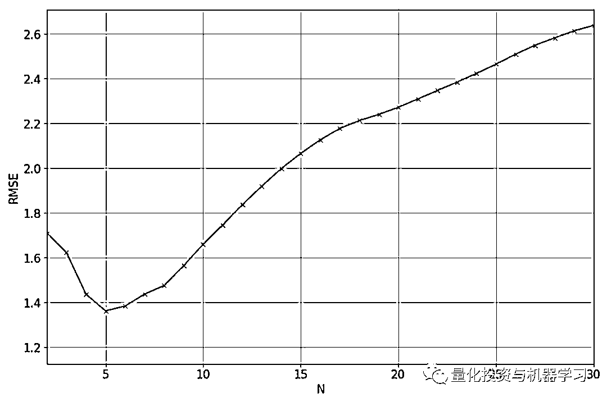
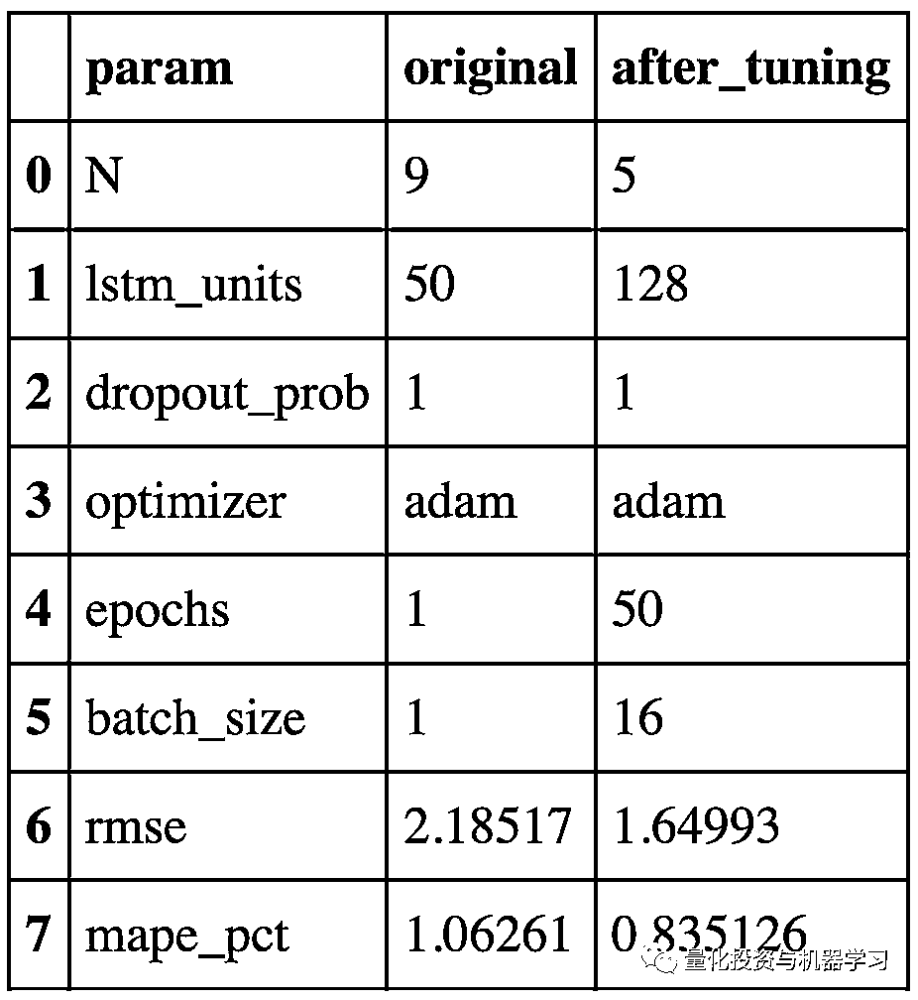

# 严谨解决 5 种机器学习算法在预测股价的应用（代码+数据）

> 原文：[`mp.weixin.qq.com/s?__biz=MzAxNTc0Mjg0Mg==&mid=2653290588&idx=1&sn=1d0409ad212ea8627e5d5cedf61953ac&chksm=802dc249b75a4b5fa245433320a4cc9da1a2cceb22df6fb1a28e5b94ff038319ae4e7ec6941f&scene=27#wechat_redirect`](http://mp.weixin.qq.com/s?__biz=MzAxNTc0Mjg0Mg==&mid=2653290588&idx=1&sn=1d0409ad212ea8627e5d5cedf61953ac&chksm=802dc249b75a4b5fa245433320a4cc9da1a2cceb22df6fb1a28e5b94ff038319ae4e7ec6941f&scene=27#wechat_redirect)

**标星★公众号**，第一时间获取最新研究

本期作者：Yibin Ng

本期编译：1+1=6

**近期原创文章：**

## ♥ [啥是佩琪？恕我直言，搞量化这样配齐！](https://mp.weixin.qq.com/s?__biz=MzAxNTc0Mjg0Mg==&mid=2653290316&idx=2&sn=0ef0f85a29c848ac6d554c16d847a2fd&chksm=802e3d59b759b44fe5cc65cc1480828cc8f05d12383a2caf1a5a60e950d2dfde899de79ab438&token=1330520237&lang=zh_CN&scene=21#wechat_redirect)

## ♥ [深入研读：利用 Twitter 情绪去预测股市](https://mp.weixin.qq.com/s?__biz=MzAxNTc0Mjg0Mg==&mid=2653290402&idx=1&sn=efda9ea106991f4f7ccabcae9d809e00&chksm=802e3db7b759b4a173dc8f2ab5c298ab3146bfd7dd5aca75929c74ecc999a53b195c16f19c71&token=1330520237&lang=zh_CN&scene=21#wechat_redirect)

## ♥ [Two Sigma 用新闻来预测股价走势，带你吊打 Kaggle](https://mp.weixin.qq.com/s?__biz=MzAxNTc0Mjg0Mg==&mid=2653290456&idx=1&sn=b8d2d8febc599742e43ea48e3c249323&chksm=802e3dcdb759b4db9279c689202101b6b154fb118a1c1be12b52e522e1a1d7944858dbd6637e&token=1330520237&lang=zh_CN&scene=21#wechat_redirect)

## ♥ [利用深度学习最新前沿预测股价走势](https://mp.weixin.qq.com/s?__biz=MzAxNTc0Mjg0Mg==&mid=2653290080&idx=1&sn=06c50cefe78a7b24c64c4fdb9739c7f3&chksm=802e3c75b759b563c01495d16a638a56ac7305fc324ee4917fd76c648f670b7f7276826bdaa8&token=770078636&lang=zh_CN&scene=21#wechat_redirect)

## ♥ [一位数据科学 PhD 眼中的算法交易](https://mp.weixin.qq.com/s?__biz=MzAxNTc0Mjg0Mg==&mid=2653290118&idx=1&sn=a261307470cf2f3e458ab4e7dc309179&chksm=802e3c93b759b585e079d3a797f512dfd0427ac02942339f4f1454bd368ba47be21cb52cf969&token=770078636&lang=zh_CN&scene=21#wechat_redirect)

## ♥ [基于 RNN 和 LSTM 的股市预测方法](https://mp.weixin.qq.com/s?__biz=MzAxNTc0Mjg0Mg==&mid=2653290481&idx=1&sn=f7360ea8554cc4f86fcc71315176b093&chksm=802e3de4b759b4f2235a0aeabb6e76b3e101ff09b9a2aa6fa67e6e824fc4274f68f4ae51af95&token=1865137106&lang=zh_CN&scene=21#wechat_redirect)

## ♥ [人工智能『AI』应用算法交易，7 个必踩的坑！](https://mp.weixin.qq.com/s?__biz=MzAxNTc0Mjg0Mg==&mid=2653289974&idx=1&sn=88f87cb64999d9406d7c618350aac35d&chksm=802e3fe3b759b6f5eca6e777364270cbaa0bf35e9a1535255be9751c3a77642676993a861132&token=770078636&lang=zh_CN&scene=21#wechat_redirect)

## ♥ [神经网络在算法交易上的应用系列（一）](https://mp.weixin.qq.com/s?__biz=MzAxNTc0Mjg0Mg==&mid=2653289962&idx=1&sn=5f5aa65ec00ce176501c85c7c106187d&chksm=802e3fffb759b6e9f2d4518f9d3755a68329c8753745333ef9d70ffd04bd088fd7b076318358&token=770078636&lang=zh_CN&scene=21#wechat_redirect)

## ♥ [预测股市 | 如何避免 p-Hacking，为什么你要看涨？](https://mp.weixin.qq.com/s?__biz=MzAxNTc0Mjg0Mg==&mid=2653289820&idx=1&sn=d3fee74ba1daab837433e4ef6b0ab4d9&chksm=802e3f49b759b65f422d20515942d5813aead73231da7d78e9f235bdb42386cf656079e69b8b&token=770078636&lang=zh_CN&scene=21#wechat_redirect)

## ♥ [如何鉴别那些用深度学习预测股价的花哨模型？](https://mp.weixin.qq.com/s?__biz=MzAxNTc0Mjg0Mg==&mid=2653290132&idx=1&sn=cbf1e2a4526e6e9305a6110c17063f46&chksm=802e3c81b759b597d3dd94b8008e150c90087567904a29c0c4b58d7be220a9ece2008956d5db&token=1266110554&lang=zh_CN&scene=21#wechat_redirect)

## ♥ [优化强化学习 Q-learning 算法进行股市交易](https://mp.weixin.qq.com/s?__biz=MzAxNTc0Mjg0Mg==&mid=2653290286&idx=1&sn=882d39a18018733b93c8c8eac385b515&chksm=802e3d3bb759b42d1fc849f96bf02ae87edf2eab01b0beecd9340112c7fb06b95cb2246d2429&token=1330520237&lang=zh_CN&scene=21#wechat_redirect)

**前言**

机器学习有很多应用，其中之一就是预测时间序列。一个最有趣（或者可能是最赚钱）的时间序列是股票价格。

今天，我们用更严谨的学术态度来解决这个问题。例如：移动平均、线性回归、KNN、Auto ARIMA 和 Prophet 的预测范围为 1 年，而 LSTM 的预测范围为 1 天。**在一些文章有人说 LSTM 比我们目前看到的任何算法都要出色**。但很明显，我们并不是 comparing apples to apples here。

代码+数据如下（**文末下载**）：


**1、问题陈述**

我们的目标是使用前 N 天的数据（即预测范围= 1）预测 Vanguard Total Stock Market ETF（VTI）的每日调整收盘价 。我们将使用 VTI 从 2015 年 11 月 25 日至 2018 年 11 月 23 日三年的历史价格。可以从雅虎财经下载（*https://finance.yahoo.com/quote/VTI/*），数据集如下:

**获取全部代码，见文末**

```py
import math
import matplotlib
import numpy as np
import pandas as pd
import seaborn as sns
import time

from datetime import date, datetime, time, timedelta
from matplotlib import pyplot as plt
from pylab import rcParams
from sklearn.linear_model import LinearRegression
from sklearn.metrics import mean_squared_error
from tqdm import tqdm_notebook

#### Input params ##################
stk_path = "./data/VTI.csv"
test_size = 0.2                 # proportion of dataset to be used as test set
cv_size = 0.2                   # proportion of dataset to be used as cross-validation set
Nmax = 2                       # for feature at day t, we use lags from t-1, t-2, ..., t-N as features
                                # Nmax is the maximum N we are going to test
fontsize = 14
ticklabelsize = 14
```


将数据集分为 60%训练集、20%验证集和 20%测试集。使用训练集对模型进行训练，使用验证集对模型超参数进行调整，最后使用测试集对模型的性能进行测试。

```py
rcParams['figure.figsize'] = 10, 8 

ax = train.plot(x='date', y='adj_close', style='b-', grid=True)
ax = cv.plot(x='date', y='adj_close', style='y-', grid=True, ax=ax)
ax = test.plot(x='date', y='adj_close', style='g-', grid=True, ax=ax)
ax.legend(['train', 'validation', 'test'])
ax.set_xlabel("date")
ax.set_ylabel("USD")
```


为了评估我们的方法的有效性，我们将使用均方根误差（RMSE）和平均绝对百分比误差（MAPE）进行度量。对于这两个指标，值越低，预测效果越好。

**2、Last Value**

在 Last Value 方法中，我们将简单地将预测设置为最后一个观测值。这意味着我们将当前的复权收盘价设置为前一天的复权收盘价。这是最具成本效益的预测模型，通常用作比较更复杂模型的基准。这里不需要调优超参数。 

下图显示了使用 Last Value 方法的预测。如果你仔细观察，**你会发现每一天的预测（红叉）仅仅是前一天的值（绿叉）**。


**3、移动平均线**

在移动平均法中，预测值将是前 N 个值的平均值。这意味着我们将当前复权收盘价设置为前 N 天复权收盘价的平均值。需要调整超参数 N。

下图展示了验证集上实际值和预测值之间的 RMSE，对于不同的 N 值，我们将使用 N=2，因为它给出了最低的 RMSE。


```py
est_list = get_preds_mov_avg(df, 'adj_close', N_opt, 0, num_train+num_cv)
test['est' + '_N' + str(N_opt)] = est_list
print("RMSE = %0.3f" % math.sqrt(mean_squared_error(est_list, test['adj_close'])))
print("MAPE = %0.3f%%" % get_mape(test['adj_close'], est_list))
test.head()
```

```py
RMSE = 1.270
MAPE = 0.640%
```

下图显示了移动平均法的预测结果：


**4、线性回归**

线性回归是对一个因变量和一个或多个自变量之间的关系进行建模的一种线性方法。我们在这里使用线性回归的方法是将线性回归模型与之前的 N 个值进行拟合，并用这个模型预测当前的值。下图是 N=5 的一个例子。实际复权收盘价显示为深蓝色的十字，我们想要预测第 6 天的值（黄色方块）。我们将通过前 5 个实际值拟合一条线性回归线（浅蓝色线），并用它来做第 6 天的预测（浅蓝色圆）。

**获取全部代码，见文末**

```py
# Specify the day you are interested in
day = pd.Timestamp(date(2017, 10, 31))

# Specify the maximum N you want to plot (If Nmax2 is too large it gets very cluttered) 
Nmax2 = 5

df_temp = cv[cv['date'] <= day]
plt.figure(figsize=(12, 8), dpi=80)
plt.plot(range(1,Nmax2+2), df_temp[-Nmax2-1:]['adj_close'], 'bx-')
plt.plot(Nmax2+1, df_temp[-1:]['adj_close'], 'ys-')
legend_list = ['adj_close', 'actual_value']

# Plot the linear regression lines and the predictions
color_list = ['r', 'g', 'k', 'y', 'm', 'c', '0.75']
marker_list = ['x', 'x', 'x', 'x', 'x', 'x', 'x']
regr = LinearRegression(fit_intercept=True) # Create linear regression object
for N in range(5, Nmax2+1):
    # Plot the linear regression lines
    X_train = np.array(range(len(df_temp['adj_close'][-N-1:-1]))) # e.g. [0 1 2 3 4]
    y_train = np.array(df_temp['adj_close'][-N-1:-1]) # e.g. [2944 3088 3226 3335 3436]
    X_train = X_train.reshape(-1, 1)     
    y_train = y_train.reshape(-1, 1)
    regr.fit(X_train, y_train)            # Train the model
    y_est = regr.predict(X_train)         # Get linear regression line
    plt.plot(range(Nmax2+1-N,Nmax2+2), 
             np.concatenate((y_est, np.array(df_temp['est_N'+str(N)][-1:]).reshape(-1,1))),
             color=color_list[N%len(color_list)], 
             marker=marker_list[N%len(marker_list)])
    legend_list.append('est_N'+str(N)+'_lr')

    # Plot the predictions
    plt.plot(Nmax2+1, 
             df_temp['est_N'+str(N)][-1:], 
             color=color_list[N%len(color_list)], 
             marker='o')
    legend_list.append('est_N'+str(N))

plt.grid()
plt.xlabel('timestep')
plt.ylabel('USD')
plt.legend(legend_list, bbox_to_anchor=(1.05, 1))
matplotlib.rcParams.update({'font.size': fontsize})
```


下面是我们用训练模型和做预测的代码：

```py
import numpy as np

from sklearn.linear_model import LinearRegression
def get_preds_lin_reg(df, target_col, N, pred_min, offset):
    """
    Given a dataframe, get prediction at each timestep
    Inputs
        df         : dataframe with the values you want to predict     
        target_col : name of the column you want to predict
        N          : use previous N values to do prediction
        pred_min   : all predictions should be >= pred_min
        offset     : for df we only do predictions for df[offset:]
    Outputs
        pred_list  : the predictions for target_col
    """
    # Create linear regression object
    regr = LinearRegression(fit_intercept=True)
    pred_list = []
    for i in range(offset, len(df['adj_close'])):
        X_train = np.array(range(len(df['adj_close'][i-N:i]))) 
        y_train = np.array(df['adj_close'][i-N:i]) 
        X_train = X_train.reshape(-1, 1)     
        y_train = y_train.reshape(-1, 1)
        regr.fit(X_train, y_train)            # Train the model
        pred = regr.predict(N)

        pred_list.append(pred[0][0])  

    # If the values are < pred_min, set it to be pred_min
    pred_list = np.array(pred_list)
    pred_list[pred_list < pred_min] = pred_min

    return pred_list
```

下图显示了验证集的实际值和预测值之间的 RMSE，对于 N 的不同值，我们将使用 N=5，因为它给出了最低的 RMSE。



下图显示了**线性回归方法**的预测结果。可以观察到，**该方法不能很好地捕获方向的变化（即下降到上升趋势，反之亦然）**。


**5、XGBoost**

XGBoost 是以迭代的方式将弱学习者转化为强学习者的过程。自 2014 年推出以来，XGBoost 已被证明是一种非常强大的机器学习算法，通常是许多机器学习竞赛中的首选算法。 

我们将在训练集中训练 XGBoost 模型，使用验证集优化其超参数，最后在测试集中应用 XGBoost 模型并报告结果。使用的显著特征是过去 N 天的复权收盘价，以及过去 N 天的成交量。除了这些特征，我们还可以做一些特征工程。我们将构建的其他功能包括：

*   过去 N 天，最高价和最低价每天的差值

*   过去 N 天，开盘价和收盘价每天的差值

在构建这个模型的过程中，学到了一个有趣的事情，那就是**特征缩放对于模型的正常工作是非常重要的**。我们的第一个模型根本没有实现任何伸缩，下面的图显示了对验证集的预测。模型训练的是 89 到 125 之间的复权收盘价，因此模型只能输出这个范围内的预测。当模型试图预测验证集并且它看到超出了这个范围时，它不能很好地拓展使用。


如果没有正确地进行特征缩放，预测是非常不准的

接下来尝试将训练集规模缩放为均值 0 和方差 1，并且在验证集上应用了相同的变换。但显然这不会起作用，因为在这里我们使用从训练集计算的均值和方差来转换验证集。由于来自验证集的值远大于来自列车集的值，因此在缩放后，值仍将更大。结果是预测仍然如上所述，只是缩放了 y 轴上的值。

最后，将序列集合的均值缩放为 0，方差为 1，然后用这个来训练模型。随后，当对验证集进行预测时，对每个样本的每个特征组进行缩放，使其均值为 0，方差为 1。例如，如果我们对第 T 天进行预测，我将取最近 N 天（T-N 到 T-1）的复权收盘价，并将其缩放为均值为 0，方差为 1。成交量特征也是一样的，我取前 N 天的成交量，将其缩放为均值为 0，方差为 1。使用与其他特征相同的操作。**然后我们使用这些缩放的特征来做预测。预测值也会被缩放，我们用它们对应的均值和方差进行逆变换。发现这种扩展方式提供了最好的性能**，如下所示。

下面是我们用来训练模型和做预测的代码：

**获取全部代码，见文末**

```py
import math
import numpy as np
from sklearn.metrics import mean_squared_error
from xgboost import XGBRegressor
def get_mape(y_true, y_pred): 
    """
    Compute mean absolute percentage error (MAPE)
    """
    y_true, y_pred = np.array(y_true), np.array(y_pred)
    return np.mean(np.abs((y_true - y_pred) / y_true)) * 100
def train_pred_eval_model(X_train_scaled, \
                          y_train_scaled, \
                          X_test_scaled, \
                          y_test, \
                          col_mean, \
                          col_std, \
                          seed=100, \
                          n_estimators=100, \
                          max_depth=3, \
                          learning_rate=0.1, \
                          min_child_weight=1, \
                          subsample=1, \
                          colsample_bytree=1, \
                          colsample_bylevel=1, \
                          gamma=0):
    '''
    Train model, do prediction, scale back to original range and do 
    evaluation
    Use XGBoost here.
    Inputs
        X_train_scaled     : features for training. Scaled to have 
                             mean 0 and variance 1
        y_train_scaled     : target for training. Scaled to have 
                             mean 0 and variance 1
        X_test_scaled      : features for test. Each sample is 
                             scaled to mean 0 and variance 1
        y_test             : target for test. Actual values, not 
                             scaled
        col_mean           : means used to scale each sample of 
                             X_test_scaled. Same length as 
                             X_test_scaled and y_test
        col_std            : standard deviations used to scale each 
                             sample of X_test_scaled. Same length as 
                             X_test_scaled and y_test
        seed               : model seed
        n_estimators       : number of boosted trees to fit
        max_depth          : maximum tree depth for base learners
        learning_rate      : boosting learning rate (xgb’s “eta”)
        min_child_weight   : minimum sum of instance weight(hessian) 
                             needed in a child
        subsample          : subsample ratio of the training 
                             instance
        colsample_bytree   : subsample ratio of columns when 
                             constructing each tree
        colsample_bylevel  : subsample ratio of columns for each 
                             split, in each level
        gamma              : minimum loss reduction required to make 
                             a further partition on a leaf node of 
                             the tree
    Outputs
        rmse               : root mean square error of y_test and 
                             est
        mape               : mean absolute percentage error of 
                             y_test and est
        est                : predicted values. Same length as y_test
    '''
    model = XGBRegressor(seed=model_seed,
                         n_estimators=n_estimators,
                         max_depth=max_depth,
                         learning_rate=learning_rate,
                         min_child_weight=min_child_weight,
                         subsample=subsample,
                         colsample_bytree=colsample_bytree,
                         colsample_bylevel=colsample_bylevel,
                         gamma=gamma)

    # Train the model
    model.fit(X_train_scaled, y_train_scaled)

    # Get predicted labels and scale back to original range
    est_scaled = model.predict(X_test_scaled)
    est = est_scaled * col_std + col_mean
    # Calculate RMSE
    rmse = math.sqrt(mean_squared_error(y_test, est))
    mape = get_mape(y_test, est)

    return rmse, mape, est
```

下图显示了验证集上实际值和预测值之间的 RMSE，对于不同的 N 值，我们将使用 N=3，因为它给出了最低的 RMSE。


优化前后的超参数和性能如下所示：


下图显示了使用 XGBoost 方法的预测结果：


**6、LSTM**

LSTM 是一种深度学习模型，用于解决长序列中的梯度消失问题。LSTM 有三个门：更新门、遗忘门和输出门。更新和忘记门决定是否更新单元的每个元素。输出门决定了作为下一层的激活而输出的信息量。

下面我们将使用 LSTM 结构。使用两层 LSTM 模块并在其间设置一个 drop-layer 以避免过度拟合。


**训练 N：**

```py
param_label = 'N'
param_list = range(2, 60)

error_rate = {param_label: [], 'rmse': [], 'mape_pct': []}
tic = time.time()
for param in tqdm_notebook(param_list):

    # Split train into x and y
    x_train_scaled, y_train_scaled = get_x_y(train_scaled, param, param)

    # Split cv into x and y
    x_cv_scaled, y_cv_scaled = get_x_y(train_cv_scaled, param, num_train)

    # Train, predict and eval model
    rmse, mape, _ = train_pred_eval_model(x_train_scaled, \
                                          y_train_scaled, \
                                          x_cv_scaled, \
                                          y_cv_scaled, \
                                          scaler, \
                                          lstm_units=lstm_units, \
                                          dropout_prob=dropout_prob, \
                                          optimizer='adam', \
                                          epochs=epochs, \
                                          batch_size=batch_size)

    # Collect results
    error_rate[param_label].append(param)
    error_rate['rmse'].append(rmse)
    error_rate['mape_pct'].append(mape)

error_rate = pd.DataFrame(error_rate)
toc = time.time()
print("Minutes taken = " + str((toc-tic)/60.0))
error_rate   

Minutes taken = 37.21444189945857
```

```py
# Plot RMSE 
rcParams['figure.figsize'] = 10, 8 # width 10, height 8

ax = error_rate.plot(x='N', y='rmse', style='bx-', grid=True)
ax = error_rate.plot(x='N', y='mape_pct', style='rx-', grid=True, ax=ax)
ax.set_xlabel("N")
ax.set_ylabel("RMSE/MAPE(%)")
```


# **训练模型——优化器**


```py
# Plot RMSE 
rcParams['figure.figsize'] = 10, 8 # width 10, height 8

ax = error_rate.plot(x='optimizer', y='rmse', style='bx-', grid=True)
ax = error_rate.plot(x='optimizer', y='mape_pct', style='rx-', grid=True, ax=ax)
ax.set_xticklabels(param_list)
ax.set_xlabel("Optimizer")
ax.set_ylabel("RMSE/MAPE(%)")
```

```py
Text(0, 0.5, 'RMSE/MAPE(%)')
```


```py
# Get optimum value for param and param2
temp = error_rate[error_rate['rmse'] == error_rate['rmse'].min()]
optimizer_opt = temp[param_label].values[0]
print("min RMSE = %0.3f" % error_rate['rmse'].min())
print("min MAPE = %0.3f%%" % error_rate['mape_pct'].min())
print("optimum " + param_label + " = " + str(optimizer_opt))
```

```py
min RMSE = 1.650
min MAPE = 0.835%
optimum optimizer = adam
```

下面是我们用来训练模型和做预测的代码：

**获取全部代码，见文末**

```py
import math
import numpy as np
from keras.models import Sequential
from keras.layers import Dense, Dropout, LSTM
def train_pred_eval_model(x_train_scaled, \
                          y_train_scaled, \
                          x_test_scaled, \
                          y_test, \
                          mu_test_list, \
                          std_test_list, \
                          lstm_units=50, \
                          dropout_prob=0.5, \
                          optimizer='adam', \
                          epochs=1, \
                          batch_size=1):
    '''
    Train model, do prediction, scale back to original range and do 
    evaluation
    Use LSTM here.
    Returns rmse, mape and predicted values
    Inputs
        x_train_scaled  : e.g. x_train_scaled.shape=(451, 9, 1). 
                          Here we are using the past 9 values to  
                          predict the next value
        y_train_scaled  : e.g. y_train_scaled.shape=(451, 1)
        x_test_scaled   : use this to do predictions 
        y_test          : actual value of the predictions
        mu_test_list    : list of the means. Same length as 
                          x_test_scaled and y_test
        std_test_list   : list of the std devs. Same length as 
                          x_test_scaled and y_test
        lstm_units      : dimensionality of the output space
        dropout_prob    : fraction of the units to drop for the 
                          linear transformation of the inputs
        optimizer       : optimizer for model.compile()
        epochs          : epochs for model.fit()
        batch_size      : batch size for model.fit()
    Outputs
        rmse            : root mean square error
        mape            : mean absolute percentage error
        est             : predictions
    '''
    # Create the LSTM network
    model = Sequential()
    model.add(LSTM(units=lstm_units, 
                   return_sequences=True, 
                   input_shape=(x_train_scaled.shape[1],1)))
    # Add dropput with a probability of 0.5
    model.add(Dropout(dropout_prob)) 
    model.add(LSTM(units=lstm_units))
    # Add dropput with a probability of 0.5
    model.add(Dropout(dropout_prob)) 
    model.add(Dense(1))
    # Compile and fit the LSTM network
    model.compile(loss='mean_squared_error', optimizer=optimizer)
    model.fit(x_train_scaled, y_train_scaled, epochs=epochs,   
              batch_size=batch_size, verbose=0)

    # Do prediction
    est_scaled = model.predict(x_test_scaled)
    est = (est_scaled * np.array(std_test_list).reshape(-1,1)) + 
          np.array(mu_test_list).reshape(-1,1)

    # Calculate RMSE and MAPE
    rmse = math.sqrt(mean_squared_error(y_test, est))
    mape = get_mape(y_test, est)

    return rmse, mape, est
```

我们将使用与 XGBoost 中相同的方法来缩放数据集。验证集调优前后 LSTM 网络的超参数和性能如下所示：



下图显示了使用 LSTM 的预测：


**研究结果及改进**

下面，我们在同一张图绘制上面使用的所有方法。很明显，使用线性方法的预测最差。除此之外，从视觉上很难判断哪种方法提供了最好的预测。 


下面是我们所探讨的各种方法的 RMSE 和 MAPE 的并列比较。我们看到 last value 给出了最低的 RMSE 和 MAPE，然后是 XGBoost，然后是 LSTM。有趣的是，**简单的 last value 方法优于所有其他更复杂的方法，但这很可能是因为我们的预测范围只有 1。对于较长的预测范围，我们认为其他方法比 last value 更能捕捉趋势和季节性。**


**推荐阅读**

[01、经过多年交易之后你应该学到的东西（深度分享）](https://mp.weixin.qq.com/s?__biz=MzAxNTc0Mjg0Mg==&mid=2653289074&idx=1&sn=e859d363eef9249236244466a1af41b6&chksm=802e3867b759b1717f77e07a51ee5671e8115130c66562577280ba1243cba08218add04f1f00&token=449379994&lang=zh_CN&scene=21#wechat_redirect)

[02、监督学习标签在股市中的应用（代码+书籍）](https://mp.weixin.qq.com/s?__biz=MzAxNTc0Mjg0Mg==&mid=2653289050&idx=1&sn=60043a5c95b877dd329a5fd150ddacc4&chksm=802e384fb759b1598e500087374772059aa21b31ae104b3dca04331cf4b63a233c5e04c1945a&token=449379994&lang=zh_CN&scene=21#wechat_redirect)

[03、全球投行顶尖机器学习团队全面分析](https://mp.weixin.qq.com/s?__biz=MzAxNTc0Mjg0Mg==&mid=2653289018&idx=1&sn=8c411f676c2c0d92b0dd218f041bee4b&chksm=802e382fb759b139ffebf633ac14cdd0f21938e4613fe632d5d9231dab3d2aca95a11628378a&token=449379994&lang=zh_CN&scene=21#wechat_redirect)

[04、使用 Tensorflow 预测股票市场变动](https://mp.weixin.qq.com/s?__biz=MzAxNTc0Mjg0Mg==&mid=2653289014&idx=1&sn=3762d405e332c599a21b48a7dc4df587&chksm=802e3823b759b135928d55044c2729aea9690f86752b680eb973d1a376dc53cfa18287d0060b&token=449379994&lang=zh_CN&scene=21#wechat_redirect)

[05、使用 LSTM 预测股票市场基于 Tensorflow](https://mp.weixin.qq.com/s?__biz=MzAxNTc0Mjg0Mg==&mid=2653289238&idx=1&sn=3144f5792f84455dd53c27a78e8a316c&chksm=802e3903b759b015da88acde4fcbc8547ab3e6acbb5a0897404bbefe1d8a414265d5d5766ee4&token=2020206794&lang=zh_CN&scene=21#wechat_redirect)

[06、美丽的回测——教你定量计算过拟合概率](https://mp.weixin.qq.com/s?__biz=MzAxNTc0Mjg0Mg==&mid=2653289314&idx=1&sn=87c5a12b23a875966db7be50d11f09cd&chksm=802e3977b759b061675d1988168c1fec06c602e8583fbcc9b76f87008e0c10b702acc85467a0&token=1972390229&lang=zh_CN&scene=21#wechat_redirect)

[07、利用动态深度学习预测金融时间序列基于 Python](https://mp.weixin.qq.com/s?__biz=MzAxNTc0Mjg0Mg==&mid=2653289347&idx=1&sn=bf5d7899bc4a854d4ba9046fdc6fe0d6&chksm=802e3996b759b080287213840987bb0a0c02e4e1d4d7aae23f10a225a92ef6dd922d8006123d&token=290397496&lang=zh_CN&scene=21#wechat_redirect)

[08、Facebook 开源神器 Prophet 预测时间序列基于 Python](https://mp.weixin.qq.com/s?__biz=MzAxNTc0Mjg0Mg==&mid=2653289394&idx=1&sn=24a836136d730aa268605628e683d629&chksm=802e39a7b759b0b1dcf7aaa560699130a907716b71fc9c45ff0e5d236c5ae8ef80ebdb09dbb6&token=290397496&lang=zh_CN&scene=21#wechat_redirect)

[09、Facebook 开源神器 Prophet 预测股市行情基于 Python](https://mp.weixin.qq.com/s?__biz=MzAxNTc0Mjg0Mg==&mid=2653289437&idx=1&sn=f0dca7da8e69e7ba736992cb3d034ce7&chksm=802e39c8b759b0de5bce401c580623d0729ecca69d13926479d36e19aff8c9c9e8a20265afff&token=290397496&lang=zh_CN&scene=21#wechat_redirect)

[10、2018 第三季度最受欢迎的券商金工研报前 50（附下载）](https://mp.weixin.qq.com/s?__biz=MzAxNTc0Mjg0Mg==&mid=2653289358&idx=1&sn=db6e8ab85b08f6e67790ec0e401e586e&chksm=802e399bb759b08d6eec855f9901ea856d0da68c7425cba62791b8948da6ad761a3d88543dad&token=290397496&lang=zh_CN&scene=21#wechat_redirect)

[11、实战交易策略的精髓（公众号深度呈现）](https://mp.weixin.qq.com/s?__biz=MzAxNTc0Mjg0Mg==&mid=2653289447&idx=1&sn=f2948715bf82569a6556d518e56c1f9e&chksm=802e39f2b759b0e4502d1aaac562b87789573b55c76b3c85897d8c9d88dbf9a0b7ee34d86a4e&token=290397496&lang=zh_CN&scene=21#wechat_redirect)

[12、Markowitz 有效边界和投资组合优化基于 Python](https://mp.weixin.qq.com/s?__biz=MzAxNTc0Mjg0Mg==&mid=2653289478&idx=1&sn=f8e01a641be021993d8ef2d84e94a299&chksm=802e3e13b759b7055cf27a280c672371008a5564c97c658eee89ce8481396a28d254836ff9af&token=290397496&lang=zh_CN&scene=21#wechat_redirect)

[13、使用 LSTM 模型预测股价基于 Keras](https://mp.weixin.qq.com/s?__biz=MzAxNTc0Mjg0Mg==&mid=2653289495&idx=1&sn=c4eeaa2e9f9c10995be9ea0c56d29ba7&chksm=802e3e02b759b7148227675c23c403fb9a543b733e3d27fa237b53840e030bf387a473d83e3c&token=1260956004&lang=zh_CN&scene=21#wechat_redirect)

[14、量化金融导论 1：资产收益的程式化介绍基于 Python](https://mp.weixin.qq.com/s?__biz=MzAxNTc0Mjg0Mg==&mid=2653289507&idx=1&sn=f0ca71aa07531bbbdbd33213f0bab89f&chksm=802e3e36b759b720138b3b17a4dd0e198e054b9de29a038fdd50805f824effa55831111ad026&token=1936245282&lang=zh_CN&scene=21#wechat_redirect)

[15、预测股市崩盘基于统计机器学习与神经网络（Python+文档）](https://mp.weixin.qq.com/s?__biz=MzAxNTc0Mjg0Mg==&mid=2653289533&idx=1&sn=4ef964834e84a9995111bb057b0fc5dd&chksm=802e3e28b759b73e0618eb1262c53aa0601fbf5805525a7c7ff40dc3db62c7704496611bdbf1&token=1950551577&lang=zh_CN&scene=21#wechat_redirect)

[16、实现最优投资组合有效前沿基于 Python（附代码）](https://mp.weixin.qq.com/s?__biz=MzAxNTc0Mjg0Mg==&mid=2653289609&idx=1&sn=c7f0b3e47025862d10bb53b6ab88bcda&chksm=802e3e9cb759b78abf6b8b049c59bf18ccfb2ead7580d1f557d36de2292f59dcbd94dcd41910&token=2085008037&lang=zh_CN&scene=21#wechat_redirect)

[17、精心为大家整理了一些超级棒的机器学习资料（附链接）](https://mp.weixin.qq.com/s?__biz=MzAxNTc0Mjg0Mg==&mid=2653289615&idx=1&sn=1cdc89afb997d0c580bf0cef296d946c&chksm=802e3e9ab759b78ce9f0cd152a680d4a413d6c8dcb02a7a296f4091993a7e4137e7520394575&token=2085008037&lang=zh_CN&scene=21#wechat_redirect)

[18、海量 Wind 数据，与全网用户零距离邂逅！](https://mp.weixin.qq.com/s?__biz=MzAxNTc0Mjg0Mg==&mid=2653289623&idx=1&sn=28a3600fd7a72d7be00b066ca0f98244&chksm=802e3e82b759b7943f43a4f6ef4a91e4153fa6b8210de9590235fa8ee66eb9811ce177054dbc&token=1389401983&lang=zh_CN&scene=21#wechat_redirect)

[19、机器学习、深度学习、量化金融、Python 等最新书籍汇总下载](https://mp.weixin.qq.com/s?__biz=MzAxNTc0Mjg0Mg==&mid=2653289640&idx=1&sn=34e94fcbe99052b8e7381ecc48a36dc0&chksm=802e3ebdb759b7ab897cd329a680715b6f8294e63550ddf0c57b9e1320b2b7d1408c6fdca0c7&token=1389401983&lang=zh_CN&scene=21#wechat_redirect)

[20、各大卖方 2019 年 A 股策略报告，都是有故事的人！](https://mp.weixin.qq.com/s?__biz=MzAxNTc0Mjg0Mg==&mid=2653289725&idx=1&sn=4b65cd1fb8331438e4c0b3d0eae6b51f&chksm=802e3ee8b759b7fe1b94e84d54cc23b0ab05853d5cd227812574b350e9fc2cce9e5f1bc6cb7a&token=1389401983&lang=zh_CN&scene=21#wechat_redirect)

**如何获取代码**

在**后台**输入

**20190211**

**后台获取方式介绍**


**扫码关注我们**

