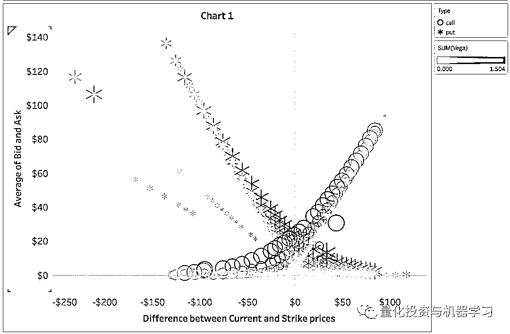

# 基于无监督学习的期权定价异常检测（代码+数据）

> 原文：[`mp.weixin.qq.com/s?__biz=MzAxNTc0Mjg0Mg==&mid=2653290562&idx=1&sn=dee61b832e1aa2c062a96bb27621c29d&chksm=802dc257b75a4b41b5623ade23a7de86333bfd3b4299fb69922558b0cbafe4c930b5ef503d89&scene=27#wechat_redirect`](http://mp.weixin.qq.com/s?__biz=MzAxNTc0Mjg0Mg==&mid=2653290562&idx=1&sn=dee61b832e1aa2c062a96bb27621c29d&chksm=802dc257b75a4b41b5623ade23a7de86333bfd3b4299fb69922558b0cbafe4c930b5ef503d89&scene=27#wechat_redirect)

**标星★公众号**，第一时间获取最新研究

本期作者：Boris B

作者介绍：1+1=6

**近期原创文章：**

## ♥ [啥是佩琪？恕我直言，搞量化这样配齐！](https://mp.weixin.qq.com/s?__biz=MzAxNTc0Mjg0Mg==&mid=2653290316&idx=2&sn=0ef0f85a29c848ac6d554c16d847a2fd&chksm=802e3d59b759b44fe5cc65cc1480828cc8f05d12383a2caf1a5a60e950d2dfde899de79ab438&token=1330520237&lang=zh_CN&scene=21#wechat_redirect)

## ♥ [深入研读：利用 Twitter 情绪去预测股市](https://mp.weixin.qq.com/s?__biz=MzAxNTc0Mjg0Mg==&mid=2653290402&idx=1&sn=efda9ea106991f4f7ccabcae9d809e00&chksm=802e3db7b759b4a173dc8f2ab5c298ab3146bfd7dd5aca75929c74ecc999a53b195c16f19c71&token=1330520237&lang=zh_CN&scene=21#wechat_redirect)

## ♥ [Two Sigma 用新闻来预测股价走势，带你吊打 Kaggle](https://mp.weixin.qq.com/s?__biz=MzAxNTc0Mjg0Mg==&mid=2653290456&idx=1&sn=b8d2d8febc599742e43ea48e3c249323&chksm=802e3dcdb759b4db9279c689202101b6b154fb118a1c1be12b52e522e1a1d7944858dbd6637e&token=1330520237&lang=zh_CN&scene=21#wechat_redirect)

## ♥ [利用深度学习最新前沿预测股价走势](https://mp.weixin.qq.com/s?__biz=MzAxNTc0Mjg0Mg==&mid=2653290080&idx=1&sn=06c50cefe78a7b24c64c4fdb9739c7f3&chksm=802e3c75b759b563c01495d16a638a56ac7305fc324ee4917fd76c648f670b7f7276826bdaa8&token=770078636&lang=zh_CN&scene=21#wechat_redirect)

## ♥ [一位数据科学 PhD 眼中的算法交易](https://mp.weixin.qq.com/s?__biz=MzAxNTc0Mjg0Mg==&mid=2653290118&idx=1&sn=a261307470cf2f3e458ab4e7dc309179&chksm=802e3c93b759b585e079d3a797f512dfd0427ac02942339f4f1454bd368ba47be21cb52cf969&token=770078636&lang=zh_CN&scene=21#wechat_redirect)

## ♥ [基于 RNN 和 LSTM 的股市预测方法](https://mp.weixin.qq.com/s?__biz=MzAxNTc0Mjg0Mg==&mid=2653290481&idx=1&sn=f7360ea8554cc4f86fcc71315176b093&chksm=802e3de4b759b4f2235a0aeabb6e76b3e101ff09b9a2aa6fa67e6e824fc4274f68f4ae51af95&token=1865137106&lang=zh_CN&scene=21#wechat_redirect)

## ♥ [人工智能『AI』应用算法交易，7 个必踩的坑！](https://mp.weixin.qq.com/s?__biz=MzAxNTc0Mjg0Mg==&mid=2653289974&idx=1&sn=88f87cb64999d9406d7c618350aac35d&chksm=802e3fe3b759b6f5eca6e777364270cbaa0bf35e9a1535255be9751c3a77642676993a861132&token=770078636&lang=zh_CN&scene=21#wechat_redirect)

## ♥ [神经网络在算法交易上的应用系列（一）](https://mp.weixin.qq.com/s?__biz=MzAxNTc0Mjg0Mg==&mid=2653289962&idx=1&sn=5f5aa65ec00ce176501c85c7c106187d&chksm=802e3fffb759b6e9f2d4518f9d3755a68329c8753745333ef9d70ffd04bd088fd7b076318358&token=770078636&lang=zh_CN&scene=21#wechat_redirect)

## ♥ [预测股市 | 如何避免 p-Hacking，为什么你要看涨？](https://mp.weixin.qq.com/s?__biz=MzAxNTc0Mjg0Mg==&mid=2653289820&idx=1&sn=d3fee74ba1daab837433e4ef6b0ab4d9&chksm=802e3f49b759b65f422d20515942d5813aead73231da7d78e9f235bdb42386cf656079e69b8b&token=770078636&lang=zh_CN&scene=21#wechat_redirect)

## ♥ [如何鉴别那些用深度学习预测股价的花哨模型？](https://mp.weixin.qq.com/s?__biz=MzAxNTc0Mjg0Mg==&mid=2653290132&idx=1&sn=cbf1e2a4526e6e9305a6110c17063f46&chksm=802e3c81b759b597d3dd94b8008e150c90087567904a29c0c4b58d7be220a9ece2008956d5db&token=1266110554&lang=zh_CN&scene=21#wechat_redirect)

## ♥ [优化强化学习 Q-learning 算法进行股市交易](https://mp.weixin.qq.com/s?__biz=MzAxNTc0Mjg0Mg==&mid=2653290286&idx=1&sn=882d39a18018733b93c8c8eac385b515&chksm=802e3d3bb759b42d1fc849f96bf02ae87edf2eab01b0beecd9340112c7fb06b95cb2246d2429&token=1330520237&lang=zh_CN&scene=21#wechat_redirect)

**明  天  就  上  班  啦  ~**

**前言**

本文是一部分预测股价内容。结果（识别出的异常）是 LSTM 模型（在 GAN 体系结构中）中的一个特征（输入）具体请看这篇文章：

## [**【2 万字干货】利用深度学习最新前沿预测股价走势**](https://mp.weixin.qq.com/s?__biz=MzAxNTc0Mjg0Mg==&mid=2653290080&idx=1&sn=06c50cefe78a7b24c64c4fdb9739c7f3&chksm=802e3c75b759b563c01495d16a638a56ac7305fc324ee4917fd76c648f670b7f7276826bdaa8&token=377057144&lang=zh_CN&scene=21#wechat_redirect)

**动机**

期权估值是一项非常困难的工作。首先，它需要使用大量的数据点，其中一些是非常主观的（如隐含波动率——见下文），很难精确计算。作为一个例子让我们调用的θ，θ的计算： 


其中，N(d1)和 N(d2)为标准正态分布的累积分布函数，分别为：


期权定价难易的另一个例子是 Black-Scholes 公式，它用于计算期权价格本身。以 t 为期限，以 S0 为当期价格的欧式看涨期权价格计算公式为：


其次，Black-Scholes 模型，也被称为二叉树，需要满足很多假设才能使模型准确。然而，这些规则在现实生活中往往无法实现。其中包括：

1、该模型假设基础波动率(σ)在期权的整个期间内保持不变，不受基础股票价格水平变化的影响。很多时候，波动性随着执行价格的变化而变化——执行价格与基础价格之间的差异越大，波动性就越大。这种现象被称为波动微笑（见下图）。

2、假设一个恒定的无风险回报率（随着全球经济每天的变化，这很难预测）。

3、该模型不考虑流动性风险和额外费用。

4、假设股票收益服从对数正态分布（即模型忽略了价格大幅偏离、暴涨或下跌的可能性，而这些在实际交易中很容易观察到）。

5、假设没有派息。股利支付改变了股票的当前估值，这反过来又会改变期权价格。

5、该模型仅适用于欧式期权。

**获取全部代码，见文末**

```py
"""
===== IMPORTANT:
Execute the following code cells (below) first in order to instantiate the 'options_df' dataframe
"""

curr_price_ = options_df.iloc[0,0]
plt.figure(figsize=(10, 6))
plt.scatter(options_df.Strike, options_df.IVAsk, label='IV to Strike', \
            c='royalblue')
plt.vlines(curr_price_, options_df.IVAsk.min(), \
           options_df.IVAsk.max(), \
           label='Current GS price - ${}'.format(curr_price_), \
           linestyles='--', colors='gray')
plt.xlabel('Strike price - $')
plt.ylabel('IV')
plt.title('Options Volatility smile')
plt.legend(fontsize='large')
plt.savefig('imgs/Options/volatilitysmile.jpg', dpi=100)
plt.show()
```


不是一个完美的波动微笑，只使用了一天的数据

上述假设在现实生活中很少得到满足，这正是可以观察到异常现象的原因。这反过来又创造了许多我们可以利用**机器学习/深度学习来探索和利用的机会，比如套利交易**。

希腊值（Greeks 值）的选择很重要，以便我们充分了解异常检测是否正确，简要介绍一下：

**隐含波动率-σ：**隐含波动率是一个衡量的估计价格可能会改变多少。更高的数字意味着交易员相信期权可能会带来巨大的变化。基本上就是波动指数。

**Delta-δ：**Delta 衡量期权价格相对于标的股票价格变化的变化程度。 Delta 为 0.5 意味着股票移动每 1 美元期权将变为 50 美分（δ是价格的一阶导数）。

**Gamma-γ：**γ测量当股票价格变化时δ的变化速度。数值很大意味着这是一个非常“活跃”的选项 ，并且可以快速获得或损失价值（γ是价格的二阶导数）。

**Theta-θ：**θ衡量由于时间衰减，期权每天损失的速度。随着到期日的临近，theta 增加。

**Vega：**vega 衡量期权价格对隐含波动率变化的敏感程度。非现金期权或到期前较长的期权对隐含波动率的变化更为敏感，

**Rho：**rho 是衍生品价格相对于无风险利率变化的变化率。

**数据**

```py
# Filtered options data for Goldman Sachs
options_df = pd.read_csv('option_GS_df.csv', parse_dates=["Expiration", ' DataDate'])
options_df['date_diff'] = (options_df['Expiration'] - options_df[' DataDate']).dt.days
options_df['Spread'] = options_df['Ask'] - options_df['Bid']
```

使用的数据是 2016 年 1 月 5 日高盛期权的每日报价。它包含了不同到期日的定价（加上波动性和 greeks）以及在那一天产生的行权价格。当日的现价（GS）为 174.09 美元。有 22 个特征和 858 行。

**获取全部代码，见文末**

```py
options_df.shape
output >>> (858, 22)
```

```py
print(', '.join(x for x in options_df.columns))
output >> UnderlyingPrice, OptionSymbol, Type, Expiration,  
DataDate, Strike, Last, Bid, Ask, Volume, OpenInterest, 
T1OpenInterest, IVMean, IVBid, IVAsk, Delta, Gamma, 
Theta, Vega, AKA, date_diff, Spread
```

基本上我们需要的所有功能都是可用的。让我们把数据可视化成一个配对图，其中：

*   绘制的特征是 Strike、Bid、Delta、Gamma、Vega 和 Spread。

*   色调是选项的类型（看涨或看跌）。

*   对角线是每个特征的分布。

```py
sns_options_colors = ["#9b59b6", "#3498db"]
sns_options_vars = ['Strike', 'Bid', 'Delta', \
                    'Gamma', 'Vega', 'Spread']

sns.set_palette(sns.color_palette(sns_options_colors))
sns.set_context("paper", rc={"axes.labelsize": 22})

options_g = sns.pairplot(options_df, \
                         vars=sns_options_vars, \
                         diag_kind='kde', \
                         hue='Type', \
                         markers=["o", "x"], \
                         plot_kws=dict(edgecolor='white', \
                                       linewidth=.85, alpha=.85), \
                         diag_kws=dict(shade=True),\
                         height=5)

for i, j in zip(*np.triu_indices_from(options_g.axes, 1)):
    options_g.axes[i, j].set_visible(False)

xlabels, ylabels = [], []    

for ax in options_g.axes[-1,:]:
    xlabel = ax.xaxis.get_label_text()
    xlabels.append(xlabel)
for ax in options_g.axes[:,0]:
    ylabel = ax.yaxis.get_label_text()
    ylabels.append(ylabel)

i,j=0,0
for i in range(len(xlabels)):
    for j in range(len(ylabels)):
        options_g.axes[j,i].xaxis.set_label_text(col_names_pairplot[xlabels[i]])
        options_g.axes[j,i].yaxis.set_label_text(col_names_pairplot[ylabels[j]])

plt.savefig('imgs/Options/options_pairplot.jpg')
plt.show()
```


**无监督学习查找异常值**

什么是异常？在通常情况下，异常是选项逻辑中的任何不匹配。例如，两个执行价格相同但在执行日相差 1-2 天的看涨期权的买入价（或卖出价）应该几乎相同（除非有不寻常的情况，这种情况可能在 greeks 以某种方式得到了解释）。因此，这两种期权的买入价格之间的差异将不是“正常的”。或者，例如，高 Theta 或小 Vega 的（OTM）选项有很长的到期时间。等等。 

> 我们将再次跳过期权定价背后的技术和数学方面（如随机过程、布朗运动和扩散方程）。相反，我们试图看看是否可以利用机器学习来使用数据近似所有这些数学公式（数据驱动方法而不是模型驱动方法）。结果可能不像原来的公式那样精确，但计算量较小。或者，另一方面，机器学习可以“学习”如何执行金融模型（如期权定价），甚至比金融数学更好，因为我们可以在模型中加入许多新的方法和数据，允许模型揭示人类隐藏的模式和相关性。

为了检测异常，我们将使用**孤立森林（Isolation Forest）。**



GS 期权数据（x 轴是当前价格和行使价格之间的差异，y 轴是买入价和卖出价的平均值 - 基本上是期权的价格），其中圆圈表示看涨期权，星星表示看跌期权。 聚类颜色基于 Vega。

让我们将一个交易日（2016/01/05）的期权数据可视化，看看我们能否直观地识别异常。有几件事看起来可疑——这些可能或不是异常现象：


GS 选项数据（遵循图 1 中的逻辑），但聚类颜色基于 Delta。

在图 2 中 - 考虑到合约具有相同的特征，买入/卖出的平均值，当前价格与执行价格之间的差异，非常非常接近的到期日期，如果订购合约的价格小于其它合约，则很奇怪。是底部的选项，蓝色包围着灰色的颜色（它有点隐藏）。在另一边，有一个相同异常的调用：紫色圆圈被灰色圆圈包围。


GS 期权数据（x 轴是 Delta，y 轴是当前价格和行使价之间的差异）。 聚类颜色基于 Delta，聚类形状（圆形，方形，加号和 x）基于 Theta。

在图 3 中（右侧）有几个看涨期权（我们知道它们是看涨期权，因为看涨期权有一个正的 delta，介于 0 和 1 之间），Theta 的范围明显更低 - 圆圈的θ小于-4.5，考虑到具有相同特征的其他选项（附近）具有高于-1.5。 


GS 期权数据（x 轴是 Delta，y 轴是 Spread），其中聚类颜色范围来自 Bid 和 Ask 的平均价格。

我们感兴趣的主要特征是买入/卖出价格（或我们创建的特征：平均值）和点差（=卖出价）。 从理论上讲，相同类型、接近执行价格和到期日的期权价格和价差不应存在显著差异。

好的，让我们进入异常检测。我们来打赌：通过数据分布，算法将学习这些 optoins 规则，并设法找出不遵循“平均”分布的数据点。

**获取全部代码，见文末**

```py
it_X_train = options_df[['Strike', 'Delta', 'Gamma', 'date_diff']]
it_X_train['s_k'] = options_df['UnderlyingPrice'] - options_df['Strike']
it_X_train['b_a_mean'] = (options_df['Bid'] + options_df['Ask']) / 2
it_X_train['b_a_mean'] = it_X_train['b_a_mean'].apply(lambda x: int(round(x, 0)))
it_X_train['s_k'] = it_X_train['s_k'].apply(lambda x: int(round(x, 0)))
```

我们不会使用所有的特征来检测异常。我们使用的特征是：

```py
print(', '.join(col_names[x] for x in it_X_train.columns))
output >>> Strike, Delta, Gamma, Difference between Date of valuation and Exercise date, Difference between Current and Strike prices, Average of Bid and Ask.
```

我们为什么要使用这些特征？我们希望使用的特征应该遵循上面描述的选项逻辑。

孤立森林的逻辑非常简单：

```py
clf = IsolationForest(max_samples='auto', contamination=.025,\
                      n_estimators=10, \
                      random_state=19117, max_features=it_X_train.shape[1])
clf.fit(it_X_train)

y_pred_train = clf.predict(it_X_train)
```

**结果**

让我们把模型的结果可视化。x 轴是当前和执行价格之间的差值，y 轴是买入价和卖出价的平均值。蓝色的 x 和紫色的圆分别是看跌和看涨期权，在特征分布中没有异常。其他的则是异常现象。

**获取全部代码，见文末**

```py
it_outlier = -1

sns_options_colors = ["#9b59b6", "#3498db"]
sns.set_palette(sns.color_palette(sns_options_colors))
sns.set_context("paper", rc={"axes.labelsize": 10})
plt.figure(figsize=(14, 8))

it_x_ = 's_k'
it_y_ = 'b_a_mean'

plt.scatter(it_X_train[(it_X_train['y']==1) & (it_X_train['Type']=='put')][it_x_], \
            it_X_train[(it_X_train['y']==1) & (it_X_train['Type']=='put')][it_y_], \
            label='Normal put', c=sns_options_colors[1], s=10*4, alpha=.55, marker='x')

plt.scatter(it_X_train[(it_X_train['y']==1) & (it_X_train['Type']=='call')][it_x_], \
            it_X_train[(it_X_train['y']==1) & (it_X_train['Type']=='call')][it_y_], \
            label='Normal call', c=sns_options_colors[0], s=10*4, alpha=.55, marker='o')

plt.scatter(it_X_train[(it_X_train['y']==-1) & (it_X_train['Type']=='call')][it_x_], \
            it_X_train[(it_X_train['y']==-1) & (it_X_train['Type']=='call')][it_y_], \
            label='Anomaly call', c='red', s=60*4, edgecolor='black', marker='o', alpha=.7)

plt.scatter(it_X_train[(it_X_train['y']==-1) & (it_X_train['Type']=='put')][it_x_], \
            it_X_train[(it_X_train['y']==-1) & (it_X_train['Type']=='put')][it_y_], \
            label='Anomaly put', c='orange', s=60*4, edgecolor='black', marker='x')

plt.xlabel(col_names[it_x_])
plt.ylabel(col_names[it_y_])
plt.legend(fontsize='medium')

plt.savefig('imgs/Options/it_result_options.jpg', dpi=200)
plt.show()
```


这些是孤立森林识别出的异常。尽管从上一张图表中看不到，因为我们似乎无法修复 python 和 Tableau 之间的 y 轴刻度，所识别的异常（红色和橙色）是我们在上面的 4 个图（交叉引用了每个合约的索引）。

```py
sns_options_colors = ["#f9a602", "#3498db"]

sns_options_vars = ['b_a_mean', 'Delta', 'Gamma', 's_k', 'date_diff']
sns.set_palette(sns.color_palette(sns_options_colors))
sns.set_context("paper", rc={"axes.labelsize": 14})

options_g = sns.pairplot(it_X_train, \
                         vars=sns_options_vars, \
                         diag_kind='kde', \
                         hue='y', \
                         markers=["o", "x"], \
                         plot_kws=dict(edgecolor='white', \
                                       linewidth=.85, alpha=.85), \
                         diag_kws=dict(shade=True),\
                         height=3)

for i, j in zip(*np.triu_indices_from(options_g.axes, 1)):
    options_g.axes[i, j].set_visible(False)

xlabels, ylabels = [], []    

for ax in options_g.axes[-1,:]:
    xlabel = ax.xaxis.get_label_text()
    xlabels.append(xlabel)
for ax in options_g.axes[:,0]:
    ylabel = ax.yaxis.get_label_text()
    ylabels.append(ylabel)

for i in range(len(xlabels)):
    for j in range(len(ylabels)):
        options_g.axes[j,i].xaxis.set_label_text(col_names_pairplot[xlabels[i]])
        options_g.axes[j,i].yaxis.set_label_text(col_names_pairplot[ylabels[j]])

plt.savefig('imgs/Options/it_result_pairplot.jpg', dpi=100)
plt.show()
```


橙色点代表异常，蓝色点代表正常

从这对图中可以观察到期权定价异常的几个例子:

*   平均价格（买价和卖价的平均值）高于其他期权。

*   平均分布在不同的到期日（尽管原始数据主要分布在较近的到期日）。

*   目前减去执行价格不是正态分布的原始数据。

*   如上所述，我们对股票期权定价进行异常检测，以便将其作为预测高盛股价走势的一项功能。

期权定价异常对于预测股价走势有何重要性？请看：

## [**【2 万字干货】利用深度学习最新前沿预测股价走势**](https://mp.weixin.qq.com/s?__biz=MzAxNTc0Mjg0Mg==&mid=2653290080&idx=1&sn=06c50cefe78a7b24c64c4fdb9739c7f3&chksm=802e3c75b759b563c01495d16a638a56ac7305fc324ee4917fd76c648f670b7f7276826bdaa8&token=377057144&lang=zh_CN&scene=21#wechat_redirect)

那么我们将从选项数据和异常检测中使用什么？选项数据非常大。 我们每个交易日都有：

*   不同到期日的期权价格（期权合约的时间范围，例如 90 天合约，180 天等）。

*   不同执行价格的期权价格。

*   看涨期权和看跌期权的期权价格。

*   greeks。

*   在 IV，IVBid，IVAsk，IVMean 中。

```py
print('So for every day of the training data we have {} data points.'.\
      format(options_df.shape[0]*options_df.shape[1]))

So for every day of the training data we have 18876 data points.
```

显然，我们不能每天都包含 18887 个特征。因此，我们将只包含 60 和 90 天的看涨期权，并将执行价与当前价格（买入价和卖出价的平均值）相等，加上和减去 5％，10％和 20％。还有 delta，gamma 和差价。共有 12 个特征。

在异常检测部分，我们将创建一个布尔特征，显示在执行价格或到期日期的当天是否检测到异常。当然，用一个数字来表示偏差的严重程度会好得多。我们将把它留到后面的阶段。这意味着我们的总数据集中增加了 13 个新特征（共有 125 个特征）。

这里只是展示了如何尝试在一天内进行异常检测。对于 LSTM，我们将所有数据（所有日期）放在一起。日期本身对于异常检测并不重要，因为我们使用的是估值日期和到期日期之间的差异。对于每个异常，我们将 1（表示异常）分配给训练数据中的相应日期。

使用自动编码器对异常检测也很有意义。

***原文：***

*https://towardsdatascience.com/unsupervised-learning-for-anomaly-detection-in-stock-options-pricing-e599728958c7*

**推荐阅读**

[01、经过多年交易之后你应该学到的东西（深度分享）](https://mp.weixin.qq.com/s?__biz=MzAxNTc0Mjg0Mg==&mid=2653289074&idx=1&sn=e859d363eef9249236244466a1af41b6&chksm=802e3867b759b1717f77e07a51ee5671e8115130c66562577280ba1243cba08218add04f1f00&token=449379994&lang=zh_CN&scene=21#wechat_redirect)

[02、监督学习标签在股市中的应用（代码+书籍）](https://mp.weixin.qq.com/s?__biz=MzAxNTc0Mjg0Mg==&mid=2653289050&idx=1&sn=60043a5c95b877dd329a5fd150ddacc4&chksm=802e384fb759b1598e500087374772059aa21b31ae104b3dca04331cf4b63a233c5e04c1945a&token=449379994&lang=zh_CN&scene=21#wechat_redirect)

[03、全球投行顶尖机器学习团队全面分析](https://mp.weixin.qq.com/s?__biz=MzAxNTc0Mjg0Mg==&mid=2653289018&idx=1&sn=8c411f676c2c0d92b0dd218f041bee4b&chksm=802e382fb759b139ffebf633ac14cdd0f21938e4613fe632d5d9231dab3d2aca95a11628378a&token=449379994&lang=zh_CN&scene=21#wechat_redirect)

[04、使用 Tensorflow 预测股票市场变动](https://mp.weixin.qq.com/s?__biz=MzAxNTc0Mjg0Mg==&mid=2653289014&idx=1&sn=3762d405e332c599a21b48a7dc4df587&chksm=802e3823b759b135928d55044c2729aea9690f86752b680eb973d1a376dc53cfa18287d0060b&token=449379994&lang=zh_CN&scene=21#wechat_redirect)

[05、使用 LSTM 预测股票市场基于 Tensorflow](https://mp.weixin.qq.com/s?__biz=MzAxNTc0Mjg0Mg==&mid=2653289238&idx=1&sn=3144f5792f84455dd53c27a78e8a316c&chksm=802e3903b759b015da88acde4fcbc8547ab3e6acbb5a0897404bbefe1d8a414265d5d5766ee4&token=2020206794&lang=zh_CN&scene=21#wechat_redirect)

[06、美丽的回测——教你定量计算过拟合概率](https://mp.weixin.qq.com/s?__biz=MzAxNTc0Mjg0Mg==&mid=2653289314&idx=1&sn=87c5a12b23a875966db7be50d11f09cd&chksm=802e3977b759b061675d1988168c1fec06c602e8583fbcc9b76f87008e0c10b702acc85467a0&token=1972390229&lang=zh_CN&scene=21#wechat_redirect)

[07、利用动态深度学习预测金融时间序列基于 Python](https://mp.weixin.qq.com/s?__biz=MzAxNTc0Mjg0Mg==&mid=2653289347&idx=1&sn=bf5d7899bc4a854d4ba9046fdc6fe0d6&chksm=802e3996b759b080287213840987bb0a0c02e4e1d4d7aae23f10a225a92ef6dd922d8006123d&token=290397496&lang=zh_CN&scene=21#wechat_redirect)

[08、Facebook 开源神器 Prophet 预测时间序列基于 Python](https://mp.weixin.qq.com/s?__biz=MzAxNTc0Mjg0Mg==&mid=2653289394&idx=1&sn=24a836136d730aa268605628e683d629&chksm=802e39a7b759b0b1dcf7aaa560699130a907716b71fc9c45ff0e5d236c5ae8ef80ebdb09dbb6&token=290397496&lang=zh_CN&scene=21#wechat_redirect)

[09、Facebook 开源神器 Prophet 预测股市行情基于 Python](https://mp.weixin.qq.com/s?__biz=MzAxNTc0Mjg0Mg==&mid=2653289437&idx=1&sn=f0dca7da8e69e7ba736992cb3d034ce7&chksm=802e39c8b759b0de5bce401c580623d0729ecca69d13926479d36e19aff8c9c9e8a20265afff&token=290397496&lang=zh_CN&scene=21#wechat_redirect)

[10、2018 第三季度最受欢迎的券商金工研报前 50（附下载）](https://mp.weixin.qq.com/s?__biz=MzAxNTc0Mjg0Mg==&mid=2653289358&idx=1&sn=db6e8ab85b08f6e67790ec0e401e586e&chksm=802e399bb759b08d6eec855f9901ea856d0da68c7425cba62791b8948da6ad761a3d88543dad&token=290397496&lang=zh_CN&scene=21#wechat_redirect)

[11、实战交易策略的精髓（公众号深度呈现）](https://mp.weixin.qq.com/s?__biz=MzAxNTc0Mjg0Mg==&mid=2653289447&idx=1&sn=f2948715bf82569a6556d518e56c1f9e&chksm=802e39f2b759b0e4502d1aaac562b87789573b55c76b3c85897d8c9d88dbf9a0b7ee34d86a4e&token=290397496&lang=zh_CN&scene=21#wechat_redirect)

[12、Markowitz 有效边界和投资组合优化基于 Python](https://mp.weixin.qq.com/s?__biz=MzAxNTc0Mjg0Mg==&mid=2653289478&idx=1&sn=f8e01a641be021993d8ef2d84e94a299&chksm=802e3e13b759b7055cf27a280c672371008a5564c97c658eee89ce8481396a28d254836ff9af&token=290397496&lang=zh_CN&scene=21#wechat_redirect)

[13、使用 LSTM 模型预测股价基于 Keras](https://mp.weixin.qq.com/s?__biz=MzAxNTc0Mjg0Mg==&mid=2653289495&idx=1&sn=c4eeaa2e9f9c10995be9ea0c56d29ba7&chksm=802e3e02b759b7148227675c23c403fb9a543b733e3d27fa237b53840e030bf387a473d83e3c&token=1260956004&lang=zh_CN&scene=21#wechat_redirect)

[14、量化金融导论 1：资产收益的程式化介绍基于 Python](https://mp.weixin.qq.com/s?__biz=MzAxNTc0Mjg0Mg==&mid=2653289507&idx=1&sn=f0ca71aa07531bbbdbd33213f0bab89f&chksm=802e3e36b759b720138b3b17a4dd0e198e054b9de29a038fdd50805f824effa55831111ad026&token=1936245282&lang=zh_CN&scene=21#wechat_redirect)

[15、预测股市崩盘基于统计机器学习与神经网络（Python+文档）](https://mp.weixin.qq.com/s?__biz=MzAxNTc0Mjg0Mg==&mid=2653289533&idx=1&sn=4ef964834e84a9995111bb057b0fc5dd&chksm=802e3e28b759b73e0618eb1262c53aa0601fbf5805525a7c7ff40dc3db62c7704496611bdbf1&token=1950551577&lang=zh_CN&scene=21#wechat_redirect)

[16、实现最优投资组合有效前沿基于 Python（附代码）](https://mp.weixin.qq.com/s?__biz=MzAxNTc0Mjg0Mg==&mid=2653289609&idx=1&sn=c7f0b3e47025862d10bb53b6ab88bcda&chksm=802e3e9cb759b78abf6b8b049c59bf18ccfb2ead7580d1f557d36de2292f59dcbd94dcd41910&token=2085008037&lang=zh_CN&scene=21#wechat_redirect)

[17、精心为大家整理了一些超级棒的机器学习资料（附链接）](https://mp.weixin.qq.com/s?__biz=MzAxNTc0Mjg0Mg==&mid=2653289615&idx=1&sn=1cdc89afb997d0c580bf0cef296d946c&chksm=802e3e9ab759b78ce9f0cd152a680d4a413d6c8dcb02a7a296f4091993a7e4137e7520394575&token=2085008037&lang=zh_CN&scene=21#wechat_redirect)

[18、海量 Wind 数据，与全网用户零距离邂逅！](https://mp.weixin.qq.com/s?__biz=MzAxNTc0Mjg0Mg==&mid=2653289623&idx=1&sn=28a3600fd7a72d7be00b066ca0f98244&chksm=802e3e82b759b7943f43a4f6ef4a91e4153fa6b8210de9590235fa8ee66eb9811ce177054dbc&token=1389401983&lang=zh_CN&scene=21#wechat_redirect)

[19、机器学习、深度学习、量化金融、Python 等最新书籍汇总下载](https://mp.weixin.qq.com/s?__biz=MzAxNTc0Mjg0Mg==&mid=2653289640&idx=1&sn=34e94fcbe99052b8e7381ecc48a36dc0&chksm=802e3ebdb759b7ab897cd329a680715b6f8294e63550ddf0c57b9e1320b2b7d1408c6fdca0c7&token=1389401983&lang=zh_CN&scene=21#wechat_redirect)

[20、各大卖方 2019 年 A 股策略报告，都是有故事的人！](https://mp.weixin.qq.com/s?__biz=MzAxNTc0Mjg0Mg==&mid=2653289725&idx=1&sn=4b65cd1fb8331438e4c0b3d0eae6b51f&chksm=802e3ee8b759b7fe1b94e84d54cc23b0ab05853d5cd227812574b350e9fc2cce9e5f1bc6cb7a&token=1389401983&lang=zh_CN&scene=21#wechat_redirect)

**如何获取代码**

在**后台**输入

**20190210**

**后台获取方式介绍**


**扫码关注我们**

