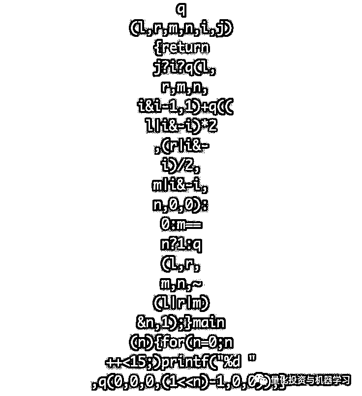

# 面试官：请拿出一段体现你水平的代码，该如何回答？

> 原文：[`mp.weixin.qq.com/s?__biz=MzAxNTc0Mjg0Mg==&mid=2653290542&idx=1&sn=927feb8909beac45786159c4d8dc2379&chksm=802dc23bb75a4b2d94ece38da8d6b3b8418c97324dfddcaa5bd40aebc5ea1ccf521752bfb484&scene=27#wechat_redirect`](http://mp.weixin.qq.com/s?__biz=MzAxNTc0Mjg0Mg==&mid=2653290542&idx=1&sn=927feb8909beac45786159c4d8dc2379&chksm=802dc23bb75a4b2d94ece38da8d6b3b8418c97324dfddcaa5bd40aebc5ea1ccf521752bfb484&scene=27#wechat_redirect)

**标星★公众号**，第一时间获取最新研究

本期作者：Milo Yip | 独家授权

作者介绍：腾讯 · 技术总监／专家工程师 

**近期原创文章：**

## ♥ [啥是佩琪？恕我直言，搞量化这样配齐！](https://mp.weixin.qq.com/s?__biz=MzAxNTc0Mjg0Mg==&mid=2653290316&idx=2&sn=0ef0f85a29c848ac6d554c16d847a2fd&chksm=802e3d59b759b44fe5cc65cc1480828cc8f05d12383a2caf1a5a60e950d2dfde899de79ab438&token=1330520237&lang=zh_CN&scene=21#wechat_redirect)

## ♥ [深入研读：利用 Twitter 情绪去预测股市](https://mp.weixin.qq.com/s?__biz=MzAxNTc0Mjg0Mg==&mid=2653290402&idx=1&sn=efda9ea106991f4f7ccabcae9d809e00&chksm=802e3db7b759b4a173dc8f2ab5c298ab3146bfd7dd5aca75929c74ecc999a53b195c16f19c71&token=1330520237&lang=zh_CN&scene=21#wechat_redirect)

## ♥ [Two Sigma 用新闻来预测股价走势，带你吊打 Kaggle](https://mp.weixin.qq.com/s?__biz=MzAxNTc0Mjg0Mg==&mid=2653290456&idx=1&sn=b8d2d8febc599742e43ea48e3c249323&chksm=802e3dcdb759b4db9279c689202101b6b154fb118a1c1be12b52e522e1a1d7944858dbd6637e&token=1330520237&lang=zh_CN&scene=21#wechat_redirect)

## ♥ [利用深度学习最新前沿预测股价走势](https://mp.weixin.qq.com/s?__biz=MzAxNTc0Mjg0Mg==&mid=2653290080&idx=1&sn=06c50cefe78a7b24c64c4fdb9739c7f3&chksm=802e3c75b759b563c01495d16a638a56ac7305fc324ee4917fd76c648f670b7f7276826bdaa8&token=770078636&lang=zh_CN&scene=21#wechat_redirect)

## ♥ [一位数据科学 PhD 眼中的算法交易](https://mp.weixin.qq.com/s?__biz=MzAxNTc0Mjg0Mg==&mid=2653290118&idx=1&sn=a261307470cf2f3e458ab4e7dc309179&chksm=802e3c93b759b585e079d3a797f512dfd0427ac02942339f4f1454bd368ba47be21cb52cf969&token=770078636&lang=zh_CN&scene=21#wechat_redirect)

## ♥ [基于 RNN 和 LSTM 的股市预测方法](https://mp.weixin.qq.com/s?__biz=MzAxNTc0Mjg0Mg==&mid=2653290481&idx=1&sn=f7360ea8554cc4f86fcc71315176b093&chksm=802e3de4b759b4f2235a0aeabb6e76b3e101ff09b9a2aa6fa67e6e824fc4274f68f4ae51af95&token=1865137106&lang=zh_CN&scene=21#wechat_redirect)

## ♥ [人工智能『AI』应用算法交易，7 个必踩的坑！](https://mp.weixin.qq.com/s?__biz=MzAxNTc0Mjg0Mg==&mid=2653289974&idx=1&sn=88f87cb64999d9406d7c618350aac35d&chksm=802e3fe3b759b6f5eca6e777364270cbaa0bf35e9a1535255be9751c3a77642676993a861132&token=770078636&lang=zh_CN&scene=21#wechat_redirect)

## ♥ [神经网络在算法交易上的应用系列（一）](https://mp.weixin.qq.com/s?__biz=MzAxNTc0Mjg0Mg==&mid=2653289962&idx=1&sn=5f5aa65ec00ce176501c85c7c106187d&chksm=802e3fffb759b6e9f2d4518f9d3755a68329c8753745333ef9d70ffd04bd088fd7b076318358&token=770078636&lang=zh_CN&scene=21#wechat_redirect)

## ♥ [预测股市 | 如何避免 p-Hacking，为什么你要看涨？](https://mp.weixin.qq.com/s?__biz=MzAxNTc0Mjg0Mg==&mid=2653289820&idx=1&sn=d3fee74ba1daab837433e4ef6b0ab4d9&chksm=802e3f49b759b65f422d20515942d5813aead73231da7d78e9f235bdb42386cf656079e69b8b&token=770078636&lang=zh_CN&scene=21#wechat_redirect)

## ♥ [如何鉴别那些用深度学习预测股价的花哨模型？](https://mp.weixin.qq.com/s?__biz=MzAxNTc0Mjg0Mg==&mid=2653290132&idx=1&sn=cbf1e2a4526e6e9305a6110c17063f46&chksm=802e3c81b759b597d3dd94b8008e150c90087567904a29c0c4b58d7be220a9ece2008956d5db&token=1266110554&lang=zh_CN&scene=21#wechat_redirect)

## ♥[ ](https://mp.weixin.qq.com/s?__biz=MzAxNTc0Mjg0Mg==&mid=2653290261&idx=2&sn=ee7cf7dabe50ed89adafdc92e980a48c&chksm=802e3d00b759b416875b2881ec5bc8a81d95208271c66f3680afd3cfbf27aa2e506398ae9e90&token=304730811&lang=zh_CN&scene=21#wechat_redirect)[优化强化学习 Q-learning 算法进行股市交易](https://mp.weixin.qq.com/s?__biz=MzAxNTc0Mjg0Mg==&mid=2653290286&idx=1&sn=882d39a18018733b93c8c8eac385b515&chksm=802e3d3bb759b42d1fc849f96bf02ae87edf2eab01b0beecd9340112c7fb06b95cb2246d2429&token=1330520237&lang=zh_CN&scene=21#wechat_redirect)

**一**

**面试官：**请拿出一段体现你水平的代码。

**候选人：**公司写的工程代码不好给你看，平常画的可以么？例如：



**面试官：**这什么鬼？！

**候选人：**其实我想画一颗皇后棋子⋯⋯

**如何实现？**

用 C 实现，只有一行一个语句，连空格 173 个字符：

```py
main(a,l,r,m,i,j,k){return a?printf("%d",main(0,0,0,0,0,0,8)):j?i?main(0,l,r,m,i&i-1,1,k)+main(0,(l|i&-i)*2,(r|i&-i)/2,m|i&-i,0,0,k-1):0:k?main(0,l,r,m,~(l|r|m)&255,1,k):1;}
```

编译执行：

```py
$ gcc -w -include stdio.h a.c && ./a.out
92
```

这个解答从@Comzyh 的回答 ，只是把迭代改成递归，以及用 main()作为递归函数。 

**更新 1：**评论@雾雨魔理沙说到标准是不容许 main() 递归的，我再给一个标准一点的，两个语句，连空格 154 个字符：

```py
q(l,r,m,i,j,k){return j?i?q(l,r,m,i&i-1,1,k)+q((l|i&-i)*2,(r|i&-i)/2,m|i&-i,0,0,k-1):0:k?q(l,r,m,~(l|r|m)&255,1,k):1;}main(){printf("%d",q(0,0,0,0,0,8));}
```

放不进一条 tweet。

**更新 2：**去掉 k，147 个字符：

```py
q(l,r,m,i,j){return j?i?q(l,r,m,i&i-1,1)+q((l|i&-i)*2,(r|i&-i)/2,m|i&-i,0,0):0:m==255?1:q(l,r,m,~(l|r|m)&255,1);}main(){printf("%d",q(0,0,0,0,0));}
```

改为 n-queen，函数本身 117 个字符，再加上打印 n=1...15（额外 61 个字符）：

```py
q(l,r,m,n,i,j){return j?i?q(l,r,m,n,i&i-1,1)+q((l|i&-i)*2,(r|i&-i)/2,m|i&-i,n,0,0):0:m-n?q(l,r,m,n,~(l|r|m)&n,1):1;} 
main(n){for(n=0;n++<15;)printf("%d ",q(0,0,0,(1<<n)-1,0,0));}
```

输出：

```py
1 0 0 2 10 4 40 92 352 724 2680 14200 73712 365596 2279184
```

答案符合 A000170 - OEIS

（*https://oeis.org/A000170*）


**更新 3：**一行或 10 行都不好看，来个 20 行的。


**更新 4：**把 m==n?a:b 改成 m-n?b:a，省一个字符，116 个字符：

```py
q(l,r,m,n,i,j){return j?i?q(l,r,m,n,i&i-1,1)+q((l|i&-i)*2,(r|i&-i)/2,m|i&-i,n,0,0):0:m-n?q(l,r,m,n,~(l|r|m)&n,1):1;} 
main(n){for(n=0;n++<15;)printf("%d ",q(0,0,0,(1<<n)-1,0,0));}
```

**二**

**面试官：**一堆乱码就当代码！有别的吗？

**候选人：**有的有的，不如看看这个网站⋯⋯（***https://www.shadertoy.com/view/XsdyWr***）

**面试官：**怎么给我看视频网站了？

**候选人：**这是我上年情人节画的玫瑰花⋯⋯


# **如何用计算几何模型画一束玫瑰花？**

C 语言版本的源文件在 rose.c 。

***https://github.com/miloyip/misc/blob/master/rose/rose.c***

一些注意的地方如下： 

1、生成的文本是 160x80 个字符，如命令行不能显示这么多字符，可重定向到文件（如 ），用编辑器打开。

2、要加入名字等字符，修改 146 行，如插入 "milo"（这里接入"olim" 会好看一些），并把最后的 12.0f 改成 16.0f：

```py
putchar(" .,-:;+=olim*#@@"[(int)(f(make2((x / 160.0f - 0.5f) * 2.0f, (y / 80.0f - 0.5f) * -2.0f)) * 16.0f)]);
```

3、第 143 行用 ANSI 转义序列 改变文本颜色，需要终端支持。可按需修改颜色。 

4、第 128、129 行是摄影机的位置和方向，建议修改。可在 ShaderToy 里试好才改 C 文件。

**三**

**面试官：**够了！你以为我们请画家吗？ 

**候选人：**其实我还真准备了一幅画⋯⋯ （从包里淘出一张 A3 纸）


**面试官：**素描吗？唉⋯⋯我们是请程序员啊。话说，Leon 是谁？你不是叫 Leon 吧？ 

**候选人：**Leon 是我做的机器人，这是他帮我画的。

# **《写生机器人》制作经验分享（上）**

***地址：https://zhuanlan.zhihu.com/p/32084037***

**面试官：**这是人工智能么？ 

**候选人：**不是不是，只是些图像处理和图形学的小玩意，几百块的材料⋯⋯ 

**面试官****：**我就知道你不会人工智能，就会玩玩具。但不要紧，你会编程吧？你听说过 VC 六吗？ 

**候选人：**Microsoft Visual C plus plus six？ 

**面试官：**我说「V-C-六」啊。 

**候选人：**啊，以前念大二的时候有用过「V-C-六」来做人工智能的功课。


# **《美绿中国象棋》制作过程及算法简介**

*http://miloyip.com/2010/milo-chinese-chess/*

**面试官：**厉害啊，你下了个游戏来当功课啊。 

**候选人：**不是啊，UI 都是自己用 OpenGL 画的。 

**面试官：**啥芝欸路，你不知道「V-C-六」有 「M-F-C」 吗？ 

**候选人：**以前没怎么用⋯⋯ 

**面试官：**算了算了，其实我们也只是需要程序员处理一下数据，不太需要 MFC。不过啊，他们说想换用一个比较快的「J-S-O-N」库，VC6 编译不了，那个叫什么 「拉屁 J-S-O-N」。你觉得能搞得定吗？ 

**候选人：**RapidJSON 吗？嗯⋯⋯有点难啊「V-C-六」的模板支持不太好。但我写过一个 C 语言的，兼容性一定没问题！

# **从零开始的 JSON 库教程**

*https://zhuanlan.zhihu.com/p/22457315*

**面试官：**那个啊，你抄那个没问题吧？ 

**候选人：**虽然教程拖了这么久还没写完，但代码已经是完整的，没问题的！ 

**面试官：**好吧，那你明天就上班抄这个吧！看你什么都不懂，文体两开花，就六块吧！ 

**候选人：**六块时薪？ 

**面试官：**六块年薪！ 

**面试官&候选人：****乐快年新！**

*文章来自：*

*https://www.zhihu.com/question/309675877/answer/587575915*

**推荐阅读**

[01、经过多年交易之后你应该学到的东西（深度分享）](https://mp.weixin.qq.com/s?__biz=MzAxNTc0Mjg0Mg==&mid=2653289074&idx=1&sn=e859d363eef9249236244466a1af41b6&chksm=802e3867b759b1717f77e07a51ee5671e8115130c66562577280ba1243cba08218add04f1f00&token=449379994&lang=zh_CN&scene=21#wechat_redirect)

[02、监督学习标签在股市中的应用（代码+书籍）](https://mp.weixin.qq.com/s?__biz=MzAxNTc0Mjg0Mg==&mid=2653289050&idx=1&sn=60043a5c95b877dd329a5fd150ddacc4&chksm=802e384fb759b1598e500087374772059aa21b31ae104b3dca04331cf4b63a233c5e04c1945a&token=449379994&lang=zh_CN&scene=21#wechat_redirect)

[03、全球投行顶尖机器学习团队全面分析](https://mp.weixin.qq.com/s?__biz=MzAxNTc0Mjg0Mg==&mid=2653289018&idx=1&sn=8c411f676c2c0d92b0dd218f041bee4b&chksm=802e382fb759b139ffebf633ac14cdd0f21938e4613fe632d5d9231dab3d2aca95a11628378a&token=449379994&lang=zh_CN&scene=21#wechat_redirect)

[04、使用 Tensorflow 预测股票市场变动](https://mp.weixin.qq.com/s?__biz=MzAxNTc0Mjg0Mg==&mid=2653289014&idx=1&sn=3762d405e332c599a21b48a7dc4df587&chksm=802e3823b759b135928d55044c2729aea9690f86752b680eb973d1a376dc53cfa18287d0060b&token=449379994&lang=zh_CN&scene=21#wechat_redirect)

[05、使用 LSTM 预测股票市场基于 Tensorflow](https://mp.weixin.qq.com/s?__biz=MzAxNTc0Mjg0Mg==&mid=2653289238&idx=1&sn=3144f5792f84455dd53c27a78e8a316c&chksm=802e3903b759b015da88acde4fcbc8547ab3e6acbb5a0897404bbefe1d8a414265d5d5766ee4&token=2020206794&lang=zh_CN&scene=21#wechat_redirect)

[06、美丽的回测——教你定量计算过拟合概率](https://mp.weixin.qq.com/s?__biz=MzAxNTc0Mjg0Mg==&mid=2653289314&idx=1&sn=87c5a12b23a875966db7be50d11f09cd&chksm=802e3977b759b061675d1988168c1fec06c602e8583fbcc9b76f87008e0c10b702acc85467a0&token=1972390229&lang=zh_CN&scene=21#wechat_redirect)

[07、利用动态深度学习预测金融时间序列基于 Python](https://mp.weixin.qq.com/s?__biz=MzAxNTc0Mjg0Mg==&mid=2653289347&idx=1&sn=bf5d7899bc4a854d4ba9046fdc6fe0d6&chksm=802e3996b759b080287213840987bb0a0c02e4e1d4d7aae23f10a225a92ef6dd922d8006123d&token=290397496&lang=zh_CN&scene=21#wechat_redirect)

[08、Facebook 开源神器 Prophet 预测时间序列基于 Python](https://mp.weixin.qq.com/s?__biz=MzAxNTc0Mjg0Mg==&mid=2653289394&idx=1&sn=24a836136d730aa268605628e683d629&chksm=802e39a7b759b0b1dcf7aaa560699130a907716b71fc9c45ff0e5d236c5ae8ef80ebdb09dbb6&token=290397496&lang=zh_CN&scene=21#wechat_redirect)

[09、Facebook 开源神器 Prophet 预测股市行情基于 Python](https://mp.weixin.qq.com/s?__biz=MzAxNTc0Mjg0Mg==&mid=2653289437&idx=1&sn=f0dca7da8e69e7ba736992cb3d034ce7&chksm=802e39c8b759b0de5bce401c580623d0729ecca69d13926479d36e19aff8c9c9e8a20265afff&token=290397496&lang=zh_CN&scene=21#wechat_redirect)

[10、2018 第三季度最受欢迎的券商金工研报前 50（附下载）](https://mp.weixin.qq.com/s?__biz=MzAxNTc0Mjg0Mg==&mid=2653289358&idx=1&sn=db6e8ab85b08f6e67790ec0e401e586e&chksm=802e399bb759b08d6eec855f9901ea856d0da68c7425cba62791b8948da6ad761a3d88543dad&token=290397496&lang=zh_CN&scene=21#wechat_redirect)

[11、实战交易策略的精髓（公众号深度呈现）](https://mp.weixin.qq.com/s?__biz=MzAxNTc0Mjg0Mg==&mid=2653289447&idx=1&sn=f2948715bf82569a6556d518e56c1f9e&chksm=802e39f2b759b0e4502d1aaac562b87789573b55c76b3c85897d8c9d88dbf9a0b7ee34d86a4e&token=290397496&lang=zh_CN&scene=21#wechat_redirect)

[12、Markowitz 有效边界和投资组合优化基于 Python](https://mp.weixin.qq.com/s?__biz=MzAxNTc0Mjg0Mg==&mid=2653289478&idx=1&sn=f8e01a641be021993d8ef2d84e94a299&chksm=802e3e13b759b7055cf27a280c672371008a5564c97c658eee89ce8481396a28d254836ff9af&token=290397496&lang=zh_CN&scene=21#wechat_redirect)

[13、使用 LSTM 模型预测股价基于 Keras](https://mp.weixin.qq.com/s?__biz=MzAxNTc0Mjg0Mg==&mid=2653289495&idx=1&sn=c4eeaa2e9f9c10995be9ea0c56d29ba7&chksm=802e3e02b759b7148227675c23c403fb9a543b733e3d27fa237b53840e030bf387a473d83e3c&token=1260956004&lang=zh_CN&scene=21#wechat_redirect)

[14、量化金融导论 1：资产收益的程式化介绍基于 Python](https://mp.weixin.qq.com/s?__biz=MzAxNTc0Mjg0Mg==&mid=2653289507&idx=1&sn=f0ca71aa07531bbbdbd33213f0bab89f&chksm=802e3e36b759b720138b3b17a4dd0e198e054b9de29a038fdd50805f824effa55831111ad026&token=1936245282&lang=zh_CN&scene=21#wechat_redirect)

[15、预测股市崩盘基于统计机器学习与神经网络（Python+文档）](https://mp.weixin.qq.com/s?__biz=MzAxNTc0Mjg0Mg==&mid=2653289533&idx=1&sn=4ef964834e84a9995111bb057b0fc5dd&chksm=802e3e28b759b73e0618eb1262c53aa0601fbf5805525a7c7ff40dc3db62c7704496611bdbf1&token=1950551577&lang=zh_CN&scene=21#wechat_redirect)

[16、实现最优投资组合有效前沿基于 Python（附代码）](https://mp.weixin.qq.com/s?__biz=MzAxNTc0Mjg0Mg==&mid=2653289609&idx=1&sn=c7f0b3e47025862d10bb53b6ab88bcda&chksm=802e3e9cb759b78abf6b8b049c59bf18ccfb2ead7580d1f557d36de2292f59dcbd94dcd41910&token=2085008037&lang=zh_CN&scene=21#wechat_redirect)

[17、精心为大家整理了一些超级棒的机器学习资料（附链接）](https://mp.weixin.qq.com/s?__biz=MzAxNTc0Mjg0Mg==&mid=2653289615&idx=1&sn=1cdc89afb997d0c580bf0cef296d946c&chksm=802e3e9ab759b78ce9f0cd152a680d4a413d6c8dcb02a7a296f4091993a7e4137e7520394575&token=2085008037&lang=zh_CN&scene=21#wechat_redirect)

[18、海量 Wind 数据，与全网用户零距离邂逅！](https://mp.weixin.qq.com/s?__biz=MzAxNTc0Mjg0Mg==&mid=2653289623&idx=1&sn=28a3600fd7a72d7be00b066ca0f98244&chksm=802e3e82b759b7943f43a4f6ef4a91e4153fa6b8210de9590235fa8ee66eb9811ce177054dbc&token=1389401983&lang=zh_CN&scene=21#wechat_redirect)

[19、机器学习、深度学习、量化金融、Python 等最新书籍汇总下载](https://mp.weixin.qq.com/s?__biz=MzAxNTc0Mjg0Mg==&mid=2653289640&idx=1&sn=34e94fcbe99052b8e7381ecc48a36dc0&chksm=802e3ebdb759b7ab897cd329a680715b6f8294e63550ddf0c57b9e1320b2b7d1408c6fdca0c7&token=1389401983&lang=zh_CN&scene=21#wechat_redirect)

[20、各大卖方 2019 年 A 股策略报告，都是有故事的人！](https://mp.weixin.qq.com/s?__biz=MzAxNTc0Mjg0Mg==&mid=2653289725&idx=1&sn=4b65cd1fb8331438e4c0b3d0eae6b51f&chksm=802e3ee8b759b7fe1b94e84d54cc23b0ab05853d5cd227812574b350e9fc2cce9e5f1bc6cb7a&token=1389401983&lang=zh_CN&scene=21#wechat_redirect)

**扫码关注我们**

