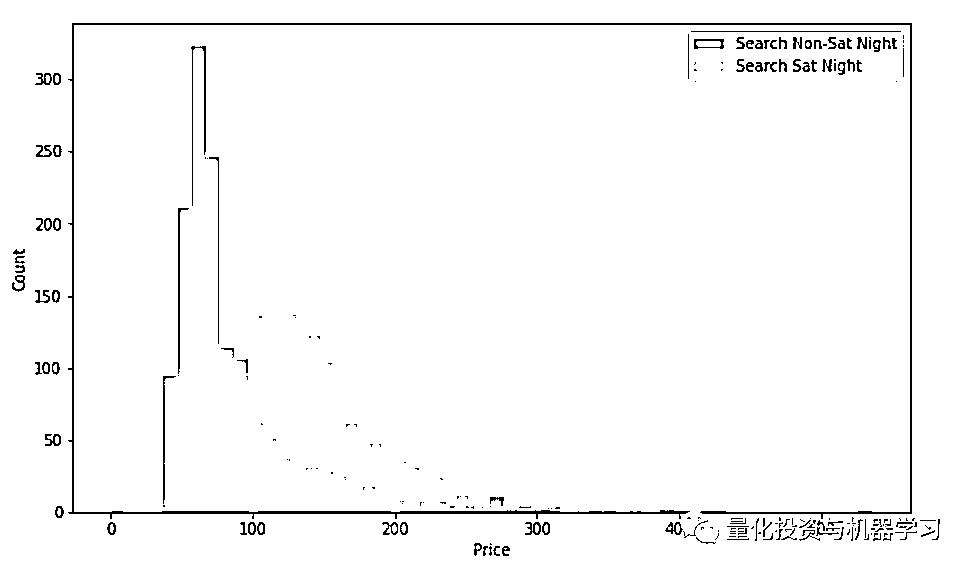

# 基于机器学习算法的时间序列价格异常检测（附代码）

> 原文：[`mp.weixin.qq.com/s?__biz=MzAxNTc0Mjg0Mg==&mid=2653290530&idx=1&sn=7008fc46129106703a05fdfef1ddd4e6&chksm=802dc237b75a4b2173af42e9703c8591e3a4a37e50b2825f5a00cdba1099b49297f2300169e6&scene=27#wechat_redirect`](http://mp.weixin.qq.com/s?__biz=MzAxNTc0Mjg0Mg==&mid=2653290530&idx=1&sn=7008fc46129106703a05fdfef1ddd4e6&chksm=802dc237b75a4b2173af42e9703c8591e3a4a37e50b2825f5a00cdba1099b49297f2300169e6&scene=27#wechat_redirect)

**标星★公众号**，第一时间获取最新研究

本期作者：Susan Li

本期编辑：Chloe | 公众号翻译部成员

**近期原创文章：**

## ♥ [啥是佩琪？恕我直言，搞量化这样配齐！](https://mp.weixin.qq.com/s?__biz=MzAxNTc0Mjg0Mg==&mid=2653290316&idx=2&sn=0ef0f85a29c848ac6d554c16d847a2fd&chksm=802e3d59b759b44fe5cc65cc1480828cc8f05d12383a2caf1a5a60e950d2dfde899de79ab438&token=1330520237&lang=zh_CN&scene=21#wechat_redirect)

## ♥ [深入研读：利用 Twitter 情绪去预测股市](https://mp.weixin.qq.com/s?__biz=MzAxNTc0Mjg0Mg==&mid=2653290402&idx=1&sn=efda9ea106991f4f7ccabcae9d809e00&chksm=802e3db7b759b4a173dc8f2ab5c298ab3146bfd7dd5aca75929c74ecc999a53b195c16f19c71&token=1330520237&lang=zh_CN&scene=21#wechat_redirect)

## ♥ [Two Sigma 用新闻来预测股价走势，带你吊打 Kaggle](https://mp.weixin.qq.com/s?__biz=MzAxNTc0Mjg0Mg==&mid=2653290456&idx=1&sn=b8d2d8febc599742e43ea48e3c249323&chksm=802e3dcdb759b4db9279c689202101b6b154fb118a1c1be12b52e522e1a1d7944858dbd6637e&token=1330520237&lang=zh_CN&scene=21#wechat_redirect)

## ♥ [利用深度学习最新前沿预测股价走势](https://mp.weixin.qq.com/s?__biz=MzAxNTc0Mjg0Mg==&mid=2653290080&idx=1&sn=06c50cefe78a7b24c64c4fdb9739c7f3&chksm=802e3c75b759b563c01495d16a638a56ac7305fc324ee4917fd76c648f670b7f7276826bdaa8&token=770078636&lang=zh_CN&scene=21#wechat_redirect)

## ♥ [一位数据科学 PhD 眼中的算法交易](https://mp.weixin.qq.com/s?__biz=MzAxNTc0Mjg0Mg==&mid=2653290118&idx=1&sn=a261307470cf2f3e458ab4e7dc309179&chksm=802e3c93b759b585e079d3a797f512dfd0427ac02942339f4f1454bd368ba47be21cb52cf969&token=770078636&lang=zh_CN&scene=21#wechat_redirect)

## ♥ [基于 RNN 和 LSTM 的股市预测方法](https://mp.weixin.qq.com/s?__biz=MzAxNTc0Mjg0Mg==&mid=2653290481&idx=1&sn=f7360ea8554cc4f86fcc71315176b093&chksm=802e3de4b759b4f2235a0aeabb6e76b3e101ff09b9a2aa6fa67e6e824fc4274f68f4ae51af95&token=1865137106&lang=zh_CN&scene=21#wechat_redirect)

## ♥ [人工智能『AI』应用算法交易，7 个必踩的坑！](https://mp.weixin.qq.com/s?__biz=MzAxNTc0Mjg0Mg==&mid=2653289974&idx=1&sn=88f87cb64999d9406d7c618350aac35d&chksm=802e3fe3b759b6f5eca6e777364270cbaa0bf35e9a1535255be9751c3a77642676993a861132&token=770078636&lang=zh_CN&scene=21#wechat_redirect)

## ♥ [神经网络在算法交易上的应用系列（一）](https://mp.weixin.qq.com/s?__biz=MzAxNTc0Mjg0Mg==&mid=2653289962&idx=1&sn=5f5aa65ec00ce176501c85c7c106187d&chksm=802e3fffb759b6e9f2d4518f9d3755a68329c8753745333ef9d70ffd04bd088fd7b076318358&token=770078636&lang=zh_CN&scene=21#wechat_redirect)

## ♥ [预测股市 | 如何避免 p-Hacking，为什么你要看涨？](https://mp.weixin.qq.com/s?__biz=MzAxNTc0Mjg0Mg==&mid=2653289820&idx=1&sn=d3fee74ba1daab837433e4ef6b0ab4d9&chksm=802e3f49b759b65f422d20515942d5813aead73231da7d78e9f235bdb42386cf656079e69b8b&token=770078636&lang=zh_CN&scene=21#wechat_redirect)

## ♥ [如何鉴别那些用深度学习预测股价的花哨模型？](https://mp.weixin.qq.com/s?__biz=MzAxNTc0Mjg0Mg==&mid=2653290132&idx=1&sn=cbf1e2a4526e6e9305a6110c17063f46&chksm=802e3c81b759b597d3dd94b8008e150c90087567904a29c0c4b58d7be220a9ece2008956d5db&token=1266110554&lang=zh_CN&scene=21#wechat_redirect)

## ♥[ ](https://mp.weixin.qq.com/s?__biz=MzAxNTc0Mjg0Mg==&mid=2653290261&idx=2&sn=ee7cf7dabe50ed89adafdc92e980a48c&chksm=802e3d00b759b416875b2881ec5bc8a81d95208271c66f3680afd3cfbf27aa2e506398ae9e90&token=304730811&lang=zh_CN&scene=21#wechat_redirect)[优化强化学习 Q-learning 算法进行股市交易](https://mp.weixin.qq.com/s?__biz=MzAxNTc0Mjg0Mg==&mid=2653290286&idx=1&sn=882d39a18018733b93c8c8eac385b515&chksm=802e3d3bb759b42d1fc849f96bf02ae87edf2eab01b0beecd9340112c7fb06b95cb2246d2429&token=1330520237&lang=zh_CN&scene=21#wechat_redirect)

**正文**

异常检测是指检测数据集里面与其他数据不相符的数据点。

异常检测也称为异常值检测，是一种数据挖掘过程，用于确定数据集中发现的异常类型并确定其出现的详细信息。 **在当今世界，由于大量数据无法手动标记异常值，自动异常检测显得至关重要**。 自动异常检测具有广泛的应用，例如欺诈检测，系统健康监测，故障检测以及传感器网络中的事件检测系统等。

你是否有过这样的经历，比如，你经常前往某个目的地进行商务旅行，并且你总是住在同一家酒店。虽然大部分时间那里的房价几乎总是相似的，但偶尔相同的酒店，相同的房间类型，费率却高得令人无法接受，以致于你必须换到另一家酒店，因为你的旅行补贴不能包含这么高的价格。我经历了好几次这样的事情，这让我想到，如果我们能够创建一个模型来自动检测这种价格异常会怎么样呢？

当然某些情况下，一些异常在我们这一生中也只会发生一次，并且我们会事先知道它们的发生，还知道在未来每年的相同时间几乎不会再发生，例如 2019 年 2 月 2 日至 2 月 4 日亚特兰大荒谬的酒店价格（译者注：2019 年 2 月 3 日，第 53 届超级碗比赛在亚特兰大梅赛德斯——奔驰体育场举行）。


在这篇文章中，我们将探讨不同的异常检测技术，我们的目标是在无监督学习的情况下考察酒店房间价格的时间序列中所在的异常。让我们开始吧！

**数据获取**

事实上要获取全部数据非常困难，我只能得到一些不完美的数据。

```py
import pandas as pd
import numpy as np
import matplotlib.dates as md
import matplotlib.pyplot as plt
from mpl_toolkits.axes_grid1 import host_subplot
import mpl_toolkits.axisartist as AA
from sklearn.preprocessing import StandardScaler
from sklearn.decomposition import PCA
from sklearn.cluster import KMeans
from sklearn.covariance import EllipticEnvelope
from pyemma import msm
from sklearn.ensemble import IsolationForest
from sklearn.svm import OneClassSVM
from mpl_toolkits.mplot3d import Axes3D
from pyemma import msm
%matplotlib inline
```

我们将使用的数据是 Personalize Expedia Hotel Searches 数据集的子集，读者可在此处找到（*https://www.kaggle.com/c/expedia-personalized-sort/data*，其中训练集为 train.csv，测试集为 test.csv）。

我们打算按如下方式对训练集 train.csv 的一个子集进行剪切：

*   选择包含数据点最多的一个酒店 property_id = 104517。

*   选择 visitor_location_country_id = 219 ，国家 ID 219 是指美国。 我们这样做是为了统一 price_usd 列。由于不同国家在显示税费方面有不同的惯例，所以此列的价格可能是每晚或整个住宿的。而我们知道此列向美国游客展示的价格总是每晚不含税的。

*   选择 search_room_count = 1。

*   选择我们需要的特征：date_time，price_usd，srch_booking_window，srch_saturday_night_bool。

```py
expedia = pd.read_csv('expedia_train.csv')
df = expedia.loc[expedia['prop_id'] == 104517]
df = df.loc[df['srch_room_count'] == 1]
df = df.loc[df['visitor_location_country_id'] == 219]
df = df[['date_time', 'price_usd', 'srch_booking_window', 'srch_saturday_night_bool']]
```

进行数据剪切后，我们将要适用的数据如下：

```py
df.info()
```

 

```py
df['price_usd'].describe()
```


至此，我们已经检测到一个极端异常，即最大 price_usd 是 5584 美元。

如果某单一数据点可被视为相应于其余数据的异常，我们则称之为**Point Anomalies**（例如，购买具有大的交易价值的物品）。我们可以回去检查搜索日志，看看它是什么。 经过一番调查后，我猜它要么是一个错误要么是用户偶然搜索了一个总统套房而无意预订或查看。为了找到更多不是极端的异常，决定删除这个点。

```py
expedia.loc[(expedia['price_usd'] == 5584) & 
(expedia['visitor_location_country_id'] == 219)]
```


```py
df = df.loc[df['price_usd'] < 5584]
```

至此，我相信你已经发现我们遗漏了一些东西，也就是说，我们不知道用户搜索的房间类型，标准间的价格可能与大床海景房的价格有很大差异。请记住这一点，但为了示范目的，我们不得不继续。

**时间序列可视化**

```py
df.plot(x='date_time', y='price_usd', figsize=(12,6))
plt.xlabel('Date time')
plt.ylabel('Price in USD')
plt.title('Time Series of room price by date time of search');
```


```py
a = df.loc[df['srch_saturday_night_bool'] == 0, 'price_usd']
b = df.loc[df['srch_saturday_night_bool'] == 1, 'price_usd']
plt.figure(figsize=(10, 6))
plt.hist(a, bins = 50, alpha=0.5, label='Search Non-Sat Night')
plt.hist(b, bins = 50, alpha=0.5, label='Search Sat Night')
plt.legend(loc='upper right')
plt.xlabel('Price')
plt.ylabel('Count')
plt.show();
```



一般来说，搜索非周六晚上的价格会更稳定且更低，而周六晚上的价格通常会上涨，看来这家酒店在周末很受欢迎。

**基于聚类算法的异常检测**

**k-means 算法**

k-means 是一种应用广泛的聚类算法。它创建了 k 个类似的数据点集（即聚类），不属于这些组的数据可能会被标记为异常。在我们开始应用 k-means 算法之前，先使用 elbow 方法来确定最佳聚类数。

```py
data = df[['price_usd', 'srch_booking_window', 'srch_saturday_night_bool']]
n_cluster = range(1, 20)
kmeans = [KMeans(n_clusters=i).fit(data) for i in n_cluster]
scores = [kmeans[i].score(data) for i in range(len(kmeans))]

fig, ax = plt.subplots(figsize=(10,6))
ax.plot(n_cluster, scores)
plt.xlabel('Number of Clusters')
plt.ylabel('Score')
plt.title('Elbow Curve')
plt.show();
```


从上面的肘曲线我们看到，图形在聚类数目为 10 之后趋于平稳，这意味着添加更多聚类并不能解释我们相关变量中的更多方差。 

我们设置 n_clusters = 10，并将 k-means 的输出数据绘制成 3D 聚类图。

```py
X = df[['price_usd', 'srch_booking_window', 'srch_saturday_night_bool']]
X = X.reset_index(drop=True)
km = KMeans(n_clusters=10)
km.fit(X)
km.predict(X)
labels = km.labels_
#Plotting
fig = plt.figure(1, figsize=(7,7))
ax = Axes3D(fig, rect=[0, 0, 0.95, 1], elev=48, azim=134)
ax.scatter(X.iloc[:,0], X.iloc[:,1], X.iloc[:,2],
          c=labels.astype(np.float), edgecolor="k")
ax.set_xlabel("price_usd")
ax.set_ylabel("srch_booking_window")
ax.set_zlabel("srch_saturday_night_bool")
plt.title("K Means", fontsize=14);
```


现在我们需要用 PCA（Principal component analysis，主成分分析）算法确定保留多少个特征是最合适的。

```py
data = df[['price_usd', 'srch_booking_window', 'srch_saturday_night_bool']]
X = data.values
X_std = StandardScaler().fit_transform(X)
mean_vec = np.mean(X_std, axis=0)
cov_mat = np.cov(X_std.T)
eig_vals, eig_vecs = np.linalg.eig(cov_mat)
eig_pairs = [ (np.abs(eig_vals[i]),eig_vecs[:,i]) for i in range(len(eig_vals))]
eig_pairs.sort(key = lambda x: x[0], reverse= True)
tot = sum(eig_vals)
var_exp = [(i/tot)*100 for i in sorted(eig_vals, reverse=True)] # Individual explained variance
cum_var_exp = np.cumsum(var_exp) # Cumulative explained variance

plt.figure(figsize=(10, 5))
plt.bar(range(len(var_exp)), var_exp, alpha=0.3, align='center', label='individual explained variance', color = 'g')
plt.step(range(len(cum_var_exp)), cum_var_exp, where='mid',label='cumulative explained variance')
plt.ylabel('Explained variance ratio')
plt.xlabel('Principal components')
plt.legend(loc='best')
```


我们看到第一个成分 price_usd 解释了近 50％的差异，第二个成分 srch_booking_window 解释了超过 30％。但同时我们也必须注意到，几乎没有任何成分可以忽略不计。由于前两个成分包含 80％以上的信息，所以我们将设置 n_components = 2。 

基于聚类算法的异常检测的基本假设是，如果我们对数据进行聚类划分，则正常数据将属于聚类，而异常数据将不属于任何聚类或属于小聚类。我们使用以下步骤来查找和可视化异常数据。

*   计算每个点与其最近的质心点之间的距离，最大的距离被认为是异常的。

*   我们使用 outliers_fraction 为算法提供有关数据集中存在的异常值比例的信息，不同的数据集这个参数的设置也不尽相同。然而，我首先给出初始估计 outliers_fraction = 0.01，因为在标准正态分布中它的百分比与均值的 Z score 距离的绝对值超过了 3。

*   使用 outliers_fraction 计算 number_of_outliers。

*   将 threshold 设置为这些异常值的最小距离。

*   异常检测结果 anomaly1 包含了上述方法（0：正常，1：异常）。

*   使用聚类视图可视化异常点。 

*   使用时间序列视图可视化异常点。

```py
def getDistanceByPoint(data, model):
    distance = pd.Series()
    for i in range(0,len(data)):
        Xa = np.array(data.loc[i])
        Xb = model.cluster_centers_[model.labels_[i]-1]
        distance.set_value(i, np.linalg.norm(Xa-Xb))
    return distance

outliers_fraction = 0.01
# get the distance between each point and its nearest centroid. The biggest distances are considered as anomaly
distance = getDistanceByPoint(data, kmeans[9])
number_of_outliers = int(outliers_fraction*len(distance))
threshold = distance.nlargest(number_of_outliers).min()
# anomaly1 contain the anomaly result of the above method Cluster (0:normal, 1:anomaly) 
df['anomaly1'] = (distance >= threshold).astype(int)

# visualisation of anomaly with cluster view
fig, ax = plt.subplots(figsize=(10,6))
colors = {0:'blue', 1:'red'}
ax.scatter(df['principal_feature1'], df['principal_feature2'], c=df["anomaly1"].apply(lambda x: colors[x]))
plt.xlabel('principal feature1')
plt.ylabel('principal feature2')
plt.show();
```


```py
df = df.sort_values('date_time')
df['date_time_int'] = df.date_time.astype(np.int64)
fig, ax = plt.subplots(figsize=(10,6))
a = df.loc[df['anomaly1'] == 1, ['date_time_int', 'price_usd']] #anomaly

ax.plot(df['date_time_int'], df['price_usd'], color='blue', label='Normal')
ax.scatter(a['date_time_int'],a['price_usd'], color='red', label='Anomaly')
plt.xlabel('Date Time Integer')
plt.ylabel('price in USD')
plt.legend()
plt.show();
```


看起来由 k-means 聚类算法获得的异常价格要么是非常高的费率要么是非常低的费率。

**基于孤立森林算法的异常检测**

孤立森林算法来检测异常纯粹是基于一个事实：异常点是少数的和不同的。该算法在不采用任何距离或密度测量的情况下实现异常点隔离，这与基于聚类的或基于距离的算法有根本的不同。

*   在应用孤立森林模型时，我们设置 contamination = outliers_fraction，即告诉模型数据集中的异常值比例为 0.01。

*   fit 和 predict(data)对数据执行异常检测，返回 1 表示正常，-1 表示异常。

*   最后，我们使用时间序列视图可视化异常点。

```py
data = df[['price_usd', 'srch_booking_window', 'srch_saturday_night_bool']]
scaler = StandardScaler()
np_scaled = scaler.fit_transform(data)
data = pd.DataFrame(np_scaled)
# train isolation forest
model =  IsolationForest(contamination=outliers_fraction)
model.fit(data) 
df['anomaly2'] = pd.Series(model.predict(data))

# visualization
fig, ax = plt.subplots(figsize=(10,6))

a = df.loc[df['anomaly2'] == -1, ['date_time_int', 'price_usd']] #anomaly

ax.plot(df['date_time_int'], df['price_usd'], color='blue', label = 'Normal')
ax.scatter(a['date_time_int'],a['price_usd'], color='red', label = 'Anomaly')
plt.legend()
plt.show();
```


**基于支持向量机算法的异常检测**

SVM 通常与监督学习相关联，但 OneClassSVM 可将异常检测问题看作无监督学习问题，其学习一个用于异常检测的决策函数：将新数据分类为与训练集相似或不同两类。

**OneClassSVM**

根据文章《Support Vector Method for Novelty Detection》（***http://users.cecs.anu.edu.au/~williams/papers/P126.pdf***），我们知道 SVM 是最大化几何边缘区的方法，而不是构建一个概率分布模型。SVM 用于异常检测的思想在于寻找一个函数，使得其在高密度点区域取值为正在低密度点区域取值为负。

*   在拟合 OneClassSVM 模型时，我们设置 nu = outliers_fraction，它是训练误差分数的上限和支持向量分数的下限，并且必须在 0 和 1 之间。基本上这恰好与我们期望的数据集中的异常值比例相符。

*   指定要在算法中使用的内核类型：rbf，这将使 SVM 能够使用非线性函数将超空间投影到更高的维度。

*   gamma 是 RBF 核类型的参数，并控制各个训练样本的影响——这会影响模型的“平滑度”。通过实验，我没有发现任何显著差异。

*   predict(data) 对数据进行分类，因为我们的模型是单类模型，所以返回+1 或-1，其中-1 表示异常，1 表示正常。

```py
data = df[['price_usd', 'srch_booking_window', 'srch_saturday_night_bool']]
scaler = StandardScaler()
np_scaled = scaler.fit_transform(data)
data = pd.DataFrame(np_scaled)
# train oneclassSVM 
model = OneClassSVM(nu=outliers_fraction, kernel="rbf", gamma=0.01)
model.fit(data)
df['anomaly3'] = pd.Series(model.predict(data))

fig, ax = plt.subplots(figsize=(10,6))
a = df.loc[df['anomaly3'] == -1, ['date_time_int', 'price_usd']] #anomaly

ax.plot(df['date_time_int'], df['price_usd'], color='blue')
ax.scatter(a['date_time_int'],a['price_usd'], color='red')
plt.show();
```


**基于高斯分布的异常检测**

高斯分布也称为正态分布。我们将使用高斯分布来开发异常检测算法，也就是说，假设我们的数据是正态分布的。这个假设不能适用于所有的数据集，但是当它成立时，却提供了一种有效的方法来发现异常值。

Scikit-Learn 的 covariance.EllipticEnvelope 是一个函数，它通过假设我们的整个数据集满足多元高斯分布，从而计算数据集一般分布的关键参数。过程如下：

*   根据前面定义的类别创建两个不同的数据集：search_Sat_night，Search_Non_Sat_night。

*   对每个类别相应的数据集应用 EllipticEnvelope（高斯分布）。

*   设置 contamination 参数，即我们数据集中异常值的比例。

*   我们使用 decision_function 来计算给定观察点的决策函数。它等于移位的 Mahalanobis 距离。异常值的阈值为 0，确保了与其他异常值检测算法的兼容性。

*   predict(X_train) 根据拟合模型来预测 X_train 的标签（1 表示正常，-1 表示异常）。

```py
df_class0 = df.loc[df['srch_saturday_night_bool'] == 0, 'price_usd']
df_class1 = df.loc[df['srch_saturday_night_bool'] == 1, 'price_usd']

fig, axs = plt.subplots(1,2)
df_class0.hist(ax=axs[0], bins=30)
df_class1.hist(ax=axs[1], bins=30);
```


```py
envelope =  EllipticEnvelope(contamination = outliers_fraction) 
X_train = df_class0.values.reshape(-1,1)
envelope.fit(X_train)
df_class0 = pd.DataFrame(df_class0)
df_class0['deviation'] = envelope.decision_function(X_train)
df_class0['anomaly'] = envelope.predict(X_train)

envelope =  EllipticEnvelope(contamination = outliers_fraction) 
X_train = df_class1.values.reshape(-1,1)
envelope.fit(X_train)
df_class1 = pd.DataFrame(df_class1)
df_class1['deviation'] = envelope.decision_function(X_train)
df_class1['anomaly'] = envelope.predict(X_train)

# plot the price repartition by categories with anomalies
a0 = df_class0.loc[df_class0['anomaly'] == 1, 'price_usd']
b0 = df_class0.loc[df_class0['anomaly'] == -1, 'price_usd']

a2 = df_class1.loc[df_class1['anomaly'] == 1, 'price_usd']
b2 = df_class1.loc[df_class1['anomaly'] == -1, 'price_usd']

fig, axs = plt.subplots(1,2)
axs[0].hist([a0,b0], bins=32, stacked=True, color=['blue', 'red'])
axs[1].hist([a2,b2], bins=32, stacked=True, color=['blue', 'red'])
axs[0].set_title("Search Non Saturday Night")
axs[1].set_title("Search Saturday Night")
plt.show();
```


```py
# add the data to the main 
df_class = pd.concat([df_class0, df_class1])
df['anomaly5'] = df_class['anomaly']
# df['anomaly5'] = np.array(df['anomaly22'] == -1).astype(int)
fig, ax = plt.subplots(figsize=(10, 6))
a = df.loc[df['anomaly5'] == -1, ('date_time_int', 'price_usd')] #anomaly
ax.plot(df['date_time_int'], df['price_usd'], color='blue', label='Normal')
ax.scatter(a['date_time_int'],a['price_usd'], color='red', label='Anomaly')
plt.legend()
plt.show();
```


有趣的是可以看到，以这种方式检测到的异常点只有异常的高价点而没有异常的低价点。

**马尔可夫链**的异常检测****

我们需要对马尔可夫链定义状态下的数据点进行离散化。我们将使用'price_usd'来定义这个示例的状态，并定义 5 个级别的值（非常低、非常低、平均、非常高、非常高）/（VL、L、A、H、VH）。马尔可夫链可以表示为状态 VL，L，L，A，A，H，H，VH。每个价格都是一种状态到另一种状态的价格。我们可以利用历史价格数据建立马尔可夫链，并用它来计算序列概率。然后，我们可以找到任何新序列发生的概率，然后标记为异常的罕见序列。

```py
# train markov model to get transition matrix
def getTransitionMatrix (df):
    df = np.array(df)
    model = msm.estimate_markov_model(df, 1)
    return model.transition_matrix

# return the success probability of the state change 
def successProbabilityMetric(state1, state2, transition_matrix):
    proba = 0
    for k in range(0,len(transition_matrix)):
        if (k != (state2-1)):
            proba += transition_matrix[state1-1][k]
    return 1-proba

# return the success probability of the whole sequence
def sucessScore(sequence, transition_matrix):
    proba = 0 
    for i in range(1,len(sequence)):
        if(i == 1):
            proba = successProbabilityMetric(sequence[i-1], sequence[i], transition_matrix)
        else:
            proba = proba*successProbabilityMetric(sequence[i-1], sequence[i], transition_matrix)
    return proba

# return if the sequence is an anomaly considering a threshold
def anomalyElement(sequence, threshold, transition_matrix):
    if (sucessScore(sequence, transition_matrix) > threshold):
        return 0
    else:
        return 1

# return a dataframe containing anomaly result for the whole dataset 
# choosing a sliding windows size (size of sequence to evaluate) and a threshold
def markovAnomaly(df, windows_size, threshold):
    transition_matrix = getTransitionMatrix(df)
    real_threshold = threshold**windows_size
    df_anomaly = []
    for j in range(0, len(df)):
        if (j < windows_size
            df_anomaly.append(0)
        else:
            sequence = df[j-windows_size:j]
            sequence = sequence.reset_index(drop=True)
            df_anomaly.append(anomalyElement(sequence, real_threshold, transition_matrix))
    return df_anomaly
```

```py
df['anomaly24'] = df_anomaly

fig, ax = plt.subplots(figsize=(10, 6))

a = df.loc[df['anomaly24'] == 1, ('date_time_int', 'price_usd')] #anomaly

ax.plot(df['date_time_int'], df['price_usd'], color='blue')
ax.scatter(a['date_time_int'],a['price_usd'], color='red')
plt.show();
```


```py
a = df.loc[df['anomaly24'] == 0, 'price_usd']
b = df.loc[df['anomaly24'] == 1, 'price_usd']

fig, axs = plt.subplots(figsize=(16,6))
axs.hist([a,b], bins=32, stacked=True, color=['blue', 'red'])
plt.show();
```


因为我们的异常检测是无监督学习。在构建模型之后，我们不知道它做得有多好，因为我们没有测试它的依据。因此，在将这些方法置于关键路径之前，需要对这些方法的结果进行实地测试。

**总结**

到目前为止，我们已经用五种不同的方法进行了价格异常检测。因为我们的异常检测是无监督学习，在构建模型之后，由于我们没有任何东西可以对它进行测试，我们也没有办法知道这些方法的有效性。因此，在将这些方法应用于重要场合之前，须务必对其进行现场数据的测试。

参考文献：

1、https://www.datascience.com/blog/python-anomaly-detection

2、https://scikit-learn.org/stable/modules/generated/sklearn.ensemble.IsolationForest.html

3、https://scikit-learn.org/stable/modules/generated/sklearn.svm.OneClassSVM.html

4、https://scikit-learn.org/stable/modules/generated/sklearn.covariance.EllipticEnvelope.html

5、https://www.kaggle.com/victorambonati/unsupervised-anomaly-detection

**如何获取代码**

在**后台**输入

**20190208**

**后台获取方式介绍**


**推荐阅读**

[01、经过多年交易之后你应该学到的东西（深度分享）](https://mp.weixin.qq.com/s?__biz=MzAxNTc0Mjg0Mg==&mid=2653289074&idx=1&sn=e859d363eef9249236244466a1af41b6&chksm=802e3867b759b1717f77e07a51ee5671e8115130c66562577280ba1243cba08218add04f1f00&token=449379994&lang=zh_CN&scene=21#wechat_redirect)

[02、监督学习标签在股市中的应用（代码+书籍）](https://mp.weixin.qq.com/s?__biz=MzAxNTc0Mjg0Mg==&mid=2653289050&idx=1&sn=60043a5c95b877dd329a5fd150ddacc4&chksm=802e384fb759b1598e500087374772059aa21b31ae104b3dca04331cf4b63a233c5e04c1945a&token=449379994&lang=zh_CN&scene=21#wechat_redirect)

[03、全球投行顶尖机器学习团队全面分析](https://mp.weixin.qq.com/s?__biz=MzAxNTc0Mjg0Mg==&mid=2653289018&idx=1&sn=8c411f676c2c0d92b0dd218f041bee4b&chksm=802e382fb759b139ffebf633ac14cdd0f21938e4613fe632d5d9231dab3d2aca95a11628378a&token=449379994&lang=zh_CN&scene=21#wechat_redirect)

[04、使用 Tensorflow 预测股票市场变动](https://mp.weixin.qq.com/s?__biz=MzAxNTc0Mjg0Mg==&mid=2653289014&idx=1&sn=3762d405e332c599a21b48a7dc4df587&chksm=802e3823b759b135928d55044c2729aea9690f86752b680eb973d1a376dc53cfa18287d0060b&token=449379994&lang=zh_CN&scene=21#wechat_redirect)

[05、使用 LSTM 预测股票市场基于 Tensorflow](https://mp.weixin.qq.com/s?__biz=MzAxNTc0Mjg0Mg==&mid=2653289238&idx=1&sn=3144f5792f84455dd53c27a78e8a316c&chksm=802e3903b759b015da88acde4fcbc8547ab3e6acbb5a0897404bbefe1d8a414265d5d5766ee4&token=2020206794&lang=zh_CN&scene=21#wechat_redirect)

[06、美丽的回测——教你定量计算过拟合概率](https://mp.weixin.qq.com/s?__biz=MzAxNTc0Mjg0Mg==&mid=2653289314&idx=1&sn=87c5a12b23a875966db7be50d11f09cd&chksm=802e3977b759b061675d1988168c1fec06c602e8583fbcc9b76f87008e0c10b702acc85467a0&token=1972390229&lang=zh_CN&scene=21#wechat_redirect)

[07、利用动态深度学习预测金融时间序列基于 Python](https://mp.weixin.qq.com/s?__biz=MzAxNTc0Mjg0Mg==&mid=2653289347&idx=1&sn=bf5d7899bc4a854d4ba9046fdc6fe0d6&chksm=802e3996b759b080287213840987bb0a0c02e4e1d4d7aae23f10a225a92ef6dd922d8006123d&token=290397496&lang=zh_CN&scene=21#wechat_redirect)

[08、Facebook 开源神器 Prophet 预测时间序列基于 Python](https://mp.weixin.qq.com/s?__biz=MzAxNTc0Mjg0Mg==&mid=2653289394&idx=1&sn=24a836136d730aa268605628e683d629&chksm=802e39a7b759b0b1dcf7aaa560699130a907716b71fc9c45ff0e5d236c5ae8ef80ebdb09dbb6&token=290397496&lang=zh_CN&scene=21#wechat_redirect)

[09、Facebook 开源神器 Prophet 预测股市行情基于 Python](https://mp.weixin.qq.com/s?__biz=MzAxNTc0Mjg0Mg==&mid=2653289437&idx=1&sn=f0dca7da8e69e7ba736992cb3d034ce7&chksm=802e39c8b759b0de5bce401c580623d0729ecca69d13926479d36e19aff8c9c9e8a20265afff&token=290397496&lang=zh_CN&scene=21#wechat_redirect)

[10、2018 第三季度最受欢迎的券商金工研报前 50（附下载）](https://mp.weixin.qq.com/s?__biz=MzAxNTc0Mjg0Mg==&mid=2653289358&idx=1&sn=db6e8ab85b08f6e67790ec0e401e586e&chksm=802e399bb759b08d6eec855f9901ea856d0da68c7425cba62791b8948da6ad761a3d88543dad&token=290397496&lang=zh_CN&scene=21#wechat_redirect)

[11、实战交易策略的精髓（公众号深度呈现）](https://mp.weixin.qq.com/s?__biz=MzAxNTc0Mjg0Mg==&mid=2653289447&idx=1&sn=f2948715bf82569a6556d518e56c1f9e&chksm=802e39f2b759b0e4502d1aaac562b87789573b55c76b3c85897d8c9d88dbf9a0b7ee34d86a4e&token=290397496&lang=zh_CN&scene=21#wechat_redirect)

[12、Markowitz 有效边界和投资组合优化基于 Python](https://mp.weixin.qq.com/s?__biz=MzAxNTc0Mjg0Mg==&mid=2653289478&idx=1&sn=f8e01a641be021993d8ef2d84e94a299&chksm=802e3e13b759b7055cf27a280c672371008a5564c97c658eee89ce8481396a28d254836ff9af&token=290397496&lang=zh_CN&scene=21#wechat_redirect)

[13、使用 LSTM 模型预测股价基于 Keras](https://mp.weixin.qq.com/s?__biz=MzAxNTc0Mjg0Mg==&mid=2653289495&idx=1&sn=c4eeaa2e9f9c10995be9ea0c56d29ba7&chksm=802e3e02b759b7148227675c23c403fb9a543b733e3d27fa237b53840e030bf387a473d83e3c&token=1260956004&lang=zh_CN&scene=21#wechat_redirect)

[14、量化金融导论 1：资产收益的程式化介绍基于 Python](https://mp.weixin.qq.com/s?__biz=MzAxNTc0Mjg0Mg==&mid=2653289507&idx=1&sn=f0ca71aa07531bbbdbd33213f0bab89f&chksm=802e3e36b759b720138b3b17a4dd0e198e054b9de29a038fdd50805f824effa55831111ad026&token=1936245282&lang=zh_CN&scene=21#wechat_redirect)

[15、预测股市崩盘基于统计机器学习与神经网络（Python+文档）](https://mp.weixin.qq.com/s?__biz=MzAxNTc0Mjg0Mg==&mid=2653289533&idx=1&sn=4ef964834e84a9995111bb057b0fc5dd&chksm=802e3e28b759b73e0618eb1262c53aa0601fbf5805525a7c7ff40dc3db62c7704496611bdbf1&token=1950551577&lang=zh_CN&scene=21#wechat_redirect)

[16、实现最优投资组合有效前沿基于 Python（附代码）](https://mp.weixin.qq.com/s?__biz=MzAxNTc0Mjg0Mg==&mid=2653289609&idx=1&sn=c7f0b3e47025862d10bb53b6ab88bcda&chksm=802e3e9cb759b78abf6b8b049c59bf18ccfb2ead7580d1f557d36de2292f59dcbd94dcd41910&token=2085008037&lang=zh_CN&scene=21#wechat_redirect)

[17、精心为大家整理了一些超级棒的机器学习资料（附链接）](https://mp.weixin.qq.com/s?__biz=MzAxNTc0Mjg0Mg==&mid=2653289615&idx=1&sn=1cdc89afb997d0c580bf0cef296d946c&chksm=802e3e9ab759b78ce9f0cd152a680d4a413d6c8dcb02a7a296f4091993a7e4137e7520394575&token=2085008037&lang=zh_CN&scene=21#wechat_redirect)

[18、海量 Wind 数据，与全网用户零距离邂逅！](https://mp.weixin.qq.com/s?__biz=MzAxNTc0Mjg0Mg==&mid=2653289623&idx=1&sn=28a3600fd7a72d7be00b066ca0f98244&chksm=802e3e82b759b7943f43a4f6ef4a91e4153fa6b8210de9590235fa8ee66eb9811ce177054dbc&token=1389401983&lang=zh_CN&scene=21#wechat_redirect)

[19、机器学习、深度学习、量化金融、Python 等最新书籍汇总下载](https://mp.weixin.qq.com/s?__biz=MzAxNTc0Mjg0Mg==&mid=2653289640&idx=1&sn=34e94fcbe99052b8e7381ecc48a36dc0&chksm=802e3ebdb759b7ab897cd329a680715b6f8294e63550ddf0c57b9e1320b2b7d1408c6fdca0c7&token=1389401983&lang=zh_CN&scene=21#wechat_redirect)

[20、各大卖方 2019 年 A 股策略报告，都是有故事的人！](https://mp.weixin.qq.com/s?__biz=MzAxNTc0Mjg0Mg==&mid=2653289725&idx=1&sn=4b65cd1fb8331438e4c0b3d0eae6b51f&chksm=802e3ee8b759b7fe1b94e84d54cc23b0ab05853d5cd227812574b350e9fc2cce9e5f1bc6cb7a&token=1389401983&lang=zh_CN&scene=21#wechat_redirect)

**扫码关注我们**

