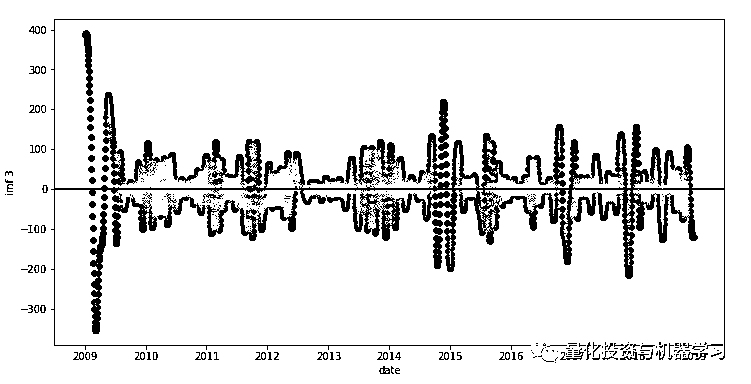

# 使用希尔伯特-黄变换（HHT）进行时间序列分析

> 原文：[`mp.weixin.qq.com/s?__biz=MzAxNTc0Mjg0Mg==&mid=2653290507&idx=1&sn=1ccf9163abd58cfd162a5ef3185c1843&chksm=802dc21eb75a4b08d9e9012704d607619524856bca0594ba3c8f81b1417b038d7d519696b967&scene=27#wechat_redirect`](http://mp.weixin.qq.com/s?__biz=MzAxNTc0Mjg0Mg==&mid=2653290507&idx=1&sn=1ccf9163abd58cfd162a5ef3185c1843&chksm=802dc21eb75a4b08d9e9012704d607619524856bca0594ba3c8f81b1417b038d7d519696b967&scene=27#wechat_redirect)

**标星★公众号**，第一时间获取最新研究

本期作者：Bradbeer

本期编辑：阿威 | 公众号翻译部成员

**近期原创文章：**

## ♥ [啥是佩琪？恕我直言，搞量化这样配齐！](https://mp.weixin.qq.com/s?__biz=MzAxNTc0Mjg0Mg==&mid=2653290316&idx=2&sn=0ef0f85a29c848ac6d554c16d847a2fd&chksm=802e3d59b759b44fe5cc65cc1480828cc8f05d12383a2caf1a5a60e950d2dfde899de79ab438&token=1330520237&lang=zh_CN&scene=21#wechat_redirect)

## ♥ [深入研读：利用 Twitter 情绪去预测股市](https://mp.weixin.qq.com/s?__biz=MzAxNTc0Mjg0Mg==&mid=2653290402&idx=1&sn=efda9ea106991f4f7ccabcae9d809e00&chksm=802e3db7b759b4a173dc8f2ab5c298ab3146bfd7dd5aca75929c74ecc999a53b195c16f19c71&token=1330520237&lang=zh_CN&scene=21#wechat_redirect)

## ♥ [Two Sigma 用新闻来预测股价走势，带你吊打 Kaggle](https://mp.weixin.qq.com/s?__biz=MzAxNTc0Mjg0Mg==&mid=2653290456&idx=1&sn=b8d2d8febc599742e43ea48e3c249323&chksm=802e3dcdb759b4db9279c689202101b6b154fb118a1c1be12b52e522e1a1d7944858dbd6637e&token=1330520237&lang=zh_CN&scene=21#wechat_redirect)

## ♥ [利用深度学习最新前沿预测股价走势](https://mp.weixin.qq.com/s?__biz=MzAxNTc0Mjg0Mg==&mid=2653290080&idx=1&sn=06c50cefe78a7b24c64c4fdb9739c7f3&chksm=802e3c75b759b563c01495d16a638a56ac7305fc324ee4917fd76c648f670b7f7276826bdaa8&token=770078636&lang=zh_CN&scene=21#wechat_redirect)

## ♥ [一位数据科学 PhD 眼中的算法交易](https://mp.weixin.qq.com/s?__biz=MzAxNTc0Mjg0Mg==&mid=2653290118&idx=1&sn=a261307470cf2f3e458ab4e7dc309179&chksm=802e3c93b759b585e079d3a797f512dfd0427ac02942339f4f1454bd368ba47be21cb52cf969&token=770078636&lang=zh_CN&scene=21#wechat_redirect)

## ♥ [基于 RNN 和 LSTM 的股市预测方法](https://mp.weixin.qq.com/s?__biz=MzAxNTc0Mjg0Mg==&mid=2653290481&idx=1&sn=f7360ea8554cc4f86fcc71315176b093&chksm=802e3de4b759b4f2235a0aeabb6e76b3e101ff09b9a2aa6fa67e6e824fc4274f68f4ae51af95&token=1865137106&lang=zh_CN&scene=21#wechat_redirect)

## ♥ [人工智能『AI』应用算法交易，7 个必踩的坑！](https://mp.weixin.qq.com/s?__biz=MzAxNTc0Mjg0Mg==&mid=2653289974&idx=1&sn=88f87cb64999d9406d7c618350aac35d&chksm=802e3fe3b759b6f5eca6e777364270cbaa0bf35e9a1535255be9751c3a77642676993a861132&token=770078636&lang=zh_CN&scene=21#wechat_redirect)

## ♥ [神经网络在算法交易上的应用系列（一）](https://mp.weixin.qq.com/s?__biz=MzAxNTc0Mjg0Mg==&mid=2653289962&idx=1&sn=5f5aa65ec00ce176501c85c7c106187d&chksm=802e3fffb759b6e9f2d4518f9d3755a68329c8753745333ef9d70ffd04bd088fd7b076318358&token=770078636&lang=zh_CN&scene=21#wechat_redirect)

## ♥ [预测股市 | 如何避免 p-Hacking，为什么你要看涨？](https://mp.weixin.qq.com/s?__biz=MzAxNTc0Mjg0Mg==&mid=2653289820&idx=1&sn=d3fee74ba1daab837433e4ef6b0ab4d9&chksm=802e3f49b759b65f422d20515942d5813aead73231da7d78e9f235bdb42386cf656079e69b8b&token=770078636&lang=zh_CN&scene=21#wechat_redirect)

## ♥ [如何鉴别那些用深度学习预测股价的花哨模型？](https://mp.weixin.qq.com/s?__biz=MzAxNTc0Mjg0Mg==&mid=2653290132&idx=1&sn=cbf1e2a4526e6e9305a6110c17063f46&chksm=802e3c81b759b597d3dd94b8008e150c90087567904a29c0c4b58d7be220a9ece2008956d5db&token=1266110554&lang=zh_CN&scene=21#wechat_redirect)

## ♥[ ](https://mp.weixin.qq.com/s?__biz=MzAxNTc0Mjg0Mg==&mid=2653290261&idx=2&sn=ee7cf7dabe50ed89adafdc92e980a48c&chksm=802e3d00b759b416875b2881ec5bc8a81d95208271c66f3680afd3cfbf27aa2e506398ae9e90&token=304730811&lang=zh_CN&scene=21#wechat_redirect)[优化强化学习 Q-learning 算法进行股市交易](https://mp.weixin.qq.com/s?__biz=MzAxNTc0Mjg0Mg==&mid=2653290286&idx=1&sn=882d39a18018733b93c8c8eac385b515&chksm=802e3d3bb759b42d1fc849f96bf02ae87edf2eab01b0beecd9340112c7fb06b95cb2246d2429&token=1330520237&lang=zh_CN&scene=21#wechat_redirect)

春节快乐

将非平稳时间序列用经验模态分解（EMD）转为固有特征方程式并且捕获其趋势。可以尝试使用 HHT，当然这只是其中的一种方法，并没有像其他方法一样存在数学证明等。

**数据准备**

为了方便起见，我们选取了富时 100 指数（FTSE100）过去 10 年的收盘价作为金融时间序列，只是作为我们研究，大家可以用其他指数。之后，我们会选取希尔伯特谱来分析固有特征方程式来提取即时数据信息。

富时 100 指数数据的提取式这样的，加载到 dataframe 里：

```py
时间,   开盘价,   收盘价,   最高价,    最低价,  成交量
02-Jan-2009,4434.20,4561.80,4561.80,4430.00,407295392
05-Jan-2009,4561.80,4579.60,4618.10,4520.80,836675968
…
21-Dec-2018,6711.93,6721.17,6733.00,6653.65,1636792576
24-Dec-2018,6721.17,6685.99,6721.17,6661.04,173149664 
```

```py
import os
import pandas as pd
import matplotlib.pyplot as plt
import numpy as np
data_directory = 'some path...'

data_file = os.path.join(data_directory, 'ftse100_2009_2018.csv' )

ftseinfo = pd.read_csv(data_file)
```

**测试数据**

```py
# convert strings to dates
ftseinfo['Date'] = pd.to_datetime(ftseinfo['Date'], format="%d-%b-%Y" )

# convenience variable for plots
date_axis = ftseinfo['Date']

# The date entries are not evenly spaced, so calculate number of days from first date for each
first_date = date_axis[0]
deltas = ftseinfo['Date'] - first_date

def getdays(delta):
    return delta.days

ftseinfo['deltadays'] = deltas.apply(getdays)

# convenience variable for days
days = ftseinfo['deltadays']
# plot closing price
fig = plt.figure(figsize=(12,6))
sp1 = fig.add_subplot(111)
plt.xlabel('date')
plt.ylabel('price')

sp1.plot_date( x=date_axis, y=ftseinfo['Close Price'] )

plt.legend(loc='center right')
plt.show()
```


当股价是非平稳状态并且有随机走势基础时，以上图形可以看作有线性的趋势结构，让我们加以测试。

**平稳性**

一组具有平稳性的时间序列不以某些时间点为依赖，并且没有趋势性或季节性。股价按理来说应该是平稳性的，可是很显然，有些走势并非如此。它可能具备一些趋势。当然**我们不能肯定未来的价格依赖于过去的价格，趋势只是过去时间点已知发生的事实**。所以，给出一段股价走势，这些数据可能呈现出非平稳定性。为了更好地分析，我们要去除这一非平稳状态。通常，我们通过观察数据差异（例如价格变动）而不是绝对价格。

Augmented Dickey-Fuller Test（用于测试稳态）：

```py
# Dickey-Fuller test
from statsmodels.tsa.stattools import adfuller

def adf_test(timeseries):
    dftest = adfuller(timeseries, autolag='AIC')
    print('ADF Statistic: %f' % dftest[0])
    print('p-value: %f' % dftest[1])
    print('Critical Values:')
    for key, value in dftest[4].items():
        print('\t%s: %.3f' % (key, value))
```

结果显示于下方：

```py
adf_test( ftseinfo['Close Price'] )
ADF Statistic: -2.129286
p-value: 0.232903
Critical Values:
 1%: -3.433
 5%: -2.863
 10%: -2.567
```

我们用一个 0.05 的 p-value 作为阀值，很显然这里的 p-value 大于 0.05，所以我们认为这组时间序列是非平稳的，需要改进。

**分解与残差（趋势）**

在下面的例子里，用 pyhtt 包来处理 HHT 分解：

```py
from pyhht.utils import inst_freq
from pyhht import EMD

def decompose( x, y ):
    decomposer = EMD( y )
    imfs = decomposer.decompose()
    return imfs
def emd_analysis( days, data_values ):

    # decompose time series into intrinsic mode functions
    imfs = decompose(days, data_values)

    # extract the residue (overall trend)
    imf_residue = imfs[len(imfs)-1]

    return (imfs, imf_residue )
# Do the decomposition on the closing price time series
( imfs, imf_residue ) = emd_analysis( days, ftseinfo['Close Price'])
# plot the residue to see if a clear trend in there
fig = plt.figure(figsize=(12,6))
sp1 = fig.add_subplot(111)
plt.xlabel('date')
plt.ylabel('residue')
sp1.plot_date( x=date_axis, y=imf_residue, color='red' )
plt.show()
```


残差显示了非常明显的趋势性，从分解结果可以看出一条十分明显的趋势线，因此需要去除。 之后我们在用 ADF（Augmented Dickey-Fuller Test）来测试是否稳态。

**趋势去除第一步**

```py
ftseinfo['trend_adjusted_1'] = ftseinfo['Close Price'] - imf_residue
# Let's look at adjusted prices
fig = plt.figure(figsize=(12,6))
sp1 = fig.add_subplot(111)
plt.xlabel('date')
plt.ylabel('trend adjusted price')

sp1.plot_date( x=date_axis, y=ftseinfo['trend_adjusted_1'], color='green' )
plt.axhline(0, color='black')

plt.legend(loc='lower right')
plt.show()
```


再用 ADF 测试：

```py
# Dickey-Fuller test for stationary or not
adf_test( ftseinfo['trend_adjusted_1'] )
ADF Statistic: -3.329548
p-value: 0.013608
Critical Values:
 1%: -3.433
 5%: -2.863
 10%: -2.567
```

发现 p-value 小于 0.05，表明已经是平稳时间序列了。

**分解步骤 2**

```py
# Do the decomposition on the price movement series
( imfs, imf_residue ) = emd_analysis( days, ftseinfo['trend_adjusted_1'])
```

现在测试剩余残差：

```py
# Check residue to ensure no significant trend information remains
fig = plt.figure(figsize=(12,6))
sp1 = fig.add_subplot(111)
plt.xlabel('date')
plt.ylabel('residue')
sp1.plot_date( x=date_axis, y=imf_residue, color='red' )
plt.axhline(0, color='black')
plt.show()
```

看起来也是需要去除的。

**趋势去除第二步**

```py
ftseinfo['trend_adjusted_2'] = ftseinfo['trend_adjusted_1'] - imf_residue
# Dickey-Fuller test for stationary or not
adf_test( ftseinfo['trend_adjusted_2'] )
ADF Statistic: -3.343714
p-value: 0.013034
Critical Values:
 1%: -3.433
 5%: -2.863
 10%: -2.567
```

我们再分解一次。

```py
( imfs, imf_residue ) = emd_analysis( days, ftseinfo['trend_adjusted_2'])
# Check residue to ensure no significant trend information remains
fig = plt.figure(figsize=(12,6))
sp1 = fig.add_subplot(111)
plt.xlabel('date')
plt.ylabel('residue')
sp1.plot_date( x=date_axis, y=imf_residue, color='red' )
plt.axhline(0, color='black')
plt.show()
```


从图形看还是剩余了一些趋势，但是在十年中的增长很少，可以认为趋势基本不存在了。

**复权价格 EMD**

从以上看来，HHT/EMD 方法找到了两个趋势， 我们都已经将他们去除了，剩余的数据已经没有了趋势。因此我们可以开始测试固有特征方程了。

```py
# Plot each IMF in turn; the highest frequency IMFS are first and lowest are last
for i in range(0,len(imfs)-1):
    fig = plt.figure(figsize=(12,6))
    sp1 = fig.add_subplot(111)
    plt.xlabel('date')
    plt.ylabel('imf %d'%i)
    sp1.plot_date( x=date_axis, y=imfs[i], color='green' )
    plt.axhline(0, color='black')
    plt.show()
```

随着分解过程的进行，先去掉最高频率的函数，然后识别出频率越来越低的函数。


IMF 0


IMF 1


IMF 2



IMF 3


IMF 4


IMF 5


IMF 6


IMF 7


 IMF 8

理论上讲，这其中任何 IMF 曲线均可用希尔伯特时频谱分析来得到其频率的数据。这些曲线可以给长期的价格波动提供可靠依据。

**总结**

所以我们看到了 HHT 可以用在非平稳时间序列上来分析残差的趋势问题。 

例子里运用富时 100 的数据只是为了探索这一理论，并不具有实战性。

当趋势的信息被去除后， 时间序列经过固有特征 IMF 方程的处理分解，即可展现出股价波动的一些信息。我们的想法得以达成。

**推荐阅读**

[01、经过多年交易之后你应该学到的东西（深度分享）](https://mp.weixin.qq.com/s?__biz=MzAxNTc0Mjg0Mg==&mid=2653289074&idx=1&sn=e859d363eef9249236244466a1af41b6&chksm=802e3867b759b1717f77e07a51ee5671e8115130c66562577280ba1243cba08218add04f1f00&token=449379994&lang=zh_CN&scene=21#wechat_redirect)

[02、监督学习标签在股市中的应用（代码+书籍）](https://mp.weixin.qq.com/s?__biz=MzAxNTc0Mjg0Mg==&mid=2653289050&idx=1&sn=60043a5c95b877dd329a5fd150ddacc4&chksm=802e384fb759b1598e500087374772059aa21b31ae104b3dca04331cf4b63a233c5e04c1945a&token=449379994&lang=zh_CN&scene=21#wechat_redirect)

[03、全球投行顶尖机器学习团队全面分析](https://mp.weixin.qq.com/s?__biz=MzAxNTc0Mjg0Mg==&mid=2653289018&idx=1&sn=8c411f676c2c0d92b0dd218f041bee4b&chksm=802e382fb759b139ffebf633ac14cdd0f21938e4613fe632d5d9231dab3d2aca95a11628378a&token=449379994&lang=zh_CN&scene=21#wechat_redirect)

[04、使用 Tensorflow 预测股票市场变动](https://mp.weixin.qq.com/s?__biz=MzAxNTc0Mjg0Mg==&mid=2653289014&idx=1&sn=3762d405e332c599a21b48a7dc4df587&chksm=802e3823b759b135928d55044c2729aea9690f86752b680eb973d1a376dc53cfa18287d0060b&token=449379994&lang=zh_CN&scene=21#wechat_redirect)

[05、使用 LSTM 预测股票市场基于 Tensorflow](https://mp.weixin.qq.com/s?__biz=MzAxNTc0Mjg0Mg==&mid=2653289238&idx=1&sn=3144f5792f84455dd53c27a78e8a316c&chksm=802e3903b759b015da88acde4fcbc8547ab3e6acbb5a0897404bbefe1d8a414265d5d5766ee4&token=2020206794&lang=zh_CN&scene=21#wechat_redirect)

[06、美丽的回测——教你定量计算过拟合概率](https://mp.weixin.qq.com/s?__biz=MzAxNTc0Mjg0Mg==&mid=2653289314&idx=1&sn=87c5a12b23a875966db7be50d11f09cd&chksm=802e3977b759b061675d1988168c1fec06c602e8583fbcc9b76f87008e0c10b702acc85467a0&token=1972390229&lang=zh_CN&scene=21#wechat_redirect)

[07、利用动态深度学习预测金融时间序列基于 Python](https://mp.weixin.qq.com/s?__biz=MzAxNTc0Mjg0Mg==&mid=2653289347&idx=1&sn=bf5d7899bc4a854d4ba9046fdc6fe0d6&chksm=802e3996b759b080287213840987bb0a0c02e4e1d4d7aae23f10a225a92ef6dd922d8006123d&token=290397496&lang=zh_CN&scene=21#wechat_redirect)

[08、Facebook 开源神器 Prophet 预测时间序列基于 Python](https://mp.weixin.qq.com/s?__biz=MzAxNTc0Mjg0Mg==&mid=2653289394&idx=1&sn=24a836136d730aa268605628e683d629&chksm=802e39a7b759b0b1dcf7aaa560699130a907716b71fc9c45ff0e5d236c5ae8ef80ebdb09dbb6&token=290397496&lang=zh_CN&scene=21#wechat_redirect)

[09、Facebook 开源神器 Prophet 预测股市行情基于 Python](https://mp.weixin.qq.com/s?__biz=MzAxNTc0Mjg0Mg==&mid=2653289437&idx=1&sn=f0dca7da8e69e7ba736992cb3d034ce7&chksm=802e39c8b759b0de5bce401c580623d0729ecca69d13926479d36e19aff8c9c9e8a20265afff&token=290397496&lang=zh_CN&scene=21#wechat_redirect)

[10、2018 第三季度最受欢迎的券商金工研报前 50（附下载）](https://mp.weixin.qq.com/s?__biz=MzAxNTc0Mjg0Mg==&mid=2653289358&idx=1&sn=db6e8ab85b08f6e67790ec0e401e586e&chksm=802e399bb759b08d6eec855f9901ea856d0da68c7425cba62791b8948da6ad761a3d88543dad&token=290397496&lang=zh_CN&scene=21#wechat_redirect)

[11、实战交易策略的精髓（公众号深度呈现）](https://mp.weixin.qq.com/s?__biz=MzAxNTc0Mjg0Mg==&mid=2653289447&idx=1&sn=f2948715bf82569a6556d518e56c1f9e&chksm=802e39f2b759b0e4502d1aaac562b87789573b55c76b3c85897d8c9d88dbf9a0b7ee34d86a4e&token=290397496&lang=zh_CN&scene=21#wechat_redirect)

[12、Markowitz 有效边界和投资组合优化基于 Python](https://mp.weixin.qq.com/s?__biz=MzAxNTc0Mjg0Mg==&mid=2653289478&idx=1&sn=f8e01a641be021993d8ef2d84e94a299&chksm=802e3e13b759b7055cf27a280c672371008a5564c97c658eee89ce8481396a28d254836ff9af&token=290397496&lang=zh_CN&scene=21#wechat_redirect)

[13、使用 LSTM 模型预测股价基于 Keras](https://mp.weixin.qq.com/s?__biz=MzAxNTc0Mjg0Mg==&mid=2653289495&idx=1&sn=c4eeaa2e9f9c10995be9ea0c56d29ba7&chksm=802e3e02b759b7148227675c23c403fb9a543b733e3d27fa237b53840e030bf387a473d83e3c&token=1260956004&lang=zh_CN&scene=21#wechat_redirect)

[14、量化金融导论 1：资产收益的程式化介绍基于 Python](https://mp.weixin.qq.com/s?__biz=MzAxNTc0Mjg0Mg==&mid=2653289507&idx=1&sn=f0ca71aa07531bbbdbd33213f0bab89f&chksm=802e3e36b759b720138b3b17a4dd0e198e054b9de29a038fdd50805f824effa55831111ad026&token=1936245282&lang=zh_CN&scene=21#wechat_redirect)

[15、预测股市崩盘基于统计机器学习与神经网络（Python+文档）](https://mp.weixin.qq.com/s?__biz=MzAxNTc0Mjg0Mg==&mid=2653289533&idx=1&sn=4ef964834e84a9995111bb057b0fc5dd&chksm=802e3e28b759b73e0618eb1262c53aa0601fbf5805525a7c7ff40dc3db62c7704496611bdbf1&token=1950551577&lang=zh_CN&scene=21#wechat_redirect)

[16、实现最优投资组合有效前沿基于 Python（附代码）](https://mp.weixin.qq.com/s?__biz=MzAxNTc0Mjg0Mg==&mid=2653289609&idx=1&sn=c7f0b3e47025862d10bb53b6ab88bcda&chksm=802e3e9cb759b78abf6b8b049c59bf18ccfb2ead7580d1f557d36de2292f59dcbd94dcd41910&token=2085008037&lang=zh_CN&scene=21#wechat_redirect)

[17、精心为大家整理了一些超级棒的机器学习资料（附链接）](https://mp.weixin.qq.com/s?__biz=MzAxNTc0Mjg0Mg==&mid=2653289615&idx=1&sn=1cdc89afb997d0c580bf0cef296d946c&chksm=802e3e9ab759b78ce9f0cd152a680d4a413d6c8dcb02a7a296f4091993a7e4137e7520394575&token=2085008037&lang=zh_CN&scene=21#wechat_redirect)

[18、海量 Wind 数据，与全网用户零距离邂逅！](https://mp.weixin.qq.com/s?__biz=MzAxNTc0Mjg0Mg==&mid=2653289623&idx=1&sn=28a3600fd7a72d7be00b066ca0f98244&chksm=802e3e82b759b7943f43a4f6ef4a91e4153fa6b8210de9590235fa8ee66eb9811ce177054dbc&token=1389401983&lang=zh_CN&scene=21#wechat_redirect)

[19、机器学习、深度学习、量化金融、Python 等最新书籍汇总下载](https://mp.weixin.qq.com/s?__biz=MzAxNTc0Mjg0Mg==&mid=2653289640&idx=1&sn=34e94fcbe99052b8e7381ecc48a36dc0&chksm=802e3ebdb759b7ab897cd329a680715b6f8294e63550ddf0c57b9e1320b2b7d1408c6fdca0c7&token=1389401983&lang=zh_CN&scene=21#wechat_redirect)

[20、各大卖方 2019 年 A 股策略报告，都是有故事的人！](https://mp.weixin.qq.com/s?__biz=MzAxNTc0Mjg0Mg==&mid=2653289725&idx=1&sn=4b65cd1fb8331438e4c0b3d0eae6b51f&chksm=802e3ee8b759b7fe1b94e84d54cc23b0ab05853d5cd227812574b350e9fc2cce9e5f1bc6cb7a&token=1389401983&lang=zh_CN&scene=21#wechat_redirect)

**扫码关注我们**

