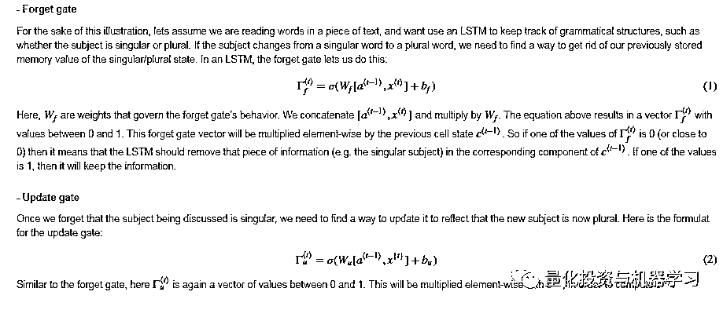

# 基于 RNN 和 LSTM 的股市预测方法

> 原文：[`mp.weixin.qq.com/s?__biz=MzAxNTc0Mjg0Mg==&mid=2653290481&idx=1&sn=f7360ea8554cc4f86fcc71315176b093&chksm=802e3de4b759b4f2235a0aeabb6e76b3e101ff09b9a2aa6fa67e6e824fc4274f68f4ae51af95&scene=27#wechat_redirect`](http://mp.weixin.qq.com/s?__biz=MzAxNTc0Mjg0Mg==&mid=2653290481&idx=1&sn=f7360ea8554cc4f86fcc71315176b093&chksm=802e3de4b759b4f2235a0aeabb6e76b3e101ff09b9a2aa6fa67e6e824fc4274f68f4ae51af95&scene=27#wechat_redirect)

**标星★公众号**，第一时间获取最新资讯

本期作者：Aniruddha Choudhury

本期编辑：1+1=6

**近期原创文章：**

## ♥ [啥是佩琪？恕我直言，搞量化这样配齐！](https://mp.weixin.qq.com/s?__biz=MzAxNTc0Mjg0Mg==&mid=2653290316&idx=2&sn=0ef0f85a29c848ac6d554c16d847a2fd&chksm=802e3d59b759b44fe5cc65cc1480828cc8f05d12383a2caf1a5a60e950d2dfde899de79ab438&token=1330520237&lang=zh_CN&scene=21#wechat_redirect)

## ♥ [深入研读：利用 Twitter 情绪去预测股市](https://mp.weixin.qq.com/s?__biz=MzAxNTc0Mjg0Mg==&mid=2653290402&idx=1&sn=efda9ea106991f4f7ccabcae9d809e00&chksm=802e3db7b759b4a173dc8f2ab5c298ab3146bfd7dd5aca75929c74ecc999a53b195c16f19c71&token=1330520237&lang=zh_CN&scene=21#wechat_redirect)

## ♥ [Two Sigma 用新闻来预测股价走势，带你吊打 Kaggle](https://mp.weixin.qq.com/s?__biz=MzAxNTc0Mjg0Mg==&mid=2653290456&idx=1&sn=b8d2d8febc599742e43ea48e3c249323&chksm=802e3dcdb759b4db9279c689202101b6b154fb118a1c1be12b52e522e1a1d7944858dbd6637e&token=1330520237&lang=zh_CN&scene=21#wechat_redirect)

## ♥ [利用深度学习最新前沿预测股价走势](https://mp.weixin.qq.com/s?__biz=MzAxNTc0Mjg0Mg==&mid=2653290080&idx=1&sn=06c50cefe78a7b24c64c4fdb9739c7f3&chksm=802e3c75b759b563c01495d16a638a56ac7305fc324ee4917fd76c648f670b7f7276826bdaa8&token=770078636&lang=zh_CN&scene=21#wechat_redirect)

## ♥ [一位数据科学 PhD 眼中的算法交易](https://mp.weixin.qq.com/s?__biz=MzAxNTc0Mjg0Mg==&mid=2653290118&idx=1&sn=a261307470cf2f3e458ab4e7dc309179&chksm=802e3c93b759b585e079d3a797f512dfd0427ac02942339f4f1454bd368ba47be21cb52cf969&token=770078636&lang=zh_CN&scene=21#wechat_redirect)

## ♥ [深度学习是信号处理和时序分析的最后选择？](https://mp.weixin.qq.com/s?__biz=MzAxNTc0Mjg0Mg==&mid=2653289999&idx=1&sn=800b645653a3e36ce57ff82260d030dc&chksm=802e3c1ab759b50cf9fb931574f84001f4858997be6330251c139deef0272e9217aa62276ea5&token=770078636&lang=zh_CN&scene=21#wechat_redirect)

## ♥ [人工智能『AI』应用算法交易，7 个必踩的坑！](https://mp.weixin.qq.com/s?__biz=MzAxNTc0Mjg0Mg==&mid=2653289974&idx=1&sn=88f87cb64999d9406d7c618350aac35d&chksm=802e3fe3b759b6f5eca6e777364270cbaa0bf35e9a1535255be9751c3a77642676993a861132&token=770078636&lang=zh_CN&scene=21#wechat_redirect)

## ♥ [神经网络在算法交易上的应用系列（一）](https://mp.weixin.qq.com/s?__biz=MzAxNTc0Mjg0Mg==&mid=2653289962&idx=1&sn=5f5aa65ec00ce176501c85c7c106187d&chksm=802e3fffb759b6e9f2d4518f9d3755a68329c8753745333ef9d70ffd04bd088fd7b076318358&token=770078636&lang=zh_CN&scene=21#wechat_redirect)

## ♥ [预测股市 | 如何避免 p-Hacking，为什么你要看涨？](https://mp.weixin.qq.com/s?__biz=MzAxNTc0Mjg0Mg==&mid=2653289820&idx=1&sn=d3fee74ba1daab837433e4ef6b0ab4d9&chksm=802e3f49b759b65f422d20515942d5813aead73231da7d78e9f235bdb42386cf656079e69b8b&token=770078636&lang=zh_CN&scene=21#wechat_redirect)

## ♥ [如何鉴别那些用深度学习预测股价的花哨模型？](https://mp.weixin.qq.com/s?__biz=MzAxNTc0Mjg0Mg==&mid=2653290132&idx=1&sn=cbf1e2a4526e6e9305a6110c17063f46&chksm=802e3c81b759b597d3dd94b8008e150c90087567904a29c0c4b58d7be220a9ece2008956d5db&token=1266110554&lang=zh_CN&scene=21#wechat_redirect)

## ♥[ ](https://mp.weixin.qq.com/s?__biz=MzAxNTc0Mjg0Mg==&mid=2653290261&idx=2&sn=ee7cf7dabe50ed89adafdc92e980a48c&chksm=802e3d00b759b416875b2881ec5bc8a81d95208271c66f3680afd3cfbf27aa2e506398ae9e90&token=304730811&lang=zh_CN&scene=21#wechat_redirect)[优化强化学习 Q-learning 算法进行股市交易](https://mp.weixin.qq.com/s?__biz=MzAxNTc0Mjg0Mg==&mid=2653290286&idx=1&sn=882d39a18018733b93c8c8eac385b515&chksm=802e3d3bb759b42d1fc849f96bf02ae87edf2eab01b0beecd9340112c7fb06b95cb2246d2429&token=1330520237&lang=zh_CN&scene=21#wechat_redirect)

春节快乐

**前言**

对许多研究人员和分析师来说，预测股价的艺术一直是一项艰巨的任务。事实上，投资者对股票价格预测的研究领域非常感兴趣。许多投资者都渴望知道股票市场的未来情况。良好和有效的股票市场预测系统通过提供股票市场未来走向等支持性信息，帮助交易员、投资者和分析师。**本文提出了一种基于 RNN 和 LSTM 的股票市场指数预测方法。**

**介绍**

金融指标复杂，股市波动剧烈。然而，随着科技的进步，从股票市场获得稳定财富的机会增加了，这也帮助专家们找到最有信息的指标，做出更好的预测。市场价值的预测对于实现股票期权购买的利润最大化和保持低风险具有重要意义。RNN 已被证明是处理序列数据的最强大的模型之一。LSTM 是最成功的 RNNs 架构之一。LSTM 引入了记忆单元，它是一种计算单元，取代了网络隐含层中的传统人工神经元。利用这些记忆单元，网络能够有效地将记忆关联起来，并能及时远程输入，从而适应随时间动态掌握数据结构，具有较高的预测能力。

**LSTM**


我们将从单个时间步骤实现 LSTM 单元。然后我们可以在 for 循环中迭代调用它，让它使用 Tx time-steps 处理输入。




**方法**

**第一阶段：原始数据。**

在这个阶段，基于谷歌的历史数据用于预测未来价格。

```py
dataset = pd.read_csv('Google_Stock_Price_Train.csv',index_col="Date",parse_dates=True)
```

  

**第二阶段：预处理数据**

1、数据离散化

2、数据标准化

3、数据缺失值处理

4、将数据集分为训练集和测试集。

```py
#Data cleaning
dataset.isna().any()
# Feature Scaling Normalization
from sklearn.preprocessing import MinMaxScaler
sc = MinMaxScaler(feature_range = (0, 1))
training_set_scaled = sc.fit_transform(training_set)
# Creating a data structure with 60 timesteps and 1 output
X_train = []
y_train = []
for i in range(60, 1258):
    X_train.append(training_set_scaled[i-60:i, 0])
    y_train.append(training_set_scaled[i, 0])
X_train, y_train = np.array(X_train), np.array(y_train)

# Reshaping
X_train = np.reshape(X_train, (X_train.shape[0], X_train.shape[1], 1))
```

**第三阶段：**在这一层中，只选择需要输入神经网络的特征。我们将从日期、开、高、低、收和成交量中选择特征。

```py
Building the RNN LSTM model
# Importing the Keras libraries and packages
from keras.models import Sequential
from keras.layers import Dense
from keras.layers import LSTM
from keras.layers import Dropout
Using TensorFlow backend.
```

**训练神经网络：**在这一阶段，将数据输入神经网络进行随机偏差和权值的预测训练。

```py
# Initialising the RNN
regressor = Sequential()
# Adding the first LSTM layer and some Dropout regularisation
regressor.add(LSTM(units = 50, return_sequences = True, input_shape = (X_train.shape[1], 1)))regressor.add(Dropout(0.2))

# Adding a second LSTM layer and some Dropout regularisation
regressor.add(LSTM(units = 50, return_sequences = True))
regressor.add(Dropout(0.2))

# Adding a third LSTM layer and some Dropout regularisation
regressor.add(LSTM(units = 50, return_sequences = True))
regressor.add(Dropout(0.2))

# Adding a fourth LSTM layer and some Dropout regularisation
regressor.add(LSTM(units = 50))
regressor.add(Dropout(0.2))

# Adding the output layer
regressor.add(Dense(units = 1))
# Compiling the RNN
regressor.compile(optimizer = 'adam', loss = 'mean_squared_error')

# Fitting the RNN to the Training set
regressor.fit(X_train, y_train, epochs = 100, batch_size = 32)
```

**优化器**

使用的优化器类型会极大地影响算法收敛到最小值的速度。此外，重要的是要有一些随机性的概念，以避免陷入局部最小值而无法达到全局最小值。有一些很好的算法，但我们选择使用 Adam 优化器。Adam 优化器结合了其他两个优化器的优点：ADAgrad 和 RMSprop。

ADAgrad 优化器实际上为每个参数和每个时间步骤使用不同的学习率。ADAgrad 背后的原因是，不频繁的参数必须有较大的学习率，而频繁的参数必须有较小的学习率。也就是说，ADAgrad 的随机梯度下降更新变成


学习率是根据每个参数计算过去的梯度来计算的。因此：


其中 G 是过去梯度平方和的矩阵。这种优化的问题是，随着迭代次数的增加，学习速率开始迅速消失。

RMSprop 只考虑使用一定数量的前一个梯度来修正学习速率递减的问题。的更新成为：


现在我们已经了解了这两个优化器是如何工作的，接下来我们可以看看 Adam 是如何工作的。

自适应矩估计，或 Adam，是另一种计算每个参数的自适应学习速率的方法，它考虑了过去的平方梯度的指数衰减平均值和过去梯度的指数衰减平均值。这可以表示为：


v 和 m 可以分别作为梯度的一阶矩和二阶矩的估计值，从而得到自适应矩估计的名称。当这一理论首次被使用时，研究人员观察到一种固有的对 0 的偏见，他们用以下的估计来反驳这种偏见：


这就引出了最终的渐变更新规则：


其优点总结如下:

1、对于每个参数和每个迭代，学习率是不同的。

2、学习不会像 ADAgrad 那样减少。

3、梯度更新使用了权重分布的矩值。

**正则化**

训练模型的另一个重要方面是确保权重不要太大，并开始关注于一个数据点，因此会过度拟合。因此，包括对大权重的惩罚（大的定义将取决于所使用的正则化器的类型）。选择使用 Tikhonov 正则化，它可以被认为是如下最小化问题：


函数空间位于可复制的核希尔伯特空间(RKHS)这一事实确保了范数的概念的存在。这允许我们将规范的概念编码到我们的正则化器中。

**Dropouts**

一种防止过拟合的新方法考虑了当一些神经元突然停止工作时会发生什么。这就迫使模型不要过度依赖任何一组神经元，并考虑到所有的神经元。Dropout 发现它们的作用是使神经元更加强健，从而使他们能够在不关注任何一个神经元的情况下预测这一趋势。这里是使用 Dropout 的结果：


**Output Generation：**在该层中，将 RNN 输出层生成的输出值与目标值进行比较。利用反向传播算法调整网络的权值和偏差，使目标与输出值之间的误差或差降至最小。

```py
Epoch 97/100
1198/1198 [==============================] - 6s 5ms/step - loss: 0.0018
Epoch 98/100
1198/1198 [==============================] - 6s 5ms/step - loss: 0.0014
Epoch 99/100
1198/1198 [==============================] - 6s 5ms/step - loss: 0.0014
Epoch 100/100
1198/1198 [==============================] - 6s 5ms/step - loss: 0.0015
```

我们对测试数据的预处理也采用了同样的方法：

```py
# Getting the real stock price of 2017
dataset_test = pd.read_csv('Google_Stock_Price_Test.csv',index_col="Date",parse_dates=True)
# Getting the predicted stock price
dataset_total = pd.concat((dataset['Open'], dataset_test['Open']), axis = 0)
inputs = dataset_total[len(dataset_total) - len(dataset_test) - 60:].values
inputs = inputs.reshape(-1,1)
inputs = sc.transform(inputs)
X_test = []
for i in range(60, 80):
    X_test.append(inputs[i-60:i, 0])
X_test = np.array(X_test)
X_test = np.reshape(X_test, (X_test.shape[0], X_test.shape[1], 1))
predicted_stock_price = regressor.predict(X_test)
predicted_stock_price = sc.inverse_transform(predicted_stock_price)
```

**可视化**

基于 keras API 函数，上述所有分析都可以相对容易地实现。

```py
# Visualising the results
plt.plot(real_stock_price, color = 'red', label = 'Real Google Stock Price')
plt.plot(predicted_stock_price, color = 'blue', label = 'Predicted Google Stock Price')
plt.title('Google Stock Price Prediction')
plt.xlabel('Time')
plt.ylabel('Google Stock Price')
plt.legend()
plt.show()
```


**时间序列上的移动平均值**

时间序列模型的滚动分析常用于评估模型随时间的稳定性。当使用统计模型分析金融时间序列数据时，一个关键的假设是模型的参数随时间的变化是恒定的。

```py
dataset['Close: 30 Day Mean'] = dataset['Close'].rolling(window=30).mean()
dataset[['Close','Close: 30 Day Mean']].plot(figsize=(16,6))
```


股票在一段时间内的开盘表现。


**如何获取代码**

在**后台**输入

**20190206**

**后台获取方式介绍**


**扫码关注我们**

