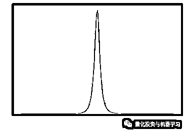

# 独家 | Two Sigma 用新闻来预测股价走势，带你吊打 Kaggle（附代码）

> 原文：[`mp.weixin.qq.com/s?__biz=MzAxNTc0Mjg0Mg==&mid=2653290456&idx=1&sn=b8d2d8febc599742e43ea48e3c249323&chksm=802e3dcdb759b4db9279c689202101b6b154fb118a1c1be12b52e522e1a1d7944858dbd6637e&scene=27#wechat_redirect`](http://mp.weixin.qq.com/s?__biz=MzAxNTc0Mjg0Mg==&mid=2653290456&idx=1&sn=b8d2d8febc599742e43ea48e3c249323&chksm=802e3dcdb759b4db9279c689202101b6b154fb118a1c1be12b52e522e1a1d7944858dbd6637e&scene=27#wechat_redirect)

**标星★公众号**，第一时间获取最新资讯

本期作者：Sai Sandeep

本期编辑：1+1=6

**近期原创文章：**

## ♥ [2018 中国量化投资年度盘点【独家】](https://mp.weixin.qq.com/s?__biz=MzAxNTc0Mjg0Mg==&mid=2653290036&idx=1&sn=79dd3529dd9300b0a5d3d6fee4607904&chksm=802e3c21b759b537eda936128dd5e13a22257d623b605b4a52d1c0ccc7f05abfefc93d10e366&token=1337549942&lang=zh_CN&scene=21#wechat_redirect)

## **♥** [利用深度学习最新前沿预测股价走势](https://mp.weixin.qq.com/s?__biz=MzAxNTc0Mjg0Mg==&mid=2653290080&idx=1&sn=06c50cefe78a7b24c64c4fdb9739c7f3&chksm=802e3c75b759b563c01495d16a638a56ac7305fc324ee4917fd76c648f670b7f7276826bdaa8&token=770078636&lang=zh_CN&scene=21#wechat_redirect)

## ♥ [一位数据科学 PhD 眼中的算法交易](https://mp.weixin.qq.com/s?__biz=MzAxNTc0Mjg0Mg==&mid=2653290118&idx=1&sn=a261307470cf2f3e458ab4e7dc309179&chksm=802e3c93b759b585e079d3a797f512dfd0427ac02942339f4f1454bd368ba47be21cb52cf969&token=770078636&lang=zh_CN&scene=21#wechat_redirect)

## ♥ [深度学习是信号处理和时序分析的最后选择？](https://mp.weixin.qq.com/s?__biz=MzAxNTc0Mjg0Mg==&mid=2653289999&idx=1&sn=800b645653a3e36ce57ff82260d030dc&chksm=802e3c1ab759b50cf9fb931574f84001f4858997be6330251c139deef0272e9217aa62276ea5&token=770078636&lang=zh_CN&scene=21#wechat_redirect)

## ♥ [人工智能『AI』应用算法交易，7 个必踩的坑！](https://mp.weixin.qq.com/s?__biz=MzAxNTc0Mjg0Mg==&mid=2653289974&idx=1&sn=88f87cb64999d9406d7c618350aac35d&chksm=802e3fe3b759b6f5eca6e777364270cbaa0bf35e9a1535255be9751c3a77642676993a861132&token=770078636&lang=zh_CN&scene=21#wechat_redirect)

## ♥ [神经网络在算法交易上的应用系列（一）](https://mp.weixin.qq.com/s?__biz=MzAxNTc0Mjg0Mg==&mid=2653289962&idx=1&sn=5f5aa65ec00ce176501c85c7c106187d&chksm=802e3fffb759b6e9f2d4518f9d3755a68329c8753745333ef9d70ffd04bd088fd7b076318358&token=770078636&lang=zh_CN&scene=21#wechat_redirect)

## ♥ [预测股市 | 如何避免 p-Hacking，为什么你要看涨？](https://mp.weixin.qq.com/s?__biz=MzAxNTc0Mjg0Mg==&mid=2653289820&idx=1&sn=d3fee74ba1daab837433e4ef6b0ab4d9&chksm=802e3f49b759b65f422d20515942d5813aead73231da7d78e9f235bdb42386cf656079e69b8b&token=770078636&lang=zh_CN&scene=21#wechat_redirect)

## ♥ [如何鉴别那些用深度学习预测股价的花哨模型？](https://mp.weixin.qq.com/s?__biz=MzAxNTc0Mjg0Mg==&mid=2653290132&idx=1&sn=cbf1e2a4526e6e9305a6110c17063f46&chksm=802e3c81b759b597d3dd94b8008e150c90087567904a29c0c4b58d7be220a9ece2008956d5db&token=1266110554&lang=zh_CN&scene=21#wechat_redirect)

## ♥[ Quant 必备：学什么、哪家面试难、哪家挣大钱？](https://mp.weixin.qq.com/s?__biz=MzAxNTc0Mjg0Mg==&mid=2653290261&idx=2&sn=ee7cf7dabe50ed89adafdc92e980a48c&chksm=802e3d00b759b416875b2881ec5bc8a81d95208271c66f3680afd3cfbf27aa2e506398ae9e90&token=304730811&lang=zh_CN&scene=21#wechat_redirect)

春节快乐

**正文**

可以根据历史数据预测股票价格吗？最直接的回答可能是：“不能”。这是因为股市价格波动很大，并且取决于很多因素。量化所有这些因素几乎是不可能的，因此**预测股价仍然是一门没人能掌握的艺术**。撇开所有的负面因素不谈，有没有什么方法可以尽可能接近股价？有很多方法可以回答这个问题，但是在这里我们将看到机器学习是如何处理这个问题的。

影响公司股价的因素之一是在给定时间内关于该公司的新闻传播度。一般来说，当一个公司有好的消息被讨论时，它的股票就会飙升，反之亦然。许多股市数据集只提供股票价格数据，而不提供新闻数据。前段时间 Kaggle 有一个竞赛，由 Two Sigma 赞助：用新闻来预测股价走势。此次比赛不仅为我们提供了市场数据，也为我们提供了新闻数据，我们可以利用这些数据来建立更好的模型。让我们开始吧！

**数据分析**

**市场数据**

市场数据由 400 万个数据集和其中的 17 个特征组成。具体数据见链接：***https://www.kaggle.com/c/two-sigma-financial-news/data***


**获取全部代码见文末**

```py
market_data=pd.read_csv('marketdata.csv')
market_data.shape
(4072956, 17)

market_data.head(7)
```


打印每一行的空值的总数：

```py
market_data.isnull().sum()
```

  

在所有列中，只有 4 列具有空值。所以我们必须处理这些丢失数据作为预处理的一部分。仅这个数据就消耗了大约 500MB 的空间。有没有办法在不丢失任何信息的情况下减小数据帧的大小？

有的，**一个简单的技巧是转换数据类型**。整数的默认数据类型是 Int64，浮点数是 Float64。我们所做的就是将 Int64 转换为 Int32，将 Float64 转换为 Float32。猜猜这个简单的技巧为我节省了多少内存?

250MB，比原内存大小节省 50%。

具体代码实现如下：

**获取全部代码见文末**

```py
market_data.info()
```

  

**获取全部代码见文末**

```py
for columnname in market_data.columns:
    if market_data[columnname].dtype=='float64':
        market_data[columnname]=market_data[columnname].astype('float32')

market_data['time'] =  pd.to_datetime(market_data['time'], format='%Y-%m-%d %H:%M:%S+00:00')

market_data['assetName']=market_data['assetName'].astype('category')
market_data['assetCode']=market_data['assetCode'].astype('category')
market_data['universe'] = market_data['universe'].astype('bool')
market_data.time=market_data.time.dt.date

market_data.info()
```


```py
print('Memory occupied before downcasting:',initial.sum())
print('Memory occupied after downcasting :',market_data.memory_usage().sum())
print('Total memory saved                :',round(market_data.memory_usage().sum()*100/initial.sum(), 2),'%')
```


**注意：**在降级数据类型之前，确保值的范围在要降级到的数据类型的存储范围内。

**time：**在解决任何时间序列问题时，时间是最重要的特征，因为其他所有特征在很大程度上取决于它们被记录的时间。市场数据中的所有行都是在 UTC 时间 22:00 记录的。

**returnsOpenNextMktres10**：在这个数据中，我们的目标变量是 returnsOpenNextMktres10。这个变量给出了基于未来 10 天股票开盘价计收益率。现在我们看看这个变量的值域：

```py
market_data.returnsOpenNextMktres10.describe(percentiles=[0.01, 0.99])
```

 

百分位数值帮助我们了解数据是否包含任何异常值。我们可以清楚地看到，最小值和 1%之间存在着不寻常的差异。同样，最大值和 99%之间也存在巨大的差异。在声明它们为异常值之前，最好检查与这些值对应的行，然后得出结论。

```py
market_data[market_data.returnsOpenNextMktres10<=-1000]
```


有趣的是，所有返回的 4 行都属于同一家公司，ATP 石油和天然气公司。让我们通过观察该公司股票的开盘价和收盘价来进行更深入的研究。

**获取全部代码见文末**

```py
data = []
for columnnames in ['close','open']:
    asset_df = market_data[(market_data['assetName'] == 'ATP Oil & Gas Corp')]
    data.append(go.Scatter(
        x = asset_df['time'].values,
        y = asset_df[columnnames].values,
        name = columnnames
    ))
layout = go.Layout(dict(title = "Closing Vs Opening of ATP Oil & Gas Corp",
                  xaxis = dict(title = 'Month'),
                  yaxis = dict(title = 'Price (USD)'),
                  ),legend=dict(
                orientation="h"))
py.iplot(dict(data=data, layout=layout), filename='basic-line')
```


类似地，名为“Petroleo Brasileiro SA Petrobras”的资产的最大值也存在。该资产的收盘价对开盘价如下：


通过观察上图，我们可以看到一些不正常的波动，因此可以判定它们为异常值。

**AssetCode & AssetName**：资产代码是在市场中标识资产（公司）的代码名称（就是我们说的股票代码）。数据中总共有 3780 个唯一的 assetCode。一个资产名称可以有多个资产代码。具有“未知”值的 Assetname 表示新闻数据中没有条目的。共有 24279 项资产被标注为“未知”。这里有一个有趣的现象，即“未知”资产名称的平均收盘价远低于总体平均水平。

**获取全部代码见文末**

```py
data = [market_data['close'], market_data.close[market_data['assetName']=='Unknown']]
fig, ax = plt.subplots()
ax.boxplot(data, 0, '')
plt.title('Closing of All assetName Vs Unknown')
plt.show()
```


**close & open：**收盘价是股票在一天结束时的交易价格。找出价格最高的资产的一个好方法是按资产名称或资产代码分组计算收盘价的平均价格。

```py
market_data.groupby('assetName')['close'].mean().reset_index().sort_values(by='close', ascending=False).head()
```

我们可以看到一些明显的科技巨头，如谷歌、苹果公司和亚马逊。让我们看看这些公司的表现如何。


2014 年年中，我们看到苹果股票出现了一些奇怪的现象。在互联网上研究这种波动时，没有任何数据支持它。也许我们提供的数据有一些错误。在这三家公司中，亚马逊的股票似乎前景光明，不是吗?

股票的稳定性可以用标准差来估计。偏差越小，稳定性越好。最稳定的股票是：

```py
market_data.groupby('assetName')['close'].mean().sort_values(ascending=False).head()
```

那么我们能否得出上述股票是最稳定的股票的呢？让我们先看看他们的股价在时间轴上，然后再下结论。

**获取全部代码见文末**

```py
data=[]
asset_df = market_data[(market_data['assetName'] == 'RG Steel Wheeling Steel Group LLC')]
data.append(go.Scatter(
        x = asset_df['time'].values,
        y = asset_df['close'].values,
        name = 'RG Steel Wheeling Steel Group LLC'
    ))
layout = go.Layout(dict(title = "Closing prices of RG Steel Wheeling Steel Group LLC",
                  xaxis = dict(title = 'Month'),
                  yaxis = dict(title = 'Price (USD)'),
                  ),legend=dict(
                orientation="h"))
py.iplot(dict(data=data, layout=layout), filename='basic-line')
```


这是一个陷阱！这只股票只交易了 3 天，因此它的偏差最小。上述列表中提到的其他股票也是如此。不能因为标准差最小就说它们是稳定的。现在让我们调整代码，只计算那些至少交易了 1000 天的股票。（说白了就是剔除新股）

```py
# Top 1000 most freq stocks
freqstocks=market_data.assetName.value_counts()[:1000].index.tolist()

#Dataframe of only those 
stocksmarketfreq=market_data[market_data.assetName.isin(freqstocks)]

#calculating standatd deviation of those 
stocksmarketfreq.groupby('assetName')['close'].std().sort_values(ascending=True)[:5]
```

  

在得出这些股票是最稳定的结论之前，让我们通过绘制图表来进行一个完整性检查。


虽然不接近理想的直线，但可以看作是稳定的直线。

现在回过头来看看我们之前讲过的不同股票的时间序列图。有一件事是它们共有的。仔细看看 2008-2010 年这段时期。我们可以看到几乎每只股票的价格都在大幅下跌。是的，你的猜测完全正确，这是大衰退的影响。绘制不同时间段的收盘价百分比是否显示了这些趋势。

**获取全部代码见文末**

```py
data = []
for i in [0.05, 0.1, 0.25, 0.5, 0.75, 0.9, 0.95]:
    price_df = market_data.groupby('time')['close'].quantile(i).reset_index()

    data.append(go.Scatter(
        x = price_df['time'].values,
        y = price_df['close'].values,
        name = f'{i} quantile'
    ))
layout = go.Layout(dict(title = "Trends of closing prices by quantiles",
                  xaxis = dict(title = 'Month'),
                  yaxis = dict(title = 'Price (USD)'),
                  ),legend=dict(
                orientation="h"),
    annotations=
        dict(
            x='2008-09-01',
            y=82,
            xref='x',
            yref='y',
            text='Collapse of Lehman Brothers',
            showarrow=True,
            font=dict(
                family='Courier New, monospace',
                size=16,
                color='#ffffff'
            ),
            align='center',
            arrowhead=2,
            arrowsize=1,
            arrowwidth=2,
            arrowcolor='#636363',
            ax=20,
            ay=-30,
            bordercolor='#c7c7c7',
            borderwidth=2,
            borderpad=4,
            bgcolor='#ff7f0e',
            opacity=0.8
        ),
```

![

2008 年 9 月 15 日，雷曼兄弟申请破产。雷曼兄弟拥有 6,390 亿美元资产和 6,190 亿美元债务，是历史上最大的破产案。除此之外，黑色星期一（2011）、巴西经济危机（2014）、油价暴跌（2015）等其他重大危机对股市的影响也非常显著，从以上情节中可以明显看出。

**voluem：**成交量是指整个市场在一定时期内交易的股票或合约的数量。理论上讲，卖出的股票越多，成交量就越大，反之亦然。如果卖出更多的股票，股票的价格可能会上涨。

**获取全部代码见文末**

```py
market_data['close_to_open']=abs(market_data['close']-market_data['open'])*100/market_data['open']
corr = market_data[['close','open','close_to_open','volume']].corr()
sns.set(rc={'figure.figsize':(8.7,6.27)})
sns.heatmap(corr, 
            xticklabels=corr.columns.values,
            yticklabels=corr.columns.values)
plt.show()
```


并不像我们预期的那样与上述任何特性相关。绘制所有变量的相关图。

**获取全部代码见文末**

```py
corr = market_data.corr()
sns.set(rc={'figure.figsize':(15,12)})

sns.heatmap(corr, annot=True,
            xticklabels=corr.columns.values,
            yticklabels=corr.columns.values)
plt.show()
```


**新闻数据**

新闻数据包含 900 万个数据集和 35 个特征。新闻数据占用的内存约为 2.4 GB，类似于我们对市场数据的方法。新闻数据中的每一行是新闻标题、与新闻相关的资产、相关性、新闻的情绪等。

情绪类：它给了我们新闻所属的类别，消极的，中性的或积极的。情感消极，情感积极，情感中性给出了属于这些类别的概率，加起来是 1。

我们可以查询数据 datafame，得到被提及次数最多的公司的列表，其中包括积极情绪、消极情绪和中性情绪。

```py
for i, j in zip([-1, 0, 1], ['negative', 'neutral', 'positive']):
    df_sentiment = news_data.loc[news_data['sentimentClass'] == i, 'assetName']
    print(f'Top mentioned companies for {j} sentiment are:')
    print(df_sentiment.value_counts().head(5))
    print('')
```

 

苹果似乎是三个榜单中被提及最多的一个!

**Source Id：**可以用 sourceId 标识每个新闻。在一个特定的时间发布的新闻量图表向我们展示了一种有趣的行为。

**获取全部代码见文末**

```py
def plot_vs_time(data_frame, column, calculation='mean', span=10):
    if calculation == 'mean':
        group_temp = data_frame.groupby('time')[column].mean().reset_index()
    if calculation == 'count':
        group_temp = data_frame.groupby('time')[column].count().reset_index()
    if calculation == 'nunique':
        group_temp = data_frame.groupby('time')[column].nunique().reset_index()
    fig = plt.figure(figsize=(10,3))
    plt.plot(group_temp['time'], group_temp[column])
    plt.xlabel('Time')
    plt.ylabel(column)
    plt.title('%s versus time' %column)

plot_vs_time(news_data, 'sourceId', calculation='count', span=10)
plt.title('News count vs time')
plt.ylabel('Count')
```


在每年的圣诞和新年期间，新闻的数量都在下降，但在新闻发布的高峰期，新闻的数量却在增加。

**sentimentWordCount 和 relevance**：sentimentWordCount 指的是新闻正文中的字数。相关性是指新闻对该资产的相关性。可以将 sentimentWordCount 与相关性进行对比，看看相关性是否随着词计数的增加而增加。

```py
sentimentWordRatio = news_data.groupby('sentimentWordCount')['relevance'].mean()
plt.plot(sentimentWordRatio)
plt.xlim(0,2000)
plt.ylabel('Relevance')
plt.xlabel('Sentiment word count')
plt.title('Sentiment word count and releva
```


可以得到这些特征的相关热图如下：

```py
columns_corr = ['urgency', 'takeSequence', 'companyCount','marketCommentary','sentenceCount',\
           'firstMentionSentence','relevance','sentimentClass','sentimentWordCount','noveltyCount24H',\
           'noveltyCount3D', 'noveltyCount5D', 'noveltyCount7D','volumeCounts24H','volumeCounts3D','volumeCounts5D','volumeCounts7D']
colormap = plt.cm.RdBu
plt.figure(figsize=(18,15))
sns.heatmap(news_data[columns_corr].astype(fl
```


**预处理和合并**

**1、丢弃 2009 年之前的数据**

如前所述，在讨论市场数据中的“时间”栏目时，数据跨度为 2008 年 1 月至 2016 年 12 月。由于雷曼兄弟的危机，2008 年至 2009 年的数据波动太大。所以选择丢弃 2009 年之前的数据。这一举措导致 17%的市场数据和新闻数据丢失。

**2、去除异常值**

市场数据被发现有一堆错误的和异常的数据。

**获取全部代码见文末**

```py
print(f"In {(market_data['close_to_open'] >= 2).sum()} lines price increased by 100% or more.")
print(f"In {(market_data['close_to_open'] <= 0.5).sum()} lines price decreased by 100% or more.")
```

```py
In 203289 lines price increased by 100% or more.
In 228387 lines price decreased by 100% or more.
```

**3、删除列**

并不是所有出现在新闻数据中的列都对我们有帮助。标题和标题标记可以看作是有用的特征，但是使用 NLP 技术将这些字符串转换为特征会得到高维数据。使用这些特征的目的是为了发现已经用感伤类属性解释过的消息是否是正面的。因此，为了支持上述论点，我们可以去掉标题和标题标记功能。

我们已经看到了一些高度相关的新特征和容量计数特征，这些特征也可以删除。除了这些特征之外，还有一些与我们的目标无关的特征，如受众、主题、提供者等。因此，这些特征也可以从我们的数据中删除。

**4、合并新闻和市场数据**

我们如何合并新闻和市场数据？一种显而易见的方法是按时间、资产代码和资产名称进行合并，因为这三个特性惟一地标识给定时间内股票的价格。但是在合并这两个表之前，首先让我们看看市场数据中有多少新闻数据的资产代码。

```py
news_data[news_data['assetCode'].isin(market_data.assetCode.unique())]
news_data.shape[0]*100/market_data.shape[0]
```

与市场数据相比，新闻数据的行数仅占 38%。当我们试图合并市场和新闻数据时，这会给我们带来问题。当我们用 inner join 合并市场和新闻数据时，我们将损失 60%以上的市场数据，这是我们无法承受的。在左侧外部连接上合并，虽然会保留市场数据，但会为大多数新闻数据创建空值。第二种选择是最差的选择中最好的。我们来执行一个左外连接来合并。

```py
df = market_data.merge(news_data, how='left', on=['assetCode', 'time', 'assetName'])
df.shape
```

最终得到的数据 shape 是 （3340140 ，32 ）个特征。如前所述，此数据包含许多新闻数据列的空值。

**数据划分**

任何数据都可以通过两种方式分为测试和训练集：

*   **Randomly splitting**

*   **Temporal splitting**

时间序列数据必须始终以时间方式进行划分，即根据时间对数据进行排序，然后按照所需的比例进行划分。选择 2015 年 6 月之前的数据为训练集，剩下的数据为测试集。

```py
df_train=df[df.time<=pd.Timestamp(2015,6,1)]
df_test=df[df.time>pd.Timestamp(2015,6,1)]
```

训练，测试为 78:22。

**缺失值处理与特征工程**

我们有很多缺失的值需要估算。我们如何更进一步操作？与其简单地用列均值来计算缺失值，不如根据 assetCode 来计算。

在基于资产代码的缺失值处理中，我们取每种资产的中位数（或均值），然后根据其资产代码处理缺失值。

**获取全部代码见文末**

```py
df_train.drop(['delay_time'],axis=1,inplace=True)
df_test.drop(['delay_time'],axis=1,inplace=True)
nullcols=df_train.returnsClosePrevMktres1.isnull()
df_train[['time','assetCode','returnsClosePrevMktres1']][nullcols].head(6)
```

  

```py
def imputation(df):
#sentimentclass neutral 
    df['sentimentClass']=df['sentimentClass'].fillna(0)
    df['marketCommentary'][df['marketCommentary'].isnull()]=df['marketCommentary'].value_counts().argmax()    df.urgency=df.urgency.fillna(3)
#imputation based on assetCodes
for cols in df.columns:
        if(df[cols].dtype=='float64' or df[cols].dtype=='float32'):
            df[cols] = df.groupby("assetCode")[cols].transform(lambda x: x.fillna(x.median()))
#some rows still contain NULL values. Hence impute by column median
    for cols in df.columns:
        if(df[cols].dtype=='float64' or df[cols].dtype=='float32'):
            df[cols][df[cols].isnull()]=df[cols].median()
        elif(df[cols].dtype=='bool' or df[cols].dtype.name=='category'):
            df[cols][df[cols].isnull()]=df[cols].value_counts().argmax()
return df
```


**现在是机器学习问题中最重要、最有趣的部分。我们如何对数据进行特征设计？如何从已经可用的特征中提取额外的特征?**

**1、Lag features：**滞后特征是时间序列预测问题转化为监督学习问题的经典方法。pandas 库提供了 shift()函数，帮助我们从时间序列数据集创建这些移位或延迟特征。将数据集移动 1 将创建 t-1 列，为第一行添加 NaN 值。没有移位的时间序列数据集表示 t+1。

Shifted, Original
NaN, 20.7
20.7, 17.9
17.9, 18.8

**2、定量股票特征：**移动平均，指数移动平均是一些简单的特征，我们可以考虑。除了这些特征，一些指标，如 RSI，布林带，贝塔等是用来评估股票的行为的指标。

**RSI：**它是一个动量指标，衡量最近价格变化的幅度，以评估股票或其他资产价格的超买或超卖情况。

**布林带**：布林带通常从一个简单的移动平均线绘制两个标准差，但可以根据用户的喜好进行调整。

**贝塔**：贝塔反映了证券回报对市场波动作出反应的趋势。

我们可以将这些特征合并到我们的模型中。

**3、时间特征：**我们可以从日期中提取一些时间特征，例如星期几、月、年、季度等。这些特征看起来很简单，但在构建模型中非常有用。

**获取全部代码见文末**

```py
def generate_features(df,window_size=[3,7,14],shift_size=1):
    grouped=df.groupby('assetCode')
    #----------------------------lag features-------------------------------------------
    for col in return_features:
        for window in window_size:
            df['%s_lag_%s_median'%(col,window)] = grouped[col].shift(shift_size).rolling(window=window).mean()
            df['%s_lag_%s_max'%(col,window)] = grouped[col].shift(shift_size).rolling(window=window).max()
            df['%s_lag_%s_min'%(col,window)] = grouped[col].shift(shift_size).rolling(window=window).min()

   # df['betareturn1']=(df['returnsClosePrevRaw1'] - df['returnsClosePrevMktres1']) / (df[returnraw1] - df[returnMktres1]).groupby("time").mean()
    df['closeopentovolume']=(df['close']+df['open'])*df['volume']
    df['meanvolume']=grouped['volume'].mean()
    df['meanclose']=grouped['close'].mean()
    df['stdclose']=grouped['close'].std()
    #-----------------------------time features----------------------------------------------
    df['dayofweek']=df.time.dt.dayofweek
    df['quarter']=df.time.dt.quarter
    df['month']=df.time.dt.month
    df['year']=df.time.dt.year
    #---------------------------quant features---------------------------------------------------
    new_column = grouped.apply(lambda x: x['close'].ewm(span=30).mean())
    df["close_30EMA"] = new_column.reset_index(level=0, drop=True)
    new_column = grouped.apply(lambda x: x['close'].ewm(span=26).mean())
    df["close_26EMA"] = new_column.reset_index(level=0, drop=True)
    new_column = grouped.apply(lambda x: x['close'].ewm(span=12).mean())
    df["close_12EMA"] = new_column.reset_index(level=0, drop=True)
    df['MACD'] = df['close_12EMA'] - df['close_26EMA']
    no_of_std = 2
    #--------------------------bolinger band---------------------------------------
    new_column=grouped['close'].rolling(window=7).mean()
    df['MA_7MA'] =  new_column.reset_index(level=0, drop=True)
    new_column=grouped['close'].rolling(window=7).std()
    df['MA_7MA_std'] =  new_column.reset_index(level=0, drop=True)
    df['MA_7MA_BB_high'] = df['MA_7MA'] + no_of_std * df['MA_7MA_std']
    df['MA_7MA_BB_low'] = df['MA_7MA'] - no_of_std * df['MA_7MA_std']
    return df.fillna(-1)
```

上面的代码为我们生成特性特征。让我们将训练和测试数据分别传递到这些函数上，以获得聚合的特征。

得到的矩阵的最终 shape 是（2622467,78）对于 X_train，（717673,78）对于 X_test。

**评价指标和方法**

Custom Metric：我们必须预测确定值，y∈(−1,1)乘以经返回一个为期十天的窗口。如果你预计某只股票在未来 10 天内的正回报高于大盘，你可能会给它一个很大的正信心值（接近 1.0）。如果你希望一只股票有负回报，你可以给它一个很大的负信心值（接近-1.0）。如果不确定，可以给它赋一个接近于零的值。

对于评估时间段内的每一天，我们计算：


提交分数计算为：


x̅t 是均值和σ(x t)是标准差。显然，分数越高越好。

这个问题可以用多种方法来解决。可以作为一个**回归问题或分类问题来解决**。让我们列出解决这个问题的可能性：

1、剪切目标变量，使其位于[-1,1]范围内，并将其作为训练数据提供给模型。这里的预测值在[-1,1]的范围内。

2、将模型输入无界目标变量，将预测值剪切到[-1,1]范围内。

3、我们可以使用最小-最大方法将预测值缩放到[-1,1]的范围内。

虽然上述模型都使用回归技术，但我们也可以使用下面的分类来构建我们的模型。

4、对目标变量进行二值化，使大于 0 的值给定 1，其余的值给定 0。现在使用任何分类器，而不是预测的类，使用属于类值的实例的概率。取[2*pred -1]得到区间[-1,1]的置信值。

5、不是简单地将概率乘以 2 再减去 1，我们可以进行 Platt scaling 来缩放概率。

# **Platt scaling：**创建一个新的数据集，该数据集具有相同的标签，但只有一个维度。然后对这个新数据集进行训练，并将基础模型的输出作为该校准方法的输入，该方法返回一个概率。在例子中，我们本质上只是对基本模型的输出执行逻辑回归。

**构建模型**

在构建任何模型之前，让我们先定义一个函数。

**获取全部代码见文末**

```py
def sigma_score(pred,valid_data):
    pred=np.clip(pred,-1,1)
    if(len(pred)==len(y_test)):
        df_time = time_test.factorize()[0]
        universe=universe_test
        labels=y_test1*universe
    elif(len(pred)==len(y_train)):
        df_time = time_train.factorize()[0]
        universe=universe_train
        labels=y_train1*universe
    x_t = pred * labels
    x_t_sum = x_t.groupby(df_time).sum()
    score = x_t_sum.mean() / x_t_sum.std()
    return score
```

```py
y_fake=np.random.rand(len(y_train))*2-1
sigma_score(y_fake,y_train1.values)
```

因为它是一个随机模型，每次运行都会得到不同的值，但通常在-0.05 到 0.05 之间。现在我们先用回归的方法来解决这个问题。

注意：经过大量的实验和分析，我发现**新闻数据的特征正在拖累模型的性能**，因为超过 70%的数据都是估算出来的。我们剩下的惟一选项是删除新闻数据。这真的是一件令人悲伤的事情，因为我们开始我们的项目，声明预测股票使用新闻数据。

使用分类器：**逻辑回归**可以看作是一个简单的线性模型，具有很好的时间和空间复杂度。当我们对数据进行逻辑回归训练，学习率设置为 1.0 时，我们可以看到与 dumb 模型相比有微小的改进。

**获取全部代码见文末**

```py
clf = LogisticRegression()
param_grid = { 
    'C': [0.001,0.01,0.1,1,10],
    'penalty':['l2']
   }
rfc = RandomizedSearchCV(estimator=clf, param_distributions =param_grid, cv= tscv,n_jobs=-1,scoring ='neg_log_loss')
rfc.fit(X_train, y_train)
```

我们使用这个模型得到了 0.3741 的 sigma 分数。

**随机森林**是一种用于分类、回归和其他任务的集成学习方法，它通过构造大量决策树进行操作。我们可以对数据应用随机森林。

```py
clf = RandomForestClassifier(n_jobs=-1)
param_grid = { 
    'n_estimators': [100,200,300,500],
    'max_depth' : [4,5,6,7,8],
}
rfc = RandomizedSearchCV(estimator=clf, param_distributions =param_grid, cv= tscv,n_jobs=-1,scoring ='neg_log_loss')
rfc.fit(X_train, y_train)
```


使用网格搜索对 RF 模型进行微调后，得到 0.534 分。


我们看到我们得到的输出在-0.3 到 0.3 之间。为了扩大这个范围以输出更高的置信度，我们可以使用 Platt scaling 缩放。

Sklearn 的校准分类器通过校准 classifiercv 函数帮助我们进行 Platt scaling 缩放。

```py
from sklearn.calibration import CalibratedClassifierCV
clf = RandomForestClassifier(n_estimators=300,max_depth=7)
calibrated_clf = CalibratedClassifierCV(clf, method='sigmoid', cv=tscv)
calibrated_clf.fit(X_train, y_train)
```


该模型给出的 sigma 分数为 0.5485。经过校准的分类器实际上比基础模型给出了更好的结果。

**XGBoost**是一种高效、灵活、便携的分布式梯度增强库。在梯度增强框架下实现了机器学习算法。当将我们的数据与 XGBoost 进行拟合时，得到的 sigma 分数为 0.5466。现在我试着在它上面校准分类器。

**获取全部代码见文末**

```py
xgb = XGBClassifier(objective='binary:logistic',n_estimators=50,max_depth=2)
calibrated_clf = CalibratedClassifierCV(xgb, method='sigmoid', cv=tscv)
calibrated_clf.fit(X_train, y_train)
Ytestpred=calibrated_clf.predict_proba(X_test)
ytestpred=Ytestpred[:,1]
sigma_score(ytestpred*2-1,y_test1.values)
```

得到的 sigma 分数是 0.5499 这比基线 XGBoost 稍微提高了一点。

**LightGBM**是一个使用基于树的学习算法的梯度增强框架。它被设计成分布式和高效的。与 XGBoost 相比，LightGBM 要快得多，而且众所周知，它可以产生更好的效果。我们在模型上试试。

**获取全部代码见文末**

```py
train_cols = X_train.columns.tolist()
# Note: y data is expected to be a pandas Series, as we will use its group_by function in `sigma_score`
dtrain = lgb.Dataset(X_train.values, y_train,feature_name=train_cols,free_raw_data=False)
dvalid = lgb.Dataset(X_test.values, y_test,feature_name=train_cols, free_raw_data=False)
x_1 = [0.19000424246380565, 2452, 212, 328, 202]
params_1 = {
        'task': 'train',
        'boosting_type': 'gbdt',
        'objective': 'binary',
#         'objective': 'regression',
        'learning_rate': 0.005,
#        'min_data_in_leaf': x_1[2],
#         'num_iteration': x_1[3],
        'num_iteration': 500,
        'n_estimators':150,
        'colsample_bytree': 0.66, 
  #      'max_bin': x_1[4],
         'subsample': 0.75,
        'verbose': 1,
         'metric':None,
    'reg_lambda': 1.2,
    'reg_alpha': 1,
    'random_state': 501,
    'objective': 'binary',
    'num_leaves': 12
    }
gbm_1 = lgb.train(params_1,
        dtrain,
        num_boost_round=1000,
        valid_sets=dvalid,
        feval=sigma_score_2,
        early_stopping_rounds=30,
        verbose_eval=25
#         fobj=exp_loss,
        )
```

它真的很神奇！Sigma 分数跃升至 0.580。与我们以前尝试过的所有其他模型相比，这是一个显著的改进。

使用下面的代码片段可以看到最重要的 15 个特性。

```py
plt.figure(figsize=(40,20))
lgb.plot_importance(gbm_1,max_num_features=15)
plt.show()
```


在 LightGBM 上的校准效果不太好，只给出了 0.5677 分。

**用解释变量：**线性回归、XGBoost、RandomForest 和 LightGBM 回归建立模型。与分类模型相比，回归回归模型的准确率略低。回归模型可能有什么问题？一个可能的原因是，我们的目标变量 returnOpenNextMktres10 近似于正态分布，并且大多数点位于[-0.25,0.25]区间。



```py
fig, ax = plt.subplots(1, 2, figsize=(14, 14))
lgb.plot_importance(m, ax=ax[0])
lgb.plot_importance(m, ax=ax[1], importance_type='gain')
fig.tight_layout()
```


因此，预测值也遵循相同的分布，但与目标变量相比方差较小。这导致预测值太小。

让我们通过制表来比较我们的模型，


最后，LightGBM 分类器给了我们非常好的 0.580 分。

**优化**

1、为了在回归模型中缩放目标变量，可以使用不同的缩放技术。 

2、探索一些利用新闻数据的创新方法。

3、深度学习技术也可以用来提高分数。

**如何获取代码**

在**后台**输入

**20190205**

**后台获取方式介绍**


**扫码关注我们**

