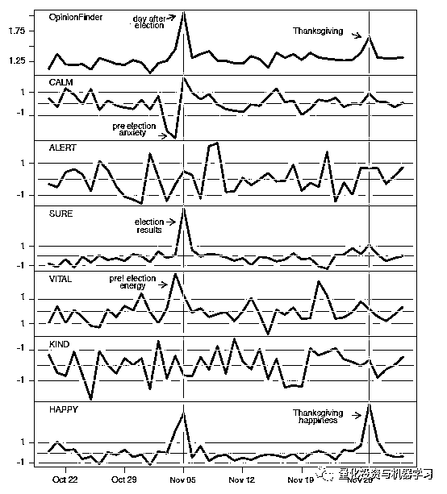
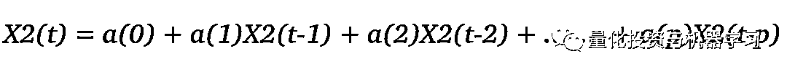
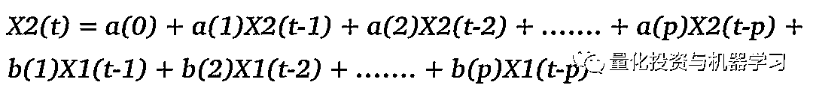
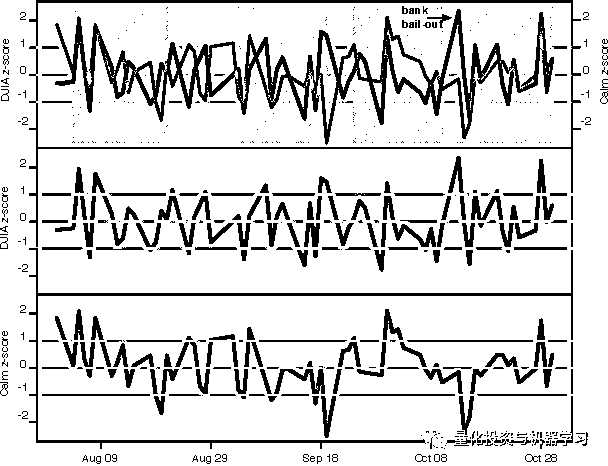
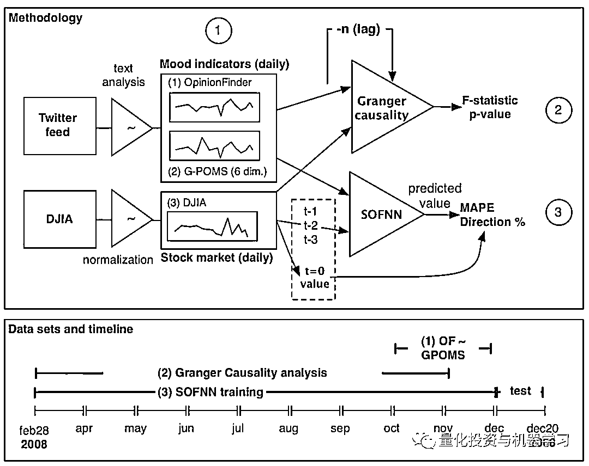

# 深入研读：利用 Twitter 情绪去预测股市

> 原文：[`mp.weixin.qq.com/s?__biz=MzAxNTc0Mjg0Mg==&mid=2653290402&idx=1&sn=efda9ea106991f4f7ccabcae9d809e00&chksm=802e3db7b759b4a173dc8f2ab5c298ab3146bfd7dd5aca75929c74ecc999a53b195c16f19c71&scene=27#wechat_redirect`](http://mp.weixin.qq.com/s?__biz=MzAxNTc0Mjg0Mg==&mid=2653290402&idx=1&sn=efda9ea106991f4f7ccabcae9d809e00&chksm=802e3db7b759b4a173dc8f2ab5c298ab3146bfd7dd5aca75929c74ecc999a53b195c16f19c71&scene=27#wechat_redirect)

**标星★公众号**，第一时间获取最新资讯

本期作者：Khan Saad Bin Hasan

本期编辑：axuan

**近期原创文章：**

## ♥ [2018 中国量化投资年度盘点【独家】](https://mp.weixin.qq.com/s?__biz=MzAxNTc0Mjg0Mg==&mid=2653290036&idx=1&sn=79dd3529dd9300b0a5d3d6fee4607904&chksm=802e3c21b759b537eda936128dd5e13a22257d623b605b4a52d1c0ccc7f05abfefc93d10e366&token=1337549942&lang=zh_CN&scene=21#wechat_redirect)

## **♥** [利用深度学习最新前沿预测股价走势](https://mp.weixin.qq.com/s?__biz=MzAxNTc0Mjg0Mg==&mid=2653290080&idx=1&sn=06c50cefe78a7b24c64c4fdb9739c7f3&chksm=802e3c75b759b563c01495d16a638a56ac7305fc324ee4917fd76c648f670b7f7276826bdaa8&token=770078636&lang=zh_CN&scene=21#wechat_redirect)

## ♥ [一位数据科学 PhD 眼中的算法交易](https://mp.weixin.qq.com/s?__biz=MzAxNTc0Mjg0Mg==&mid=2653290118&idx=1&sn=a261307470cf2f3e458ab4e7dc309179&chksm=802e3c93b759b585e079d3a797f512dfd0427ac02942339f4f1454bd368ba47be21cb52cf969&token=770078636&lang=zh_CN&scene=21#wechat_redirect)

## ♥ [深度学习是信号处理和时序分析的最后选择？](https://mp.weixin.qq.com/s?__biz=MzAxNTc0Mjg0Mg==&mid=2653289999&idx=1&sn=800b645653a3e36ce57ff82260d030dc&chksm=802e3c1ab759b50cf9fb931574f84001f4858997be6330251c139deef0272e9217aa62276ea5&token=770078636&lang=zh_CN&scene=21#wechat_redirect)

## ♥ [人工智能『AI』应用算法交易，7 个必踩的坑！](https://mp.weixin.qq.com/s?__biz=MzAxNTc0Mjg0Mg==&mid=2653289974&idx=1&sn=88f87cb64999d9406d7c618350aac35d&chksm=802e3fe3b759b6f5eca6e777364270cbaa0bf35e9a1535255be9751c3a77642676993a861132&token=770078636&lang=zh_CN&scene=21#wechat_redirect)

## ♥ [神经网络在算法交易上的应用系列（一）](https://mp.weixin.qq.com/s?__biz=MzAxNTc0Mjg0Mg==&mid=2653289962&idx=1&sn=5f5aa65ec00ce176501c85c7c106187d&chksm=802e3fffb759b6e9f2d4518f9d3755a68329c8753745333ef9d70ffd04bd088fd7b076318358&token=770078636&lang=zh_CN&scene=21#wechat_redirect)

## ♥ [预测股市 | 如何避免 p-Hacking，为什么你要看涨？](https://mp.weixin.qq.com/s?__biz=MzAxNTc0Mjg0Mg==&mid=2653289820&idx=1&sn=d3fee74ba1daab837433e4ef6b0ab4d9&chksm=802e3f49b759b65f422d20515942d5813aead73231da7d78e9f235bdb42386cf656079e69b8b&token=770078636&lang=zh_CN&scene=21#wechat_redirect)

## ♥ [如何鉴别那些用深度学习预测股价的花哨模型？](https://mp.weixin.qq.com/s?__biz=MzAxNTc0Mjg0Mg==&mid=2653290132&idx=1&sn=cbf1e2a4526e6e9305a6110c17063f46&chksm=802e3c81b759b597d3dd94b8008e150c90087567904a29c0c4b58d7be220a9ece2008956d5db&token=1266110554&lang=zh_CN&scene=21#wechat_redirect)

## ♥[ Quant 必备：学什么、哪家面试难、哪家挣大钱？](https://mp.weixin.qq.com/s?__biz=MzAxNTc0Mjg0Mg==&mid=2653290261&idx=2&sn=ee7cf7dabe50ed89adafdc92e980a48c&chksm=802e3d00b759b416875b2881ec5bc8a81d95208271c66f3680afd3cfbf27aa2e506398ae9e90&token=304730811&lang=zh_CN&scene=21#wechat_redirect)

**正文**

许多经济学家认为股票市场是随机的，因为它受随机事件的支配，有效市场假说和随机游走理论中对此也有所说明。但是这是真的吗?

研究人员对这一点进行了测试，他们试图预测股票市场，以表明确实有可能对市场走向有影响，而且似乎某些事实已经证明了他们的观点。这一领域的里程碑式的论文是由 Bollen 等人撰写的（*https://arxiv.org/pdf/1010.3003.pdf*）。本文中，我们将试图简单地解释他们是如何做的。

Bollen 使用公众观点（使用 Twitter）来证明推特上公众表达的情绪和股票市场表现之间存在关联。

**什么是股票市场？**

现在，大多数公司不是由一个简单的人所拥有，甚至不是一个单纯的组织，而是由大量的人所共享一个公司，这些人被称为股东。这些人都拥有公司的一部分股票，因此这些人也被称为股东。股票市场是一个你可以出售公司股票或购买公司股票的地方。

更正式地说，股票可以定义为:

> *公司股票是将公司所有权分成持有的股份。在美式英语中，股份通常被称为股票。单股份代表了公司的部分所有权，它与股份总数成比例。这通常使股东有权拥有部分的公司收益、资产清算所得（清偿所有优先债权，如有担保和无担保债务之后），或投票权，这通常按每个股东投资的金额来比例分配这些收益。（来自于维基百科）*

股票市场可以定义为:

> *股票市场是股票（也称为股份）的买方和卖方的集合（一个松散的经济交易网，它不是实体设施或实体），而股票代表着企业的所有权主张;这些可能包括公开的证券交易所上市的证券，以及只在私下交易的股票。（维基百科）*

如果你有兴趣了解更多，请参考这个链接：

*https://corporatefinanceinstitute.com/resources/knowledge/trading-investing/stock-market/*

现在有很多股票市场，我们的研究落脚点将是“纽约证券交易所”。为什么？因为它是最大的股票市场，大多数相关研究都以它为研究对象。现在，在继续我们的研究之前，需要理解一个术语，它是“道琼斯工业平均指数”，或者简称为“道琼斯指数”。

道琼斯工业平均指数是纽约证券交易所和纳斯达克交易的 30 只重要股票的价格加权平均值。道琼斯工业平均指数是查尔斯道在 1896 年发明的。

道琼斯工业平均指数通常被称为“道琼斯”, 道琼斯工业平均指数(DJIA)包括世界上最老、最受关注的一部分公司，有通用电气公司、华特迪士尼公司、埃克森美孚公司以及微软等公司。电视网络中的通常指的是道琼斯指数。

所以道琼斯指数为我们就研究股票市场是高走还是低走提供了一个很好的思路。那么 DJIA 到底衡量什么？它本身只是前 30 大公司股票价格的加权平均值，其中，价值更高的股票被赋予更大的权重，而最终的结果将被标准化以剔除偶然性事件。因此，它本身就是一个价格。

因此，有了 DJIA，我们现在就有了一个可靠的方法去了解市场一天的表现。现在我们需要的是一种能够挖掘公众意见的方式，为此我们借助 Twitter。

**Twitter 情绪分析**

机器能理解情感吗？不，他们不能，直到现在，我们不是指完美的不（而是相当不完美的不），因为机器现在可以理解各种各样的情感（尽管不是完美和可靠的），并且很容易被愚弄/迷惑。

使用机器学习可以测量某段文本中表达的情绪（或情感）。但是精确度还有待提高。但是，如果情感被明确表达，并且语言上的含义并没有被扭曲，那么我们可以建立一个可靠的情感分析模型。这是 Bollen 从推特上获得情绪表达的载体想法。

情感分析是机器学习中一个非常重要的应用，许多不同的（指的是很多）算法已经被用于从文本中获取情感这一现象就不足为奇了。让我们来看一个最简单和直观的算法。考虑一个文本：

> *“埃隆.马斯克的个性和他的人生哲学给我留下了非常深刻的印象，难怪特斯拉和太空探索技术公司（spaceX）做出了如此伟大的努力。”*

我们的算法将只关注重要的单词，如“非常”、“印象深刻”等。（而不是像“我”、“是”等词。我们的算法可能不知道 spaceX、 Elon、Musk, 所以这些词可能会被忽略掉）。现在，考虑到该算法之前已经遍历过正面积极的词（在该训练文本的时候），并发现诸如“漂亮”“印象深刻”“伟大”这样的词大多与正面情绪有关。因此我们的算法可能会将文本标记为积极。

这是 Textblob （文本分析工具：*https://textblob.readthedocs.io/en/dev/*）所采用的方法，它非常简单，Textblob 基于朴素贝叶斯算法工作。朴素贝叶斯算法是一种非常简单的算法，考虑到它的简单性，它给出的结果会很大。因此这个算法的思路是——考虑到每个单词所关联的文档类型，给每个单词赋予一个分数。从而出现在正面文本中的单词比出现在负面文本中的单词更有可能有更高(或更积极)的分数。因此如果积极的词出现在文档中，那么这个文本更有可能是正面的。因此，每个单词都有自己的分数，然后对这些分数进行平均，以获得文档的情感倾向。

当然，这种方法并不理想，尤其是在复杂的文档上，这样的方法会产生非常差的结果。因此，大多数研究者也会使用更复杂的分类器（如 SVMs，即支持向量机）来建立情感分析模型。

Bollen 使用了两种工具进行情感挖掘，一种是意见查找器，另一种是谷歌公司推出的关于情绪状态的个人资料服务。这些天我并没有见过很多人使用意见查找器，当然这个工具对于本博客来说也不是很重要，所以我们将把它放在谷歌情绪状态简介（或 GPOMS）上。

GPOMS 是一种工具，它可以帮助你准确地检测文本中表达的情绪。它基于情绪状态，由 65 或 37 个问题组成的调查问卷，而这将取决于你选择哪一个。对于每一个问题，你都用以下的词来表明你的感受——“一点也不”、“一点”、“适度”、“相当多”、“极度”。 因此，举个例子，对于“遗憾”的问题，你会指出你作为上述状态之一的感觉， 它会用一个标准来转换成分数，你的情感倾向将会根据你的反应来进行计算。这里有一个测试链接：*https://www.brianmac.co.uk/poms.htm*

那么，GPOMS 如何使用 POMS 从文本中预测情绪呢?你可以点击这个谷歌连接。Bollen 使用了谷歌发布的一个数据集。这个数据集包括从 1 万亿个英文网页文本中提取的 n-gram 的频率来计数。你可以在这里试试。那么 bollen 做了什么：他将 POMS 调查问卷中的每个单词与 google n-gram 数据集中的 n-gram 相关联,然后将最频繁出现的 N -gram 分成标记。现在这些单词中的每一个都有与之相关联的情绪，并且可以基于这些单词出现的情况来给它们一个加权分数，并根据这些词在文本中的出现的部分来用情感进行标记。

以上是我们对 Bollen 在论文中对这一方法解释的理解：

> *因此，词典中 964 个术语的扩充使得 GPOMS 得以在推文中捕捉更多自然流出的情绪术语，并将它们映射到各自的 POMS 情绪维度中。我们将每条推文中使用的术语与这一词典进行匹配。匹配 n-gram 术语的每个推文术语被映射回其原始 POMS 术语（根据其共同权重），并通过 POMS 评分表映射回其各自的 POMS 维度。因此，每个 POMS 情绪维度的得分被确定为与 GPOMS 词典匹配的每个推词的共现权重的加权和。*

不幸的是，GPOMS 不再可被自由获取，现在它是一个封闭的源代码工具（*http://101.96.10.75/cs229.stanford.edu/proj2011/GoelMittal-StockMarketPredictionUsingTwitterSentimentAnalysis.pdf*）。Goel- Mittal 用一种简单得多的方法建立了一个类似的模型（尽管不太准确）。他们使用 POMS 问卷中出现的单词的同义词，然后将它们映射到文本中。

根据他的 GPOMS 模型和意见调查者 Bollen 发现的人们的情绪倾向，得到的结果如下：

我们现在已经完成了四个部分中的两个，我们知道了如何衡量公众的情绪和市场的情绪。现在我们可以继续证明这两者之间确实是关联的。

**“时间序列”间的相关性**

如上图所示，我们已经获得了关于人们情绪的时间序列，类似的 DJIA 分数时间序列可以很容易地获得。现在，我们需要寻找一种方法来证明这些是相互关联的，或者人们的情绪(从推特上挖掘出来的)导致了股票市场的变化。

我们用格兰杰因果关系（Granger causality）来对它进行处理。那么到底什么是格兰杰因果检验呢?根据 Schoaropedia 的文章（*http://www.scholarpedia.org/article/Granger_causality*）

格兰杰因果关系（Granger causality）是基于预测的因果关系的统计概念。根据格兰杰因果关系，如果信号 X1 是信号 X2 的格兰杰原因（或 G-causes），则 X1 的过去值应该包含有助于预测 X2 的信息,而不仅仅是 X2 过去值中包含的信息。它的数学公式基于随机过程的线性回归模型( Granger 1969 )。非线性情况存在更复杂的扩展形式，然而这些扩展形式在实践中往往更难应用。

所以，如果我们有两个时间序列，比如 X1 和 X2，我们可以证明 X2 依赖于它的历史值，即：

这里， 至少有一个常数 不为零，那么我们可以说 取决于其历史值,已知上述关系后，如果 中至少有一个不为零，那么以下关系成立：

那么我们可以说 X1 是 X2 的格兰杰原因,  或者 X1 有预测 X2 的可能性。请参考这段视频可以更好地理解格兰杰因果关系。

在做了二元格兰杰因果分析后，Bollen 发现，在六种情绪状态（即平静、警觉、肯定、重要、善良和快乐）中，只有一种情绪状态，即“平静”情绪状态与股票市场的 Granger 因果关系最大，从 2 天到 6 天不等，另外四种情绪维度与股票市场没有显著的因果关系。

因此，Bollen 绘制了“平静”的时间序列（滞后 3 天）和 DJIA 时间序列，以显示两者之间的相关性：

阴影部分显示了具有显著相关性的部分。我们应该记住，平静图滞后 3 天，因此 Twitter 的数据不是可以同步对市场进行预测，而是在 3 天前预测市场。如果我们仔细观察的话，我们可以看到这个图中存在大量的相关性，因此现在我们可以确定两个时间序列之间存在相关性。我们可以利用这些信息来预测股票市场，以及见证我们预测的准确性有多高。

**预测股票市场**

现在，对于试金石数据，我们能根据现有的 Twitter 预测以前看不见的股票市场的将来趋势吗？

为了预测股票市场，Bollen 使用了一种叫做自组织模糊神经网络（SOFNN）的算法，他们使用了五层混合 SOFNN 模型来预测股票市场，并获得了令人印象深刻的结果。他们使用了不同的数据排列方式，例如，只有平静，平静和快乐交织等。他们在以非线性方式将平静和快乐结合在一起后获得的最佳准确率为 87.6 %。

那么，到底什么是 SOFNN？（*http://www.scholarpedia.org/article/Fuzzy_neural_network*）根据这篇 sholaropedia 的学术论文，结合模糊逻辑和神经网络的优点，为类似的任务创建了一个非常好的模型。这两个主题都超出了本文的范围。因此，我们将只简要讨论他们。

在进行计算机操作时，我们主要处理的是布尔逻辑或二进制逻辑，即任何实体都可认为 0 或 1。但是这种类型的逻辑在现实世界的许多场景中并不适用，因为我们一般会面临超过一个的结果，例如，游戏的结果主要是赢或输，但也可能是平局，或者也可能需要考虑到赢的差距，因此在 0 和 1 这两者之间可能会有更多的状态。对我们来说，这似乎比二进制(又称黑白)方法更自然，也更有助于模拟现实世界的情况。这种模糊方法是模糊逻辑背后的逻辑，你可以在这里读到更多（*http://www.scholarpedia.org/article/Fuzzy_neural_network*）

如果你没听说过神经网络，那么现在神经网络是个时髦的词。是时候了解一些相关的博客了。基本上，这是一个试图模仿人脑内部神经元的数学模型。

以下是 sholaropedia 对混合模糊神经网络的一个很好的解释：

> *混合神经模糊系统是同质的，一般而言，它与神经网络类似。这里,模糊系统被解释为一种特殊的神经网络。这种混合 NFS（神经模糊系统）的优点在于模糊系统和神经网络不必相互通信的架构。它们是一个完全融合的实体。这些系统可以在线或离线学习。*
> 
> *模糊系统的规则库被解释为一种神经网络。以模糊集为权重，而输入和输出变量以及规则则被构建成神经元。在学习步骤中可以包括或剔除神经元。最后，神经元网络代表了模糊知识库。 显然， 这两个基础系统的主要缺点都因此被克服了。*

**综合**

以上四个部分试图用来解释用于构建 Bollen 提出的模型的较小部分。现在，我们将研究的最终模型，来更好地理解可用于预测股票市场的模型:

首先，将来自于推特和 DJIA 中的原始数据进行提取和处理，然后使用情绪分析模型 Opinion Finder 和 GPOMS 对推特数据进行 Granger 因果检验，以证明推特上表达的情绪确实与 DJIA 值有一定的相关性。一旦上述情况成立，我们接下来就可以开始用 SOFNN 模型预测股市了。

**参考**

[1] Bollen, J, Mao, H., Zeng, X.: Twitter mood predicts the stock market. Jourmal of Computational Science,2(1),1-8(2011).

[2] Mittal, Anshul, and Arpit Goel. "Stock prediction using twitter sentiment analysis." Stanford CS229(2011)

http://cs229.stanford.edu/proj2011/GoelMia-

StockMarketPredicitionzUsingTwitrSentimentAnalysis,pdf ) (2012).

**推荐阅读**

[01、经过多年交易之后你应该学到的东西（深度分享）](https://mp.weixin.qq.com/s?__biz=MzAxNTc0Mjg0Mg==&mid=2653289074&idx=1&sn=e859d363eef9249236244466a1af41b6&chksm=802e3867b759b1717f77e07a51ee5671e8115130c66562577280ba1243cba08218add04f1f00&token=449379994&lang=zh_CN&scene=21#wechat_redirect)

[02、监督学习标签在股市中的应用（代码+书籍）](https://mp.weixin.qq.com/s?__biz=MzAxNTc0Mjg0Mg==&mid=2653289050&idx=1&sn=60043a5c95b877dd329a5fd150ddacc4&chksm=802e384fb759b1598e500087374772059aa21b31ae104b3dca04331cf4b63a233c5e04c1945a&token=449379994&lang=zh_CN&scene=21#wechat_redirect)

[03、全球投行顶尖机器学习团队全面分析](https://mp.weixin.qq.com/s?__biz=MzAxNTc0Mjg0Mg==&mid=2653289018&idx=1&sn=8c411f676c2c0d92b0dd218f041bee4b&chksm=802e382fb759b139ffebf633ac14cdd0f21938e4613fe632d5d9231dab3d2aca95a11628378a&token=449379994&lang=zh_CN&scene=21#wechat_redirect)

[04、使用 Tensorflow 预测股票市场变动](https://mp.weixin.qq.com/s?__biz=MzAxNTc0Mjg0Mg==&mid=2653289014&idx=1&sn=3762d405e332c599a21b48a7dc4df587&chksm=802e3823b759b135928d55044c2729aea9690f86752b680eb973d1a376dc53cfa18287d0060b&token=449379994&lang=zh_CN&scene=21#wechat_redirect)

[05、使用 LSTM 预测股票市场基于 Tensorflow](https://mp.weixin.qq.com/s?__biz=MzAxNTc0Mjg0Mg==&mid=2653289238&idx=1&sn=3144f5792f84455dd53c27a78e8a316c&chksm=802e3903b759b015da88acde4fcbc8547ab3e6acbb5a0897404bbefe1d8a414265d5d5766ee4&token=2020206794&lang=zh_CN&scene=21#wechat_redirect)

[06、美丽的回测——教你定量计算过拟合概率](https://mp.weixin.qq.com/s?__biz=MzAxNTc0Mjg0Mg==&mid=2653289314&idx=1&sn=87c5a12b23a875966db7be50d11f09cd&chksm=802e3977b759b061675d1988168c1fec06c602e8583fbcc9b76f87008e0c10b702acc85467a0&token=1972390229&lang=zh_CN&scene=21#wechat_redirect)

[07、利用动态深度学习预测金融时间序列基于 Python](https://mp.weixin.qq.com/s?__biz=MzAxNTc0Mjg0Mg==&mid=2653289347&idx=1&sn=bf5d7899bc4a854d4ba9046fdc6fe0d6&chksm=802e3996b759b080287213840987bb0a0c02e4e1d4d7aae23f10a225a92ef6dd922d8006123d&token=290397496&lang=zh_CN&scene=21#wechat_redirect)

[08、Facebook 开源神器 Prophet 预测时间序列基于 Python](https://mp.weixin.qq.com/s?__biz=MzAxNTc0Mjg0Mg==&mid=2653289394&idx=1&sn=24a836136d730aa268605628e683d629&chksm=802e39a7b759b0b1dcf7aaa560699130a907716b71fc9c45ff0e5d236c5ae8ef80ebdb09dbb6&token=290397496&lang=zh_CN&scene=21#wechat_redirect)

[09、Facebook 开源神器 Prophet 预测股市行情基于 Python](https://mp.weixin.qq.com/s?__biz=MzAxNTc0Mjg0Mg==&mid=2653289437&idx=1&sn=f0dca7da8e69e7ba736992cb3d034ce7&chksm=802e39c8b759b0de5bce401c580623d0729ecca69d13926479d36e19aff8c9c9e8a20265afff&token=290397496&lang=zh_CN&scene=21#wechat_redirect)

[10、2018 第三季度最受欢迎的券商金工研报前 50（附下载）](https://mp.weixin.qq.com/s?__biz=MzAxNTc0Mjg0Mg==&mid=2653289358&idx=1&sn=db6e8ab85b08f6e67790ec0e401e586e&chksm=802e399bb759b08d6eec855f9901ea856d0da68c7425cba62791b8948da6ad761a3d88543dad&token=290397496&lang=zh_CN&scene=21#wechat_redirect)

[11、实战交易策略的精髓（公众号深度呈现）](https://mp.weixin.qq.com/s?__biz=MzAxNTc0Mjg0Mg==&mid=2653289447&idx=1&sn=f2948715bf82569a6556d518e56c1f9e&chksm=802e39f2b759b0e4502d1aaac562b87789573b55c76b3c85897d8c9d88dbf9a0b7ee34d86a4e&token=290397496&lang=zh_CN&scene=21#wechat_redirect)

[12、Markowitz 有效边界和投资组合优化基于 Python](https://mp.weixin.qq.com/s?__biz=MzAxNTc0Mjg0Mg==&mid=2653289478&idx=1&sn=f8e01a641be021993d8ef2d84e94a299&chksm=802e3e13b759b7055cf27a280c672371008a5564c97c658eee89ce8481396a28d254836ff9af&token=290397496&lang=zh_CN&scene=21#wechat_redirect)

[13、使用 LSTM 模型预测股价基于 Keras](https://mp.weixin.qq.com/s?__biz=MzAxNTc0Mjg0Mg==&mid=2653289495&idx=1&sn=c4eeaa2e9f9c10995be9ea0c56d29ba7&chksm=802e3e02b759b7148227675c23c403fb9a543b733e3d27fa237b53840e030bf387a473d83e3c&token=1260956004&lang=zh_CN&scene=21#wechat_redirect)

[14、量化金融导论 1：资产收益的程式化介绍基于 Python](https://mp.weixin.qq.com/s?__biz=MzAxNTc0Mjg0Mg==&mid=2653289507&idx=1&sn=f0ca71aa07531bbbdbd33213f0bab89f&chksm=802e3e36b759b720138b3b17a4dd0e198e054b9de29a038fdd50805f824effa55831111ad026&token=1936245282&lang=zh_CN&scene=21#wechat_redirect)

[15、预测股市崩盘基于统计机器学习与神经网络（Python+文档）](https://mp.weixin.qq.com/s?__biz=MzAxNTc0Mjg0Mg==&mid=2653289533&idx=1&sn=4ef964834e84a9995111bb057b0fc5dd&chksm=802e3e28b759b73e0618eb1262c53aa0601fbf5805525a7c7ff40dc3db62c7704496611bdbf1&token=1950551577&lang=zh_CN&scene=21#wechat_redirect)

[16、实现最优投资组合有效前沿基于 Python（附代码）](https://mp.weixin.qq.com/s?__biz=MzAxNTc0Mjg0Mg==&mid=2653289609&idx=1&sn=c7f0b3e47025862d10bb53b6ab88bcda&chksm=802e3e9cb759b78abf6b8b049c59bf18ccfb2ead7580d1f557d36de2292f59dcbd94dcd41910&token=2085008037&lang=zh_CN&scene=21#wechat_redirect)

[17、精心为大家整理了一些超级棒的机器学习资料（附链接）](https://mp.weixin.qq.com/s?__biz=MzAxNTc0Mjg0Mg==&mid=2653289615&idx=1&sn=1cdc89afb997d0c580bf0cef296d946c&chksm=802e3e9ab759b78ce9f0cd152a680d4a413d6c8dcb02a7a296f4091993a7e4137e7520394575&token=2085008037&lang=zh_CN&scene=21#wechat_redirect)

[18、海量 Wind 数据，与全网用户零距离邂逅！](https://mp.weixin.qq.com/s?__biz=MzAxNTc0Mjg0Mg==&mid=2653289623&idx=1&sn=28a3600fd7a72d7be00b066ca0f98244&chksm=802e3e82b759b7943f43a4f6ef4a91e4153fa6b8210de9590235fa8ee66eb9811ce177054dbc&token=1389401983&lang=zh_CN&scene=21#wechat_redirect)

[19、机器学习、深度学习、量化金融、Python 等最新书籍汇总下载](https://mp.weixin.qq.com/s?__biz=MzAxNTc0Mjg0Mg==&mid=2653289640&idx=1&sn=34e94fcbe99052b8e7381ecc48a36dc0&chksm=802e3ebdb759b7ab897cd329a680715b6f8294e63550ddf0c57b9e1320b2b7d1408c6fdca0c7&token=1389401983&lang=zh_CN&scene=21#wechat_redirect)

[20、各大卖方 2019 年 A 股策略报告，都是有故事的人！](https://mp.weixin.qq.com/s?__biz=MzAxNTc0Mjg0Mg==&mid=2653289725&idx=1&sn=4b65cd1fb8331438e4c0b3d0eae6b51f&chksm=802e3ee8b759b7fe1b94e84d54cc23b0ab05853d5cd227812574b350e9fc2cce9e5f1bc6cb7a&token=1389401983&lang=zh_CN&scene=21#wechat_redirect)

**扫码关注我们**

